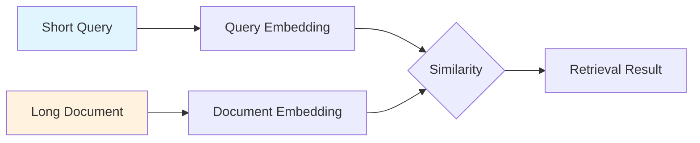

# Task-Type Specification

## Introduction

Not all embeddings are created equal. When you embed a query for search, it should be optimized differently than when you embed a document for indexing. Task-type specification tells the embedding model *how* you intend to use the embedding, allowing it to optimize the vector representation for your specific use case.

This is one of the most impactful yet often overlooked parameters. Using the correct task type can improve retrieval quality by 5-15% without any other changes.

### What We'll Cover

- Why task types matter for embedding quality
- Gemini's 8 task types and when to use each
- Cohere's 5 input types for different scenarios
- OpenAI and Voyage AI's approach to task specification
- Query vs document asymmetry in retrieval systems

### Prerequisites

- Completed [Embedding API Calls](./01-embedding-api-calls.md)
- Understanding of semantic search concepts

---

## Why Task Types Matter

Embedding models are trained on pairs of related texts. For retrieval, a query like "What is machine learning?" should match a document explaining "Machine learning is a subset of artificial intelligence that enables systems to learn from data."

The challenge: queries are typically short and question-like, while documents are longer and declarative. By specifying the task type, you tell the model to:

1. **Add implicit context** - The model may prepend internal prompts
2. **Adjust the embedding space** - Optimize for asymmetric similarity
3. **Weight features differently** - Prioritize relevance signals over exact matching



> **🤖 AI Context:** Task types implement "asymmetric" embeddings—the same text may produce different embeddings depending on whether it's a query or document. This is crucial for RAG systems where user questions must match knowledge base passages.

---

## Gemini Task Types

Gemini's `gemini-embedding-001` model supports 8 specialized task types, each optimized for different use cases.

### Complete Task Type Reference

| Task Type | Optimized For | Use Case Examples |
|-----------|---------------|-------------------|
| `RETRIEVAL_QUERY` | Search queries | User questions, search bar input |
| `RETRIEVAL_DOCUMENT` | Documents to be retrieved | Knowledge base articles, FAQ answers |
| `SEMANTIC_SIMILARITY` | Comparing text similarity | Duplicate detection, paraphrase identification |
| `CLASSIFICATION` | Text categorization | Sentiment analysis, topic classification |
| `CLUSTERING` | Grouping similar texts | Document organization, customer feedback analysis |
| `CODE_RETRIEVAL_QUERY` | Code search queries | "How to sort a list in Python" |
| `QUESTION_ANSWERING` | Q&A systems | Chatbot queries, FAQ matching |
| `FACT_VERIFICATION` | Fact-checking | Claim verification, source validation |

### Retrieval: Query vs Document

The most common use case is retrieval. Always use the matching pair:

```python
import google.generativeai as genai

# When indexing your knowledge base
document_embedding = genai.embed_content(
    model="models/gemini-embedding-001",
    content="Machine learning is a subset of AI that enables systems to learn from data.",
    task_type="RETRIEVAL_DOCUMENT",
    title="Introduction to Machine Learning",  # Optional but recommended
)

# When processing a user's search query
query_embedding = genai.embed_content(
    model="models/gemini-embedding-001",
    content="What is machine learning?",
    task_type="RETRIEVAL_QUERY",
)
```

> **Important:** Never mix task types! If you embed documents with `RETRIEVAL_DOCUMENT`, you must embed queries with `RETRIEVAL_QUERY` for optimal matching.

### Semantic Similarity

Use when comparing two texts for similarity without query/document distinction:

```python
# Comparing two sentences for similarity
text1 = "The cat sat on the mat."
text2 = "A feline rested on the rug."

emb1 = genai.embed_content(
    model="models/gemini-embedding-001",
    content=text1,
    task_type="SEMANTIC_SIMILARITY",
)

emb2 = genai.embed_content(
    model="models/gemini-embedding-001",
    content=text2,
    task_type="SEMANTIC_SIMILARITY",
)

# Both use the same task type - symmetric comparison
```

**Best for:**
- Duplicate detection
- Plagiarism checking  
- Paraphrase identification
- Recommendation systems (item-to-item similarity)

### Classification

Optimized for training and running classifiers:

```python
# Training examples
training_texts = [
    "This product is amazing! Best purchase ever.",  # Positive
    "Terrible quality. Waste of money.",              # Negative
    "It works as expected. Nothing special.",         # Neutral
]

embeddings = genai.embed_content(
    model="models/gemini-embedding-001",
    content=training_texts,
    task_type="CLASSIFICATION",
)

# Use embeddings as features for a classifier (SVM, logistic regression, etc.)
```

**Best for:**
- Sentiment analysis
- Spam detection
- Topic categorization
- Intent classification

### Clustering

Groups semantically similar documents together:

```python
documents = [
    "Apple announces new iPhone with advanced AI features",
    "Google releases Gemini 2.0 with multimodal capabilities",
    "Tesla stock surges after earnings report",
    "Amazon Prime Day breaks sales records",
    "Microsoft acquires gaming studio",
]

embeddings = genai.embed_content(
    model="models/gemini-embedding-001",
    content=documents,
    task_type="CLUSTERING",
)

# Use embeddings with K-means, HDBSCAN, or other clustering algorithms
```

**Best for:**
- Document organization
- Customer feedback categorization
- Market research analysis
- Anomaly detection (outliers from clusters)

### Code Retrieval

Specialized for searching code:

```python
# Embed code snippets for your codebase index
code_snippet = '''
def quicksort(arr):
    if len(arr) <= 1:
        return arr
    pivot = arr[len(arr) // 2]
    left = [x for x in arr if x < pivot]
    middle = [x for x in arr if x == pivot]
    right = [x for x in arr if x > pivot]
    return quicksort(left) + middle + quicksort(right)
'''

code_embedding = genai.embed_content(
    model="models/gemini-embedding-001",
    content=code_snippet,
    task_type="RETRIEVAL_DOCUMENT",  # Use RETRIEVAL_DOCUMENT for code blocks
)

# User searches for code
query_embedding = genai.embed_content(
    model="models/gemini-embedding-001",
    content="how to implement quicksort in python",
    task_type="CODE_RETRIEVAL_QUERY",  # Use CODE_RETRIEVAL_QUERY for code searches
)
```

### Question Answering

Optimized for Q&A and chatbot systems:

```python
# For FAQ-style systems
faq_pairs = [
    {"question": "How do I reset my password?", "answer": "Go to Settings > Security > Reset Password"},
    {"question": "What are your business hours?", "answer": "We're open Monday-Friday, 9 AM to 5 PM EST"},
]

# Embed the questions for matching
question_embeddings = genai.embed_content(
    model="models/gemini-embedding-001",
    content=[faq["question"] for faq in faq_pairs],
    task_type="QUESTION_ANSWERING",
)
```

### Fact Verification

For fact-checking and claim verification:

```python
claim = "The Eiffel Tower is located in Berlin."

claim_embedding = genai.embed_content(
    model="models/gemini-embedding-001",
    content=claim,
    task_type="FACT_VERIFICATION",
)

# Compare against verified facts in your knowledge base
```

---

## Cohere Input Types

Cohere requires the `input_type` parameter for all embedding calls. It supports 5 types:

### Input Type Reference

| Input Type | Purpose | When to Use |
|------------|---------|-------------|
| `search_document` | Texts to be searched | Documents, passages, FAQ answers |
| `search_query` | Search queries | User questions, search input |
| `classification` | Classification tasks | Training/inference for classifiers |
| `clustering` | Clustering tasks | Grouping similar documents |
| `image` | Image embeddings | When embedding images (embed-v4.0) |

### Search Document vs Search Query

```python
import cohere

co = cohere.ClientV2()

# Index your documents
documents = [
    "Python is a high-level programming language known for its readability.",
    "JavaScript is the language of the web browser.",
    "Rust focuses on memory safety without garbage collection.",
]

doc_response = co.embed(
    model="embed-v4.0",
    input_type="search_document",
    texts=documents,
)

# Process user query
query_response = co.embed(
    model="embed-v4.0",
    input_type="search_query",
    texts=["Which language is best for web development?"],
)
```

### Classification with Cohere

```python
# Training data for sentiment classifier
training_texts = [
    "I love this product!",
    "This is the worst experience ever.",
    "It's okay, nothing special.",
]

embeddings = co.embed(
    model="embed-v4.0",
    input_type="classification",
    texts=training_texts,
)

# embeddings.embeddings.float_ contains your feature vectors
```

---

## OpenAI and Voyage AI Approach

### OpenAI: No Task Types

OpenAI's embedding models are "general purpose" and don't require task type specification:

```python
from openai import OpenAI

client = OpenAI()

# Same API call for queries and documents
response = client.embeddings.create(
    model="text-embedding-3-small",
    input="Your text here",
)
```

OpenAI's models are trained to work well for both queries and documents without explicit task type hints. However, this means you can't optimize for specific use cases.

### Voyage AI: Optional Input Type

Voyage AI offers optional `input_type` for retrieval optimization:

```python
import voyageai

vo = voyageai.Client()

# For documents
doc_result = vo.embed(
    texts=["Document content here."],
    model="voyage-4-large",
    input_type="document",  # Optional but recommended
)

# For queries
query_result = vo.embed(
    texts=["User query here"],
    model="voyage-4-large",
    input_type="query",  # Optional but recommended
)
```

When `input_type` is specified, Voyage prepends an internal prompt:
- **Query:** "_Represent the query for retrieving supporting documents: _"
- **Document:** "_Represent the document for retrieval: _"

> **Note:** Embeddings generated with and without `input_type` are compatible—you can mix them, but performance is best when used consistently.

---

## Sentence Transformers Task Types

For local models using Sentence Transformers, task type is handled through prompts:

```python
from sentence_transformers import SentenceTransformer

model = SentenceTransformer("mixedbread-ai/mxbai-embed-large-v1")

# Using encode_query for queries
query_embedding = model.encode_query("What is machine learning?")

# Using encode_document for documents
doc_embedding = model.encode_document(
    "Machine learning is a subset of AI that enables systems to learn from data."
)
```

Alternatively, use prompts directly:

```python
# Models with custom prompts
model = SentenceTransformer(
    "all-mpnet-base-v2",
    prompts={"query": "query: ", "passage": "passage: "},
)

# Apply prompt by name
query_emb = model.encode("What is AI?", prompt_name="query")
doc_emb = model.encode("AI is...", prompt_name="passage")
```

---

## Common Mistakes

| ❌ Mistake | ✅ Solution |
|-----------|-------------|
| Using `RETRIEVAL_QUERY` for documents | Use `RETRIEVAL_DOCUMENT` for content you're searching *in* |
| Mixing task types inconsistently | Establish a clear indexing/query strategy |
| Ignoring task types entirely | Always specify when available |
| Using `SEMANTIC_SIMILARITY` for retrieval | Use retrieval-specific types for asymmetric search |
| Same task type for code and natural language | Use `CODE_RETRIEVAL_QUERY` for code search queries |

---

## Best Practices

| Practice | Why It Matters |
|----------|----------------|
| Document your task type choices | Team members need to use the same types |
| Use retrieval pairs consistently | Mixing types degrades search quality |
| Test with and without task types | Measure the actual impact on your data |
| Consider domain-specific types | `CODE_RETRIEVAL_QUERY` for code, etc. |
| Store task type with embeddings | You'll need it when adding new content |

---

## Hands-on Exercise

### Your Task

Build a simple FAQ matcher that uses task types correctly:

1. Create a list of 5 FAQ question-answer pairs
2. Embed the questions using the appropriate task type
3. Accept a user query and find the best matching FAQ
4. Return the corresponding answer

### Requirements

1. Use Gemini or Cohere with explicit task types
2. Use `QUESTION_ANSWERING` (Gemini) or `search_document`/`search_query` (Cohere)
3. Calculate cosine similarity to find the best match
4. Return the answer for the top-matching question

<details>
<summary>💡 Hints</summary>

- Embed FAQ questions with `QUESTION_ANSWERING` or `search_document`
- Embed user queries with the matching query type
- Use numpy for cosine similarity: `np.dot(a, b) / (np.linalg.norm(a) * np.linalg.norm(b))`

</details>

<details>
<summary>✅ Solution</summary>

```python
import google.generativeai as genai
import numpy as np

# Configure API
genai.configure(api_key="YOUR_API_KEY")

# FAQ database
faqs = [
    {"q": "How do I reset my password?", "a": "Go to Settings > Account > Reset Password"},
    {"q": "What are your shipping options?", "a": "We offer Standard (5-7 days) and Express (2-3 days)"},
    {"q": "Can I return an item?", "a": "Yes, returns are accepted within 30 days"},
    {"q": "How do I track my order?", "a": "Check your email for tracking link or visit Orders page"},
    {"q": "What payment methods do you accept?", "a": "We accept Visa, Mastercard, PayPal, and Apple Pay"},
]

def cosine_similarity(a, b):
    return np.dot(a, b) / (np.linalg.norm(a) * np.linalg.norm(b))

def embed_faqs(faqs):
    """Embed FAQ questions for matching."""
    questions = [faq["q"] for faq in faqs]
    result = genai.embed_content(
        model="models/gemini-embedding-001",
        content=questions,
        task_type="QUESTION_ANSWERING",
    )
    return result['embedding']

def find_answer(user_query, faq_embeddings, faqs):
    """Find the best matching FAQ for a user query."""
    # Embed the user query
    query_result = genai.embed_content(
        model="models/gemini-embedding-001",
        content=user_query,
        task_type="QUESTION_ANSWERING",
    )
    query_embedding = query_result['embedding']
    
    # Find best match
    similarities = [
        cosine_similarity(query_embedding, faq_emb)
        for faq_emb in faq_embeddings
    ]
    
    best_idx = np.argmax(similarities)
    best_score = similarities[best_idx]
    
    return {
        "matched_question": faqs[best_idx]["q"],
        "answer": faqs[best_idx]["a"],
        "confidence": best_score,
    }

# Usage
faq_embeddings = embed_faqs(faqs)

user_query = "how can I send back something I bought?"
result = find_answer(user_query, faq_embeddings, faqs)

print(f"Query: {user_query}")
print(f"Matched: {result['matched_question']}")
print(f"Answer: {result['answer']}")
print(f"Confidence: {result['confidence']:.3f}")
```

**Output:**
```
Query: how can I send back something I bought?
Matched: Can I return an item?
Answer: Yes, returns are accepted within 30 days
Confidence: 0.847
```

</details>

---

## Summary

✅ Task types optimize embeddings for specific use cases (retrieval, classification, clustering)

✅ Gemini offers 8 task types including specialized options for code and fact verification

✅ Cohere requires `input_type` for all calls (5 options)

✅ Always pair `RETRIEVAL_QUERY` with `RETRIEVAL_DOCUMENT` for search applications

✅ OpenAI doesn't use task types—models are general purpose

**Next:** [Dimension Control](./03-dimension-control.md)

---

## Further Reading

- [Gemini Embeddings Task Types](https://ai.google.dev/gemini-api/docs/embeddings#task-types)
- [Cohere Input Types](https://docs.cohere.com/reference/embed)
- [Sentence Transformers Prompts](https://sbert.net/docs/sentence_transformer/usage/usage.html#prompts)

---

<!-- 
Sources Consulted:
- Gemini Embeddings: https://ai.google.dev/gemini-api/docs/embeddings
- Cohere Embed API v2: https://docs.cohere.com/reference/embed
- Voyage AI: https://docs.voyageai.com/docs/embeddings
- Sentence Transformers: https://sbert.net/docs/package_reference/sentence_transformer/SentenceTransformer.html
-->
