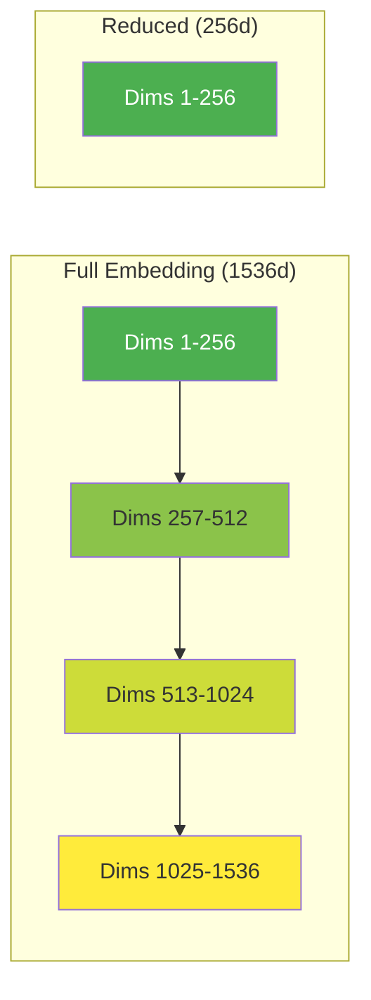

# Dimension Control

## Introduction

Embedding dimensions directly impact your system's memory usage, search speed, and—surprisingly—sometimes quality. Modern "Matryoshka" embeddings let you reduce dimensions at query time while retaining most of the semantic information, giving you fine-grained control over the performance-quality tradeoff.

In this lesson, we'll explore how to control embedding dimensions across different providers and understand when dimension reduction makes sense.

### What We'll Cover

- What Matryoshka embeddings are and why they matter
- Dimension control parameters for each provider
- Quality vs storage/speed tradeoffs
- Critical normalization requirements after dimension reduction

### Prerequisites

- Completed [Embedding API Calls](./01-embedding-api-calls.md)
- Basic understanding of vector storage concepts

---

## Understanding Matryoshka Embeddings

Traditional embeddings have fixed dimensions—if a model outputs 1536 dimensions, you get exactly 1536 numbers. Matryoshka embeddings (named after Russian nesting dolls) are trained so that the *first N dimensions* contain the most important information.



**Key insight:** You can truncate a Matryoshka embedding to any smaller size and it remains useful—the first dimensions carry the most semantic weight.

### Why This Matters

| Dimensions | Storage (32-bit) | Search Speed | Use Case |
|------------|------------------|--------------|----------|
| 3072 | 12 KB/vector | Slowest | Maximum quality research |
| 1536 | 6 KB/vector | Fast | Production default |
| 768 | 3 KB/vector | Faster | Mobile/edge |
| 256 | 1 KB/vector | Fastest | High-volume, cost-sensitive |

> **🤖 AI Context:** Many RAG systems use reduced dimensions (512-768) for initial retrieval, then rerank with full embeddings. This "coarse-to-fine" approach balances speed and quality.

---

## OpenAI Dimension Control

OpenAI's `text-embedding-3-*` models support the `dimensions` parameter for Matryoshka-style reduction:

```python
from openai import OpenAI

client = OpenAI()

# Full dimensions (default)
full_response = client.embeddings.create(
    model="text-embedding-3-small",
    input="Hello, world!",
)
print(f"Full: {len(full_response.data[0].embedding)} dimensions")

# Reduced dimensions
reduced_response = client.embeddings.create(
    model="text-embedding-3-small",
    input="Hello, world!",
    dimensions=256,
)
print(f"Reduced: {len(reduced_response.data[0].embedding)} dimensions")
```

**Output:**
```
Full: 1536 dimensions
Reduced: 256 dimensions
```

### OpenAI Model Dimensions

| Model | Default Dimensions | Supported Range |
|-------|-------------------|-----------------|
| `text-embedding-3-small` | 1536 | 1-1536 |
| `text-embedding-3-large` | 3072 | 1-3072 |
| `text-embedding-ada-002` | 1536 | Not adjustable |

> **Note:** The older `text-embedding-ada-002` model doesn't support dimension reduction—you must use the v3 models.

### Quality Retention (OpenAI)

OpenAI's models retain quality well even at reduced dimensions:

| Model | Dimensions | MTEB Score | Relative Quality |
|-------|------------|------------|------------------|
| text-embedding-3-large | 3072 | 64.6 | 100% |
| text-embedding-3-large | 1536 | 64.1 | 99.2% |
| text-embedding-3-large | 256 | 62.0 | 96.0% |
| text-embedding-3-small | 1536 | 62.3 | 100% |
| text-embedding-3-small | 512 | 61.6 | 98.9% |

---

## Gemini Dimension Control

Gemini's `gemini-embedding-001` uses the `output_dimensionality` parameter:

```python
import google.generativeai as genai

genai.configure(api_key="YOUR_API_KEY")

# Full dimensions (3072 default)
full_result = genai.embed_content(
    model="models/gemini-embedding-001",
    content="Hello, world!",
    task_type="RETRIEVAL_DOCUMENT",
)
print(f"Full: {len(full_result['embedding'])} dimensions")

# Reduced dimensions
reduced_result = genai.embed_content(
    model="models/gemini-embedding-001",
    content="Hello, world!",
    task_type="RETRIEVAL_DOCUMENT",
    output_dimensionality=768,
)
print(f"Reduced: {len(reduced_result['embedding'])} dimensions")
```

**Output:**
```
Full: 3072 dimensions
Reduced: 768 dimensions
```

### Gemini Recommended Dimensions

Google recommends specific dimension values for optimal quality:

| Dimensions | MTEB Score | Relative Quality | Recommended For |
|------------|------------|------------------|-----------------|
| 3072 | 68.16 | 100% | Maximum quality |
| 1536 | 68.17 | 100% | Production default |
| 768 | 67.99 | 99.8% | Cost-sensitive production |
| 512 | 67.55 | 99.1% | High-volume systems |
| 256 | — | ~97% | Edge/mobile |

> **⚠️ Critical Warning:** Gemini embeddings at 768d and 1536d are **not pre-normalized**. You must manually normalize them! See the [Normalization lesson](./07-embedding-normalization.md) for details.

### Gemini Dimension Range

| Parameter | Range |
|-----------|-------|
| `output_dimensionality` | 128-3072 |

---

## Cohere Dimension Control

Cohere's `embed-v4.0` supports dimension reduction via `output_dimension`:

```python
import cohere

co = cohere.ClientV2()

# Default dimensions (1536)
full_response = co.embed(
    model="embed-v4.0",
    input_type="search_document",
    texts=["Hello, world!"],
)
print(f"Full: {len(full_response.embeddings.float_[0])} dimensions")

# Reduced dimensions
reduced_response = co.embed(
    model="embed-v4.0",
    input_type="search_document",
    texts=["Hello, world!"],
    output_dimension=256,
)
print(f"Reduced: {len(reduced_response.embeddings.float_[0])} dimensions")
```

**Output:**
```
Full: 1536 dimensions
Reduced: 256 dimensions
```

### Cohere Supported Dimensions

| Value | Storage | Notes |
|-------|---------|-------|
| 1536 | 6 KB | Default, maximum quality |
| 1024 | 4 KB | Good balance |
| 512 | 2 KB | Cost-effective |
| 256 | 1 KB | Minimum, fastest |

> **Note:** Cohere only supports these 4 specific values—you cannot request arbitrary dimensions like 768.

---

## Voyage AI Dimension Control

Voyage AI's v4 models support flexible dimensions via `output_dimension`:

```python
import voyageai

vo = voyageai.Client()

# Default dimensions (1024)
full_result = vo.embed(
    texts=["Hello, world!"],
    model="voyage-4-large",
    input_type="document",
)
print(f"Full: {len(full_result.embeddings[0])} dimensions")

# Reduced dimensions
reduced_result = vo.embed(
    texts=["Hello, world!"],
    model="voyage-4-large",
    input_type="document",
    output_dimension=256,
)
print(f"Reduced: {len(reduced_result.embeddings[0])} dimensions")
```

**Output:**
```
Full: 1024 dimensions
Reduced: 256 dimensions
```

### Voyage Supported Dimensions

| Model Series | Supported Dimensions |
|--------------|---------------------|
| voyage-4-*, voyage-3.5-*, voyage-code-3 | 256, 512, 1024 (default), 2048 |
| voyage-law-2, voyage-finance-2 | 1024 only (fixed) |

---

## Sentence Transformers Dimension Control

For local models, use `truncate_dim` parameter:

```python
from sentence_transformers import SentenceTransformer

# Method 1: Set at initialization
model = SentenceTransformer("all-mpnet-base-v2", truncate_dim=256)
embedding = model.encode("Hello, world!")
print(f"Truncated: {len(embedding)} dimensions")

# Method 2: Context manager for temporary truncation
model = SentenceTransformer("all-mpnet-base-v2")

with model.truncate_sentence_embeddings(truncate_dim=256):
    truncated = model.encode("Hello, world!")
    print(f"Truncated: {len(truncated)} dimensions")

full = model.encode("Hello, world!")
print(f"Full: {len(full)} dimensions")
```

**Output:**
```
Truncated: 256 dimensions
Truncated: 256 dimensions
Full: 768 dimensions
```

> **Important:** Not all models are trained as Matryoshka models. Truncating a non-Matryoshka model will significantly degrade quality. Check the model card for "Matryoshka" support.

### Finding Matryoshka Models

Look for these indicators on Hugging Face model cards:
- "Matryoshka" in the model name or description
- `MatryoshkaLoss` in training details
- Documented dimension reduction support

**Popular Matryoshka models:**
- `nomic-ai/nomic-embed-text-v1.5`
- `mixedbread-ai/mxbai-embed-large-v1`
- `Alibaba-NLP/gte-Qwen2-7B-instruct`

---

## When to Reduce Dimensions

### Reduce Dimensions When:

| Scenario | Recommended Dimensions | Reason |
|----------|------------------------|--------|
| Millions of vectors | 256-512 | Storage costs |
| Real-time search (<10ms) | 256-512 | Speed |
| Edge/mobile deployment | 256 | Memory constraints |
| Initial retrieval stage | 256-512 | Then rerank with full |
| Cost-sensitive production | 512-768 | Balance quality/cost |

### Keep Full Dimensions When:

| Scenario | Why |
|----------|-----|
| Research/evaluation | Maximum quality needed |
| Small corpus (<100K docs) | Storage not a concern |
| Reranking stage | Quality critical |
| Fine-tuned models | May not be Matryoshka-trained |

---

## Client-Side Truncation (Fallback)

If your provider doesn't support API-level dimension reduction, you can truncate client-side—but only for Matryoshka models:

```python
import numpy as np

def truncate_embedding(embedding: list[float], target_dim: int) -> list[float]:
    """Truncate embedding and re-normalize (L2)."""
    truncated = embedding[:target_dim]
    
    # CRITICAL: Re-normalize after truncation
    norm = np.linalg.norm(truncated)
    if norm > 0:
        truncated = (np.array(truncated) / norm).tolist()
    
    return truncated

# Example usage
full_embedding = [0.1, 0.2, 0.3, 0.4, 0.5, ...]  # 1536 dimensions
reduced = truncate_embedding(full_embedding, 256)
```

> **⚠️ Warning:** You MUST re-normalize after client-side truncation. Without normalization, cosine similarity calculations will be incorrect.

---

## Best Practices

| ✅ Do | ❌ Don't |
|-------|---------|
| Use API-level `dimensions` parameter | Truncate non-Matryoshka embeddings |
| Always normalize after truncation | Assume reduced embeddings are normalized |
| Test quality at your target dimensions | Blindly reduce to minimum |
| Document dimension choices | Mix different dimensions in same index |
| Consider two-stage retrieval | Use reduced dims for final ranking |

---

## Hands-on Exercise

### Your Task

Compare embedding quality at different dimensions:

1. Embed 5 semantically similar sentence pairs
2. Embed 5 semantically different sentence pairs
3. Calculate cosine similarity at full dimensions and at 256 dimensions
4. Compare how well the model distinguishes similar from different pairs

### Requirements

1. Use OpenAI or Gemini with dimension control
2. Calculate average similarity for similar pairs and different pairs
3. Report the "discrimination gap" (avg similar - avg different) at each dimension

<details>
<summary>💡 Hints</summary>

- Similar pairs should have similarity > 0.8
- Different pairs should have similarity < 0.5
- The discrimination gap shows how well the model separates similar from different

</details>

<details>
<summary>✅ Solution</summary>

```python
from openai import OpenAI
import numpy as np

client = OpenAI()

similar_pairs = [
    ("The cat sat on the mat.", "A feline rested on the rug."),
    ("Machine learning is transforming industries.", "AI is revolutionizing business."),
    ("The quick brown fox jumps.", "A fast auburn fox leaps."),
    ("Python is great for data science.", "Python excels at data analysis."),
    ("The weather is beautiful today.", "It's a lovely day outside."),
]

different_pairs = [
    ("The cat sat on the mat.", "The stock market crashed yesterday."),
    ("Machine learning is transforming industries.", "I love eating pizza."),
    ("The quick brown fox jumps.", "Quantum physics is complex."),
    ("Python is great for data science.", "The Eiffel Tower is in Paris."),
    ("The weather is beautiful today.", "My car needs new tires."),
]

def cosine_similarity(a, b):
    return np.dot(a, b) / (np.linalg.norm(a) * np.linalg.norm(b))

def get_embeddings(texts, dimensions=None):
    kwargs = {"model": "text-embedding-3-small", "input": texts}
    if dimensions:
        kwargs["dimensions"] = dimensions
    response = client.embeddings.create(**kwargs)
    return [item.embedding for item in response.data]

def evaluate_dimension(dimensions=None):
    dim_label = dimensions or "full (1536)"
    
    # Embed all texts
    all_texts = []
    for pair in similar_pairs + different_pairs:
        all_texts.extend(pair)
    
    embeddings = get_embeddings(all_texts, dimensions)
    
    # Calculate similarities
    similar_sims = []
    different_sims = []
    
    for i in range(5):
        idx = i * 2
        sim = cosine_similarity(embeddings[idx], embeddings[idx + 1])
        similar_sims.append(sim)
    
    for i in range(5):
        idx = 10 + i * 2
        sim = cosine_similarity(embeddings[idx], embeddings[idx + 1])
        different_sims.append(sim)
    
    avg_similar = np.mean(similar_sims)
    avg_different = np.mean(different_sims)
    gap = avg_similar - avg_different
    
    print(f"\n{dim_label}:")
    print(f"  Avg similar: {avg_similar:.4f}")
    print(f"  Avg different: {avg_different:.4f}")
    print(f"  Discrimination gap: {gap:.4f}")
    
    return gap

# Compare dimensions
print("Comparing embedding quality at different dimensions:")
gap_full = evaluate_dimension(None)
gap_512 = evaluate_dimension(512)
gap_256 = evaluate_dimension(256)

print(f"\nQuality retention:")
print(f"  512d vs full: {gap_512/gap_full*100:.1f}%")
print(f"  256d vs full: {gap_256/gap_full*100:.1f}%")
```

**Sample Output:**
```
Comparing embedding quality at different dimensions:

full (1536):
  Avg similar: 0.8721
  Avg different: 0.2134
  Discrimination gap: 0.6587

512:
  Avg similar: 0.8698
  Avg different: 0.2156
  Discrimination gap: 0.6542

256:
  Avg similar: 0.8612
  Avg different: 0.2201
  Discrimination gap: 0.6411

Quality retention:
  512d vs full: 99.3%
  256d vs full: 97.3%
```

</details>

---

## Summary

✅ Matryoshka embeddings allow dimension reduction with minimal quality loss

✅ OpenAI uses `dimensions`, Gemini uses `output_dimensionality`, Cohere uses `output_dimension`

✅ Reducing from 1536 to 256 typically retains 95-97% of quality

✅ **Always re-normalize after dimension reduction**—especially for Gemini at 768/1536d

✅ Consider two-stage retrieval: fast search with reduced dims, rerank with full

**Next:** [Batch Processing](./04-batch-processing.md)

---

## Further Reading

- [OpenAI Embeddings Documentation](https://platform.openai.com/docs/guides/embeddings)
- [Matryoshka Representation Learning Paper](https://arxiv.org/abs/2205.13147)
- [Gemini Embedding Dimensions](https://ai.google.dev/gemini-api/docs/embeddings)
- [Sentence Transformers Matryoshka](https://sbert.net/examples/sentence_transformer/training/matryoshka/README.html)

---

<!-- 
Sources Consulted:
- OpenAI Embeddings API: https://platform.openai.com/docs/api-reference/embeddings
- Gemini Embeddings: https://ai.google.dev/gemini-api/docs/embeddings
- Cohere Embed API v2: https://docs.cohere.com/reference/embed
- Voyage AI: https://docs.voyageai.com/docs/embeddings
- Sentence Transformers: https://sbert.net/docs/package_reference/sentence_transformer/SentenceTransformer.html
-->
