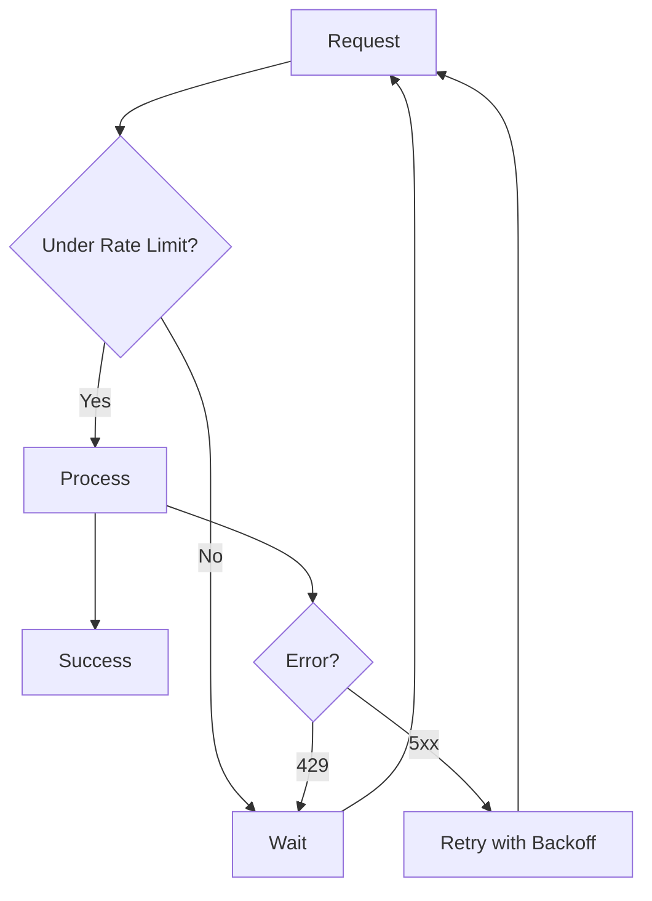

# Batch Processing

## Introduction

Embedding one text at a time is simple but inefficient. When you need to embed thousands or millions of documents, batch processing becomes essential—reducing API calls, improving throughput, and often lowering costs.

In this lesson, we'll explore batch processing strategies across providers, including synchronous batching, asynchronous batch APIs, rate limit management, and patterns for processing large corpora efficiently.

### What We'll Cover

- Batch size limits and optimal configurations
- Synchronous vs asynchronous batch processing
- Gemini's Batch API with 50% cost reduction
- Rate limit management and backpressure handling
- Patterns for processing large document sets

### Prerequisites

- Completed [Embedding API Calls](./01-embedding-api-calls.md)
- Understanding of async Python (`asyncio`)

---

## Why Batch Processing Matters

Consider embedding 100,000 documents:

| Approach | API Calls | Time (estimated) | Cost Factor |
|----------|-----------|------------------|-------------|
| One at a time | 100,000 | ~27 hours | 1.0x |
| Batches of 100 | 1,000 | ~16 minutes | 1.0x |
| Async batches | ~1,000 | ~2 minutes | 1.0x |
| Gemini Batch API | 1 | ~30 min (async) | **0.5x** |

> **🤖 AI Context:** Production RAG systems typically embed millions of documents. The difference between naive and optimized batching can be days of processing time and thousands of dollars in API costs.

---

## Provider Batch Limits

### OpenAI

| Limit | Value |
|-------|-------|
| Max inputs per request | 2,048 |
| Max tokens per input | 8,192 |
| Max total tokens per request | 300,000 |

```python
from openai import OpenAI

client = OpenAI()

# Batch embedding - up to 2048 texts per call
texts = ["Document " + str(i) for i in range(100)]

response = client.embeddings.create(
    model="text-embedding-3-small",
    input=texts,  # Pass list directly
)

embeddings = [item.embedding for item in response.data]
print(f"Embedded {len(embeddings)} texts in one API call")
```

**Output:**
```
Embedded 100 texts in one API call
```

### Gemini

| Limit | Value |
|-------|-------|
| Max content items per request | 100 |
| Max tokens per item | 2,048 |
| Batch API discount | 50% off |

```python
import google.generativeai as genai

genai.configure(api_key="YOUR_API_KEY")

# Batch embedding - up to 100 texts per call
texts = ["Document " + str(i) for i in range(100)]

result = genai.embed_content(
    model="models/gemini-embedding-001",
    content=texts,
    task_type="RETRIEVAL_DOCUMENT",
)

embeddings = result['embedding']
print(f"Embedded {len(embeddings)} texts")
```

### Cohere

| Limit | Value |
|-------|-------|
| Max texts per request | 96 |
| Max images per request | 1 |
| Max mixed inputs | 96 |

```python
import cohere

co = cohere.ClientV2()

# Batch embedding - up to 96 texts per call
texts = ["Document " + str(i) for i in range(96)]

response = co.embed(
    model="embed-v4.0",
    input_type="search_document",
    texts=texts,
)

embeddings = response.embeddings.float_
print(f"Embedded {len(embeddings)} texts")
```

### Voyage AI

| Model Tier | Max Texts | Max Total Tokens |
|------------|-----------|------------------|
| voyage-4-lite, voyage-3.5-lite | 1,000 | 1M |
| voyage-4, voyage-3.5 | 1,000 | 320K |
| voyage-4-large, voyage-code-3 | 1,000 | 120K |

```python
import voyageai

vo = voyageai.Client()

# Batch embedding - up to 1000 texts
texts = ["Document " + str(i) for i in range(500)]

result = vo.embed(
    texts=texts,
    model="voyage-4",
    input_type="document",
)

print(f"Embedded {len(result.embeddings)} texts")
print(f"Total tokens used: {result.total_tokens}")
```

---

## Optimal Batch Sizes

The "optimal" batch size depends on your use case:

| Priority | Recommended Batch Size | Why |
|----------|------------------------|-----|
| Minimize latency | 1-10 | Quick response for real-time |
| Balance latency/throughput | 50-100 | Good for most applications |
| Maximize throughput | Provider max | Bulk processing |
| Memory constrained | 10-50 | Reduce memory spikes |

### Chunking Large Document Sets

```python
from openai import OpenAI

def chunk_list(items: list, chunk_size: int):
    """Split a list into chunks of specified size."""
    for i in range(0, len(items), chunk_size):
        yield items[i:i + chunk_size]

def embed_all(texts: list[str], batch_size: int = 100) -> list[list[float]]:
    """Embed all texts in batches."""
    client = OpenAI()
    all_embeddings = []
    
    for i, batch in enumerate(chunk_list(texts, batch_size)):
        print(f"Processing batch {i + 1}...")
        response = client.embeddings.create(
            model="text-embedding-3-small",
            input=batch,
        )
        batch_embeddings = [item.embedding for item in response.data]
        all_embeddings.extend(batch_embeddings)
    
    return all_embeddings

# Usage
documents = ["Document " + str(i) for i in range(500)]
embeddings = embed_all(documents, batch_size=100)
print(f"Total embeddings: {len(embeddings)}")
```

**Output:**
```
Processing batch 1...
Processing batch 2...
Processing batch 3...
Processing batch 4...
Processing batch 5...
Total embeddings: 500
```

---

## Asynchronous Batch Processing

For maximum throughput, process batches concurrently:

```python
import asyncio
from openai import AsyncOpenAI

async def embed_batch_async(
    client: AsyncOpenAI,
    texts: list[str],
    semaphore: asyncio.Semaphore
) -> list[list[float]]:
    """Embed a batch with concurrency control."""
    async with semaphore:
        response = await client.embeddings.create(
            model="text-embedding-3-small",
            input=texts,
        )
        return [item.embedding for item in response.data]

async def embed_all_async(
    texts: list[str],
    batch_size: int = 100,
    max_concurrent: int = 5
) -> list[list[float]]:
    """Embed all texts with concurrent batches."""
    client = AsyncOpenAI()
    semaphore = asyncio.Semaphore(max_concurrent)
    
    # Create batches
    batches = list(chunk_list(texts, batch_size))
    
    # Process concurrently
    tasks = [embed_batch_async(client, batch, semaphore) for batch in batches]
    results = await asyncio.gather(*tasks)
    
    # Flatten results
    return [emb for batch_result in results for emb in batch_result]

# Usage
async def main():
    documents = ["Document " + str(i) for i in range(1000)]
    embeddings = await embed_all_async(documents, batch_size=100, max_concurrent=5)
    print(f"Total embeddings: {len(embeddings)}")

# asyncio.run(main())
```

### Concurrency Recommendations

| Provider | Max Concurrent Requests | Notes |
|----------|------------------------|-------|
| OpenAI | 5-10 | Depends on tier |
| Gemini | 3-5 | Conservative for free tier |
| Cohere | 5-10 | Production key |
| Voyage | 5-10 | Check dashboard |

> **Warning:** Too much concurrency triggers rate limits. Start conservative and increase gradually.

---

## Gemini Batch API (50% Discount)

Gemini offers an asynchronous Batch API with 50% cost reduction—ideal for bulk processing where latency isn't critical:

```python
import google.generativeai as genai
import time

genai.configure(api_key="YOUR_API_KEY")

# Create batch request
batch_request = {
    "requests": [
        {
            "model": "models/gemini-embedding-001",
            "content": {"parts": [{"text": f"Document {i}"}]},
            "task_type": "RETRIEVAL_DOCUMENT",
        }
        for i in range(1000)
    ]
}

# Submit batch (async operation)
# Note: Actual batch API syntax may vary - check latest docs
batch_response = genai.batch_embed_content(batch_request)

# Poll for completion
while not batch_response.done:
    print(f"Batch status: {batch_response.status}")
    time.sleep(30)  # Check every 30 seconds
    batch_response.refresh()

# Get results
embeddings = batch_response.results
print(f"Batch complete: {len(embeddings)} embeddings")
```

### When to Use Batch API

| Use Batch API | Use Standard API |
|---------------|------------------|
| Bulk indexing (>10K docs) | Real-time embedding |
| Overnight processing | User-facing features |
| Cost-sensitive workloads | Low-latency requirements |
| One-time migrations | Interactive applications |

---

## Rate Limit Management

### Understanding Rate Limits



### Exponential Backoff with Jitter

```python
import time
import random
from openai import OpenAI, RateLimitError

def embed_with_backoff(
    texts: list[str],
    max_retries: int = 5,
    base_delay: float = 1.0
) -> list[list[float]]:
    """Embed with exponential backoff and jitter."""
    client = OpenAI()
    
    for attempt in range(max_retries):
        try:
            response = client.embeddings.create(
                model="text-embedding-3-small",
                input=texts,
            )
            return [item.embedding for item in response.data]
            
        except RateLimitError:
            if attempt == max_retries - 1:
                raise
            
            # Exponential backoff with jitter
            delay = base_delay * (2 ** attempt)
            jitter = random.uniform(0, delay * 0.1)
            total_delay = delay + jitter
            
            print(f"Rate limited. Waiting {total_delay:.2f}s...")
            time.sleep(total_delay)
    
    raise Exception("Max retries exceeded")
```

### Token Bucket Rate Limiter

For more sophisticated rate limiting:

```python
import time
import threading

class TokenBucketRateLimiter:
    """Token bucket rate limiter for API calls."""
    
    def __init__(self, tokens_per_second: float, max_tokens: int):
        self.tokens_per_second = tokens_per_second
        self.max_tokens = max_tokens
        self.tokens = max_tokens
        self.last_update = time.time()
        self.lock = threading.Lock()
    
    def acquire(self, tokens: int = 1) -> float:
        """Acquire tokens, returning wait time if needed."""
        with self.lock:
            now = time.time()
            elapsed = now - self.last_update
            self.tokens = min(
                self.max_tokens,
                self.tokens + elapsed * self.tokens_per_second
            )
            self.last_update = now
            
            if self.tokens >= tokens:
                self.tokens -= tokens
                return 0.0
            else:
                wait_time = (tokens - self.tokens) / self.tokens_per_second
                return wait_time
    
    def wait_and_acquire(self, tokens: int = 1):
        """Block until tokens are available."""
        wait_time = self.acquire(tokens)
        if wait_time > 0:
            time.sleep(wait_time)
            self.acquire(tokens)

# Usage
limiter = TokenBucketRateLimiter(tokens_per_second=10, max_tokens=100)

for batch in batches:
    limiter.wait_and_acquire()  # Wait if needed
    embeddings = embed_batch(batch)
```

---

## Progress Tracking and Checkpointing

For large jobs, save progress to resume after failures:

```python
import json
from pathlib import Path
from openai import OpenAI

def embed_with_checkpoints(
    texts: list[str],
    checkpoint_file: str = "embedding_checkpoint.json",
    batch_size: int = 100,
    save_every: int = 10
) -> list[list[float]]:
    """Embed with checkpoint saves for resumability."""
    client = OpenAI()
    checkpoint_path = Path(checkpoint_file)
    
    # Load checkpoint if exists
    if checkpoint_path.exists():
        with open(checkpoint_path) as f:
            checkpoint = json.load(f)
        start_idx = checkpoint["last_completed_idx"]
        embeddings = checkpoint["embeddings"]
        print(f"Resuming from index {start_idx}")
    else:
        start_idx = 0
        embeddings = []
    
    # Process remaining batches
    batches = list(chunk_list(texts[start_idx:], batch_size))
    
    for i, batch in enumerate(batches):
        actual_idx = start_idx + (i * batch_size)
        print(f"Processing batch at index {actual_idx}...")
        
        response = client.embeddings.create(
            model="text-embedding-3-small",
            input=batch,
        )
        batch_embeddings = [item.embedding for item in response.data]
        embeddings.extend(batch_embeddings)
        
        # Save checkpoint periodically
        if (i + 1) % save_every == 0:
            checkpoint = {
                "last_completed_idx": actual_idx + len(batch),
                "embeddings": embeddings,
            }
            with open(checkpoint_path, "w") as f:
                json.dump(checkpoint, f)
            print(f"Checkpoint saved at index {actual_idx + len(batch)}")
    
    # Clean up checkpoint on completion
    if checkpoint_path.exists():
        checkpoint_path.unlink()
    
    return embeddings
```

---

## Sentence Transformers Batch Processing

For local models, batch size affects GPU memory:

```python
from sentence_transformers import SentenceTransformer

model = SentenceTransformer("all-mpnet-base-v2")

documents = ["Document " + str(i) for i in range(1000)]

# Encode with batch_size parameter
embeddings = model.encode(
    documents,
    batch_size=64,          # Adjust based on GPU memory
    show_progress_bar=True,
    normalize_embeddings=True,
)

print(f"Shape: {embeddings.shape}")
```

### Multi-GPU Processing

```python
from sentence_transformers import SentenceTransformer

model = SentenceTransformer("all-mpnet-base-v2")

# Multi-GPU encoding
pool = model.start_multi_process_pool(target_devices=["cuda:0", "cuda:1"])
embeddings = model.encode_multi_process(documents, pool, batch_size=64)
model.stop_multi_process_pool(pool)
```

---

## Best Practices

| ✅ Do | ❌ Don't |
|-------|---------|
| Use batch sizes near provider limits | Send one text at a time |
| Implement exponential backoff | Hammer the API on rate limits |
| Save checkpoints for large jobs | Lose hours of work on failures |
| Limit concurrent requests | Open unlimited parallel connections |
| Track token usage | Ignore usage metrics |
| Use async for I/O bound work | Block on each request |

---

## Hands-on Exercise

### Your Task

Build a robust batch embedding pipeline with:

1. Configurable batch size
2. Exponential backoff on rate limits
3. Progress bar
4. Checkpoint saving every N batches

### Requirements

1. Accept a list of 500+ texts
2. Process in batches of 100
3. Save checkpoint every 2 batches
4. Resume from checkpoint if interrupted
5. Show progress percentage

<details>
<summary>💡 Hints</summary>

- Use `tqdm` for progress bar: `from tqdm import tqdm`
- Store checkpoint as JSON with current index and partial results
- Wrap the API call in a retry loop

</details>

<details>
<summary>✅ Solution</summary>

```python
import json
import time
import random
from pathlib import Path
from tqdm import tqdm
from openai import OpenAI, RateLimitError

def chunk_list(items, chunk_size):
    for i in range(0, len(items), chunk_size):
        yield items[i:i + chunk_size]

def embed_robust(
    texts: list[str],
    batch_size: int = 100,
    checkpoint_file: str = "embed_checkpoint.json",
    checkpoint_every: int = 2,
    max_retries: int = 5,
) -> list[list[float]]:
    """Production-ready batch embedding with checkpoints."""
    
    client = OpenAI()
    checkpoint_path = Path(checkpoint_file)
    
    # Load or initialize checkpoint
    if checkpoint_path.exists():
        with open(checkpoint_path) as f:
            state = json.load(f)
        print(f"Resuming from batch {state['completed_batches']}")
    else:
        state = {"completed_batches": 0, "embeddings": []}
    
    # Calculate remaining work
    batches = list(chunk_list(texts, batch_size))
    start_batch = state["completed_batches"]
    remaining_batches = batches[start_batch:]
    
    # Process with progress bar
    pbar = tqdm(
        enumerate(remaining_batches, start=start_batch),
        total=len(batches),
        initial=start_batch,
        desc="Embedding"
    )
    
    for batch_idx, batch in pbar:
        # Retry loop with exponential backoff
        for attempt in range(max_retries):
            try:
                response = client.embeddings.create(
                    model="text-embedding-3-small",
                    input=batch,
                )
                batch_embs = [item.embedding for item in response.data]
                state["embeddings"].extend(batch_embs)
                state["completed_batches"] = batch_idx + 1
                break
                
            except RateLimitError:
                if attempt == max_retries - 1:
                    raise
                delay = (2 ** attempt) + random.uniform(0, 1)
                pbar.set_postfix({"status": f"rate limited, waiting {delay:.1f}s"})
                time.sleep(delay)
        
        # Checkpoint
        if (batch_idx + 1) % checkpoint_every == 0:
            with open(checkpoint_path, "w") as f:
                json.dump(state, f)
            pbar.set_postfix({"checkpoint": "saved"})
    
    # Cleanup
    if checkpoint_path.exists():
        checkpoint_path.unlink()
    
    return state["embeddings"]

# Test
if __name__ == "__main__":
    docs = [f"Document number {i} with some content." for i in range(500)]
    embeddings = embed_robust(docs, batch_size=100, checkpoint_every=2)
    print(f"\nCompleted: {len(embeddings)} embeddings")
```

</details>

---

## Summary

✅ Batch processing reduces API calls from thousands to tens or hundreds

✅ Each provider has different batch limits (OpenAI: 2048, Gemini: 100, Cohere: 96)

✅ Async processing with concurrency limits maximizes throughput

✅ Gemini Batch API offers 50% cost reduction for bulk processing

✅ Always implement exponential backoff and checkpointing for large jobs

**Next:** [Input Preparation](./05-input-preparation.md)

---

## Further Reading

- [OpenAI Rate Limits](https://platform.openai.com/docs/guides/rate-limits)
- [Gemini Batch API](https://ai.google.dev/gemini-api/docs/batch)
- [Python asyncio Documentation](https://docs.python.org/3/library/asyncio.html)
- [tqdm Progress Bars](https://tqdm.github.io/)

---

<!-- 
Sources Consulted:
- OpenAI Embeddings API: https://platform.openai.com/docs/api-reference/embeddings
- Gemini Embeddings: https://ai.google.dev/gemini-api/docs/embeddings
- Cohere Embed API v2: https://docs.cohere.com/reference/embed
- Voyage AI: https://docs.voyageai.com/docs/embeddings
-->
