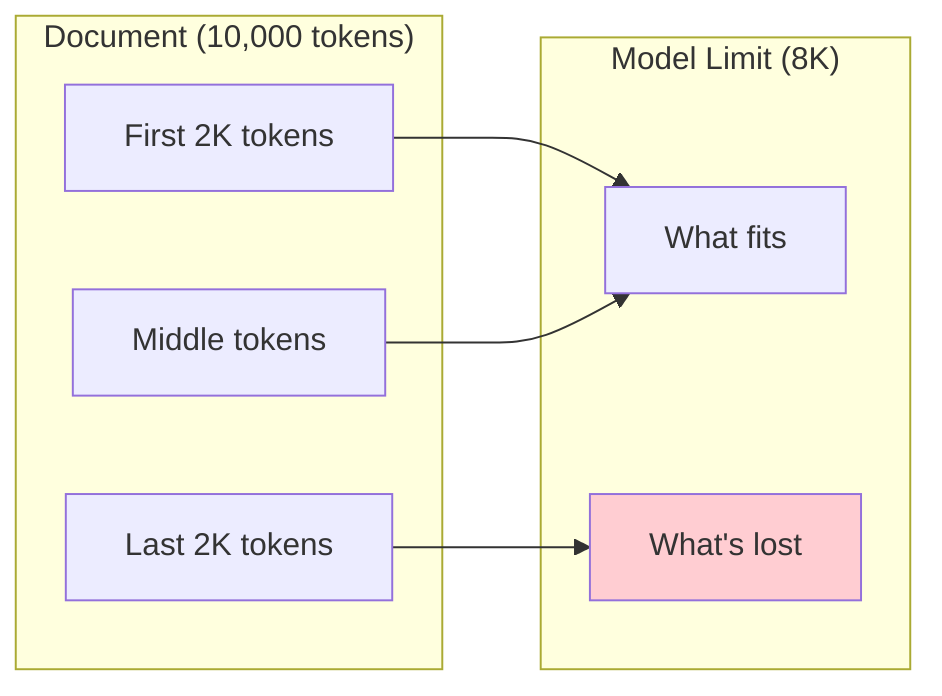
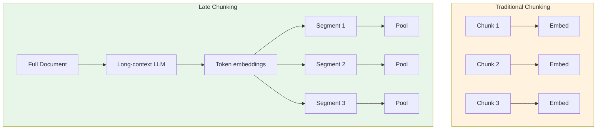
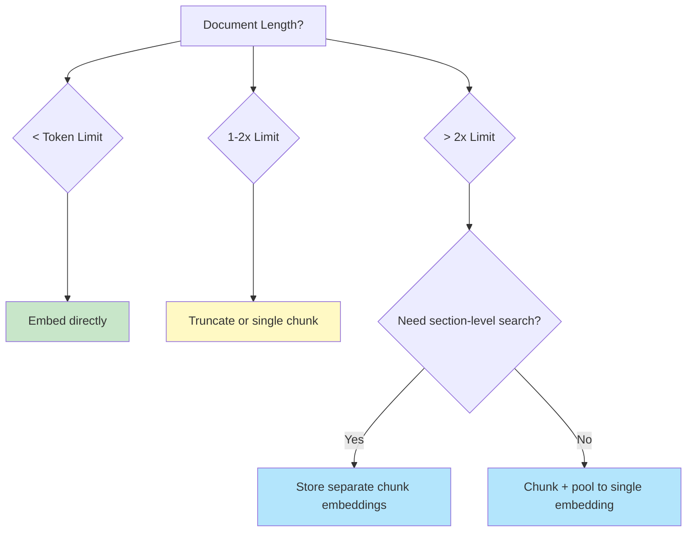

# Handling Long Texts

## Introduction

Embedding models have finite context windows. When your documents exceed these limits—research papers, legal contracts, book chapters—you need strategies to handle them effectively. Simply truncating can lose critical information from the end of documents.

In this lesson, we'll explore techniques for embedding long texts: truncation strategies, intelligent chunking, and pooling methods that combine multiple embeddings into one.

### What We'll Cover

- Context limits across embedding providers
- Truncation strategies (start, end, middle)
- Semantic chunking approaches
- Mean pooling and weighted pooling
- Late chunking for contextual embeddings

### Prerequisites

- Completed [Input Preparation](./05-input-preparation.md)
- Understanding of token vs character limits

---

## Context Limits by Provider

Each embedding model has a maximum input length:

| Provider | Model | Token Limit | Approximate Characters |
|----------|-------|-------------|------------------------|
| OpenAI | text-embedding-3-* | 8,192 | ~32,000 |
| Gemini | gemini-embedding-001 | 2,048 | ~8,000 |
| Cohere | embed-v4.0 | ~512 | ~2,000 |
| Voyage | voyage-4-* | 32,000 | ~128,000 |
| Local | all-mpnet-base-v2 | 384 | ~1,500 |

> **Note:** These are *input* limits. The ratio of tokens to characters varies by language and content type. Code and technical content often has higher token density.



---

## Truncation Strategies

The simplest approach is truncation. But *where* you truncate matters:

### End Truncation (Default)

Most APIs truncate from the end by default:

```python
import tiktoken

def truncate_end(text: str, max_tokens: int = 8192) -> str:
    """Truncate from the end, keeping the beginning."""
    encoding = tiktoken.get_encoding("cl100k_base")
    tokens = encoding.encode(text)
    
    if len(tokens) <= max_tokens:
        return text
    
    truncated_tokens = tokens[:max_tokens]
    return encoding.decode(truncated_tokens)

# Example
long_doc = "Introduction: This document explains... " + "details " * 5000 + "Conclusion: Therefore..."
truncated = truncate_end(long_doc, max_tokens=100)
print(f"Truncated text: {truncated[:100]}...")
```

**Best for:**
- Documents with key information at the beginning
- News articles (inverted pyramid style)
- Abstracts and summaries

### Start Truncation

Keep the end, remove the beginning:

```python
def truncate_start(text: str, max_tokens: int = 8192) -> str:
    """Truncate from the start, keeping the end."""
    encoding = tiktoken.get_encoding("cl100k_base")
    tokens = encoding.encode(text)
    
    if len(tokens) <= max_tokens:
        return text
    
    truncated_tokens = tokens[-max_tokens:]
    return encoding.decode(truncated_tokens)
```

**Best for:**
- Legal documents with conclusions at the end
- Email threads (most recent at bottom)
- Log files with recent entries

### Cohere's Truncation Parameter

Cohere offers built-in truncation control:

```python
import cohere

co = cohere.ClientV2()

# Truncate from end (default)
response = co.embed(
    model="embed-v4.0",
    input_type="search_document",
    texts=["Very long text here..."],
    truncate="END",  # Options: NONE, START, END
)

# Truncate from start
response = co.embed(
    model="embed-v4.0",
    input_type="search_document",
    texts=["Very long text here..."],
    truncate="START",
)

# Raise error if too long
response = co.embed(
    model="embed-v4.0",
    input_type="search_document",
    texts=["Very long text here..."],
    truncate="NONE",  # Raises error if too long
)
```

### Middle-Out Truncation

Keep both beginning and end, remove the middle:

```python
def truncate_middle(text: str, max_tokens: int = 8192) -> str:
    """Keep beginning and end, truncate middle."""
    encoding = tiktoken.get_encoding("cl100k_base")
    tokens = encoding.encode(text)
    
    if len(tokens) <= max_tokens:
        return text
    
    # Keep half from start, half from end
    half = max_tokens // 2
    start_tokens = tokens[:half]
    end_tokens = tokens[-half:]
    
    # Add separator to indicate truncation
    separator = encoding.encode(" [...] ")
    combined = start_tokens + separator + end_tokens
    
    return encoding.decode(combined)

# Example
doc = "INTRO: Important context here. " + "filler " * 5000 + "CONCLUSION: Key findings."
result = truncate_middle(doc, max_tokens=50)
print(result)
```

**Output:**
```
INTRO: Important context here. filler filler filler filler filler [...] filler filler CONCLUSION: Key findings.
```

**Best for:**
- Research papers (abstract + conclusion)
- Reports with executive summary and findings
- Documents with bookend structure

---

## Chunking Strategies

Instead of truncating, split the document into multiple chunks and embed each:

### Fixed-Size Chunking

```python
def chunk_fixed_size(
    text: str,
    chunk_size: int = 500,
    overlap: int = 50
) -> list[str]:
    """Split text into fixed-size token chunks with overlap."""
    encoding = tiktoken.get_encoding("cl100k_base")
    tokens = encoding.encode(text)
    
    chunks = []
    start = 0
    
    while start < len(tokens):
        end = start + chunk_size
        chunk_tokens = tokens[start:end]
        chunk_text = encoding.decode(chunk_tokens)
        chunks.append(chunk_text)
        
        start = end - overlap  # Overlap for context continuity
    
    return chunks

# Example
long_text = "This is a long document. " * 200
chunks = chunk_fixed_size(long_text, chunk_size=100, overlap=20)
print(f"Created {len(chunks)} chunks")
for i, chunk in enumerate(chunks[:3]):
    print(f"Chunk {i+1}: {len(chunk)} chars")
```

**Output:**
```
Created 12 chunks
Chunk 1: 428 chars
Chunk 2: 432 chars
Chunk 3: 428 chars
```

### Sentence-Based Chunking

Split on sentence boundaries to preserve meaning:

```python
import re

def chunk_by_sentences(
    text: str,
    max_tokens: int = 500,
    min_sentences: int = 2
) -> list[str]:
    """Split text into chunks at sentence boundaries."""
    encoding = tiktoken.get_encoding("cl100k_base")
    
    # Split into sentences
    sentences = re.split(r'(?<=[.!?])\s+', text)
    
    chunks = []
    current_chunk = []
    current_tokens = 0
    
    for sentence in sentences:
        sentence_tokens = len(encoding.encode(sentence))
        
        if current_tokens + sentence_tokens > max_tokens and len(current_chunk) >= min_sentences:
            # Save current chunk and start new one
            chunks.append(' '.join(current_chunk))
            current_chunk = [sentence]
            current_tokens = sentence_tokens
        else:
            current_chunk.append(sentence)
            current_tokens += sentence_tokens
    
    # Don't forget the last chunk
    if current_chunk:
        chunks.append(' '.join(current_chunk))
    
    return chunks
```

### Semantic Chunking (with LLM)

For more intelligent splitting, use an LLM to identify natural breakpoints:

```python
from openai import OpenAI

def chunk_semantically(text: str, target_chunks: int = 5) -> list[str]:
    """Use an LLM to identify semantic boundaries."""
    client = OpenAI()
    
    response = client.chat.completions.create(
        model="gpt-4o-mini",
        messages=[
            {
                "role": "system",
                "content": f"Split the following text into {target_chunks} semantically meaningful sections. "
                           "Output each section separated by '---CHUNK---'."
            },
            {"role": "user", "content": text}
        ],
        temperature=0,
    )
    
    sections = response.choices[0].message.content.split("---CHUNK---")
    return [s.strip() for s in sections if s.strip()]
```

### Paragraph-Based Chunking

Simple but effective for well-structured documents:

```python
def chunk_by_paragraphs(
    text: str,
    max_tokens: int = 500
) -> list[str]:
    """Split on paragraph boundaries."""
    encoding = tiktoken.get_encoding("cl100k_base")
    
    paragraphs = text.split('\n\n')
    
    chunks = []
    current_chunk = []
    current_tokens = 0
    
    for para in paragraphs:
        para = para.strip()
        if not para:
            continue
            
        para_tokens = len(encoding.encode(para))
        
        if current_tokens + para_tokens > max_tokens and current_chunk:
            chunks.append('\n\n'.join(current_chunk))
            current_chunk = [para]
            current_tokens = para_tokens
        else:
            current_chunk.append(para)
            current_tokens += para_tokens
    
    if current_chunk:
        chunks.append('\n\n'.join(current_chunk))
    
    return chunks
```

---

## Pooling Strategies

After chunking, you have multiple embeddings per document. Pooling combines them into one:

### Mean Pooling

Average all chunk embeddings:

```python
import numpy as np
from openai import OpenAI

def mean_pool_embeddings(embeddings: list[list[float]]) -> list[float]:
    """Average multiple embeddings into one."""
    embeddings_array = np.array(embeddings)
    mean_embedding = np.mean(embeddings_array, axis=0)
    
    # Normalize the result
    norm = np.linalg.norm(mean_embedding)
    if norm > 0:
        mean_embedding = mean_embedding / norm
    
    return mean_embedding.tolist()

def embed_long_document(text: str, chunk_size: int = 500) -> list[float]:
    """Embed a long document using chunking and mean pooling."""
    client = OpenAI()
    
    # Chunk the document
    chunks = chunk_fixed_size(text, chunk_size=chunk_size, overlap=50)
    
    # Embed all chunks
    response = client.embeddings.create(
        model="text-embedding-3-small",
        input=chunks,
    )
    
    chunk_embeddings = [item.embedding for item in response.data]
    
    # Pool into single embedding
    return mean_pool_embeddings(chunk_embeddings)

# Usage
long_doc = "This is important content. " * 2000
doc_embedding = embed_long_document(long_doc)
print(f"Final embedding: {len(doc_embedding)} dimensions")
```

### Weighted Mean Pooling

Weight chunks by importance (e.g., first and last chunks matter more):

```python
def weighted_mean_pool(
    embeddings: list[list[float]],
    weights: list[float] | None = None
) -> list[float]:
    """Weighted average of embeddings."""
    embeddings_array = np.array(embeddings)
    
    if weights is None:
        # Default: weight first and last chunks higher
        n = len(embeddings)
        weights = [1.0] * n
        weights[0] = 2.0  # First chunk
        if n > 1:
            weights[-1] = 1.5  # Last chunk
    
    weights = np.array(weights)
    weights = weights / weights.sum()  # Normalize weights
    
    weighted_mean = np.average(embeddings_array, axis=0, weights=weights)
    
    # Normalize
    norm = np.linalg.norm(weighted_mean)
    if norm > 0:
        weighted_mean = weighted_mean / norm
    
    return weighted_mean.tolist()
```

### Max Pooling

Take the maximum value for each dimension:

```python
def max_pool_embeddings(embeddings: list[list[float]]) -> list[float]:
    """Take max value per dimension across embeddings."""
    embeddings_array = np.array(embeddings)
    max_embedding = np.max(embeddings_array, axis=0)
    
    # Normalize
    norm = np.linalg.norm(max_embedding)
    if norm > 0:
        max_embedding = max_embedding / norm
    
    return max_embedding.tolist()
```

**Best for:** Capturing the most salient features across chunks.

---

## Late Chunking

A newer technique that maintains context across chunks:



**Traditional:** Each chunk is embedded independently, losing cross-chunk context.

**Late Chunking:** Process the full document through a long-context model, then pool token embeddings for each logical section.

```python
# Conceptual implementation (requires long-context model)
def late_chunking(
    text: str,
    chunk_boundaries: list[tuple[int, int]]
) -> list[list[float]]:
    """
    Late chunking: embed full text, then pool by chunk boundaries.
    
    Requires a model that returns token-level embeddings.
    """
    # This is conceptual - actual implementation depends on model
    from sentence_transformers import SentenceTransformer
    
    model = SentenceTransformer("model-with-token-output")
    
    # Get token-level embeddings for full document
    outputs = model.encode(
        text,
        output_value="token_embeddings",  # Get per-token embeddings
    )
    
    # Pool by chunk boundaries
    chunk_embeddings = []
    for start, end in chunk_boundaries:
        chunk_tokens = outputs[start:end]
        pooled = np.mean(chunk_tokens, axis=0)
        chunk_embeddings.append(pooled)
    
    return chunk_embeddings
```

> **Note:** Late chunking is an emerging technique. Check Jina AI's documentation for production-ready implementations.

---

## Choosing the Right Strategy

| Scenario | Recommended Approach |
|----------|---------------------|
| Document < limit | No chunking needed |
| Slightly over limit | Truncation (end or middle) |
| 2-5x over limit | Chunking + mean pooling |
| Very long documents | Chunking with weighted pooling |
| Need per-section retrieval | Store chunk embeddings separately |
| Maximum quality | Late chunking (if supported) |

### Decision Flowchart



---

## Best Practices

| ✅ Do | ❌ Don't |
|-------|---------|
| Use overlapping chunks | Cut at arbitrary byte positions |
| Preserve sentence boundaries | Split mid-sentence |
| Normalize pooled embeddings | Forget normalization after pooling |
| Consider chunk metadata | Lose track of chunk positions |
| Test retrieval quality | Assume longer = better |
| Match chunk size to queries | Use huge chunks for short queries |

---

## Hands-on Exercise

### Your Task

Build a document embedding system that handles long texts:

1. Accept documents of any length
2. Automatically choose strategy based on length
3. Return a single embedding per document
4. Include metadata about processing

### Requirements

1. If under 8000 tokens: embed directly
2. If 8000-16000 tokens: use middle truncation
3. If over 16000 tokens: chunk and mean pool
4. Return embedding + metadata dict

<details>
<summary>💡 Hints</summary>

- Use tiktoken to count tokens
- Apply normalization after pooling
- Track which strategy was used in metadata

</details>

<details>
<summary>✅ Solution</summary>

```python
import numpy as np
import tiktoken
from openai import OpenAI

def chunk_list(items, size, overlap=0):
    for i in range(0, len(items), size - overlap):
        yield items[i:i + size]

def embed_any_length(text: str) -> dict:
    """
    Embed text of any length with automatic strategy selection.
    
    Returns:
        dict with 'embedding', 'strategy', 'chunks_used', 'original_tokens'
    """
    client = OpenAI()
    encoding = tiktoken.get_encoding("cl100k_base")
    tokens = encoding.encode(text)
    token_count = len(tokens)
    
    metadata = {
        "original_tokens": token_count,
        "chunks_used": 1,
        "strategy": None,
    }
    
    if token_count <= 8000:
        # Strategy 1: Direct embedding
        metadata["strategy"] = "direct"
        response = client.embeddings.create(
            model="text-embedding-3-small",
            input=text,
        )
        embedding = response.data[0].embedding
        
    elif token_count <= 16000:
        # Strategy 2: Middle truncation
        metadata["strategy"] = "middle_truncation"
        
        half = 4000
        start_tokens = tokens[:half]
        end_tokens = tokens[-half:]
        separator = encoding.encode(" [...] ")
        combined = start_tokens + separator + end_tokens
        truncated_text = encoding.decode(combined)
        
        response = client.embeddings.create(
            model="text-embedding-3-small",
            input=truncated_text,
        )
        embedding = response.data[0].embedding
        
    else:
        # Strategy 3: Chunk and pool
        metadata["strategy"] = "chunk_and_pool"
        
        chunk_size = 6000
        overlap = 200
        chunks = list(chunk_list(tokens, chunk_size, overlap))
        chunk_texts = [encoding.decode(c) for c in chunks]
        metadata["chunks_used"] = len(chunk_texts)
        
        response = client.embeddings.create(
            model="text-embedding-3-small",
            input=chunk_texts,
        )
        
        embeddings = [item.embedding for item in response.data]
        
        # Mean pool
        embeddings_array = np.array(embeddings)
        pooled = np.mean(embeddings_array, axis=0)
        
        # Normalize
        norm = np.linalg.norm(pooled)
        embedding = (pooled / norm).tolist() if norm > 0 else pooled.tolist()
    
    return {
        "embedding": embedding,
        **metadata,
    }

# Test with different lengths
short_text = "Hello, world! " * 100  # ~400 tokens
medium_text = "Content here. " * 2500  # ~10,000 tokens
long_text = "Lots of content. " * 8000  # ~32,000 tokens

for name, text in [("Short", short_text), ("Medium", medium_text), ("Long", long_text)]:
    result = embed_any_length(text)
    print(f"{name}:")
    print(f"  Tokens: {result['original_tokens']}")
    print(f"  Strategy: {result['strategy']}")
    print(f"  Chunks: {result['chunks_used']}")
    print(f"  Embedding dims: {len(result['embedding'])}")
    print()
```

</details>

---

## Summary

✅ Know your model's token limits—they vary significantly (384 to 32,000)

✅ Truncation works for slightly-over-limit documents; choose where to cut strategically

✅ Chunking with overlap preserves context at boundaries

✅ Mean pooling combines multiple embeddings into one; always normalize after

✅ Late chunking is an emerging technique that preserves cross-chunk context

**Next:** [Embedding Normalization](./07-embedding-normalization.md)

---

## Further Reading

- [LangChain Text Splitters](https://python.langchain.com/docs/how_to/#text-splitters)
- [Late Chunking - Jina AI](https://jina.ai/news/late-chunking-in-long-context-embedding-models/)
- [tiktoken - Token Counting](https://github.com/openai/tiktoken)

---

<!-- 
Sources Consulted:
- OpenAI Embeddings API: https://platform.openai.com/docs/api-reference/embeddings
- Cohere Embed API: https://docs.cohere.com/reference/embed
- Jina AI Late Chunking: https://jina.ai/news/late-chunking-in-long-context-embedding-models/
-->
