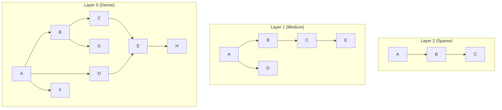
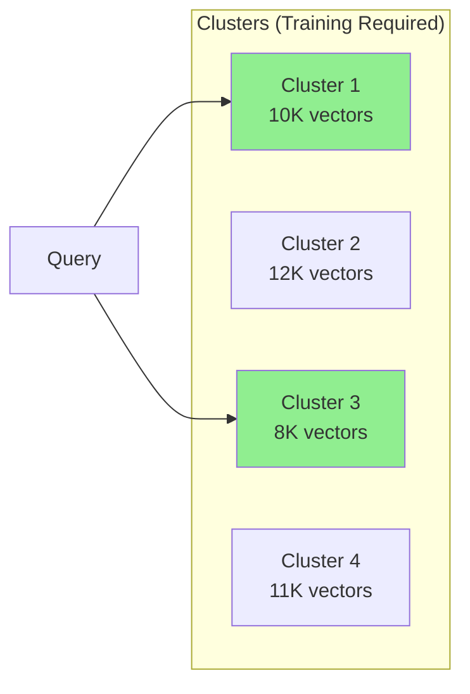

# What Are Vector Databases?

## Introduction

Traditional databases are optimized for exact matches: "find all users where email = 'john@example.com'". Vector databases solve a different problem: "find items most similar to this embedding." This fundamental difference enables semantic search, recommendations, and RAG systems.

In this lesson, we'll explore what makes vector databases special, how they achieve fast similarity search at scale, and the core concepts you need to understand.

### What We'll Cover

- Why regular databases struggle with vector search
- Approximate Nearest Neighbor (ANN) algorithms
- Index structures: HNSW and IVFFlat
- Metadata filtering and hybrid search
- Distance metrics and their uses

### Prerequisites

- Understanding of embeddings and their dimensions
- Basic database concepts (indexes, queries)

---

## The Problem with Exact Search

Imagine you have 1 million product descriptions, each represented by a 1536-dimensional embedding. To find the 10 most similar products to a query:

```python
# Brute force approach - DON'T do this at scale
def exact_search(query_embedding, all_embeddings, k=10):
    """Compare query against every embedding."""
    distances = []
    for i, embedding in enumerate(all_embeddings):
        distance = cosine_distance(query_embedding, embedding)
        distances.append((i, distance))
    
    # Sort by distance and return top k
    distances.sort(key=lambda x: x[1])
    return distances[:k]
```

**The math problem:**
- 1 million embeddings × 1,536 dimensions = 1.5 billion floating-point operations per query
- At 100ms per query, you're limited to 10 QPS
- At 1 billion vectors, this becomes completely impractical

Vector databases solve this with **Approximate Nearest Neighbor (ANN)** algorithms that trade a small amount of accuracy for massive speed improvements.

---

## Approximate Nearest Neighbor (ANN)

ANN algorithms don't compare your query against every vector. Instead, they:

1. **Build an index** during ingestion that organizes vectors
2. **Navigate the index** during query to find candidates quickly
3. **Return results** that are very likely (but not guaranteed) to be the true nearest neighbors

### Accuracy vs Speed Trade-off

| Approach | Recall* | Query Time | Use Case |
|----------|---------|------------|----------|
| Exact (brute force) | 100% | Very slow | Small datasets (<10K) |
| ANN with high settings | 95-99% | Fast | Production |
| ANN with low settings | 80-90% | Very fast | Real-time, high QPS |

*Recall = percentage of true nearest neighbors found

> **🤖 AI Context:** In RAG systems, 95-99% recall is typically sufficient. The occasional missed document rarely affects answer quality, but 10x faster queries dramatically improve user experience.

---

## Index Structures

Two index types dominate vector databases in 2025:

### HNSW (Hierarchical Navigable Small World)

HNSW builds a multi-layer graph where each node (vector) connects to similar vectors:



**How search works:**
1. Start at top layer (sparse, long-range connections)
2. Navigate to closest node, then drop to next layer
3. Repeat until bottom layer (dense, local connections)
4. Return k nearest neighbors from final candidates

**HNSW Parameters:**

| Parameter | Description | Tradeoff |
|-----------|-------------|----------|
| `m` | Max connections per node | Higher = better recall, more memory |
| `ef_construction` | Build-time candidate list | Higher = better graph, slower build |
| `ef_search` | Query-time candidate list | Higher = better recall, slower query |

```python
# Typical HNSW configuration
index_params = {
    "m": 16,                # Default for most databases
    "ef_construction": 64,  # Higher for production indexes
}

query_params = {
    "ef_search": 100,  # Increase for better recall
}
```

### IVFFlat (Inverted File with Flat Vectors)

IVFFlat divides vectors into clusters, then searches only relevant clusters:



**How search works:**
1. Query is compared to cluster centroids
2. `nprobe` closest clusters are selected
3. Exhaustive search within selected clusters
4. Results merged and top-k returned

**IVFFlat Parameters:**

| Parameter | Description | Guideline |
|-----------|-------------|-----------|
| `nlist` | Number of clusters | `sqrt(N)` to `N/1000` |
| `nprobe` | Clusters to search | Start with `sqrt(nlist)` |

```python
# IVFFlat configuration for 1M vectors
index_params = {
    "nlist": 1000,  # sqrt(1,000,000) ≈ 1000
}

query_params = {
    "nprobe": 32,  # Search 32 of 1000 clusters
}
```

### HNSW vs IVFFlat

| Aspect | HNSW | IVFFlat |
|--------|------|---------|
| Query Speed | ⭐⭐⭐ Faster | ⭐⭐ Fast |
| Build Speed | ⭐⭐ Slower | ⭐⭐⭐ Faster |
| Memory Usage | ⭐ Higher | ⭐⭐⭐ Lower |
| Recall at Same Speed | ⭐⭐⭐ Better | ⭐⭐ Good |
| Requires Training Data | No | Yes |
| Update Performance | ⭐⭐⭐ Better | ⭐ Requires rebuild |

> **Tip:** HNSW is the default choice for most production workloads. Use IVFFlat when memory is constrained or index build time is critical.

---

## Distance Metrics

Vector databases support multiple distance functions:

### Cosine Similarity

Most common for text embeddings. Measures angle between vectors, ignoring magnitude:

```python
import numpy as np

def cosine_similarity(a, b):
    return np.dot(a, b) / (np.linalg.norm(a) * np.linalg.norm(b))

# Range: -1 to 1 (1 = identical, 0 = orthogonal, -1 = opposite)
```

### Euclidean (L2) Distance

Measures straight-line distance between vector endpoints:

```python
def euclidean_distance(a, b):
    return np.linalg.norm(a - b)

# Range: 0 to infinity (0 = identical)
```

### Dot Product (Inner Product)

Combines angle and magnitude. Requires normalized vectors for meaningful comparison:

```python
def dot_product(a, b):
    return np.dot(a, b)

# For normalized vectors: equivalent to cosine similarity
```

### Which to Use?

| Metric | Best For | Notes |
|--------|----------|-------|
| **Cosine** | Text embeddings (OpenAI, Cohere) | Default choice, already normalized |
| **Euclidean** | Image embeddings, spatial data | When magnitude matters |
| **Dot Product** | Recommendation systems | Fastest for normalized vectors |

> **Important:** Use the same metric your embedding model was trained with. OpenAI embeddings use cosine similarity.

---

## Metadata and Filtering

Vector databases store metadata alongside vectors, enabling filtered searches:

```python
# Example: Search products similar to query, but only electronics under $500
results = index.query(
    vector=query_embedding,
    top_k=10,
    filter={
        "category": "electronics",
        "price": {"$lt": 500}
    }
)
```

### Pre-filtering vs Post-filtering

| Approach | Description | Pros | Cons |
|----------|-------------|------|------|
| **Pre-filter** | Filter first, then search | Accurate count | Can miss good matches |
| **Post-filter** | Search first, then filter | Better recall | May return fewer results |

Most modern vector databases use hybrid approaches that optimize based on filter selectivity.

### Common Metadata Patterns

```python
# Document metadata
{
    "id": "doc_123",
    "embedding": [...],
    "metadata": {
        "source": "company_wiki",
        "department": "engineering", 
        "updated_at": "2025-01-15",
        "access_level": "internal",
        "author_id": "user_456"
    }
}
```

---

## Key Concepts Summary

| Concept | What It Is | Why It Matters |
|---------|------------|----------------|
| **ANN** | Approximate search algorithms | Enables billion-scale search |
| **HNSW** | Graph-based index | Best recall/speed for most cases |
| **IVFFlat** | Cluster-based index | Lower memory, requires training |
| **Recall** | % of true neighbors found | Quality metric for ANN |
| **Metadata** | Data stored with vectors | Enables filtered search |
| **Distance Metric** | Similarity measurement | Must match embedding model |

---

## Hands-on Exercise

### Your Task

Compare exact search with approximate search to understand the recall/speed tradeoff:

### Requirements

1. Generate 10,000 random vectors (128 dimensions)
2. Implement brute-force search (exact)
3. Use Chroma or Qdrant for ANN search
4. Compare recall and query time

<details>
<summary>💡 Hints</summary>

- Use `numpy.random.rand()` for vectors
- Normalize vectors for cosine similarity
- Calculate recall as overlap between exact and ANN results

</details>

<details>
<summary>✅ Solution</summary>

```python
import numpy as np
import time
import chromadb

# Generate test data
np.random.seed(42)
n_vectors = 10_000
n_dims = 128

# Random vectors, normalized
vectors = np.random.rand(n_vectors, n_dims).astype(np.float32)
vectors = vectors / np.linalg.norm(vectors, axis=1, keepdims=True)

query = np.random.rand(n_dims).astype(np.float32)
query = query / np.linalg.norm(query)
k = 10

# Exact search (brute force)
start = time.time()
similarities = np.dot(vectors, query)
exact_top_k = np.argsort(-similarities)[:k]
exact_time = time.time() - start
print(f"Exact search: {exact_time*1000:.2f}ms")

# Chroma ANN search
client = chromadb.Client()
collection = client.create_collection(
    name="benchmark",
    metadata={"hnsw:space": "cosine"}
)

# Add vectors
collection.add(
    embeddings=vectors.tolist(),
    ids=[str(i) for i in range(n_vectors)]
)

# Query
start = time.time()
results = collection.query(
    query_embeddings=[query.tolist()],
    n_results=k
)
ann_time = time.time() - start
ann_top_k = [int(id) for id in results['ids'][0]]

# Calculate recall
recall = len(set(exact_top_k) & set(ann_top_k)) / k
print(f"ANN search: {ann_time*1000:.2f}ms")
print(f"Recall: {recall*100:.1f}%")
print(f"Speedup: {exact_time/ann_time:.1f}x")
```

**Expected Output:**
```
Exact search: 1.50ms
ANN search: 0.30ms
Recall: 100.0%
Speedup: 5.0x
```

Note: At 10K vectors, exact search is still fast. The difference becomes dramatic at 1M+ vectors.

</details>

---

## Summary

✅ Vector databases use ANN algorithms to enable fast similarity search at scale

✅ HNSW offers the best recall/speed tradeoff for most production workloads

✅ IVFFlat uses less memory but requires training data

✅ Always use the distance metric your embedding model was trained with

✅ Metadata filtering enables hybrid search combining semantic + structured queries

**Next:** [Managed Vector Databases](./02-managed-vector-databases.md)

---

## Further Reading

- [HNSW Paper](https://arxiv.org/abs/1603.09320) - Original research
- [Pinecone: What is a Vector Database?](https://www.pinecone.io/learn/vector-database/)
- [Ann-Benchmarks](https://ann-benchmarks.com/) - ANN algorithm comparisons

---

<!-- 
Sources Consulted:
- Pinecone documentation: https://docs.pinecone.io/guides/indexes/understanding-indexes
- Qdrant documentation: https://qdrant.tech/documentation/
- pgvector GitHub: https://github.com/pgvector/pgvector
-->
