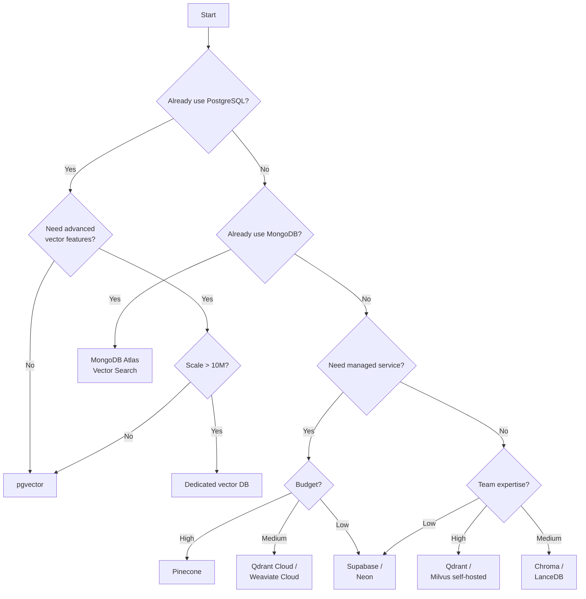

# Vector Database Selection Decision Tree

## Introduction

Choosing the right vector database depends on your scale, infrastructure, query patterns, and team expertise. This lesson provides a systematic approach to making the right choice.

### What We'll Cover

- Scale-based decision criteria
- Infrastructure considerations
- Query pattern matching
- Budget constraints
- Decision flowcharts

### Prerequisites

- Understanding of vector database concepts
- Knowledge of your project requirements
- Familiarity with the options (previous lessons)

---

## The Decision Framework

### Step 1: Determine Your Scale

| Vector Count | Category | Typical Solutions |
|--------------|----------|-------------------|
| < 10K | Small | Chroma, LanceDB, pgvector |
| 10K - 100K | Medium | Any solution works |
| 100K - 1M | Large | Pinecone, Qdrant, Milvus, pgvector |
| 1M - 100M | Very Large | Pinecone, Qdrant, Milvus |
| 100M+ | Massive | Milvus cluster, Zilliz Cloud |

### Step 2: Assess Infrastructure Constraints

```
┌─────────────────────────────────────────────────────────┐
│                  Do you have DevOps capacity?           │
└─────────────────────────────────────────────────────────┘
                          │
            ┌─────────────┴─────────────┐
            ▼                           ▼
     ┌──────────┐                ┌──────────────┐
     │   Yes    │                │     No       │
     └──────────┘                └──────────────┘
            │                           │
            ▼                           ▼
  ┌─────────────────┐          ┌─────────────────┐
  │ Self-hosted OK  │          │ Managed only    │
  │ - Qdrant        │          │ - Pinecone      │
  │ - Milvus        │          │ - Weaviate Cloud│
  │ - pgvector      │          │ - Qdrant Cloud  │
  │ - Chroma        │          │ - Zilliz Cloud  │
  └─────────────────┘          └─────────────────┘
```

### Step 3: Evaluate Query Requirements

| Requirement | Best Options |
|-------------|--------------|
| **Simple semantic search** | Any |
| **Metadata filtering** | Qdrant, Pinecone, Weaviate |
| **Hybrid (vector + text)** | Weaviate, pgvector, Qdrant |
| **Geo-spatial filters** | Qdrant, MongoDB Atlas |
| **SQL integration** | pgvector, Supabase |
| **Real-time (<5ms)** | Redis, Qdrant |

---

## Decision Flowchart



---

## Detailed Comparison Matrix

### By Use Case

| Use Case | Recommended | Why |
|----------|-------------|-----|
| **RAG prototype** | Chroma | Zero config, Python-native |
| **Production RAG** | Pinecone, Qdrant | Managed, reliable, scalable |
| **E-commerce search** | Qdrant, Weaviate | Filtering, hybrid search |
| **Real-time recs** | Redis | Sub-millisecond latency |
| **Existing Postgres app** | pgvector | No new infrastructure |
| **Existing MongoDB app** | Atlas Vector | No new infrastructure |
| **Multi-tenant SaaS** | Pinecone, Qdrant | Namespace/collection isolation |
| **Serverless/Edge** | LanceDB | Embedded, S3 backend |
| **AI platform (OpenAI)** | OpenAI Vector Stores | Tightest integration |
| **Cost-sensitive startup** | Supabase, Neon | Free tiers, familiar SQL |

### By Technical Requirements

| Requirement | Best | Good | Avoid |
|-------------|------|------|-------|
| **< 1ms latency** | Redis | Qdrant | Cloud APIs |
| **Billion scale** | Milvus, Zilliz | Pinecone | Chroma, LanceDB |
| **Complex filters** | Qdrant | Pinecone | Chroma |
| **Hybrid BM25+vector** | Weaviate | pgvector | Pinecone |
| **Multi-vector per doc** | Qdrant, Weaviate | Milvus | Pinecone |
| **Binary/sparse vectors** | pgvector, Milvus | Qdrant | Most others |
| **GPU acceleration** | Milvus, Zilliz | - | Most |

---

## Quick Decision Questions

### Question 1: What's your scale?

```python
def recommend_by_scale(vector_count: int) -> list[str]:
    if vector_count < 10_000:
        return ["Chroma", "LanceDB", "pgvector", "Any"]
    elif vector_count < 100_000:
        return ["Pinecone", "Qdrant", "Weaviate", "pgvector"]
    elif vector_count < 10_000_000:
        return ["Pinecone", "Qdrant", "Milvus"]
    else:
        return ["Milvus cluster", "Zilliz Cloud"]
```

### Question 2: What's in your stack?

```python
def recommend_by_stack(current_stack: list[str]) -> str:
    if "PostgreSQL" in current_stack:
        return "pgvector (add to existing Postgres)"
    elif "MongoDB" in current_stack:
        return "MongoDB Atlas Vector Search"
    elif "Redis" in current_stack:
        return "Redis Stack (if < 10M vectors)"
    elif "AWS" in current_stack:
        return "Pinecone or AWS OpenSearch"
    elif "GCP" in current_stack:
        return "Vertex AI Vector Search or Weaviate"
    else:
        return "Evaluate Pinecone, Qdrant, or Weaviate"
```

### Question 3: What's your budget?

| Monthly Budget | Vectors | Recommendation |
|---------------|---------|----------------|
| $0 | < 50K | Chroma, Qdrant (free tier) |
| $0-25 | < 500K | Supabase, Neon, Pinecone starter |
| $25-100 | < 2M | Qdrant Cloud, Pinecone, Weaviate |
| $100-500 | < 10M | Any managed service |
| $500+ | 10M+ | Milvus/Zilliz, enterprise tiers |

---

## Infrastructure Decision Tree

### Self-Hosted Considerations

| Factor | Self-Hosted | Managed |
|--------|------------|---------|
| **Upfront cost** | Higher (setup) | Lower |
| **Ongoing cost** | Lower (compute only) | Higher (margins) |
| **Maintenance** | Your responsibility | Provider handles |
| **Scaling** | Manual | Automatic |
| **Data privacy** | Full control | Trust provider |
| **Customization** | Unlimited | Limited |

### When to Self-Host

✅ **Self-host when:**
- Data sovereignty requirements
- Predictable, large-scale workloads
- Strong DevOps team
- Specific compliance needs
- Cost optimization at scale

✅ **Use managed when:**
- Rapid development priority
- Variable or unpredictable workloads
- Small team, no dedicated DevOps
- Need SLAs and support
- Prototyping or MVPs

---

## Migration Considerations

### Lock-in Assessment

| Database | Migration Difficulty | Notes |
|----------|---------------------|-------|
| pgvector | ⭐ Easy | Standard SQL, pg_dump works |
| Chroma | ⭐ Easy | Simple export, open format |
| LanceDB | ⭐ Easy | Lance files are portable |
| Qdrant | ⭐⭐ Medium | Snapshot export available |
| Pinecone | ⭐⭐ Medium | API export, no native format |
| Weaviate | ⭐⭐ Medium | Backup/restore available |
| Milvus | ⭐⭐ Medium | Bulk export tools |
| OpenAI Stores | ⭐⭐⭐ Hard | Must re-embed all content |

### Portability Strategy

```python
# Abstract your vector store interface
from abc import ABC, abstractmethod
from typing import Any

class VectorStore(ABC):
    @abstractmethod
    def upsert(self, id: str, vector: list[float], metadata: dict) -> None:
        pass
    
    @abstractmethod
    def search(self, vector: list[float], top_k: int, filter: dict = None) -> list[dict]:
        pass
    
    @abstractmethod
    def delete(self, id: str) -> None:
        pass

# Implement for each provider
class PineconeStore(VectorStore):
    def __init__(self, index_name: str):
        from pinecone import Pinecone
        self.index = Pinecone().Index(index_name)
    
    def upsert(self, id: str, vector: list[float], metadata: dict) -> None:
        self.index.upsert([(id, vector, metadata)])
    
    def search(self, vector: list[float], top_k: int, filter: dict = None) -> list[dict]:
        return self.index.query(vector=vector, top_k=top_k, filter=filter)
    
    def delete(self, id: str) -> None:
        self.index.delete(ids=[id])

class QdrantStore(VectorStore):
    def __init__(self, collection_name: str):
        from qdrant_client import QdrantClient
        self.client = QdrantClient()
        self.collection = collection_name
    
    # ... implement methods

# Usage - easy to swap implementations
store: VectorStore = PineconeStore("my-index")
# store: VectorStore = QdrantStore("my-collection")

store.upsert("doc1", embedding, {"category": "AI"})
results = store.search(query_embedding, top_k=5)
```

---

## Checklist for Final Decision

### Technical Requirements

- [ ] Vector count (current and projected)
- [ ] Query latency requirements
- [ ] Filtering complexity needed
- [ ] Hybrid search requirements
- [ ] Update frequency
- [ ] Availability requirements (SLA)

### Operational Requirements

- [ ] Team expertise level
- [ ] DevOps capacity
- [ ] Compliance requirements
- [ ] Data residency needs
- [ ] Backup/DR requirements

### Business Requirements

- [ ] Budget (monthly/annual)
- [ ] Time to market
- [ ] Vendor relationship preferences
- [ ] Support requirements
- [ ] Long-term scalability

---

## Hands-on Exercise

### Your Task

Create a decision matrix for a hypothetical project:

### Scenario

You're building a customer support chatbot for an e-commerce company with:
- 500,000 product descriptions
- 100,000 support articles
- Need for product category filtering
- Budget: $200/month
- Team: 2 developers, no DevOps

### Requirements

1. Score each option on 5 criteria (1-5)
2. Weight the criteria by importance
3. Calculate weighted scores
4. Make a recommendation with justification

<details>
<summary>✅ Solution</summary>

**Criteria & Weights:**
| Criteria | Weight | Reasoning |
|----------|--------|-----------|
| Ease of use | 30% | Small team, no DevOps |
| Cost | 25% | Fixed budget |
| Filtering | 20% | Category filters needed |
| Scale | 15% | 600K vectors total |
| Integration | 10% | Nice to have |

**Scoring (1-5):**
| Option | Ease | Cost | Filter | Scale | Integration | Weighted |
|--------|------|------|--------|-------|-------------|----------|
| Pinecone | 5 | 3 | 4 | 5 | 4 | **4.1** |
| Qdrant Cloud | 5 | 4 | 5 | 5 | 3 | **4.4** |
| Weaviate | 4 | 3 | 5 | 4 | 3 | **3.8** |
| pgvector (Supabase) | 4 | 5 | 3 | 4 | 4 | **4.0** |
| Chroma | 5 | 5 | 2 | 2 | 3 | **3.5** |

**Recommendation: Qdrant Cloud**

Justification:
- Highest weighted score (4.4)
- Excellent filtering for product categories
- Free tier covers prototyping, $25/mo handles scale
- Very easy setup with good documentation
- Handles 600K vectors easily

Runner-up: Pinecone (4.1) - slightly more expensive but excellent developer experience

</details>

---

## Summary

✅ Scale is the primary driver—small scale = more options

✅ Existing infrastructure matters—pgvector for Postgres shops

✅ Budget constraints favor Supabase/Neon for startups

✅ Query patterns determine filtering requirements

✅ Abstract your vector store interface for future flexibility

**Next:** [Cost and Scaling Considerations](./10-cost-scaling-considerations.md)

---

## Further Reading

- [Vector Database Comparison (Benchmark)](https://ann-benchmarks.com/)
- [Choosing a Vector Database](https://www.pinecone.io/learn/vector-database-comparison/)
- [pgvector vs Dedicated Vector DBs](https://supabase.com/blog/pgvector-vs-pinecone)

---

<!-- 
Sources Consulted:
- Pinecone documentation: https://docs.pinecone.io/
- Qdrant documentation: https://qdrant.tech/documentation/
- ANN Benchmarks: https://ann-benchmarks.com/
-->
