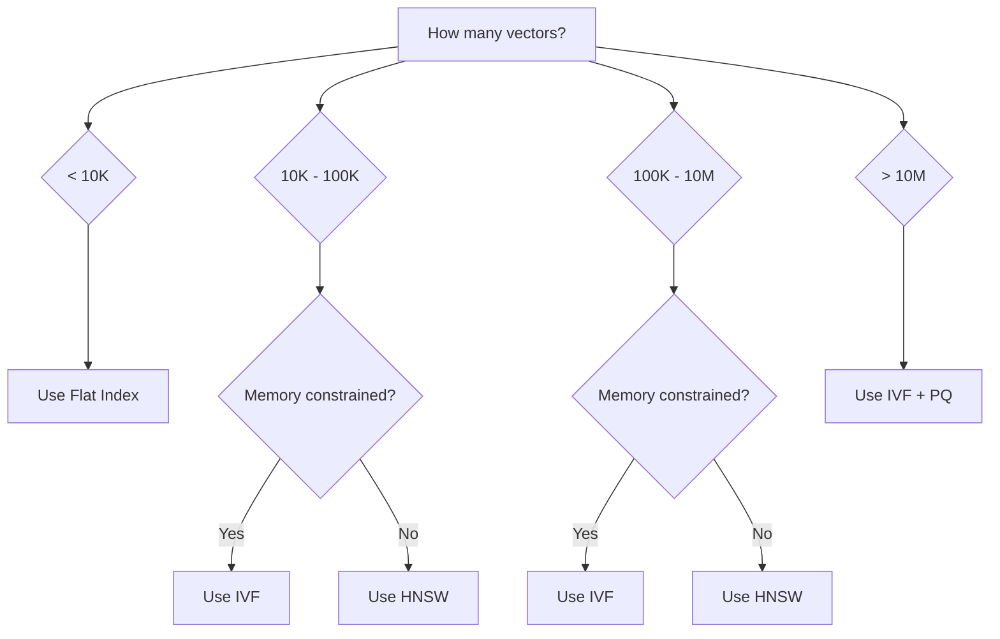

# Index Types

## Introduction

Indexes enable fast approximate nearest neighbor (ANN) search instead of exhaustive comparison. The choice of index type determines the trade-off between speed, memory, and recall accuracy.

---

## Flat Index (Exact Search)

No index structure—compares query against every vector.

```
Query: [0.1, 0.2, 0.3]
        │
        ├── Compare with Vector 1 → Distance: 0.15
        ├── Compare with Vector 2 → Distance: 0.82
        ├── Compare with Vector 3 → Distance: 0.03  ✓ Closest
        ├── Compare with Vector 4 → Distance: 0.44
        └── ... (all N vectors)
```

### Characteristics

| Metric | Value |
|--------|-------|
| Build time | O(1) - no build needed |
| Query time | O(N × D) |
| Memory | O(N × D) |
| Recall | 100% (exact) |
| Best for | < 10,000 vectors |

### Faiss Implementation

```python
import faiss
import numpy as np

dimension = 1536

# L2 (Euclidean) distance
index_l2 = faiss.IndexFlatL2(dimension)

# Inner product (for cosine similarity with normalized vectors)
index_ip = faiss.IndexFlatIP(dimension)

# Add vectors
vectors = np.random.random((10000, dimension)).astype('float32')
index_l2.add(vectors)

# Search (exact - 100% recall)
query = np.random.random((1, dimension)).astype('float32')
distances, indices = index_l2.search(query, k=10)

print(f"Top 10 indices: {indices[0]}")
print(f"Top 10 distances: {distances[0]}")
```

> **Note:** For cosine similarity with `IndexFlatIP`, normalize your vectors first: `faiss.normalize_L2(vectors)`.

---

## IVF Index (Inverted File)

Clusters vectors into buckets, searches only relevant clusters.

```
┌─────────────────────────────────────────────────────────┐
│                    Vector Space                         │
│                                                         │
│    ┌──────┐      ┌──────┐      ┌──────┐               │
│    │ C1   │      │ C2   │      │ C3   │   Centroids   │
│    │ ●    │      │  ●   │      │   ●  │               │
│    │ • •  │      │ • •• │      │ •••  │   Vectors     │
│    │  ••  │      │  •   │      │  •   │               │
│    └──────┘      └──────┘      └──────┘               │
│                                                         │
│    Query ◆ → Find nearest centroid(s) → Search bucket  │
└─────────────────────────────────────────────────────────┘
```

### Characteristics

| Metric | Value |
|--------|-------|
| Build time | O(N × K × iterations) |
| Query time | O(probes × N/K × D) |
| Memory | O(N × D) + centroids |
| Recall | 90-99% (tunable) |
| Best for | 100K - 10M vectors |

### Key Parameters

| Parameter | Description | Recommendation |
|-----------|-------------|----------------|
| `nlist` | Number of clusters | √N to 4√N |
| `nprobe` | Clusters to search | 1-20 (tune for recall) |

### Faiss Implementation

```python
import faiss
import numpy as np

dimension = 1536
nlist = 100  # Number of clusters

# Create quantizer and index
quantizer = faiss.IndexFlatL2(dimension)
index = faiss.IndexIVFFlat(quantizer, dimension, nlist)

# Training data (required for IVF)
training_data = np.random.random((50000, dimension)).astype('float32')

# Train the index (learns cluster centroids)
index.train(training_data)
print(f"Index trained: {index.is_trained}")

# Add vectors
vectors = np.random.random((100000, dimension)).astype('float32')
index.add(vectors)

# Search with different probe counts
for nprobe in [1, 5, 10, 20]:
    index.nprobe = nprobe
    distances, indices = index.search(query, k=10)
    print(f"nprobe={nprobe}: found indices {indices[0][:3]}...")
```

**Output:**
```
Index trained: True
nprobe=1: found indices [4521, 8934, 1203]...
nprobe=5: found indices [4521, 8934, 7612]...
nprobe=10: found indices [4521, 7612, 8934]...
nprobe=20: found indices [4521, 7612, 2341]...
```

---

## HNSW Index (Hierarchical Navigable Small World)

Graph-based index with multiple layers for fast navigation.

```
Layer 2:  ●───────────────────────●   (few nodes, long edges)
          │                       │
Layer 1:  ●─────●─────●─────●─────●   (more nodes, medium edges)
          │     │     │     │     │
Layer 0:  ●─●─●─●─●─●─●─●─●─●─●─●─●   (all nodes, short edges)

Search: Start at top layer → Navigate down → Refine at bottom
```

### Characteristics

| Metric | Value |
|--------|-------|
| Build time | O(N × log(N) × M) |
| Query time | O(log(N) × ef) |
| Memory | O(N × (D + M × layers)) |
| Recall | 95-99.9% (tunable) |
| Best for | 10K - 100M vectors |

### Key Parameters

| Parameter | Build/Query | Description | Recommendation |
|-----------|-------------|-------------|----------------|
| `M` | Build | Max edges per node | 16-64 |
| `ef_construction` | Build | Build-time search width | 100-500 |
| `ef_search` | Query | Query-time search width | 50-500 |

### Faiss Implementation

```python
import faiss
import numpy as np

dimension = 1536
M = 32  # Edges per node

# Create HNSW index
index = faiss.IndexHNSWFlat(dimension, M)

# Build parameters
index.hnsw.efConstruction = 200  # Higher = better quality, slower build

# Add vectors (no training needed for HNSW)
vectors = np.random.random((100000, dimension)).astype('float32')
index.add(vectors)

# Query with different ef values
for ef_search in [32, 64, 128, 256]:
    index.hnsw.efSearch = ef_search
    distances, indices = index.search(query, k=10)
    print(f"ef_search={ef_search}: found indices {indices[0][:3]}...")
```

### HNSW vs IVF Trade-offs

| Aspect | IVF | HNSW |
|--------|-----|------|
| Build speed | Faster | Slower |
| Query speed | Fast | Faster |
| Memory usage | Lower | Higher |
| Incremental updates | Requires rebuild | Supports |
| Best recall | ~99% | ~99.9% |

---

## Index Comparison Summary

| Aspect | Flat | IVF | HNSW |
|--------|------|-----|------|
| **Build time** | None | Medium | Slow |
| **Query time** | Slow | Fast | Fastest |
| **Memory** | Low | Low | High |
| **Recall** | 100% | 90-99% | 95-99.9% |
| **Updates** | Easy | Rebuild clusters | Incremental |
| **Best scale** | < 10K | 100K-10M | 10K-100M |

### Decision Tree



---

## Product Quantization (Advanced)

For very large scale, combine indexes with Product Quantization (PQ) to compress vectors:

```python
import faiss

dimension = 1536
nlist = 1000
m = 64  # Number of subquantizers
nbits = 8  # Bits per subquantizer

# IVF with Product Quantization
quantizer = faiss.IndexFlatL2(dimension)
index = faiss.IndexIVFPQ(quantizer, dimension, nlist, m, nbits)

# Train and add
index.train(training_data)
index.add(vectors)

# Memory reduction: 1536 float32 → 64 bytes per vector
# Original: 6KB per vector → Compressed: 64 bytes per vector
```

---

## Best Practices

| ✅ Do | ❌ Don't |
|-------|---------|
| Use HNSW for most production cases | Use flat index above 10K vectors |
| Start with default parameters, then tune | Over-optimize before measuring |
| Benchmark recall on your actual data | Trust theoretical guarantees blindly |
| Consider memory constraints early | Ignore memory until deployment |

---

## Summary

✅ **Flat index** gives 100% recall but doesn't scale past 10K vectors

✅ **IVF** clusters vectors for fast approximate search with tunable recall

✅ **HNSW** provides the best speed-recall trade-off for most use cases

✅ **Product Quantization** enables massive scale with memory compression

**Next:** [Index Configuration & Tuning](./04-index-configuration-tuning.md)
