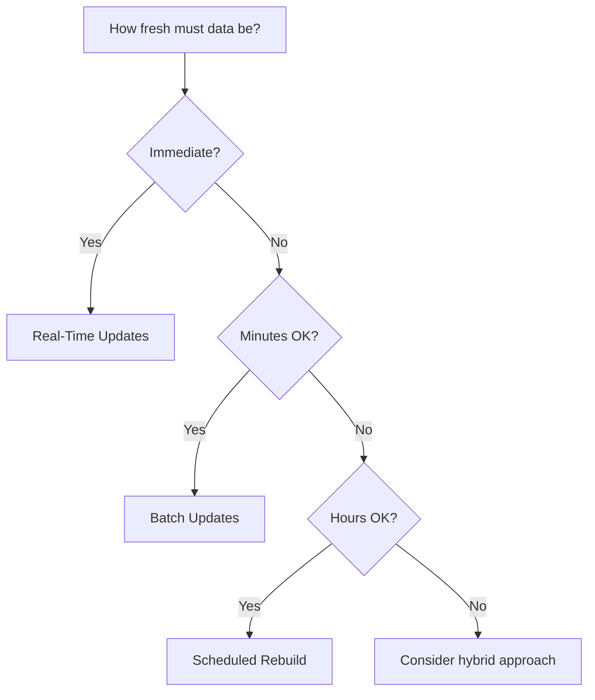

# Update Strategies

## Introduction

Vector databases need to handle dynamic data—documents get added, updated, and deleted. Different update strategies trade off between consistency, performance, and complexity.

---

## Update Strategy Comparison

| Strategy | Latency | Consistency | Complexity | Best For |
|----------|---------|-------------|------------|----------|
| **Real-time** | Low | Immediate | High | User-facing, small scale |
| **Batch** | Medium | Delayed | Medium | Large ingestion jobs |
| **Rebuild** | High | Periodic | Low | Static or slowly-changing data |

---

## Real-Time Updates

Process inserts and updates immediately as they arrive.

```python
import numpy as np
import faiss
from typing import Optional

class RealTimeVectorStore:
    """Handle inserts/updates immediately."""
    
    def __init__(self, dimension: int, M: int = 32):
        self.dimension = dimension
        self.index = faiss.IndexHNSWFlat(dimension, M)
        self.id_map: dict[str, int] = {}  # external_id -> internal_index
        self.reverse_map: dict[int, str] = {}  # internal_index -> external_id
        self.metadata_store: dict[int, dict] = {}
        self.deleted: set[int] = set()  # Soft-deleted internal indices
        
    def upsert(self, id: str, vector: np.ndarray, metadata: dict) -> bool:
        """Insert or update a vector."""
        vector = vector.astype('float32').reshape(1, -1)
        
        if id in self.id_map:
            # Update: HNSW doesn't support in-place updates
            # Mark old as deleted, add new
            old_internal_idx = self.id_map[id]
            self.deleted.add(old_internal_idx)
        
        # Add new vector
        internal_idx = self.index.ntotal
        self.index.add(vector)
        
        # Update mappings
        self.id_map[id] = internal_idx
        self.reverse_map[internal_idx] = id
        self.metadata_store[internal_idx] = metadata
        
        return True
    
    def delete(self, id: str) -> bool:
        """Soft delete a vector."""
        if id not in self.id_map:
            return False
        
        internal_idx = self.id_map[id]
        self.deleted.add(internal_idx)
        del self.id_map[id]
        
        return True
    
    def search(
        self, 
        query: np.ndarray, 
        k: int = 10,
        filter_deleted: bool = True
    ) -> list[dict]:
        """Search with optional deleted filtering."""
        query = query.astype('float32').reshape(1, -1)
        
        # Fetch extra results to account for deleted items
        fetch_k = k * 2 if filter_deleted else k
        distances, indices = self.index.search(query, fetch_k)
        
        results = []
        for dist, idx in zip(distances[0], indices[0]):
            if idx == -1:  # Faiss returns -1 for not found
                continue
            if filter_deleted and idx in self.deleted:
                continue
            
            external_id = self.reverse_map.get(idx)
            if external_id:
                results.append({
                    "id": external_id,
                    "score": float(1 / (1 + dist)),  # Convert distance to score
                    "metadata": self.metadata_store.get(idx, {})
                })
            
            if len(results) >= k:
                break
        
        return results
    
    def get_stats(self) -> dict:
        """Get index statistics."""
        return {
            "total_vectors": self.index.ntotal,
            "active_vectors": self.index.ntotal - len(self.deleted),
            "deleted_vectors": len(self.deleted),
            "fragmentation": len(self.deleted) / max(1, self.index.ntotal)
        }
```

### Usage Example

```python
store = RealTimeVectorStore(dimension=1536)

# Insert
store.upsert("doc1", np.random.random(1536), {"title": "Document 1"})
store.upsert("doc2", np.random.random(1536), {"title": "Document 2"})

# Update (same ID)
store.upsert("doc1", np.random.random(1536), {"title": "Document 1 (Updated)"})

# Delete
store.delete("doc2")

# Search
results = store.search(np.random.random(1536), k=5)
print(store.get_stats())
```

**Output:**
```
{'total_vectors': 3, 'active_vectors': 1, 'deleted_vectors': 2, 'fragmentation': 0.667}
```

---

## Batch Updates

Collect updates and apply in batches for better efficiency.

```python
import time
from dataclasses import dataclass
from typing import Callable, Optional

@dataclass
class PendingUpdate:
    id: str
    vector: np.ndarray
    metadata: dict
    timestamp: float

class BatchVectorStore:
    """Collect updates and apply in batches."""
    
    def __init__(
        self, 
        dimension: int, 
        batch_size: int = 1000,
        flush_interval: float = 60.0  # seconds
    ):
        self.dimension = dimension
        self.batch_size = batch_size
        self.flush_interval = flush_interval
        
        self.index = faiss.IndexHNSWFlat(dimension, 32)
        self.id_map: dict[str, int] = {}
        self.metadata_store: dict[int, dict] = {}
        
        self.pending: list[PendingUpdate] = []
        self.last_flush = time.time()
        
    def add(
        self, 
        id: str, 
        vector: np.ndarray, 
        metadata: dict,
        auto_flush: bool = True
    ) -> None:
        """Queue an update."""
        self.pending.append(PendingUpdate(
            id=id,
            vector=vector.astype('float32'),
            metadata=metadata,
            timestamp=time.time()
        ))
        
        if auto_flush and self._should_flush():
            self.flush()
    
    def _should_flush(self) -> bool:
        """Check if we should flush pending updates."""
        size_trigger = len(self.pending) >= self.batch_size
        time_trigger = (time.time() - self.last_flush) >= self.flush_interval
        return size_trigger or time_trigger
    
    def flush(self, on_progress: Optional[Callable[[int, int], None]] = None) -> dict:
        """Apply all pending updates."""
        if not self.pending:
            return {"inserted": 0, "updated": 0}
        
        inserted = 0
        updated = 0
        
        # Collect vectors for batch insert
        vectors_to_add = []
        
        for i, update in enumerate(self.pending):
            if update.id in self.id_map:
                # Update: mark old as deleted (simplified)
                updated += 1
            else:
                inserted += 1
            
            vectors_to_add.append(update.vector)
            
            if on_progress and i % 100 == 0:
                on_progress(i, len(self.pending))
        
        # Batch insert
        vectors = np.vstack(vectors_to_add)
        start_idx = self.index.ntotal
        self.index.add(vectors)
        
        # Update mappings
        for i, update in enumerate(self.pending):
            internal_idx = start_idx + i
            self.id_map[update.id] = internal_idx
            self.metadata_store[internal_idx] = update.metadata
        
        # Clear pending
        self.pending = []
        self.last_flush = time.time()
        
        return {"inserted": inserted, "updated": updated}
    
    def search(self, query: np.ndarray, k: int = 10) -> list[dict]:
        """Search indexed vectors only."""
        # Auto-flush before search if there are pending updates
        if self.pending:
            self.flush()
        
        query = query.astype('float32').reshape(1, -1)
        distances, indices = self.index.search(query, k)
        
        return [
            {
                "id": self._get_external_id(idx),
                "score": float(1 / (1 + dist)),
                "metadata": self.metadata_store.get(idx, {})
            }
            for dist, idx in zip(distances[0], indices[0])
            if idx != -1
        ]
    
    def _get_external_id(self, internal_idx: int) -> Optional[str]:
        """Reverse lookup external ID."""
        for ext_id, int_idx in self.id_map.items():
            if int_idx == internal_idx:
                return ext_id
        return None
```

### Usage Example

```python
store = BatchVectorStore(dimension=1536, batch_size=100)

# Add many documents (queued)
for i in range(250):
    store.add(f"doc_{i}", np.random.random(1536), {"index": i})
    
# Check status before flush
print(f"Pending: {len(store.pending)}")  # 50 (250 - 2*100 flushed)
print(f"Indexed: {store.index.ntotal}")   # 200 (2 batches flushed)

# Manual flush
result = store.flush()
print(f"Flushed: {result}")  # {'inserted': 50, 'updated': 0}
```

---

## Index Rebuilding

Periodically rebuild the index to remove deleted items and optimize structure.

```python
class RebuildableVectorStore:
    """Vector store with periodic rebuild support."""
    
    def __init__(self, dimension: int):
        self.dimension = dimension
        self.index = faiss.IndexHNSWFlat(dimension, 32)
        self.records: dict[str, dict] = {}  # id -> {vector, metadata, deleted}
        
    def upsert(self, id: str, vector: np.ndarray, metadata: dict):
        """Store record (rebuild required for index update)."""
        self.records[id] = {
            "vector": vector.astype('float32'),
            "metadata": metadata,
            "deleted": False
        }
    
    def delete(self, id: str) -> bool:
        """Mark record as deleted."""
        if id in self.records:
            self.records[id]["deleted"] = True
            return True
        return False
    
    def rebuild(
        self, 
        filter_fn: Optional[Callable[[dict], bool]] = None,
        on_progress: Optional[Callable[[int, int], None]] = None
    ) -> dict:
        """Rebuild index from non-deleted records."""
        
        # Filter records
        active_records = [
            (id, rec) for id, rec in self.records.items()
            if not rec["deleted"] and (filter_fn is None or filter_fn(rec))
        ]
        
        if not active_records:
            self.index = faiss.IndexHNSWFlat(self.dimension, 32)
            return {"before": len(self.records), "after": 0}
        
        # Build new index
        new_index = faiss.IndexHNSWFlat(self.dimension, 32)
        vectors = np.vstack([rec["vector"] for _, rec in active_records])
        new_index.add(vectors)
        
        # Update ID mappings
        new_records = {}
        for i, (id, rec) in enumerate(active_records):
            new_records[id] = {
                "vector": rec["vector"],
                "metadata": rec["metadata"],
                "deleted": False,
                "internal_idx": i
            }
            if on_progress and i % 1000 == 0:
                on_progress(i, len(active_records))
        
        before_count = len(self.records)
        self.index = new_index
        self.records = new_records
        
        return {
            "before": before_count,
            "after": len(self.records),
            "removed": before_count - len(self.records)
        }
    
    def needs_rebuild(self, fragmentation_threshold: float = 0.3) -> bool:
        """Check if rebuild is recommended."""
        if not self.records:
            return False
        
        deleted_count = sum(1 for r in self.records.values() if r["deleted"])
        fragmentation = deleted_count / len(self.records)
        
        return fragmentation >= fragmentation_threshold
```

### Scheduled Rebuild

```python
import asyncio
from datetime import datetime, timedelta

class ScheduledRebuildManager:
    """Manage periodic index rebuilds."""
    
    def __init__(
        self, 
        store: RebuildableVectorStore,
        rebuild_interval: timedelta = timedelta(hours=6),
        fragmentation_threshold: float = 0.3
    ):
        self.store = store
        self.rebuild_interval = rebuild_interval
        self.fragmentation_threshold = fragmentation_threshold
        self.last_rebuild = datetime.now()
        self.running = False
        
    async def start(self):
        """Start the rebuild scheduler."""
        self.running = True
        while self.running:
            await asyncio.sleep(60)  # Check every minute
            
            should_rebuild = (
                datetime.now() - self.last_rebuild >= self.rebuild_interval
                or self.store.needs_rebuild(self.fragmentation_threshold)
            )
            
            if should_rebuild:
                print(f"[{datetime.now()}] Starting scheduled rebuild...")
                result = self.store.rebuild()
                self.last_rebuild = datetime.now()
                print(f"[{datetime.now()}] Rebuild complete: {result}")
    
    def stop(self):
        """Stop the scheduler."""
        self.running = False
```

---

## Choosing an Update Strategy

| Factor | Real-Time | Batch | Rebuild |
|--------|-----------|-------|---------|
| Data freshness | Immediate | Minutes | Hours |
| Write throughput | Low | High | N/A |
| Read during updates | Always available | Available | May block |
| Implementation complexity | High | Medium | Low |
| Memory overhead | Higher | Medium | Lowest |

### Decision Guide



---

## Best Practices

| ✅ Do | ❌ Don't |
|-------|---------|
| Use soft deletes for real-time | Hard delete from HNSW indexes |
| Batch writes for high throughput | Insert one-by-one in loops |
| Schedule rebuilds during low traffic | Rebuild during peak hours |
| Monitor fragmentation levels | Let fragmentation grow unbounded |

---

## Summary

✅ **Real-time updates** provide immediate consistency but add complexity

✅ **Batch updates** balance throughput with reasonable freshness

✅ **Periodic rebuilds** clean up fragmentation and optimize index structure

✅ **Hybrid approaches** combine strategies for different data types

**Next:** [Namespace & Collection Organization](./06-namespace-collection-organization.md)
