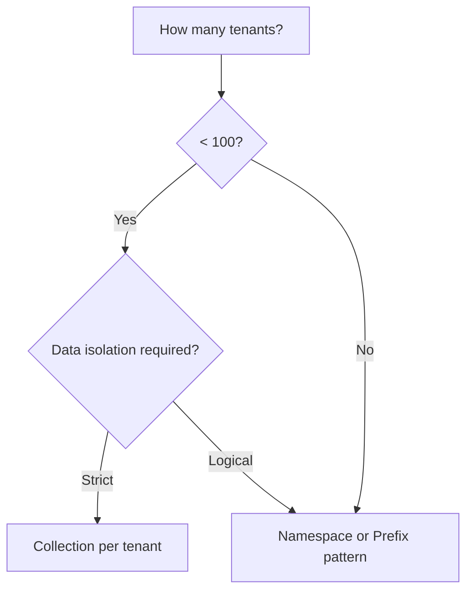

# Namespace & Collection Organization

## Introduction

As vector databases grow, organizing vectors into namespaces, collections, or partitions becomes essential for multi-tenant systems, logical separation, and query performance.

---

## Organization Concepts

| Concept | Description | Analogy |
|---------|-------------|---------|
| **Collection** | Top-level container for vectors | Database table |
| **Namespace** | Partition within a collection | Table partition |
| **Prefix** | ID-based logical grouping | File folder |
| **Metadata** | Field-based filtering | Table columns |

---

## Multi-Tenant Patterns

### Pattern 1: Collection per Tenant

Each tenant gets their own collection—complete isolation.

```python
from dataclasses import dataclass
from typing import Optional
import numpy as np
import faiss

@dataclass
class TenantCollection:
    tenant_id: str
    index: faiss.Index
    id_map: dict[str, int]
    metadata: dict[int, dict]
    
class CollectionPerTenantStore:
    """Complete tenant isolation with separate collections."""
    
    def __init__(self, dimension: int):
        self.dimension = dimension
        self.collections: dict[str, TenantCollection] = {}
        
    def get_or_create_collection(self, tenant_id: str) -> TenantCollection:
        """Get or create a tenant's collection."""
        if tenant_id not in self.collections:
            self.collections[tenant_id] = TenantCollection(
                tenant_id=tenant_id,
                index=faiss.IndexHNSWFlat(self.dimension, 32),
                id_map={},
                metadata={}
            )
        return self.collections[tenant_id]
    
    def add(
        self, 
        tenant_id: str, 
        doc_id: str, 
        vector: np.ndarray, 
        metadata: dict
    ) -> None:
        """Add vector to tenant's collection."""
        collection = self.get_or_create_collection(tenant_id)
        
        vector = vector.astype('float32').reshape(1, -1)
        internal_idx = collection.index.ntotal
        collection.index.add(vector)
        
        collection.id_map[doc_id] = internal_idx
        collection.metadata[internal_idx] = metadata
    
    def search(
        self, 
        tenant_id: str, 
        query: np.ndarray, 
        k: int = 10
    ) -> list[dict]:
        """Search within tenant's collection only."""
        if tenant_id not in self.collections:
            return []
        
        collection = self.collections[tenant_id]
        query = query.astype('float32').reshape(1, -1)
        
        distances, indices = collection.index.search(query, k)
        
        results = []
        for dist, idx in zip(distances[0], indices[0]):
            if idx == -1:
                continue
            # Reverse lookup
            doc_id = next(
                (did for did, iidx in collection.id_map.items() if iidx == idx),
                None
            )
            if doc_id:
                results.append({
                    "id": doc_id,
                    "score": float(1 / (1 + dist)),
                    "metadata": collection.metadata.get(idx, {})
                })
        
        return results
    
    def delete_tenant(self, tenant_id: str) -> bool:
        """Delete entire tenant collection."""
        if tenant_id in self.collections:
            del self.collections[tenant_id]
            return True
        return False
    
    def list_tenants(self) -> list[dict]:
        """List all tenants with stats."""
        return [
            {
                "tenant_id": tid,
                "vector_count": col.index.ntotal
            }
            for tid, col in self.collections.items()
        ]
```

### Pattern 2: Namespace within Collection

Single collection with namespace partitions—efficient for many small tenants.

```python
class NamespaceStore:
    """Single index with namespace-based filtering."""
    
    def __init__(self, dimension: int):
        self.dimension = dimension
        self.index = faiss.IndexHNSWFlat(dimension, 32)
        self.records: dict[int, dict] = {}  # internal_idx -> record
        self.namespace_indices: dict[str, set[int]] = {}  # namespace -> indices
        
    def add(
        self, 
        namespace: str, 
        doc_id: str, 
        vector: np.ndarray, 
        metadata: dict
    ) -> None:
        """Add vector with namespace."""
        vector = vector.astype('float32').reshape(1, -1)
        internal_idx = self.index.ntotal
        self.index.add(vector)
        
        self.records[internal_idx] = {
            "id": doc_id,
            "namespace": namespace,
            "metadata": metadata
        }
        
        if namespace not in self.namespace_indices:
            self.namespace_indices[namespace] = set()
        self.namespace_indices[namespace].add(internal_idx)
    
    def search(
        self, 
        query: np.ndarray, 
        k: int = 10,
        namespace: Optional[str] = None
    ) -> list[dict]:
        """Search with optional namespace filter."""
        query = query.astype('float32').reshape(1, -1)
        
        # Over-fetch if filtering by namespace
        fetch_k = k * 5 if namespace else k
        distances, indices = self.index.search(query, fetch_k)
        
        results = []
        valid_indices = (
            self.namespace_indices.get(namespace, set()) 
            if namespace else None
        )
        
        for dist, idx in zip(distances[0], indices[0]):
            if idx == -1:
                continue
            if valid_indices is not None and idx not in valid_indices:
                continue
            
            record = self.records.get(idx)
            if record:
                results.append({
                    "id": record["id"],
                    "namespace": record["namespace"],
                    "score": float(1 / (1 + dist)),
                    "metadata": record["metadata"]
                })
            
            if len(results) >= k:
                break
        
        return results
    
    def delete_namespace(self, namespace: str) -> int:
        """Soft delete all vectors in namespace."""
        if namespace not in self.namespace_indices:
            return 0
        
        count = len(self.namespace_indices[namespace])
        del self.namespace_indices[namespace]
        return count
```

### Pattern 3: Prefix-Based Organization

Use ID prefixes for logical grouping without separate indices.

```python
class PrefixOrganizedStore:
    """Organize by ID prefix convention."""
    
    def __init__(self, dimension: int):
        self.dimension = dimension
        self.index = faiss.IndexHNSWFlat(dimension, 32)
        self.id_map: dict[str, int] = {}  # full_id -> internal_idx
        self.metadata: dict[int, dict] = {}
        
    def _make_id(self, tenant: str, category: str, doc_id: str) -> str:
        """Create prefixed ID."""
        return f"{tenant}::{category}::{doc_id}"
    
    def add(
        self,
        tenant: str,
        category: str,
        doc_id: str,
        vector: np.ndarray,
        metadata: dict
    ) -> str:
        """Add with structured ID."""
        full_id = self._make_id(tenant, category, doc_id)
        
        vector = vector.astype('float32').reshape(1, -1)
        internal_idx = self.index.ntotal
        self.index.add(vector)
        
        self.id_map[full_id] = internal_idx
        self.metadata[internal_idx] = {
            **metadata,
            "_tenant": tenant,
            "_category": category,
            "_doc_id": doc_id
        }
        
        return full_id
    
    def search(
        self,
        query: np.ndarray,
        k: int = 10,
        tenant: Optional[str] = None,
        category: Optional[str] = None
    ) -> list[dict]:
        """Search with prefix filtering."""
        query = query.astype('float32').reshape(1, -1)
        
        # Build prefix filter
        prefix = None
        if tenant and category:
            prefix = f"{tenant}::{category}::"
        elif tenant:
            prefix = f"{tenant}::"
        
        # Over-fetch if filtering
        fetch_k = k * 10 if prefix else k
        distances, indices = self.index.search(query, fetch_k)
        
        results = []
        for dist, idx in zip(distances[0], indices[0]):
            if idx == -1:
                continue
            
            # Find the full ID for this index
            full_id = next(
                (fid for fid, iidx in self.id_map.items() if iidx == idx),
                None
            )
            
            if full_id is None:
                continue
            if prefix and not full_id.startswith(prefix):
                continue
            
            results.append({
                "id": full_id,
                "score": float(1 / (1 + dist)),
                "metadata": self.metadata.get(idx, {})
            })
            
            if len(results) >= k:
                break
        
        return results
```

---

## Comparison of Patterns

| Pattern | Isolation | Overhead | Scaling | Cross-tenant Search |
|---------|-----------|----------|---------|---------------------|
| **Collection per tenant** | Complete | High (many indices) | Per-tenant | Not possible |
| **Namespace** | Logical | Medium | Shared index | Possible with care |
| **Prefix-based** | Convention | Low | Shared index | Easy |
| **Metadata filtering** | Field-level | Low | Shared index | Easy |

---

## Cross-Collection Search

When you need to search across multiple collections or namespaces:

```python
from concurrent.futures import ThreadPoolExecutor
from typing import Optional

class CrossCollectionSearch:
    """Search across multiple tenant collections."""
    
    def __init__(self, store: CollectionPerTenantStore):
        self.store = store
        
    def search_all(
        self,
        query: np.ndarray,
        k: int = 10,
        tenant_ids: Optional[list[str]] = None
    ) -> list[dict]:
        """Search across specified or all tenants."""
        targets = tenant_ids or list(self.store.collections.keys())
        
        all_results = []
        
        def search_tenant(tid: str) -> list[dict]:
            results = self.store.search(tid, query, k)
            for r in results:
                r["tenant_id"] = tid
            return results
        
        # Parallel search across collections
        with ThreadPoolExecutor(max_workers=10) as executor:
            futures = [executor.submit(search_tenant, tid) for tid in targets]
            for future in futures:
                all_results.extend(future.result())
        
        # Sort by score and take top k
        all_results.sort(key=lambda x: x["score"], reverse=True)
        return all_results[:k]
```

---

## Best Practices

| ✅ Do | ❌ Don't |
|-------|---------|
| Use collection-per-tenant for enterprise isolation | Mix tenant data without logical separation |
| Choose pattern based on tenant count and size | Over-engineer for simple use cases |
| Plan for cross-tenant analytics early | Assume you'll never need cross-tenant search |
| Document your ID/namespace conventions | Use inconsistent naming patterns |

---

## Decision Guide



---

## Summary

✅ **Collection per tenant** provides complete isolation for enterprise needs

✅ **Namespaces** balance isolation with shared infrastructure efficiency

✅ **Prefix-based** organization offers flexibility with minimal overhead

✅ **Cross-collection search** enables analytics across organizational boundaries

**Next:** [Similarity Search](../06-similarity-search/00-similarity-search.md)
