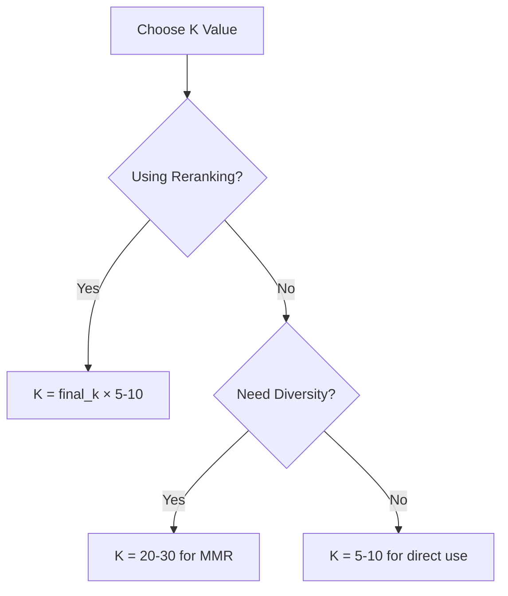

# Top-K Retrieval Strategies

## Introduction

Top-k retrieval returns the k most similar documents to your query. Choosing the right k value impacts both result quality and system performance.

---

## Choosing K Value

| Use Case | Recommended K | Reasoning |
|----------|---------------|-----------|
| Direct Q&A | 3-5 | Few highly relevant chunks needed |
| Research/exploration | 10-20 | More context for comprehensive answers |
| With reranking | 50-100 | Over-fetch for reranker to filter |
| Diverse results | 20-30 | More candidates for MMR diversity |

```python
from qdrant_client import QdrantClient
from qdrant_client.models import Distance, VectorParams

def search_with_dynamic_k(
    client: QdrantClient,
    collection_name: str,
    query_vector: list[float],
    base_k: int = 10,
    use_reranking: bool = False
) -> list[dict]:
    """Search with k adjusted based on use case."""
    
    # Over-fetch if reranking will be applied
    k = base_k * 5 if use_reranking else base_k
    
    results = client.search(
        collection_name=collection_name,
        query_vector=query_vector,
        limit=k
    )
    
    return [
        {
            "id": hit.id,
            "score": hit.score,
            "text": hit.payload.get("text", ""),
            "metadata": hit.payload
        }
        for hit in results
    ]
```

---

## Pagination for Large Results

When users need to browse many results, implement cursor-based pagination:

```python
from dataclasses import dataclass
from typing import Optional
import base64
import json

@dataclass
class SearchPage:
    """Paginated search results."""
    results: list[dict]
    next_cursor: Optional[str]
    has_more: bool

def encode_cursor(score: float, id: str) -> str:
    """Encode pagination cursor."""
    data = {"score": score, "id": id}
    return base64.b64encode(json.dumps(data).encode()).decode()

def decode_cursor(cursor: str) -> dict:
    """Decode pagination cursor."""
    return json.loads(base64.b64decode(cursor.encode()).decode())

def paginated_search(
    client: QdrantClient,
    collection_name: str,
    query_vector: list[float],
    page_size: int = 10,
    cursor: Optional[str] = None
) -> SearchPage:
    """Paginated vector search with cursor."""
    
    # Fetch one extra to detect if there are more results
    limit = page_size + 1
    
    search_params = {
        "collection_name": collection_name,
        "query_vector": query_vector,
        "limit": limit
    }
    
    # If cursor provided, add offset
    if cursor:
        cursor_data = decode_cursor(cursor)
        search_params["offset"] = cursor_data["id"]
    
    results = client.search(**search_params)
    
    # Check if there are more results
    has_more = len(results) > page_size
    results = results[:page_size]
    
    # Create next cursor from last result
    next_cursor = None
    if has_more and results:
        last = results[-1]
        next_cursor = encode_cursor(last.score, str(last.id))
    
    return SearchPage(
        results=[{
            "id": hit.id,
            "score": hit.score,
            "payload": hit.payload
        } for hit in results],
        next_cursor=next_cursor,
        has_more=has_more
    )
```

---

## Over-Fetching for Downstream Processing

When you plan to filter or rerank results, fetch more than you need:

```python
def search_for_reranking(
    client: QdrantClient,
    collection_name: str,
    query_vector: list[float],
    final_k: int = 10,
    over_fetch_factor: int = 5
) -> list[dict]:
    """Fetch more results for reranking pipeline."""
    
    # Fetch 5x what we need
    fetch_k = final_k * over_fetch_factor
    
    results = client.search(
        collection_name=collection_name,
        query_vector=query_vector,
        limit=fetch_k
    )
    
    return [
        {"id": hit.id, "score": hit.score, "text": hit.payload.get("text", "")}
        for hit in results
    ]
```

---

## K Value Trade-offs

| Larger K | Smaller K |
|----------|-----------|
| ✅ Better recall | ✅ Lower latency |
| ✅ More candidates for reranking | ✅ Lower cost |
| ❌ Higher latency | ❌ May miss relevant docs |
| ❌ More processing | ❌ Less diversity |



---

## Best Practices

| ✅ Do | ❌ Don't |
|-------|---------|
| Over-fetch when using reranking | Use same K for all use cases |
| Implement pagination for browsing | Load thousands of results at once |
| Adjust K based on downstream needs | Hard-code K values |
| Monitor latency vs K relationship | Ignore performance impact |

---

## Summary

✅ **Choose K based on use case** - Q&A needs fewer, reranking needs more

✅ **Over-fetch for reranking** - 5-10x the final result count

✅ **Use cursor-based pagination** for browsing large result sets

✅ **Balance recall vs latency** based on your requirements

**Next:** [Similarity Thresholds](./03-similarity-thresholds.md)
