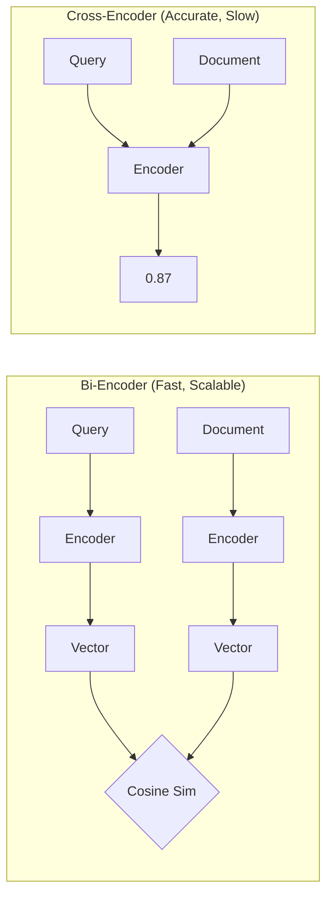
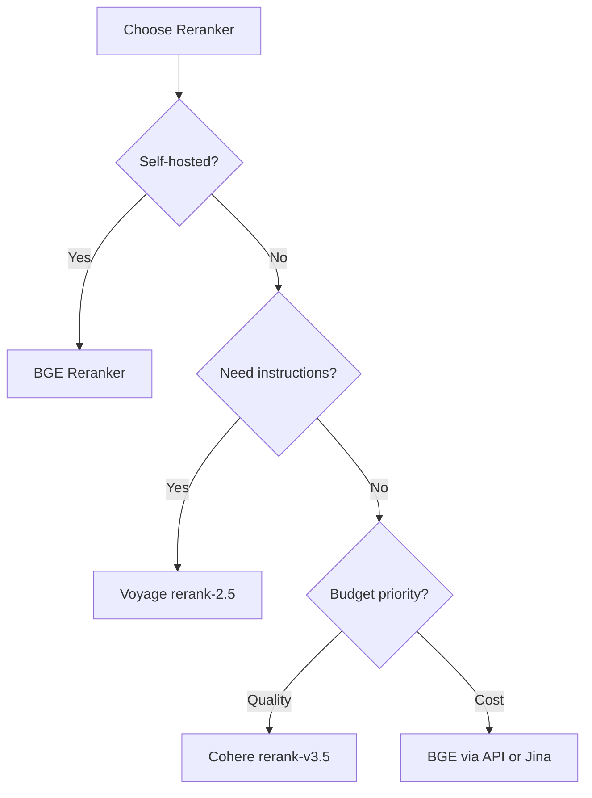

# Reranking Results

## Introduction

Reranking is a second-stage filter that dramatically improves precision by using more sophisticated models to score query-document pairs. The standard pattern: retrieve many with fast vector search, rerank few with accurate cross-encoders.

---

## Cross-Encoder vs Bi-Encoder



| Aspect | Bi-Encoder | Cross-Encoder |
|--------|------------|---------------|
| Speed | Very fast (pre-computed) | Slow (computed at query time) |
| Accuracy | Good | Excellent |
| Scalability | Billions of docs | ~100s of docs |
| Use case | Initial retrieval | Reranking top results |

---

## Using Cohere Rerank

```python
import cohere

def rerank_with_cohere(
    query: str,
    documents: list[str],
    top_k: int = 10
) -> list[dict]:
    """Rerank documents using Cohere Rerank API."""
    
    co = cohere.Client("your-api-key")
    
    response = co.rerank(
        model="rerank-v3.5",
        query=query,
        documents=documents,
        top_n=top_k,
        return_documents=True
    )
    
    return [
        {
            "text": result.document.text,
            "relevance_score": result.relevance_score,
            "original_index": result.index
        }
        for result in response.results
    ]

# Example
query = "How do I handle Python exceptions?"
documents = [
    "Python uses try/except blocks for exception handling.",
    "The weather in Paris is lovely this time of year.",
    "Error handling in Python involves catching and processing errors.",
    "Python lists can be sorted using the sort() method.",
    "Best practices for Python exception handling include using specific exceptions."
]

reranked = rerank_with_cohere(query, documents, top_k=3)
for result in reranked:
    print(f"[{result['relevance_score']:.3f}] {result['text'][:60]}...")
```

**Output:**
```
[0.987] Python uses try/except blocks for exception handling....
[0.965] Best practices for Python exception handling include using...
[0.891] Error handling in Python involves catching and processing...
```

---

## Using Voyage Reranker

```python
import voyageai

def rerank_with_voyage(
    query: str,
    documents: list[str],
    top_k: int = 10
) -> list[dict]:
    """Rerank using Voyage AI reranker."""
    
    vo = voyageai.Client()
    
    reranking = vo.rerank(
        query=query,
        documents=documents,
        model="rerank-2.5",
        top_k=top_k
    )
    
    return [
        {
            "text": r.document,
            "relevance_score": r.relevance_score,
            "original_index": r.index
        }
        for r in reranking.results
    ]

# Voyage supports instructions for better relevance
def rerank_with_instructions(
    query: str,
    documents: list[str],
    instruction: str = "Find documents that directly answer the question."
) -> list[dict]:
    """Rerank with instruction-following."""
    
    vo = voyageai.Client()
    
    # Prepend instruction to query
    instructed_query = f"{instruction}\n\nQuery: {query}"
    
    reranking = vo.rerank(
        query=instructed_query,
        documents=documents,
        model="rerank-2.5",
        top_k=10
    )
    
    return [
        {"text": r.document, "score": r.relevance_score}
        for r in reranking.results
    ]
```

---

## Open Source: BGE Reranker

For self-hosted solutions, use BGE rerankers from HuggingFace:

```python
from sentence_transformers import CrossEncoder

def rerank_with_bge(
    query: str,
    documents: list[str],
    top_k: int = 10
) -> list[dict]:
    """Rerank using BGE cross-encoder (open source)."""
    
    model = CrossEncoder("BAAI/bge-reranker-v2-m3")
    
    # Create query-document pairs
    pairs = [[query, doc] for doc in documents]
    
    # Score all pairs
    scores = model.predict(pairs)
    
    # Sort by score
    scored_docs = list(zip(documents, scores, range(len(documents))))
    scored_docs.sort(key=lambda x: x[1], reverse=True)
    
    return [
        {
            "text": doc,
            "relevance_score": float(score),
            "original_index": idx
        }
        for doc, score, idx in scored_docs[:top_k]
    ]
```

---

## Two-Stage Retrieval Architecture

The standard production pattern: retrieve many, rerank few:

```python
async def two_stage_search(
    query: str,
    vector_store,
    reranker,
    embed_fn,
    initial_k: int = 100,
    final_k: int = 10
) -> list[dict]:
    """Two-stage retrieval: vector search + reranking."""
    
    # Stage 1: Fast vector retrieval
    query_vector = embed_fn(query)
    candidates = await vector_store.search(
        query_vector=query_vector,
        limit=initial_k
    )
    
    if not candidates:
        return []
    
    # Stage 2: Rerank candidates
    documents = [c["text"] for c in candidates]
    reranked = reranker.rerank(
        query=query,
        documents=documents,
        top_k=final_k
    )
    
    # Merge metadata from original results
    final_results = []
    for r in reranked:
        original = candidates[r["original_index"]]
        final_results.append({
            **original,
            "rerank_score": r["relevance_score"]
        })
    
    return final_results
```

---

## Cost-Latency Trade-offs

| Reranker | Latency | Cost per 1K docs | Quality |
|----------|---------|------------------|---------|
| Cohere rerank-v3.5 | ~100ms | $0.02 | Excellent |
| Voyage rerank-2.5 | ~150ms | $0.02 | Excellent |
| BGE (self-hosted) | ~50ms | Infrastructure | Very Good |
| Jina (API) | ~100ms | $0.02 | Very Good |

> **Tip:** Rerank fewer documents (50-100) for production. Reranking 1000 documents adds significant latency and cost with diminishing returns.

---

## Reranker Selection Guide



---

## Best Practices

| ✅ Do | ❌ Don't |
|-------|---------|
| Retrieve 50-100x final k | Rerank thousands of docs |
| Use cross-encoders for reranking | Use bi-encoders to rerank |
| Cache reranker model in memory | Load model on every request |
| Monitor reranking latency | Ignore performance impact |

---

## Summary

✅ **Two-stage retrieval** is the production standard: fast retrieval + accurate reranking

✅ **Cross-encoders outperform bi-encoders** for relevance scoring

✅ **Retrieve 5-10x more than needed** to give reranker good candidates

✅ **API rerankers** (Cohere, Voyage) offer excellent quality with minimal setup

**Next:** [Maximal Marginal Relevance](./09-maximal-marginal-relevance.md)
