# Why Chunking Matters

## Introduction

Even with models supporting 128K+ token context windows, chunking remains essential for effective retrieval. The goal isn't to fit everything in context—it's to find the *right* information precisely.

---

## Context Window Limits

While context windows have grown dramatically, practical limits remain:

| Model | Context Window | Practical Limit |
|-------|----------------|-----------------|
| GPT-4o | 128K tokens | ~100 pages |
| Claude 3.5 | 200K tokens | ~150 pages |
| Gemini 1.5 Pro | 2M tokens | ~1500 pages |

> **Note:** Even with 2M token windows, you can't fit entire knowledge bases. A typical enterprise has millions of documents.

### When Context Windows Aren't Enough

```python
# A modest knowledge base quickly exceeds any context window
knowledge_base = {
    "support_docs": 10_000,      # documents
    "avg_tokens_per_doc": 2_000,  # tokens
    "total_tokens": 20_000_000    # 20M tokens - exceeds all models
}

# Even "small" documentation sets are large
product_docs = {
    "pages": 500,
    "avg_tokens": 1_500,
    "total": 750_000  # Still too large for most models
}
```

---

## Retrieval Granularity

Chunking determines the precision of what you retrieve. Smaller chunks enable more targeted retrieval.

### Granularity Trade-offs

```mermaid
flowchart LR
    subgraph "Whole Document"
        D1[📄 Full Doc<br/>10K tokens]
    end
    
    subgraph "Large Chunks"
        C1[📄 2K tokens]
        C2[📄 2K tokens]
    end
    
    subgraph "Small Chunks"
        S1[📄 500]
        S2[📄 500]
        S3[📄 500]
        S4[📄 500]
    end
```



| Granularity | Precision | Context | Retrieval |
|-------------|-----------|---------|-----------|
| Whole document | Low | Complete | May retrieve 90% irrelevant |
| Large chunks | Medium | Good | May include noise |
| Small chunks | High | Limited | Precise but may lose context |

### Example: Query Precision

```python
query = "What is the rate limit for the chat completions API?"

# Whole document retrieval
retrieved_doc = """
OpenAI API Reference
...10,000 tokens of general API documentation...
Rate limits: Chat completions: 10K RPM...  # <-- buried in noise
...more documentation...
"""

# Chunked retrieval
retrieved_chunk = """
Rate Limits - Chat Completions API
- Tier 1: 500 RPM, 10K TPM
- Tier 2: 5K RPM, 80K TPM  
- Tier 3: 10K RPM, 200K TPM
"""
# Much more precise and relevant
```

---

## Relevance Precision

Smaller chunks produce more focused embeddings:

```python
import numpy as np

# Large chunk embedding captures many topics
large_chunk = """
Python is a programming language. It supports object-oriented 
programming. Python has many libraries. NumPy is used for numerical
computing. Pandas handles data manipulation. Machine learning uses
scikit-learn. Deep learning uses PyTorch and TensorFlow.
"""
# Embedding represents: Python + OOP + NumPy + Pandas + ML + DL
# Query "NumPy array operations" gets diluted similarity

# Focused chunk embedding
focused_chunk = """
NumPy provides powerful array operations including element-wise
arithmetic, broadcasting, and vectorized functions. Use np.sum(),
np.mean(), and np.std() for aggregate calculations.
"""
# Embedding represents: NumPy + arrays + operations
# Query "NumPy array operations" gets high similarity
```

---

## Cost Optimization

Smaller, precise chunks reduce token usage:

```python
def calculate_retrieval_cost(
    chunks_retrieved: int,
    avg_chunk_size: int,
    input_cost_per_1k: float = 0.01
) -> float:
    """Calculate cost of retrieved context."""
    total_tokens = chunks_retrieved * avg_chunk_size
    return (total_tokens / 1000) * input_cost_per_1k

# Large chunks: 5 × 2000 tokens = 10,000 tokens
large_chunk_cost = calculate_retrieval_cost(5, 2000)  # $0.10

# Small chunks: 5 × 500 tokens = 2,500 tokens
small_chunk_cost = calculate_retrieval_cost(5, 500)   # $0.025

# 75% cost reduction with same number of chunks
```

---

## The "Lost in the Middle" Problem

LLMs struggle to use information from the middle of long contexts:


Research shows:
- Information at the **beginning** and **end** of context is used well
- Information in the **middle** may be ignored or misused
- Performance degrades as context length increases

### Implications for Chunking

```python
# Bad: One massive chunk with answer buried in middle
bad_context = f"""
[2000 tokens of background]
The API key must be stored in environment variables.  # <-- may be missed
[2000 tokens more content]
"""

# Good: Precise chunk with relevant info prominently placed
good_context = """
API Key Security Best Practices:
- Store API keys in environment variables
- Never commit keys to version control
- Use secret management services in production
"""
```

---

## Chunking Enables Filtering

Smaller chunks with metadata enable targeted retrieval:

```python
# Each chunk carries metadata for filtering
chunk = {
    "text": "Configure rate limiting with Redis...",
    "metadata": {
        "source": "deployment-guide.md",
        "section": "Rate Limiting",
        "page": 42,
        "category": "infrastructure",
        "updated": "2025-01-15"
    }
}

# Now we can filter by:
# - Document source
# - Section/topic
# - Category
# - Date range
```

---

## When NOT to Chunk

Sometimes chunking isn't needed:

| Scenario | Recommendation |
|----------|----------------|
| Knowledge base < 200K tokens | Use full context with prompt caching |
| Single document Q&A | May use full document |
| Highly structured data | Consider per-record indexing |
| Real-time summarization | Process document streams |

---

## Best Practices

| ✅ Do | ❌ Don't |
|-------|---------|
| Match chunk size to use case | Use one size for everything |
| Consider retrieval precision | Chunk arbitrarily |
| Account for context window limits | Assume bigger chunks are better |
| Test with real queries | Skip evaluation |

---

## Summary

✅ **Context windows have limits** - even 2M tokens isn't enough for enterprise knowledge bases

✅ **Granularity affects precision** - smaller chunks enable targeted retrieval

✅ **Cost scales with tokens** - precise chunks reduce API costs by 75%+

✅ **"Lost in the middle"** - LLMs miss information buried in long contexts

✅ **Metadata enables filtering** - chunks can carry source and section info

**Next:** [Chunk Size Considerations](./02-chunk-size-considerations.md)
