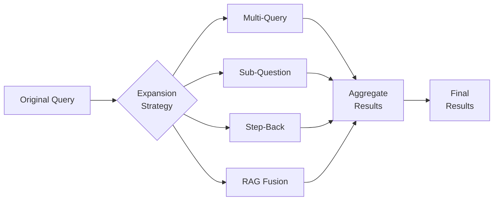

# Query Expansion Techniques

## Introduction

Query expansion transforms a single user query into multiple reformulated queries, then aggregates the results. This improves recall by capturing different phrasings and aspects of the user's intent.

> **🤖 AI Context:** Modern LLMs excel at query expansion because they understand semantics. A query like "Python async" can be expanded to variations covering "asyncio", "coroutines", "await", and "concurrent programming."

---

## Query Expansion Strategies



---

## Multi-Query Generation

Generate query variations with different phrasings:

```python
from openai import OpenAI

client = OpenAI()

def generate_multi_queries(query: str, n: int = 3) -> list[str]:
    """Generate multiple query variations."""
    
    response = client.chat.completions.create(
        model="gpt-4o-mini",
        messages=[
            {
                "role": "system",
                "content": f"""You are a helpful assistant that generates search queries.
Given a user question, generate {n} different versions of the question.
Each version should approach the topic from a different angle or use different terminology.
Output one query per line, without numbering or prefixes."""
            },
            {
                "role": "user",
                "content": query
            }
        ],
        max_tokens=200,
        temperature=0.7
    )
    
    queries = response.choices[0].message.content.strip().split('\n')
    queries = [q.strip() for q in queries if q.strip()]
    
    # Include original query
    return [query] + queries[:n]

# Example usage
queries = generate_multi_queries("How do I handle errors in async Python?")
# Output:
# [
#   "How do I handle errors in async Python?",
#   "Error handling in asyncio and coroutines",
#   "Try except with async await Python",
#   "Exception handling for asynchronous Python code"
# ]
```

---

## Sub-Question Decomposition

Break complex queries into simpler sub-questions:

```python
def decompose_query(query: str) -> list[str]:
    """Break complex query into sub-questions."""
    
    response = client.chat.completions.create(
        model="gpt-4o-mini",
        messages=[
            {
                "role": "system",
                "content": """You are a helpful assistant that breaks down complex questions.
Given a user question, decompose it into 2-4 simpler sub-questions.
Each sub-question should be answerable independently.
Output one question per line, without numbering."""
            },
            {
                "role": "user",
                "content": query
            }
        ],
        max_tokens=200,
        temperature=0.3
    )
    
    sub_questions = response.choices[0].message.content.strip().split('\n')
    return [q.strip() for q in sub_questions if q.strip()]

# Example
query = "How do I set up a production-ready RAG system?"
sub_questions = decompose_query(query)
# Output:
# [
#   "What are the components of a RAG system?",
#   "How do I choose and configure a vector database?",
#   "What are best practices for chunking documents?",
#   "How do I optimize RAG retrieval performance?"
# ]
```

---

## Step-Back Prompting

Ask a more general question to get broader context:

```python
def generate_step_back_query(query: str) -> str:
    """Generate a step-back query for broader context."""
    
    response = client.chat.completions.create(
        model="gpt-4o-mini",
        messages=[
            {
                "role": "system",
                "content": """You are a helpful assistant that generates step-back questions.
Given a specific question, generate a more general question that would provide 
background knowledge helpful for answering the original question.

Example:
Specific: "Why did my Docker container fail with OOM error?"
Step-back: "How does Docker handle memory limits and allocation?"

Output only the step-back question, nothing else."""
            },
            {
                "role": "user",
                "content": query
            }
        ],
        max_tokens=100,
        temperature=0.3
    )
    
    return response.choices[0].message.content.strip()

# Example
query = "Why is my RAG system returning irrelevant results?"
step_back = generate_step_back_query(query)
# Output: "How does semantic search and retrieval work in RAG systems?"
```

---

## RAG Fusion

Combine results from multiple queries using Reciprocal Rank Fusion:

```python
def reciprocal_rank_fusion(
    results_list: list[list[dict]],
    k: int = 60
) -> list[dict]:
    """Fuse multiple result sets using RRF."""
    
    doc_scores = {}
    doc_data = {}
    
    for results in results_list:
        for rank, doc in enumerate(results):
            doc_id = doc["id"]
            
            # RRF formula: 1 / (k + rank)
            rrf_score = 1.0 / (k + rank + 1)  # +1 for 0-indexed
            
            if doc_id not in doc_scores:
                doc_scores[doc_id] = 0
                doc_data[doc_id] = doc
            
            doc_scores[doc_id] += rrf_score
    
    # Sort by combined RRF score
    sorted_docs = sorted(
        doc_scores.items(),
        key=lambda x: x[1],
        reverse=True
    )
    
    # Return documents with scores
    return [
        {**doc_data[doc_id], "rrf_score": score}
        for doc_id, score in sorted_docs
    ]


def rag_fusion_search(
    query: str,
    index,
    n_queries: int = 3,
    top_k: int = 10
) -> list[dict]:
    """Search with RAG Fusion."""
    
    # Generate query variations
    queries = generate_multi_queries(query, n=n_queries)
    
    # Search with each query
    all_results = []
    for q in queries:
        results = index.search(q, top_k=top_k)
        all_results.append(results)
    
    # Fuse results with RRF
    fused_results = reciprocal_rank_fusion(all_results)
    
    return fused_results[:top_k]
```

---

## Combined Expansion Strategy

Use multiple strategies together:

```python
class QueryExpander:
    """Combined query expansion with multiple strategies."""
    
    def __init__(self, client: OpenAI):
        self.client = client
    
    def expand(
        self,
        query: str,
        strategies: list[str] = None
    ) -> list[str]:
        """Expand query using specified strategies."""
        
        if strategies is None:
            strategies = ["multi", "sub", "step_back"]
        
        expanded = [query]  # Always include original
        
        if "multi" in strategies:
            expanded.extend(generate_multi_queries(query))
        
        if "sub" in strategies:
            expanded.extend(decompose_query(query))
        
        if "step_back" in strategies:
            expanded.append(generate_step_back_query(query))
        
        # Deduplicate while preserving order
        seen = set()
        unique = []
        for q in expanded:
            q_lower = q.lower().strip()
            if q_lower not in seen:
                seen.add(q_lower)
                unique.append(q)
        
        return unique
    
    def search(
        self,
        query: str,
        index,
        strategies: list[str] = None,
        top_k: int = 10
    ) -> list[dict]:
        """Expand and search with RRF fusion."""
        
        queries = self.expand(query, strategies)
        
        all_results = [
            index.search(q, top_k=top_k) 
            for q in queries
        ]
        
        return reciprocal_rank_fusion(all_results)[:top_k]
```

---

## LangChain Query Expansion

```python
from langchain_openai import ChatOpenAI
from langchain.prompts import ChatPromptTemplate
from langchain_core.output_parsers import StrOutputParser

llm = ChatOpenAI(model="gpt-4o-mini")

# Multi-query prompt
multi_query_prompt = ChatPromptTemplate.from_template(
    """Generate 3 different versions of the following question 
for multi-perspective document retrieval.

Original question: {question}

Provide alternatives that:
1. Use different terminology
2. Focus on different aspects
3. Vary in specificity

Output each question on a new line:"""
)

multi_query_chain = multi_query_prompt | llm | StrOutputParser()

# Usage
alternative_queries = multi_query_chain.invoke(
    {"question": "How does vector search work?"}
)
queries = alternative_queries.strip().split('\n')
```

---

## Choosing Expansion Strategy

| Strategy | Best For | Latency | Cost |
|----------|----------|---------|------|
| Multi-Query | Synonym coverage | Low | Low |
| Sub-Questions | Complex queries | Medium | Medium |
| Step-Back | Conceptual queries | Low | Low |
| RAG Fusion | General improvement | Medium | Medium |
| All Combined | Maximum recall | High | High |

**Decision matrix:**

```python
def choose_strategy(query: str) -> list[str]:
    """Choose expansion strategies based on query type."""
    
    word_count = len(query.split())
    
    # Simple queries: just multi-query
    if word_count <= 5:
        return ["multi"]
    
    # Medium queries: multi + step-back
    if word_count <= 15:
        return ["multi", "step_back"]
    
    # Complex queries: full expansion
    return ["multi", "sub", "step_back"]
```

---

## Best Practices

| ✅ Do | ❌ Don't |
|-------|---------|
| Include original query | Replace it entirely |
| Deduplicate expanded queries | Search duplicates |
| Use RRF for fusion | Simple union of results |
| Limit expansion count (3-5) | Generate 10+ variations |
| Cache expansions | Regenerate for repeated queries |

---

## Summary

✅ **Multi-query** generates synonym variations of the query

✅ **Sub-questions** decompose complex queries into parts

✅ **Step-back** asks broader questions for context

✅ **RAG Fusion** uses RRF to combine results from all queries

✅ **Choose strategy** based on query complexity

**Next:** [Embedding Fine-Tuning](./04-embedding-fine-tuning.md)

---

<!-- 
Sources Consulted:
- LangChain MultiQuery Retriever: https://python.langchain.com/docs/how_to/MultiQueryRetriever/
- RAG Fusion Paper: https://arxiv.org/abs/2402.03367
-->
