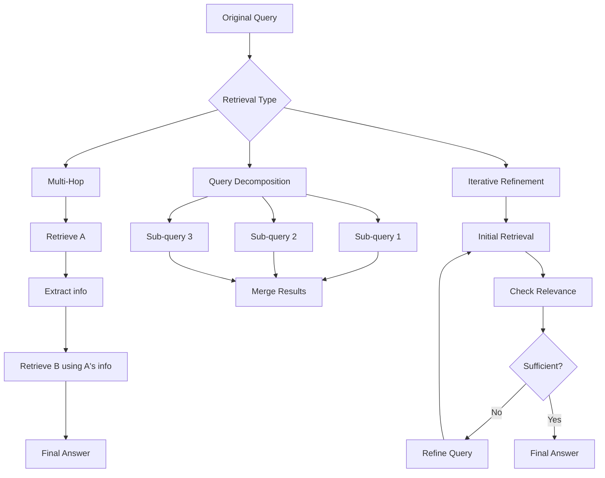

# Recursive Retrieval

## Introduction

Recursive retrieval performs multiple retrieval steps to answer complex questions. Instead of a single search, it decomposes questions, retrieves iteratively, and refines results. This is essential for multi-hop reasoning where the answer requires connecting information from multiple sources.

> **🤖 AI Context:** Recursive retrieval bridges the gap between simple RAG and full AI agents. It handles questions like "What's the revenue of the company that acquired Twitter?" which requires multiple retrievals.

---

## Types of Recursive Retrieval



---

## Multi-Hop Retrieval

Answer questions that require connecting information:

```python
from openai import OpenAI

client = OpenAI()

class MultiHopRetriever:
    """Multi-hop retrieval for complex questions."""
    
    def __init__(self, index):
        self.index = index
        self.max_hops = 3
    
    def retrieve(self, query: str) -> dict:
        """Perform multi-hop retrieval."""
        
        context = []
        current_query = query
        hop_results = []
        
        for hop in range(self.max_hops):
            # Retrieve for current query
            results = self.index.search(current_query, top_k=3)
            
            if not results:
                break
            
            hop_results.append({
                "hop": hop + 1,
                "query": current_query,
                "results": results
            })
            
            # Add to context
            for r in results:
                context.append(r["text"])
            
            # Check if we can answer
            can_answer, next_query = self._check_and_generate_next(
                original_query=query,
                current_context=context
            )
            
            if can_answer:
                break
            
            if next_query:
                current_query = next_query
            else:
                break
        
        return {
            "context": context,
            "hops": hop_results,
            "num_hops": len(hop_results)
        }
    
    def _check_and_generate_next(
        self,
        original_query: str,
        current_context: list[str]
    ) -> tuple[bool, str | None]:
        """Check if we can answer, or generate follow-up query."""
        
        context_text = "\n\n".join(current_context)
        
        response = client.chat.completions.create(
            model="gpt-4o-mini",
            messages=[
                {
                    "role": "system",
                    "content": """Analyze if the context can answer the question.
                    
If YES: respond with "SUFFICIENT"
If NO: respond with "NEED: [follow-up query to find missing information]"

Be specific about what information is missing."""
                },
                {
                    "role": "user",
                    "content": f"Question: {original_query}\n\nContext:\n{context_text}"
                }
            ],
            max_tokens=100
        )
        
        result = response.choices[0].message.content.strip()
        
        if result.startswith("SUFFICIENT"):
            return True, None
        elif result.startswith("NEED:"):
            return False, result[5:].strip()
        else:
            return False, None
```

---

## Query Decomposition

Break complex queries into sub-queries:

```python
def decompose_query(query: str) -> list[str]:
    """Decompose complex query into sub-queries."""
    
    response = client.chat.completions.create(
        model="gpt-4o-mini",
        messages=[
            {
                "role": "system",
                "content": """Break down the complex question into 2-4 simpler sub-questions.
Each sub-question should be independently answerable.
Output one question per line, no numbering."""
            },
            {
                "role": "user",
                "content": query
            }
        ],
        max_tokens=200
    )
    
    sub_queries = response.choices[0].message.content.strip().split('\n')
    return [q.strip() for q in sub_queries if q.strip()]


class DecompositionRetriever:
    """Retrieve using query decomposition."""
    
    def __init__(self, index):
        self.index = index
    
    def retrieve(self, query: str, top_k_per_query: int = 3) -> dict:
        """Decompose and retrieve for each sub-query."""
        
        sub_queries = decompose_query(query)
        
        all_results = []
        seen_ids = set()
        
        for sub_query in sub_queries:
            results = self.index.search(sub_query, top_k=top_k_per_query)
            
            for r in results:
                if r["id"] not in seen_ids:
                    seen_ids.add(r["id"])
                    all_results.append({
                        **r,
                        "source_query": sub_query
                    })
        
        return {
            "original_query": query,
            "sub_queries": sub_queries,
            "results": all_results
        }
```

---

## Iterative Refinement

Refine retrieval based on result quality:

```python
class IterativeRetriever:
    """Iteratively refine retrieval until sufficient."""
    
    def __init__(self, index):
        self.index = index
        self.max_iterations = 5
    
    def retrieve(
        self,
        query: str,
        min_relevant: int = 3,
        relevance_threshold: float = 0.7
    ) -> dict:
        """Iteratively retrieve until we have enough relevant results."""
        
        current_query = query
        all_results = []
        iterations = []
        
        for i in range(self.max_iterations):
            # Search
            results = self.index.search(current_query, top_k=10)
            
            # Filter by relevance
            relevant = [r for r in results if r["score"] >= relevance_threshold]
            
            iterations.append({
                "iteration": i + 1,
                "query": current_query,
                "total_results": len(results),
                "relevant_results": len(relevant)
            })
            
            # Add new relevant results
            for r in relevant:
                if r not in all_results:
                    all_results.append(r)
            
            # Check if sufficient
            if len(all_results) >= min_relevant:
                break
            
            # Generate refined query
            current_query = self._refine_query(
                original_query=query,
                current_results=all_results
            )
            
            if not current_query:
                break
        
        return {
            "query": query,
            "results": all_results,
            "iterations": iterations
        }
    
    def _refine_query(
        self,
        original_query: str,
        current_results: list[dict]
    ) -> str | None:
        """Generate refined query based on current results."""
        
        if not current_results:
            return None
        
        results_summary = "\n".join([
            r["text"][:100] for r in current_results[:5]
        ])
        
        response = client.chat.completions.create(
            model="gpt-4o-mini",
            messages=[
                {
                    "role": "system",
                    "content": """Generate a refined search query to find additional 
relevant information not covered by the current results.
Output only the query, nothing else."""
                },
                {
                    "role": "user",
                    "content": f"""Original question: {original_query}

Current results summary:
{results_summary}

Refined query to find additional information:"""
                }
            ],
            max_tokens=50
        )
        
        return response.choices[0].message.content.strip()
```

---

## LlamaIndex Recursive Retrieval

LlamaIndex provides built-in recursive retrieval:

```python
from llama_index.core import VectorStoreIndex, SimpleDirectoryReader
from llama_index.core.retrievers import RecursiveRetriever
from llama_index.core.query_engine import RetrieverQueryEngine

# Load and index documents
documents = SimpleDirectoryReader("data/").load_data()
index = VectorStoreIndex.from_documents(documents)

# Create recursive retriever
recursive_retriever = RecursiveRetriever(
    root_id="root",
    retriever_dict={"root": index.as_retriever(similarity_top_k=5)},
    query_engine_dict={},
    verbose=True
)

# Create query engine
query_engine = RetrieverQueryEngine.from_args(
    retriever=recursive_retriever,
)

# Query
response = query_engine.query(
    "What's the revenue of the company that acquired Twitter?"
)
```

---

## Combining Strategies

```python
class HybridRecursiveRetriever:
    """Combines decomposition + multi-hop + refinement."""
    
    def __init__(self, index):
        self.index = index
    
    def retrieve(self, query: str) -> dict:
        """Full recursive retrieval pipeline."""
        
        # Step 1: Decompose query
        sub_queries = decompose_query(query)
        
        all_context = []
        retrieval_log = []
        
        # Step 2: Multi-hop for each sub-query
        for sub_query in sub_queries:
            hop_context = []
            current_q = sub_query
            
            for hop in range(3):  # Max 3 hops per sub-query
                results = self.index.search(current_q, top_k=3)
                
                retrieval_log.append({
                    "sub_query": sub_query,
                    "hop": hop + 1,
                    "query": current_q,
                    "num_results": len(results)
                })
                
                for r in results:
                    if r["text"] not in hop_context:
                        hop_context.append(r["text"])
                
                # Check if need another hop
                can_answer, next_q = self._needs_more(sub_query, hop_context)
                
                if can_answer or not next_q:
                    break
                
                current_q = next_q
            
            all_context.extend(hop_context)
        
        # Step 3: Deduplicate context
        unique_context = list(dict.fromkeys(all_context))
        
        return {
            "query": query,
            "sub_queries": sub_queries,
            "context": unique_context,
            "retrieval_log": retrieval_log
        }
    
    def _needs_more(
        self,
        query: str,
        context: list[str]
    ) -> tuple[bool, str | None]:
        """Check if we need more hops."""
        
        if not context:
            return False, None
        
        context_text = "\n".join(context)
        
        response = client.chat.completions.create(
            model="gpt-4o-mini",
            messages=[
                {
                    "role": "system",
                    "content": """Given the question and context, determine:
1. Can the question be answered? (YES/NO)
2. If NO, what follow-up search would help?

Format: YES or NO: [follow-up query]"""
                },
                {
                    "role": "user",
                    "content": f"Question: {query}\n\nContext: {context_text}"
                }
            ],
            max_tokens=50
        )
        
        result = response.choices[0].message.content.strip()
        
        if result.startswith("YES"):
            return True, None
        elif "NO:" in result:
            return False, result.split("NO:")[1].strip()
        
        return True, None
```

---

## When to Use Recursive Retrieval

| Query Type | Recursive Needed? | Strategy |
|------------|-------------------|----------|
| Simple factoid | No | Single search |
| Multi-entity | Yes | Multi-hop |
| Comparative | Yes | Decomposition |
| Reasoning chain | Yes | Multi-hop |
| Broad topic | Maybe | Decomposition |

**Example queries requiring recursion:**
- "Compare revenue of Apple and Microsoft in 2023" → Decomposition
- "Who founded the company that made GPT-4?" → Multi-hop
- "What drugs treat diseases caused by vitamin D deficiency?" → Multi-hop

---

## Best Practices

| ✅ Do | ❌ Don't |
|-------|---------|
| Limit max hops (3-5) | Allow infinite recursion |
| Deduplicate context | Return duplicates |
| Log retrieval path | Lose traceability |
| Check for answer early | Always max hops |
| Timeout long retrievals | Let queries hang |

---

## Summary

✅ **Multi-hop** chains retrievals for connected information

✅ **Decomposition** breaks complex queries into sub-queries

✅ **Iterative refinement** improves results until sufficient

✅ **Combine strategies** for comprehensive retrieval

✅ **Limit recursion** depth to prevent infinite loops

**Next:** [Score Boosting](./09-score-boosting.md)

---

<!-- 
Sources Consulted:
- LlamaIndex Recursive Retriever: https://docs.llamaindex.ai/en/stable/examples/retrievers/recursive_retriever_nodes/
- Multi-hop QA: https://arxiv.org/abs/2305.14283
-->
