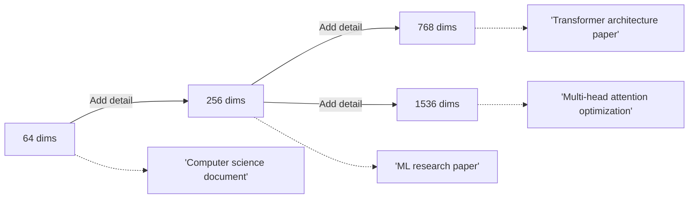

# What Are Matryoshka Embeddings?

## Introduction

Traditional embedding models produce vectors of a fixed size—768 dimensions, 1536 dimensions, or similar. If you need smaller vectors for faster search, you either train a different model or apply lossy compression like PCA. But what if the *same* embedding could work at multiple sizes, with quality gracefully degrading as you reduce dimensions?

**Matryoshka embeddings** solve this problem by encoding information in a hierarchical, coarse-to-fine structure. The first dimensions contain the most important information, and each additional dimension adds finer detail—like Russian nesting dolls (matryoshka), where each smaller doll is complete in itself.

### What We'll Cover

- The Russian nesting doll analogy and why it matters
- How Matryoshka Representation Learning (MRL) differs from standard embeddings
- The coarse-to-fine encoding principle
- Real-world examples of adaptive dimensionality

### Prerequisites

- Understanding of vector embeddings ([Lesson 01](../01-understanding-embeddings/))
- Basic familiarity with similarity search

---

## The Nesting Doll Metaphor

### Traditional Embeddings: All or Nothing

With conventional embedding models, every dimension is roughly equally important. If you have a 768-dimensional embedding:

```
[0.023, -0.156, 0.089, ..., 0.041, -0.078, 0.112]
 └────────────────────────────────────────────────┘
              All 768 dimensions needed
```

Truncating this to 384 dimensions doesn't give you a "smaller embedding"—it gives you a *broken* embedding. Critical information is scattered across all dimensions, so removing any subset damages the representation unpredictably.

### Matryoshka Embeddings: Nested Representations

Matryoshka embeddings fundamentally change this structure:

```
[0.023, -0.156, 0.089, 0.041, ..., -0.078, 0.112, 0.034, ...]
 └──────────────────────────────┘
   First 256 dims: Coarse meaning (topic, broad category)
 
 └──────────────────────────────────────────────────────────┘
   First 512 dims: Finer meaning (subtopics, relationships)
 
 └──────────────────────────────────────────────────────────────────┘
   All 768 dims: Full detail (nuances, rare concepts)
```

Each prefix is a complete, functional embedding:

| Dimensions | Information Level | Example Use |
|------------|------------------|-------------|
| 64-128 | Broad category | "Is this about technology?" |
| 256 | Topic-level | "Is this about machine learning?" |
| 512 | Subtopic | "Is this about neural networks?" |
| 768+ | Fine-grained | "Is this about transformer attention mechanisms?" |

---

## How Matryoshka Differs from Standard Embeddings

### Information Distribution

The key innovation is **information density in early dimensions**. MRL training forces the model to encode the most important semantic information first:

```
Standard Embedding:
Dimension:    1    100   200   300   400   500   600   700   768
Information: ███   ███   ███   ███   ███   ███   ███   ███   ███
              └─────────── Evenly distributed ────────────────┘

Matryoshka Embedding:
Dimension:    1    100   200   300   400   500   600   700   768
Information: ████████  ██████  █████  ████   ███   ███    ██    █
              └─ Most ─────────── Gradually less important ──────┘
```

This is achieved through a specific training objective that we'll explore in the next lesson.

### Why "Coarse-to-Fine"?

The term **coarse-to-fine** describes how information granularity increases with dimensions:



This mirrors how humans process information—we grasp the gist first, then refine our understanding with more details.

---

## Practical Example: Semantic Similarity

Let's see how a Matryoshka embedding behaves at different dimensions:

```python
from sentence_transformers import SentenceTransformer
import numpy as np

# Load a Matryoshka-trained model
model = SentenceTransformer("nomic-ai/nomic-embed-text-v1.5", trust_remote_code=True)

# Sample texts
query = "How do transformers handle long sequences?"
doc_relevant = "Attention mechanisms in transformers scale quadratically with sequence length, leading to memory issues for long documents."
doc_irrelevant = "The weather forecast predicts rain tomorrow."

# Generate full embeddings
emb_query = model.encode(query)
emb_relevant = model.encode(doc_relevant)
emb_irrelevant = model.encode(doc_irrelevant)

def cosine_sim(a, b):
    """Compute cosine similarity between two vectors."""
    return np.dot(a, b) / (np.linalg.norm(a) * np.linalg.norm(b))

# Test similarity at different dimensions
dimensions = [64, 128, 256, 512, 768]

print("Similarity at different dimensions:")
print("-" * 50)
for dim in dimensions:
    # Truncate and normalize
    q = emb_query[:dim]
    r = emb_relevant[:dim]
    i = emb_irrelevant[:dim]
    
    # Normalize after truncation (critical!)
    q = q / np.linalg.norm(q)
    r = r / np.linalg.norm(r)
    i = i / np.linalg.norm(i)
    
    sim_relevant = cosine_sim(q, r)
    sim_irrelevant = cosine_sim(q, i)
    
    print(f"{dim:4d} dims: relevant={sim_relevant:.3f}, irrelevant={sim_irrelevant:.3f}")
```

**Expected Output:**

```
Similarity at different dimensions:
--------------------------------------------------
  64 dims: relevant=0.712, irrelevant=0.234
 128 dims: relevant=0.756, irrelevant=0.198
 256 dims: relevant=0.781, irrelevant=0.156
 512 dims: relevant=0.798, irrelevant=0.143
 768 dims: relevant=0.803, irrelevant=0.138
```

Notice:
- Even at 64 dimensions (8% of full size), the relevant document scores much higher
- Quality improves with dimensions, but returns diminish after ~256
- The *ranking* is preserved across all dimension levels

---

## The Enabling Insight

The breakthrough enabling Matryoshka embeddings comes from a simple observation: **standard training doesn't constrain how information is distributed across dimensions**.

When you train an embedding model with standard contrastive loss, the model can scatter information anywhere in the vector space. There's no incentive to organize it hierarchically.

MRL adds exactly this incentive by computing loss at multiple dimension cutoffs:

```
Standard Training:
Loss = similarity_loss(full_embedding_a, full_embedding_b)

Matryoshka Training:
Loss = α₁ × loss(first_64_dims) 
     + α₂ × loss(first_128_dims)
     + α₃ × loss(first_256_dims)
     + α₄ × loss(full_embedding)
```

This forces the model to make each prefix independently useful—not just the full embedding.

---

## Real-World Applications

### 1. Two-Stage Retrieval

Use small dimensions for fast initial filtering, full dimensions for precise reranking:

```python
def two_stage_search(query_embedding, document_embeddings, k=10):
    """
    Stage 1: Fast search with truncated embeddings
    Stage 2: Precise reranking with full embeddings
    """
    # Stage 1: Coarse search at 256 dims (4x faster)
    query_256 = normalize(query_embedding[:256])
    docs_256 = [normalize(d[:256]) for d in document_embeddings]
    
    # Get top 100 candidates quickly
    candidates = fast_ann_search(query_256, docs_256, k=100)
    
    # Stage 2: Precise ranking at full dimensions
    query_full = normalize(query_embedding)
    scores = []
    for idx in candidates:
        doc_full = normalize(document_embeddings[idx])
        scores.append((idx, cosine_sim(query_full, doc_full)))
    
    # Return top k after precise scoring
    return sorted(scores, key=lambda x: x[1], reverse=True)[:k]
```

### 2. Adaptive Storage

Store embeddings at the dimension level your use case requires:

| Use Case | Recommended Dims | Storage per 1M docs |
|----------|------------------|---------------------|
| Coarse clustering | 128 | ~512 MB |
| General search | 256 | ~1 GB |
| High-quality retrieval | 512 | ~2 GB |
| Research/archival | Full (768-3072) | 3-12 GB |

### 3. Progressive Enhancement

Start with smaller embeddings and upgrade as quality requirements increase:

```python
# Initial deployment: cost-optimized
config_v1 = {"dimensions": 256, "storage_cost": "$100/month"}

# After product-market fit: quality-focused
config_v2 = {"dimensions": 768, "storage_cost": "$300/month"}

# No recomputation needed—just use more dimensions of existing embeddings!
```

---

## Visualizing the Difference

Consider how different embedding types handle the same sentence pair:

```
Query: "machine learning algorithms"

Candidate A: "deep neural network training methods"
Candidate B: "car repair instructions"

Standard 768-dim embedding (truncated to 256):
  Query-A similarity: 0.23 (damaged—information lost)
  Query-B similarity: 0.19 (damaged—information lost)
  Ranking: Unreliable ❌

Matryoshka 768-dim embedding (truncated to 256):
  Query-A similarity: 0.71 (high—related topic)
  Query-B similarity: 0.12 (low—unrelated topic)
  Ranking: Correct ✅
```

The Matryoshka embedding maintains semantic meaning because the first 256 dimensions were *designed* to be independently meaningful.

---

## Key Characteristics of Matryoshka Embeddings

| Property | Description |
|----------|-------------|
| **Prefix-usable** | Any prefix of the embedding is a valid, functional embedding |
| **Monotonically improving** | More dimensions → better quality (never worse) |
| **Dimension-efficient** | Early dimensions carry more information per dimension |
| **Compatible** | Can be used as drop-in replacement for standard embeddings |
| **Requires normalization** | Truncated vectors MUST be re-normalized for cosine similarity |

---

## Common Misconceptions

### ❌ "Matryoshka embeddings are just PCA"

No. PCA is a *post-hoc* compression technique applied to existing embeddings. Matryoshka embeddings are *trained* to have hierarchical structure—the model learns to organize information this way during training.

### ❌ "Smaller dimensions are always worse"

For *ranking*, smaller Matryoshka dimensions often match full-size performance remarkably well. The quality loss is in *absolute* similarity scores, not relative rankings.

### ❌ "You can truncate any embedding"

Only embeddings specifically trained with MRL or similar objectives support truncation. Standard embeddings will break.

---

## Summary

✅ **Matryoshka embeddings** contain nested representations—each prefix is independently useful  
✅ **Coarse-to-fine encoding** puts important information in early dimensions  
✅ **Standard embeddings** distribute information randomly across all dimensions  
✅ **MRL training** forces the model to optimize for multiple dimension cutoffs  
✅ **Applications** include two-stage retrieval, adaptive storage, and progressive enhancement

---

## Practice Exercise

### Your Task

Given a Matryoshka model, empirically verify the coarse-to-fine property:

1. Generate embeddings for 5 related documents and 5 unrelated documents
2. Compute average similarity to a query at 64, 128, 256, and 512 dimensions
3. Plot how the "related vs unrelated gap" changes with dimensions

### Expected Insight

The gap should be present even at low dimensions, confirming that Matryoshka embeddings preserve semantic relationships across all truncation levels.

<details>
<summary>💡 Hint</summary>

The gap (related_avg - unrelated_avg) should be positive at all dimensions, though it may widen slightly at higher dimensions.

</details>

---

**Next:** [How MRL Training Works →](./02-mrl-training.md)

---

<!-- 
Sources Consulted:
- arXiv 2205.13147: Matryoshka Representation Learning
- Sentence Transformers MatryoshkaLoss documentation
- HuggingFace Matryoshka Embeddings blog
-->
