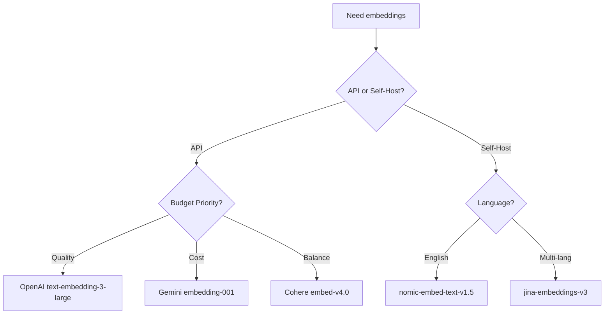

# Supported Models for Matryoshka Embeddings

## Introduction

Not all embedding models support dimension reduction—only those specifically trained with Matryoshka Representation Learning (MRL) or similar techniques can be safely truncated. Using the wrong model will silently produce broken embeddings that appear to work but give poor results.

This lesson catalogs the major models that support Matryoshka embeddings, their dimension ranges, and how to identify MRL-compatible models.

### What We'll Cover

- Commercial API models with native dimension support
- Open-source Matryoshka-trained models
- How to check if a model supports truncation
- Comparison of quality and capabilities

### Prerequisites

- Understanding of [What Are Matryoshka Embeddings](./01-what-are-matryoshka-embeddings.md)
- Familiarity with embedding APIs

---

## Commercial API Models

### OpenAI text-embedding-3 Family

OpenAI's third-generation embedding models support native dimension reduction:

| Model | Max Dimensions | Default | Recommended Minimum |
|-------|----------------|---------|---------------------|
| `text-embedding-3-large` | 3072 | 3072 | 256 |
| `text-embedding-3-small` | 1536 | 1536 | 512 |

**Key Features:**
- Embeddings are **pre-normalized** to unit length
- Dimension parameter directly returns truncated embeddings
- API-side truncation (no local post-processing needed)

```python
from openai import OpenAI

client = OpenAI()

# Request reduced dimensions directly from API
response = client.embeddings.create(
    model="text-embedding-3-large",
    input="Machine learning enables computers to learn from data.",
    dimensions=256  # Returns 256-dim embedding
)

embedding = response.data[0].embedding
print(f"Dimension: {len(embedding)}")  # 256
```

**Performance Notes:**
- `text-embedding-3-large` at 256 dims outperforms `ada-002` at 1536 dims
- Cost is based on token count, not dimensions (no savings from smaller dims)

> **Important:** Only `text-embedding-3-*` models support the `dimensions` parameter. Earlier models like `text-embedding-ada-002` do NOT support truncation.

---

### Google Gemini Embeddings

The Gemini embedding model supports flexible dimensionality:

| Model | Max Dimensions | Default | Recommended |
|-------|----------------|---------|-------------|
| `gemini-embedding-001` | 3072 | 768 | 768, 1536, 3072 |

**Key Features:**
- Supports task-specific optimization via `task_type`
- **Requires manual normalization** after dimension reduction
- Designed for RAG, classification, and clustering

```python
import google.generativeai as genai

genai.configure(api_key="your-api-key")

result = genai.embed_content(
    model="models/gemini-embedding-001",
    content="Machine learning is transforming industries.",
    output_dimensionality=768,  # Reduced from default 768 to 768 (no change) or lower
    task_type="RETRIEVAL_DOCUMENT"
)

embedding = result['embedding']
```

**Task Types:**

| Task Type | Use Case |
|-----------|----------|
| `RETRIEVAL_QUERY` | Query in retrieval systems |
| `RETRIEVAL_DOCUMENT` | Document in retrieval systems |
| `SEMANTIC_SIMILARITY` | Sentence/paragraph similarity |
| `CLASSIFICATION` | Text classification |
| `CLUSTERING` | Grouping similar texts |

**MTEB Benchmark Scores (Gemini):**

| Dimensions | MTEB Score |
|------------|------------|
| 768 | 67.99 |
| 1536 | 68.17 |
| 3072 | 68.16 |

> **Note:** At 768 dims, quality is nearly identical to 3072 dims—only 0.17 points difference!

---

### Cohere Embed v4

Cohere's latest embedding model supports dimension control:

| Model | Max Dimensions | Supported Dims |
|-------|----------------|----------------|
| `embed-v4.0` | 1024 | 256, 512, 1024 |

**Key Features:**
- Optimized for retrieval tasks
- Supports `input_type` for query/document distinction
- Returns truncated embeddings via API parameter

```python
import cohere

co = cohere.Client("your-api-key")

response = co.embed(
    texts=["What is machine learning?"],
    model="embed-v4.0",
    input_type="search_query",
    output_dimension=256  # Reduced dimensions
)

embedding = response.embeddings[0]
```

---

### Voyage AI

Voyage AI offers Matryoshka-compatible models:

| Model | Max Dimensions | Default |
|-------|----------------|---------|
| `voyage-3` | 1024 | 1024 |
| `voyage-3-lite` | 512 | 512 |
| `voyage-code-3` | 1024 | 1024 |

```python
import voyageai

client = voyageai.Client()

# Some Voyage models support output_dimension
embedding = client.embed(
    texts=["What is machine learning?"],
    model="voyage-3",
    output_dimension=512  # Check model docs for support
)
```

---

## Open-Source Models

### Nomic Embed

Nomic's open-source model is explicitly trained with MRL:

| Model | Max Dimensions | License |
|-------|----------------|---------|
| `nomic-ai/nomic-embed-text-v1.5` | 768 | Apache 2.0 |

**Key Features:**
- Fully open source and self-hostable
- Trained with Matryoshka loss
- Supports `truncate_dim` parameter

```python
from sentence_transformers import SentenceTransformer

model = SentenceTransformer(
    "nomic-ai/nomic-embed-text-v1.5",
    trust_remote_code=True,
    truncate_dim=256  # Use 256 dimensions
)

embeddings = model.encode([
    "search_query: What is machine learning?",
    "search_document: ML enables learning from data."
])

print(embeddings.shape)  # (2, 256)
```

> **Note:** Nomic embeddings require prefixes (`search_query:` or `search_document:`) for optimal performance.

---

### Sentence Transformers Models

Many community-trained models on Hugging Face support Matryoshka:

| Model | Base | Dimensions | Notes |
|-------|------|------------|-------|
| `tomaarsen/mpnet-base-nli-matryoshka` | MPNet | 768 | Example from SBERT docs |
| `Alibaba-NLP/gte-large-en-v1.5` | GTE | 1024 | General text embeddings |
| `jinaai/jina-embeddings-v3` | Jina | 1024 | Multi-language support |

**Finding Matryoshka Models on Hugging Face:**

Look for these indicators in model cards:
- "Matryoshka" in the model name or description
- Training with `MatryoshkaLoss` mentioned
- `truncate_dim` in usage examples

```python
from sentence_transformers import SentenceTransformer

# Load with dimension truncation
model = SentenceTransformer(
    "jinaai/jina-embeddings-v3",
    truncate_dim=512
)

# Alternative: truncate manually
model = SentenceTransformer("jinaai/jina-embeddings-v3")
embeddings = model.encode(["Hello world"])
truncated = embeddings[:, :512]  # First 512 dims
# Remember to normalize after manual truncation!
```

---

### Jina Embeddings v3

Jina's latest model offers extensive Matryoshka support:

| Model | Max Dimensions | Task Types |
|-------|----------------|------------|
| `jinaai/jina-embeddings-v3` | 1024 | retrieval, separation, classification, text-matching |

```python
from sentence_transformers import SentenceTransformer

model = SentenceTransformer(
    "jinaai/jina-embeddings-v3",
    trust_remote_code=True,
    truncate_dim=512
)

# Task-specific encoding
query_emb = model.encode(
    ["What is AI?"],
    task="retrieval.query"
)

doc_emb = model.encode(
    ["AI stands for Artificial Intelligence..."],
    task="retrieval.passage"
)
```

---

## Model Comparison Matrix

### API Models

| Provider | Model | Max Dims | Min Usable | Pre-normalized | Cost Model |
|----------|-------|----------|------------|----------------|------------|
| OpenAI | text-embedding-3-large | 3072 | 256 | ✅ Yes | Per token |
| OpenAI | text-embedding-3-small | 1536 | 512 | ✅ Yes | Per token |
| Google | gemini-embedding-001 | 3072 | 256 | ❌ No | Per character |
| Cohere | embed-v4.0 | 1024 | 256 | ✅ Yes | Per embed |
| Voyage | voyage-3 | 1024 | 256 | ✅ Yes | Per token |

### Open-Source Models

| Model | Max Dims | Min Usable | MTEB Score | Self-Hostable |
|-------|----------|------------|------------|---------------|
| nomic-embed-text-v1.5 | 768 | 64 | 62.28 | ✅ |
| jina-embeddings-v3 | 1024 | 128 | 65.5 | ✅ |
| gte-large-en-v1.5 | 1024 | 256 | 65.4 | ✅ |
| mxbai-embed-large-v1 | 1024 | 256 | 64.7 | ✅ |

---

## How to Check if a Model Supports Matryoshka

### Method 1: Read the Model Card

Check the Hugging Face model card for:
- "Matryoshka" in the description
- Training with `MatryoshkaLoss` mentioned
- Dimension reduction examples

### Method 2: Empirical Test

Test if truncation preserves quality:

```python
from sentence_transformers import SentenceTransformer
import numpy as np

def test_matryoshka_support(model_name, test_dims=[768, 384, 192, 96]):
    """Test if a model maintains quality at reduced dimensions."""
    model = SentenceTransformer(model_name)
    
    # Semantically related pairs
    pairs = [
        ("Machine learning algorithms", "AI models that learn from data"),
        ("The weather is sunny", "It's a bright day outside"),
    ]
    
    results = {}
    for dim in test_dims:
        sims = []
        for a, b in pairs:
            emb_a = model.encode(a)[:dim]
            emb_b = model.encode(b)[:dim]
            # Normalize
            emb_a = emb_a / np.linalg.norm(emb_a)
            emb_b = emb_b / np.linalg.norm(emb_b)
            sims.append(np.dot(emb_a, emb_b))
        results[dim] = np.mean(sims)
    
    # Check if quality degrades gracefully
    full_sim = results[max(test_dims)]
    for dim, sim in sorted(results.items()):
        quality_retained = sim / full_sim * 100
        print(f"{dim:4d} dims: {sim:.3f} ({quality_retained:.1f}% of full)")
    
    # Matryoshka models retain >90% quality at 25% dimensions
    quarter_dim = test_dims[-1] if test_dims else 96
    return results.get(quarter_dim, 0) / full_sim > 0.9

# Test a model
is_matryoshka = test_matryoshka_support("nomic-ai/nomic-embed-text-v1.5")
print(f"\nSupports Matryoshka: {is_matryoshka}")
```

### Method 3: Check API Documentation

For commercial APIs, check if they support a `dimensions` or similar parameter:

| API | Parameter | Docs URL |
|-----|-----------|----------|
| OpenAI | `dimensions` | [Embeddings Guide](https://platform.openai.com/docs/guides/embeddings) |
| Gemini | `output_dimensionality` | [Gemini Embeddings](https://ai.google.dev/gemini-api/docs/embeddings) |
| Cohere | `output_dimension` | [Embed API](https://docs.cohere.com/reference/embed) |

---

## Models That Do NOT Support Matryoshka

> **Warning:** Do not truncate embeddings from these models—they will produce broken results.

| Model | Why No Support |
|-------|---------------|
| `text-embedding-ada-002` | Not trained with MRL |
| `sentence-transformers/all-MiniLM-L6-v2` | Standard training only |
| `BAAI/bge-large-en-v1.5` | Standard training only |
| Most older models | Pre-date MRL technique (2022) |

If you need smaller embeddings from these models, use **PCA** or **quantization** instead—but expect higher quality loss compared to native Matryoshka models.

---

## Choosing the Right Model

### Decision Framework



### Recommendations by Use Case

| Use Case | Recommended Model | Dimensions |
|----------|------------------|------------|
| RAG (quality focus) | text-embedding-3-large | 1024-3072 |
| RAG (cost focus) | gemini-embedding-001 | 768 |
| Self-hosted RAG | nomic-embed-text-v1.5 | 256-768 |
| Semantic search | jina-embeddings-v3 | 512 |
| Classification | gemini-embedding-001 | 768 |
| Clustering | nomic-embed-text-v1.5 | 256 |

---

## Summary

✅ **OpenAI text-embedding-3-\*** models support native dimension reduction via `dimensions` parameter  
✅ **Gemini embedding-001** offers `output_dimensionality` with task-type optimization  
✅ **Cohere embed-v4.0** provides `output_dimension` for controlled truncation  
✅ **Open-source options** include Nomic, Jina, and community-trained Sentence Transformers  
✅ **Always verify** a model supports Matryoshka before truncating  
✅ **Older models** (ada-002, MiniLM, etc.) do NOT support truncation

---

## Quick Reference Card

```
┌─────────────────────────────────────────────────────────────┐
│           MATRYOSHKA MODEL QUICK REFERENCE                  │
├─────────────────────────────────────────────────────────────┤
│ OpenAI text-embedding-3-large                               │
│   Max: 3072 | Parameter: dimensions | Normalized: YES       │
│                                                             │
│ OpenAI text-embedding-3-small                               │
│   Max: 1536 | Parameter: dimensions | Normalized: YES       │
│                                                             │
│ Gemini gemini-embedding-001                                 │
│   Max: 3072 | Parameter: output_dimensionality | Norm: NO   │
│                                                             │
│ Cohere embed-v4.0                                           │
│   Max: 1024 | Parameter: output_dimension | Normalized: YES │
│                                                             │
│ Nomic nomic-embed-text-v1.5                                 │
│   Max: 768 | Parameter: truncate_dim | Normalized: context  │
│                                                             │
│ Jina jina-embeddings-v3                                     │
│   Max: 1024 | Parameter: truncate_dim | Normalized: context │
└─────────────────────────────────────────────────────────────┘
```

---

**Next:** [Dimension Selection Strategies →](./04-dimension-selection.md)

---

<!-- 
Sources Consulted:
- OpenAI Embeddings Guide: https://platform.openai.com/docs/guides/embeddings
- Gemini Embeddings Documentation: https://ai.google.dev/gemini-api/docs/embeddings
- Cohere Embed API Reference: https://docs.cohere.com/reference/embed
- Nomic Embed Model Card: https://huggingface.co/nomic-ai/nomic-embed-text-v1.5
- Sentence Transformers documentation
-->
