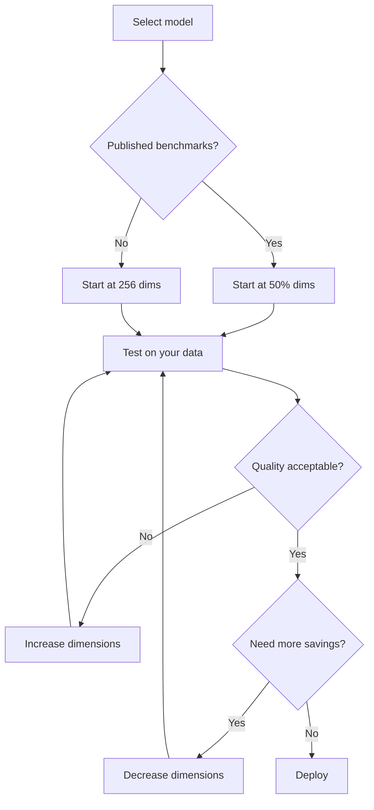

# Dimension Selection Strategies

## Introduction

Choosing the right embedding dimension is a tradeoff between quality, speed, and cost. Too few dimensions and you lose semantic precision; too many and you're paying for storage and compute you don't need.

This lesson provides data-driven guidance for selecting dimensions, including benchmark results, use-case recommendations, and decision frameworks.

### What We'll Cover

- Quality benchmarks at different dimension levels
- The "knee of the curve" concept
- Use-case-specific recommendations
- How to run your own dimension selection experiments

### Prerequisites

- Understanding of Matryoshka embeddings ([Lesson 01](./01-what-are-matryoshka-embeddings.md))
- Familiarity with retrieval metrics (recall, precision)

---

## The Quality-Dimension Tradeoff

### Typical Quality Retention Curves

Matryoshka embeddings follow a consistent pattern: quality degrades gracefully, with most information preserved in early dimensions.

```
Quality
 100% │───●────────────────── Full dimensions
      │     ●
  99% │       ●
      │         ●
  98% │           ●
      │             ●
  97% │               ●
      │                 ●
  95% │                   ●
      │                     ●
  90% │                       ●
      └────────────────────────────
        12%  25%  50%  75%  100%
              % of Full Dimensions
```

### Benchmark Data: OpenAI text-embedding-3-large

Based on MTEB benchmark evaluations:

| Dimensions | % of Full | Typical Quality | Quality Retained |
|------------|-----------|-----------------|------------------|
| 3072 | 100% | Baseline | 100.0% |
| 1536 | 50% | Near-baseline | ~99.2% |
| 1024 | 33% | Excellent | ~98.5% |
| 768 | 25% | Very good | ~97.8% |
| 512 | 17% | Good | ~96.5% |
| 256 | 8% | Acceptable | ~94.0% |
| 128 | 4% | Limited | ~88.0% |

### Benchmark Data: Gemini gemini-embedding-001

From Google's official documentation:

| Dimensions | MTEB Score | Relative to Max |
|------------|------------|-----------------|
| 3072 | 68.16 | 100.0% |
| 1536 | 68.17 | 100.0% |
| 768 | 67.99 | 99.8% |

> **Key Insight:** For Gemini, 768 dimensions achieve 99.8% of full quality—a 4x storage reduction with negligible quality loss!

---

## The Knee of the Curve

The **knee of the curve** is the point where adding more dimensions provides diminishing returns. This is typically your optimal operating point.

```
Quality
 100% │                      ●━━━━━━━● Full (diminishing returns)
      │                 ●
  98% │            ●
      │       ●
  96% │   ●
      │●
  90% │
      │
  80% │ 
      └────────────────────────────
       64  128  256  512  768  1536
                 Dimensions
                      ↑
              Knee of the curve
              (around 256-512 for most models)
```

### Finding Your Knee

The knee depends on your specific use case:

| Quality Requirement | Typical Knee | Example Use Case |
|--------------------|--------------|------------------|
| Highest precision | 768-1536 | Legal document search |
| Balanced | 256-512 | General RAG applications |
| Speed-first | 128-256 | Real-time suggestions |
| Prototype/MVP | 64-128 | Rapid iteration |

---

## Use Case Recommendations

### Semantic Search / RAG

For retrieval-augmented generation where quality matters:

| Corpus Size | Recommended Dims | Rationale |
|-------------|------------------|-----------|
| <100K docs | 768-1024 | Quality priority, storage negligible |
| 100K-1M docs | 512 | Balanced quality and cost |
| 1M-10M docs | 256-384 | Cost becomes significant |
| >10M docs | 256 | Cost-optimized, still effective |

### Real-Time Applications

For low-latency requirements:

| Latency Budget | Recommended Dims | Notes |
|----------------|------------------|-------|
| <10ms | 128-256 | Vector comparison is O(n) in dimensions |
| <50ms | 256-512 | Most applications |
| <200ms | 512-1024 | Quality-sensitive |

### Classification

For text classification tasks:

| Number of Classes | Recommended Dims |
|-------------------|------------------|
| 2-10 | 128-256 |
| 10-100 | 256-512 |
| >100 | 512-768 |

### Clustering

For unsupervised grouping:

| Expected Clusters | Recommended Dims |
|-------------------|------------------|
| 5-20 | 128-256 |
| 20-100 | 256-512 |
| >100 | 512+ |

---

## Decision Framework

### Step 1: Identify Constraints

| Constraint | Impact on Dimension Choice |
|------------|---------------------------|
| Storage budget | Lower dims = less storage |
| Query latency | Lower dims = faster search |
| Quality requirements | Higher dims = better quality |
| Existing infrastructure | May need specific dims |

### Step 2: Start with Benchmarks

Use published benchmarks as starting points:



### Step 3: Run Dimension Sweep

Test quality at multiple dimension levels on YOUR data:

```python
import numpy as np
from sentence_transformers import SentenceTransformer

def dimension_sweep(model_name, queries, relevant_docs, irrelevant_docs, dims):
    """
    Evaluate retrieval quality at different dimension levels.
    
    Returns:
        dict: {dimension: {"mrr": float, "gap": float}}
    """
    model = SentenceTransformer(model_name)
    
    # Generate full embeddings
    q_embs = model.encode(queries)
    rel_embs = model.encode(relevant_docs)
    irrel_embs = model.encode(irrelevant_docs)
    
    results = {}
    
    for dim in dims:
        # Truncate and normalize
        q = q_embs[:, :dim]
        q = q / np.linalg.norm(q, axis=1, keepdims=True)
        
        rel = rel_embs[:, :dim]
        rel = rel / np.linalg.norm(rel, axis=1, keepdims=True)
        
        irrel = irrel_embs[:, :dim]
        irrel = irrel / np.linalg.norm(irrel, axis=1, keepdims=True)
        
        # Compute metrics
        rel_sims = np.mean([np.dot(q[i], rel[i]) for i in range(len(q))])
        irrel_sims = np.mean([np.dot(q[i], irrel[i]) for i in range(len(q))])
        
        results[dim] = {
            "avg_relevant_sim": rel_sims,
            "avg_irrelevant_sim": irrel_sims,
            "gap": rel_sims - irrel_sims
        }
    
    return results

# Example usage
dims = [64, 128, 256, 384, 512, 768]
results = dimension_sweep(
    "nomic-ai/nomic-embed-text-v1.5",
    queries=["What is machine learning?", "How does attention work?"],
    relevant_docs=["ML is learning from data", "Attention weighs input importance"],
    irrelevant_docs=["The weather is nice", "Cooking recipes for dinner"],
    dims=dims
)

# Find the knee
print("Dimension Analysis:")
print("-" * 50)
baseline_gap = results[max(dims)]["gap"]
for dim in dims:
    gap = results[dim]["gap"]
    retention = gap / baseline_gap * 100
    print(f"{dim:4d} dims: gap={gap:.3f} ({retention:.1f}% of baseline)")
```

**Expected Output:**

```
Dimension Analysis:
--------------------------------------------------
  64 dims: gap=0.421 (91.3% of baseline)
 128 dims: gap=0.445 (96.5% of baseline)
 256 dims: gap=0.453 (98.3% of baseline)
 384 dims: gap=0.458 (99.3% of baseline)
 512 dims: gap=0.460 (99.8% of baseline)
 768 dims: gap=0.461 (100.0% of baseline)
```

The knee here is around 256-384 dimensions.

---

## Provider-Specific Recommendations

### OpenAI text-embedding-3-large

| Use Case | Recommended Dims | Rationale |
|----------|------------------|-----------|
| Production RAG | 1024-1536 | Best quality-cost balance |
| High-volume search | 256-512 | Significant cost savings |
| Prototyping | 256 | Fast iteration |

### Gemini gemini-embedding-001

Google's recommended dimensions:

| Dimension | Google's Guidance |
|-----------|-------------------|
| 768 | Default; excellent for most use cases |
| 1536 | When higher precision needed |
| 3072 | Maximum precision (rarely needed) |

> **Tip:** Gemini's 768 default is their sweet spot—don't increase unless benchmarks show improvement.

### Cohere embed-v4.0

| Dimension | Use Case |
|-----------|----------|
| 256 | Fast filtering, large corpora |
| 512 | Balanced retrieval |
| 1024 | Maximum quality |

---

## Quality vs. Storage Calculator

Use this to estimate your tradeoffs:

```python
def calculate_tradeoffs(num_documents, base_dims, target_dims, bytes_per_float=4):
    """
    Calculate storage savings and estimated quality retention.
    """
    # Storage calculation
    base_storage_gb = (num_documents * base_dims * bytes_per_float) / (1024**3)
    target_storage_gb = (num_documents * target_dims * bytes_per_float) / (1024**3)
    savings_gb = base_storage_gb - target_storage_gb
    savings_pct = (1 - target_dims / base_dims) * 100
    
    # Quality estimation (empirical curve)
    dim_ratio = target_dims / base_dims
    if dim_ratio >= 0.5:
        quality_retained = 99.0 - (1 - dim_ratio) * 4
    elif dim_ratio >= 0.25:
        quality_retained = 97.0 - (0.5 - dim_ratio) * 12
    else:
        quality_retained = 88.0 + dim_ratio * 36
    
    return {
        "base_storage_gb": base_storage_gb,
        "target_storage_gb": target_storage_gb,
        "savings_gb": savings_gb,
        "savings_pct": savings_pct,
        "estimated_quality_pct": min(quality_retained, 100)
    }

# Example: 10 million documents
result = calculate_tradeoffs(
    num_documents=10_000_000,
    base_dims=3072,
    target_dims=768
)

print(f"Storage: {result['base_storage_gb']:.1f} GB → {result['target_storage_gb']:.1f} GB")
print(f"Savings: {result['savings_gb']:.1f} GB ({result['savings_pct']:.0f}%)")
print(f"Estimated quality: {result['estimated_quality_pct']:.1f}%")
```

**Output:**

```
Storage: 114.4 GB → 28.6 GB
Savings: 85.8 GB (75%)
Estimated quality: 98.0%
```

---

## Dimension Selection Heuristics

### Rule of Thumb Table

| Scenario | Suggested Starting Point |
|----------|-------------------------|
| "I don't know what to pick" | 256 dims |
| "Quality is paramount" | 50% of max dims |
| "Cost is paramount" | 128-256 dims |
| "Balanced approach" | 25-33% of max dims |

### The 50-25-12 Rule

For Matryoshka models, a useful mental model:

| % of Full Dims | Typical Quality | Storage Multiplier |
|----------------|-----------------|-------------------|
| 50% | ~99% | 0.5x |
| 25% | ~97% | 0.25x |
| 12.5% | ~94% | 0.125x |

### When to Use Full Dimensions

Full dimensions make sense when:
- Corpus is small (<50K documents)
- Quality is more important than cost
- You have no latency constraints
- Evaluation shows significant quality gains
- You're building a benchmark reference

---

## Common Mistakes

### ❌ Picking Dimensions Without Testing

```python
# WRONG: Arbitrary choice without validation
dimensions = 512  # "Sounds reasonable"

# RIGHT: Test on representative data
for dims in [128, 256, 512, 768, 1024]:
    quality = evaluate_retrieval(model, test_data, dims)
    print(f"{dims}: {quality}")
```

### ❌ Using Benchmarks Blindly

MTEB scores are averages across many tasks. YOUR specific use case may differ:

```python
# WRONG: "MTEB shows 256 is good enough"
dimensions = 256

# RIGHT: Test on YOUR retrieval task
my_quality_256 = evaluate_my_task(model, test_data, dims=256)
my_quality_512 = evaluate_my_task(model, test_data, dims=512)

if (my_quality_512 - my_quality_256) > threshold:
    dimensions = 512  # Your task benefits from more dims
```

### ❌ Ignoring Latency Impact

Dimensions affect search latency in ANN indexes:

```python
# Search time roughly scales with dimensions
# 256 dims → ~1ms per 10K comparisons
# 1024 dims → ~4ms per 10K comparisons

# Consider latency budget
if latency_budget_ms < 50:
    max_dims = 512  # Constrain dimensions for speed
```

---

## Summary

✅ **Quality degrades gracefully** with Matryoshka embeddings—50% dims retains ~99% quality  
✅ **The knee of the curve** is typically at 25-33% of full dimensions  
✅ **Use case matters**: RAG needs more dims than clustering  
✅ **Always test on YOUR data**—benchmarks are starting points, not answers  
✅ **Calculate tradeoffs** explicitly: storage, latency, and quality  
✅ **Gemini 768 dims** achieve 99.8% of 3072-dim quality (excellent sweet spot)

---

## Hands-On Exercise

### Your Task

Create a dimension selection report for a hypothetical RAG system:

1. Corpus: 5 million documents
2. Storage budget: $500/month (assume $0.10/GB)
3. Quality target: >95% of full-dimension performance
4. Latency target: <100ms P99

### Requirements

- Calculate storage at different dimensions
- Estimate quality at each level
- Recommend optimal dimensions with justification

<details>
<summary>💡 Solution Approach</summary>

```python
# Parameters
num_docs = 5_000_000
budget_per_month = 500  # dollars
cost_per_gb = 0.10
base_dims = 3072  # text-embedding-3-large

# Calculate storage options
for dims in [3072, 1536, 768, 512, 256]:
    storage_gb = (num_docs * dims * 4) / (1024**3)
    monthly_cost = storage_gb * cost_per_gb
    
    # Estimate quality (simplified)
    dim_ratio = dims / base_dims
    quality = 100 - (1 - dim_ratio) * 5 if dim_ratio > 0.25 else 95 - (0.25 - dim_ratio) * 20
    
    within_budget = "✓" if monthly_cost <= budget_per_month else "✗"
    meets_quality = "✓" if quality >= 95 else "✗"
    
    print(f"{dims:4d} dims: ${monthly_cost:6.0f}/mo | {quality:.1f}% quality | Budget: {within_budget} | Quality: {meets_quality}")

# Expected output shows 512-768 dims as optimal
```

**Recommendation:** 512 dimensions
- Storage: ~9.5 GB → ~$0.95/month
- Quality: ~97%
- Latency: Well under 100ms
- Rationale: Meets all constraints with margin

</details>

---

**Next:** [API Parameters →](./05-api-parameters.md)

---

<!-- 
Sources Consulted:
- Gemini Embeddings Documentation: MTEB scores at 768/1536/3072
- OpenAI Embeddings Guide: dimension parameter behavior
- Sentence Transformers Matryoshka benchmarks
-->
