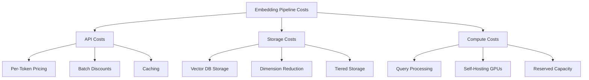

# Cost Optimization

## Introduction

Embedding systems can become expensive quickly—API calls, vector storage, and compute costs compound as your data grows. The difference between a well-optimized system and a naive implementation can mean 10x or more in monthly costs.

This lesson equips you with strategies to minimize embedding costs while maintaining search quality. We'll examine every cost lever: API pricing structures, batch processing discounts, caching strategies, dimension reduction techniques, self-hosting economics, and vector database right-sizing.

> **🤖 AI Context:** Cost optimization isn't just about saving money—it enables you to process more documents, serve more users, and iterate faster on your AI applications without budget constraints becoming blockers.

### What We'll Cover

- **Embedding Cost Factors** — Understanding API pricing, storage, compute, and bandwidth costs
- **Batch Embedding Discounts** — Leveraging batch APIs for 50% savings
- **Caching ROI** — Calculating when caching pays off
- **Dimension Reduction Savings** — Trading dimensions for storage and speed
- **Self-Hosting Economics** — When running your own models makes sense
- **Right-Sizing Vector Database** — Choosing serverless, reserved, or tiered storage

### Prerequisites

- Understanding of embeddings and vector databases (Lessons 01-16)
- Familiarity with API pricing models
- Basic spreadsheet or calculator skills for ROI analysis
- Experience with at least one embedding API

### Learning Objectives

By the end of this lesson, you will be able to:

1. Calculate total cost of ownership for an embedding pipeline
2. Implement batch processing for 50% API cost reduction
3. Design caching strategies with measurable ROI
4. Apply dimension reduction without significant quality loss
5. Evaluate self-hosting vs. API trade-offs
6. Select appropriate vector database tiers for your scale

---

## Lesson Structure

This lesson contains six focused topics:

| # | Topic | Focus |
|---|-------|-------|
| 01 | [Embedding Cost Factors](./01-embedding-cost-factors.md) | API pricing, storage, compute, bandwidth |
| 02 | [Batch Embedding Discounts](./02-batch-embedding-discounts.md) | Batch APIs, async patterns, size optimization |
| 03 | [Caching ROI](./03-caching-roi.md) | Hit rates, storage vs API cost, deduplication |
| 04 | [Dimension Reduction Savings](./04-dimension-reduction-savings.md) | Storage savings, speed gains, quality trade-offs |
| 05 | [Self-Hosting Economics](./05-self-hosting-economics.md) | GPU costs, break-even analysis, hybrid approaches |
| 06 | [Right-Sizing Vector Database](./06-right-sizing-vector-database.md) | Serverless vs reserved, tiered storage, archival |

---

## Cost Optimization at a Glance

### Quick Wins Summary

| Strategy | Savings Potential | Implementation Effort |
|----------|-------------------|----------------------|
| Batch API processing | 50% on API costs | Low |
| Embedding caching | 30-80% on API costs | Medium |
| Dimension reduction | 25-50% on storage | Low |
| Serverless vs reserved | 20-60% on DB costs | Medium |
| Self-hosting | 50-90% at scale | High |

---

## Current Pricing Landscape (2025)

### OpenAI Embedding Models

| Model | Standard Price | Batch Price | Dimensions |
|-------|---------------|-------------|------------|
| text-embedding-3-small | $0.02/1M tokens | $0.01/1M tokens | 1,536 |
| text-embedding-3-large | $0.13/1M tokens | $0.065/1M tokens | 3,072 |
| text-embedding-ada-002 | $0.10/1M tokens | $0.05/1M tokens | 1,536 |

> **Note:** Batch API provides 50% discount with 24-hour processing window.

### Google Gemini Embedding

| Model | Standard Price | Batch Price |
|-------|---------------|-------------|
| gemini-embedding-001 | Free tier available | $0.15/1M tokens |

### Pinecone Serverless Costs

| Resource | Pricing |
|----------|---------|
| Storage | Per GB/month |
| Read Units | Per query (scales with namespace size) |
| Write Units | Per KB written |
| Minimum (Standard) | $50/month |

---

## Recommended Learning Path

1. **Start with fundamentals** — Read [Embedding Cost Factors](./01-embedding-cost-factors.md) to understand the full cost picture
2. **Quick wins first** — Implement [Batch Embedding Discounts](./02-batch-embedding-discounts.md) for immediate 50% savings
3. **Add caching** — Build [Caching ROI](./03-caching-roi.md) infrastructure for repeated queries
4. **Optimize storage** — Apply [Dimension Reduction](./04-dimension-reduction-savings.md) for space and speed
5. **Evaluate self-hosting** — Analyze [Self-Hosting Economics](./05-self-hosting-economics.md) at scale
6. **Right-size database** — Choose proper [Vector Database Tiers](./06-right-sizing-vector-database.md)

---

## Summary

Cost optimization transforms embedding systems from expensive experiments into sustainable production infrastructure. The strategies in this lesson combine to reduce costs by 50-90% while maintaining search quality.

Key principles:
- ✅ Use batch APIs for all non-real-time embedding generation
- ✅ Cache embeddings for repeated content
- ✅ Reduce dimensions when quality metrics allow
- ✅ Match database tier to actual usage patterns
- ✅ Consider self-hosting above break-even volume

**Start with:** [Embedding Cost Factors](./01-embedding-cost-factors.md)

---

## Further Reading

- [OpenAI Embedding Pricing](https://platform.openai.com/docs/pricing) — Official pricing documentation
- [Pinecone Cost Management](https://docs.pinecone.io/guides/manage-cost/understanding-cost) — Vector database cost guide
- [Google AI Pricing](https://ai.google.dev/pricing) — Gemini embedding costs

---

[Next: Embedding Cost Factors →](./01-embedding-cost-factors.md)

---

<!-- 
Sources Consulted:
- OpenAI Pricing: https://platform.openai.com/docs/pricing
- OpenAI Embeddings Guide: https://platform.openai.com/docs/guides/embeddings
- Pinecone Cost Guide: https://docs.pinecone.io/guides/manage-cost/understanding-cost
- Pinecone Pricing: https://www.pinecone.io/pricing/
- Google AI Pricing: https://ai.google.dev/pricing
-->
