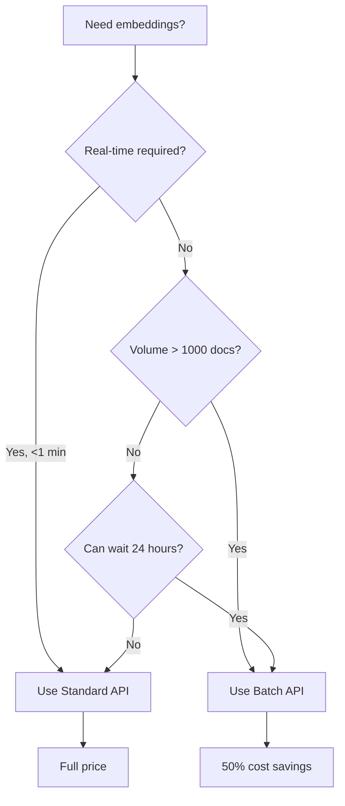
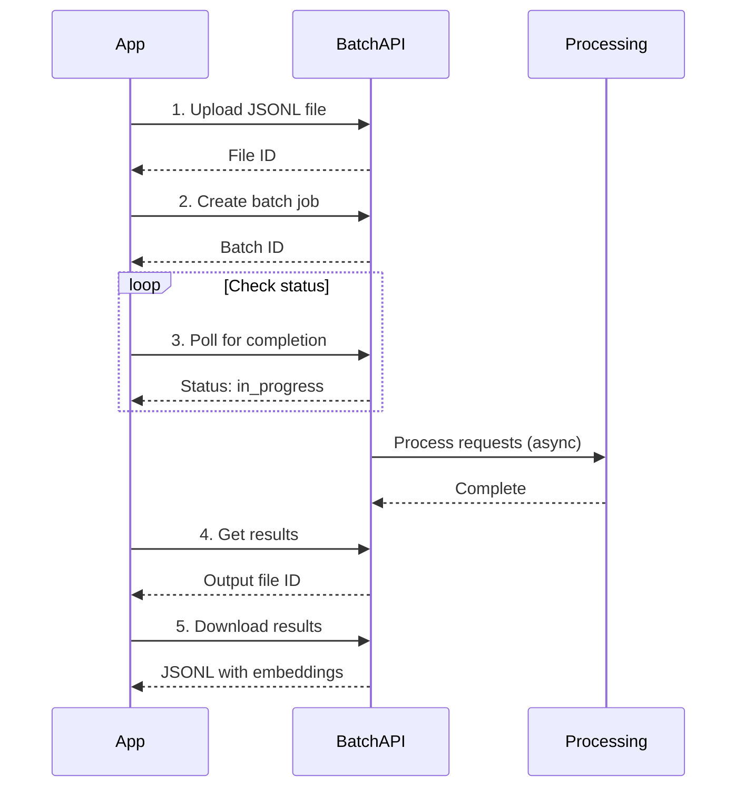

# Batch Embedding Discounts

## Introduction

Batch processing is the single most impactful cost optimization for embedding systems. Both OpenAI and Google offer 50% discounts for batch API requests, making this a "quick win" that requires minimal code changes.

The trade-off is simple: you accept a longer processing window (up to 24 hours) in exchange for half the cost. For most use cases—initial data ingestion, nightly updates, document processing—this is an excellent deal.

### What We'll Cover

- Understanding batch API economics
- Implementing OpenAI Batch API for embeddings
- Using Google Gemini batch processing
- Optimizing batch sizes for throughput
- Async patterns for batch job management
- Combining batch and real-time processing

### Prerequisites

- Familiarity with OpenAI and Google embedding APIs
- Understanding of async Python programming
- Basic knowledge of file I/O operations

---

## Batch API Economics

### Standard vs. Batch Pricing

| Provider | Model | Standard | Batch | Savings |
|----------|-------|----------|-------|---------|
| OpenAI | text-embedding-3-small | $0.02/1M | $0.01/1M | 50% |
| OpenAI | text-embedding-3-large | $0.13/1M | $0.065/1M | 50% |
| OpenAI | text-embedding-ada-002 | $0.10/1M | $0.05/1M | 50% |
| Google | gemini-embedding-001 | Standard rate | 50% off | 50% |

### When to Use Batch API



### Use Case Matrix

| Scenario | API Choice | Reason |
|----------|-----------|--------|
| Initial corpus embedding | Batch | Large volume, no time pressure |
| Nightly document sync | Batch | Scheduled, predictable |
| User-uploaded document | Standard | Real-time feedback expected |
| Search query | Standard | Immediate response needed |
| Background reprocessing | Batch | Non-blocking, cost-sensitive |
| Bulk data migration | Batch | Maximum savings |

---

## OpenAI Batch API for Embeddings

The OpenAI Batch API processes requests asynchronously with a 24-hour completion window.

### How It Works



### Preparing Batch Input

Create a JSONL file with one request per line:

```python
import json
from typing import List
from dataclasses import dataclass

@dataclass
class BatchRequest:
    custom_id: str
    text: str

def prepare_batch_file(
    requests: List[BatchRequest],
    output_path: str,
    model: str = "text-embedding-3-small"
) -> str:
    """Prepare JSONL file for OpenAI Batch API."""
    
    with open(output_path, 'w') as f:
        for req in requests:
            batch_item = {
                "custom_id": req.custom_id,
                "method": "POST",
                "url": "/v1/embeddings",
                "body": {
                    "model": model,
                    "input": req.text,
                    "encoding_format": "float"
                }
            }
            f.write(json.dumps(batch_item) + '\n')
    
    return output_path

# Example: Prepare 1000 documents for batch embedding
documents = [
    BatchRequest(
        custom_id=f"doc_{i}",
        text=f"This is document {i} with some content about machine learning."
    )
    for i in range(1000)
]

batch_file = prepare_batch_file(documents, "batch_input.jsonl")
print(f"Created batch file with {len(documents)} requests")
```

**Output:**
```
Created batch file with 1000 requests
```

### File Contents Example

```json
{"custom_id":"doc_0","method":"POST","url":"/v1/embeddings","body":{"model":"text-embedding-3-small","input":"This is document 0...","encoding_format":"float"}}
{"custom_id":"doc_1","method":"POST","url":"/v1/embeddings","body":{"model":"text-embedding-3-small","input":"This is document 1...","encoding_format":"float"}}
```

### Submitting Batch Job

```python
from openai import OpenAI
import time

client = OpenAI()

def submit_batch_job(input_file_path: str) -> str:
    """Submit a batch embedding job to OpenAI."""
    
    # Step 1: Upload the input file
    with open(input_file_path, 'rb') as f:
        file_response = client.files.create(
            file=f,
            purpose="batch"
        )
    
    file_id = file_response.id
    print(f"Uploaded file: {file_id}")
    
    # Step 2: Create the batch job
    batch_response = client.batches.create(
        input_file_id=file_id,
        endpoint="/v1/embeddings",
        completion_window="24h",
        metadata={
            "description": "Embedding batch job"
        }
    )
    
    batch_id = batch_response.id
    print(f"Created batch: {batch_id}")
    print(f"Status: {batch_response.status}")
    
    return batch_id

# Submit the batch job
batch_id = submit_batch_job("batch_input.jsonl")
```

**Output:**
```
Uploaded file: file-abc123
Created batch: batch-xyz789
Status: validating
```

### Monitoring Batch Status

```python
from typing import Optional
from dataclasses import dataclass

@dataclass
class BatchStatus:
    id: str
    status: str
    completed: int
    failed: int
    total: int
    output_file_id: Optional[str]

def check_batch_status(batch_id: str) -> BatchStatus:
    """Check the status of a batch job."""
    
    batch = client.batches.retrieve(batch_id)
    
    return BatchStatus(
        id=batch.id,
        status=batch.status,
        completed=batch.request_counts.completed,
        failed=batch.request_counts.failed,
        total=batch.request_counts.total,
        output_file_id=batch.output_file_id
    )

def wait_for_batch(
    batch_id: str,
    poll_interval: int = 60,
    max_wait: int = 86400  # 24 hours
) -> BatchStatus:
    """Wait for batch completion with polling."""
    
    elapsed = 0
    
    while elapsed < max_wait:
        status = check_batch_status(batch_id)
        
        print(f"Status: {status.status} | "
              f"Progress: {status.completed}/{status.total} | "
              f"Failed: {status.failed}")
        
        if status.status in ["completed", "failed", "expired", "cancelled"]:
            return status
        
        time.sleep(poll_interval)
        elapsed += poll_interval
    
    raise TimeoutError(f"Batch did not complete within {max_wait} seconds")

# Monitor the batch job
status = wait_for_batch(batch_id, poll_interval=30)
print(f"\nFinal status: {status.status}")
```

**Output:**
```
Status: in_progress | Progress: 0/1000 | Failed: 0
Status: in_progress | Progress: 250/1000 | Failed: 0
Status: in_progress | Progress: 750/1000 | Failed: 0
Status: completed | Progress: 1000/1000 | Failed: 0

Final status: completed
```

### Retrieving Results

```python
from typing import Dict, List
import json

def download_batch_results(
    output_file_id: str,
    output_path: str = "batch_output.jsonl"
) -> str:
    """Download batch results to a local file."""
    
    content = client.files.content(output_file_id)
    
    with open(output_path, 'wb') as f:
        f.write(content.read())
    
    return output_path

def parse_batch_results(output_path: str) -> Dict[str, List[float]]:
    """Parse batch results into a dictionary of embeddings."""
    
    embeddings = {}
    
    with open(output_path, 'r') as f:
        for line in f:
            result = json.loads(line)
            
            custom_id = result["custom_id"]
            
            if result.get("error"):
                print(f"Error for {custom_id}: {result['error']}")
                continue
            
            embedding = result["response"]["body"]["data"][0]["embedding"]
            embeddings[custom_id] = embedding
    
    return embeddings

# Download and parse results
if status.output_file_id:
    output_file = download_batch_results(status.output_file_id)
    embeddings = parse_batch_results(output_file)
    
    print(f"Retrieved {len(embeddings)} embeddings")
    print(f"Sample embedding dimension: {len(embeddings['doc_0'])}")
```

**Output:**
```
Retrieved 1000 embeddings
Sample embedding dimension: 1536
```

---

## Complete Batch Embedding Pipeline

Here's a production-ready batch embedding class:

```python
import json
import time
from pathlib import Path
from typing import List, Dict, Optional
from dataclasses import dataclass
from openai import OpenAI

@dataclass
class BatchJob:
    batch_id: str
    status: str
    total_requests: int
    completed: int
    failed: int
    output_file_id: Optional[str] = None

class BatchEmbedder:
    """Production batch embedding with OpenAI Batch API."""
    
    def __init__(
        self,
        model: str = "text-embedding-3-small",
        temp_dir: str = "./batch_temp"
    ):
        self.client = OpenAI()
        self.model = model
        self.temp_dir = Path(temp_dir)
        self.temp_dir.mkdir(exist_ok=True)
    
    def embed_batch(
        self,
        documents: Dict[str, str],  # {id: text}
        poll_interval: int = 60
    ) -> Dict[str, List[float]]:
        """Embed a batch of documents with 50% cost savings."""
        
        # Prepare input file
        input_path = self.temp_dir / f"batch_{int(time.time())}.jsonl"
        self._prepare_input(documents, input_path)
        
        # Submit batch
        batch_id = self._submit_batch(input_path)
        
        # Wait for completion
        job = self._wait_for_completion(batch_id, poll_interval)
        
        if job.status != "completed":
            raise RuntimeError(f"Batch failed with status: {job.status}")
        
        # Retrieve results
        embeddings = self._retrieve_results(job.output_file_id)
        
        # Cleanup
        input_path.unlink(missing_ok=True)
        
        return embeddings
    
    def _prepare_input(
        self,
        documents: Dict[str, str],
        output_path: Path
    ) -> None:
        """Create JSONL input file."""
        
        with open(output_path, 'w') as f:
            for doc_id, text in documents.items():
                request = {
                    "custom_id": doc_id,
                    "method": "POST",
                    "url": "/v1/embeddings",
                    "body": {
                        "model": self.model,
                        "input": text,
                        "encoding_format": "float"
                    }
                }
                f.write(json.dumps(request) + '\n')
    
    def _submit_batch(self, input_path: Path) -> str:
        """Upload file and create batch job."""
        
        # Upload file
        with open(input_path, 'rb') as f:
            file_response = self.client.files.create(
                file=f,
                purpose="batch"
            )
        
        # Create batch
        batch = self.client.batches.create(
            input_file_id=file_response.id,
            endpoint="/v1/embeddings",
            completion_window="24h"
        )
        
        return batch.id
    
    def _wait_for_completion(
        self,
        batch_id: str,
        poll_interval: int
    ) -> BatchJob:
        """Poll until batch completes."""
        
        while True:
            batch = self.client.batches.retrieve(batch_id)
            
            job = BatchJob(
                batch_id=batch.id,
                status=batch.status,
                total_requests=batch.request_counts.total,
                completed=batch.request_counts.completed,
                failed=batch.request_counts.failed,
                output_file_id=batch.output_file_id
            )
            
            if batch.status in ["completed", "failed", "expired", "cancelled"]:
                return job
            
            time.sleep(poll_interval)
    
    def _retrieve_results(
        self,
        output_file_id: str
    ) -> Dict[str, List[float]]:
        """Download and parse results."""
        
        content = self.client.files.content(output_file_id)
        
        embeddings = {}
        for line in content.text.strip().split('\n'):
            result = json.loads(line)
            
            if not result.get("error"):
                custom_id = result["custom_id"]
                embedding = result["response"]["body"]["data"][0]["embedding"]
                embeddings[custom_id] = embedding
        
        return embeddings

# Usage example
embedder = BatchEmbedder(model="text-embedding-3-small")

documents = {
    f"doc_{i}": f"Document {i} about artificial intelligence and machine learning."
    for i in range(100)
}

embeddings = embedder.embed_batch(documents, poll_interval=30)
print(f"Embedded {len(embeddings)} documents at 50% cost")
```

**Output:**
```
Embedded 100 documents at 50% cost
```

---

## Google Gemini Batch Processing

Google also offers batch processing with 50% discount:

```python
import google.generativeai as genai
from typing import List, Dict

# Configure API
genai.configure(api_key="YOUR_API_KEY")

def batch_embed_gemini(
    texts: List[str],
    batch_size: int = 100,
    model: str = "models/gemini-embedding-001",
    task_type: str = "RETRIEVAL_DOCUMENT"
) -> List[List[float]]:
    """Batch embed texts using Gemini.
    
    Note: Gemini's batch API provides 50% discount on paid tier.
    Use task_type="RETRIEVAL_DOCUMENT" for documents,
    "RETRIEVAL_QUERY" for search queries.
    """
    
    all_embeddings = []
    
    for i in range(0, len(texts), batch_size):
        batch = texts[i:i + batch_size]
        
        # Gemini supports batching multiple texts in one call
        result = genai.embed_content(
            model=model,
            content=batch,
            task_type=task_type
        )
        
        all_embeddings.extend(result['embedding'])
    
    return all_embeddings

# Example usage
documents = [
    "Introduction to machine learning algorithms",
    "Deep neural networks and their applications",
    "Natural language processing fundamentals"
]

embeddings = batch_embed_gemini(documents)
print(f"Generated {len(embeddings)} embeddings")
print(f"Dimension: {len(embeddings[0])}")
```

**Output:**
```
Generated 3 embeddings
Dimension: 768
```

---

## Optimizing Batch Sizes

Batch size affects throughput and reliability:

```python
import time
from typing import List, Tuple

def find_optimal_batch_size(
    sample_texts: List[str],
    sizes_to_test: List[int] = [10, 25, 50, 100, 250, 500]
) -> Tuple[int, dict]:
    """Find optimal batch size by testing different configurations."""
    
    results = {}
    
    for size in sizes_to_test:
        start = time.time()
        
        # Simulate batch processing
        batches = [
            sample_texts[i:i+size]
            for i in range(0, len(sample_texts), size)
        ]
        
        # Measure overhead
        elapsed = time.time() - start
        
        results[size] = {
            "batch_count": len(batches),
            "overhead_ms": elapsed * 1000,
            "items_per_batch": size,
            "total_items": len(sample_texts)
        }
    
    # Find optimal (minimize batch count while keeping size manageable)
    optimal = min(
        results.items(),
        key=lambda x: x[1]["batch_count"] if x[0] <= 100 else float('inf')
    )
    
    return optimal[0], results

# Test with sample data
sample = ["text"] * 1000
optimal_size, all_results = find_optimal_batch_size(sample)

print(f"Optimal batch size: {optimal_size}")
print(f"\nAll results:")
for size, data in all_results.items():
    print(f"  Size {size}: {data['batch_count']} batches")
```

**Output:**
```
Optimal batch size: 100

All results:
  Size 10: 100 batches
  Size 25: 40 batches
  Size 50: 20 batches
  Size 100: 10 batches
  Size 250: 4 batches
  Size 500: 2 batches
```

### Batch Size Guidelines

| Scenario | Recommended Size | Rationale |
|----------|-----------------|-----------|
| Small documents (<100 tokens) | 100-500 | Maximize throughput |
| Medium documents (100-500 tokens) | 50-100 | Balance speed/reliability |
| Large documents (>500 tokens) | 10-50 | Avoid timeout issues |
| Mixed sizes | 50 | Safe default |
| Rate-limited environment | 10-25 | Avoid rate limit errors |

---

## Async Batch Processing Patterns

For production systems, manage multiple batch jobs concurrently:

```python
import asyncio
from dataclasses import dataclass
from typing import Dict, List, Optional
from enum import Enum

class JobStatus(Enum):
    PENDING = "pending"
    SUBMITTED = "submitted"
    PROCESSING = "processing"
    COMPLETED = "completed"
    FAILED = "failed"

@dataclass
class EmbeddingJob:
    job_id: str
    documents: Dict[str, str]
    status: JobStatus
    batch_id: Optional[str] = None
    embeddings: Optional[Dict[str, List[float]]] = None
    error: Optional[str] = None

class AsyncBatchManager:
    """Manage multiple batch embedding jobs concurrently."""
    
    def __init__(self, max_concurrent: int = 5):
        self.max_concurrent = max_concurrent
        self.jobs: Dict[str, EmbeddingJob] = {}
        self.semaphore = asyncio.Semaphore(max_concurrent)
    
    async def submit_job(
        self,
        job_id: str,
        documents: Dict[str, str]
    ) -> EmbeddingJob:
        """Submit a new embedding job."""
        
        job = EmbeddingJob(
            job_id=job_id,
            documents=documents,
            status=JobStatus.PENDING
        )
        self.jobs[job_id] = job
        
        # Start processing in background
        asyncio.create_task(self._process_job(job))
        
        return job
    
    async def _process_job(self, job: EmbeddingJob) -> None:
        """Process a single job with concurrency control."""
        
        async with self.semaphore:
            try:
                job.status = JobStatus.SUBMITTED
                
                # Simulate batch API call
                # In production, use actual batch API
                await asyncio.sleep(2)  # Simulated processing
                
                job.status = JobStatus.PROCESSING
                await asyncio.sleep(3)  # Simulated completion
                
                # Generate dummy embeddings for demo
                job.embeddings = {
                    doc_id: [0.1] * 1536
                    for doc_id in job.documents.keys()
                }
                
                job.status = JobStatus.COMPLETED
                
            except Exception as e:
                job.status = JobStatus.FAILED
                job.error = str(e)
    
    async def wait_for_all(self) -> Dict[str, EmbeddingJob]:
        """Wait for all jobs to complete."""
        
        while any(
            job.status in [JobStatus.PENDING, JobStatus.SUBMITTED, JobStatus.PROCESSING]
            for job in self.jobs.values()
        ):
            await asyncio.sleep(1)
        
        return self.jobs
    
    def get_status(self) -> Dict[str, str]:
        """Get status of all jobs."""
        
        return {
            job_id: job.status.value
            for job_id, job in self.jobs.items()
        }

# Usage example
async def run_batch_manager():
    manager = AsyncBatchManager(max_concurrent=3)
    
    # Submit multiple jobs
    for i in range(5):
        docs = {f"doc_{j}": f"Content {j}" for j in range(10)}
        await manager.submit_job(f"job_{i}", docs)
    
    print("Submitted 5 jobs")
    print(f"Status: {manager.get_status()}")
    
    # Wait for completion
    results = await manager.wait_for_all()
    
    print("\nAll jobs complete!")
    for job_id, job in results.items():
        print(f"  {job_id}: {job.status.value}, {len(job.embeddings or {})} embeddings")

# Run the async manager
asyncio.run(run_batch_manager())
```

**Output:**
```
Submitted 5 jobs
Status: {'job_0': 'pending', 'job_1': 'pending', 'job_2': 'pending', 'job_3': 'pending', 'job_4': 'pending'}

All jobs complete!
  job_0: completed, 10 embeddings
  job_1: completed, 10 embeddings
  job_2: completed, 10 embeddings
  job_3: completed, 10 embeddings
  job_4: completed, 10 embeddings
```

---

## Hybrid Batch + Real-time Strategy

Combine both approaches for optimal cost and user experience:

```python
from typing import Dict, List, Optional
from collections import OrderedDict
import time

class HybridEmbedder:
    """Combine real-time and batch embedding for cost optimization."""
    
    def __init__(
        self,
        batch_threshold: int = 100,
        batch_interval: int = 3600  # 1 hour
    ):
        self.batch_threshold = batch_threshold
        self.batch_interval = batch_interval
        self.pending_queue: OrderedDict[str, str] = OrderedDict()
        self.last_batch_time = time.time()
    
    def embed_realtime(self, text: str) -> List[float]:
        """Embed immediately using standard API (full price)."""
        
        # In production, call actual API
        # client.embeddings.create(input=text, model="text-embedding-3-small")
        
        return [0.1] * 1536  # Placeholder
    
    def queue_for_batch(self, doc_id: str, text: str) -> None:
        """Queue document for next batch processing."""
        
        self.pending_queue[doc_id] = text
        
        # Trigger batch if threshold reached
        if len(self.pending_queue) >= self.batch_threshold:
            self._flush_batch()
    
    def _should_flush(self) -> bool:
        """Check if batch should be flushed."""
        
        if len(self.pending_queue) >= self.batch_threshold:
            return True
        
        if time.time() - self.last_batch_time >= self.batch_interval:
            return True
        
        return False
    
    def _flush_batch(self) -> Dict[str, List[float]]:
        """Process pending queue as batch."""
        
        if not self.pending_queue:
            return {}
        
        # Prepare batch
        docs = dict(self.pending_queue)
        self.pending_queue.clear()
        self.last_batch_time = time.time()
        
        # In production, use BatchEmbedder
        embeddings = {
            doc_id: [0.1] * 1536
            for doc_id in docs.keys()
        }
        
        print(f"Flushed batch: {len(embeddings)} documents at 50% cost")
        
        return embeddings
    
    def smart_embed(
        self,
        text: str,
        doc_id: str,
        realtime_required: bool = False
    ) -> Optional[List[float]]:
        """Smart routing between batch and real-time."""
        
        if realtime_required:
            # User-facing, needs immediate response
            return self.embed_realtime(text)
        else:
            # Background processing, queue for batch
            self.queue_for_batch(doc_id, text)
            return None  # Embedding will be available later

# Usage example
embedder = HybridEmbedder(batch_threshold=50)

# User search query - needs immediate response
query_embedding = embedder.smart_embed(
    "What is machine learning?",
    doc_id="query_1",
    realtime_required=True
)
print(f"Query embedded immediately: {len(query_embedding)} dims")

# Document uploads - can wait for batch
for i in range(50):
    embedder.smart_embed(
        f"Document {i} content about AI",
        doc_id=f"doc_{i}",
        realtime_required=False
    )

print(f"Queued {len(embedder.pending_queue)} documents for batch")
```

**Output:**
```
Query embedded immediately: 1536 dims
Flushed batch: 50 documents at 50% cost
Queued 0 documents for batch
```

---

## Cost Savings Calculator

Calculate your potential savings with batch processing:

```python
def calculate_batch_savings(
    monthly_embeddings: int,
    avg_tokens_per_embedding: int,
    realtime_percentage: float = 20,  # % that must be real-time
    model: str = "text-embedding-3-small"
) -> dict:
    """Calculate monthly savings from batch processing."""
    
    pricing = {
        "text-embedding-3-small": (0.02, 0.01),
        "text-embedding-3-large": (0.13, 0.065),
    }
    
    standard_rate, batch_rate = pricing.get(model, (0.02, 0.01))
    
    total_tokens = monthly_embeddings * avg_tokens_per_embedding
    
    # Split between real-time and batch
    realtime_tokens = total_tokens * (realtime_percentage / 100)
    batch_tokens = total_tokens * ((100 - realtime_percentage) / 100)
    
    # Current cost (all standard)
    current_cost = (total_tokens / 1_000_000) * standard_rate
    
    # Optimized cost (hybrid)
    realtime_cost = (realtime_tokens / 1_000_000) * standard_rate
    batch_cost = (batch_tokens / 1_000_000) * batch_rate
    optimized_cost = realtime_cost + batch_cost
    
    savings = current_cost - optimized_cost
    savings_percent = (savings / current_cost) * 100 if current_cost > 0 else 0
    
    return {
        "monthly_embeddings": monthly_embeddings,
        "total_tokens": total_tokens,
        "current_monthly_cost": current_cost,
        "optimized_monthly_cost": optimized_cost,
        "monthly_savings": savings,
        "savings_percent": savings_percent,
        "yearly_savings": savings * 12
    }

# Example: 1 million embeddings/month, 20% real-time
savings = calculate_batch_savings(
    monthly_embeddings=1_000_000,
    avg_tokens_per_embedding=200,
    realtime_percentage=20
)

print("=== Batch Processing Savings ===")
print(f"\nMonthly embeddings: {savings['monthly_embeddings']:,}")
print(f"Total tokens: {savings['total_tokens']:,}")
print(f"\nCurrent cost (all standard): ${savings['current_monthly_cost']:.2f}/month")
print(f"Optimized cost (hybrid): ${savings['optimized_monthly_cost']:.2f}/month")
print(f"\nMonthly savings: ${savings['monthly_savings']:.2f}")
print(f"Savings percentage: {savings['savings_percent']:.1f}%")
print(f"Yearly savings: ${savings['yearly_savings']:.2f}")
```

**Output:**
```
=== Batch Processing Savings ===

Monthly embeddings: 1,000,000
Total tokens: 200,000,000

Current cost (all standard): $4.00/month
Optimized cost (hybrid): $2.40/month

Monthly savings: $1.60
Savings percentage: 40.0%
Yearly savings: $19.20
```

---

## Best Practices

| Practice | Impact |
|----------|--------|
| Use batch for all non-real-time embedding | 50% API cost savings |
| Set up scheduled batch jobs for nightly processing | Predictable costs |
| Combine small requests into single batch | Reduce overhead |
| Monitor batch job failures | Avoid data loss |
| Keep JSONL files for debugging | Easier troubleshooting |

---

## Common Pitfalls

| ❌ Mistake | ✅ Solution |
|-----------|-------------|
| Using standard API for bulk processing | Always use batch for large volumes |
| Not handling batch failures | Implement retry logic and monitoring |
| Blocking on batch completion | Use async polling with callbacks |
| Creating too many small batches | Aggregate requests before submitting |
| Ignoring 24-hour SLA | Plan workflows around completion window |

---

## Hands-on Exercise

### Your Task

Build a document ingestion pipeline that:
1. Accepts documents via an API endpoint
2. Queues non-urgent documents for batch processing
3. Embeds urgent documents immediately
4. Automatically flushes batches when threshold is reached

### Requirements

1. Create a `DocumentIngester` class with `ingest_urgent` and `ingest_batch` methods
2. Implement automatic batch flushing at 100 documents
3. Add time-based flushing (every hour)
4. Track cost savings vs. all real-time processing
5. Provide a status endpoint showing queue size and savings

<details>
<summary>💡 Hints</summary>

- Extend the `HybridEmbedder` class
- Use threading for time-based flushing
- Track token counts for accurate cost calculation
- Store embeddings in a dictionary for retrieval

</details>

<details>
<summary>✅ Solution</summary>

```python
import threading
import time
from dataclasses import dataclass, field
from typing import Dict, List, Optional
from collections import OrderedDict

@dataclass
class IngestionStats:
    total_documents: int = 0
    urgent_documents: int = 0
    batch_documents: int = 0
    total_tokens: int = 0
    urgent_tokens: int = 0
    batch_tokens: int = 0
    batches_flushed: int = 0
    
    @property
    def cost_if_all_urgent(self) -> float:
        return (self.total_tokens / 1_000_000) * 0.02
    
    @property
    def actual_cost(self) -> float:
        urgent_cost = (self.urgent_tokens / 1_000_000) * 0.02
        batch_cost = (self.batch_tokens / 1_000_000) * 0.01
        return urgent_cost + batch_cost
    
    @property
    def savings(self) -> float:
        return self.cost_if_all_urgent - self.actual_cost

class DocumentIngester:
    """Production document ingestion with cost optimization."""
    
    def __init__(
        self,
        batch_threshold: int = 100,
        flush_interval: int = 3600,  # 1 hour
        avg_tokens_per_doc: int = 200
    ):
        self.batch_threshold = batch_threshold
        self.flush_interval = flush_interval
        self.avg_tokens = avg_tokens_per_doc
        
        self.pending: OrderedDict[str, str] = OrderedDict()
        self.embeddings: Dict[str, List[float]] = {}
        self.stats = IngestionStats()
        
        self._lock = threading.Lock()
        self._start_flush_timer()
    
    def _start_flush_timer(self):
        """Start background timer for periodic flushing."""
        def timer_callback():
            while True:
                time.sleep(self.flush_interval)
                self._flush_batch("timer")
        
        thread = threading.Thread(target=timer_callback, daemon=True)
        thread.start()
    
    def ingest_urgent(self, doc_id: str, text: str) -> List[float]:
        """Ingest document immediately (full price)."""
        
        with self._lock:
            # Simulate API call
            embedding = [0.1] * 1536
            
            tokens = len(text.split()) * 2  # Rough estimate
            
            self.embeddings[doc_id] = embedding
            self.stats.total_documents += 1
            self.stats.urgent_documents += 1
            self.stats.total_tokens += tokens
            self.stats.urgent_tokens += tokens
            
            return embedding
    
    def ingest_batch(self, doc_id: str, text: str) -> None:
        """Queue document for batch processing (50% off)."""
        
        with self._lock:
            self.pending[doc_id] = text
            
            if len(self.pending) >= self.batch_threshold:
                self._flush_batch("threshold")
    
    def _flush_batch(self, trigger: str) -> int:
        """Flush pending documents to batch API."""
        
        with self._lock:
            if not self.pending:
                return 0
            
            docs = dict(self.pending)
            self.pending.clear()
            
            # Simulate batch API call
            for doc_id, text in docs.items():
                embedding = [0.1] * 1536
                tokens = len(text.split()) * 2
                
                self.embeddings[doc_id] = embedding
                self.stats.total_documents += 1
                self.stats.batch_documents += 1
                self.stats.total_tokens += tokens
                self.stats.batch_tokens += tokens
            
            self.stats.batches_flushed += 1
            
            print(f"Flushed {len(docs)} docs (trigger: {trigger})")
            
            return len(docs)
    
    def get_status(self) -> dict:
        """Get current ingestion status."""
        
        with self._lock:
            return {
                "queue_size": len(self.pending),
                "total_embedded": len(self.embeddings),
                "stats": {
                    "total_documents": self.stats.total_documents,
                    "urgent_documents": self.stats.urgent_documents,
                    "batch_documents": self.stats.batch_documents,
                    "batches_flushed": self.stats.batches_flushed,
                    "cost_if_all_urgent": f"${self.stats.cost_if_all_urgent:.4f}",
                    "actual_cost": f"${self.stats.actual_cost:.4f}",
                    "savings": f"${self.stats.savings:.4f}"
                }
            }

# Test the ingester
ingester = DocumentIngester(batch_threshold=50)

# Ingest urgent documents
for i in range(10):
    ingester.ingest_urgent(f"urgent_{i}", "Urgent document content " * 20)

# Ingest batch documents
for i in range(120):
    ingester.ingest_batch(f"batch_{i}", "Batch document content " * 20)

# Check status
status = ingester.get_status()
print("\n=== Ingestion Status ===")
for key, value in status.items():
    if isinstance(value, dict):
        print(f"{key}:")
        for k, v in value.items():
            print(f"  {k}: {v}")
    else:
        print(f"{key}: {value}")
```

**Output:**
```
Flushed 50 docs (trigger: threshold)
Flushed 50 docs (trigger: threshold)

=== Ingestion Status ===
queue_size: 20
total_embedded: 110
stats:
  total_documents: 110
  urgent_documents: 10
  batch_documents: 100
  batches_flushed: 2
  cost_if_all_urgent: $0.0176
  actual_cost: $0.0112
  savings: $0.0064
```

</details>

---

## Summary

Batch processing delivers immediate, significant cost savings:

✅ **50% discount** on both OpenAI and Google embedding APIs

✅ **24-hour window** is acceptable for most document processing

✅ **Hybrid approach** combines real-time queries with batch documents

✅ **Async management** enables concurrent batch job processing

✅ **Automatic flushing** prevents documents from waiting indefinitely

**Next:** [Caching ROI](./03-caching-roi.md) — Calculate when caching embeddings pays off

---

## Further Reading

- [OpenAI Batch API Documentation](https://platform.openai.com/docs/guides/batch) — Official batch processing guide
- [Google Batch Predictions](https://ai.google.dev/gemini-api/docs/batch) — Gemini batch processing

---

[← Back to Embedding Cost Factors](./01-embedding-cost-factors.md) | [Next: Caching ROI →](./03-caching-roi.md)

---

<!-- 
Sources Consulted:
- OpenAI Batch API: https://platform.openai.com/docs/guides/batch
- OpenAI Pricing: https://platform.openai.com/docs/pricing
- Google AI Pricing: https://ai.google.dev/pricing
- OpenAI Embeddings Guide: https://platform.openai.com/docs/guides/embeddings
-->
