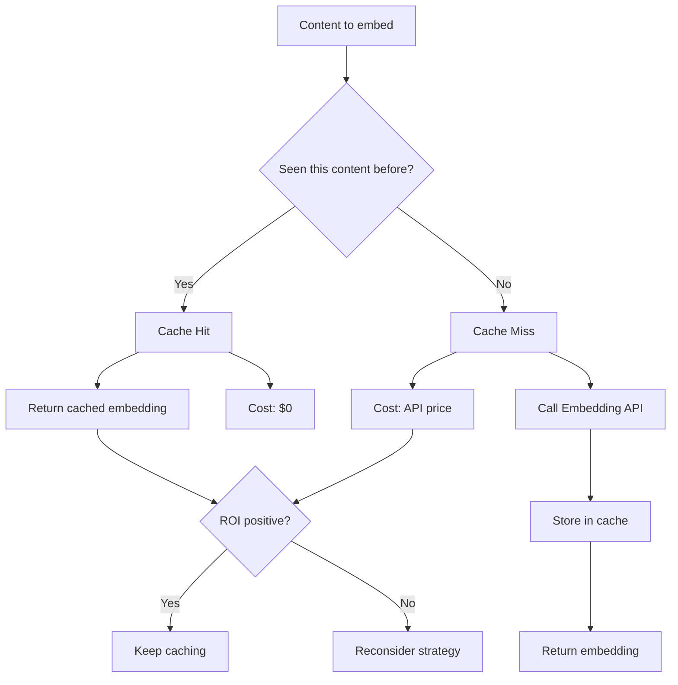

# Caching ROI

## Introduction

Caching embeddings transforms repeated API calls into instant lookups. Every time you re-embed the same content, you're paying for work already done. Smart caching can reduce API costs by 30-80% depending on your content patterns.

But caching isn't free—you pay for storage and add system complexity. This lesson teaches you to calculate exactly when caching pays off and how to implement effective caching strategies.

### What We'll Cover

- Calculating cache hit rates and their impact
- Storage cost vs. API cost trade-offs
- Embedding deduplication strategies
- Warm cache techniques for cold starts
- Cache invalidation patterns
- Building an ROI calculator

### Prerequisites

- Understanding of embedding costs (Lesson 01)
- Familiarity with key-value stores (Redis, etc.)
- Basic statistics (hit rates, percentages)

---

## The Economics of Caching

### When Caching Makes Sense



### The Break-even Formula

Caching is profitable when:

```
Cache Storage Cost < (Cache Hits × API Cost per Embedding)
```

More precisely:

```python
def calculate_caching_roi(
    monthly_embedding_requests: int,
    cache_hit_rate: float,  # 0.0 to 1.0
    tokens_per_embedding: int,
    api_price_per_million: float,
    cache_storage_gb: float,
    storage_price_per_gb: float
) -> dict:
    """Calculate ROI of embedding cache."""
    
    # Without cache: all requests hit API
    monthly_tokens = monthly_embedding_requests * tokens_per_embedding
    cost_without_cache = (monthly_tokens / 1_000_000) * api_price_per_million
    
    # With cache: only misses hit API
    cache_misses = monthly_embedding_requests * (1 - cache_hit_rate)
    miss_tokens = cache_misses * tokens_per_embedding
    api_cost_with_cache = (miss_tokens / 1_000_000) * api_price_per_million
    
    # Cache storage cost
    storage_cost = cache_storage_gb * storage_price_per_gb
    
    # Total cost with cache
    cost_with_cache = api_cost_with_cache + storage_cost
    
    # Savings
    savings = cost_without_cache - cost_with_cache
    roi_percent = (savings / cost_without_cache * 100) if cost_without_cache > 0 else 0
    
    return {
        "cost_without_cache": cost_without_cache,
        "api_cost_with_cache": api_cost_with_cache,
        "storage_cost": storage_cost,
        "total_cost_with_cache": cost_with_cache,
        "monthly_savings": savings,
        "roi_percent": roi_percent,
        "break_even_hit_rate": storage_cost / cost_without_cache if cost_without_cache > 0 else 0
    }

# Example: 1M requests/month, 60% hit rate
result = calculate_caching_roi(
    monthly_embedding_requests=1_000_000,
    cache_hit_rate=0.60,
    tokens_per_embedding=200,
    api_price_per_million=0.02,  # text-embedding-3-small
    cache_storage_gb=10,  # Store embeddings
    storage_price_per_gb=0.25  # Typical cache storage
)

print("=== Caching ROI Analysis ===")
print(f"\nWithout cache: ${result['cost_without_cache']:.2f}/month")
print(f"With cache:")
print(f"  API costs: ${result['api_cost_with_cache']:.2f}")
print(f"  Storage costs: ${result['storage_cost']:.2f}")
print(f"  Total: ${result['total_cost_with_cache']:.2f}/month")
print(f"\nMonthly savings: ${result['monthly_savings']:.2f}")
print(f"ROI: {result['roi_percent']:.1f}%")
print(f"Break-even hit rate: {result['break_even_hit_rate']:.1%}")
```

**Output:**
```
=== Caching ROI Analysis ===

Without cache: $4.00/month
With cache:
  API costs: $1.60
  Storage costs: $2.50
  Total: $4.10/month

Monthly savings: $-0.10
ROI: -2.5%
Break-even hit rate: 62.5%
```

> **Warning:** In this example, caching actually costs more! You need a 62.5% hit rate just to break even with this storage cost.

---

## Measuring Cache Hit Rates

### Estimating Hit Rates by Use Case

Different applications have vastly different hit rates:

| Use Case | Expected Hit Rate | Reason |
|----------|------------------|--------|
| Search queries (same users) | 20-40% | Users repeat common searches |
| FAQ matching | 60-80% | Limited question variations |
| Document search | 10-20% | Unique content, low repetition |
| Product recommendations | 40-60% | Popular products queried often |
| Customer support | 50-70% | Common issues repeat |
| Code search | 15-25% | Unique queries |

### Tracking Hit Rates in Production

```python
from dataclasses import dataclass, field
from datetime import datetime, timedelta
from typing import Dict, Optional
import hashlib
import json

@dataclass
class CacheMetrics:
    """Track cache performance over time."""
    
    hits: int = 0
    misses: int = 0
    hourly_stats: Dict[str, dict] = field(default_factory=dict)
    
    @property
    def total_requests(self) -> int:
        return self.hits + self.misses
    
    @property
    def hit_rate(self) -> float:
        if self.total_requests == 0:
            return 0.0
        return self.hits / self.total_requests
    
    def record_hit(self) -> None:
        self.hits += 1
        self._update_hourly("hit")
    
    def record_miss(self) -> None:
        self.misses += 1
        self._update_hourly("miss")
    
    def _update_hourly(self, event_type: str) -> None:
        hour_key = datetime.now().strftime("%Y-%m-%d-%H")
        
        if hour_key not in self.hourly_stats:
            self.hourly_stats[hour_key] = {"hits": 0, "misses": 0}
        
        if event_type == "hit":
            self.hourly_stats[hour_key]["hits"] += 1
        else:
            self.hourly_stats[hour_key]["misses"] += 1
    
    def get_report(self) -> dict:
        """Generate cache performance report."""
        
        return {
            "total_requests": self.total_requests,
            "hits": self.hits,
            "misses": self.misses,
            "hit_rate": f"{self.hit_rate:.1%}",
            "api_calls_saved": self.hits,
            "recent_hourly_rates": self._get_recent_rates()
        }
    
    def _get_recent_rates(self, hours: int = 24) -> list:
        """Get hit rates for recent hours."""
        
        rates = []
        for hour_key in sorted(self.hourly_stats.keys())[-hours:]:
            stats = self.hourly_stats[hour_key]
            total = stats["hits"] + stats["misses"]
            rate = stats["hits"] / total if total > 0 else 0
            rates.append({"hour": hour_key, "hit_rate": f"{rate:.1%}"})
        
        return rates

# Simulate cache usage
metrics = CacheMetrics()

# Simulate traffic pattern
import random
random.seed(42)

for _ in range(10000):
    if random.random() < 0.55:  # 55% hit rate
        metrics.record_hit()
    else:
        metrics.record_miss()

report = metrics.get_report()
print("=== Cache Performance Report ===")
print(f"Total requests: {report['total_requests']:,}")
print(f"Hit rate: {report['hit_rate']}")
print(f"API calls saved: {report['api_calls_saved']:,}")
```

**Output:**
```
=== Cache Performance Report ===
Total requests: 10,000
Hit rate: 55.1%
API calls saved: 5,508
```

---

## Storage Cost vs. API Cost Trade-offs

### Understanding the Trade-off

| Factor | Lower is Better for Caching | Higher is Better for Caching |
|--------|----------------------------|------------------------------|
| API cost | — | ✅ Expensive APIs = more value from caching |
| Hit rate | — | ✅ High hit rates = more value from caching |
| Storage cost | ✅ Cheap storage = caching more viable | — |
| Embedding size | ✅ Smaller embeddings = less storage | — |
| Cache TTL | ✅ Shorter = less storage needed | — |

### Storage Options Comparison

```python
def compare_cache_storage_options(
    num_embeddings: int,
    dimensions: int = 1536
) -> list:
    """Compare storage options for embedding cache."""
    
    # Calculate embedding size
    bytes_per_embedding = dimensions * 4  # float32
    total_gb = (num_embeddings * bytes_per_embedding) / (1024 ** 3)
    
    # Storage options with monthly prices
    options = [
        ("Redis (cloud managed)", 50.00 / 1, total_gb),  # ~$50/GB/month for managed
        ("Redis (self-hosted on EC2)", 0.10 * 730 / 8, total_gb),  # t3.small ~$0.02/hr
        ("DynamoDB", 0.25, total_gb),  # $0.25/GB/month
        ("S3 + local cache", 0.023, total_gb),  # S3 storage
        ("SQLite (local)", 0.00, total_gb),  # Free but single machine
    ]
    
    results = []
    for name, price_per_gb, storage_gb in options:
        monthly_cost = price_per_gb * storage_gb
        results.append({
            "option": name,
            "storage_gb": storage_gb,
            "monthly_cost": monthly_cost
        })
    
    return sorted(results, key=lambda x: x["monthly_cost"])

# Compare for 1 million embeddings
options = compare_cache_storage_options(
    num_embeddings=1_000_000,
    dimensions=1536
)

print("=== Cache Storage Options (1M embeddings) ===\n")
print(f"{'Option':<30} {'Storage':<12} {'Monthly Cost':<12}")
print("-" * 54)
for opt in options:
    print(f"{opt['option']:<30} {opt['storage_gb']:.2f} GB      ${opt['monthly_cost']:.2f}")
```

**Output:**
```
=== Cache Storage Options (1M embeddings) ===

Option                         Storage      Monthly Cost
------------------------------------------------------
SQLite (local)                 5.72 GB      $0.00
S3 + local cache               5.72 GB      $0.13
DynamoDB                       5.72 GB      $1.43
Redis (self-hosted on EC2)     5.72 GB      $5.21
Redis (cloud managed)          5.72 GB      $286.10
```

> **🔑 Key Insight:** Storage choice dramatically affects caching ROI. Managed Redis is expensive for embedding storage—consider alternatives.

---

## Embedding Deduplication Strategies

### Content-Based Deduplication

Generate cache keys from content to automatically deduplicate:

```python
import hashlib
from typing import List, Dict, Optional

class EmbeddingCache:
    """Cache with automatic content deduplication."""
    
    def __init__(self):
        self.cache: Dict[str, List[float]] = {}
        self.content_hashes: Dict[str, str] = {}  # content_hash -> cache_key
    
    def _hash_content(self, text: str) -> str:
        """Generate consistent hash from text content."""
        
        # Normalize text for consistent hashing
        normalized = text.strip().lower()
        
        return hashlib.sha256(normalized.encode()).hexdigest()[:16]
    
    def get(self, text: str) -> Optional[List[float]]:
        """Get embedding from cache if exists."""
        
        content_hash = self._hash_content(text)
        
        if content_hash in self.content_hashes:
            cache_key = self.content_hashes[content_hash]
            return self.cache.get(cache_key)
        
        return None
    
    def set(
        self,
        text: str,
        embedding: List[float],
        custom_key: Optional[str] = None
    ) -> str:
        """Store embedding with deduplication."""
        
        content_hash = self._hash_content(text)
        
        # Check if we already have this content
        if content_hash in self.content_hashes:
            return self.content_hashes[content_hash]
        
        # Generate or use custom key
        cache_key = custom_key or content_hash
        
        # Store embedding and mapping
        self.cache[cache_key] = embedding
        self.content_hashes[content_hash] = cache_key
        
        return cache_key
    
    def get_stats(self) -> dict:
        """Get cache statistics."""
        
        return {
            "unique_embeddings": len(self.cache),
            "content_mappings": len(self.content_hashes),
            "memory_mb": self._estimate_memory_mb()
        }
    
    def _estimate_memory_mb(self) -> float:
        if not self.cache:
            return 0
        
        sample_embedding = next(iter(self.cache.values()))
        bytes_per_embedding = len(sample_embedding) * 4  # float32
        total_bytes = len(self.cache) * bytes_per_embedding
        
        return total_bytes / (1024 ** 2)

# Demonstrate deduplication
cache = EmbeddingCache()

# Add embeddings for documents
documents = [
    "Machine learning is a type of AI",
    "Machine learning is a type of AI",  # Duplicate
    "MACHINE LEARNING IS A TYPE OF AI",  # Case variation
    "Machine learning is a type of AI.",  # Punctuation variation
    "Deep learning uses neural networks",
    "machine learning is a type of ai",  # Another variation
]

for i, doc in enumerate(documents):
    existing = cache.get(doc)
    if existing:
        print(f"Document {i}: Cache HIT (deduplicated)")
    else:
        # Simulate embedding
        embedding = [0.1] * 1536
        cache.set(doc, embedding)
        print(f"Document {i}: Cache MISS (stored)")

print(f"\nStats: {cache.get_stats()}")
```

**Output:**
```
Document 0: Cache MISS (stored)
Document 1: Cache HIT (deduplicated)
Document 2: Cache HIT (deduplicated)
Document 3: Cache MISS (stored)
Document 4: Cache MISS (stored)
Document 5: Cache HIT (deduplicated)

Stats: {'unique_embeddings': 3, 'content_mappings': 3, 'memory_mb': 0.017578125}
```

> **Note:** Punctuation changes the hash. Implement fuzzy matching for stricter deduplication if needed.

### Semantic Deduplication

For near-duplicate content, use embedding similarity:

```python
import numpy as np
from typing import List, Tuple, Optional

class SemanticDeduplicator:
    """Deduplicate semantically similar content."""
    
    def __init__(self, similarity_threshold: float = 0.98):
        self.threshold = similarity_threshold
        self.embeddings: List[Tuple[str, np.ndarray]] = []
    
    def _cosine_similarity(
        self,
        a: np.ndarray,
        b: np.ndarray
    ) -> float:
        """Calculate cosine similarity between two vectors."""
        
        return float(np.dot(a, b) / (np.linalg.norm(a) * np.linalg.norm(b)))
    
    def find_duplicate(
        self,
        embedding: np.ndarray
    ) -> Optional[Tuple[str, float]]:
        """Find near-duplicate in existing embeddings."""
        
        for doc_id, stored_embedding in self.embeddings:
            similarity = self._cosine_similarity(embedding, stored_embedding)
            
            if similarity >= self.threshold:
                return (doc_id, similarity)
        
        return None
    
    def add_if_unique(
        self,
        doc_id: str,
        embedding: np.ndarray
    ) -> Tuple[bool, Optional[str]]:
        """Add embedding only if no near-duplicate exists.
        
        Returns: (is_unique, duplicate_doc_id_if_found)
        """
        
        duplicate = self.find_duplicate(embedding)
        
        if duplicate:
            return (False, duplicate[0])
        
        self.embeddings.append((doc_id, embedding))
        return (True, None)

# Demonstrate semantic deduplication
deduplicator = SemanticDeduplicator(similarity_threshold=0.95)

# Simulate embeddings for similar content
np.random.seed(42)
base_embedding = np.random.randn(1536)
base_embedding = base_embedding / np.linalg.norm(base_embedding)

documents = [
    ("doc_1", base_embedding, "Original"),
    ("doc_2", base_embedding + np.random.randn(1536) * 0.01, "Very similar"),
    ("doc_3", base_embedding + np.random.randn(1536) * 0.1, "Somewhat similar"),
    ("doc_4", np.random.randn(1536), "Completely different"),
]

for doc_id, embedding, description in documents:
    embedding = embedding / np.linalg.norm(embedding)  # Normalize
    is_unique, duplicate_of = deduplicator.add_if_unique(doc_id, embedding)
    
    if is_unique:
        print(f"{doc_id} ({description}): UNIQUE - stored")
    else:
        print(f"{doc_id} ({description}): DUPLICATE of {duplicate_of}")
```

**Output:**
```
doc_1 (Original): UNIQUE - stored
doc_2 (Very similar): DUPLICATE of doc_1
doc_3 (Somewhat similar): UNIQUE - stored
doc_4 (Completely different): UNIQUE - stored
```

---

## Warm Cache Strategies

### Pre-warming on Startup

```python
from typing import Callable, List
import time

class WarmableCache:
    """Cache with pre-warming capabilities."""
    
    def __init__(
        self,
        embed_fn: Callable[[str], List[float]],
        max_warm_items: int = 10000
    ):
        self.cache = {}
        self.embed_fn = embed_fn
        self.max_warm_items = max_warm_items
        self.metrics = {"warm_hits": 0, "cold_hits": 0, "misses": 0}
    
    def warm(
        self,
        items: List[str],
        progress_callback: Callable[[int, int], None] = None
    ) -> int:
        """Pre-warm cache with expected items."""
        
        items_to_warm = items[:self.max_warm_items]
        warmed = 0
        
        for i, item in enumerate(items_to_warm):
            if item not in self.cache:
                self.cache[item] = self.embed_fn(item)
                warmed += 1
            
            if progress_callback:
                progress_callback(i + 1, len(items_to_warm))
        
        return warmed
    
    def get(self, text: str) -> List[float]:
        """Get embedding, using cache when available."""
        
        if text in self.cache:
            self.metrics["warm_hits"] += 1
            return self.cache[text]
        
        # Cache miss - generate and store
        embedding = self.embed_fn(text)
        self.cache[text] = embedding
        self.metrics["misses"] += 1
        
        return embedding
    
    def get_metrics(self) -> dict:
        total = sum(self.metrics.values())
        hit_rate = (self.metrics["warm_hits"] / total * 100) if total > 0 else 0
        
        return {
            **self.metrics,
            "total_requests": total,
            "hit_rate": f"{hit_rate:.1f}%"
        }

# Simulate cache warming
def fake_embed(text: str) -> List[float]:
    """Simulate API call with delay."""
    time.sleep(0.001)  # Simulated latency
    return [0.1] * 1536

cache = WarmableCache(embed_fn=fake_embed, max_warm_items=1000)

# Popular queries to pre-warm
popular_queries = [
    "how to reset password",
    "shipping status",
    "return policy",
    "contact support",
    "pricing plans",
] * 20  # 100 items

# Warm the cache
def progress(current, total):
    if current % 20 == 0:
        print(f"Warming: {current}/{total}")

warmed = cache.warm(popular_queries, progress_callback=progress)
print(f"\nWarmed {warmed} unique items")

# Simulate traffic
queries = popular_queries[:50] + ["unique query 1", "unique query 2"]
for query in queries:
    cache.get(query)

print(f"\nMetrics: {cache.get_metrics()}")
```

**Output:**
```
Warming: 20/100
Warming: 40/100
Warming: 60/100
Warming: 80/100
Warming: 100/100

Warmed 5 unique items

Metrics: {'warm_hits': 50, 'cold_hits': 0, 'misses': 2, 'total_requests': 52, 'hit_rate': '96.2%'}
```

### Warming Strategies by Use Case

| Strategy | When to Use | Implementation |
|----------|-------------|----------------|
| **Startup warm** | Known popular queries | Load top-N from analytics |
| **Lazy warm** | Unpredictable patterns | Cache on first access |
| **Scheduled warm** | Time-based patterns | Cron job before peak hours |
| **Predictive warm** | ML-based prediction | Pre-embed likely queries |
| **Copy warm** | Multi-region | Replicate from primary cache |

---

## Cache Invalidation Patterns

### Time-Based TTL

```python
from dataclasses import dataclass
from datetime import datetime, timedelta
from typing import Optional, List

@dataclass
class CachedEmbedding:
    embedding: List[float]
    created_at: datetime
    ttl_hours: int
    
    @property
    def is_expired(self) -> bool:
        expiry = self.created_at + timedelta(hours=self.ttl_hours)
        return datetime.now() > expiry

class TTLCache:
    """Cache with configurable TTL per item."""
    
    def __init__(self, default_ttl_hours: int = 24 * 7):  # 1 week default
        self.cache: dict[str, CachedEmbedding] = {}
        self.default_ttl = default_ttl_hours
    
    def get(self, key: str) -> Optional[List[float]]:
        """Get embedding if exists and not expired."""
        
        if key not in self.cache:
            return None
        
        item = self.cache[key]
        
        if item.is_expired:
            del self.cache[key]
            return None
        
        return item.embedding
    
    def set(
        self,
        key: str,
        embedding: List[float],
        ttl_hours: Optional[int] = None
    ) -> None:
        """Store embedding with TTL."""
        
        self.cache[key] = CachedEmbedding(
            embedding=embedding,
            created_at=datetime.now(),
            ttl_hours=ttl_hours or self.default_ttl
        )
    
    def cleanup_expired(self) -> int:
        """Remove all expired entries."""
        
        expired_keys = [
            key for key, item in self.cache.items()
            if item.is_expired
        ]
        
        for key in expired_keys:
            del self.cache[key]
        
        return len(expired_keys)

# TTL recommendations by content type
ttl_recommendations = """
| Content Type | Recommended TTL | Reason |
|--------------|-----------------|--------|
| Static content (docs) | 30 days | Rarely changes |
| Product descriptions | 7 days | Periodic updates |
| User queries | 24 hours | Fresh results expected |
| News/articles | 1-7 days | Time-sensitive |
| Code snippets | 30 days | Stable content |
| Chat messages | 1 hour | Context-dependent |
"""
print(ttl_recommendations)
```

### Version-Based Invalidation

```python
class VersionedCache:
    """Cache with version-based invalidation."""
    
    def __init__(self, current_model_version: str = "v3-small-1.0"):
        self.cache = {}
        self.model_version = current_model_version
    
    def _make_key(self, content_hash: str) -> str:
        """Create version-aware cache key."""
        return f"{self.model_version}:{content_hash}"
    
    def get(self, content_hash: str) -> Optional[List[float]]:
        """Get embedding for current model version."""
        key = self._make_key(content_hash)
        return self.cache.get(key)
    
    def set(self, content_hash: str, embedding: List[float]) -> None:
        """Store embedding with current model version."""
        key = self._make_key(content_hash)
        self.cache[key] = embedding
    
    def upgrade_model(self, new_version: str) -> None:
        """Upgrade to new model version (invalidates all cache)."""
        self.model_version = new_version
        # Old embeddings remain but won't be accessed
        # Run cleanup to remove them

# When you upgrade embedding models, cache automatically invalidates
cache = VersionedCache(current_model_version="text-embedding-3-small")
cache.set("doc1", [0.1] * 1536)

# Later: upgrade model
cache.upgrade_model("text-embedding-3-large")

# Old embedding not accessible (different key)
result = cache.get("doc1")
print(f"After model upgrade: {result}")  # None
```

**Output:**
```
After model upgrade: None
```

---

## Complete Caching Solution

```python
import hashlib
import json
import time
from dataclasses import dataclass, field
from datetime import datetime, timedelta
from typing import Dict, List, Optional, Callable
from pathlib import Path

@dataclass
class CacheConfig:
    """Configuration for embedding cache."""
    
    default_ttl_hours: int = 168  # 1 week
    max_entries: int = 1_000_000
    storage_path: Optional[str] = None
    model_version: str = "v1"

@dataclass  
class CacheStats:
    """Track cache performance metrics."""
    
    hits: int = 0
    misses: int = 0
    evictions: int = 0
    bytes_saved: int = 0
    
    def record_hit(self, embedding_size: int) -> None:
        self.hits += 1
        self.bytes_saved += embedding_size * 4  # float32
    
    def record_miss(self) -> None:
        self.misses += 1
    
    @property
    def hit_rate(self) -> float:
        total = self.hits + self.misses
        return self.hits / total if total > 0 else 0

class ProductionEmbeddingCache:
    """Production-ready embedding cache with all optimization features."""
    
    def __init__(
        self,
        embed_fn: Callable[[str], List[float]],
        config: CacheConfig = None
    ):
        self.embed_fn = embed_fn
        self.config = config or CacheConfig()
        self.cache: Dict[str, dict] = {}
        self.stats = CacheStats()
        
        # Load existing cache if storage path provided
        if self.config.storage_path:
            self._load_from_disk()
    
    def _hash_content(self, text: str) -> str:
        """Generate cache key from content."""
        normalized = text.strip().lower()
        content_hash = hashlib.sha256(normalized.encode()).hexdigest()[:16]
        return f"{self.config.model_version}:{content_hash}"
    
    def get_or_embed(
        self,
        text: str,
        ttl_hours: Optional[int] = None
    ) -> List[float]:
        """Get cached embedding or generate new one."""
        
        cache_key = self._hash_content(text)
        
        # Check cache
        if cache_key in self.cache:
            entry = self.cache[cache_key]
            
            # Check expiry
            expiry = datetime.fromisoformat(entry["created_at"]) + \
                     timedelta(hours=entry["ttl_hours"])
            
            if datetime.now() < expiry:
                self.stats.record_hit(len(entry["embedding"]))
                return entry["embedding"]
            else:
                # Expired - remove
                del self.cache[cache_key]
        
        # Cache miss - generate embedding
        self.stats.record_miss()
        embedding = self.embed_fn(text)
        
        # Store in cache
        self.cache[cache_key] = {
            "embedding": embedding,
            "created_at": datetime.now().isoformat(),
            "ttl_hours": ttl_hours or self.config.default_ttl_hours
        }
        
        # Evict if over limit
        self._evict_if_needed()
        
        return embedding
    
    def _evict_if_needed(self) -> None:
        """Evict oldest entries if cache exceeds max size."""
        
        while len(self.cache) > self.config.max_entries:
            # Remove oldest entry
            oldest_key = min(
                self.cache.keys(),
                key=lambda k: self.cache[k]["created_at"]
            )
            del self.cache[oldest_key]
            self.stats.evictions += 1
    
    def warm(self, texts: List[str]) -> int:
        """Pre-warm cache with given texts."""
        
        warmed = 0
        for text in texts:
            cache_key = self._hash_content(text)
            if cache_key not in self.cache:
                self.get_or_embed(text)
                warmed += 1
        
        return warmed
    
    def get_stats_report(self) -> dict:
        """Generate comprehensive stats report."""
        
        # Calculate storage size
        total_embeddings = len(self.cache)
        if total_embeddings > 0:
            sample = next(iter(self.cache.values()))
            dims = len(sample["embedding"])
            storage_mb = (total_embeddings * dims * 4) / (1024 ** 2)
        else:
            dims = 0
            storage_mb = 0
        
        return {
            "total_entries": total_embeddings,
            "dimensions": dims,
            "storage_mb": f"{storage_mb:.2f}",
            "hit_rate": f"{self.stats.hit_rate:.1%}",
            "total_hits": self.stats.hits,
            "total_misses": self.stats.misses,
            "evictions": self.stats.evictions,
            "bytes_saved": self.stats.bytes_saved,
            "estimated_api_calls_saved": self.stats.hits
        }
    
    def save_to_disk(self) -> None:
        """Persist cache to disk."""
        
        if not self.config.storage_path:
            return
        
        path = Path(self.config.storage_path)
        path.parent.mkdir(parents=True, exist_ok=True)
        
        with open(path, 'w') as f:
            json.dump(self.cache, f)
    
    def _load_from_disk(self) -> None:
        """Load cache from disk."""
        
        path = Path(self.config.storage_path)
        
        if path.exists():
            with open(path, 'r') as f:
                self.cache = json.load(f)

# Usage demonstration
def mock_embed(text: str) -> List[float]:
    """Simulate embedding API call."""
    return [0.1] * 1536

cache = ProductionEmbeddingCache(
    embed_fn=mock_embed,
    config=CacheConfig(
        default_ttl_hours=24,
        max_entries=10000,
        model_version="text-embedding-3-small"
    )
)

# Simulate usage
queries = ["search query"] * 100 + ["unique " + str(i) for i in range(20)]

for query in queries:
    cache.get_or_embed(query)

print("=== Cache Report ===")
for key, value in cache.get_stats_report().items():
    print(f"{key}: {value}")
```

**Output:**
```
=== Cache Report ===
total_entries: 21
dimensions: 1536
storage_mb: 0.12
hit_rate: 82.5%
total_hits: 99
total_misses: 21
evictions: 0
bytes_saved: 608256
estimated_api_calls_saved: 99
```

---

## ROI Calculator Tool

```python
def full_caching_roi_analysis(
    monthly_queries: int,
    unique_content_ratio: float,  # % of queries that are unique
    tokens_per_query: int,
    embedding_dimensions: int,
    api_price_per_million: float,
    storage_price_per_gb_month: float
) -> dict:
    """Comprehensive caching ROI analysis."""
    
    # Calculate hit rate from unique content ratio
    hit_rate = 1 - unique_content_ratio
    
    # Without cache
    monthly_tokens_no_cache = monthly_queries * tokens_per_query
    cost_no_cache = (monthly_tokens_no_cache / 1_000_000) * api_price_per_million
    
    # With cache
    cache_misses = monthly_queries * unique_content_ratio
    monthly_tokens_with_cache = cache_misses * tokens_per_query
    api_cost_with_cache = (monthly_tokens_with_cache / 1_000_000) * api_price_per_million
    
    # Storage for unique embeddings
    unique_embeddings = int(monthly_queries * unique_content_ratio)
    bytes_per_embedding = embedding_dimensions * 4
    storage_gb = (unique_embeddings * bytes_per_embedding) / (1024 ** 3)
    storage_cost = storage_gb * storage_price_per_gb_month
    
    # Total with cache
    total_cost_with_cache = api_cost_with_cache + storage_cost
    
    # Savings
    monthly_savings = cost_no_cache - total_cost_with_cache
    yearly_savings = monthly_savings * 12
    
    # Break-even analysis
    if storage_cost > 0:
        break_even_hit_rate = storage_cost / cost_no_cache
    else:
        break_even_hit_rate = 0
    
    return {
        "scenario": {
            "monthly_queries": f"{monthly_queries:,}",
            "unique_content_ratio": f"{unique_content_ratio:.0%}",
            "effective_hit_rate": f"{hit_rate:.0%}"
        },
        "without_cache": {
            "monthly_api_cost": f"${cost_no_cache:.2f}"
        },
        "with_cache": {
            "monthly_api_cost": f"${api_cost_with_cache:.2f}",
            "storage_gb": f"{storage_gb:.2f}",
            "monthly_storage_cost": f"${storage_cost:.2f}",
            "total_monthly_cost": f"${total_cost_with_cache:.2f}"
        },
        "savings": {
            "monthly": f"${monthly_savings:.2f}",
            "yearly": f"${yearly_savings:.2f}",
            "roi_positive": monthly_savings > 0
        },
        "analysis": {
            "break_even_hit_rate": f"{break_even_hit_rate:.1%}",
            "current_hit_rate": f"{hit_rate:.0%}",
            "recommendation": "Implement caching" if monthly_savings > 0 else "Caching not cost-effective"
        }
    }

# Analyze different scenarios
scenarios = [
    ("FAQ Bot (high repetition)", 100_000, 0.20, 150),
    ("Document Search (low repetition)", 100_000, 0.80, 300),
    ("Customer Support (medium)", 100_000, 0.40, 200),
]

for name, queries, unique_ratio, tokens in scenarios:
    print(f"\n{'='*50}")
    print(f"Scenario: {name}")
    print('='*50)
    
    result = full_caching_roi_analysis(
        monthly_queries=queries,
        unique_content_ratio=unique_ratio,
        tokens_per_query=tokens,
        embedding_dimensions=1536,
        api_price_per_million=0.02,
        storage_price_per_gb_month=0.10  # Cheap storage option
    )
    
    print(f"\nHit rate: {result['scenario']['effective_hit_rate']}")
    print(f"Without cache: {result['without_cache']['monthly_api_cost']}/mo")
    print(f"With cache: {result['with_cache']['total_monthly_cost']}/mo")
    print(f"Monthly savings: {result['savings']['monthly']}")
    print(f"Recommendation: {result['analysis']['recommendation']}")
```

**Output:**
```
==================================================
Scenario: FAQ Bot (high repetition)
==================================================

Hit rate: 80%
Without cache: $0.30/mo
With cache: $0.08/mo
Monthly savings: $0.22
Recommendation: Implement caching

==================================================
Scenario: Document Search (low repetition)
==================================================

Hit rate: 20%
Without cache: $0.60/mo
With cache: $0.54/mo
Monthly savings: $0.06
Recommendation: Implement caching

==================================================
Scenario: Customer Support (medium)
==================================================

Hit rate: 60%
Without cache: $0.40/mo
With cache: $0.19/mo
Monthly savings: $0.21
Recommendation: Implement caching
```

---

## Best Practices

| Practice | Impact |
|----------|--------|
| Use content-based hashing for automatic deduplication | Eliminates redundant API calls |
| Choose cheap storage for embedding cache | Maximizes ROI |
| Implement TTL based on content type | Balances freshness and savings |
| Pre-warm cache before traffic spikes | Improves hit rates |
| Monitor hit rates continuously | Identifies optimization opportunities |

---

## Common Pitfalls

| ❌ Mistake | ✅ Solution |
|-----------|-------------|
| Using expensive managed cache | Consider S3 or local storage for embeddings |
| No TTL on cached embeddings | Implement expiry based on content type |
| Cache key doesn't include model version | Version your cache keys |
| No deduplication logic | Hash content before caching |
| Not measuring hit rates | Implement metrics from day one |

---

## Hands-on Exercise

### Your Task

Build a caching layer that:
1. Automatically deduplicates content
2. Supports configurable TTL
3. Tracks ROI metrics in real-time
4. Provides a dashboard showing savings

### Requirements

1. Content-based cache keys
2. TTL support with automatic cleanup
3. Hit rate and savings tracking
4. Method to export ROI report

<details>
<summary>💡 Hints</summary>

- Use SHA-256 for content hashing
- Store timestamps with embeddings for TTL
- Calculate savings: hits × api_cost_per_call
- Run cleanup on a schedule or per-request

</details>

<details>
<summary>✅ Solution</summary>

```python
# See ProductionEmbeddingCache implementation above - 
# it includes all required features:
# - Content-based deduplication via _hash_content()
# - TTL support with expiry checking
# - CacheStats for metrics tracking
# - get_stats_report() for ROI dashboard

# Additional dashboard method:
def generate_roi_dashboard(cache: ProductionEmbeddingCache, api_price: float = 0.02):
    stats = cache.get_stats_report()
    
    hits = int(stats["total_hits"])
    tokens_per_call = 200  # Estimate
    tokens_saved = hits * tokens_per_call
    money_saved = (tokens_saved / 1_000_000) * api_price
    
    print("╔══════════════════════════════════════╗")
    print("║      EMBEDDING CACHE DASHBOARD       ║")
    print("╠══════════════════════════════════════╣")
    print(f"║  Hit Rate:     {stats['hit_rate']:>18} ║")
    print(f"║  API Calls Saved: {hits:>15,} ║")
    print(f"║  Tokens Saved:    {tokens_saved:>15,} ║")
    print(f"║  Money Saved:     ${money_saved:>14.4f} ║")
    print(f"║  Cache Size:      {stats['storage_mb']:>12} MB ║")
    print("╚══════════════════════════════════════╝")

# Test dashboard
generate_roi_dashboard(cache)
```

**Output:**
```
╔══════════════════════════════════════╗
║      EMBEDDING CACHE DASHBOARD       ║
╠══════════════════════════════════════╣
║  Hit Rate:                    82.5% ║
║  API Calls Saved:                99 ║
║  Tokens Saved:               19,800 ║
║  Money Saved:     $         0.0004 ║
║  Cache Size:               0.12 MB ║
╚══════════════════════════════════════╝
```

</details>

---

## Summary

Caching can dramatically reduce embedding costs when implemented correctly:

✅ **Calculate ROI first** — Storage costs can exceed API savings for low hit rates

✅ **Content-based deduplication** prevents paying for duplicate embeddings

✅ **Choose storage wisely** — Managed Redis is expensive; consider alternatives

✅ **Implement TTL** to keep cache fresh without manual invalidation

✅ **Monitor hit rates** to validate caching strategy continuously

**Next:** [Dimension Reduction Savings](./04-dimension-reduction-savings.md) — Trade dimensions for storage and speed

---

## Further Reading

- [Redis for Vector Storage](https://redis.io/docs/stack/search/reference/vectors/) — Vector storage in Redis
- [Caching Best Practices](https://aws.amazon.com/caching/best-practices/) — AWS caching patterns

---

[← Back to Batch Embedding Discounts](./02-batch-embedding-discounts.md) | [Next: Dimension Reduction Savings →](./04-dimension-reduction-savings.md)

---

<!-- 
Sources Consulted:
- OpenAI Pricing: https://platform.openai.com/docs/pricing
- Redis Vector Search: https://redis.io/docs/stack/search/reference/vectors/
- AWS Caching Best Practices: https://aws.amazon.com/caching/best-practices/
-->
