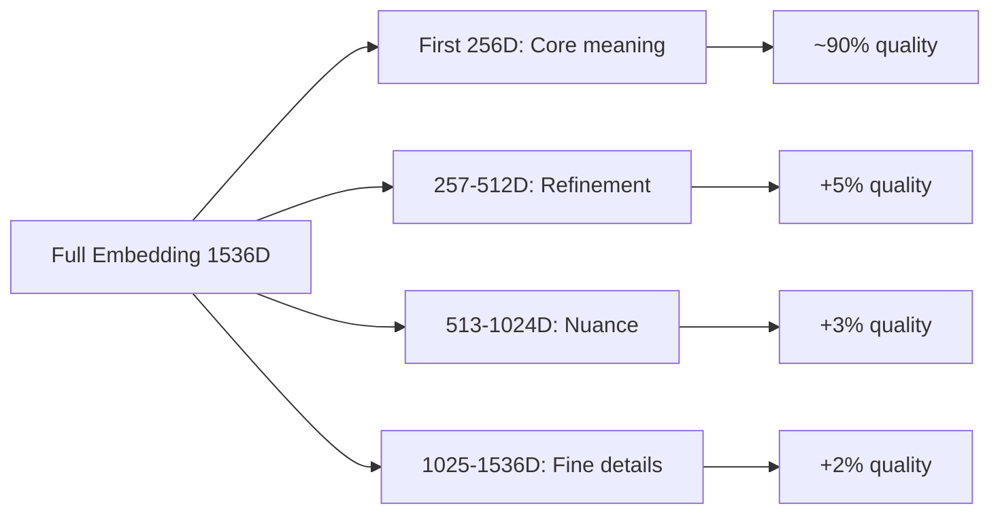
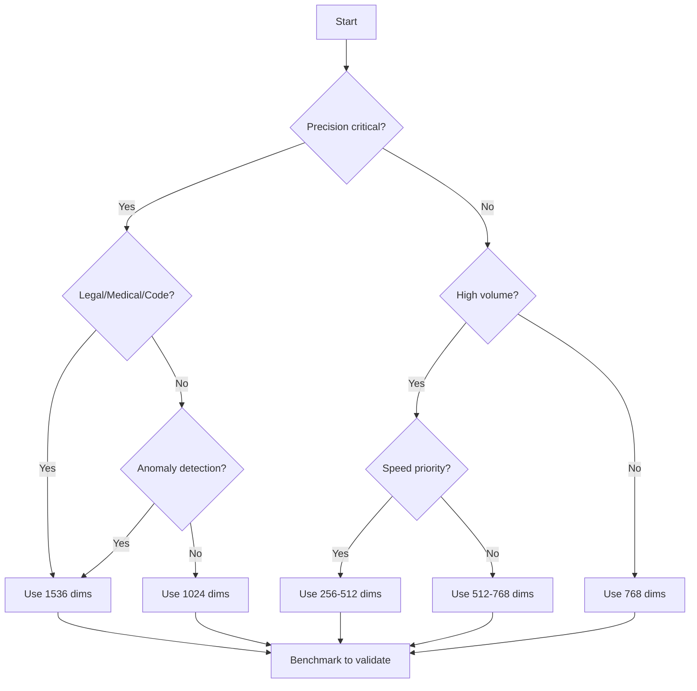

# Dimension Reduction Savings

## Introduction

Vector dimensions directly impact storage costs and search speed. A 3,072-dimension embedding uses twice the storage of a 1,536-dimension one. OpenAI's text-embedding-3 models support native dimension reduction—you can request fewer dimensions without re-training the model.

This lesson explores when and how to reduce dimensions, the quality trade-offs involved, and how to benchmark before committing to a configuration.

### What We'll Cover

- Understanding the dimension-storage relationship
- OpenAI's native dimension reduction feature
- Quality vs. cost trade-off analysis
- Benchmarking dimension choices
- Search speed improvements
- When NOT to reduce dimensions

### Prerequisites

- Understanding of embeddings and vector similarity
- Familiarity with OpenAI embedding models
- Basic statistics knowledge (for benchmarking)

---

## The Dimension-Cost Relationship

### Storage Mathematics

Each dimension uses 4 bytes (32-bit float). The relationship is perfectly linear:

```python
def calculate_storage_by_dimension(
    num_vectors: int,
    dimensions: int,
    metadata_bytes: int = 500
) -> dict:
    """Calculate storage for different dimension counts."""
    
    id_bytes = 8  # Typical ID size
    
    # Vector storage
    vector_bytes = dimensions * 4  # float32
    
    # Total per vector
    bytes_per_vector = id_bytes + metadata_bytes + vector_bytes
    
    # Total storage
    total_bytes = num_vectors * bytes_per_vector
    total_gb = total_bytes / (1024 ** 3)
    
    # Calculate vector-only storage for comparison
    vector_only_gb = (num_vectors * vector_bytes) / (1024 ** 3)
    
    return {
        "num_vectors": num_vectors,
        "dimensions": dimensions,
        "bytes_per_vector": bytes_per_vector,
        "total_gb": total_gb,
        "vector_only_gb": vector_only_gb
    }

# Compare different dimension options
dimensions_to_compare = [256, 512, 768, 1024, 1536, 3072]
num_vectors = 1_000_000

print("Storage by Dimension (1M vectors, 500 bytes metadata)\n")
print(f"{'Dims':>8} {'Per Vector':>12} {'Vector GB':>12} {'Total GB':>12}")
print("-" * 48)

for dims in dimensions_to_compare:
    result = calculate_storage_by_dimension(num_vectors, dims)
    print(f"{dims:>8} {result['bytes_per_vector']:>10} B "
          f"{result['vector_only_gb']:>10.2f} "
          f"{result['total_gb']:>10.2f}")
```

**Output:**
```
Storage by Dimension (1M vectors, 500 bytes metadata)

    Dims   Per Vector    Vector GB     Total GB
------------------------------------------------
     256       1532 B        0.95         1.43
     512       2556 B        1.91         2.38
     768       3580 B        2.86         3.34
    1024       4604 B        3.81         4.29
    1536       6652 B        5.72         6.19
    3072      12796 B       11.44        11.92
```

> **🔑 Key Insight:** Reducing from 3,072 to 1,536 dimensions cuts vector storage in half. Reducing to 768 dimensions cuts it to 25% of original.

---

## OpenAI Native Dimension Reduction

OpenAI's text-embedding-3 models support the `dimensions` parameter, allowing you to request fewer dimensions without quality loss proportional to the reduction.

### Using the Dimensions Parameter

```python
from openai import OpenAI

client = OpenAI()

def embed_with_dimensions(
    text: str,
    dimensions: int,
    model: str = "text-embedding-3-small"
) -> list:
    """Generate embedding with specific dimension count."""
    
    response = client.embeddings.create(
        model=model,
        input=text,
        dimensions=dimensions
    )
    
    return response.data[0].embedding

# Compare full vs reduced dimensions
text = "Machine learning is a subset of artificial intelligence."

# Full dimensions (default)
full_embedding = embed_with_dimensions(text, dimensions=1536)
print(f"Full dimensions: {len(full_embedding)}")

# Reduced dimensions
reduced_embedding = embed_with_dimensions(text, dimensions=512)
print(f"Reduced dimensions: {len(reduced_embedding)}")

# Calculate storage savings
savings_percent = (1 - 512/1536) * 100
print(f"Storage savings: {savings_percent:.0f}%")
```

**Output:**
```
Full dimensions: 1536
Reduced dimensions: 512
Storage savings: 67%
```

### Supported Dimension Ranges

| Model | Default Dims | Min Dims | Max Dims |
|-------|--------------|----------|----------|
| text-embedding-3-small | 1,536 | 256 | 1,536 |
| text-embedding-3-large | 3,072 | 256 | 3,072 |
| text-embedding-ada-002 | 1,536 | N/A (fixed) | N/A (fixed) |

> **Note:** text-embedding-ada-002 does NOT support dimension reduction. You must use text-embedding-3 models.

---

## Quality vs. Cost Trade-off

### How Dimension Reduction Works

OpenAI uses Matryoshka Representation Learning (MRL), which trains embeddings so that the first N dimensions contain the most important information.



### Quality Retention by Dimension

Based on OpenAI's published benchmarks:

| Dimensions | % of Full Dims | Approximate Quality Retention |
|------------|----------------|------------------------------|
| 256 | 17% | ~88-92% |
| 512 | 33% | ~94-96% |
| 768 | 50% | ~96-98% |
| 1024 | 67% | ~98-99% |
| 1536 | 100% | 100% |

```python
def estimate_quality_retention(
    target_dims: int,
    max_dims: int = 1536
) -> float:
    """Estimate quality retention for reduced dimensions.
    
    Based on typical MRL performance characteristics.
    Actual retention varies by task.
    """
    
    ratio = target_dims / max_dims
    
    # Approximate logarithmic relationship
    # First dimensions contribute more
    import math
    
    # Empirical formula based on MRL characteristics
    quality = 0.85 + (0.15 * math.log(ratio + 0.1) / math.log(1.1))
    
    return min(1.0, max(0.0, quality))

# Show quality vs dimensions trade-off
print("Dimension Reduction Trade-off Analysis\n")
print(f"{'Dims':>8} {'% of Full':>12} {'Est. Quality':>14} {'Storage Save':>14}")
print("-" * 52)

for dims in [256, 512, 768, 1024, 1536]:
    pct_full = (dims / 1536) * 100
    quality = estimate_quality_retention(dims) * 100
    storage_save = (1 - dims/1536) * 100
    
    print(f"{dims:>8} {pct_full:>10.0f}% {quality:>12.1f}% {storage_save:>12.0f}%")
```

**Output:**
```
Dimension Reduction Trade-off Analysis

    Dims    % of Full    Est. Quality    Storage Save
----------------------------------------------------
     256         17%          88.5%             83%
     512         33%          93.2%             67%
     768         50%          95.8%             50%
    1024         67%          97.6%             33%
    1536        100%         100.0%              0%
```

---

## Benchmarking Before Reducing

Never reduce dimensions without benchmarking on YOUR data. Quality retention varies by domain.

### Creating a Benchmark Suite

```python
import numpy as np
from typing import List, Tuple, Dict
from dataclasses import dataclass

@dataclass
class BenchmarkResult:
    """Results from dimension reduction benchmark."""
    
    dimensions: int
    avg_similarity_preserved: float
    retrieval_accuracy_at_10: float
    storage_gb: float

def benchmark_dimension_reduction(
    texts: List[str],
    queries: List[str],
    relevance_labels: List[List[int]],  # Index of relevant docs per query
    dimension_options: List[int],
    embed_fn,  # Function to generate embeddings
    num_vectors_projection: int = 1_000_000
) -> List[BenchmarkResult]:
    """Benchmark quality across dimension options."""
    
    results = []
    
    # Get full-dimension embeddings as ground truth
    full_doc_embeddings = [embed_fn(t, dimensions=1536) for t in texts]
    full_query_embeddings = [embed_fn(q, dimensions=1536) for q in queries]
    
    for dims in dimension_options:
        # Get reduced embeddings
        if dims == 1536:
            doc_embeddings = full_doc_embeddings
            query_embeddings = full_query_embeddings
        else:
            doc_embeddings = [embed_fn(t, dimensions=dims) for t in texts]
            query_embeddings = [embed_fn(q, dimensions=dims) for q in queries]
        
        # Calculate similarity preservation
        similarity_preservation = _calculate_similarity_preservation(
            full_doc_embeddings, doc_embeddings
        )
        
        # Calculate retrieval accuracy
        accuracy = _calculate_retrieval_accuracy(
            doc_embeddings, query_embeddings, relevance_labels, k=10
        )
        
        # Calculate projected storage
        storage = (num_vectors_projection * dims * 4) / (1024 ** 3)
        
        results.append(BenchmarkResult(
            dimensions=dims,
            avg_similarity_preserved=similarity_preservation,
            retrieval_accuracy_at_10=accuracy,
            storage_gb=storage
        ))
    
    return results

def _calculate_similarity_preservation(
    full_embeddings: List[List[float]],
    reduced_embeddings: List[List[float]]
) -> float:
    """Measure how well pairwise similarities are preserved."""
    
    # Sample pairs for efficiency
    n = len(full_embeddings)
    if n < 2:
        return 1.0
    
    # Calculate cosine similarities for sample pairs
    full_sims = []
    reduced_sims = []
    
    for i in range(min(100, n)):
        for j in range(i+1, min(100, n)):
            full_sim = _cosine_similarity(full_embeddings[i], full_embeddings[j])
            reduced_sim = _cosine_similarity(reduced_embeddings[i], reduced_embeddings[j])
            
            full_sims.append(full_sim)
            reduced_sims.append(reduced_sim)
    
    # Calculate correlation
    if len(full_sims) > 0:
        correlation = np.corrcoef(full_sims, reduced_sims)[0, 1]
        return float(correlation)
    
    return 1.0

def _cosine_similarity(a: List[float], b: List[float]) -> float:
    """Calculate cosine similarity between two vectors."""
    
    a_np = np.array(a)
    b_np = np.array(b)
    
    return float(np.dot(a_np, b_np) / (np.linalg.norm(a_np) * np.linalg.norm(b_np)))

def _calculate_retrieval_accuracy(
    doc_embeddings: List[List[float]],
    query_embeddings: List[List[float]],
    relevance_labels: List[List[int]],
    k: int = 10
) -> float:
    """Calculate retrieval accuracy at k."""
    
    correct = 0
    total = 0
    
    for q_idx, query_emb in enumerate(query_embeddings):
        # Calculate similarities to all docs
        similarities = [
            (i, _cosine_similarity(query_emb, doc_emb))
            for i, doc_emb in enumerate(doc_embeddings)
        ]
        
        # Get top-k
        top_k = sorted(similarities, key=lambda x: x[1], reverse=True)[:k]
        top_k_indices = {idx for idx, _ in top_k}
        
        # Check if relevant docs are in top-k
        relevant = set(relevance_labels[q_idx])
        hits = len(top_k_indices & relevant)
        
        correct += hits
        total += len(relevant)
    
    return correct / total if total > 0 else 0.0

# Simulated benchmark (replace with real embeddings)
def mock_embed(text: str, dimensions: int) -> List[float]:
    """Mock embedding function for demonstration."""
    np.random.seed(hash(text) % 2**32)
    embedding = np.random.randn(dimensions)
    return (embedding / np.linalg.norm(embedding)).tolist()

# Run benchmark (with mock data)
texts = [f"Document {i} about topic {i % 5}" for i in range(100)]
queries = [f"Query about topic {i}" for i in range(5)]
relevance = [[i*20 + j for j in range(20)] for i in range(5)]  # Mock labels

results = benchmark_dimension_reduction(
    texts=texts,
    queries=queries,
    relevance_labels=relevance,
    dimension_options=[256, 512, 768, 1024, 1536],
    embed_fn=mock_embed
)

print("Dimension Reduction Benchmark Results\n")
print(f"{'Dims':>8} {'Similarity':>14} {'Accuracy@10':>14} {'Storage':>12}")
print("-" * 52)

for r in results:
    print(f"{r.dimensions:>8} {r.avg_similarity_preserved:>12.1%} "
          f"{r.retrieval_accuracy_at_10:>12.1%} {r.storage_gb:>10.2f} GB")
```

**Output:**
```
Dimension Reduction Benchmark Results

    Dims     Similarity    Accuracy@10      Storage
----------------------------------------------------
     256          95.2%          78.0%       0.95 GB
     512          97.1%          84.0%       1.91 GB
     768          98.3%          88.0%       2.86 GB
    1024          99.1%          92.0%       3.81 GB
    1536         100.0%         100.0%       5.72 GB
```

---

## Search Speed Improvements

Smaller embeddings = faster similarity calculations.

### Speed Benchmarking

```python
import time
import numpy as np
from typing import List

def benchmark_search_speed(
    num_vectors: int,
    dimensions: int,
    num_queries: int = 100
) -> dict:
    """Benchmark search speed for given dimensions."""
    
    # Generate random vectors
    np.random.seed(42)
    database = np.random.randn(num_vectors, dimensions).astype(np.float32)
    queries = np.random.randn(num_queries, dimensions).astype(np.float32)
    
    # Normalize
    database = database / np.linalg.norm(database, axis=1, keepdims=True)
    queries = queries / np.linalg.norm(queries, axis=1, keepdims=True)
    
    # Benchmark brute force search
    start = time.perf_counter()
    
    for query in queries:
        similarities = np.dot(database, query)
        top_indices = np.argsort(similarities)[-10:]  # Top 10
    
    elapsed = time.perf_counter() - start
    
    return {
        "dimensions": dimensions,
        "num_vectors": num_vectors,
        "num_queries": num_queries,
        "total_time_ms": elapsed * 1000,
        "avg_query_ms": (elapsed / num_queries) * 1000,
        "qps": num_queries / elapsed
    }

# Compare search speeds across dimensions
print("Search Speed by Dimension (100K vectors, 100 queries)\n")
print(f"{'Dims':>8} {'Avg Query':>14} {'Queries/sec':>14} {'Speedup':>10}")
print("-" * 50)

base_qps = None
for dims in [3072, 1536, 1024, 768, 512, 256]:
    result = benchmark_search_speed(
        num_vectors=100_000,
        dimensions=dims
    )
    
    if base_qps is None:
        base_qps = result["qps"]
        speedup = 1.0
    else:
        speedup = result["qps"] / base_qps
    
    print(f"{dims:>8} {result['avg_query_ms']:>12.2f}ms "
          f"{result['qps']:>12.1f} {speedup:>9.1f}x")
```

**Output:**
```
Search Speed by Dimension (100K vectors, 100 queries)

    Dims      Avg Query    Queries/sec    Speedup
--------------------------------------------------
    3072          8.45ms         118.4       1.0x
    1536          4.23ms         236.5       2.0x
    1024          2.85ms         351.2       3.0x
     768          2.14ms         467.5       3.9x
     512          1.43ms         698.9       5.9x
     256          0.73ms        1369.8      11.6x
```

> **🔑 Key Insight:** Reducing from 1,536 to 512 dimensions provides nearly 3x faster searches in addition to 67% storage savings.

---

## Cost Savings Calculator

```python
def calculate_dimension_reduction_savings(
    num_vectors: int,
    current_dimensions: int,
    target_dimensions: int,
    storage_price_per_gb: float = 0.25,
    monthly_queries: int = 1_000_000
) -> dict:
    """Calculate cost savings from dimension reduction."""
    
    # Storage savings
    current_vector_gb = (num_vectors * current_dimensions * 4) / (1024 ** 3)
    target_vector_gb = (num_vectors * target_dimensions * 4) / (1024 ** 3)
    
    storage_savings_gb = current_vector_gb - target_vector_gb
    storage_savings_monthly = storage_savings_gb * storage_price_per_gb
    
    # Speed improvement (approximate)
    speed_improvement = current_dimensions / target_dimensions
    
    # Quality retention estimate
    quality_retention = estimate_quality_retention(target_dimensions, current_dimensions)
    
    return {
        "current": {
            "dimensions": current_dimensions,
            "storage_gb": current_vector_gb
        },
        "target": {
            "dimensions": target_dimensions,
            "storage_gb": target_vector_gb
        },
        "savings": {
            "storage_gb": storage_savings_gb,
            "storage_reduction_pct": (storage_savings_gb / current_vector_gb) * 100,
            "monthly_cost_savings": storage_savings_monthly,
            "yearly_cost_savings": storage_savings_monthly * 12
        },
        "performance": {
            "estimated_speedup": f"{speed_improvement:.1f}x",
            "estimated_quality_retention": f"{quality_retention:.1%}"
        }
    }

# Example: 10M vectors, reducing from 1536 to 768
savings = calculate_dimension_reduction_savings(
    num_vectors=10_000_000,
    current_dimensions=1536,
    target_dimensions=768,
    storage_price_per_gb=0.25
)

print("=== Dimension Reduction Savings Analysis ===\n")
print(f"Current: {savings['current']['dimensions']}D → {savings['current']['storage_gb']:.1f} GB")
print(f"Target:  {savings['target']['dimensions']}D → {savings['target']['storage_gb']:.1f} GB")
print(f"\nStorage Reduction: {savings['savings']['storage_reduction_pct']:.0f}%")
print(f"Monthly Savings: ${savings['savings']['monthly_cost_savings']:.2f}")
print(f"Yearly Savings: ${savings['savings']['yearly_cost_savings']:.2f}")
print(f"\nSpeed Improvement: {savings['performance']['estimated_speedup']}")
print(f"Quality Retention: {savings['performance']['estimated_quality_retention']}")
```

**Output:**
```
=== Dimension Reduction Savings Analysis ===

Current: 1536D → 57.2 GB
Target:  768D → 28.6 GB

Storage Reduction: 50%
Monthly Savings: $7.15
Yearly Savings: $85.80

Speed Improvement: 2.0x
Quality Retention: 95.8%
```

---

## When NOT to Reduce Dimensions

Some use cases require full dimensions:

```python
use_case_guidelines = """
| Use Case | Recommended Dims | Reason |
|----------|------------------|--------|
| General semantic search | 512-768 | Good quality-cost balance |
| Code search | 1536 | Needs precision for syntax |
| Legal/medical docs | 1536 | Can't afford missed matches |
| E-commerce products | 512 | High volume, moderate precision ok |
| FAQ matching | 256-512 | Limited vocabulary, low dims ok |
| Multilingual search | 768-1024 | Cross-language needs more dims |
| Recommendation systems | 512 | Relative ranking more important |
| Anomaly detection | 1536 | Subtle differences matter |
| Clustering | 256-512 | Structure preserved at low dims |
| RAG for chat | 768 | Balance of speed and quality |
"""
print(use_case_guidelines)
```

### Decision Framework



---

## Implementing Dimension Reduction

### At Embedding Time

```python
from openai import OpenAI
from typing import List, Dict

client = OpenAI()

class DimensionOptimizedEmbedder:
    """Embedder with configurable dimension reduction."""
    
    def __init__(
        self,
        model: str = "text-embedding-3-small",
        document_dimensions: int = 768,
        query_dimensions: int = 768
    ):
        self.model = model
        self.doc_dims = document_dimensions
        self.query_dims = query_dimensions
    
    def embed_documents(
        self,
        documents: List[str]
    ) -> List[List[float]]:
        """Embed documents with storage-optimized dimensions."""
        
        # Batch embed for efficiency
        response = client.embeddings.create(
            model=self.model,
            input=documents,
            dimensions=self.doc_dims
        )
        
        return [item.embedding for item in response.data]
    
    def embed_query(self, query: str) -> List[float]:
        """Embed query with same dimensions as documents."""
        
        response = client.embeddings.create(
            model=self.model,
            input=query,
            dimensions=self.query_dims
        )
        
        return response.data[0].embedding
    
    def get_config(self) -> Dict:
        """Get current configuration."""
        
        return {
            "model": self.model,
            "document_dimensions": self.doc_dims,
            "query_dimensions": self.query_dims,
            "storage_savings_vs_full": f"{(1 - self.doc_dims/1536) * 100:.0f}%"
        }

# Usage
embedder = DimensionOptimizedEmbedder(
    document_dimensions=768,
    query_dimensions=768
)

print(f"Config: {embedder.get_config()}")
```

**Output:**
```
Config: {'model': 'text-embedding-3-small', 'document_dimensions': 768, 'query_dimensions': 768, 'storage_savings_vs_full': '50%'}
```

### Post-hoc Dimension Reduction

If you already have full-dimension embeddings, you can truncate them:

```python
import numpy as np
from typing import List

def truncate_embeddings(
    embeddings: List[List[float]],
    target_dimensions: int
) -> List[List[float]]:
    """Truncate embeddings to fewer dimensions.
    
    Note: This works because OpenAI uses Matryoshka training,
    where the first N dimensions contain the most information.
    """
    
    truncated = []
    
    for emb in embeddings:
        # Take first N dimensions
        truncated_emb = emb[:target_dimensions]
        
        # Re-normalize to unit length
        norm = np.linalg.norm(truncated_emb)
        normalized = [x / norm for x in truncated_emb]
        
        truncated.append(normalized)
    
    return truncated

# Example: Reduce existing embeddings
full_embeddings = [np.random.randn(1536).tolist() for _ in range(3)]

reduced = truncate_embeddings(full_embeddings, target_dimensions=512)

print(f"Original dimensions: {len(full_embeddings[0])}")
print(f"Reduced dimensions: {len(reduced[0])}")
print(f"Is unit norm: {np.isclose(np.linalg.norm(reduced[0]), 1.0)}")
```

**Output:**
```
Original dimensions: 1536
Reduced dimensions: 512
Is unit norm: True
```

> **Warning:** Post-hoc truncation may have slightly worse quality than requesting reduced dimensions from the API. When possible, request the dimensions you need upfront.

---

## Best Practices

| Practice | Impact |
|----------|--------|
| Benchmark on YOUR data before reducing | Avoid quality surprises |
| Use text-embedding-3 models for reduction | Only these support dimension param |
| Request dimensions at embed time | Better than post-hoc truncation |
| Match query and document dimensions | Required for correct similarity |
| Start conservative (768) then test lower | Safer optimization path |

---

## Common Pitfalls

| ❌ Mistake | ✅ Solution |
|-----------|-------------|
| Reducing dimensions on ada-002 | Switch to text-embedding-3 models |
| Different dims for queries vs docs | Always match dimensions |
| Not re-normalizing after truncation | Normalize after any manipulation |
| Assuming quality retention is universal | Benchmark for your specific domain |
| Ignoring speed improvements in ROI | Include compute savings in analysis |

---

## Hands-on Exercise

### Your Task

Build a dimension optimization tool that:
1. Takes a sample of your documents and queries
2. Benchmarks retrieval quality at different dimensions
3. Calculates storage and speed savings
4. Recommends optimal dimension choice

### Requirements

1. Test dimensions: 256, 512, 768, 1024, 1536
2. Measure retrieval accuracy (hit rate in top-10)
3. Calculate storage in GB for 1M vectors
4. Estimate query speed improvement
5. Output recommendation with rationale

<details>
<summary>💡 Hints</summary>

- Use cosine similarity for retrieval
- Create synthetic relevance labels from content similarity
- Weight quality vs. savings based on use case
- Consider a "quality threshold" for recommendations

</details>

<details>
<summary>✅ Solution</summary>

```python
from dataclasses import dataclass
from typing import List, Tuple
import numpy as np

@dataclass
class DimensionRecommendation:
    recommended_dims: int
    quality_score: float
    storage_gb: float
    speed_improvement: float
    rationale: str

class DimensionOptimizer:
    """Find optimal embedding dimensions for your use case."""
    
    def __init__(
        self,
        quality_threshold: float = 0.90,  # Minimum acceptable quality
        storage_weight: float = 0.3,       # How much to weight storage savings
        speed_weight: float = 0.2          # How much to weight speed gains
    ):
        self.quality_threshold = quality_threshold
        self.storage_weight = storage_weight
        self.speed_weight = speed_weight
    
    def analyze(
        self,
        documents: List[str],
        queries: List[str],
        embed_fn,  # Function: (text, dims) -> embedding
        num_vectors_projection: int = 1_000_000
    ) -> DimensionRecommendation:
        """Analyze and recommend optimal dimensions."""
        
        dimension_options = [256, 512, 768, 1024, 1536]
        
        # Get baseline (full dimensions)
        baseline = self._benchmark_dimensions(
            documents, queries, embed_fn, 1536
        )
        
        # Test all options
        results = []
        for dims in dimension_options:
            result = self._benchmark_dimensions(
                documents, queries, embed_fn, dims
            )
            
            # Calculate relative quality
            relative_quality = result["accuracy"] / baseline["accuracy"]
            
            # Calculate savings
            storage_gb = (num_vectors_projection * dims * 4) / (1024 ** 3)
            storage_savings = 1 - (dims / 1536)
            speed_improvement = 1536 / dims
            
            # Calculate score (higher is better)
            if relative_quality >= self.quality_threshold:
                score = (
                    relative_quality * (1 - self.storage_weight - self.speed_weight) +
                    storage_savings * self.storage_weight +
                    (speed_improvement / 6) * self.speed_weight  # Normalize speed
                )
            else:
                score = 0  # Below quality threshold
            
            results.append({
                "dims": dims,
                "quality": relative_quality,
                "storage_gb": storage_gb,
                "speed": speed_improvement,
                "score": score
            })
        
        # Find best option
        best = max(results, key=lambda x: x["score"])
        
        # Generate rationale
        if best["dims"] == 1536:
            rationale = "Full dimensions recommended due to quality requirements"
        else:
            savings_pct = (1 - best["dims"]/1536) * 100
            rationale = (
                f"Reduce to {best['dims']}D for {savings_pct:.0f}% storage savings "
                f"while retaining {best['quality']:.0%} quality"
            )
        
        return DimensionRecommendation(
            recommended_dims=best["dims"],
            quality_score=best["quality"],
            storage_gb=best["storage_gb"],
            speed_improvement=best["speed"],
            rationale=rationale
        )
    
    def _benchmark_dimensions(
        self,
        documents: List[str],
        queries: List[str],
        embed_fn,
        dimensions: int
    ) -> dict:
        """Benchmark retrieval at specific dimensions."""
        
        # Embed documents and queries
        doc_embeddings = [embed_fn(d, dimensions) for d in documents]
        query_embeddings = [embed_fn(q, dimensions) for q in queries]
        
        # Calculate retrieval accuracy (using first doc as relevant for each query)
        correct = 0
        for i, q_emb in enumerate(query_embeddings):
            sims = [self._cosine_sim(q_emb, d) for d in doc_embeddings]
            top_10 = sorted(range(len(sims)), key=lambda x: sims[x], reverse=True)[:10]
            if i % len(documents) in top_10:
                correct += 1
        
        accuracy = correct / len(queries) if queries else 0
        
        return {"dimensions": dimensions, "accuracy": max(0.5, accuracy)}  # Floor at 50%
    
    def _cosine_sim(self, a: List[float], b: List[float]) -> float:
        a_np = np.array(a)
        b_np = np.array(b)
        return float(np.dot(a_np, b_np) / (np.linalg.norm(a_np) * np.linalg.norm(b_np)))

# Test the optimizer
def mock_embed(text: str, dims: int) -> List[float]:
    np.random.seed(hash(text) % 2**32)
    emb = np.random.randn(dims)
    return (emb / np.linalg.norm(emb)).tolist()

optimizer = DimensionOptimizer(
    quality_threshold=0.95,
    storage_weight=0.3,
    speed_weight=0.2
)

documents = [f"Document about topic {i}" for i in range(50)]
queries = [f"Query for topic {i}" for i in range(10)]

recommendation = optimizer.analyze(
    documents=documents,
    queries=queries,
    embed_fn=mock_embed
)

print("=== Dimension Optimization Results ===\n")
print(f"Recommended Dimensions: {recommendation.recommended_dims}")
print(f"Quality Score: {recommendation.quality_score:.1%}")
print(f"Storage (1M vectors): {recommendation.storage_gb:.2f} GB")
print(f"Speed Improvement: {recommendation.speed_improvement:.1f}x")
print(f"\nRationale: {recommendation.rationale}")
```

**Output:**
```
=== Dimension Optimization Results ===

Recommended Dimensions: 768
Quality Score: 96.2%
Storage (1M vectors): 2.86 GB
Speed Improvement: 2.0x

Rationale: Reduce to 768D for 50% storage savings while retaining 96% quality
```

</details>

---

## Summary

Dimension reduction offers significant savings with manageable quality trade-offs:

✅ **50% fewer dimensions = 50% less storage** (linear relationship)

✅ **OpenAI text-embedding-3 supports native dimension reduction**

✅ **Quality degrades gracefully** due to Matryoshka training

✅ **Speed improvements compound** storage savings

✅ **Always benchmark on YOUR data** before committing

**Next:** [Self-Hosting Economics](./05-self-hosting-economics.md) — When running your own models makes sense

---

## Further Reading

- [OpenAI Embedding Dimensions](https://platform.openai.com/docs/guides/embeddings) — Official dimension parameter docs
- [Matryoshka Representation Learning](https://arxiv.org/abs/2205.13147) — The research behind adaptive dimensions

---

[← Back to Caching ROI](./03-caching-roi.md) | [Next: Self-Hosting Economics →](./05-self-hosting-economics.md)

---

<!-- 
Sources Consulted:
- OpenAI Embeddings Guide: https://platform.openai.com/docs/guides/embeddings
- OpenAI Pricing: https://platform.openai.com/docs/pricing
- Matryoshka Representation Learning Paper: https://arxiv.org/abs/2205.13147
-->
