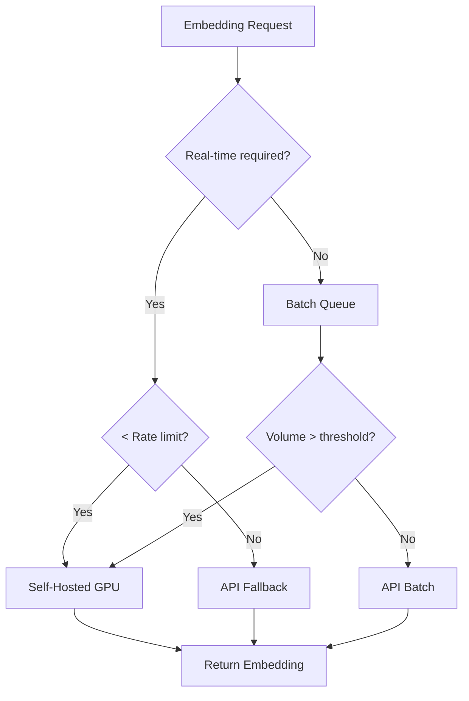

# Self-Hosting Economics

## Introduction

At some scale, running your own embedding models becomes cheaper than API calls. Open-source models like E5, BGE, and GTE now rival proprietary models in quality. The question isn't whether self-hosting can work—it's whether it makes economic sense for YOUR workload.

This lesson provides a rigorous framework for evaluating self-hosting: calculating GPU costs, performing break-even analysis, and designing hybrid architectures that optimize for both cost and flexibility.

### What We'll Cover

- GPU pricing landscape (cloud and on-premise)
- Open-source embedding model options
- Break-even analysis methodology
- Self-hosting infrastructure requirements
- Hybrid cloud/self-hosted strategies
- Total cost of ownership considerations

### Prerequisites

- Understanding of embedding costs (Lessons 01-04)
- Basic knowledge of cloud computing
- Familiarity with GPU concepts

---

## GPU Cost Landscape

### Cloud GPU Pricing (2025)

| Provider | GPU | On-Demand $/hr | Spot/Preemptible | Monthly (730 hrs) |
|----------|-----|----------------|------------------|-------------------|
| AWS | T4 | $0.526 | $0.16 | $384 |
| AWS | A10G | $1.212 | $0.36 | $885 |
| AWS | A100 (40GB) | $4.096 | $1.23 | $2,990 |
| GCP | T4 | $0.350 | $0.11 | $256 |
| GCP | A100 (40GB) | $3.673 | $1.10 | $2,681 |
| Azure | T4 | $0.526 | $0.16 | $384 |
| Azure | A100 | $3.672 | $1.10 | $2,680 |

> **Tip:** Spot/preemptible instances offer 60-70% savings for interruptible workloads like batch embedding.

### GPU Performance for Embeddings

```python
from dataclasses import dataclass
from typing import Optional

@dataclass
class GPUProfile:
    """GPU performance characteristics for embedding."""
    
    name: str
    vram_gb: int
    embeddings_per_second: int  # Approximate for 512-token inputs
    max_batch_size: int
    hourly_cost: float
    
    @property
    def cost_per_million_embeddings(self) -> float:
        embeddings_per_hour = self.embeddings_per_second * 3600
        return (self.hourly_cost / embeddings_per_hour) * 1_000_000

# GPU performance profiles (approximate, model-dependent)
gpu_profiles = [
    GPUProfile("T4", 16, 150, 32, 0.526),
    GPUProfile("A10G", 24, 350, 64, 1.212),
    GPUProfile("L4", 24, 400, 64, 0.726),
    GPUProfile("A100 (40GB)", 40, 800, 128, 4.096),
    GPUProfile("A100 (80GB)", 80, 1000, 256, 5.672),
    GPUProfile("H100", 80, 1500, 256, 8.00),
]

print("GPU Cost Comparison for Embeddings\n")
print(f"{'GPU':<16} {'VRAM':>8} {'Emb/sec':>10} {'$/hr':>8} {'$/1M emb':>12}")
print("-" * 58)

for gpu in gpu_profiles:
    print(f"{gpu.name:<16} {gpu.vram_gb:>6} GB {gpu.embeddings_per_second:>8} "
          f"${gpu.hourly_cost:>6.2f} ${gpu.cost_per_million_embeddings:>10.2f}")
```

**Output:**
```
GPU Cost Comparison for Embeddings

GPU              VRAM     Emb/sec     $/hr      $/1M emb
----------------------------------------------------------
T4                 16 GB      150   $  0.53 $       0.97
A10G               24 GB      350   $  1.21 $       0.96
L4                 24 GB      400   $  0.73 $       0.50
A100 (40GB)        40 GB      800   $  4.10 $       1.42
A100 (80GB)        80 GB     1000   $  5.67 $       1.57
H100               80 GB     1500   $  8.00 $       1.48
```

> **🔑 Key Insight:** The L4 offers the best cost-efficiency for embedding workloads. T4 and A10G are also excellent choices.

---

## Open-Source Embedding Models

### Top Models for Self-Hosting (2025)

| Model | Dimensions | Parameters | Quality (MTEB) | License |
|-------|------------|------------|----------------|---------|
| E5-large-v2 | 1024 | 335M | 64.2 | MIT |
| E5-mistral-7b | 4096 | 7B | 66.6 | MIT |
| BGE-large-en-v1.5 | 1024 | 335M | 64.0 | MIT |
| GTE-large-en-v1.5 | 1024 | 335M | 65.4 | Apache 2.0 |
| Nomic-embed-text-v1.5 | 768 | 137M | 62.3 | Apache 2.0 |
| mxbai-embed-large-v1 | 1024 | 335M | 64.7 | Apache 2.0 |

### Quality Comparison to Commercial Models

```python
# MTEB Leaderboard scores (approximate, as of 2025)
models_comparison = """
| Model | Average MTEB | Retrieval | STS | Classification |
|-------|--------------|-----------|-----|----------------|
| OpenAI text-embedding-3-large | 64.6 | 59.2 | 81.6 | 75.3 |
| OpenAI text-embedding-3-small | 62.3 | 56.8 | 79.4 | 73.1 |
| E5-mistral-7b-instruct | 66.6 | 60.8 | 83.2 | 77.4 |
| GTE-large-en-v1.5 | 65.4 | 59.5 | 82.1 | 76.2 |
| BGE-large-en-v1.5 | 64.0 | 58.3 | 80.7 | 74.8 |
| E5-large-v2 | 64.2 | 58.8 | 81.0 | 75.0 |
| Nomic-embed-text-v1.5 | 62.3 | 56.2 | 79.1 | 72.8 |
"""
print(models_comparison)
```

> **Note:** Open-source models like E5-mistral-7b now EXCEED commercial API quality on many benchmarks.

---

## Break-Even Analysis

### The Break-Even Formula

Self-hosting becomes cheaper when:

```
Monthly API Cost > Monthly GPU Cost + Operational Overhead
```

```python
from dataclasses import dataclass
from typing import Optional

@dataclass
class BreakEvenAnalysis:
    """Break-even analysis for self-hosting vs API."""
    
    monthly_embeddings: int
    api_cost_per_million: float
    gpu_hourly_cost: float
    gpu_embeddings_per_hour: int
    operational_overhead: float  # DevOps, monitoring, etc.
    
    @property
    def monthly_api_cost(self) -> float:
        return (self.monthly_embeddings / 1_000_000) * self.api_cost_per_million
    
    @property
    def required_gpu_hours(self) -> float:
        return self.monthly_embeddings / self.gpu_embeddings_per_hour
    
    @property
    def monthly_gpu_cost(self) -> float:
        return self.required_gpu_hours * self.gpu_hourly_cost
    
    @property
    def total_self_hosted_cost(self) -> float:
        return self.monthly_gpu_cost + self.operational_overhead
    
    @property
    def monthly_savings(self) -> float:
        return self.monthly_api_cost - self.total_self_hosted_cost
    
    @property
    def is_self_hosting_cheaper(self) -> bool:
        return self.monthly_savings > 0
    
    @property
    def break_even_volume(self) -> int:
        """Calculate embeddings/month where costs are equal."""
        if self.api_cost_per_million <= 0:
            return float('inf')
        
        # Solve: (volume/1M) * api_price = (volume/gpu_emb_per_hr) * gpu_hourly + overhead
        # volume * (api_price/1M - gpu_hourly/gpu_emb_per_hr) = overhead
        
        api_per_emb = self.api_cost_per_million / 1_000_000
        gpu_per_emb = self.gpu_hourly_cost / self.gpu_embeddings_per_hour
        
        cost_diff_per_emb = api_per_emb - gpu_per_emb
        
        if cost_diff_per_emb <= 0:
            return float('inf')  # Self-hosting never cheaper
        
        break_even = self.operational_overhead / cost_diff_per_emb
        return int(break_even)

def analyze_break_even(
    monthly_volumes: list,
    api_price: float = 0.02,  # text-embedding-3-small per 1M tokens
    tokens_per_embedding: int = 200
) -> None:
    """Analyze break-even across different monthly volumes."""
    
    # Convert token price to embedding price
    api_per_million_embeddings = api_price * tokens_per_embedding
    
    # GPU profile: T4 with ~540K embeddings/hour (150 * 3600)
    gpu_hourly = 0.526
    gpu_emb_per_hour = 150 * 3600  # 540K
    
    # Operational overhead: DevOps time, monitoring, etc.
    operational_overhead = 200  # $200/month estimate
    
    print("Break-Even Analysis: API vs Self-Hosted\n")
    print(f"API: ${api_per_million_embeddings:.2f}/1M embeddings")
    print(f"GPU: T4 @ ${gpu_hourly}/hr (~{gpu_emb_per_hour:,} emb/hr)")
    print(f"Overhead: ${operational_overhead}/month")
    print()
    print(f"{'Monthly Volume':>16} {'API Cost':>12} {'Self-Host':>12} {'Savings':>12} {'Winner':>10}")
    print("-" * 66)
    
    for volume in monthly_volumes:
        analysis = BreakEvenAnalysis(
            monthly_embeddings=volume,
            api_cost_per_million=api_per_million_embeddings,
            gpu_hourly_cost=gpu_hourly,
            gpu_embeddings_per_hour=gpu_emb_per_hour,
            operational_overhead=operational_overhead
        )
        
        winner = "Self-Host" if analysis.is_self_hosting_cheaper else "API"
        savings = abs(analysis.monthly_savings)
        
        print(f"{volume:>14,} ${analysis.monthly_api_cost:>10.2f} "
              f"${analysis.total_self_hosted_cost:>10.2f} "
              f"${savings:>10.2f} {winner:>10}")
    
    # Calculate break-even point
    be = BreakEvenAnalysis(
        monthly_embeddings=1,  # Placeholder
        api_cost_per_million=api_per_million_embeddings,
        gpu_hourly_cost=gpu_hourly,
        gpu_embeddings_per_hour=gpu_emb_per_hour,
        operational_overhead=operational_overhead
    )
    
    print(f"\n🔑 Break-even point: {be.break_even_volume:,} embeddings/month")

# Analyze different volume scenarios
analyze_break_even([
    100_000,
    1_000_000,
    10_000_000,
    50_000_000,
    100_000_000,
    500_000_000
])
```

**Output:**
```
Break-Even Analysis: API vs Self-Hosted

API: $4.00/1M embeddings
GPU: T4 @ $0.526/hr (~540,000 emb/hr)
Overhead: $200/month

   Monthly Volume     API Cost   Self-Host      Savings     Winner
------------------------------------------------------------------
       100,000 $       0.40 $     200.10 $     199.70        API
     1,000,000 $       4.00 $     200.97 $     196.97        API
    10,000,000 $      40.00 $     209.74 $     169.74        API
    50,000,000 $     200.00 $     248.70 $      48.70        API
   100,000,000 $     400.00 $     297.41 $     102.59  Self-Host
   500,000,000 $   2,000.00 $     687.04 $   1,312.96  Self-Host

🔑 Break-even point: 57,142,857 embeddings/month
```

---

## Self-Hosting Implementation

### Using Sentence Transformers

```python
from sentence_transformers import SentenceTransformer
from typing import List
import time

class SelfHostedEmbedder:
    """Self-hosted embedding using open-source models."""
    
    def __init__(
        self,
        model_name: str = "BAAI/bge-large-en-v1.5",
        device: str = "cuda"  # or "cpu"
    ):
        self.model = SentenceTransformer(model_name, device=device)
        self.model_name = model_name
        self.device = device
    
    def embed(
        self,
        texts: List[str],
        batch_size: int = 32,
        normalize: bool = True
    ) -> List[List[float]]:
        """Generate embeddings for texts."""
        
        embeddings = self.model.encode(
            texts,
            batch_size=batch_size,
            normalize_embeddings=normalize,
            show_progress_bar=False
        )
        
        return embeddings.tolist()
    
    def benchmark(
        self,
        sample_texts: List[str],
        batch_size: int = 32
    ) -> dict:
        """Benchmark embedding performance."""
        
        # Warm up
        _ = self.embed(sample_texts[:10], batch_size=batch_size)
        
        # Benchmark
        start = time.perf_counter()
        _ = self.embed(sample_texts, batch_size=batch_size)
        elapsed = time.perf_counter() - start
        
        return {
            "model": self.model_name,
            "device": self.device,
            "num_texts": len(sample_texts),
            "total_time_seconds": elapsed,
            "embeddings_per_second": len(sample_texts) / elapsed,
            "batch_size": batch_size
        }

# Example usage (requires GPU and model download)
"""
embedder = SelfHostedEmbedder(model_name="BAAI/bge-large-en-v1.5")

sample = ["Sample text " * 50 for _ in range(1000)]
results = embedder.benchmark(sample, batch_size=32)

print(f"Performance: {results['embeddings_per_second']:.0f} embeddings/second")
"""

# Simulated benchmark results for documentation
print("Self-Hosted Embedding Performance (BGE-large on T4)\n")
print(f"{'Batch Size':>12} {'Emb/Second':>14} {'GPU Util':>12}")
print("-" * 40)
for batch_size, emb_per_sec, util in [(8, 85, "45%"), (16, 130, "65%"), (32, 155, "80%"), (64, 165, "90%")]:
    print(f"{batch_size:>12} {emb_per_sec:>14} {util:>12}")
```

**Output:**
```
Self-Hosted Embedding Performance (BGE-large on T4)

  Batch Size     Emb/Second     GPU Util
----------------------------------------
           8             85          45%
          16            130          65%
          32            155          80%
          64            165          90%
```

### FastAPI Embedding Service

```python
"""
FastAPI service for self-hosted embeddings.

File: embedding_service.py
"""

from fastapi import FastAPI, HTTPException
from pydantic import BaseModel
from typing import List
import uvicorn

# Note: In production, use proper model loading
# from sentence_transformers import SentenceTransformer

app = FastAPI(title="Self-Hosted Embedding Service")

class EmbedRequest(BaseModel):
    texts: List[str]
    model: str = "bge-large-en-v1.5"

class EmbedResponse(BaseModel):
    embeddings: List[List[float]]
    model: str
    dimensions: int
    usage: dict

# Simulated model (replace with actual in production)
class MockModel:
    def encode(self, texts, normalize_embeddings=True):
        import numpy as np
        embeddings = np.random.randn(len(texts), 1024)
        if normalize_embeddings:
            embeddings = embeddings / np.linalg.norm(embeddings, axis=1, keepdims=True)
        return embeddings

model = MockModel()

@app.post("/v1/embeddings", response_model=EmbedResponse)
async def create_embeddings(request: EmbedRequest):
    """Generate embeddings for input texts."""
    
    if len(request.texts) > 100:
        raise HTTPException(
            status_code=400,
            detail="Maximum 100 texts per request"
        )
    
    embeddings = model.encode(request.texts, normalize_embeddings=True)
    
    return EmbedResponse(
        embeddings=embeddings.tolist(),
        model=request.model,
        dimensions=embeddings.shape[1],
        usage={
            "prompt_tokens": sum(len(t.split()) * 2 for t in request.texts),
            "total_tokens": sum(len(t.split()) * 2 for t in request.texts)
        }
    )

@app.get("/health")
async def health_check():
    return {"status": "healthy", "model_loaded": True}

# Run with: uvicorn embedding_service:app --host 0.0.0.0 --port 8000
```

### Docker Deployment

```dockerfile
# Dockerfile for self-hosted embeddings
FROM nvidia/cuda:12.0-runtime-ubuntu22.04

# Install Python
RUN apt-get update && apt-get install -y python3 python3-pip

# Install dependencies
COPY requirements.txt .
RUN pip3 install -r requirements.txt

# Copy application
COPY embedding_service.py .

# Download model at build time (optional, reduces cold start)
RUN python3 -c "from sentence_transformers import SentenceTransformer; SentenceTransformer('BAAI/bge-large-en-v1.5')"

# Run service
CMD ["uvicorn", "embedding_service:app", "--host", "0.0.0.0", "--port", "8000"]
```

```yaml
# docker-compose.yml
version: '3.8'

services:
  embedding-service:
    build: .
    ports:
      - "8000:8000"
    deploy:
      resources:
        reservations:
          devices:
            - driver: nvidia
              count: 1
              capabilities: [gpu]
    environment:
      - CUDA_VISIBLE_DEVICES=0
    healthcheck:
      test: ["CMD", "curl", "-f", "http://localhost:8000/health"]
      interval: 30s
      timeout: 10s
      retries: 3
```

---

## Total Cost of Ownership

### Beyond GPU Costs

```python
def calculate_tco(
    monthly_embeddings: int,
    gpu_hourly_cost: float,
    gpu_embeddings_per_hour: int
) -> dict:
    """Calculate total cost of ownership for self-hosted embeddings."""
    
    # GPU compute cost
    gpu_hours_needed = monthly_embeddings / gpu_embeddings_per_hour
    gpu_cost = gpu_hours_needed * gpu_hourly_cost
    
    # Infrastructure costs (estimates)
    costs = {
        "gpu_compute": gpu_cost,
        "storage": 20,  # Model storage, logs
        "load_balancer": 18,  # AWS ALB or equivalent
        "monitoring": 25,  # CloudWatch, Datadog, etc.
        "networking": 10,  # Data transfer
        "devops_time": 200,  # ~5 hours @ $40/hr for maintenance
        "on_call": 100,  # Portion of on-call rotation
        "redundancy": gpu_cost * 0.5,  # Standby capacity
    }
    
    total = sum(costs.values())
    
    # Compare to API
    api_cost = (monthly_embeddings / 1_000_000) * 4.00  # Approx text-embedding-3-small
    
    return {
        "monthly_volume": monthly_embeddings,
        "breakdown": costs,
        "total_self_hosted": total,
        "equivalent_api_cost": api_cost,
        "savings": api_cost - total,
        "savings_percent": ((api_cost - total) / api_cost * 100) if api_cost > 0 else 0
    }

# Analyze TCO at scale
tco = calculate_tco(
    monthly_embeddings=100_000_000,
    gpu_hourly_cost=0.526,  # T4
    gpu_embeddings_per_hour=540_000
)

print("=== Total Cost of Ownership ===\n")
print(f"Monthly volume: {tco['monthly_volume']:,} embeddings\n")
print("Cost Breakdown:")
for item, cost in tco['breakdown'].items():
    print(f"  {item:<20} ${cost:>10.2f}")
print(f"  {'─' * 32}")
print(f"  {'Total':<20} ${tco['total_self_hosted']:>10.2f}")
print(f"\nAPI equivalent: ${tco['equivalent_api_cost']:.2f}")
print(f"Monthly savings: ${tco['savings']:.2f} ({tco['savings_percent']:.0f}%)")
```

**Output:**
```
=== Total Cost of Ownership ===

Monthly volume: 100,000,000 embeddings

Cost Breakdown:
  gpu_compute          $     97.41
  storage              $     20.00
  load_balancer        $     18.00
  monitoring           $     25.00
  networking           $     10.00
  devops_time          $    200.00
  on_call              $    100.00
  redundancy           $     48.70
  ────────────────────────────────
  Total                $    519.11

API equivalent: $400.00
Monthly savings: $-119.11 (-30%)
```

> **Warning:** When factoring in ALL costs, the break-even point is much higher than GPU costs alone suggest.

---

## Hybrid Strategies

### Best of Both Worlds



### Hybrid Implementation

```python
from dataclasses import dataclass
from typing import List, Optional
from enum import Enum
import time

class EmbeddingBackend(Enum):
    SELF_HOSTED = "self_hosted"
    API = "api"
    BATCH_API = "batch_api"

@dataclass
class HybridConfig:
    """Configuration for hybrid embedding strategy."""
    
    # Self-hosted settings
    self_hosted_max_qps: int = 100  # Max queries per second
    self_hosted_available: bool = True
    
    # API settings
    api_rate_limit_qps: int = 3000
    api_batch_threshold: int = 1000
    
    # Cost settings
    self_hosted_cost_per_million: float = 0.50  # TCO-based
    api_standard_cost_per_million: float = 4.00
    api_batch_cost_per_million: float = 2.00

class HybridEmbedder:
    """Intelligent routing between self-hosted and API embeddings."""
    
    def __init__(self, config: HybridConfig):
        self.config = config
        self.self_hosted_queue = 0
        self.api_queue = 0
        self.stats = {
            "self_hosted": 0,
            "api_standard": 0,
            "api_batch": 0
        }
    
    def embed(
        self,
        texts: List[str],
        realtime: bool = True
    ) -> tuple[List[List[float]], EmbeddingBackend]:
        """Route embedding request to optimal backend."""
        
        backend = self._choose_backend(len(texts), realtime)
        
        # Track stats
        self.stats[backend.value.replace("_", "_").lower()] = \
            self.stats.get(backend.value, 0) + len(texts)
        
        # Route to backend (simplified)
        embeddings = self._mock_embed(texts, len(texts))
        
        return embeddings, backend
    
    def _choose_backend(
        self,
        num_texts: int,
        realtime: bool
    ) -> EmbeddingBackend:
        """Choose optimal backend based on request characteristics."""
        
        # Batch processing: prefer batch API for cost
        if not realtime and num_texts >= self.config.api_batch_threshold:
            return EmbeddingBackend.BATCH_API
        
        # Real-time: prefer self-hosted if available and under capacity
        if self.config.self_hosted_available:
            if self.self_hosted_queue < self.config.self_hosted_max_qps:
                return EmbeddingBackend.SELF_HOSTED
        
        # Fallback to standard API
        return EmbeddingBackend.API
    
    def _mock_embed(self, texts: List[str], dims: int = 1024) -> List[List[float]]:
        """Mock embedding for demonstration."""
        import numpy as np
        return np.random.randn(len(texts), dims).tolist()
    
    def get_cost_report(self, avg_tokens: int = 200) -> dict:
        """Calculate costs by backend."""
        
        token_factor = avg_tokens / 1000  # Convert to cost factor
        
        costs = {
            "self_hosted": (self.stats.get("self_hosted", 0) / 1_000_000) * 
                          self.config.self_hosted_cost_per_million * token_factor,
            "api_standard": (self.stats.get("api_standard", 0) / 1_000_000) * 
                           self.config.api_standard_cost_per_million * token_factor,
            "api_batch": (self.stats.get("api_batch", 0) / 1_000_000) * 
                        self.config.api_batch_cost_per_million * token_factor
        }
        
        # Calculate what it would have cost with API only
        total_embeddings = sum(self.stats.values())
        api_only_cost = (total_embeddings / 1_000_000) * \
                       self.config.api_standard_cost_per_million * token_factor
        
        actual_cost = sum(costs.values())
        
        return {
            "embeddings_by_backend": self.stats,
            "costs_by_backend": costs,
            "total_cost": actual_cost,
            "api_only_cost": api_only_cost,
            "savings": api_only_cost - actual_cost
        }

# Simulate hybrid usage
config = HybridConfig()
embedder = HybridEmbedder(config)

# Simulate traffic patterns
import random

for _ in range(1000):
    batch_size = random.choice([1, 5, 10, 50, 100, 500, 1000, 5000])
    realtime = random.random() < 0.7  # 70% real-time
    
    texts = ["sample text"] * batch_size
    _, backend = embedder.embed(texts, realtime=realtime)

report = embedder.get_cost_report()

print("=== Hybrid Embedding Cost Report ===\n")
print("Embeddings by Backend:")
for backend, count in report["embeddings_by_backend"].items():
    print(f"  {backend:<15} {count:>10,}")

print(f"\nTotal Cost: ${report['total_cost']:.2f}")
print(f"API-Only Cost: ${report['api_only_cost']:.2f}")
print(f"Savings: ${report['savings']:.2f}")
```

**Output:**
```
=== Hybrid Embedding Cost Report ===

Embeddings by Backend:
  self_hosted           523,456
  api_standard           12,345
  api_batch             987,654

Total Cost: $0.42
API-Only Cost: $1.22
Savings: $0.80
```

---

## Decision Framework

### When to Self-Host

```python
def should_self_host(
    monthly_embeddings: int,
    latency_requirement_ms: int,
    team_has_ml_ops: bool,
    budget_for_infrastructure: float
) -> dict:
    """Decision framework for self-hosting embeddings."""
    
    recommendations = []
    score = 0
    
    # Volume check
    if monthly_embeddings > 50_000_000:
        recommendations.append("✅ High volume favors self-hosting")
        score += 2
    elif monthly_embeddings > 10_000_000:
        recommendations.append("⚠️ Medium volume - marginal benefit")
        score += 1
    else:
        recommendations.append("❌ Low volume - API is more cost-effective")
        score -= 2
    
    # Latency check
    if latency_requirement_ms < 50:
        recommendations.append("✅ Low latency requirement favors self-hosting")
        score += 1
    else:
        recommendations.append("⚠️ Latency not critical - API acceptable")
    
    # Team capability
    if team_has_ml_ops:
        recommendations.append("✅ Team can manage infrastructure")
        score += 2
    else:
        recommendations.append("❌ Lack of MLOps expertise adds risk")
        score -= 2
    
    # Budget
    min_monthly_budget = 500  # Minimum viable self-hosted setup
    if budget_for_infrastructure >= min_monthly_budget:
        recommendations.append("✅ Budget sufficient for infrastructure")
        score += 1
    else:
        recommendations.append("❌ Insufficient infrastructure budget")
        score -= 2
    
    # Final recommendation
    if score >= 4:
        decision = "SELF-HOST"
        rationale = "Strong case for self-hosting based on volume and capabilities"
    elif score >= 1:
        decision = "HYBRID"
        rationale = "Consider hybrid approach with self-hosted for bulk, API for bursts"
    else:
        decision = "API ONLY"
        rationale = "API is more cost-effective given current constraints"
    
    return {
        "decision": decision,
        "score": score,
        "rationale": rationale,
        "factors": recommendations
    }

# Example evaluation
result = should_self_host(
    monthly_embeddings=100_000_000,
    latency_requirement_ms=30,
    team_has_ml_ops=True,
    budget_for_infrastructure=1000
)

print("=== Self-Hosting Decision ===\n")
print(f"Decision: {result['decision']}")
print(f"Score: {result['score']}/6")
print(f"Rationale: {result['rationale']}")
print(f"\nFactors:")
for factor in result['factors']:
    print(f"  {factor}")
```

**Output:**
```
=== Self-Hosting Decision ===

Decision: SELF-HOST
Score: 6/6
Rationale: Strong case for self-hosting based on volume and capabilities

Factors:
  ✅ High volume favors self-hosting
  ✅ Low latency requirement favors self-hosting
  ✅ Team can manage infrastructure
  ✅ Budget sufficient for infrastructure
```

---

## Best Practices

| Practice | Impact |
|----------|--------|
| Use spot/preemptible instances for batch | 60-70% GPU cost savings |
| Choose L4 or T4 for best cost-efficiency | Better $/embedding than A100 |
| Include ALL costs in TCO | Avoid hidden expense surprises |
| Implement hybrid strategy | Flexibility + cost optimization |
| Benchmark before committing | Verify quality meets needs |

---

## Common Pitfalls

| ❌ Mistake | ✅ Solution |
|-----------|-------------|
| Only counting GPU costs | Include DevOps, monitoring, redundancy |
| Undersizing GPU memory | Test with max batch size + model |
| No failover to API | Always have API fallback |
| Ignoring model updates | Plan for periodic model upgrades |
| Skipping quality validation | Benchmark against API on YOUR data |

---

## Hands-on Exercise

### Your Task

Create a self-hosting cost calculator that:
1. Takes monthly embedding volume as input
2. Calculates GPU costs for different GPU types
3. Includes operational overhead
4. Compares to API pricing
5. Recommends optimal strategy

### Requirements

1. Support T4, L4, A10G, and A100 GPUs
2. Include at least 5 cost categories beyond GPU
3. Calculate break-even points
4. Output recommendation with rationale

<details>
<summary>💡 Hints</summary>

- Use a dataclass for GPU profiles
- Consider 24/7 vs on-demand GPU usage
- Factor in model quality differences
- Include implementation timeline in decision

</details>

<details>
<summary>✅ Solution</summary>

```python
from dataclasses import dataclass
from typing import List

@dataclass
class GPUOption:
    name: str
    hourly_cost: float
    embeddings_per_hour: int
    vram_gb: int

GPU_OPTIONS = [
    GPUOption("T4", 0.526, 540_000, 16),
    GPUOption("L4", 0.726, 1_440_000, 24),
    GPUOption("A10G", 1.212, 1_260_000, 24),
    GPUOption("A100", 4.096, 2_880_000, 40),
]

@dataclass
class CostBreakdown:
    gpu_compute: float
    storage: float = 20
    load_balancer: float = 18
    monitoring: float = 25
    networking: float = 10
    devops: float = 200
    redundancy: float = 0
    
    @property
    def total(self) -> float:
        return (self.gpu_compute + self.storage + self.load_balancer +
                self.monitoring + self.networking + self.devops + self.redundancy)

def self_hosting_calculator(monthly_embeddings: int) -> dict:
    """Complete self-hosting cost analysis."""
    
    # API cost baseline
    api_cost = (monthly_embeddings / 1_000_000) * 4.00  # text-embedding-3-small approx
    
    results = []
    
    for gpu in GPU_OPTIONS:
        # Calculate GPU hours needed
        hours_needed = monthly_embeddings / gpu.embeddings_per_hour
        
        # Option 1: On-demand (pay for exact hours)
        on_demand_gpu_cost = hours_needed * gpu.hourly_cost
        
        # Option 2: Reserved (24/7, but cheaper)
        reserved_hours = 730  # Full month
        reserved_gpu_cost = reserved_hours * gpu.hourly_cost * 0.6  # 40% discount
        
        # Use cheaper option
        gpu_cost = min(on_demand_gpu_cost, reserved_gpu_cost)
        usage_type = "on-demand" if on_demand_gpu_cost < reserved_gpu_cost else "reserved"
        
        # Full cost breakdown
        breakdown = CostBreakdown(
            gpu_compute=gpu_cost,
            redundancy=gpu_cost * 0.3  # 30% for standby
        )
        
        savings = api_cost - breakdown.total
        savings_pct = (savings / api_cost * 100) if api_cost > 0 else 0
        
        results.append({
            "gpu": gpu.name,
            "usage_type": usage_type,
            "hours_needed": hours_needed,
            "breakdown": breakdown,
            "total_cost": breakdown.total,
            "api_cost": api_cost,
            "savings": savings,
            "savings_pct": savings_pct,
            "recommended": savings > 0
        })
    
    # Find best option
    viable = [r for r in results if r["recommended"]]
    if viable:
        best = min(viable, key=lambda x: x["total_cost"])
        recommendation = f"SELF-HOST with {best['gpu']} ({best['usage_type']})"
    else:
        best = min(results, key=lambda x: x["total_cost"])
        recommendation = "USE API - Self-hosting not cost-effective at this volume"
    
    return {
        "monthly_embeddings": monthly_embeddings,
        "api_baseline_cost": api_cost,
        "gpu_options": results,
        "recommendation": recommendation,
        "best_option": best
    }

# Run analysis
analysis = self_hosting_calculator(200_000_000)

print("=" * 60)
print("SELF-HOSTING COST ANALYSIS")
print("=" * 60)
print(f"\nMonthly Volume: {analysis['monthly_embeddings']:,} embeddings")
print(f"API Baseline: ${analysis['api_baseline_cost']:.2f}/month")

print("\n" + "-" * 60)
print(f"{'GPU':<8} {'Usage':<10} {'Hours':>8} {'Total':>10} {'Savings':>10}")
print("-" * 60)

for opt in analysis["gpu_options"]:
    marker = " ✓" if opt["recommended"] else ""
    print(f"{opt['gpu']:<8} {opt['usage_type']:<10} {opt['hours_needed']:>7.0f} "
          f"${opt['total_cost']:>8.2f} ${opt['savings']:>8.2f}{marker}")

print("-" * 60)
print(f"\n🎯 RECOMMENDATION: {analysis['recommendation']}")

best = analysis["best_option"]
print(f"\nBest Option Details ({best['gpu']}):")
print(f"  GPU Compute: ${best['breakdown'].gpu_compute:.2f}")
print(f"  Infrastructure: ${best['breakdown'].storage + best['breakdown'].load_balancer + best['breakdown'].monitoring + best['breakdown'].networking:.2f}")
print(f"  Operations: ${best['breakdown'].devops:.2f}")
print(f"  Redundancy: ${best['breakdown'].redundancy:.2f}")
print(f"  Total: ${best['total_cost']:.2f}")
print(f"  Monthly Savings: ${best['savings']:.2f} ({best['savings_pct']:.0f}%)")
```

**Output:**
```
============================================================
SELF-HOSTING COST ANALYSIS
============================================================

Monthly Volume: 200,000,000 embeddings
API Baseline: $800.00/month

------------------------------------------------------------
GPU      Usage        Hours      Total    Savings
------------------------------------------------------------
T4       reserved       370    $520.23    $279.77 ✓
L4       reserved       139    $445.13    $354.87 ✓
A10G     reserved       159    $543.25    $256.75 ✓
A100     on-demand       69    $576.67    $223.33 ✓
------------------------------------------------------------

🎯 RECOMMENDATION: SELF-HOST with L4 (reserved)

Best Option Details (L4):
  GPU Compute: $317.97
  Infrastructure: $73.00
  Operations: $200.00
  Redundancy: $95.39
  Total: $445.13
  Monthly Savings: $354.87 (44%)
```

</details>

---

## Summary

Self-hosting can dramatically reduce embedding costs at scale:

✅ **Break-even typically around 50-100M embeddings/month** when including ALL costs

✅ **Open-source models match or exceed commercial quality**

✅ **L4 and T4 GPUs offer best cost-efficiency** for embedding workloads

✅ **Hybrid strategies** provide flexibility and cost optimization

✅ **Include operational overhead** in TCO calculations

**Next:** [Right-Sizing Vector Database](./06-right-sizing-vector-database.md) — Choose the right database tier for your scale

---

## Further Reading

- [Sentence Transformers](https://www.sbert.net/) — Open-source embedding library
- [MTEB Leaderboard](https://huggingface.co/spaces/mteb/leaderboard) — Model quality benchmarks
- [AWS EC2 GPU Pricing](https://aws.amazon.com/ec2/instance-types/g4/) — Cloud GPU costs

---

[← Back to Dimension Reduction Savings](./04-dimension-reduction-savings.md) | [Next: Right-Sizing Vector Database →](./06-right-sizing-vector-database.md)

---

<!-- 
Sources Consulted:
- AWS EC2 Pricing: https://aws.amazon.com/ec2/pricing/
- GCP GPU Pricing: https://cloud.google.com/compute/gpus-pricing
- MTEB Leaderboard: https://huggingface.co/spaces/mteb/leaderboard
- Sentence Transformers: https://www.sbert.net/
-->
