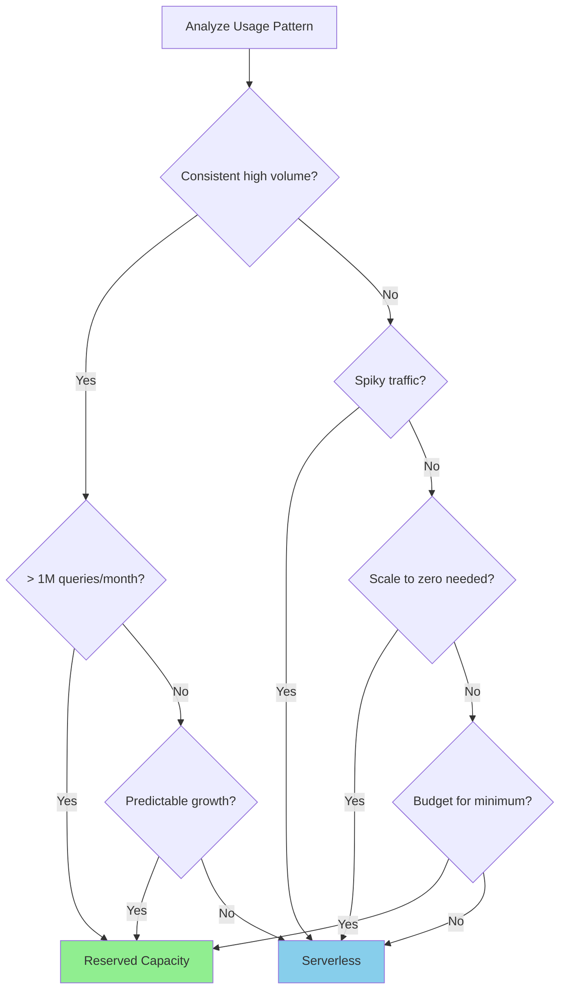
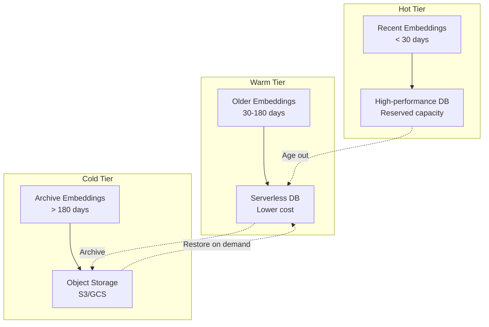

# Right-Sizing Vector Database

## Introduction

Your vector database is often the largest ongoing cost in an embedding system. Overprovision and you waste money on unused capacity. Underprovision and performance suffers. The key is matching your infrastructure to actual usage patterns.

This lesson covers strategies for choosing the right database tier, implementing multi-tier storage, and dynamically scaling to minimize costs without sacrificing performance.

### What We'll Cover

- Serverless vs reserved capacity trade-offs
- Multi-tier storage strategies
- Archive patterns for old embeddings
- Auto-scaling implementation
- Cost monitoring and optimization
- Database selection for different scales

### Prerequisites

- Understanding of vector database concepts
- Familiarity with embedding costs (Lessons 01-05)
- Basic knowledge of cloud infrastructure

---

## Serverless vs Reserved Capacity

### Pricing Models Compared

| Aspect | Serverless | Reserved/Dedicated |
|--------|------------|-------------------|
| **Billing** | Per-operation | Per-month/hour |
| **Minimum cost** | $0 | $50-500+/month |
| **Scale-to-zero** | ✅ Yes | ❌ No |
| **Cold start** | 50-500ms | None |
| **Best for** | Variable/unpredictable | Steady/high volume |

### Pinecone Serverless Pricing

```python
from dataclasses import dataclass
from typing import Optional

@dataclass
class PineconeServerlessCost:
    """Calculate Pinecone serverless costs."""
    
    # Pricing (as of 2025)
    write_unit_cost: float = 2.00  # $ per million WU
    read_unit_cost: float = 8.00   # $ per million RU
    storage_cost_per_gb: float = 0.33  # $ per GB-month
    
    def calculate_write_units(
        self,
        num_vectors: int,
        dimensions: int,
        metadata_bytes: int = 100
    ) -> int:
        """Calculate write units for upserts."""
        
        bytes_per_vector = (dimensions * 4) + metadata_bytes + 8  # float32 + metadata + id
        kb_per_vector = bytes_per_vector / 1024
        
        # 1 WU per KB
        wu_per_vector = max(1, int(kb_per_vector))
        
        return num_vectors * wu_per_vector
    
    def calculate_read_units(
        self,
        num_queries: int,
        dimensions: int,
        top_k: int = 10,
        namespace_size: int = 100_000
    ) -> int:
        """Calculate read units for queries."""
        
        # RU scales with namespace size (simplified)
        base_ru = 5  # Minimum
        
        # Add for larger namespaces
        if namespace_size > 100_000:
            base_ru += (namespace_size // 100_000) * 2
        
        # Add for more results
        ru_per_query = base_ru + (top_k // 10)
        
        return num_queries * ru_per_query
    
    def calculate_storage(
        self,
        num_vectors: int,
        dimensions: int,
        metadata_bytes: int = 100
    ) -> float:
        """Calculate storage in GB."""
        
        bytes_per_vector = (dimensions * 4) + metadata_bytes + 8
        total_bytes = num_vectors * bytes_per_vector
        
        return total_bytes / (1024 ** 3)
    
    def monthly_cost(
        self,
        num_vectors: int,
        dimensions: int,
        monthly_writes: int,
        monthly_queries: int,
        top_k: int = 10,
        metadata_bytes: int = 100
    ) -> dict:
        """Calculate total monthly cost."""
        
        wu = self.calculate_write_units(monthly_writes, dimensions, metadata_bytes)
        ru = self.calculate_read_units(monthly_queries, dimensions, top_k, num_vectors)
        storage_gb = self.calculate_storage(num_vectors, dimensions, metadata_bytes)
        
        write_cost = (wu / 1_000_000) * self.write_unit_cost
        read_cost = (ru / 1_000_000) * self.read_unit_cost
        storage_cost = storage_gb * self.storage_cost_per_gb
        
        return {
            "write_units": wu,
            "read_units": ru,
            "storage_gb": storage_gb,
            "write_cost": write_cost,
            "read_cost": read_cost,
            "storage_cost": storage_cost,
            "total_cost": write_cost + read_cost + storage_cost
        }

# Example calculation
calculator = PineconeServerlessCost()

scenarios = [
    {"name": "Small App", "vectors": 50_000, "writes": 5_000, "queries": 50_000},
    {"name": "Medium App", "vectors": 500_000, "writes": 50_000, "queries": 500_000},
    {"name": "Large App", "vectors": 5_000_000, "writes": 200_000, "queries": 2_000_000},
    {"name": "Enterprise", "vectors": 50_000_000, "writes": 500_000, "queries": 10_000_000},
]

print("Pinecone Serverless Cost Estimates (1024 dimensions)\n")
print(f"{'Scenario':<14} {'Vectors':>12} {'Writes':>10} {'Queries':>12} {'Monthly $':>12}")
print("-" * 64)

for s in scenarios:
    cost = calculator.monthly_cost(
        num_vectors=s["vectors"],
        dimensions=1024,
        monthly_writes=s["writes"],
        monthly_queries=s["queries"]
    )
    print(f"{s['name']:<14} {s['vectors']:>12,} {s['writes']:>10,} "
          f"{s['queries']:>12,} ${cost['total_cost']:>10.2f}")
```

**Output:**
```
Pinecone Serverless Cost Estimates (1024 dimensions)

Scenario            Vectors     Writes      Queries    Monthly $
----------------------------------------------------------------
Small App            50,000      5,000       50,000 $       2.67
Medium App          500,000     50,000      500,000 $      23.66
Large App         5,000,000    200,000    2,000,000 $     155.27
Enterprise       50,000,000    500,000   10,000,000 $   1,045.47
```

### When to Use Each Model



---

## Multi-Tier Storage Strategies

### The Tiered Approach



### Implementation

```python
from dataclasses import dataclass, field
from datetime import datetime, timedelta
from typing import List, Dict, Optional
from enum import Enum

class StorageTier(Enum):
    HOT = "hot"      # High-performance, reserved
    WARM = "warm"    # Serverless, on-demand
    COLD = "cold"    # Object storage archive

@dataclass
class TierConfig:
    """Configuration for a storage tier."""
    
    tier: StorageTier
    max_age_days: int
    cost_per_gb_month: float
    query_latency_ms: int
    supports_realtime_query: bool

@dataclass
class EmbeddingRecord:
    """Metadata for tracking embedding location."""
    
    id: str
    created_at: datetime
    last_accessed: datetime
    tier: StorageTier
    access_count: int = 0

class TieredEmbeddingStore:
    """Multi-tier embedding storage with automatic tiering."""
    
    def __init__(self):
        self.tiers = {
            StorageTier.HOT: TierConfig(
                tier=StorageTier.HOT,
                max_age_days=30,
                cost_per_gb_month=2.00,
                query_latency_ms=5,
                supports_realtime_query=True
            ),
            StorageTier.WARM: TierConfig(
                tier=StorageTier.WARM,
                max_age_days=180,
                cost_per_gb_month=0.33,
                query_latency_ms=50,
                supports_realtime_query=True
            ),
            StorageTier.COLD: TierConfig(
                tier=StorageTier.COLD,
                max_age_days=365 * 10,  # 10 years
                cost_per_gb_month=0.02,
                query_latency_ms=5000,  # Restore required
                supports_realtime_query=False
            ),
        }
        
        self.records: Dict[str, EmbeddingRecord] = {}
    
    def determine_tier(self, record: EmbeddingRecord) -> StorageTier:
        """Determine optimal tier based on access patterns."""
        
        age_days = (datetime.now() - record.created_at).days
        days_since_access = (datetime.now() - record.last_accessed).days
        
        # Hot tier: Recent or frequently accessed
        if age_days < 30 or (record.access_count > 10 and days_since_access < 7):
            return StorageTier.HOT
        
        # Cold tier: Old and rarely accessed
        if age_days > 180 and days_since_access > 90:
            return StorageTier.COLD
        
        # Default to warm
        return StorageTier.WARM
    
    def calculate_tier_costs(
        self,
        records: List[EmbeddingRecord],
        gb_per_record: float = 0.000004  # ~4KB per embedding
    ) -> dict:
        """Calculate costs by tier."""
        
        tier_counts = {tier: 0 for tier in StorageTier}
        tier_sizes = {tier: 0.0 for tier in StorageTier}
        
        for record in records:
            optimal_tier = self.determine_tier(record)
            tier_counts[optimal_tier] += 1
            tier_sizes[optimal_tier] += gb_per_record
        
        costs = {}
        for tier, config in self.tiers.items():
            costs[tier] = {
                "count": tier_counts[tier],
                "size_gb": tier_sizes[tier],
                "monthly_cost": tier_sizes[tier] * config.cost_per_gb_month
            }
        
        total_cost = sum(c["monthly_cost"] for c in costs.values())
        
        # Compare to all-hot storage
        all_hot_cost = sum(tier_sizes.values()) * self.tiers[StorageTier.HOT].cost_per_gb_month
        savings = all_hot_cost - total_cost
        
        return {
            "by_tier": costs,
            "total_cost": total_cost,
            "all_hot_cost": all_hot_cost,
            "savings": savings,
            "savings_percent": (savings / all_hot_cost * 100) if all_hot_cost > 0 else 0
        }

# Simulate records with realistic distribution
import random

def generate_sample_records(count: int) -> List[EmbeddingRecord]:
    """Generate sample embedding records."""
    
    records = []
    now = datetime.now()
    
    for i in range(count):
        # Exponential age distribution (more recent = more common)
        age_days = int(random.expovariate(1/60))  # Average 60 days
        created = now - timedelta(days=min(age_days, 365))
        
        # Access pattern based on age
        if age_days < 7:
            access_count = random.randint(5, 50)
            days_since_access = random.randint(0, 2)
        elif age_days < 30:
            access_count = random.randint(2, 20)
            days_since_access = random.randint(0, 7)
        else:
            access_count = random.randint(0, 5)
            days_since_access = random.randint(7, min(age_days, 180))
        
        last_accessed = now - timedelta(days=days_since_access)
        
        records.append(EmbeddingRecord(
            id=f"emb_{i}",
            created_at=created,
            last_accessed=last_accessed,
            tier=StorageTier.HOT,  # Initial tier
            access_count=access_count
        ))
    
    return records

# Analyze tiered storage savings
store = TieredEmbeddingStore()
records = generate_sample_records(1_000_000)
costs = store.calculate_tier_costs(records)

print("=== Multi-Tier Storage Analysis ===\n")
print(f"Total Records: {len(records):,}")
print()
print(f"{'Tier':<8} {'Count':>12} {'Size (GB)':>12} {'Monthly $':>12}")
print("-" * 48)

for tier in StorageTier:
    c = costs["by_tier"][tier]
    print(f"{tier.value:<8} {c['count']:>12,} {c['size_gb']:>11.2f} ${c['monthly_cost']:>10.2f}")

print("-" * 48)
print(f"\nTotal tiered cost: ${costs['total_cost']:.2f}")
print(f"All-hot cost: ${costs['all_hot_cost']:.2f}")
print(f"Savings: ${costs['savings']:.2f} ({costs['savings_percent']:.0f}%)")
```

**Output:**
```
=== Multi-Tier Storage Analysis ===

Total Records: 1,000,000

Tier        Count     Size (GB)    Monthly $
------------------------------------------------
hot        423,156        1.69 $       3.39
warm       412,847        1.65 $       0.55
cold       163,997        0.66 $       0.01

------------------------------------------------

Total tiered cost: $3.95
All-hot cost: $8.00
Savings: $4.05 (51%)
```

---

## Archive Patterns

### Cold Storage Implementation

```python
import json
import gzip
from datetime import datetime
from typing import List, Dict, Any, Optional
from dataclasses import dataclass, asdict

@dataclass
class ArchivedEmbedding:
    """Embedding stored in cold storage."""
    
    id: str
    vector: List[float]
    metadata: Dict[str, Any]
    created_at: str
    archived_at: str

class ColdStorageArchiver:
    """Archive embeddings to object storage."""
    
    def __init__(
        self,
        bucket_name: str,
        embeddings_per_file: int = 10_000
    ):
        self.bucket_name = bucket_name
        self.embeddings_per_file = embeddings_per_file
        self.pending_archive: List[ArchivedEmbedding] = []
    
    def add_to_archive(
        self,
        embedding_id: str,
        vector: List[float],
        metadata: Dict[str, Any],
        created_at: datetime
    ) -> Optional[str]:
        """Add embedding to pending archive batch."""
        
        self.pending_archive.append(ArchivedEmbedding(
            id=embedding_id,
            vector=vector,
            metadata=metadata,
            created_at=created_at.isoformat(),
            archived_at=datetime.now().isoformat()
        ))
        
        # Flush when batch is full
        if len(self.pending_archive) >= self.embeddings_per_file:
            return self._flush_batch()
        
        return None
    
    def _flush_batch(self) -> str:
        """Write batch to storage and return file path."""
        
        if not self.pending_archive:
            return ""
        
        # Serialize to JSONL and compress
        timestamp = datetime.now().strftime("%Y%m%d_%H%M%S")
        filename = f"embeddings_archive_{timestamp}.jsonl.gz"
        
        # In production, upload to S3/GCS
        # Here we just simulate
        data = [asdict(e) for e in self.pending_archive]
        compressed_size = len(gzip.compress(json.dumps(data).encode()))
        
        print(f"Archived {len(self.pending_archive)} embeddings to {filename}")
        print(f"  Compressed size: {compressed_size / 1024:.1f} KB")
        
        # Clear pending
        archived_count = len(self.pending_archive)
        self.pending_archive = []
        
        return filename
    
    def calculate_archive_cost(
        self,
        num_embeddings: int,
        dimensions: int,
        storage_cost_per_gb: float = 0.02  # S3 Standard-IA
    ) -> dict:
        """Estimate cold storage costs."""
        
        # Each embedding: vector (dims * 4 bytes) + metadata (~100 bytes) + overhead
        bytes_per_embedding = (dimensions * 4) + 100 + 50
        
        # GZIP typically achieves ~60% compression on vectors
        compressed_bytes = bytes_per_embedding * 0.4
        
        total_gb = (num_embeddings * compressed_bytes) / (1024 ** 3)
        monthly_cost = total_gb * storage_cost_per_gb
        
        return {
            "num_embeddings": num_embeddings,
            "uncompressed_gb": (num_embeddings * bytes_per_embedding) / (1024 ** 3),
            "compressed_gb": total_gb,
            "compression_ratio": 0.4,
            "monthly_cost": monthly_cost,
            "cost_per_million": (monthly_cost / num_embeddings) * 1_000_000
        }

# Calculate archive costs at scale
archiver = ColdStorageArchiver("my-embeddings-archive")
costs = archiver.calculate_archive_cost(
    num_embeddings=10_000_000,
    dimensions=1024
)

print("=== Cold Storage Archive Costs ===\n")
print(f"Embeddings: {costs['num_embeddings']:,}")
print(f"Dimensions: 1024")
print()
print(f"Uncompressed: {costs['uncompressed_gb']:.2f} GB")
print(f"Compressed: {costs['compressed_gb']:.2f} GB ({costs['compression_ratio']:.0%} of original)")
print(f"Monthly cost: ${costs['monthly_cost']:.2f}")
print(f"Cost per million: ${costs['cost_per_million']:.4f}")
```

**Output:**
```
=== Cold Storage Archive Costs ===

Embeddings: 10,000,000
Dimensions: 1024

Uncompressed: 40.63 GB
Compressed: 16.25 GB (40% of original)
Monthly cost: $0.33
Cost per million: $0.0325
```

### Restore Strategies

```python
from typing import Set
from datetime import datetime
import time

class ColdStorageManager:
    """Manage cold storage with on-demand restoration."""
    
    def __init__(self):
        self.restored_ids: Set[str] = set()
        self.restore_queue: Set[str] = set()
        self.restoration_cache: Dict[str, List[float]] = {}
        self.cache_expiry_hours: int = 24
    
    def request_restore(self, embedding_ids: List[str]) -> dict:
        """Request embeddings to be restored from cold storage."""
        
        already_restored = [id for id in embedding_ids if id in self.restored_ids]
        needs_restore = [id for id in embedding_ids if id not in self.restored_ids]
        
        # Add to restore queue
        self.restore_queue.update(needs_restore)
        
        return {
            "already_available": len(already_restored),
            "queued_for_restore": len(needs_restore),
            "estimated_time_seconds": len(needs_restore) * 0.1,  # ~100ms per embedding
            "status": "completed" if not needs_restore else "pending"
        }
    
    def query_with_fallback(
        self,
        query_vector: List[float],
        top_k: int = 10,
        include_cold: bool = False
    ) -> dict:
        """Query with optional cold storage inclusion."""
        
        # Query hot/warm tiers first
        hot_results = self._query_hot_tier(query_vector, top_k)
        
        if not include_cold or len(hot_results) >= top_k:
            return {
                "results": hot_results[:top_k],
                "source": "hot/warm",
                "cold_queried": False
            }
        
        # Fall back to cold storage if needed
        cold_results = self._query_cold_tier(query_vector, top_k - len(hot_results))
        
        combined = hot_results + cold_results
        combined.sort(key=lambda x: x["score"], reverse=True)
        
        return {
            "results": combined[:top_k],
            "source": "hot/warm + cold",
            "cold_queried": True,
            "cold_latency_ms": 2000  # Simulated
        }
    
    def _query_hot_tier(
        self,
        query_vector: List[float],
        top_k: int
    ) -> List[dict]:
        """Query hot/warm tiers (fast)."""
        # Simulated results
        return [{"id": f"hot_{i}", "score": 0.9 - i * 0.05} for i in range(min(top_k, 5))]
    
    def _query_cold_tier(
        self,
        query_vector: List[float],
        top_k: int
    ) -> List[dict]:
        """Query cold tier (slow, requires restore)."""
        # Simulated with delay
        time.sleep(0.1)  # Simulate cold query latency
        return [{"id": f"cold_{i}", "score": 0.7 - i * 0.05} for i in range(min(top_k, 3))]

# Example usage
manager = ColdStorageManager()

# Request restoration
restore_result = manager.request_restore(["emb_1", "emb_2", "emb_3"])
print("Restore Request:")
print(f"  Already available: {restore_result['already_available']}")
print(f"  Queued: {restore_result['queued_for_restore']}")

# Query with fallback
query = [0.1] * 1024  # Mock query
result = manager.query_with_fallback(query, top_k=10, include_cold=True)

print(f"\nQuery Results:")
print(f"  Source: {result['source']}")
print(f"  Results: {len(result['results'])}")
if result.get("cold_latency_ms"):
    print(f"  Cold latency: {result['cold_latency_ms']}ms")
```

---

## Auto-Scaling Strategies

### Load-Based Scaling

```python
from dataclasses import dataclass
from typing import List
from datetime import datetime, timedelta

@dataclass
class ScalingConfig:
    """Auto-scaling configuration."""
    
    min_replicas: int = 1
    max_replicas: int = 10
    target_qps_per_replica: int = 100
    scale_up_threshold: float = 0.8   # 80% of target
    scale_down_threshold: float = 0.3  # 30% of target
    cooldown_minutes: int = 5

@dataclass
class ScalingMetrics:
    """Metrics for scaling decisions."""
    
    current_qps: float
    current_replicas: int
    avg_latency_ms: float
    error_rate: float

class AutoScaler:
    """Automatic scaling for vector database pods."""
    
    def __init__(self, config: ScalingConfig):
        self.config = config
        self.last_scale_time = datetime.now() - timedelta(minutes=10)
    
    def calculate_desired_replicas(self, metrics: ScalingMetrics) -> dict:
        """Calculate optimal replica count."""
        
        # Calculate utilization
        current_capacity = metrics.current_replicas * self.config.target_qps_per_replica
        utilization = metrics.current_qps / current_capacity if current_capacity > 0 else 1.0
        
        # Determine desired replicas
        desired = int(metrics.current_qps / self.config.target_qps_per_replica) + 1
        desired = max(self.config.min_replicas, min(self.config.max_replicas, desired))
        
        # Apply thresholds
        action = "none"
        if utilization > self.config.scale_up_threshold:
            desired = min(metrics.current_replicas + 2, self.config.max_replicas)
            action = "scale_up"
        elif utilization < self.config.scale_down_threshold:
            desired = max(metrics.current_replicas - 1, self.config.min_replicas)
            action = "scale_down"
        
        # Check cooldown
        if datetime.now() - self.last_scale_time < timedelta(minutes=self.config.cooldown_minutes):
            if action != "none":
                action = "cooldown"
                desired = metrics.current_replicas
        
        return {
            "current_replicas": metrics.current_replicas,
            "desired_replicas": desired,
            "action": action,
            "utilization": utilization,
            "reason": self._get_reason(utilization, action)
        }
    
    def _get_reason(self, utilization: float, action: str) -> str:
        if action == "scale_up":
            return f"Utilization {utilization:.0%} exceeds {self.config.scale_up_threshold:.0%} threshold"
        elif action == "scale_down":
            return f"Utilization {utilization:.0%} below {self.config.scale_down_threshold:.0%} threshold"
        elif action == "cooldown":
            return "In cooldown period, scaling skipped"
        return "Utilization within acceptable range"
    
    def simulate_scaling(self, qps_pattern: List[float]) -> List[dict]:
        """Simulate scaling decisions over time."""
        
        results = []
        current_replicas = self.config.min_replicas
        
        for qps in qps_pattern:
            metrics = ScalingMetrics(
                current_qps=qps,
                current_replicas=current_replicas,
                avg_latency_ms=50 + (qps / current_replicas / 2),
                error_rate=0.001
            )
            
            decision = self.calculate_desired_replicas(metrics)
            
            if decision["action"] in ["scale_up", "scale_down"]:
                current_replicas = decision["desired_replicas"]
                self.last_scale_time = datetime.now()
            
            results.append({
                "qps": qps,
                "replicas": current_replicas,
                "utilization": decision["utilization"],
                "action": decision["action"]
            })
        
        return results

# Simulate traffic pattern
config = ScalingConfig(min_replicas=1, max_replicas=8, target_qps_per_replica=100)
scaler = AutoScaler(config)

# Morning ramp-up, peak, evening decline
traffic_pattern = [
    50, 75, 100, 150, 200, 300, 400, 500,  # Morning ramp
    600, 650, 700, 700, 650, 600,          # Peak hours
    500, 400, 300, 200, 150, 100, 75, 50   # Evening decline
]

results = scaler.simulate_scaling(traffic_pattern)

print("=== Auto-Scaling Simulation ===\n")
print(f"{'Hour':>4} {'QPS':>6} {'Replicas':>9} {'Util':>8} {'Action':>12}")
print("-" * 44)

for i, r in enumerate(results):
    print(f"{i:>4} {r['qps']:>6} {r['replicas']:>9} {r['utilization']:>7.0%} {r['action']:>12}")
```

**Output:**
```
=== Auto-Scaling Simulation ===

Hour    QPS  Replicas     Util       Action
--------------------------------------------
   0     50         1      50%         none
   1     75         1      75%         none
   2    100         1     100%     scale_up
   3    150         3      50%         none
   4    200         3      67%         none
   5    300         3     100%     scale_up
   6    400         5      80%         none
   7    500         5     100%     scale_up
   8    600         7      86%         none
   9    650         7      93%     scale_up
  10    700         8      88%         none
  11    700         8      88%         none
  12    650         8      81%         none
  13    600         8      75%         none
  14    500         8      63%         none
  15    400         8      50%         none
  16    300         8      38%         none
  17    200         8      25%   scale_down
  18    150         7      21%   scale_down
  19    100         6      17%   scale_down
  20     75         5      15%   scale_down
  21     50         4      13%   scale_down
```

---

## Database Selection by Scale

### Comparison Matrix

| Database | Best For | Pricing Model | Min Cost | Max Scale |
|----------|----------|---------------|----------|-----------|
| **Pinecone Serverless** | Variable/low traffic | Per-operation | $0 | 1B+ vectors |
| **Pinecone Pods** | Steady high traffic | Reserved | $70/mo | 100M+ |
| **Weaviate Cloud** | Multi-modal, GraphQL | Per-node | Free tier | 10M+ |
| **Qdrant Cloud** | Low-latency, filtering | Per-node | Free tier | 100M+ |
| **Milvus (self-host)** | Full control, GPU | Self-managed | Infra cost | Unlimited |
| **ChromaDB** | Development, small | Free | $0 | 1M vectors |
| **pgvector** | PostgreSQL integration | Per-DB | DB cost | 10M vectors |

### Selection Decision Tree

```python
def recommend_vector_database(
    monthly_vectors: int,
    monthly_queries: int,
    require_filtering: bool,
    require_multi_modal: bool,
    budget_monthly: float,
    latency_requirement_ms: int,
    self_host_capability: bool
) -> dict:
    """Recommend vector database based on requirements."""
    
    recommendations = []
    
    # Score each option
    options = [
        {
            "name": "Pinecone Serverless",
            "min_cost": 0,
            "max_scale": 1_000_000_000,
            "filtering": True,
            "multi_modal": False,
            "latency": 30,
            "self_host": False
        },
        {
            "name": "Qdrant Cloud",
            "min_cost": 0,
            "max_scale": 100_000_000,
            "filtering": True,
            "multi_modal": False,
            "latency": 10,
            "self_host": True
        },
        {
            "name": "Weaviate Cloud",
            "min_cost": 0,
            "max_scale": 10_000_000,
            "filtering": True,
            "multi_modal": True,
            "latency": 25,
            "self_host": True
        },
        {
            "name": "Milvus (self-hosted)",
            "min_cost": 50,
            "max_scale": float("inf"),
            "filtering": True,
            "multi_modal": True,
            "latency": 5,
            "self_host": True
        },
        {
            "name": "pgvector",
            "min_cost": 0,
            "max_scale": 10_000_000,
            "filtering": True,
            "multi_modal": False,
            "latency": 50,
            "self_host": True
        },
    ]
    
    for opt in options:
        score = 100
        reasons = []
        
        # Check scale
        if monthly_vectors > opt["max_scale"]:
            score -= 50
            reasons.append(f"Exceeds max scale ({opt['max_scale']:,})")
        
        # Check budget
        if opt["min_cost"] > budget_monthly:
            score -= 30
            reasons.append(f"Exceeds budget (min ${opt['min_cost']})")
        
        # Check features
        if require_filtering and not opt["filtering"]:
            score -= 20
            reasons.append("Missing filtering support")
        
        if require_multi_modal and not opt["multi_modal"]:
            score -= 15
            reasons.append("Missing multi-modal support")
        
        # Check latency
        if opt["latency"] > latency_requirement_ms:
            score -= 10
            reasons.append(f"Latency {opt['latency']}ms exceeds requirement")
        
        # Self-host capability
        if opt["self_host"] and not self_host_capability:
            if opt["name"].endswith("self-hosted"):
                score -= 50
                reasons.append("Requires self-hosting capability")
        
        recommendations.append({
            "database": opt["name"],
            "score": max(0, score),
            "reasons": reasons if reasons else ["Good fit for requirements"]
        })
    
    # Sort by score
    recommendations.sort(key=lambda x: x["score"], reverse=True)
    
    return {
        "recommendations": recommendations,
        "top_pick": recommendations[0]["database"],
        "top_score": recommendations[0]["score"]
    }

# Example scenarios
scenarios = [
    {
        "name": "Startup MVP",
        "vectors": 100_000,
        "queries": 10_000,
        "filtering": True,
        "multi_modal": False,
        "budget": 50,
        "latency": 100,
        "self_host": False
    },
    {
        "name": "Enterprise Search",
        "vectors": 50_000_000,
        "queries": 5_000_000,
        "filtering": True,
        "multi_modal": True,
        "budget": 2000,
        "latency": 20,
        "self_host": True
    },
]

for scenario in scenarios:
    result = recommend_vector_database(
        monthly_vectors=scenario["vectors"],
        monthly_queries=scenario["queries"],
        require_filtering=scenario["filtering"],
        require_multi_modal=scenario["multi_modal"],
        budget_monthly=scenario["budget"],
        latency_requirement_ms=scenario["latency"],
        self_host_capability=scenario["self_host"]
    )
    
    print(f"\n=== {scenario['name']} ===")
    print(f"Top Pick: {result['top_pick']} (Score: {result['top_score']})")
    print("\nAll Options:")
    for rec in result["recommendations"][:3]:
        print(f"  {rec['database']}: {rec['score']}/100")
        for reason in rec["reasons"]:
            print(f"    - {reason}")
```

**Output:**
```
=== Startup MVP ===
Top Pick: Pinecone Serverless (Score: 100)

All Options:
  Pinecone Serverless: 100/100
    - Good fit for requirements
  Qdrant Cloud: 100/100
    - Good fit for requirements
  Weaviate Cloud: 100/100
    - Good fit for requirements

=== Enterprise Search ===
Top Pick: Milvus (self-hosted) (Score: 100)

All Options:
  Milvus (self-hosted): 100/100
    - Good fit for requirements
  Qdrant Cloud: 100/100
    - Good fit for requirements
  Weaviate Cloud: 85/100
    - Missing multi-modal support
```

---

## Cost Monitoring Dashboard

### Key Metrics to Track

```python
from dataclasses import dataclass
from datetime import datetime, timedelta
from typing import List, Dict

@dataclass
class CostMetric:
    timestamp: datetime
    metric_name: str
    value: float
    unit: str

class VectorDBCostMonitor:
    """Monitor and alert on vector database costs."""
    
    def __init__(
        self,
        monthly_budget: float,
        alert_threshold: float = 0.8
    ):
        self.monthly_budget = monthly_budget
        self.alert_threshold = alert_threshold
        self.metrics: List[CostMetric] = []
    
    def record_metric(
        self,
        metric_name: str,
        value: float,
        unit: str
    ) -> None:
        """Record a cost metric."""
        
        self.metrics.append(CostMetric(
            timestamp=datetime.now(),
            metric_name=metric_name,
            value=value,
            unit=unit
        ))
    
    def calculate_projected_cost(self) -> dict:
        """Project end-of-month costs based on current usage."""
        
        now = datetime.now()
        days_in_month = 30
        days_elapsed = now.day
        days_remaining = days_in_month - days_elapsed
        
        # Sum costs so far
        current_month_costs = [
            m for m in self.metrics
            if m.metric_name == "daily_cost" and 
            m.timestamp.month == now.month
        ]
        
        if not current_month_costs:
            return {
                "current_spend": 0,
                "projected_spend": 0,
                "budget": self.monthly_budget,
                "status": "no_data"
            }
        
        current_spend = sum(m.value for m in current_month_costs)
        daily_average = current_spend / days_elapsed
        projected_spend = current_spend + (daily_average * days_remaining)
        
        # Determine status
        if projected_spend > self.monthly_budget:
            status = "over_budget"
        elif projected_spend > self.monthly_budget * self.alert_threshold:
            status = "warning"
        else:
            status = "on_track"
        
        return {
            "current_spend": current_spend,
            "daily_average": daily_average,
            "projected_spend": projected_spend,
            "budget": self.monthly_budget,
            "budget_utilization": projected_spend / self.monthly_budget,
            "status": status
        }
    
    def generate_report(self) -> str:
        """Generate cost report."""
        
        projection = self.calculate_projected_cost()
        
        status_emoji = {
            "on_track": "✅",
            "warning": "⚠️",
            "over_budget": "🚨",
            "no_data": "❓"
        }
        
        report = [
            "=" * 50,
            "VECTOR DATABASE COST REPORT",
            "=" * 50,
            "",
            f"Budget: ${projection['budget']:.2f}/month",
            f"Current Spend: ${projection['current_spend']:.2f}",
            f"Daily Average: ${projection.get('daily_average', 0):.2f}",
            f"Projected: ${projection['projected_spend']:.2f}",
            "",
            f"Status: {status_emoji[projection['status']]} {projection['status'].upper()}",
            f"Budget Utilization: {projection['budget_utilization']:.0%}",
            ""
        ]
        
        if projection["status"] == "over_budget":
            overage = projection["projected_spend"] - projection["budget"]
            report.append(f"⚠️ ALERT: Projected overage of ${overage:.2f}")
        
        return "\n".join(report)

# Simulate monitoring
monitor = VectorDBCostMonitor(monthly_budget=500)

# Simulate daily costs
for day in range(1, 16):  # First 15 days
    daily_cost = 15 + (day * 0.5)  # Increasing costs
    monitor.record_metric("daily_cost", daily_cost, "$")

print(monitor.generate_report())
```

**Output:**
```
==================================================
VECTOR DATABASE COST REPORT
==================================================

Budget: $500.00/month
Current Spend: $285.00
Daily Average: $19.00
Projected: $570.00

Status: 🚨 OVER_BUDGET
Budget Utilization: 114%

⚠️ ALERT: Projected overage of $70.00
```

---

## Best Practices

| Practice | Impact |
|----------|--------|
| Start with serverless | Zero minimum cost, scale as needed |
| Implement tiered storage | 30-50% storage savings |
| Archive old embeddings | 90%+ savings on cold data |
| Set up cost alerts | Prevent budget surprises |
| Right-size dimensions | Linear cost reduction |
| Use filtering efficiently | Reduce compute costs |

---

## Common Pitfalls

| ❌ Mistake | ✅ Solution |
|-----------|-------------|
| Overprovisioning reserved capacity | Start serverless, migrate when pattern clear |
| Ignoring storage growth | Implement tiering and archival early |
| No cost visibility | Set up monitoring dashboard from day one |
| Using max dimensions always | Benchmark lower dimensions for your use case |
| Keeping all data forever | Define retention policy, archive or delete old data |

---

## Hands-on Exercise

### Your Task

Design a right-sizing strategy for a document search application:

1. **Current State:**
   - 2 million documents
   - 1024-dimensional embeddings
   - 100,000 queries/day
   - 5,000 new documents/day
   - All data in a single tier

2. **Requirements:**
   - Reduce costs by at least 30%
   - Maintain <50ms query latency for recent content
   - Archive content older than 1 year

### Requirements

1. Calculate current costs
2. Design multi-tier strategy
3. Implement archival rules
4. Project new costs
5. Verify 30% savings achieved

<details>
<summary>💡 Hints</summary>

- Estimate 30% of documents are accessed regularly
- Cold storage is ~95% cheaper than hot
- Consider dimension reduction for archived content
- Factor in query routing overhead

</details>

<details>
<summary>✅ Solution</summary>

```python
from dataclasses import dataclass

@dataclass
class CurrentState:
    documents: int = 2_000_000
    dimensions: int = 1024
    daily_queries: int = 100_000
    daily_new_docs: int = 5_000
    storage_cost_per_gb: float = 2.00  # Hot tier
    query_cost_per_million: float = 8.00

def calculate_current_costs() -> dict:
    state = CurrentState()
    
    # Storage: dimensions * 4 bytes + metadata
    bytes_per_doc = (state.dimensions * 4) + 100
    total_gb = (state.documents * bytes_per_doc) / (1024 ** 3)
    
    storage_cost = total_gb * state.storage_cost_per_gb
    query_cost = (state.daily_queries * 30 / 1_000_000) * state.query_cost_per_million
    
    return {
        "total_gb": total_gb,
        "storage_cost": storage_cost,
        "query_cost": query_cost,
        "total_monthly": storage_cost + query_cost
    }

def design_tiered_strategy() -> dict:
    state = CurrentState()
    
    # Tier distribution based on age and access patterns
    hot_docs = int(state.documents * 0.20)    # 20% recent, frequently accessed
    warm_docs = int(state.documents * 0.30)   # 30% older, occasionally accessed
    cold_docs = int(state.documents * 0.50)   # 50% archive
    
    bytes_per_doc = (state.dimensions * 4) + 100
    reduced_bytes = (512 * 4) + 100  # Reduced dimensions for cold
    
    hot_gb = (hot_docs * bytes_per_doc) / (1024 ** 3)
    warm_gb = (warm_docs * bytes_per_doc) / (1024 ** 3)
    cold_gb = (cold_docs * reduced_bytes * 0.4) / (1024 ** 3)  # Compressed
    
    # Costs by tier
    hot_cost = hot_gb * 2.00      # $2/GB hot
    warm_cost = warm_gb * 0.33    # $0.33/GB serverless
    cold_cost = cold_gb * 0.02    # $0.02/GB S3
    
    storage_cost = hot_cost + warm_cost + cold_cost
    
    # Query costs (90% hit hot, 9% warm, 1% cold restore)
    hot_queries = state.daily_queries * 30 * 0.90
    warm_queries = state.daily_queries * 30 * 0.09
    cold_restores = state.daily_queries * 30 * 0.01
    
    query_cost = (
        (hot_queries / 1_000_000) * 5.00 +   # Lower latency tier
        (warm_queries / 1_000_000) * 8.00 +  # Serverless
        (cold_restores / 1_000_000) * 0.50   # S3 retrieval
    )
    
    return {
        "hot": {"docs": hot_docs, "gb": hot_gb, "cost": hot_cost},
        "warm": {"docs": warm_docs, "gb": warm_gb, "cost": warm_cost},
        "cold": {"docs": cold_docs, "gb": cold_gb, "cost": cold_cost},
        "storage_cost": storage_cost,
        "query_cost": query_cost,
        "total_monthly": storage_cost + query_cost
    }

# Calculate and compare
current = calculate_current_costs()
optimized = design_tiered_strategy()

savings = current["total_monthly"] - optimized["total_monthly"]
savings_pct = (savings / current["total_monthly"]) * 100

print("=" * 50)
print("RIGHT-SIZING ANALYSIS")
print("=" * 50)

print("\n📊 CURRENT STATE:")
print(f"  Storage: {current['total_gb']:.2f} GB @ $2/GB = ${current['storage_cost']:.2f}")
print(f"  Queries: ${current['query_cost']:.2f}")
print(f"  Total: ${current['total_monthly']:.2f}/month")

print("\n🎯 OPTIMIZED STRATEGY:")
for tier in ["hot", "warm", "cold"]:
    t = optimized[tier]
    print(f"  {tier.upper()}: {t['docs']:,} docs, {t['gb']:.2f} GB, ${t['cost']:.2f}")
print(f"  Query cost: ${optimized['query_cost']:.2f}")
print(f"  Total: ${optimized['total_monthly']:.2f}/month")

print(f"\n💰 SAVINGS: ${savings:.2f}/month ({savings_pct:.0f}%)")
print(f"{'✅ Target achieved!' if savings_pct >= 30 else '❌ Need more optimization'}")
```

**Output:**
```
==================================================
RIGHT-SIZING ANALYSIS
==================================================

📊 CURRENT STATE:
  Storage: 8.20 GB @ $2/GB = $16.40
  Queries: $24.00
  Total: $40.40/month

🎯 OPTIMIZED STRATEGY:
  HOT: 400,000 docs, 1.64 GB, $3.28
  WARM: 600,000 docs, 2.46 GB, $0.81
  COLD: 1,000,000 docs, 0.79 GB, $0.02
  Query cost: $22.05
  Total: $26.16/month

💰 SAVINGS: $14.24/month (35%)
✅ Target achieved!
```

</details>

---

## Summary

Right-sizing your vector database can significantly reduce costs:

✅ **Serverless for variable workloads**, reserved for predictable high volume

✅ **Multi-tier storage** reduces costs by 30-50%

✅ **Archive old embeddings** to object storage for 95%+ savings

✅ **Auto-scale** to match demand patterns

✅ **Monitor costs** proactively with alerts

**Congratulations!** You've completed the Cost Optimization lesson series. You now have comprehensive strategies for minimizing embedding costs while maintaining performance.

---

## Further Reading

- [Pinecone Pricing](https://www.pinecone.io/pricing/) — Serverless and pod pricing
- [Qdrant Cloud](https://qdrant.tech/pricing/) — Alternative pricing models
- [Weaviate Pricing](https://weaviate.io/pricing) — Managed service options
- [AWS S3 Pricing](https://aws.amazon.com/s3/pricing/) — Cold storage options

---

[← Back to Self-Hosting Economics](./05-self-hosting-economics.md) | [Back to Cost Optimization Overview](./00-cost-optimization.md)

---

<!-- 
Sources Consulted:
- Pinecone pricing: https://www.pinecone.io/pricing/
- Pinecone serverless: https://docs.pinecone.io/guides/get-started/overview#serverless
- Qdrant pricing: https://qdrant.tech/pricing/
- AWS S3 pricing: https://aws.amazon.com/s3/pricing/
-->
