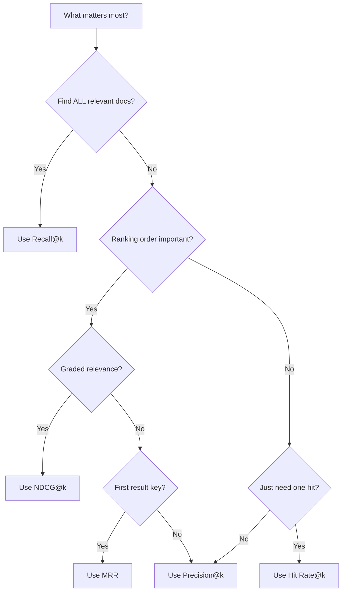

# Retrieval Quality Metrics

## Introduction

Before you can improve retrieval, you need to measure it. Retrieval metrics quantify how well your system finds relevant documents for a given query. These metrics are the foundation of all evaluation—everything else builds on them.

This lesson covers the five essential metrics used throughout the industry: Recall@k, Precision@k, MRR, NDCG, and Hit Rate. You'll learn not just the formulas, but when to use each metric and how to implement them from scratch.

### What We'll Cover

- Recall@k: How many relevant docs did we find?
- Precision@k: How accurate is our top-k?
- MRR: Where does the first relevant doc appear?
- NDCG: How good is our ranking order?
- Hit Rate: Did we find anything relevant?
- Choosing the right metric for your use case

### Prerequisites

- Basic understanding of search/retrieval
- Familiarity with Python
- Knowledge of sets and basic statistics

---

## Understanding Relevance

All retrieval metrics depend on the concept of **relevance**—whether a document is useful for answering a query.

### Binary vs Graded Relevance

| Type | Values | Use Case |
|------|--------|----------|
| **Binary** | Relevant (1) or Not (0) | Simple evaluation, most common |
| **Graded** | Scale (0-3 or 0-5) | When relevance varies in degree |

```python
# Binary relevance example
query = "What is the capital of France?"
relevance_judgments = {
    "doc_1": 1,  # "Paris is the capital of France" - Relevant
    "doc_2": 0,  # "France is in Europe" - Not relevant
    "doc_3": 1,  # "The French capital, Paris, has..." - Relevant
    "doc_4": 0,  # "Berlin is the capital of Germany" - Not relevant
}

# Graded relevance example
graded_judgments = {
    "doc_1": 3,  # Perfect answer
    "doc_2": 1,  # Marginally relevant
    "doc_3": 2,  # Partially relevant
    "doc_4": 0,  # Not relevant
}
```

---

## Recall@k

**Recall@k** measures what fraction of all relevant documents appear in the top-k results.

### Formula

$$\text{Recall@k} = \frac{|\text{Relevant} \cap \text{Retrieved@k}|}{|\text{Relevant}|}$$

### Implementation

```python
from typing import List, Set

def recall_at_k(
    retrieved_ids: List[str],
    relevant_ids: Set[str],
    k: int
) -> float:
    """
    Calculate Recall@k.
    
    Args:
        retrieved_ids: Ranked list of retrieved document IDs
        relevant_ids: Set of all relevant document IDs
        k: Number of top results to consider
    
    Returns:
        Recall score between 0 and 1
    """
    if not relevant_ids:
        return 0.0
    
    retrieved_at_k = set(retrieved_ids[:k])
    relevant_retrieved = retrieved_at_k & relevant_ids
    
    return len(relevant_retrieved) / len(relevant_ids)

# Example
retrieved = ["doc_3", "doc_1", "doc_7", "doc_2", "doc_5", "doc_8", "doc_4"]
relevant = {"doc_1", "doc_2", "doc_4", "doc_6"}  # 4 relevant docs total

for k in [1, 3, 5, 10]:
    score = recall_at_k(retrieved, relevant, k)
    print(f"Recall@{k}: {score:.2f}")
```

**Output:**
```
Recall@1: 0.00
Recall@3: 0.50
Recall@5: 0.50
Recall@10: 0.75
```

### When to Use Recall@k

✅ **Use when**: You need to find ALL relevant documents (legal discovery, research)

✅ **Use when**: Missing a relevant document is costly

❌ **Avoid when**: Ranking order matters more than coverage

> **Note:** Recall@k can't reach 1.0 if k < number of relevant documents.

---

## Precision@k

**Precision@k** measures what fraction of the top-k results are actually relevant.

### Formula

$$\text{Precision@k} = \frac{|\text{Relevant} \cap \text{Retrieved@k}|}{k}$$

### Implementation

```python
def precision_at_k(
    retrieved_ids: List[str],
    relevant_ids: Set[str],
    k: int
) -> float:
    """
    Calculate Precision@k.
    
    Args:
        retrieved_ids: Ranked list of retrieved document IDs
        relevant_ids: Set of relevant document IDs
        k: Number of top results to consider
    
    Returns:
        Precision score between 0 and 1
    """
    if k == 0:
        return 0.0
    
    retrieved_at_k = set(retrieved_ids[:k])
    relevant_retrieved = retrieved_at_k & relevant_ids
    
    return len(relevant_retrieved) / k

# Example
retrieved = ["doc_1", "doc_3", "doc_2", "doc_7", "doc_5"]
relevant = {"doc_1", "doc_2", "doc_4"}

for k in [1, 3, 5]:
    score = precision_at_k(retrieved, relevant, k)
    print(f"Precision@{k}: {score:.2f}")
```

**Output:**
```
Precision@1: 1.00
Precision@3: 0.67
Precision@5: 0.40
```

### When to Use Precision@k

✅ **Use when**: Users only look at top results (search engines, recommendations)

✅ **Use when**: False positives are costly (spam detection)

❌ **Avoid when**: Finding all relevant docs matters more than top-k accuracy

---

## Mean Reciprocal Rank (MRR)

**MRR** measures how quickly the first relevant document appears. It's the average of reciprocal ranks across queries.

### Formula

$$\text{MRR} = \frac{1}{|Q|} \sum_{i=1}^{|Q|} \frac{1}{\text{rank}_i}$$

Where $\text{rank}_i$ is the position of the first relevant document for query $i$.

### Implementation

```python
def reciprocal_rank(
    retrieved_ids: List[str],
    relevant_ids: Set[str]
) -> float:
    """
    Calculate Reciprocal Rank for a single query.
    
    Returns 1/rank of first relevant doc, or 0 if none found.
    """
    for i, doc_id in enumerate(retrieved_ids, start=1):
        if doc_id in relevant_ids:
            return 1.0 / i
    return 0.0

def mean_reciprocal_rank(
    queries_results: List[tuple]  # List of (retrieved_ids, relevant_ids)
) -> float:
    """
    Calculate Mean Reciprocal Rank across multiple queries.
    """
    if not queries_results:
        return 0.0
    
    rr_sum = sum(
        reciprocal_rank(retrieved, relevant)
        for retrieved, relevant in queries_results
    )
    
    return rr_sum / len(queries_results)

# Example: Three queries
query_results = [
    # Query 1: First relevant at position 2
    (["doc_a", "doc_b", "doc_c"], {"doc_b", "doc_c"}),  # RR = 1/2
    # Query 2: First relevant at position 1
    (["doc_x", "doc_y", "doc_z"], {"doc_x"}),            # RR = 1/1
    # Query 3: First relevant at position 3
    (["doc_1", "doc_2", "doc_3"], {"doc_3", "doc_5"}),  # RR = 1/3
]

for i, (retrieved, relevant) in enumerate(query_results, 1):
    rr = reciprocal_rank(retrieved, relevant)
    print(f"Query {i} RR: {rr:.2f}")

mrr = mean_reciprocal_rank(query_results)
print(f"\nMRR: {mrr:.2f}")
```

**Output:**
```
Query 1 RR: 0.50
Query 2 RR: 1.00
Query 3 RR: 0.33

MRR: 0.61
```

### When to Use MRR

✅ **Use when**: Users typically want ONE answer (Q&A systems, fact lookup)

✅ **Use when**: Speed to first relevant result matters

❌ **Avoid when**: Multiple relevant documents all matter equally

---

## Normalized Discounted Cumulative Gain (NDCG)

**NDCG** measures ranking quality by giving higher scores to relevant documents that appear earlier. It handles both binary and graded relevance.

### Formula

$$\text{DCG@k} = \sum_{i=1}^{k} \frac{rel_i}{\log_2(i + 1)}$$

$$\text{NDCG@k} = \frac{\text{DCG@k}}{\text{IDCG@k}}$$

Where IDCG is the DCG of the ideal (perfect) ranking.

### Implementation

```python
import math
from typing import Dict

def dcg_at_k(
    retrieved_ids: List[str],
    relevance_scores: Dict[str, float],
    k: int
) -> float:
    """
    Calculate Discounted Cumulative Gain at k.
    
    Args:
        retrieved_ids: Ranked list of retrieved document IDs
        relevance_scores: Dict mapping doc_id to relevance score
        k: Number of top results to consider
    
    Returns:
        DCG score
    """
    dcg = 0.0
    for i, doc_id in enumerate(retrieved_ids[:k], start=1):
        rel = relevance_scores.get(doc_id, 0)
        dcg += rel / math.log2(i + 1)
    return dcg

def ndcg_at_k(
    retrieved_ids: List[str],
    relevance_scores: Dict[str, float],
    k: int
) -> float:
    """
    Calculate Normalized DCG at k.
    
    Returns NDCG score between 0 and 1.
    """
    # Calculate actual DCG
    dcg = dcg_at_k(retrieved_ids, relevance_scores, k)
    
    # Calculate ideal DCG (sort by relevance descending)
    ideal_order = sorted(
        relevance_scores.keys(),
        key=lambda x: relevance_scores[x],
        reverse=True
    )
    idcg = dcg_at_k(ideal_order, relevance_scores, k)
    
    if idcg == 0:
        return 0.0
    
    return dcg / idcg

# Example with graded relevance
retrieved = ["doc_c", "doc_a", "doc_d", "doc_b", "doc_e"]
relevance = {
    "doc_a": 3,  # Highly relevant
    "doc_b": 2,  # Relevant
    "doc_c": 1,  # Marginally relevant
    "doc_d": 0,  # Not relevant
    "doc_e": 1,  # Marginally relevant
}

# Show DCG calculation step by step
print("Position | Doc   | Relevance | Discount | Contribution")
print("-" * 55)
for i, doc_id in enumerate(retrieved[:5], start=1):
    rel = relevance.get(doc_id, 0)
    discount = math.log2(i + 1)
    contribution = rel / discount
    print(f"    {i}    | {doc_id} |     {rel}     |  {discount:.2f}   |    {contribution:.2f}")

print(f"\nDCG@5: {dcg_at_k(retrieved, relevance, 5):.2f}")
print(f"NDCG@5: {ndcg_at_k(retrieved, relevance, 5):.2f}")
```

**Output:**
```
Position | Doc   | Relevance | Discount | Contribution
-------------------------------------------------------
    1    | doc_c |     1     |  1.00   |    1.00
    2    | doc_a |     3     |  1.58   |    1.89
    3    | doc_d |     0     |  2.00   |    0.00
    4    | doc_b |     2     |  2.32   |    0.86
    5    | doc_e |     1     |  2.58   |    0.39

DCG@5: 4.14
NDCG@5: 0.76
```

### When to Use NDCG

✅ **Use when**: Ranking order matters (search engines, recommendations)

✅ **Use when**: You have graded relevance judgments

✅ **Use when**: Earlier positions should count more

❌ **Avoid when**: All positions are equally important

---

## Hit Rate (Success@k)

**Hit Rate** (also called Success@k) is the simplest metric—it's binary: did ANY relevant document appear in top-k?

### Formula

$$\text{Hit Rate@k} = \begin{cases} 1 & \text{if } |\text{Relevant} \cap \text{Retrieved@k}| > 0 \\ 0 & \text{otherwise} \end{cases}$$

### Implementation

```python
def hit_rate_at_k(
    retrieved_ids: List[str],
    relevant_ids: Set[str],
    k: int
) -> int:
    """
    Calculate Hit Rate (Success) at k.
    
    Returns 1 if any relevant doc in top-k, else 0.
    """
    retrieved_at_k = set(retrieved_ids[:k])
    return 1 if (retrieved_at_k & relevant_ids) else 0

def mean_hit_rate(
    queries_results: List[tuple],
    k: int
) -> float:
    """
    Calculate mean hit rate across multiple queries.
    """
    if not queries_results:
        return 0.0
    
    hits = sum(
        hit_rate_at_k(retrieved, relevant, k)
        for retrieved, relevant in queries_results
    )
    
    return hits / len(queries_results)

# Example
queries = [
    (["doc_1", "doc_2", "doc_3"], {"doc_2"}),      # Hit at position 2
    (["doc_a", "doc_b", "doc_c"], {"doc_x"}),       # No hit
    (["doc_x", "doc_y", "doc_z"], {"doc_x", "doc_y"}),  # Hit at position 1
    (["doc_p", "doc_q", "doc_r"], {"doc_r"}),      # Hit at position 3
]

for k in [1, 3, 5]:
    hr = mean_hit_rate(queries, k)
    print(f"Hit Rate@{k}: {hr:.2f}")
```

**Output:**
```
Hit Rate@1: 0.25
Hit Rate@3: 0.75
Hit Rate@5: 0.75
```

### When to Use Hit Rate

✅ **Use when**: You just need ONE relevant result (Q&A)

✅ **Use when**: You want a simple, interpretable metric

❌ **Avoid when**: Ranking quality or finding ALL relevant docs matters

---

## Comprehensive Evaluation Class

Here's a complete implementation combining all metrics:

```python
from dataclasses import dataclass
from typing import List, Set, Dict, Optional
import math

@dataclass
class RetrievalMetrics:
    """Container for all retrieval metrics."""
    recall_at_k: Dict[int, float]
    precision_at_k: Dict[int, float]
    mrr: float
    ndcg_at_k: Dict[int, float]
    hit_rate_at_k: Dict[int, float]

class RetrievalEvaluator:
    """Evaluate retrieval quality across multiple metrics."""
    
    def __init__(self, k_values: List[int] = [1, 3, 5, 10]):
        self.k_values = k_values
    
    def evaluate_single_query(
        self,
        retrieved_ids: List[str],
        relevant_ids: Set[str],
        relevance_scores: Optional[Dict[str, float]] = None
    ) -> RetrievalMetrics:
        """
        Evaluate a single query across all metrics.
        
        Args:
            retrieved_ids: Ranked list of retrieved document IDs
            relevant_ids: Set of relevant document IDs (for binary metrics)
            relevance_scores: Optional dict of graded relevance (for NDCG)
        
        Returns:
            RetrievalMetrics object with all scores
        """
        # Use binary relevance for NDCG if graded not provided
        if relevance_scores is None:
            relevance_scores = {doc_id: 1 for doc_id in relevant_ids}
        
        return RetrievalMetrics(
            recall_at_k={
                k: self._recall_at_k(retrieved_ids, relevant_ids, k)
                for k in self.k_values
            },
            precision_at_k={
                k: self._precision_at_k(retrieved_ids, relevant_ids, k)
                for k in self.k_values
            },
            mrr=self._reciprocal_rank(retrieved_ids, relevant_ids),
            ndcg_at_k={
                k: self._ndcg_at_k(retrieved_ids, relevance_scores, k)
                for k in self.k_values
            },
            hit_rate_at_k={
                k: self._hit_rate_at_k(retrieved_ids, relevant_ids, k)
                for k in self.k_values
            }
        )
    
    def evaluate_dataset(
        self,
        results: List[Dict]  # List of {retrieved, relevant, relevance_scores}
    ) -> RetrievalMetrics:
        """
        Evaluate across a dataset and return averaged metrics.
        """
        all_metrics = [
            self.evaluate_single_query(
                r["retrieved"],
                r["relevant"],
                r.get("relevance_scores")
            )
            for r in results
        ]
        
        n = len(all_metrics)
        
        return RetrievalMetrics(
            recall_at_k={
                k: sum(m.recall_at_k[k] for m in all_metrics) / n
                for k in self.k_values
            },
            precision_at_k={
                k: sum(m.precision_at_k[k] for m in all_metrics) / n
                for k in self.k_values
            },
            mrr=sum(m.mrr for m in all_metrics) / n,
            ndcg_at_k={
                k: sum(m.ndcg_at_k[k] for m in all_metrics) / n
                for k in self.k_values
            },
            hit_rate_at_k={
                k: sum(m.hit_rate_at_k[k] for m in all_metrics) / n
                for k in self.k_values
            }
        )
    
    def _recall_at_k(self, retrieved: List[str], relevant: Set[str], k: int) -> float:
        if not relevant:
            return 0.0
        retrieved_at_k = set(retrieved[:k])
        return len(retrieved_at_k & relevant) / len(relevant)
    
    def _precision_at_k(self, retrieved: List[str], relevant: Set[str], k: int) -> float:
        if k == 0:
            return 0.0
        retrieved_at_k = set(retrieved[:k])
        return len(retrieved_at_k & relevant) / k
    
    def _reciprocal_rank(self, retrieved: List[str], relevant: Set[str]) -> float:
        for i, doc_id in enumerate(retrieved, start=1):
            if doc_id in relevant:
                return 1.0 / i
        return 0.0
    
    def _hit_rate_at_k(self, retrieved: List[str], relevant: Set[str], k: int) -> float:
        return 1.0 if (set(retrieved[:k]) & relevant) else 0.0
    
    def _ndcg_at_k(self, retrieved: List[str], scores: Dict[str, float], k: int) -> float:
        dcg = sum(
            scores.get(doc_id, 0) / math.log2(i + 1)
            for i, doc_id in enumerate(retrieved[:k], start=1)
        )
        ideal = sorted(scores.keys(), key=lambda x: scores[x], reverse=True)
        idcg = sum(
            scores.get(doc_id, 0) / math.log2(i + 1)
            for i, doc_id in enumerate(ideal[:k], start=1)
        )
        return dcg / idcg if idcg > 0 else 0.0
    
    def print_report(self, metrics: RetrievalMetrics) -> None:
        """Print a formatted evaluation report."""
        print("=" * 50)
        print("RETRIEVAL EVALUATION REPORT")
        print("=" * 50)
        
        print(f"\nMRR: {metrics.mrr:.4f}")
        
        print(f"\n{'k':>4} | {'Recall':>8} | {'Precision':>10} | {'NDCG':>8} | {'Hit Rate':>8}")
        print("-" * 50)
        for k in self.k_values:
            print(f"{k:>4} | {metrics.recall_at_k[k]:>8.4f} | "
                  f"{metrics.precision_at_k[k]:>10.4f} | "
                  f"{metrics.ndcg_at_k[k]:>8.4f} | "
                  f"{metrics.hit_rate_at_k[k]:>8.4f}")

# Example usage
evaluator = RetrievalEvaluator(k_values=[1, 3, 5, 10])

# Simulate dataset
dataset = [
    {
        "retrieved": ["d1", "d3", "d5", "d2", "d7", "d8", "d4", "d9", "d10", "d6"],
        "relevant": {"d1", "d2", "d4", "d6"},
        "relevance_scores": {"d1": 3, "d2": 2, "d4": 1, "d6": 2}
    },
    {
        "retrieved": ["d3", "d1", "d7", "d2", "d5", "d4", "d8", "d9", "d10", "d6"],
        "relevant": {"d1", "d2"},
        "relevance_scores": {"d1": 3, "d2": 2}
    },
    {
        "retrieved": ["d1", "d2", "d3", "d4", "d5", "d6", "d7", "d8", "d9", "d10"],
        "relevant": {"d1", "d3", "d5"},
        "relevance_scores": {"d1": 3, "d3": 2, "d5": 1}
    }
]

metrics = evaluator.evaluate_dataset(dataset)
evaluator.print_report(metrics)
```

**Output:**
```
==================================================
RETRIEVAL EVALUATION REPORT
==================================================

MRR: 0.8333

   k |   Recall |  Precision |     NDCG | Hit Rate
--------------------------------------------------
   1 |   0.3056 |     0.6667 |   0.7778 |   0.6667
   3 |   0.5278 |     0.4444 |   0.7649 |   1.0000
   5 |   0.6389 |     0.4000 |   0.8083 |   1.0000
  10 |   1.0000 |     0.3000 |   0.8697 |   1.0000
```

---

## Choosing the Right Metric



### Quick Reference

| Use Case | Primary Metric | Secondary |
|----------|---------------|-----------|
| Q&A System | MRR | Hit Rate@1 |
| Search Engine | NDCG@10 | Precision@10 |
| Legal Discovery | Recall@100 | Precision@100 |
| Recommendations | NDCG@5 | Precision@5 |
| Fact Verification | Hit Rate@3 | MRR |
| RAG Retrieval | Recall@5 + Precision@5 | MRR |

---

## Best Practices

| Practice | Why It Matters |
|----------|----------------|
| Report multiple k values | Different k reveal different behaviors |
| Use multiple metrics together | No single metric tells the full story |
| Match k to your use case | k=10 for search, k=1-3 for Q&A |
| Document relevance criteria | Ensures consistent evaluation |
| Track metrics over time | Detect quality degradation |

---

## Common Pitfalls

| ❌ Mistake | ✅ Solution |
|-----------|-------------|
| Only reporting one metric | Report Recall AND Precision AND NDCG |
| Wrong k for use case | Match k to how users interact |
| Ignoring ties in ranking | Document how ties are handled |
| Inconsistent relevance judgments | Create annotation guidelines |
| Comparing different k values | Always compare same k across systems |

---

## Hands-on Exercise

### Your Task

Build an evaluation pipeline that:
1. Takes query-document retrieval results
2. Calculates all five metrics at k=1, 3, 5, 10
3. Generates a comparison report for two different retrievers

### Requirements

1. Implement metrics from scratch (no libraries)
2. Support both binary and graded relevance
3. Output a side-by-side comparison table

<details>
<summary>💡 Hints</summary>

- Create a `Retriever` class that wraps your evaluation logic
- Use dataclasses for clean metric storage
- Think about edge cases: empty results, no relevant docs

</details>

<details>
<summary>✅ Solution</summary>

```python
from dataclasses import dataclass
from typing import List, Set, Dict
import math

@dataclass
class EvalResult:
    retriever_name: str
    recall: Dict[int, float]
    precision: Dict[int, float]
    mrr: float
    ndcg: Dict[int, float]
    hit_rate: Dict[int, float]

class RetrieverComparison:
    def __init__(self, k_values: List[int] = [1, 3, 5, 10]):
        self.k_values = k_values
    
    def evaluate_retriever(
        self,
        name: str,
        queries: List[Dict]
    ) -> EvalResult:
        """Evaluate a retriever across all queries."""
        
        metrics = {"recall": [], "precision": [], "mrr": [], "ndcg": [], "hit": []}
        
        for q in queries:
            retrieved = q["retrieved"]
            relevant = set(q["relevant"])
            scores = q.get("scores", {r: 1 for r in relevant})
            
            metrics["recall"].append({
                k: len(set(retrieved[:k]) & relevant) / len(relevant) if relevant else 0
                for k in self.k_values
            })
            metrics["precision"].append({
                k: len(set(retrieved[:k]) & relevant) / k
                for k in self.k_values
            })
            mrr = 0.0
            for i, d in enumerate(retrieved, 1):
                if d in relevant:
                    mrr = 1 / i
                    break
            metrics["mrr"].append(mrr)
            metrics["ndcg"].append({
                k: self._ndcg(retrieved, scores, k)
                for k in self.k_values
            })
            metrics["hit"].append({
                k: 1.0 if set(retrieved[:k]) & relevant else 0.0
                for k in self.k_values
            })
        
        n = len(queries)
        return EvalResult(
            retriever_name=name,
            recall={k: sum(m[k] for m in metrics["recall"]) / n for k in self.k_values},
            precision={k: sum(m[k] for m in metrics["precision"]) / n for k in self.k_values},
            mrr=sum(metrics["mrr"]) / n,
            ndcg={k: sum(m[k] for m in metrics["ndcg"]) / n for k in self.k_values},
            hit_rate={k: sum(m[k] for m in metrics["hit"]) / n for k in self.k_values}
        )
    
    def _ndcg(self, retrieved: List[str], scores: Dict[str, float], k: int) -> float:
        dcg = sum(scores.get(d, 0) / math.log2(i + 1) for i, d in enumerate(retrieved[:k], 1))
        ideal = sorted(scores.keys(), key=lambda x: scores[x], reverse=True)
        idcg = sum(scores.get(d, 0) / math.log2(i + 1) for i, d in enumerate(ideal[:k], 1))
        return dcg / idcg if idcg > 0 else 0.0
    
    def compare(self, results: List[EvalResult]) -> str:
        """Generate comparison table."""
        
        lines = ["=" * 70, "RETRIEVER COMPARISON", "=" * 70, ""]
        lines.append(f"{'Metric':<20} | " + " | ".join(f"{r.retriever_name:>10}" for r in results))
        lines.append("-" * 70)
        
        lines.append(f"{'MRR':<20} | " + " | ".join(f"{r.mrr:>10.4f}" for r in results))
        
        for k in self.k_values:
            lines.append(f"{'Recall@' + str(k):<20} | " + 
                        " | ".join(f"{r.recall[k]:>10.4f}" for r in results))
            lines.append(f"{'Precision@' + str(k):<20} | " + 
                        " | ".join(f"{r.precision[k]:>10.4f}" for r in results))
            lines.append(f"{'NDCG@' + str(k):<20} | " + 
                        " | ".join(f"{r.ndcg[k]:>10.4f}" for r in results))
        
        return "\n".join(lines)

# Test data
queries = [
    {"retrieved": ["d1", "d3", "d2", "d5", "d4"], "relevant": ["d1", "d2", "d4"]},
    {"retrieved": ["d2", "d1", "d4", "d3", "d5"], "relevant": ["d1", "d3"]},
    {"retrieved": ["d3", "d5", "d1", "d2", "d4"], "relevant": ["d1", "d2", "d3"]},
]

# Simulate Retriever B with different (worse) results
queries_b = [
    {"retrieved": ["d3", "d5", "d1", "d2", "d4"], "relevant": ["d1", "d2", "d4"]},
    {"retrieved": ["d4", "d3", "d1", "d5", "d2"], "relevant": ["d1", "d3"]},
    {"retrieved": ["d5", "d4", "d3", "d2", "d1"], "relevant": ["d1", "d2", "d3"]},
]

comparator = RetrieverComparison(k_values=[1, 3, 5])
result_a = comparator.evaluate_retriever("Retriever A", queries)
result_b = comparator.evaluate_retriever("Retriever B", queries_b)

print(comparator.compare([result_a, result_b]))
```

**Output:**
```
======================================================================
RETRIEVER COMPARISON
======================================================================

Metric               | Retriever A | Retriever B
----------------------------------------------------------------------
MRR                  |     0.7222 |     0.3889
Recall@1             |     0.3889 |     0.1111
Precision@1          |     0.6667 |     0.3333
NDCG@1               |     0.6667 |     0.3333
Recall@3             |     0.7222 |     0.4444
Precision@3          |     0.6667 |     0.4444
NDCG@3               |     0.7947 |     0.5503
Recall@5             |     1.0000 |     1.0000
Precision@5          |     0.5333 |     0.5333
NDCG@5               |     0.8527 |     0.6759
```

</details>

---

## Summary

Retrieval metrics form the foundation of embedding evaluation:

✅ **Recall@k** measures coverage—finding all relevant documents

✅ **Precision@k** measures accuracy—avoiding irrelevant results

✅ **MRR** measures speed to first relevant result

✅ **NDCG@k** measures ranking quality with position weighting

✅ **Hit Rate@k** measures simple success (any hit counts)

**Next:** [MTEB Benchmark](./02-mteb-benchmark.md) — Compare embedding models on standardized tasks

---

## Further Reading

- [Information Retrieval Book](https://nlp.stanford.edu/IR-book/) — Stanford IR textbook
- [TREC Evaluation Measures](https://trec.nist.gov/pubs/trec16/appendices/measures.pdf) — Official NIST metrics guide

---

[← Back to Overview](./00-evaluation-benchmarking.md) | [Next: MTEB Benchmark →](./02-mteb-benchmark.md)

---

<!-- 
Sources Consulted:
- Stanford Information Retrieval Book: https://nlp.stanford.edu/IR-book/
- TREC Evaluation: https://trec.nist.gov/pubs/trec16/appendices/measures.pdf
- BEIR Metrics: https://github.com/beir-cellar/beir/wiki/Metrics-available
-->
