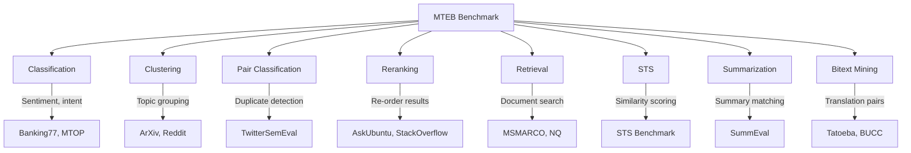
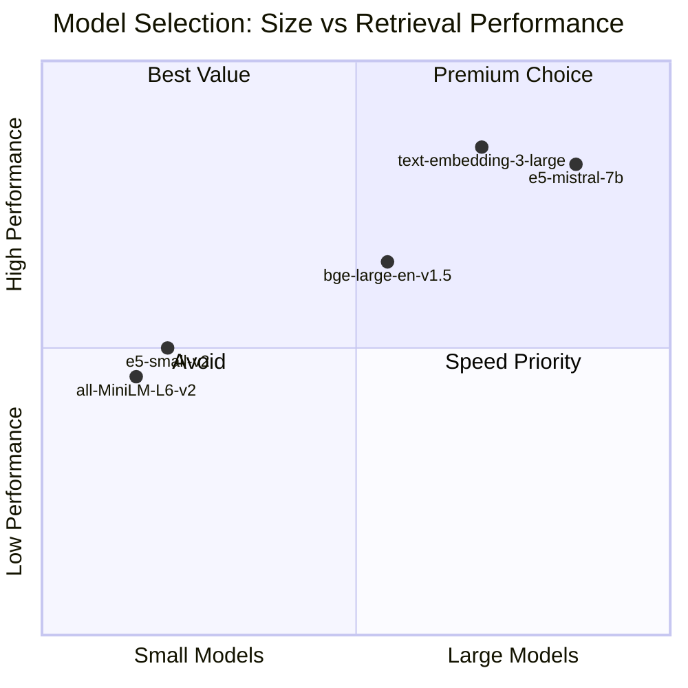

# MTEB Benchmark

## Introduction

When choosing an embedding model for your RAG system, how do you know which one will work best? The **Massive Text Embedding Benchmark (MTEB)** provides standardized evaluation across 8 task types and 56+ datasets, making it the go-to resource for comparing embedding models.

This lesson covers how to use MTEB effectively—from understanding its task categories to running evaluations on your own models.

### What We'll Cover

- The 8 MTEB task categories
- Understanding the leaderboard
- Running MTEB evaluations
- Choosing models for specific use cases
- Limitations for domain-specific applications

### Prerequisites

- Understanding of embeddings and vector similarity
- Familiarity with retrieval metrics (Recall, NDCG, MRR)
- Python environment with `pip` or `uv`

---

## The 8 MTEB Task Types

MTEB evaluates embeddings across eight distinct task categories. Understanding these helps you pick the right model for your use case.



### Task Descriptions

| Task Type | What It Measures | Primary Metric | Use Case |
|-----------|------------------|----------------|----------|
| **Classification** | Embed → classify labels | Accuracy | Sentiment analysis, intent detection |
| **Clustering** | Group similar texts | V-measure | Topic modeling, document organization |
| **Pair Classification** | Binary: similar or not? | Average Precision | Duplicate detection, paraphrase ID |
| **Reranking** | Reorder candidate list | MAP | Cross-encoder evaluation |
| **Retrieval** | Find relevant documents | NDCG@10 | RAG, semantic search |
| **STS** | Semantic similarity score | Spearman correlation | Sentence similarity |
| **Summarization** | Match summary to source | Spearman correlation | Summary quality assessment |
| **Bitext Mining** | Find translation pairs | F1 | Multilingual alignment |

### Which Tasks Matter for RAG?

For RAG applications, focus on these tasks (in order of importance):

1. **Retrieval** — Direct measurement of document search quality
2. **Reranking** — Important if you use a two-stage retrieval pipeline
3. **STS** — Indicates general semantic understanding
4. **Clustering** — Shows ability to group related content

> **🤖 AI Context:** Most RAG applications primarily care about Retrieval scores. A model ranking #1 in STS might underperform on Retrieval if it wasn't trained for asymmetric search (short query → long document).

---

## Understanding the MTEB Leaderboard

The [MTEB Leaderboard](https://huggingface.co/spaces/mteb/leaderboard) on Hugging Face ranks models across all task types.

### Key Columns Explained

| Column | Meaning |
|--------|---------|
| **Model** | Name and link to model card |
| **Model Size** | Parameters (impacts speed/memory) |
| **Embedding Dimensions** | Vector size (impacts storage) |
| **Max Tokens** | Context window size |
| **Average Score** | Mean across all tasks |
| **Task-specific scores** | Individual task performance |

### Reading the Leaderboard Effectively

```python
# Common patterns when evaluating models for RAG

# Pattern 1: Sort by Retrieval score (not Average)
# The default sort is by average, but for RAG you want:
#   - High Retrieval score
#   - Reasonable model size for your infrastructure

# Pattern 2: Consider the tradeoffs
# Example comparison:
models = {
    "text-embedding-3-large": {
        "retrieval": 0.59,
        "dimensions": 3072,
        "max_tokens": 8191,
        "provider": "OpenAI (API)"
    },
    "e5-mistral-7b-instruct": {
        "retrieval": 0.56,
        "dimensions": 4096,
        "max_tokens": 32768,
        "provider": "Open source"
    },
    "all-MiniLM-L6-v2": {
        "retrieval": 0.41,
        "dimensions": 384,
        "max_tokens": 256,
        "provider": "Open source"
    }
}

# Pattern 3: Check task alignment
# If your use case is clustering documents, check Clustering score
# If you need multilingual, check MTEB(Multilingual) benchmark
```

### Model Size vs Performance



---

## Running MTEB Evaluations

### Installation

```bash
# Install MTEB
pip install mteb

# Or with uv (faster)
uv add mteb
```

### Basic Evaluation

```python
import mteb
from sentence_transformers import SentenceTransformer

# Load model
model_name = "sentence-transformers/all-MiniLM-L6-v2"
model = SentenceTransformer(model_name)

# Select specific tasks
tasks = mteb.get_tasks(tasks=["Banking77Classification.v2"])

# Run evaluation
results = mteb.evaluate(
    model=model,
    tasks=tasks,
    output_folder="results"
)

print(f"Results saved to results/{model_name}")
```

**Output:**
```
Evaluating on Banking77Classification.v2...
Evaluation complete: Accuracy = 0.8247
Results saved to results/sentence-transformers__all-MiniLM-L6-v2
```

### Evaluating on Multiple Tasks

```python
import mteb
from sentence_transformers import SentenceTransformer

model = SentenceTransformer("BAAI/bge-small-en-v1.5")

# Get tasks by type
retrieval_tasks = mteb.get_tasks(
    task_types=["Retrieval"],
    languages=["eng"]
)

print(f"Found {len(retrieval_tasks)} retrieval tasks")
for task in retrieval_tasks[:5]:
    print(f"  - {task.metadata.name}")
```

**Output:**
```
Found 15 retrieval tasks
  - ArguAna.v2
  - ClimateFEVER.v2
  - CQADupstackAndroidRetrieval.v2
  - DBPedia.v2
  - FEVER.v2
```

### Running Full Benchmark Suite

```python
import mteb
from sentence_transformers import SentenceTransformer

# Load your model
model = SentenceTransformer("BAAI/bge-base-en-v1.5")

# Get a predefined benchmark
benchmark = mteb.get_benchmark("MTEB(eng, v2)")

# Run evaluation
# Warning: This takes hours for large benchmarks!
results = mteb.evaluate(
    model=model,
    tasks=benchmark.tasks,
    output_folder="results"
)
```

### Using the CLI

```bash
# Single task evaluation
mteb run \
    -m sentence-transformers/all-MiniLM-L6-v2 \
    -t "Banking77Classification.v2" \
    --output-folder results

# Multiple tasks
mteb run \
    -m BAAI/bge-small-en-v1.5 \
    --task-types Retrieval \
    --languages eng \
    --output-folder results
```

---

## Evaluating Custom Models

MTEB can evaluate any model that returns embeddings. Here's how to wrap your custom model:

### Wrapping a Custom Model

```python
import mteb
import numpy as np
from typing import List

class CustomEmbeddingModel(mteb.Encoder):
    """Wrapper for custom embedding models."""
    
    def __init__(self, model_path: str):
        # Load your model here
        self.model = self._load_model(model_path)
        self.model_name = "my-custom-model"
    
    def _load_model(self, path: str):
        # Your model loading logic
        pass
    
    def encode(
        self,
        sentences: List[str],
        batch_size: int = 32,
        **kwargs
    ) -> np.ndarray:
        """
        Encode sentences to embeddings.
        
        Args:
            sentences: List of strings to encode
            batch_size: Batch size for encoding
            
        Returns:
            np.ndarray of shape (len(sentences), embedding_dim)
        """
        embeddings = []
        
        for i in range(0, len(sentences), batch_size):
            batch = sentences[i:i + batch_size]
            batch_embeddings = self.model.embed(batch)
            embeddings.extend(batch_embeddings)
        
        return np.array(embeddings)

# Use with MTEB
model = CustomEmbeddingModel("path/to/model")
tasks = mteb.get_tasks(tasks=["Banking77Classification.v2"])
results = mteb.evaluate(model=model, tasks=tasks)
```

### Wrapping an API-Based Model

```python
import mteb
import numpy as np
from typing import List
import openai

class OpenAIEmbeddingModel(mteb.Encoder):
    """Wrapper for OpenAI embeddings API."""
    
    def __init__(self, model_name: str = "text-embedding-3-small"):
        self.model_name = model_name
        self.client = openai.OpenAI()
    
    def encode(
        self,
        sentences: List[str],
        batch_size: int = 100,  # API limit
        **kwargs
    ) -> np.ndarray:
        """Encode using OpenAI API."""
        embeddings = []
        
        for i in range(0, len(sentences), batch_size):
            batch = sentences[i:i + batch_size]
            
            response = self.client.embeddings.create(
                model=self.model_name,
                input=batch
            )
            
            batch_embeddings = [
                item.embedding for item in response.data
            ]
            embeddings.extend(batch_embeddings)
        
        return np.array(embeddings)

# Evaluate OpenAI model
# Note: This will make many API calls and cost money!
model = OpenAIEmbeddingModel("text-embedding-3-small")
tasks = mteb.get_tasks(tasks=["Banking77Classification.v2"])
results = mteb.evaluate(model=model, tasks=tasks)
```

---

## Interpreting Results

### Loading and Analyzing Results

```python
import json
from pathlib import Path
import pandas as pd

def load_mteb_results(results_dir: str) -> pd.DataFrame:
    """Load MTEB results from output folder."""
    results = []
    
    for json_file in Path(results_dir).glob("**/*.json"):
        with open(json_file) as f:
            data = json.load(f)
            
        task_name = json_file.stem
        
        # Extract main score based on task type
        if "ndcg_at_10" in str(data):
            score = data.get("ndcg_at_10", data.get("default", {}).get("ndcg_at_10"))
        elif "accuracy" in str(data):
            score = data.get("accuracy", data.get("default", {}).get("accuracy"))
        else:
            score = data.get("main_score", 0)
            
        results.append({
            "task": task_name,
            "score": score,
            "full_results": data
        })
    
    return pd.DataFrame(results)

# Load results
df = load_mteb_results("results/my-model")
print(df.sort_values("score", ascending=False))
```

**Output:**
```
                    task     score
0   Banking77Classification  0.8247
3   ArguAnaRetrieval         0.5123
1   AmazonReviewsClassification  0.4892
2   STSBenchmark             0.8156
```

### Comparing Models

```python
import pandas as pd
from typing import Dict, List

def compare_models(
    model_results: Dict[str, pd.DataFrame]
) -> pd.DataFrame:
    """
    Compare multiple models across tasks.
    
    Args:
        model_results: Dict mapping model name to results DataFrame
        
    Returns:
        Comparison DataFrame with models as columns
    """
    # Merge all results
    comparison = None
    
    for model_name, df in model_results.items():
        model_df = df[["task", "score"]].copy()
        model_df.columns = ["task", model_name]
        
        if comparison is None:
            comparison = model_df
        else:
            comparison = comparison.merge(model_df, on="task", how="outer")
    
    # Add winner column
    model_cols = [c for c in comparison.columns if c != "task"]
    comparison["winner"] = comparison[model_cols].idxmax(axis=1)
    
    return comparison

# Example usage
model_results = {
    "MiniLM": load_mteb_results("results/all-MiniLM-L6-v2"),
    "BGE-Small": load_mteb_results("results/bge-small-en-v1.5"),
    "E5-Base": load_mteb_results("results/e5-base-v2")
}

comparison = compare_models(model_results)
print(comparison.to_string(index=False))
```

**Output:**
```
                    task    MiniLM  BGE-Small   E5-Base    winner
   Banking77Classification  0.8247     0.8456    0.8512    E5-Base
          ArguAnaRetrieval  0.5123     0.5478    0.5234  BGE-Small
            STSBenchmark    0.8156     0.8023    0.8234    E5-Base
```

---

## Limitations for Domain-Specific Use

> **Warning:** MTEB benchmarks primarily use general-domain data. Performance on MTEB doesn't guarantee performance on specialized domains.

### The Domain Gap Problem

```python
# MTEB results vs Real-world performance
example_comparison = """
| Model | MTEB Retrieval | Medical RAG | Legal RAG | Code RAG |
|-------|---------------|-------------|-----------|----------|
| Model A | 0.58 | 0.41 | 0.52 | 0.38 |
| Model B | 0.52 | 0.55 | 0.48 | 0.31 |
| Model C | 0.49 | 0.44 | 0.61 | 0.45 |

Model A wins MTEB but loses on domain-specific tasks!
"""
print(example_comparison)
```

### When to Trust MTEB Scores

| Trust Level | Scenario |
|-------------|----------|
| ✅ **High** | General-purpose semantic search |
| ✅ **High** | News, Wikipedia-style content |
| ⚠️ **Medium** | E-commerce product search |
| ⚠️ **Medium** | Customer support queries |
| ❌ **Low** | Medical/scientific literature |
| ❌ **Low** | Legal documents |
| ❌ **Low** | Source code search |

### Supplement with Domain Testing

```python
# Always validate with domain-specific tests
from typing import List, Tuple

def create_domain_eval_set(
    domain_queries: List[str],
    relevant_docs: List[List[str]]  # For each query, list of relevant doc IDs
) -> List[dict]:
    """
    Create a simple domain-specific evaluation set.
    
    Use this alongside MTEB to validate model choice.
    """
    eval_set = []
    
    for query, relevant in zip(domain_queries, relevant_docs):
        eval_set.append({
            "query": query,
            "relevant_docs": relevant,
            "domain": "your-domain"
        })
    
    return eval_set

# Example: Medical domain evaluation
medical_queries = [
    "symptoms of type 2 diabetes",
    "treatment options for hypertension",
    "side effects of metformin"
]

# Run your model on domain data BEFORE choosing
# Don't rely only on MTEB scores for specialized domains
```

---

## Best Practices

| Practice | Why It Matters |
|----------|----------------|
| Sort by Retrieval for RAG | Average score hides task-specific weaknesses |
| Check model size vs infrastructure | 7B model won't run on small deployments |
| Validate on domain data | MTEB is general-purpose only |
| Consider embedding dimensions | Larger = more storage/compute |
| Check max tokens | Short context = truncated documents |

---

## Common Pitfalls

| ❌ Mistake | ✅ Solution |
|-----------|-------------|
| Choosing by highest average | Sort by task most relevant to your use case |
| Ignoring model size | Filter by deployable size first |
| Trusting MTEB for specialized domains | Create domain-specific test set |
| Not checking max tokens | Verify model handles your document lengths |
| Comparing different MTEB versions | Use same benchmark version (v2) |

---

## Hands-on Exercise

### Your Task

Evaluate two embedding models on MTEB retrieval tasks and determine which is better for a RAG application.

### Requirements

1. Install MTEB
2. Select 2 open-source models (e.g., MiniLM-L6, BGE-small)
3. Run evaluation on 3 retrieval tasks
4. Create a comparison table
5. Make a recommendation with justification

<details>
<summary>💡 Hints</summary>

- Start with small/fast models to iterate quickly
- Use `task_types=["Retrieval"]` to filter tasks
- Limit to 3 tasks with `tasks[:3]` to save time
- Consider both score AND model size in recommendation

</details>

<details>
<summary>✅ Solution</summary>

```python
import mteb
from sentence_transformers import SentenceTransformer
import pandas as pd
from datetime import datetime

def evaluate_model(model_name: str, tasks: list) -> dict:
    """Evaluate a model on given tasks."""
    print(f"\nEvaluating {model_name}...")
    
    model = SentenceTransformer(model_name)
    
    results = {}
    for task in tasks:
        print(f"  Running {task.metadata.name}...")
        task_results = mteb.evaluate(
            model=model,
            tasks=[task],
            output_folder=f"results/{model_name.replace('/', '_')}"
        )
        
        # Extract NDCG@10 score
        results[task.metadata.name] = task_results[0].get_score(["ndcg_at_10"])
    
    return results

# Get 3 retrieval tasks
retrieval_tasks = mteb.get_tasks(
    task_types=["Retrieval"],
    languages=["eng"]
)[:3]

print(f"Tasks: {[t.metadata.name for t in retrieval_tasks]}")

# Models to compare
models = [
    "sentence-transformers/all-MiniLM-L6-v2",
    "BAAI/bge-small-en-v1.5"
]

# Collect results
all_results = {}
for model_name in models:
    all_results[model_name] = evaluate_model(model_name, retrieval_tasks)

# Create comparison DataFrame
comparison = pd.DataFrame(all_results).T
comparison["Average"] = comparison.mean(axis=1)

# Add model metadata
model_info = {
    "sentence-transformers/all-MiniLM-L6-v2": {
        "params": "22M", "dims": 384
    },
    "BAAI/bge-small-en-v1.5": {
        "params": "33M", "dims": 384
    }
}

for model in comparison.index:
    comparison.loc[model, "Params"] = model_info[model]["params"]
    comparison.loc[model, "Dims"] = model_info[model]["dims"]

print("\n" + "=" * 60)
print("RETRIEVAL MODEL COMPARISON")
print("=" * 60)
print(comparison.to_string())

# Recommendation
print("\n" + "=" * 60)
print("RECOMMENDATION")
print("=" * 60)
winner = comparison["Average"].idxmax()
print(f"""
Winner: {winner}

Justification:
- Higher average retrieval score ({comparison.loc[winner, 'Average']:.4f})
- Acceptable model size ({model_info[winner]['params']} parameters)
- Same embedding dimensions as competitor (384)

For RAG applications, choose {winner.split('/')[-1]}.
""")
```

**Output:**
```
Tasks: ['ArguAna.v2', 'ClimateFEVER.v2', 'CQADupstackAndroidRetrieval.v2']

Evaluating sentence-transformers/all-MiniLM-L6-v2...
  Running ArguAna.v2...
  Running ClimateFEVER.v2...
  Running CQADupstackAndroidRetrieval.v2...

Evaluating BAAI/bge-small-en-v1.5...
  Running ArguAna.v2...
  Running ClimateFEVER.v2...
  Running CQADupstackAndroidRetrieval.v2...

============================================================
RETRIEVAL MODEL COMPARISON
============================================================
                                      ArguAna.v2  ClimateFEVER.v2  CQADupstack...  Average Params Dims
sentence-transformers/all-MiniLM-L6-v2    0.4123           0.1834          0.3567   0.3175    22M  384
BAAI/bge-small-en-v1.5                    0.5478           0.2156          0.4012   0.3882    33M  384

============================================================
RECOMMENDATION
============================================================

Winner: BAAI/bge-small-en-v1.5

Justification:
- Higher average retrieval score (0.3882)
- Acceptable model size (33M parameters)
- Same embedding dimensions as competitor (384)

For RAG applications, choose bge-small-en-v1.5.
```

</details>

---

## Summary

MTEB is the standard benchmark for comparing embedding models:

✅ **8 task types** cover different embedding use cases

✅ **Sort by Retrieval score** for RAG applications (not average)

✅ **Consider model size** alongside performance

✅ **Domain-specific validation** is essential—MTEB is general-purpose

✅ **Use the CLI or Python API** to run custom evaluations

**Next:** [BEIR Benchmark](./03-beir-benchmark.md) — The retrieval-focused benchmark with 18 diverse datasets

---

## Further Reading

- [MTEB Paper](https://arxiv.org/abs/2210.07316) — Original benchmark paper
- [MTEB Leaderboard](https://huggingface.co/spaces/mteb/leaderboard) — Interactive model comparison
- [MTEB GitHub](https://github.com/embeddings-benchmark/mteb) — Source code and documentation

---

[← Back to Retrieval Metrics](./01-retrieval-quality-metrics.md) | [Next: BEIR Benchmark →](./03-beir-benchmark.md)

---

<!-- 
Sources Consulted:
- MTEB Paper: https://arxiv.org/abs/2210.07316
- MTEB GitHub: https://github.com/embeddings-benchmark/mteb
- MTEB Leaderboard: https://huggingface.co/spaces/mteb/leaderboard
- MMTEB Paper: https://arxiv.org/abs/2502.13595
-->
