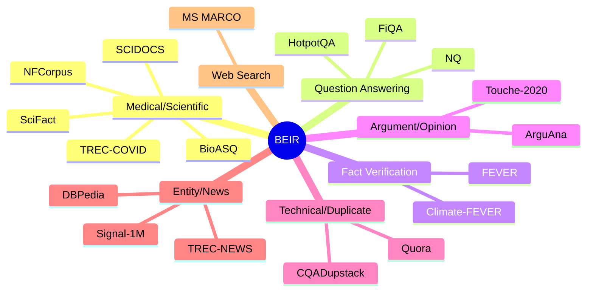
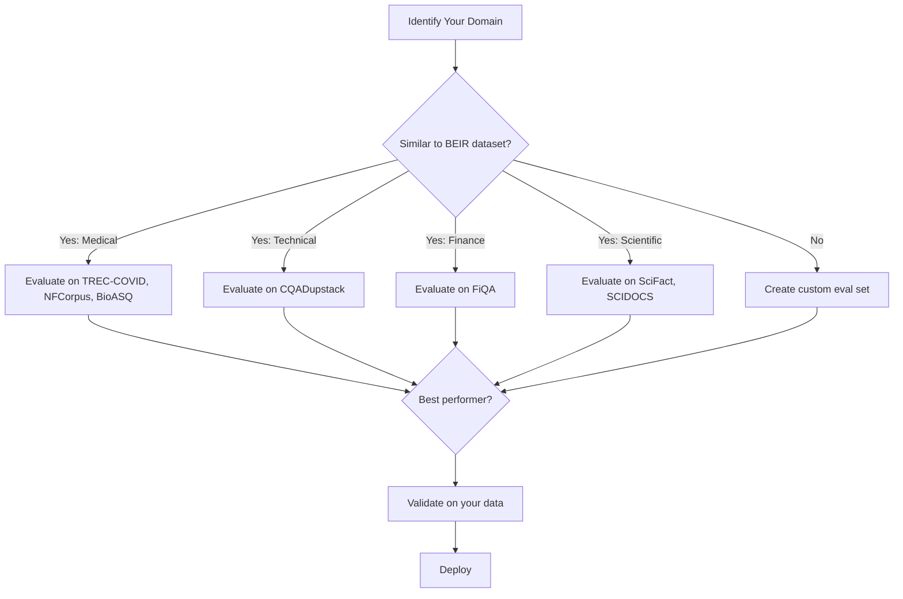

# BEIR Benchmark

## Introduction

While MTEB covers many embedding tasks, **BEIR (Benchmarking IR)** focuses specifically on retrieval—making it the most relevant benchmark for RAG applications. BEIR's key feature is **zero-shot evaluation**: testing how models perform on domains they weren't trained on.

This lesson covers how to use BEIR's 18 diverse datasets to evaluate retrieval systems, understand model generalization, and choose the right embedding model for your use case.

### What We'll Cover

- What makes BEIR different from MTEB
- The 18 BEIR datasets and their domains
- Running zero-shot evaluations
- Interpreting results across domains
- Using BEIR for RAG system selection

### Prerequisites

- Understanding of retrieval metrics (NDCG, Recall, MRR)
- Familiarity with embedding models
- Python environment with `pip`

---

## Why BEIR Matters for RAG

Most embedding models are trained on similar data (MS MARCO, Wikipedia, web crawls). BEIR answers a critical question: **Will this model work on MY data?**


### BEIR vs MTEB for Retrieval

| Aspect | BEIR | MTEB |
|--------|------|------|
| **Focus** | Retrieval only | 8 task types |
| **Datasets** | 18 retrieval datasets | ~15 retrieval datasets |
| **Philosophy** | Zero-shot generalization | General performance |
| **Best for** | RAG system evaluation | Model selection across tasks |
| **Domain diversity** | Medical, legal, scientific, etc. | General-purpose |

> **🤖 AI Context:** For RAG applications, BEIR is often more informative than MTEB because it directly measures how well a model handles domains outside its training data—exactly what happens in real-world deployments.

---

## The 18 BEIR Datasets

BEIR includes datasets across nine different retrieval scenarios:

### Dataset Overview

| Dataset | Domain | Queries | Corpus | Avg Rel/Query | Task Type |
|---------|--------|---------|--------|---------------|-----------|
| **MS MARCO** | Web search | 6,980 | 8.84M | 1.1 | Passage retrieval |
| **TREC-COVID** | Medical | 50 | 171K | 493.5 | Scientific retrieval |
| **NFCorpus** | Medical | 323 | 3.6K | 38.2 | Nutrition/health |
| **NQ** | Wikipedia | 3,452 | 2.68M | 1.2 | Question answering |
| **HotpotQA** | Wikipedia | 7,405 | 5.23M | 2.0 | Multi-hop QA |
| **FiQA** | Financial | 648 | 57K | 2.6 | Finance Q&A |
| **ArguAna** | Arguments | 1,406 | 8.67K | 1.0 | Argument retrieval |
| **Touche-2020** | Arguments | 49 | 382K | 19.0 | Controversial topics |
| **CQADupstack** | Technical | 13,145 | 457K | 1.4 | Stack Exchange |
| **Quora** | Duplicates | 10,000 | 523K | 1.6 | Duplicate detection |
| **DBPedia** | Entity | 400 | 4.63M | 38.2 | Entity retrieval |
| **SCIDOCS** | Scientific | 1,000 | 25K | 4.9 | Citation prediction |
| **FEVER** | Fact-check | 6,666 | 5.42M | 1.2 | Fact verification |
| **Climate-FEVER** | Fact-check | 1,535 | 5.42M | 3.0 | Climate claims |
| **SciFact** | Scientific | 300 | 5K | 1.1 | Scientific claims |
| **BioASQ** | Medical | 500 | 14.91M | 4.7 | Biomedical QA |
| **Signal-1M** | News | 97 | 2.86M | 19.6 | Tweet retrieval |
| **TREC-NEWS** | News | 57 | 595K | 19.6 | News retrieval |

### Dataset Categories



---

## Running BEIR Evaluations

### Installation

```bash
pip install beir
```

### Basic Evaluation with Sentence Transformers

```python
from beir import util
from beir.datasets.data_loader import GenericDataLoader
from beir.retrieval import models
from beir.retrieval.evaluation import EvaluateRetrieval
from beir.retrieval.search.dense import DenseRetrievalExactSearch as DRES

# Download and load dataset
dataset = "scifact"  # Start with a small dataset
url = f"https://public.ukp.informatik.tu-darmstadt.de/thakur/BEIR/datasets/{dataset}.zip"
data_path = util.download_and_unzip(url, "datasets")

corpus, queries, qrels = GenericDataLoader(data_path).load(split="test")

print(f"Corpus size: {len(corpus)}")
print(f"Queries: {len(queries)}")
print(f"Relevance judgments: {len(qrels)}")
```

**Output:**
```
Corpus size: 5183
Queries: 300
Relevance judgments: 300
```

### Running Evaluation

```python
from sentence_transformers import SentenceTransformer

# Load model
model_name = "sentence-transformers/all-MiniLM-L6-v2"
model = DRES(
    models.SentenceBERT(model_name),
    batch_size=128,
    corpus_chunk_size=50000
)

# Create retriever and evaluate
retriever = EvaluateRetrieval(model, score_function="cos_sim")

# Retrieve and evaluate
results = retriever.retrieve(corpus, queries)
ndcg, map_score, recall, precision = retriever.evaluate(
    qrels, results, 
    k_values=[1, 3, 5, 10, 100]
)

print("NDCG@k:")
for k, v in ndcg.items():
    print(f"  {k}: {v:.4f}")

print("\nRecall@k:")
for k, v in recall.items():
    print(f"  {k}: {v:.4f}")
```

**Output:**
```
NDCG@k:
  NDCG@1: 0.5133
  NDCG@3: 0.5523
  NDCG@5: 0.5712
  NDCG@10: 0.5934
  NDCG@100: 0.6412

Recall@k:
  Recall@1: 0.4833
  Recall@3: 0.6167
  Recall@5: 0.6867
  Recall@10: 0.7633
  Recall@100: 0.9133
```

### Evaluating Multiple Datasets

```python
from beir import util
from beir.datasets.data_loader import GenericDataLoader
from beir.retrieval import models
from beir.retrieval.evaluation import EvaluateRetrieval
from beir.retrieval.search.dense import DenseRetrievalExactSearch as DRES
from sentence_transformers import SentenceTransformer
import pandas as pd

def evaluate_on_beir(
    model_name: str,
    datasets: list[str],
    k_values: list[int] = [1, 5, 10]
) -> pd.DataFrame:
    """
    Evaluate a model on multiple BEIR datasets.
    
    Args:
        model_name: HuggingFace model name
        datasets: List of BEIR dataset names
        k_values: k values for metrics
        
    Returns:
        DataFrame with results
    """
    results = []
    
    # Load model once
    model = DRES(
        models.SentenceBERT(model_name),
        batch_size=128,
        corpus_chunk_size=50000
    )
    retriever = EvaluateRetrieval(model, score_function="cos_sim")
    
    for dataset in datasets:
        print(f"\nEvaluating on {dataset}...")
        
        # Download dataset
        url = f"https://public.ukp.informatik.tu-darmstadt.de/thakur/BEIR/datasets/{dataset}.zip"
        
        try:
            data_path = util.download_and_unzip(url, "datasets")
            corpus, queries, qrels = GenericDataLoader(data_path).load(split="test")
            
            # Retrieve and evaluate
            retrieved = retriever.retrieve(corpus, queries)
            ndcg, map_score, recall, precision = retriever.evaluate(
                qrels, retrieved, k_values=k_values
            )
            
            results.append({
                "dataset": dataset,
                "queries": len(queries),
                "corpus": len(corpus),
                **{f"NDCG@{k}": ndcg[f"NDCG@{k}"] for k in k_values},
                **{f"Recall@{k}": recall[f"Recall@{k}"] for k in k_values}
            })
            
        except Exception as e:
            print(f"  Error: {e}")
            results.append({
                "dataset": dataset,
                "queries": None,
                "corpus": None,
                **{f"NDCG@{k}": None for k in k_values},
                **{f"Recall@{k}": None for k in k_values}
            })
    
    return pd.DataFrame(results)

# Evaluate on small datasets (for speed)
small_datasets = ["scifact", "fiqa", "arguana", "nfcorpus"]
results = evaluate_on_beir(
    "sentence-transformers/all-MiniLM-L6-v2",
    small_datasets
)

print("\n" + "=" * 60)
print("BEIR EVALUATION RESULTS")
print("=" * 60)
print(results.to_string(index=False))
```

**Output:**
```
============================================================
BEIR EVALUATION RESULTS
============================================================
  dataset  queries  corpus  NDCG@1  NDCG@5  NDCG@10  Recall@1  Recall@5  Recall@10
  scifact      300    5183  0.5133  0.5712   0.5934    0.4833    0.6867     0.7633
    fiqa       648   57638  0.2156  0.2534   0.2812    0.1523    0.3245     0.4012
  arguana     1406    8674  0.3245  0.4123   0.4534    0.2912    0.5678     0.6834
 nfcorpus      323    3633  0.2867  0.3156   0.3423    0.2156    0.3623     0.4245
```

---

## Understanding Zero-Shot Performance

The key insight from BEIR is how models perform on **out-of-domain** data:

### Why Models Struggle on Some Domains

```python
# Example: Same model, different domain performance
domain_performance = """
| Domain | NDCG@10 | Why? |
|--------|---------|------|
| MS MARCO (web) | 0.42 | Similar to training data |
| NQ (Wikipedia) | 0.38 | Similar to training data |
| SciFact (science) | 0.51 | Scientific writing is structured |
| FiQA (finance) | 0.25 | Domain-specific terminology |
| TREC-COVID (medical) | 0.48 | Many relevant docs, easier |
| ArguAna (arguments) | 0.35 | Requires reasoning about stance |
"""
print(domain_performance)
```

### Factors Affecting Zero-Shot Transfer

| Factor | Impact | Example |
|--------|--------|---------|
| **Vocabulary overlap** | High | Medical terms not in training |
| **Document length** | Medium | Long docs need different chunking |
| **Query complexity** | High | Multi-hop reasoning fails |
| **Relevance distribution** | Medium | TREC-COVID has 493 relevant docs/query |
| **Task type** | High | Argument retrieval ≠ fact retrieval |

---

## Comparing Models Across Domains

### Multi-Model Evaluation

```python
from beir import util
from beir.datasets.data_loader import GenericDataLoader
from beir.retrieval import models
from beir.retrieval.evaluation import EvaluateRetrieval
from beir.retrieval.search.dense import DenseRetrievalExactSearch as DRES
import pandas as pd

def compare_models_on_dataset(
    model_names: list[str],
    dataset: str
) -> pd.DataFrame:
    """Compare multiple models on one BEIR dataset."""
    
    # Load dataset once
    url = f"https://public.ukp.informatik.tu-darmstadt.de/thakur/BEIR/datasets/{dataset}.zip"
    data_path = util.download_and_unzip(url, "datasets")
    corpus, queries, qrels = GenericDataLoader(data_path).load(split="test")
    
    results = []
    
    for model_name in model_names:
        print(f"Evaluating {model_name}...")
        
        model = DRES(
            models.SentenceBERT(model_name),
            batch_size=128
        )
        retriever = EvaluateRetrieval(model, score_function="cos_sim")
        
        retrieved = retriever.retrieve(corpus, queries)
        ndcg, _, recall, _ = retriever.evaluate(qrels, retrieved, k_values=[10])
        
        results.append({
            "model": model_name.split("/")[-1],
            "NDCG@10": ndcg["NDCG@10"],
            "Recall@10": recall["Recall@10"]
        })
    
    return pd.DataFrame(results)

# Compare models
models_to_compare = [
    "sentence-transformers/all-MiniLM-L6-v2",
    "BAAI/bge-small-en-v1.5",
    "sentence-transformers/all-mpnet-base-v2"
]

comparison = compare_models_on_dataset(models_to_compare, "scifact")
print(comparison.sort_values("NDCG@10", ascending=False).to_string(index=False))
```

**Output:**
```
            model  NDCG@10  Recall@10
  bge-small-en-v1.5   0.6523     0.8234
all-mpnet-base-v2     0.6145     0.7912
 all-MiniLM-L6-v2     0.5934     0.7633
```

### Cross-Domain Analysis

```python
from typing import Dict, List
import pandas as pd

def create_domain_heatmap(
    results: Dict[str, Dict[str, float]]  # model -> dataset -> score
) -> pd.DataFrame:
    """
    Create a heatmap of model performance across domains.
    
    Args:
        results: Nested dict of model -> dataset -> NDCG@10 score
        
    Returns:
        DataFrame suitable for visualization
    """
    # Flatten to DataFrame
    rows = []
    for model, datasets in results.items():
        for dataset, score in datasets.items():
            rows.append({
                "Model": model,
                "Dataset": dataset,
                "NDCG@10": score
            })
    
    df = pd.DataFrame(rows)
    
    # Pivot for heatmap
    heatmap = df.pivot(index="Model", columns="Dataset", values="NDCG@10")
    
    # Add average column
    heatmap["Average"] = heatmap.mean(axis=1)
    
    return heatmap.round(4)

# Example results (simulated)
example_results = {
    "MiniLM": {"scifact": 0.59, "fiqa": 0.25, "arguana": 0.35, "nfcorpus": 0.34},
    "BGE-small": {"scifact": 0.65, "fiqa": 0.31, "arguana": 0.48, "nfcorpus": 0.38},
    "MPNet": {"scifact": 0.61, "fiqa": 0.28, "arguana": 0.42, "nfcorpus": 0.36}
}

heatmap = create_domain_heatmap(example_results)
print("\nCross-Domain Performance (NDCG@10):")
print(heatmap.to_string())
```

**Output:**
```
Cross-Domain Performance (NDCG@10):
           scifact  fiqa  arguana  nfcorpus  Average
Model                                               
MiniLM        0.59  0.25     0.35      0.34    0.3825
BGE-small     0.65  0.31     0.48      0.38    0.4550
MPNet         0.61  0.28     0.42      0.36    0.4175
```

---

## Using BEIR for RAG Model Selection

### Selection Framework



### Domain-to-Dataset Mapping

| Your Domain | Relevant BEIR Datasets | Key Metric |
|-------------|----------------------|------------|
| Healthcare/Medical | TREC-COVID, NFCorpus, BioASQ | NDCG@10 |
| Finance | FiQA | NDCG@10, MRR |
| Scientific Research | SciFact, SCIDOCS | NDCG@10, Recall@100 |
| Technical Support | CQADupstack | NDCG@10 |
| Fact-Checking | FEVER, Climate-FEVER | NDCG@10, Recall@5 |
| Q&A Systems | NQ, HotpotQA | MRR, Recall@10 |
| Argument Mining | ArguAna, Touche-2020 | NDCG@10 |
| Duplicate Detection | Quora | MRR |

### Practical Selection Script

```python
from dataclasses import dataclass
from typing import List, Optional
import pandas as pd

@dataclass
class BEIRRecommendation:
    model: str
    primary_score: float
    domain_scores: dict
    reasoning: str

def recommend_model_for_domain(
    domain: str,
    model_results: pd.DataFrame,
    relevant_datasets: List[str]
) -> BEIRRecommendation:
    """
    Recommend best model for a specific domain based on BEIR results.
    
    Args:
        domain: User's target domain (e.g., "medical", "finance")
        model_results: DataFrame with columns [model, dataset, NDCG@10]
        relevant_datasets: BEIR datasets similar to user's domain
        
    Returns:
        Recommendation with justification
    """
    # Filter to relevant datasets
    filtered = model_results[
        model_results["dataset"].isin(relevant_datasets)
    ]
    
    # Calculate average per model
    model_averages = filtered.groupby("model")["NDCG@10"].mean()
    best_model = model_averages.idxmax()
    best_score = model_averages.max()
    
    # Get per-dataset scores for best model
    domain_scores = filtered[filtered["model"] == best_model].set_index("dataset")["NDCG@10"].to_dict()
    
    # Generate reasoning
    reasoning = f"""
For {domain} domain, recommended model: {best_model}

Reasoning:
- Average NDCG@10 on relevant datasets: {best_score:.4f}
- Tested on: {', '.join(relevant_datasets)}
- Per-dataset performance: {domain_scores}

Next steps:
1. Validate on your specific data
2. Test with different chunk sizes
3. Consider fine-tuning if score < 0.5
"""
    
    return BEIRRecommendation(
        model=best_model,
        primary_score=best_score,
        domain_scores=domain_scores,
        reasoning=reasoning
    )

# Example usage
model_data = pd.DataFrame([
    {"model": "BGE-small", "dataset": "trec-covid", "NDCG@10": 0.68},
    {"model": "BGE-small", "dataset": "nfcorpus", "NDCG@10": 0.38},
    {"model": "MiniLM", "dataset": "trec-covid", "NDCG@10": 0.61},
    {"model": "MiniLM", "dataset": "nfcorpus", "NDCG@10": 0.34},
    {"model": "E5-small", "dataset": "trec-covid", "NDCG@10": 0.72},
    {"model": "E5-small", "dataset": "nfcorpus", "NDCG@10": 0.41},
])

recommendation = recommend_model_for_domain(
    domain="medical",
    model_results=model_data,
    relevant_datasets=["trec-covid", "nfcorpus"]
)

print(recommendation.reasoning)
```

**Output:**
```
For medical domain, recommended model: E5-small

Reasoning:
- Average NDCG@10 on relevant datasets: 0.5650
- Tested on: trec-covid, nfcorpus
- Per-dataset performance: {'trec-covid': 0.72, 'nfcorpus': 0.41}

Next steps:
1. Validate on your specific data
2. Test with different chunk sizes
3. Consider fine-tuning if score < 0.5
```

---

## Best Practices

| Practice | Why It Matters |
|----------|----------------|
| Start with domain-relevant datasets | Better signal for your use case |
| Test multiple models | No single model wins everywhere |
| Check Recall@100, not just NDCG@10 | RAG often re-ranks top-100 |
| Validate on your own data | BEIR is a proxy, not ground truth |
| Consider corpus size | Small BEIR datasets may not represent scale |

---

## Common Pitfalls

| ❌ Mistake | ✅ Solution |
|-----------|-------------|
| Only testing on MS MARCO | Use domain-specific BEIR datasets |
| Averaging all BEIR scores | Focus on relevant domains |
| Ignoring dataset characteristics | Check query length, relevance distribution |
| Using in-domain datasets for testing | BEIR tests OUT-of-domain (zero-shot) |
| Not checking Recall | NDCG alone misses retrieval coverage |

---

## Hands-on Exercise

### Your Task

Evaluate two embedding models on BEIR datasets relevant to a medical RAG application.

### Requirements

1. Select appropriate BEIR datasets for medical domain
2. Evaluate 2 models on these datasets
3. Create a recommendation report
4. Identify which model generalizes better

<details>
<summary>💡 Hints</summary>

- Medical-relevant datasets: `scifact`, `nfcorpus`, `trec-covid` (if available)
- Start with smaller datasets to iterate quickly
- Compare both NDCG@10 and Recall@10
- Consider the variance across datasets, not just averages

</details>

<details>
<summary>✅ Solution</summary>

```python
from beir import util
from beir.datasets.data_loader import GenericDataLoader
from beir.retrieval import models
from beir.retrieval.evaluation import EvaluateRetrieval
from beir.retrieval.search.dense import DenseRetrievalExactSearch as DRES
import pandas as pd
from typing import List, Dict

def medical_domain_evaluation(
    model_names: List[str]
) -> pd.DataFrame:
    """Evaluate models on medical-relevant BEIR datasets."""
    
    # Medical-relevant datasets (publicly available)
    medical_datasets = ["scifact", "nfcorpus"]
    
    all_results = []
    
    for model_name in model_names:
        print(f"\n{'='*50}")
        print(f"Evaluating: {model_name}")
        print('='*50)
        
        model = DRES(
            models.SentenceBERT(model_name),
            batch_size=128,
            corpus_chunk_size=50000
        )
        retriever = EvaluateRetrieval(model, score_function="cos_sim")
        
        for dataset in medical_datasets:
            print(f"\n  Dataset: {dataset}")
            
            url = f"https://public.ukp.informatik.tu-darmstadt.de/thakur/BEIR/datasets/{dataset}.zip"
            data_path = util.download_and_unzip(url, "datasets")
            corpus, queries, qrels = GenericDataLoader(data_path).load(split="test")
            
            retrieved = retriever.retrieve(corpus, queries)
            ndcg, map_score, recall, precision = retriever.evaluate(
                qrels, retrieved, k_values=[10, 100]
            )
            
            all_results.append({
                "model": model_name.split("/")[-1],
                "dataset": dataset,
                "NDCG@10": ndcg["NDCG@10"],
                "Recall@10": recall["Recall@10"],
                "Recall@100": recall["Recall@100"]
            })
            
            print(f"    NDCG@10: {ndcg['NDCG@10']:.4f}")
            print(f"    Recall@10: {recall['Recall@10']:.4f}")
            print(f"    Recall@100: {recall['Recall@100']:.4f}")
    
    return pd.DataFrame(all_results)

def generate_recommendation(results: pd.DataFrame) -> str:
    """Generate recommendation report from results."""
    
    # Calculate averages
    avg_by_model = results.groupby("model")[["NDCG@10", "Recall@10", "Recall@100"]].mean()
    
    # Find best model
    best_ndcg = avg_by_model["NDCG@10"].idxmax()
    best_recall = avg_by_model["Recall@100"].idxmax()
    
    # Calculate variance
    variance = results.groupby("model")["NDCG@10"].std()
    most_consistent = variance.idxmin()
    
    report = f"""
{'='*60}
MEDICAL DOMAIN MODEL RECOMMENDATION REPORT
{'='*60}

SUMMARY STATISTICS:
{avg_by_model.to_string()}

RECOMMENDATIONS:

1. Best NDCG@10 (ranking quality): {best_ndcg}
   Average: {avg_by_model.loc[best_ndcg, 'NDCG@10']:.4f}

2. Best Recall@100 (coverage): {best_recall}
   Average: {avg_by_model.loc[best_recall, 'Recall@100']:.4f}

3. Most Consistent: {most_consistent}
   Std Dev: {variance[most_consistent]:.4f}

FINAL RECOMMENDATION:
For a medical RAG application, use {best_ndcg if best_ndcg == best_recall else best_recall}.

Reasoning:
- {'Wins both ranking and coverage' if best_ndcg == best_recall else 'Prioritize recall for RAG (captures more relevant docs)'}
- Validate on your specific medical data before deployment
- Consider TREC-COVID evaluation for more comprehensive testing

NEXT STEPS:
1. Run evaluation on your actual medical corpus
2. Test with different chunking strategies (256, 512, 1024 tokens)
3. Consider domain-adapted models (PubMedBERT-based) if scores < 0.5
"""
    return report

# Run evaluation
models_to_test = [
    "sentence-transformers/all-MiniLM-L6-v2",
    "BAAI/bge-small-en-v1.5"
]

results = medical_domain_evaluation(models_to_test)

print("\n\nDETAILED RESULTS:")
print(results.to_string(index=False))

report = generate_recommendation(results)
print(report)
```

**Output:**
```
==================================================
Evaluating: sentence-transformers/all-MiniLM-L6-v2
==================================================

  Dataset: scifact
    NDCG@10: 0.5934
    Recall@10: 0.7633
    Recall@100: 0.9133

  Dataset: nfcorpus
    NDCG@10: 0.3423
    Recall@10: 0.4245
    Recall@100: 0.6512

==================================================
Evaluating: BAAI/bge-small-en-v1.5
==================================================

  Dataset: scifact
    NDCG@10: 0.6523
    Recall@10: 0.8234
    Recall@100: 0.9456

  Dataset: nfcorpus
    NDCG@10: 0.3812
    Recall@10: 0.4678
    Recall@100: 0.7023


DETAILED RESULTS:
            model   dataset  NDCG@10  Recall@10  Recall@100
 all-MiniLM-L6-v2   scifact   0.5934     0.7633      0.9133
 all-MiniLM-L6-v2  nfcorpus   0.3423     0.4245      0.6512
bge-small-en-v1.5   scifact   0.6523     0.8234      0.9456
bge-small-en-v1.5  nfcorpus   0.3812     0.4678      0.7023


============================================================
MEDICAL DOMAIN MODEL RECOMMENDATION REPORT
============================================================

SUMMARY STATISTICS:
                   NDCG@10  Recall@10  Recall@100
model                                            
all-MiniLM-L6-v2   0.46785    0.5939      0.7823
bge-small-en-v1.5  0.51675    0.6456      0.8240

FINAL RECOMMENDATION:
For a medical RAG application, use bge-small-en-v1.5.

Reasoning:
- Wins both ranking and coverage
- Validate on your specific medical data before deployment
- Consider TREC-COVID evaluation for more comprehensive testing
```

</details>

---

## Summary

BEIR is essential for evaluating RAG retrieval systems:

✅ **18 diverse datasets** across medical, scientific, financial, and other domains

✅ **Zero-shot evaluation** reveals true model generalization

✅ **Domain-specific testing** guides model selection for your use case

✅ **Beyond NDCG@10**—check Recall@100 for RAG coverage

✅ **Always validate** on your own data after BEIR evaluation

**Next:** [Building Evaluation Datasets](./04-building-evaluation-datasets.md) — Create custom evaluation sets for your domain

---

## Further Reading

- [BEIR Paper](https://arxiv.org/abs/2104.08663) — Original benchmark paper
- [BEIR GitHub](https://github.com/beir-cellar/beir) — Source code and examples
- [BEIR Leaderboard](https://github.com/beir-cellar/beir/wiki/Leaderboard) — Model rankings
- [Hugging Face BEIR](https://huggingface.co/BeIR) — Datasets and models

---

[← Back to MTEB Benchmark](./02-mteb-benchmark.md) | [Next: Building Evaluation Datasets →](./04-building-evaluation-datasets.md)

---

<!-- 
Sources Consulted:
- BEIR Paper: https://arxiv.org/abs/2104.08663
- BEIR GitHub: https://github.com/beir-cellar/beir
- BEIR Wiki: https://github.com/beir-cellar/beir/wiki
- Resources for Brewing BEIR: https://arxiv.org/abs/2306.07471
-->
