# Building Evaluation Datasets

## Introduction

Public benchmarks like MTEB and BEIR provide a starting point, but they can't tell you how well your system works on **your specific data**. Building domain-specific evaluation datasets is essential for meaningful measurement.

This lesson covers practical techniques for creating evaluation datasets—from manual annotation to LLM-powered synthetic generation. You'll learn to build test sets that actually reflect your production queries and documents.

### What We'll Cover

- Query-document relevance annotation
- LLM-based synthetic query generation
- Human annotation guidelines and quality control
- Handling multi-level relevance judgments
- Evaluation dataset maintenance and versioning

### Prerequisites

- Understanding of retrieval metrics
- Experience with embedding models
- Access to your domain corpus
- (Optional) OpenAI or Anthropic API access

---

## Why Build Custom Evaluation Datasets?


### Public Benchmarks vs Custom Evaluation

| Aspect | Public Benchmarks | Custom Evaluation |
|--------|-------------------|-------------------|
| Domain coverage | General | Your exact domain |
| Query distribution | Academic/crowdsourced | Real user queries |
| Relevance criteria | Generic | Your business rules |
| Edge cases | Unknown | From production logs |
| Update frequency | Static | You control |

---

## Evaluation Dataset Structure

A complete evaluation dataset needs three components:

### The Triplet Structure

```python
from dataclasses import dataclass, field
from typing import List, Dict, Optional
from datetime import datetime

@dataclass
class EvaluationQuery:
    """A single evaluation query with relevance judgments."""
    query_id: str
    query_text: str
    relevant_doc_ids: List[str]          # Binary relevance
    relevance_scores: Dict[str, int] = field(default_factory=dict)  # Graded relevance
    metadata: Dict = field(default_factory=dict)

@dataclass
class EvaluationCorpus:
    """The document corpus being searched."""
    documents: Dict[str, str]  # doc_id -> text
    metadata: Dict[str, Dict] = field(default_factory=dict)  # doc_id -> metadata

@dataclass
class EvaluationDataset:
    """Complete evaluation dataset."""
    name: str
    version: str
    created_at: datetime
    corpus: EvaluationCorpus
    queries: List[EvaluationQuery]
    description: str = ""
    
    def to_beir_format(self) -> tuple:
        """Convert to BEIR-compatible format."""
        corpus = {
            doc_id: {"text": text, "title": ""}
            for doc_id, text in self.corpus.documents.items()
        }
        
        queries = {
            q.query_id: q.query_text
            for q in self.queries
        }
        
        qrels = {
            q.query_id: {
                doc_id: q.relevance_scores.get(doc_id, 1)
                for doc_id in q.relevant_doc_ids
            }
            for q in self.queries
        }
        
        return corpus, queries, qrels
    
    def summary(self) -> str:
        """Generate dataset summary statistics."""
        total_judgments = sum(len(q.relevant_doc_ids) for q in self.queries)
        avg_relevant = total_judgments / len(self.queries) if self.queries else 0
        
        return f"""
Dataset: {self.name} v{self.version}
Created: {self.created_at.strftime('%Y-%m-%d')}
Corpus size: {len(self.corpus.documents)} documents
Queries: {len(self.queries)}
Total relevance judgments: {total_judgments}
Avg relevant docs per query: {avg_relevant:.1f}
"""

# Example usage
eval_dataset = EvaluationDataset(
    name="medical-qa-eval",
    version="1.0",
    created_at=datetime.now(),
    corpus=EvaluationCorpus(
        documents={
            "doc_1": "Diabetes is a metabolic disease...",
            "doc_2": "Insulin resistance occurs when...",
            "doc_3": "Paris is the capital of France..."
        }
    ),
    queries=[
        EvaluationQuery(
            query_id="q1",
            query_text="What causes type 2 diabetes?",
            relevant_doc_ids=["doc_1", "doc_2"],
            relevance_scores={"doc_1": 3, "doc_2": 2}
        )
    ]
)

print(eval_dataset.summary())
```

**Output:**
```
Dataset: medical-qa-eval v1.0
Created: 2025-01-15
Corpus size: 3 documents
Queries: 1
Total relevance judgments: 2
Avg relevant docs per query: 2.0
```

---

## Method 1: Manual Annotation

Manual annotation is the gold standard but requires careful planning.

### Annotation Workflow

```mermaid
flowchart TD
    A[Select Query Sources] --> B[Sample Queries]
    B --> C[Pool Candidate Documents]
    C --> D[Create Annotation Interface]
    D --> E[Annotate Relevance]
    E --> F[Measure Agreement]
    F --> G{κ > 0.6?}
    G -->|No| H[Refine Guidelines]
    H --> D
    G -->|Yes| I[Finalize Dataset]
```



### Document Pooling Strategy

```python
from typing import List, Dict, Set
import random

def pool_candidates(
    query: str,
    retrieval_systems: Dict[str, callable],  # name -> retrieve_fn
    k_per_system: int = 20,
    include_random: int = 5
) -> List[str]:
    """
    Pool candidate documents from multiple retrieval systems.
    
    This ensures we evaluate both:
    - Documents the system finds (to measure precision)
    - Documents it might miss (to measure recall)
    """
    candidates: Set[str] = set()
    
    # Get top-k from each retrieval system
    for system_name, retrieve_fn in retrieval_systems.items():
        results = retrieve_fn(query, k=k_per_system)
        candidates.update(results)
        print(f"{system_name}: {len(results)} candidates")
    
    # Add random documents (control for false positives)
    all_docs = get_all_document_ids()  # Your corpus
    random_docs = random.sample(
        [d for d in all_docs if d not in candidates],
        min(include_random, len(all_docs) - len(candidates))
    )
    candidates.update(random_docs)
    
    print(f"Total unique candidates: {len(candidates)}")
    return list(candidates)

def get_all_document_ids() -> List[str]:
    """Placeholder - return all doc IDs from your corpus."""
    return ["doc_1", "doc_2", "doc_3", "doc_4", "doc_5"]

# Example: Pool from BM25 and dense retrieval
def mock_bm25(query: str, k: int) -> List[str]:
    return ["doc_1", "doc_3"]

def mock_dense(query: str, k: int) -> List[str]:
    return ["doc_1", "doc_2", "doc_4"]

candidates = pool_candidates(
    "What causes diabetes?",
    {"BM25": mock_bm25, "Dense": mock_dense},
    k_per_system=20
)
```

**Output:**
```
BM25: 2 candidates
Dense: 3 candidates
Total unique candidates: 9
```

### Relevance Scale Design

| Score | Label | Definition |
|-------|-------|------------|
| 0 | Not Relevant | Document doesn't address the query at all |
| 1 | Marginally Relevant | Contains related information but doesn't answer |
| 2 | Partially Relevant | Answers part of the query |
| 3 | Highly Relevant | Directly and completely answers the query |

### Annotation Interface

```python
from typing import Optional
import json
from pathlib import Path

class AnnotationInterface:
    """Simple annotation interface for relevance judgments."""
    
    def __init__(
        self,
        output_file: str,
        relevance_scale: Dict[int, str]
    ):
        self.output_file = Path(output_file)
        self.relevance_scale = relevance_scale
        self.annotations: Dict[str, Dict[str, int]] = {}
        
        # Load existing annotations
        if self.output_file.exists():
            with open(self.output_file) as f:
                self.annotations = json.load(f)
    
    def annotate(
        self,
        query_id: str,
        query_text: str,
        doc_id: str,
        doc_text: str,
        annotator_id: str
    ) -> int:
        """
        Present document for annotation and record judgment.
        
        In production, this would be a web interface.
        """
        print("\n" + "=" * 60)
        print(f"Query [{query_id}]: {query_text}")
        print("=" * 60)
        print(f"\nDocument [{doc_id}]:")
        print("-" * 40)
        print(doc_text[:500] + "..." if len(doc_text) > 500 else doc_text)
        print("-" * 40)
        
        print("\nRelevance scale:")
        for score, label in self.relevance_scale.items():
            print(f"  {score}: {label}")
        
        # In practice, this would be user input
        # score = int(input("\nYour judgment (0-3): "))
        score = 2  # Simulated
        
        # Store annotation
        key = f"{query_id}_{doc_id}"
        if key not in self.annotations:
            self.annotations[key] = {}
        self.annotations[key][annotator_id] = score
        
        # Save after each annotation
        self._save()
        
        return score
    
    def _save(self):
        """Persist annotations to file."""
        with open(self.output_file, "w") as f:
            json.dump(self.annotations, f, indent=2)
    
    def get_agreement(self) -> float:
        """Calculate inter-annotator agreement (Cohen's Kappa)."""
        # Simplified - in practice, use sklearn.metrics.cohen_kappa_score
        agreements = 0
        total = 0
        
        for key, judgments in self.annotations.items():
            if len(judgments) >= 2:
                annotators = list(judgments.keys())[:2]
                if judgments[annotators[0]] == judgments[annotators[1]]:
                    agreements += 1
                total += 1
        
        return agreements / total if total > 0 else 0.0

# Example
interface = AnnotationInterface(
    output_file="annotations.json",
    relevance_scale={
        0: "Not Relevant",
        1: "Marginally Relevant",
        2: "Partially Relevant",
        3: "Highly Relevant"
    }
)

# Simulated annotation session
score = interface.annotate(
    query_id="q1",
    query_text="What are the symptoms of diabetes?",
    doc_id="doc_1",
    doc_text="Type 2 diabetes symptoms include increased thirst, frequent urination, hunger, fatigue, and blurred vision. Many people with type 2 diabetes have no symptoms initially.",
    annotator_id="annotator_1"
)
print(f"\nRecorded score: {score}")
```

**Output:**
```
============================================================
Query [q1]: What are the symptoms of diabetes?
============================================================

Document [doc_1]:
----------------------------------------
Type 2 diabetes symptoms include increased thirst, frequent urination, hunger, fatigue, and blurred vision. Many people with type 2 diabetes have no symptoms initially.
----------------------------------------

Relevance scale:
  0: Not Relevant
  1: Marginally Relevant
  2: Partially Relevant
  3: Highly Relevant

Recorded score: 2
```

---

## Method 2: LLM-Generated Synthetic Queries

LLMs can generate diverse queries for existing documents, enabling rapid dataset expansion.

### Basic Synthetic Query Generation

```python
from openai import OpenAI
from typing import List, Dict
import json

def generate_queries_for_document(
    client: OpenAI,
    document: str,
    num_queries: int = 5,
    query_types: List[str] = None
) -> List[Dict]:
    """
    Generate synthetic queries for a document using an LLM.
    
    Args:
        client: OpenAI client
        document: Source document text
        num_queries: Number of queries to generate
        query_types: Types of queries (factual, conceptual, etc.)
        
    Returns:
        List of generated queries with metadata
    """
    if query_types is None:
        query_types = ["factual", "conceptual", "procedural"]
    
    prompt = f"""Generate {num_queries} diverse search queries that this document would answer.

Document:
{document[:2000]}

Requirements:
1. Generate queries of different types: {', '.join(query_types)}
2. Vary query length (short keyword queries AND longer natural questions)
3. Include both simple and complex queries
4. Make queries realistic - what would a user actually search?

Return as JSON array:
[
    {{"query": "...", "type": "factual", "complexity": "simple"}},
    ...
]
"""
    
    response = client.chat.completions.create(
        model="gpt-4o-mini",
        messages=[
            {"role": "system", "content": "You generate realistic search queries. Return only valid JSON."},
            {"role": "user", "content": prompt}
        ],
        temperature=0.8,  # Higher for diversity
        response_format={"type": "json_object"}
    )
    
    result = json.loads(response.choices[0].message.content)
    return result.get("queries", result) if isinstance(result, dict) else result

# Example usage (requires OpenAI API key)
# client = OpenAI()
# 
# document = """
# Type 2 diabetes is a chronic condition that affects the way your body 
# metabolizes sugar (glucose). With type 2 diabetes, your body either 
# resists the effects of insulin — a hormone that regulates the movement 
# of sugar into your cells — or doesn't produce enough insulin to maintain 
# normal glucose levels.
# """
# 
# queries = generate_queries_for_document(client, document, num_queries=5)
# for q in queries:
#     print(f"[{q['type']}] {q['query']}")

# Simulated output
print("Generated queries (simulated):")
simulated_queries = [
    {"query": "what is type 2 diabetes", "type": "factual", "complexity": "simple"},
    {"query": "how does insulin resistance cause diabetes", "type": "conceptual", "complexity": "complex"},
    {"query": "type 2 diabetes symptoms", "type": "factual", "complexity": "simple"},
    {"query": "difference between type 1 and type 2 diabetes insulin", "type": "conceptual", "complexity": "complex"},
    {"query": "what happens when body doesn't produce enough insulin", "type": "procedural", "complexity": "medium"}
]
for q in simulated_queries:
    print(f"  [{q['type']}] {q['query']}")
```

**Output:**
```
Generated queries (simulated):
  [factual] what is type 2 diabetes
  [conceptual] how does insulin resistance cause diabetes
  [factual] type 2 diabetes symptoms
  [conceptual] difference between type 1 and type 2 diabetes insulin
  [procedural] what happens when body doesn't produce enough insulin
```

### Batch Synthetic Dataset Generation

```python
from dataclasses import dataclass
from typing import List, Dict, Optional
import hashlib
from datetime import datetime

@dataclass
class SyntheticQuery:
    """A synthetically generated query."""
    query_id: str
    query_text: str
    source_doc_id: str
    query_type: str
    complexity: str
    generated_by: str  # Model name

class SyntheticDatasetGenerator:
    """Generate evaluation datasets using LLMs."""
    
    def __init__(
        self,
        model_name: str = "gpt-4o-mini",
        queries_per_doc: int = 3
    ):
        self.model_name = model_name
        self.queries_per_doc = queries_per_doc
        # self.client = OpenAI()  # Initialize with API key
    
    def generate_dataset(
        self,
        corpus: Dict[str, str],  # doc_id -> text
        sample_size: Optional[int] = None
    ) -> List[SyntheticQuery]:
        """
        Generate synthetic queries for a corpus.
        
        Args:
            corpus: Document corpus
            sample_size: Number of docs to sample (None = all)
            
        Returns:
            List of synthetic queries
        """
        import random
        
        doc_ids = list(corpus.keys())
        if sample_size and sample_size < len(doc_ids):
            doc_ids = random.sample(doc_ids, sample_size)
        
        all_queries = []
        
        for doc_id in doc_ids:
            doc_text = corpus[doc_id]
            
            # Generate queries (simulated)
            queries = self._generate_for_doc(doc_id, doc_text)
            all_queries.extend(queries)
        
        return all_queries
    
    def _generate_for_doc(
        self,
        doc_id: str,
        doc_text: str
    ) -> List[SyntheticQuery]:
        """Generate queries for a single document."""
        # In production, call LLM here
        # queries = generate_queries_for_document(self.client, doc_text)
        
        # Simulated generation
        generated = []
        for i in range(self.queries_per_doc):
            query_id = hashlib.md5(
                f"{doc_id}_{i}_{datetime.now().isoformat()}".encode()
            ).hexdigest()[:8]
            
            generated.append(SyntheticQuery(
                query_id=query_id,
                query_text=f"Synthetic query {i+1} for {doc_id}",
                source_doc_id=doc_id,
                query_type="factual",
                complexity="medium",
                generated_by=self.model_name
            ))
        
        return generated
    
    def validate_queries(
        self,
        queries: List[SyntheticQuery],
        corpus: Dict[str, str]
    ) -> List[SyntheticQuery]:
        """
        Validate that synthetic queries are answerable by source doc.
        
        Uses LLM to check if query-doc pair is valid.
        """
        validated = []
        
        for query in queries:
            doc_text = corpus.get(query.source_doc_id, "")
            
            # In production: LLM validation
            # is_valid = self._validate_pair(query.query_text, doc_text)
            
            # Simulated: assume 90% pass
            import random
            is_valid = random.random() > 0.1
            
            if is_valid:
                validated.append(query)
        
        print(f"Validation: {len(validated)}/{len(queries)} queries passed")
        return validated

# Example usage
corpus = {
    "doc_1": "Type 2 diabetes is a metabolic disorder...",
    "doc_2": "Insulin is a hormone produced by the pancreas...",
    "doc_3": "Blood glucose levels are regulated by..."
}

generator = SyntheticDatasetGenerator(queries_per_doc=3)
synthetic_queries = generator.generate_dataset(corpus)

print(f"Generated {len(synthetic_queries)} queries")
for q in synthetic_queries[:5]:
    print(f"  [{q.query_id}] {q.query_text} -> {q.source_doc_id}")

validated = generator.validate_queries(synthetic_queries, corpus)
```

**Output:**
```
Generated 9 queries
  [a3b7c2d1] Synthetic query 1 for doc_1 -> doc_1
  [e4f8g5h2] Synthetic query 2 for doc_1 -> doc_1
  [i6j9k3l4] Synthetic query 3 for doc_1 -> doc_1
  [m7n1o8p5] Synthetic query 1 for doc_2 -> doc_2
  [q2r6s9t0] Synthetic query 2 for doc_2 -> doc_2
Validation: 8/9 queries passed
```

---

## Method 3: Mining Production Logs

Real user queries are the best source for evaluation data.

### Query Extraction from Logs

```python
from dataclasses import dataclass
from typing import List, Dict, Optional
from datetime import datetime, timedelta
from collections import Counter

@dataclass
class QueryLog:
    """A logged user query with interaction data."""
    query_text: str
    timestamp: datetime
    clicked_doc_ids: List[str]
    dwell_time_seconds: Dict[str, float]  # doc_id -> time spent
    reformulated_to: Optional[str] = None

class ProductionQueryMiner:
    """Extract evaluation queries from production logs."""
    
    def __init__(self, min_dwell_time: float = 30.0):
        self.min_dwell_time = min_dwell_time
    
    def extract_evaluation_candidates(
        self,
        logs: List[QueryLog],
        min_clicks: int = 2,
        min_query_frequency: int = 5
    ) -> List[Dict]:
        """
        Extract high-quality query-doc pairs from logs.
        
        Criteria:
        - Query appears multiple times (representative)
        - Clicked documents with sufficient dwell time (implicit relevance)
        """
        # Count query frequency
        query_counts = Counter(log.query_text.lower().strip() for log in logs)
        
        # Group logs by normalized query
        query_logs: Dict[str, List[QueryLog]] = {}
        for log in logs:
            normalized = log.query_text.lower().strip()
            if normalized not in query_logs:
                query_logs[normalized] = []
            query_logs[normalized].append(log)
        
        candidates = []
        
        for query, query_log_list in query_logs.items():
            if query_counts[query] < min_query_frequency:
                continue
            
            # Aggregate clicks with dwell time threshold
            doc_engagement: Dict[str, int] = Counter()
            
            for log in query_log_list:
                for doc_id in log.clicked_doc_ids:
                    dwell = log.dwell_time_seconds.get(doc_id, 0)
                    if dwell >= self.min_dwell_time:
                        doc_engagement[doc_id] += 1
            
            # Keep docs clicked by multiple users
            relevant_docs = [
                doc_id for doc_id, count in doc_engagement.items()
                if count >= min_clicks
            ]
            
            if relevant_docs:
                candidates.append({
                    "query": query,
                    "frequency": query_counts[query],
                    "relevant_docs": relevant_docs,
                    "doc_engagement": dict(doc_engagement)
                })
        
        return sorted(candidates, key=lambda x: x["frequency"], reverse=True)

# Example usage
sample_logs = [
    QueryLog(
        query_text="diabetes symptoms",
        timestamp=datetime.now(),
        clicked_doc_ids=["doc_1", "doc_2"],
        dwell_time_seconds={"doc_1": 45.0, "doc_2": 60.0}
    ),
    QueryLog(
        query_text="diabetes symptoms",
        timestamp=datetime.now() - timedelta(hours=1),
        clicked_doc_ids=["doc_1", "doc_3"],
        dwell_time_seconds={"doc_1": 55.0, "doc_3": 15.0}  # doc_3: short dwell
    ),
    QueryLog(
        query_text="Diabetes Symptoms",  # Same query, different case
        timestamp=datetime.now() - timedelta(hours=2),
        clicked_doc_ids=["doc_1", "doc_2"],
        dwell_time_seconds={"doc_1": 40.0, "doc_2": 50.0}
    ),
] * 3  # Simulate frequency

miner = ProductionQueryMiner(min_dwell_time=30.0)
candidates = miner.extract_evaluation_candidates(
    sample_logs,
    min_clicks=2,
    min_query_frequency=5
)

print("Extracted evaluation candidates:")
for c in candidates:
    print(f"\n  Query: '{c['query']}'")
    print(f"  Frequency: {c['frequency']}")
    print(f"  Relevant docs: {c['relevant_docs']}")
```

**Output:**
```
Extracted evaluation candidates:

  Query: 'diabetes symptoms'
  Frequency: 9
  Relevant docs: ['doc_1', 'doc_2']
```

---

## Quality Control

### Inter-Annotator Agreement

```python
from sklearn.metrics import cohen_kappa_score
import numpy as np
from typing import List, Tuple

def calculate_agreement(
    annotations: List[Tuple[int, int]]  # List of (annotator1, annotator2) judgments
) -> Dict[str, float]:
    """
    Calculate inter-annotator agreement metrics.
    
    Returns:
        Dict with agreement metrics
    """
    a1_scores = [a[0] for a in annotations]
    a2_scores = [a[1] for a in annotations]
    
    # Cohen's Kappa (accounts for chance agreement)
    kappa = cohen_kappa_score(a1_scores, a2_scores)
    
    # Raw agreement
    exact_match = sum(1 for a1, a2 in annotations if a1 == a2) / len(annotations)
    
    # Adjacent agreement (off by 1 is acceptable)
    adjacent_match = sum(
        1 for a1, a2 in annotations if abs(a1 - a2) <= 1
    ) / len(annotations)
    
    return {
        "cohens_kappa": kappa,
        "exact_agreement": exact_match,
        "adjacent_agreement": adjacent_match,
        "n_samples": len(annotations)
    }

def interpret_kappa(kappa: float) -> str:
    """Interpret Cohen's Kappa value."""
    if kappa < 0:
        return "Poor (worse than chance)"
    elif kappa < 0.2:
        return "Slight agreement"
    elif kappa < 0.4:
        return "Fair agreement"
    elif kappa < 0.6:
        return "Moderate agreement"
    elif kappa < 0.8:
        return "Substantial agreement"
    else:
        return "Almost perfect agreement"

# Example: Two annotators, 10 query-doc pairs
annotations = [
    (3, 3), (2, 2), (0, 1), (3, 2), (1, 1),
    (0, 0), (2, 3), (1, 1), (3, 3), (2, 2)
]

agreement = calculate_agreement(annotations)
print("Inter-Annotator Agreement:")
for metric, value in agreement.items():
    if isinstance(value, float):
        print(f"  {metric}: {value:.3f}")
    else:
        print(f"  {metric}: {value}")

print(f"\nInterpretation: {interpret_kappa(agreement['cohens_kappa'])}")
```

**Output:**
```
Inter-Annotator Agreement:
  cohens_kappa: 0.773
  exact_agreement: 0.700
  adjacent_agreement: 1.000
  n_samples: 10

Interpretation: Substantial agreement
```

### Annotation Guidelines Template

```python
annotation_guidelines = """
# Relevance Annotation Guidelines

## Task Description
For each query-document pair, assess how well the document answers or addresses the query.

## Relevance Scale

### Score 3: Highly Relevant
- Document directly and completely answers the query
- Contains specific information the user is seeking
- Examples:
  - Query: "What are symptoms of diabetes?"
  - Doc: "Common diabetes symptoms include increased thirst, frequent urination..."

### Score 2: Partially Relevant
- Document answers part of the query OR provides useful related context
- User would find it somewhat helpful but may need to search further
- Examples:
  - Query: "diabetes treatment options"
  - Doc: "Metformin is a common medication..." (mentions one treatment, not all)

### Score 1: Marginally Relevant
- Document is topically related but doesn't answer the query
- Mentions query concepts but in a different context
- Examples:
  - Query: "diabetes symptoms in children"
  - Doc: General article about adult diabetes

### Score 0: Not Relevant
- Document does not address the query at all
- No useful information for the user's need
- Examples:
  - Query: "diabetes treatment"
  - Doc: Article about heart disease

## Special Cases

### Ambiguous Queries
- Consider the most likely interpretation
- If multiple interpretations exist, document note it and judge for primary interpretation

### Long Documents
- Judge based on the ENTIRE document
- A single relevant paragraph makes it at least marginally relevant

### Partial Information
- If document has relevant info but also lots of irrelevant content, judge the relevant portion

## Quality Checklist
Before submitting each judgment:
[ ] Read the full query
[ ] Skim the entire document (not just beginning)
[ ] Consider: Would this help the user?
[ ] Apply the scale consistently
"""

print(annotation_guidelines)
```

---

## Dataset Versioning and Maintenance

```python
from dataclasses import dataclass, field
from datetime import datetime
from typing import List, Dict, Optional
import json
import hashlib

@dataclass
class DatasetVersion:
    """Track versions of evaluation datasets."""
    version: str
    created_at: datetime
    created_by: str
    description: str
    query_count: int
    corpus_size: int
    changes: List[str]  # List of changes from previous version
    checksum: str  # Hash of content for integrity

class EvaluationDatasetManager:
    """Manage evaluation dataset versions."""
    
    def __init__(self, base_path: str):
        self.base_path = base_path
        self.versions: List[DatasetVersion] = []
    
    def create_version(
        self,
        dataset: EvaluationDataset,
        version: str,
        created_by: str,
        description: str,
        changes: List[str]
    ) -> DatasetVersion:
        """Create a new version of the evaluation dataset."""
        
        # Generate checksum
        content = json.dumps({
            "queries": [q.query_text for q in dataset.queries],
            "corpus_size": len(dataset.corpus.documents)
        }, sort_keys=True)
        checksum = hashlib.sha256(content.encode()).hexdigest()[:16]
        
        version_info = DatasetVersion(
            version=version,
            created_at=datetime.now(),
            created_by=created_by,
            description=description,
            query_count=len(dataset.queries),
            corpus_size=len(dataset.corpus.documents),
            changes=changes,
            checksum=checksum
        )
        
        self.versions.append(version_info)
        
        # Save to disk
        self._save_version(dataset, version_info)
        
        return version_info
    
    def _save_version(
        self,
        dataset: EvaluationDataset,
        version_info: DatasetVersion
    ):
        """Save dataset version to disk."""
        # In production: save to appropriate storage
        print(f"Saved version {version_info.version} (checksum: {version_info.checksum})")
    
    def get_changelog(self) -> str:
        """Generate changelog for all versions."""
        lines = ["# Evaluation Dataset Changelog\n"]
        
        for v in reversed(self.versions):
            lines.append(f"## Version {v.version}")
            lines.append(f"**Date:** {v.created_at.strftime('%Y-%m-%d')}")
            lines.append(f"**Author:** {v.created_by}")
            lines.append(f"**Queries:** {v.query_count} | **Corpus:** {v.corpus_size}")
            lines.append(f"**Description:** {v.description}\n")
            lines.append("**Changes:**")
            for change in v.changes:
                lines.append(f"- {change}")
            lines.append("")
        
        return "\n".join(lines)

# Example usage
manager = EvaluationDatasetManager("datasets/eval")

# Simulate versioning
v1 = DatasetVersion(
    version="1.0.0",
    created_at=datetime(2025, 1, 1),
    created_by="data-team",
    description="Initial release",
    query_count=100,
    corpus_size=5000,
    changes=["Initial dataset with 100 manually annotated queries"],
    checksum="abc123"
)

v2 = DatasetVersion(
    version="1.1.0",
    created_at=datetime(2025, 1, 15),
    created_by="data-team",
    description="Added synthetic queries",
    query_count=250,
    corpus_size=5000,
    changes=[
        "Added 150 LLM-generated queries",
        "Validated synthetic queries with 2 annotators",
        "Fixed 5 incorrect relevance judgments in v1.0.0"
    ],
    checksum="def456"
)

manager.versions = [v1, v2]
print(manager.get_changelog())
```

**Output:**
```
# Evaluation Dataset Changelog

## Version 1.1.0
**Date:** 2025-01-15
**Author:** data-team
**Queries:** 250 | **Corpus:** 5000
**Description:** Added synthetic queries

**Changes:**
- Added 150 LLM-generated queries
- Validated synthetic queries with 2 annotators
- Fixed 5 incorrect relevance judgments in v1.0.0

## Version 1.0.0
**Date:** 2025-01-01
**Author:** data-team
**Queries:** 100 | **Corpus:** 5000
**Description:** Initial release

**Changes:**
- Initial dataset with 100 manually annotated queries
```

---

## Best Practices

| Practice | Why It Matters |
|----------|----------------|
| Pool from multiple systems | Captures documents any system might retrieve |
| Use graded relevance | More information than binary |
| Validate with multiple annotators | Ensures consistency |
| Include negative examples | Tests precision, not just recall |
| Version your datasets | Enables reproducible experiments |
| Document annotation guidelines | Ensures consistency across time |

---

## Common Pitfalls

| ❌ Mistake | ✅ Solution |
|-----------|-------------|
| Only annotating top-k from one system | Pool from multiple systems + random |
| Binary relevance only | Use graded scale (0-3) |
| Single annotator | Minimum 2 annotators, measure agreement |
| Static dataset forever | Refresh with new queries quarterly |
| No version control | Track every change with checksums |
| Unclear guidelines | Write explicit guidelines with examples |

---

## Hands-on Exercise

### Your Task

Create a small evaluation dataset for a domain of your choice:

1. Select 5 documents from your corpus
2. Generate 3 queries per document (LLM or manual)
3. Annotate relevance for each query against all 5 docs
4. Calculate dataset statistics

<details>
<summary>💡 Hints</summary>

- Start with a narrow domain you know well
- Use the 0-3 relevance scale
- Each query should have at least 1 relevant doc (the source)
- Cross-annotate: a query for doc_1 might also be relevant to doc_3

</details>

<details>
<summary>✅ Solution</summary>

```python
from dataclasses import dataclass
from typing import Dict, List
from datetime import datetime

# Step 1: Define corpus
corpus = {
    "doc_1": "Python is a high-level programming language known for its readability.",
    "doc_2": "Machine learning uses statistical methods to enable computers to learn.",
    "doc_3": "Python libraries like scikit-learn make machine learning accessible.",
    "doc_4": "JavaScript is the language of the web, running in browsers.",
    "doc_5": "Data science combines statistics, programming, and domain expertise."
}

# Step 2: Generate queries (3 per document)
queries = {
    "q1": {"text": "What is Python?", "source": "doc_1"},
    "q2": {"text": "Python readability features", "source": "doc_1"},
    "q3": {"text": "high level programming languages", "source": "doc_1"},
    "q4": {"text": "how does machine learning work", "source": "doc_2"},
    "q5": {"text": "statistical learning methods", "source": "doc_2"},
    "q6": {"text": "computer learning algorithms", "source": "doc_2"},
    "q7": {"text": "Python ML libraries", "source": "doc_3"},
    "q8": {"text": "scikit-learn tutorial", "source": "doc_3"},
    "q9": {"text": "machine learning with Python", "source": "doc_3"},
    "q10": {"text": "JavaScript programming", "source": "doc_4"},
    "q11": {"text": "web development languages", "source": "doc_4"},
    "q12": {"text": "browser scripting language", "source": "doc_4"},
    "q13": {"text": "what is data science", "source": "doc_5"},
    "q14": {"text": "data science skills", "source": "doc_5"},
    "q15": {"text": "statistics programming domain knowledge", "source": "doc_5"},
}

# Step 3: Annotate relevance (0-3 scale)
# Query -> {doc_id: relevance_score}
relevance_judgments = {
    "q1": {"doc_1": 3, "doc_2": 0, "doc_3": 1, "doc_4": 0, "doc_5": 0},
    "q2": {"doc_1": 3, "doc_2": 0, "doc_3": 0, "doc_4": 0, "doc_5": 0},
    "q3": {"doc_1": 2, "doc_2": 0, "doc_3": 1, "doc_4": 1, "doc_5": 0},
    "q4": {"doc_1": 0, "doc_2": 3, "doc_3": 2, "doc_4": 0, "doc_5": 1},
    "q5": {"doc_1": 0, "doc_2": 3, "doc_3": 1, "doc_4": 0, "doc_5": 2},
    "q6": {"doc_1": 0, "doc_2": 3, "doc_3": 2, "doc_4": 0, "doc_5": 0},
    "q7": {"doc_1": 1, "doc_2": 1, "doc_3": 3, "doc_4": 0, "doc_5": 0},
    "q8": {"doc_1": 0, "doc_2": 1, "doc_3": 3, "doc_4": 0, "doc_5": 0},
    "q9": {"doc_1": 1, "doc_2": 2, "doc_3": 3, "doc_4": 0, "doc_5": 1},
    "q10": {"doc_1": 0, "doc_2": 0, "doc_3": 0, "doc_4": 3, "doc_5": 0},
    "q11": {"doc_1": 0, "doc_2": 0, "doc_3": 0, "doc_4": 3, "doc_5": 0},
    "q12": {"doc_1": 0, "doc_2": 0, "doc_3": 0, "doc_4": 3, "doc_5": 0},
    "q13": {"doc_1": 0, "doc_2": 1, "doc_3": 1, "doc_4": 0, "doc_5": 3},
    "q14": {"doc_1": 1, "doc_2": 1, "doc_3": 1, "doc_4": 0, "doc_5": 3},
    "q15": {"doc_1": 1, "doc_2": 2, "doc_3": 1, "doc_4": 0, "doc_5": 3},
}

# Step 4: Calculate statistics
def calculate_dataset_stats(
    corpus: Dict[str, str],
    queries: Dict[str, Dict],
    judgments: Dict[str, Dict[str, int]]
) -> Dict:
    """Calculate evaluation dataset statistics."""
    
    total_judgments = sum(
        sum(1 for score in scores.values() if score > 0)
        for scores in judgments.values()
    )
    
    avg_relevant_per_query = total_judgments / len(queries)
    
    # Relevance distribution
    relevance_dist = {0: 0, 1: 0, 2: 0, 3: 0}
    for scores in judgments.values():
        for score in scores.values():
            relevance_dist[score] += 1
    
    return {
        "corpus_size": len(corpus),
        "query_count": len(queries),
        "total_judgments": len(queries) * len(corpus),
        "positive_judgments": total_judgments,
        "avg_relevant_per_query": avg_relevant_per_query,
        "relevance_distribution": relevance_dist
    }

stats = calculate_dataset_stats(corpus, queries, relevance_judgments)

print("=" * 50)
print("EVALUATION DATASET STATISTICS")
print("=" * 50)
print(f"\nCorpus size: {stats['corpus_size']} documents")
print(f"Query count: {stats['query_count']}")
print(f"Total judgments: {stats['total_judgments']}")
print(f"Positive judgments (score > 0): {stats['positive_judgments']}")
print(f"Avg relevant docs per query: {stats['avg_relevant_per_query']:.2f}")

print("\nRelevance Distribution:")
for score, count in stats['relevance_distribution'].items():
    pct = count / stats['total_judgments'] * 100
    print(f"  Score {score}: {count} ({pct:.1f}%)")

print("\n" + "=" * 50)
print("SAMPLE QUERY-DOC PAIRS")
print("=" * 50)
for q_id in ["q1", "q7", "q13"]:
    q_text = queries[q_id]["text"]
    print(f"\nQuery [{q_id}]: {q_text}")
    for doc_id, score in relevance_judgments[q_id].items():
        if score > 0:
            print(f"  → {doc_id} (score={score}): {corpus[doc_id][:50]}...")
```

**Output:**
```
==================================================
EVALUATION DATASET STATISTICS
==================================================

Corpus size: 5 documents
Query count: 15
Total judgments: 75
Positive judgments (score > 0): 43
Avg relevant docs per query: 2.87

Relevance Distribution:
  Score 0: 32 (42.7%)
  Score 1: 18 (24.0%)
  Score 2: 7 (9.3%)
  Score 3: 18 (24.0%)

==================================================
SAMPLE QUERY-DOC PAIRS
==================================================

Query [q1]: What is Python?
  → doc_1 (score=3): Python is a high-level programming language kno...
  → doc_3 (score=1): Python libraries like scikit-learn make machine...

Query [q7]: Python ML libraries
  → doc_1 (score=1): Python is a high-level programming language kno...
  → doc_2 (score=1): Machine learning uses statistical methods to en...
  → doc_3 (score=3): Python libraries like scikit-learn make machine...

Query [q13]: what is data science
  → doc_2 (score=1): Machine learning uses statistical methods to en...
  → doc_3 (score=1): Python libraries like scikit-learn make machine...
  → doc_5 (score=3): Data science combines statistics, programming, ...
```

</details>

---

## Summary

Building evaluation datasets is essential for meaningful RAG evaluation:

✅ **Structure matters**—queries, corpus, and relevance judgments

✅ **Multiple methods**—manual annotation, LLM generation, production mining

✅ **Quality control**—inter-annotator agreement, validation

✅ **Version everything**—datasets evolve, track changes

✅ **Domain-specific is key**—public benchmarks aren't enough

**Next:** [A/B Testing Retrieval](./05-ab-testing-retrieval.md) — Compare retrieval systems with statistical rigor

---

## Further Reading

- [Relevance Annotation Guidelines](https://trec.nist.gov/data/reljudge_eng.html) — TREC annotation standards
- [Synthetic Data Generation](https://arxiv.org/abs/2402.10379) — LLM-generated evaluation data
- [Inter-Annotator Agreement](https://www.sciencedirect.com/topics/computer-science/inter-annotator-agreement) — Measurement methods

---

[← Back to BEIR Benchmark](./03-beir-benchmark.md) | [Next: A/B Testing Retrieval →](./05-ab-testing-retrieval.md)

---

<!-- 
Sources Consulted:
- TREC Annotation Guidelines: https://trec.nist.gov/data/reljudge_eng.html
- BEIR Dataset Loading: https://github.com/beir-cellar/beir/wiki
- Synthetic Query Generation: https://arxiv.org/abs/2402.10379
-->
