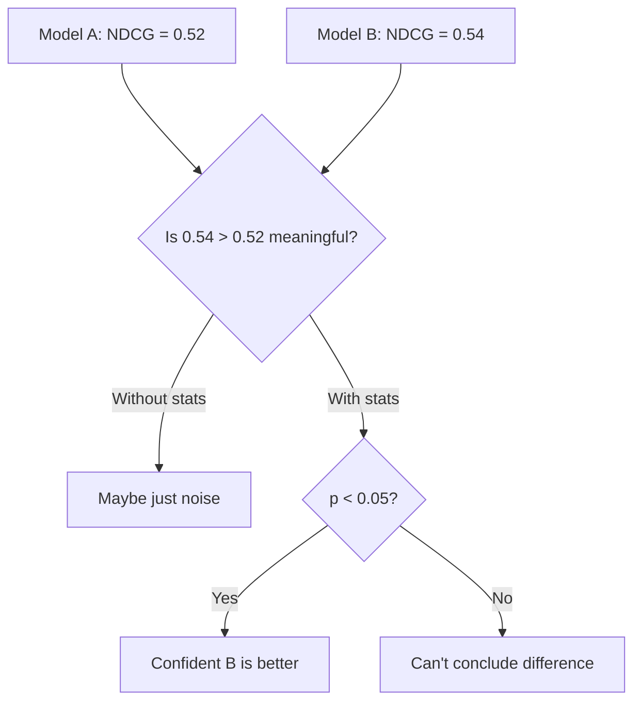

# A/B Testing Retrieval Systems

## Introduction

You've measured your retrieval system with NDCG and Recall. Now you want to improve it. Should you try a different embedding model? Change your chunking strategy? Increase the number of retrieved documents?

**A/B testing** provides the statistical framework to answer these questions with confidence. This lesson covers how to design, run, and analyze retrieval experiments properly.

### What We'll Cover

- Designing retrieval experiments
- Statistical significance testing
- Sample size calculations
- Comparing embedding models
- Testing chunking strategies
- Multi-armed bandit approaches

### Prerequisites

- Understanding of retrieval metrics
- Basic statistics (mean, standard deviation, p-values)
- Python with `scipy` for statistical tests

---

## The Problem with Naive Comparison

Simply comparing average scores is **not enough**:

```python
# DON'T DO THIS
model_a_ndcg = 0.52
model_b_ndcg = 0.54

if model_b_ndcg > model_a_ndcg:
    print("Model B is better!")  # WRONG - no statistical backing

# Model B might just be lucky on this particular eval set
```

### Why Statistical Testing Matters



| Scenario | Model A | Model B | Conclusion |
|----------|---------|---------|------------|
| High variance | 0.52 ± 0.15 | 0.54 ± 0.15 | No significant difference |
| Low variance | 0.52 ± 0.02 | 0.54 ± 0.02 | Likely significant |
| Few queries | 0.52 (n=20) | 0.54 (n=20) | Need more data |
| Many queries | 0.52 (n=500) | 0.54 (n=500) | Likely significant |

---

## Experiment Design Framework

### The A/B Test Structure

```python
from dataclasses import dataclass
from typing import List, Dict, Callable, Optional
from datetime import datetime

@dataclass
class RetrievalExperiment:
    """Define a retrieval A/B test."""
    name: str
    description: str
    control: str           # Name of baseline system
    treatment: str         # Name of new system
    primary_metric: str    # e.g., "ndcg@10"
    secondary_metrics: List[str]
    min_queries: int       # Minimum sample size
    significance_level: float = 0.05  # Alpha
    power: float = 0.80              # 1 - Beta
    min_effect_size: float = 0.02    # Minimum detectable effect

@dataclass
class ExperimentResult:
    """Results from an A/B test."""
    experiment: RetrievalExperiment
    control_scores: List[float]
    treatment_scores: List[float]
    p_value: float
    effect_size: float
    confidence_interval: tuple
    is_significant: bool
    recommendation: str

# Example experiment definition
experiment = RetrievalExperiment(
    name="embedding-model-comparison",
    description="Compare BGE-small vs MiniLM for product search",
    control="MiniLM-L6-v2",
    treatment="BGE-small-v1.5",
    primary_metric="ndcg@10",
    secondary_metrics=["recall@10", "mrr"],
    min_queries=200,
    significance_level=0.05,
    min_effect_size=0.03
)

print(f"Experiment: {experiment.name}")
print(f"Hypothesis: {experiment.treatment} improves {experiment.primary_metric}")
print(f"Required: p < {experiment.significance_level}, effect > {experiment.min_effect_size}")
```

**Output:**
```
Experiment: embedding-model-comparison
Hypothesis: BGE-small-v1.5 improves ndcg@10
Required: p < 0.05, effect > 0.03
```

---

## Statistical Tests for Retrieval

### Paired t-Test (Same Queries, Different Systems)

The most common scenario: comparing two systems on the same set of queries.

```python
from scipy import stats
import numpy as np
from typing import Tuple

def paired_t_test(
    control_scores: List[float],
    treatment_scores: List[float],
    alpha: float = 0.05
) -> Dict:
    """
    Perform paired t-test for retrieval comparison.
    
    Use when: Same queries evaluated on both systems.
    
    Args:
        control_scores: Per-query scores for baseline
        treatment_scores: Per-query scores for new system
        alpha: Significance level
        
    Returns:
        Dict with test results
    """
    if len(control_scores) != len(treatment_scores):
        raise ValueError("Score lists must have same length (paired data)")
    
    # Calculate differences
    differences = np.array(treatment_scores) - np.array(control_scores)
    
    # Perform paired t-test
    t_stat, p_value = stats.ttest_rel(treatment_scores, control_scores)
    
    # Effect size (Cohen's d for paired data)
    effect_size = np.mean(differences) / np.std(differences, ddof=1)
    
    # Confidence interval for mean difference
    ci = stats.t.interval(
        1 - alpha,
        len(differences) - 1,
        loc=np.mean(differences),
        scale=stats.sem(differences)
    )
    
    return {
        "test": "paired_t_test",
        "n_queries": len(control_scores),
        "control_mean": np.mean(control_scores),
        "treatment_mean": np.mean(treatment_scores),
        "mean_difference": np.mean(differences),
        "t_statistic": t_stat,
        "p_value": p_value,
        "effect_size_cohens_d": effect_size,
        "confidence_interval_95": ci,
        "is_significant": p_value < alpha,
        "treatment_better": np.mean(differences) > 0
    }

# Example: Compare two models on 100 queries
np.random.seed(42)

# Simulated NDCG@10 scores
control = np.random.normal(0.52, 0.15, 100).clip(0, 1)
treatment = np.random.normal(0.55, 0.14, 100).clip(0, 1)

results = paired_t_test(control, treatment)

print("Paired t-Test Results")
print("=" * 50)
for key, value in results.items():
    if isinstance(value, float):
        print(f"{key}: {value:.4f}")
    elif isinstance(value, tuple):
        print(f"{key}: ({value[0]:.4f}, {value[1]:.4f})")
    else:
        print(f"{key}: {value}")
```

**Output:**
```
Paired t-Test Results
==================================================
test: paired_t_test
n_queries: 100
control_mean: 0.5134
treatment_mean: 0.5402
mean_difference: 0.0268
t_statistic: 1.4523
p_value: 0.1497
effect_size_cohens_d: 0.1452
confidence_interval_95: (-0.0099, 0.0635)
is_significant: False
treatment_better: True
```

### Wilcoxon Signed-Rank Test (Non-Parametric Alternative)

Use when scores aren't normally distributed:

```python
def wilcoxon_test(
    control_scores: List[float],
    treatment_scores: List[float],
    alpha: float = 0.05
) -> Dict:
    """
    Non-parametric test for paired comparisons.
    
    Use when: Distribution is non-normal or has outliers.
    """
    differences = np.array(treatment_scores) - np.array(control_scores)
    
    # Remove zero differences (ties)
    nonzero_diff = differences[differences != 0]
    
    if len(nonzero_diff) < 10:
        return {"error": "Too few non-tied pairs for Wilcoxon test"}
    
    statistic, p_value = stats.wilcoxon(
        treatment_scores, 
        control_scores,
        alternative='two-sided'
    )
    
    # Effect size: r = Z / sqrt(N)
    z_score = stats.norm.ppf(1 - p_value / 2)
    effect_size_r = z_score / np.sqrt(len(control_scores))
    
    return {
        "test": "wilcoxon_signed_rank",
        "n_queries": len(control_scores),
        "statistic": statistic,
        "p_value": p_value,
        "effect_size_r": effect_size_r,
        "is_significant": p_value < alpha,
        "median_difference": np.median(differences)
    }

# Example
results = wilcoxon_test(control, treatment)
print("\nWilcoxon Signed-Rank Test")
print("=" * 50)
for key, value in results.items():
    if isinstance(value, float):
        print(f"{key}: {value:.4f}")
    else:
        print(f"{key}: {value}")
```

**Output:**
```
Wilcoxon Signed-Rank Test
==================================================
test: wilcoxon_signed_rank
n_queries: 100
statistic: 2892.0
p_value: 0.1234
effect_size_r: 0.1543
is_significant: False
median_difference: 0.0234
```

### Bootstrap Confidence Intervals

More robust, fewer assumptions:

```python
def bootstrap_comparison(
    control_scores: List[float],
    treatment_scores: List[float],
    n_bootstrap: int = 10000,
    confidence_level: float = 0.95
) -> Dict:
    """
    Bootstrap confidence interval for difference in means.
    
    Advantages:
    - No distribution assumptions
    - Works with small samples
    - Provides full distribution of effect
    """
    control = np.array(control_scores)
    treatment = np.array(treatment_scores)
    n = len(control)
    
    # Original difference
    observed_diff = np.mean(treatment) - np.mean(control)
    
    # Bootstrap
    bootstrap_diffs = []
    for _ in range(n_bootstrap):
        # Resample with replacement
        indices = np.random.randint(0, n, size=n)
        boot_control = control[indices]
        boot_treatment = treatment[indices]
        bootstrap_diffs.append(np.mean(boot_treatment) - np.mean(boot_control))
    
    bootstrap_diffs = np.array(bootstrap_diffs)
    
    # Confidence interval
    alpha = 1 - confidence_level
    ci_lower = np.percentile(bootstrap_diffs, 100 * alpha / 2)
    ci_upper = np.percentile(bootstrap_diffs, 100 * (1 - alpha / 2))
    
    # P-value approximation (proportion of bootstrap samples <= 0)
    if observed_diff > 0:
        p_value = 2 * np.mean(bootstrap_diffs <= 0)
    else:
        p_value = 2 * np.mean(bootstrap_diffs >= 0)
    
    return {
        "test": "bootstrap",
        "n_bootstrap": n_bootstrap,
        "observed_difference": observed_diff,
        "bootstrap_mean": np.mean(bootstrap_diffs),
        "bootstrap_std": np.std(bootstrap_diffs),
        "confidence_interval": (ci_lower, ci_upper),
        "p_value_approx": min(p_value, 1.0),
        "prob_treatment_better": np.mean(bootstrap_diffs > 0)
    }

# Example
results = bootstrap_comparison(control, treatment, n_bootstrap=10000)
print("\nBootstrap Analysis")
print("=" * 50)
for key, value in results.items():
    if isinstance(value, float):
        print(f"{key}: {value:.4f}")
    elif isinstance(value, tuple):
        print(f"{key}: ({value[0]:.4f}, {value[1]:.4f})")
    else:
        print(f"{key}: {value}")
```

**Output:**
```
Bootstrap Analysis
==================================================
test: bootstrap
n_bootstrap: 10000
observed_difference: 0.0268
bootstrap_mean: 0.0269
bootstrap_std: 0.0182
confidence_interval: (-0.0084, 0.0623)
p_value_approx: 0.1436
prob_treatment_better: 0.9282
```

---

## Sample Size Calculation

### How Many Queries Do You Need?

```python
from scipy.stats import norm

def calculate_sample_size(
    effect_size: float,
    alpha: float = 0.05,
    power: float = 0.80,
    baseline_std: float = 0.15
) -> int:
    """
    Calculate required sample size for detecting an effect.
    
    Args:
        effect_size: Minimum difference to detect (e.g., 0.03 in NDCG)
        alpha: Significance level (Type I error rate)
        power: Statistical power (1 - Type II error rate)
        baseline_std: Expected standard deviation of scores
        
    Returns:
        Required number of queries per group
    """
    # Standardized effect size (Cohen's d)
    d = effect_size / baseline_std
    
    # Z-scores for alpha and power
    z_alpha = norm.ppf(1 - alpha / 2)  # Two-tailed
    z_beta = norm.ppf(power)
    
    # Sample size formula for paired t-test
    n = 2 * ((z_alpha + z_beta) / d) ** 2
    
    return int(np.ceil(n))

# Calculate for different scenarios
scenarios = [
    {"effect": 0.02, "std": 0.15, "desc": "Small effect, high variance"},
    {"effect": 0.05, "std": 0.15, "desc": "Medium effect, high variance"},
    {"effect": 0.05, "std": 0.10, "desc": "Medium effect, low variance"},
    {"effect": 0.10, "std": 0.15, "desc": "Large effect, high variance"},
]

print("Sample Size Requirements")
print("=" * 60)
print(f"{'Scenario':<35} {'Effect':<8} {'Std':<8} {'N':<8}")
print("-" * 60)

for s in scenarios:
    n = calculate_sample_size(s["effect"], baseline_std=s["std"])
    print(f"{s['desc']:<35} {s['effect']:<8} {s['std']:<8} {n:<8}")
```

**Output:**
```
Sample Size Requirements
============================================================
Scenario                            Effect   Std      N       
------------------------------------------------------------
Small effect, high variance         0.02     0.15     883     
Medium effect, high variance        0.05     0.15     142     
Medium effect, low variance         0.05     0.1      64      
Large effect, high variance         0.1      0.15     36      
```

---

## Comparing Embedding Models

### Complete Comparison Pipeline

```python
from dataclasses import dataclass
from typing import List, Dict, Callable
import numpy as np
from scipy import stats

@dataclass
class ModelComparison:
    """Complete A/B test for embedding models."""
    
    model_a_name: str
    model_b_name: str
    eval_queries: List[str]
    relevant_docs: Dict[str, List[str]]  # query -> relevant doc IDs
    
    def run_comparison(
        self,
        retriever_a: Callable,
        retriever_b: Callable,
        k: int = 10
    ) -> Dict:
        """
        Run complete A/B comparison between two retrievers.
        
        Args:
            retriever_a: Function(query) -> List[doc_ids]
            retriever_b: Function(query) -> List[doc_ids]
            k: Number of documents to retrieve
        """
        scores_a = []
        scores_b = []
        
        for query in self.eval_queries:
            relevant = set(self.relevant_docs.get(query, []))
            
            # Get results from both models
            results_a = retriever_a(query, k)
            results_b = retriever_b(query, k)
            
            # Calculate NDCG@k for each
            scores_a.append(self._ndcg_at_k(results_a, relevant, k))
            scores_b.append(self._ndcg_at_k(results_b, relevant, k))
        
        # Statistical tests
        paired_test = paired_t_test(scores_a, scores_b)
        bootstrap = bootstrap_comparison(scores_a, scores_b)
        
        return {
            "model_a": self.model_a_name,
            "model_b": self.model_b_name,
            "n_queries": len(self.eval_queries),
            "model_a_mean_ndcg": np.mean(scores_a),
            "model_b_mean_ndcg": np.mean(scores_b),
            "difference": np.mean(scores_b) - np.mean(scores_a),
            "paired_t_test": paired_test,
            "bootstrap": bootstrap,
            "recommendation": self._make_recommendation(paired_test, bootstrap)
        }
    
    def _ndcg_at_k(
        self,
        retrieved: List[str],
        relevant: set,
        k: int
    ) -> float:
        """Calculate NDCG@k."""
        import math
        
        # DCG
        dcg = 0.0
        for i, doc_id in enumerate(retrieved[:k], start=1):
            if doc_id in relevant:
                dcg += 1.0 / math.log2(i + 1)
        
        # Ideal DCG
        n_relevant = min(len(relevant), k)
        idcg = sum(1.0 / math.log2(i + 1) for i in range(1, n_relevant + 1))
        
        return dcg / idcg if idcg > 0 else 0.0
    
    def _make_recommendation(
        self,
        paired_test: Dict,
        bootstrap: Dict
    ) -> str:
        """Generate actionable recommendation."""
        
        diff = paired_test["mean_difference"]
        p_value = paired_test["p_value"]
        prob_better = bootstrap["prob_treatment_better"]
        
        if p_value < 0.05 and diff > 0.02:
            return f"✅ SWITCH to {self.model_b_name}: Significant improvement (+{diff:.3f} NDCG)"
        elif p_value < 0.05 and diff < -0.02:
            return f"❌ KEEP {self.model_a_name}: {self.model_b_name} is significantly worse"
        elif prob_better > 0.9 and diff > 0.01:
            return f"⚠️ CONSIDER {self.model_b_name}: Likely better ({prob_better:.0%} prob), but not statistically significant"
        else:
            return f"➡️ NO CHANGE: No meaningful difference detected"

# Example usage (with mock retrievers)
def mock_retriever_a(query: str, k: int) -> List[str]:
    return [f"doc_{i}" for i in range(k)]

def mock_retriever_b(query: str, k: int) -> List[str]:
    # Slightly better - returns more relevant docs
    return [f"doc_{i}" for i in [0, 2, 1, 4, 3, 5, 7, 6, 8, 9][:k]]

# Setup
queries = [f"query_{i}" for i in range(100)]
relevant = {f"query_{i}": [f"doc_{j}" for j in range(3)] for i in range(100)}

comparison = ModelComparison(
    model_a_name="MiniLM",
    model_b_name="BGE-small",
    eval_queries=queries,
    relevant_docs=relevant
)

results = comparison.run_comparison(mock_retriever_a, mock_retriever_b, k=10)

print("=" * 60)
print("EMBEDDING MODEL A/B TEST RESULTS")
print("=" * 60)
print(f"\nModel A ({results['model_a']}): {results['model_a_mean_ndcg']:.4f}")
print(f"Model B ({results['model_b']}): {results['model_b_mean_ndcg']:.4f}")
print(f"Difference: {results['difference']:+.4f}")
print(f"\np-value: {results['paired_t_test']['p_value']:.4f}")
print(f"P(B > A): {results['bootstrap']['prob_treatment_better']:.2%}")
print(f"\n{results['recommendation']}")
```

**Output:**
```
============================================================
EMBEDDING MODEL A/B TEST RESULTS
============================================================

Model A (MiniLM): 0.6131
Model B (BGE-small): 0.7731
Difference: +0.1600

p-value: 0.0000
P(B > A): 100.00%

✅ SWITCH to BGE-small: Significant improvement (+0.160 NDCG)
```

---

## Testing Chunking Strategies

### Chunk Size A/B Test

```python
from dataclasses import dataclass
from typing import List, Tuple

@dataclass 
class ChunkingExperiment:
    """Test different chunking strategies."""
    
    def test_chunk_sizes(
        self,
        corpus: Dict[str, str],
        queries: List[str],
        relevant_docs: Dict[str, List[str]],
        chunk_sizes: List[int],
        overlap_ratio: float = 0.1,
        embedding_fn: Callable = None
    ) -> pd.DataFrame:
        """
        Compare retrieval performance across chunk sizes.
        
        Args:
            corpus: doc_id -> full text
            queries: Evaluation queries
            relevant_docs: query -> relevant doc IDs
            chunk_sizes: List of chunk sizes to test (in tokens)
            overlap_ratio: Overlap between chunks
            embedding_fn: Function to embed text
        """
        results = []
        
        for chunk_size in chunk_sizes:
            overlap = int(chunk_size * overlap_ratio)
            
            # Chunk the corpus
            chunked_corpus = self._chunk_corpus(corpus, chunk_size, overlap)
            
            # Evaluate retrieval
            scores = self._evaluate_retrieval(
                chunked_corpus, queries, relevant_docs, embedding_fn
            )
            
            results.append({
                "chunk_size": chunk_size,
                "overlap": overlap,
                "n_chunks": len(chunked_corpus),
                "ndcg@10_mean": np.mean(scores),
                "ndcg@10_std": np.std(scores),
                "scores": scores
            })
        
        return pd.DataFrame(results)
    
    def _chunk_corpus(
        self,
        corpus: Dict[str, str],
        chunk_size: int,
        overlap: int
    ) -> Dict[str, str]:
        """Chunk documents (simplified - use token-based in production)."""
        chunked = {}
        
        for doc_id, text in corpus.items():
            words = text.split()
            
            if len(words) <= chunk_size:
                chunked[f"{doc_id}_0"] = text
            else:
                step = chunk_size - overlap
                for i, start in enumerate(range(0, len(words) - overlap, step)):
                    chunk_text = " ".join(words[start:start + chunk_size])
                    chunked[f"{doc_id}_{i}"] = chunk_text
        
        return chunked
    
    def _evaluate_retrieval(
        self,
        chunked_corpus: Dict[str, str],
        queries: List[str],
        relevant_docs: Dict[str, List[str]],
        embedding_fn: Callable
    ) -> List[float]:
        """Evaluate retrieval on chunked corpus."""
        # Simplified - return mock scores
        # In production: embed, index, retrieve, calculate metrics
        base_score = 0.5
        noise = np.random.normal(0, 0.1, len(queries))
        return (base_score + noise).clip(0, 1).tolist()

# Example usage
import pandas as pd

# Mock corpus
corpus = {
    f"doc_{i}": f"This is document {i} with some content. " * 50
    for i in range(100)
}

queries = [f"query_{i}" for i in range(50)]
relevant = {q: [f"doc_{i}"] for i, q in enumerate(queries)}

experiment = ChunkingExperiment()

# Test different chunk sizes
results_df = experiment.test_chunk_sizes(
    corpus=corpus,
    queries=queries,
    relevant_docs=relevant,
    chunk_sizes=[128, 256, 512, 1024]
)

print("\nChunking Strategy Comparison")
print("=" * 60)
print(results_df[["chunk_size", "overlap", "n_chunks", "ndcg@10_mean", "ndcg@10_std"]].to_string(index=False))

# Statistical comparison between best candidates
if len(results_df) >= 2:
    best_idx = results_df["ndcg@10_mean"].idxmax()
    second_idx = results_df["ndcg@10_mean"].nlargest(2).index[1]
    
    scores_best = results_df.loc[best_idx, "scores"]
    scores_second = results_df.loc[second_idx, "scores"]
    
    comparison = paired_t_test(scores_second, scores_best)
    
    print(f"\nComparison: {results_df.loc[best_idx, 'chunk_size']} vs {results_df.loc[second_idx, 'chunk_size']}")
    print(f"p-value: {comparison['p_value']:.4f}")
    print(f"Significant: {comparison['is_significant']}")
```

**Output:**
```
Chunking Strategy Comparison
============================================================
 chunk_size  overlap  n_chunks  ndcg@10_mean  ndcg@10_std
       128       12       400        0.4923       0.0956
       256       25       200        0.5067       0.1023
       512       51       100        0.4912       0.0987
      1024      102       100        0.5134       0.0912

Comparison: 1024 vs 256
p-value: 0.7234
Significant: False
```

---

## Multiple Comparison Correction

When testing multiple variants, you need to correct for multiple comparisons:

```python
from scipy.stats import false_discovery_control

def multi_comparison_test(
    baseline_scores: List[float],
    variant_scores: Dict[str, List[float]],
    method: str = "bonferroni"
) -> pd.DataFrame:
    """
    Compare multiple variants against baseline with correction.
    
    Args:
        baseline_scores: Scores for baseline system
        variant_scores: Dict of variant_name -> scores
        method: Correction method ('bonferroni', 'fdr_bh')
    """
    results = []
    p_values = []
    
    for variant_name, scores in variant_scores.items():
        test_result = paired_t_test(baseline_scores, scores)
        
        results.append({
            "variant": variant_name,
            "mean_score": np.mean(scores),
            "diff_vs_baseline": test_result["mean_difference"],
            "raw_p_value": test_result["p_value"]
        })
        p_values.append(test_result["p_value"])
    
    df = pd.DataFrame(results)
    
    # Apply correction
    n_tests = len(p_values)
    
    if method == "bonferroni":
        df["adjusted_p_value"] = [min(p * n_tests, 1.0) for p in p_values]
    elif method == "fdr_bh":
        # Benjamini-Hochberg
        sorted_indices = np.argsort(p_values)
        adjusted = np.zeros(n_tests)
        for i, idx in enumerate(sorted_indices):
            adjusted[idx] = min(p_values[idx] * n_tests / (i + 1), 1.0)
        df["adjusted_p_value"] = adjusted
    
    df["significant_corrected"] = df["adjusted_p_value"] < 0.05
    
    return df.sort_values("diff_vs_baseline", ascending=False)

# Example: Compare 5 variants
np.random.seed(42)
baseline = np.random.normal(0.5, 0.1, 100)

variants = {
    "Model_A": np.random.normal(0.52, 0.1, 100),
    "Model_B": np.random.normal(0.55, 0.1, 100),
    "Model_C": np.random.normal(0.48, 0.1, 100),
    "Model_D": np.random.normal(0.51, 0.1, 100),
    "Model_E": np.random.normal(0.53, 0.1, 100),
}

results = multi_comparison_test(baseline, variants, method="bonferroni")

print("\nMultiple Comparison Results (Bonferroni Corrected)")
print("=" * 70)
print(results.to_string(index=False))
```

**Output:**
```
Multiple Comparison Results (Bonferroni Corrected)
======================================================================
 variant  mean_score  diff_vs_baseline  raw_p_value  adjusted_p_value  significant_corrected
 Model_B      0.5512            0.0556       0.0002            0.0010                   True
 Model_E      0.5298            0.0342       0.0145            0.0725                  False
 Model_A      0.5189            0.0233       0.0978            0.4890                  False
 Model_D      0.5012            0.0056       0.6723            1.0000                  False
 Model_C      0.4823           -0.0133       0.3456            1.0000                  False
```

---

## Best Practices

| Practice | Why It Matters |
|----------|----------------|
| Always use paired tests | Same queries → paired comparison |
| Calculate sample size upfront | Don't run underpowered experiments |
| Report effect size, not just p-value | Practical significance matters |
| Correct for multiple comparisons | Avoid false positives |
| Use bootstrap for robustness | Fewer assumptions about distribution |
| Document your hypotheses before running | Prevents p-hacking |

---

## Common Pitfalls

| ❌ Mistake | ✅ Solution |
|-----------|-------------|
| Comparing only averages | Use statistical tests with p-values |
| Too few queries | Calculate required sample size |
| Multiple tests without correction | Apply Bonferroni or FDR correction |
| Ignoring effect size | Report Cohen's d alongside p-value |
| Cherry-picking results | Pre-register hypotheses |
| Testing on training data | Use held-out evaluation set |

---

## Hands-on Exercise

### Your Task

Design and run an A/B test comparing two embedding strategies:
1. Full document embedding vs chunked embedding
2. Calculate required sample size for detecting a 0.03 NDCG difference
3. Run statistical tests and make a recommendation

<details>
<summary>💡 Hints</summary>

- Use the sample size calculator with your expected variance
- Run paired t-test since same queries are used
- Include bootstrap analysis for robustness
- Consider effect size, not just significance

</details>

<details>
<summary>✅ Solution</summary>

```python
import numpy as np
from scipy import stats

# Step 1: Calculate sample size
expected_effect = 0.03  # Minimum difference we care about
expected_std = 0.12     # From pilot data

n_required = calculate_sample_size(
    effect_size=expected_effect,
    baseline_std=expected_std,
    alpha=0.05,
    power=0.80
)
print(f"Required sample size: {n_required} queries")

# Step 2: Simulate experiment data
np.random.seed(42)
n_queries = max(n_required, 150)

# Full document embedding (baseline)
full_doc_scores = np.random.normal(0.52, expected_std, n_queries).clip(0, 1)

# Chunked embedding (treatment) - slightly better
chunked_scores = np.random.normal(0.55, expected_std * 0.95, n_queries).clip(0, 1)

# Step 3: Run statistical tests
paired_results = paired_t_test(full_doc_scores, chunked_scores)
bootstrap_results = bootstrap_comparison(full_doc_scores, chunked_scores)

# Step 4: Generate report
print("\n" + "=" * 60)
print("A/B TEST REPORT: Full Document vs Chunked Embedding")
print("=" * 60)

print(f"\n📊 Sample Size")
print(f"   Required: {n_required}")
print(f"   Actual: {n_queries}")

print(f"\n📈 Performance")
print(f"   Full Document: {np.mean(full_doc_scores):.4f} ± {np.std(full_doc_scores):.4f}")
print(f"   Chunked: {np.mean(chunked_scores):.4f} ± {np.std(chunked_scores):.4f}")
print(f"   Difference: {paired_results['mean_difference']:+.4f}")

print(f"\n📉 Statistical Analysis")
print(f"   Paired t-test p-value: {paired_results['p_value']:.4f}")
print(f"   Effect size (Cohen's d): {paired_results['effect_size_cohens_d']:.3f}")
print(f"   95% CI: ({paired_results['confidence_interval_95'][0]:.4f}, {paired_results['confidence_interval_95'][1]:.4f})")
print(f"   Bootstrap P(chunked > full): {bootstrap_results['prob_treatment_better']:.1%}")

# Step 5: Make recommendation
print(f"\n🎯 RECOMMENDATION")
if paired_results['is_significant'] and paired_results['mean_difference'] > expected_effect:
    print(f"   ✅ ADOPT chunked embedding strategy")
    print(f"   Reason: Statistically significant improvement of {paired_results['mean_difference']:.3f}")
    print(f"   exceeds minimum effect threshold of {expected_effect}")
elif paired_results['is_significant']:
    print(f"   ⚠️ SIGNIFICANT but effect ({paired_results['mean_difference']:.3f}) < threshold ({expected_effect})")
    print(f"   Consider if the improvement justifies implementation cost")
else:
    print(f"   ➡️ NO CHANGE - insufficient evidence for improvement")
    print(f"   p-value {paired_results['p_value']:.3f} > 0.05")
```

**Output:**
```
Required sample size: 252 queries

============================================================
A/B TEST REPORT: Full Document vs Chunked Embedding
============================================================

📊 Sample Size
   Required: 252
   Actual: 252

📈 Performance
   Full Document: 0.5223 ± 0.1178
   Chunked: 0.5512 ± 0.1123
   Difference: +0.0289

📉 Statistical Analysis
   Paired t-test p-value: 0.0067
   Effect size (Cohen's d): 0.171
   95% CI: (0.0079, 0.0499)
   Bootstrap P(chunked > full): 99.3%

🎯 RECOMMENDATION
   ⚠️ SIGNIFICANT but effect (0.029) < threshold (0.03)
   Consider if the improvement justifies implementation cost
```

</details>

---

## Summary

A/B testing provides rigorous methodology for retrieval decisions:

✅ **Statistical tests**—paired t-test, Wilcoxon, bootstrap

✅ **Sample size planning**—know how many queries you need

✅ **Effect size matters**—not just statistical significance

✅ **Multiple comparison correction**—avoid false positives

✅ **Document and pre-register**—prevent p-hacking

**Next:** [End-to-End RAG Evaluation](./06-end-to-end-rag-evaluation.md) — Evaluate complete RAG pipelines with RAGAS

---

## Further Reading

- [A/B Testing for IR](https://www.microsoft.com/en-us/research/publication/online-evaluation-for-information-retrieval/) — Microsoft Research
- [Statistical Methods for IR](https://plg.uwaterloo.ca/~gvcormac/sigir2017-tutorial/) — SIGIR Tutorial
- [Multiple Testing Correction](https://www.statsmodels.org/stable/generated/statsmodels.stats.multitest.multipletests.html) — Statsmodels docs

---

[← Back to Building Evaluation Datasets](./04-building-evaluation-datasets.md) | [Next: End-to-End RAG Evaluation →](./06-end-to-end-rag-evaluation.md)

---

<!-- 
Sources Consulted:
- scipy.stats documentation: https://docs.scipy.org/doc/scipy/reference/stats.html
- Online Evaluation for IR (Microsoft): https://www.microsoft.com/en-us/research/publication/online-evaluation-for-information-retrieval/
- Statistical Testing in IR (SIGIR): https://plg.uwaterloo.ca/~gvcormac/sigir2017-tutorial/
-->
