# End-to-End RAG Evaluation

## Introduction

Evaluating retrieval metrics alone tells only half the story. The ultimate test of a RAG system is whether the **final generated answer** is correct, grounded, and useful to the user. End-to-end evaluation examines the entire pipeline—from query to generated response.

This lesson covers evaluation frameworks that assess both retrieval quality and generation quality together, providing a holistic view of RAG system performance.

### What We'll Cover
- RAGAS framework metrics and formulas
- DeepEval for unit testing LLM outputs
- Faithfulness, Context Precision, and Answer Relevancy
- Framework comparison and selection
- Building comprehensive evaluation pipelines

### Prerequisites
- Understanding of retrieval metrics (Lesson 01)
- Basic RAG pipeline knowledge
- Python and async programming
- LLM API access (OpenAI or similar)

---

## The RAG Evaluation Challenge

RAG systems have multiple failure modes that can't be caught by retrieval metrics alone:

```mermaid
flowchart TD
    A[User Query] --> B[Retriever]
    B --> C{Retrieved Context}
    C --> D[Generator/LLM]
    D --> E[Final Answer]
    
    B -.->|"Failure 1: Wrong docs"| F[❌ Context Precision]
    B -.->|"Failure 2: Missing docs"| G[❌ Context Recall]
    D -.->|"Failure 3: Hallucination"| H[❌ Faithfulness]
    D -.->|"Failure 4: Off-topic"| I[❌ Answer Relevancy]
    
    style F fill:#ffcccc
    style G fill:#ffcccc
    style H fill:#ffcccc
    style I fill:#ffcccc
```



| Failure Mode | Description | Metric |
|--------------|-------------|--------|
| Wrong context | Retrieved docs are irrelevant | Context Precision |
| Missing context | Relevant docs not retrieved | Context Recall |
| Hallucination | Answer contradicts context | Faithfulness |
| Off-topic answer | Answer doesn't address query | Answer Relevancy |

> **🤖 AI Context:** End-to-end metrics use "LLM-as-a-judge" to evaluate outputs since traditional NLP metrics (BLEU, ROUGE) correlate poorly with human judgment for open-ended generation.

---

## RAGAS Framework

RAGAS (Retrieval-Augmented Generation Assessment) is the most widely-adopted framework for end-to-end RAG evaluation. It provides metrics that cover both retrieval and generation quality.

### Installation and Setup

```python
# Install RAGAS
# pip install ragas openai

from openai import AsyncOpenAI
from ragas.llms import llm_factory
from ragas.embeddings.base import embedding_factory

# Setup LLM and embeddings for evaluation
client = AsyncOpenAI()
evaluator_llm = llm_factory("gpt-4o-mini", client=client)
evaluator_embeddings = embedding_factory(
    "openai", 
    model="text-embedding-3-small", 
    client=client
)
```

### Core RAGAS Metrics

RAGAS provides four core metrics that together cover the full RAG pipeline:

| Metric | What It Measures | Formula | Range |
|--------|-----------------|---------|-------|
| **Context Precision** | Relevant contexts ranked higher | Mean of Precision@k | 0-1 |
| **Context Recall** | Retrieved context covers reference | Claims supported / Total claims | 0-1 |
| **Faithfulness** | Response grounded in context | Supported claims / Total claims | 0-1 |
| **Answer Relevancy** | Response addresses query | Mean cosine similarity | 0-1 |

---

## Faithfulness: Measuring Groundedness

Faithfulness measures whether the generated answer is **factually consistent** with the retrieved context. A faithful response makes no claims that contradict or go beyond what's in the context.

### The Faithfulness Formula

$$
\text{Faithfulness} = \frac{\text{Number of claims supported by context}}{\text{Total number of claims in response}}
$$

### How It's Calculated

1. **Extract claims** from the generated response
2. **Verify each claim** against the retrieved context
3. **Count supported claims** and calculate the ratio

```python
from ragas.metrics.collections import Faithfulness

async def evaluate_faithfulness(
    user_input: str,
    response: str,
    retrieved_contexts: list[str],
    llm
) -> float:
    """
    Evaluate whether the response is grounded in the context.
    
    Args:
        user_input: The original query
        response: The generated response
        retrieved_contexts: List of retrieved document chunks
        llm: The evaluation LLM
    
    Returns:
        Faithfulness score between 0 and 1
    """
    scorer = Faithfulness(llm=llm)
    
    result = await scorer.ascore(
        user_input=user_input,
        response=response,
        retrieved_contexts=retrieved_contexts
    )
    
    return result.value

# Example usage
async def faithfulness_example():
    from openai import AsyncOpenAI
    from ragas.llms import llm_factory
    
    client = AsyncOpenAI()
    llm = llm_factory("gpt-4o-mini", client=client)
    
    # High faithfulness example
    score_high = await evaluate_faithfulness(
        user_input="When was the first Super Bowl?",
        response="The first Super Bowl was held on January 15, 1967.",
        retrieved_contexts=[
            "The First AFL–NFL World Championship Game was an American "
            "football game played on January 15, 1967, at the Los Angeles "
            "Memorial Coliseum in Los Angeles."
        ],
        llm=llm
    )
    print(f"High faithfulness: {score_high:.2f}")  # ~1.0
    
    # Low faithfulness example (contains hallucination)
    score_low = await evaluate_faithfulness(
        user_input="When was the first Super Bowl?",
        response="The first Super Bowl was held on March 20, 1967, "
                 "and was won by the New York Jets.",  # Wrong date and team!
        retrieved_contexts=[
            "The First AFL–NFL World Championship Game was an American "
            "football game played on January 15, 1967, at the Los Angeles "
            "Memorial Coliseum in Los Angeles."
        ],
        llm=llm
    )
    print(f"Low faithfulness: {score_low:.2f}")  # ~0.0-0.5
```

### Faithfulness Breakdown Example

| Response | Claims Extracted | Verified | Score |
|----------|-----------------|----------|-------|
| "Einstein was born in Germany on March 14, 1879" | 1. Born in Germany ✅<br>2. Born March 14, 1879 ✅ | 2/2 | 1.0 |
| "Einstein was born in Germany on March 20, 1879" | 1. Born in Germany ✅<br>2. Born March 20, 1879 ❌ | 1/2 | 0.5 |

> **Warning:** Faithfulness only measures consistency with context, not factual accuracy. If the context itself is wrong, a "faithful" answer could still be incorrect.

---

## Context Precision: Ranking Quality

Context Precision evaluates whether **relevant contexts appear before irrelevant ones** in the retrieved results. It measures retrieval ranking quality.

### The Context Precision Formula

$$
\text{Context Precision@K} = \frac{\sum_{k=1}^{K}(\text{Precision@k} \times v_k)}{\text{Total relevant items in top K}}
$$

Where $v_k \in \{0, 1\}$ is the relevance indicator at rank $k$.

### Implementation

```python
from ragas.metrics.collections import ContextPrecision, ContextUtilization

async def evaluate_context_precision(
    user_input: str,
    reference: str,
    retrieved_contexts: list[str],
    llm
) -> float:
    """
    Evaluate if relevant contexts are ranked higher.
    
    Uses reference answer to determine relevance.
    """
    scorer = ContextPrecision(llm=llm)
    
    result = await scorer.ascore(
        user_input=user_input,
        reference=reference,
        retrieved_contexts=retrieved_contexts
    )
    
    return result.value

async def evaluate_context_utilization(
    user_input: str,
    response: str,
    retrieved_contexts: list[str],
    llm
) -> float:
    """
    Evaluate context precision without reference answer.
    
    Uses generated response to determine relevance.
    """
    scorer = ContextUtilization(llm=llm)
    
    result = await scorer.ascore(
        user_input=user_input,
        response=response,
        retrieved_contexts=retrieved_contexts
    )
    
    return result.value

# Example: Impact of ranking order
async def ranking_impact_example():
    from openai import AsyncOpenAI
    from ragas.llms import llm_factory
    
    client = AsyncOpenAI()
    llm = llm_factory("gpt-4o-mini", client=client)
    
    # Good ranking: relevant doc first
    score_good = await evaluate_context_utilization(
        user_input="Where is the Eiffel Tower located?",
        response="The Eiffel Tower is located in Paris.",
        retrieved_contexts=[
            "The Eiffel Tower is located in Paris.",        # Relevant - rank 1
            "The Brandenburg Gate is located in Berlin."    # Irrelevant - rank 2
        ],
        llm=llm
    )
    print(f"Good ranking score: {score_good:.2f}")  # ~1.0
    
    # Poor ranking: irrelevant doc first
    score_poor = await evaluate_context_utilization(
        user_input="Where is the Eiffel Tower located?",
        response="The Eiffel Tower is located in Paris.",
        retrieved_contexts=[
            "The Brandenburg Gate is located in Berlin.",   # Irrelevant - rank 1
            "The Eiffel Tower is located in Paris."         # Relevant - rank 2
        ],
        llm=llm
    )
    print(f"Poor ranking score: {score_poor:.2f}")  # ~0.5
```

> **💡 Tip:** Context Precision with reference (`ContextPrecision`) is more reliable when you have ground truth answers. Use `ContextUtilization` when evaluating without references.

---

## Answer Relevancy: Response Quality

Answer Relevancy measures whether the generated response **directly addresses the user's question**. It uses a clever reverse-engineering approach.

### The Answer Relevancy Formula

$$
\text{Answer Relevancy} = \frac{1}{N}\sum_{i=1}^{N}\text{cosine\_similarity}(E_{g_i}, E_o)
$$

Where:
- $E_{g_i}$ = Embedding of the $i$-th generated question
- $E_o$ = Embedding of the original user input
- $N$ = Number of generated questions (default: 3)

### How It Works


The intuition: If an answer correctly addresses a question, the original question should be reconstructable from the answer alone.

### Implementation

```python
from ragas.metrics.collections import AnswerRelevancy

async def evaluate_answer_relevancy(
    user_input: str,
    response: str,
    llm,
    embeddings
) -> float:
    """
    Evaluate if the response addresses the user's question.
    
    Uses reverse question generation and embedding similarity.
    """
    scorer = AnswerRelevancy(llm=llm, embeddings=embeddings)
    
    result = await scorer.ascore(
        user_input=user_input,
        response=response
    )
    
    return result.value

# Example
async def answer_relevancy_example():
    from openai import AsyncOpenAI
    from ragas.llms import llm_factory
    from ragas.embeddings.base import embedding_factory
    
    client = AsyncOpenAI()
    llm = llm_factory("gpt-4o-mini", client=client)
    embeddings = embedding_factory("openai", model="text-embedding-3-small", client=client)
    
    # High relevancy: answer directly addresses question
    score_high = await evaluate_answer_relevancy(
        user_input="Where is France and what is its capital?",
        response="France is in western Europe and Paris is its capital.",
        llm=llm,
        embeddings=embeddings
    )
    print(f"High relevancy: {score_high:.2f}")  # ~0.9+
    
    # Low relevancy: incomplete answer
    score_low = await evaluate_answer_relevancy(
        user_input="Where is France and what is its capital?",
        response="France is in western Europe.",  # Missing capital info
        llm=llm,
        embeddings=embeddings
    )
    print(f"Low relevancy: {score_low:.2f}")  # ~0.7
```

---

## Complete RAGAS Evaluation Pipeline

Here's how to run all four metrics together on a RAG dataset:

```python
import asyncio
from dataclasses import dataclass
from typing import Optional
from openai import AsyncOpenAI
from ragas.llms import llm_factory
from ragas.embeddings.base import embedding_factory
from ragas.metrics.collections import (
    Faithfulness,
    ContextPrecision,
    AnswerRelevancy
)

@dataclass
class RAGSample:
    """A single RAG evaluation sample."""
    user_input: str
    retrieved_contexts: list[str]
    response: str
    reference: Optional[str] = None  # Ground truth answer

@dataclass
class RAGASScores:
    """RAGAS evaluation scores for a sample."""
    faithfulness: float
    context_precision: float
    answer_relevancy: float
    
    @property
    def aggregate(self) -> float:
        """Simple average of all scores."""
        return (
            self.faithfulness + 
            self.context_precision + 
            self.answer_relevancy
        ) / 3

class RAGASEvaluator:
    """Comprehensive RAGAS evaluation pipeline."""
    
    def __init__(self, model: str = "gpt-4o-mini"):
        self.client = AsyncOpenAI()
        self.llm = llm_factory(model, client=self.client)
        self.embeddings = embedding_factory(
            "openai",
            model="text-embedding-3-small",
            client=self.client
        )
        
        # Initialize scorers
        self.faithfulness = Faithfulness(llm=self.llm)
        self.context_precision = ContextPrecision(llm=self.llm)
        self.answer_relevancy = AnswerRelevancy(
            llm=self.llm,
            embeddings=self.embeddings
        )
    
    async def evaluate_sample(self, sample: RAGSample) -> RAGASScores:
        """Evaluate a single RAG sample with all metrics."""
        
        # Run metrics concurrently
        faith_task = self.faithfulness.ascore(
            user_input=sample.user_input,
            response=sample.response,
            retrieved_contexts=sample.retrieved_contexts
        )
        
        # Context precision needs reference
        if sample.reference:
            cp_task = self.context_precision.ascore(
                user_input=sample.user_input,
                reference=sample.reference,
                retrieved_contexts=sample.retrieved_contexts
            )
        else:
            cp_task = asyncio.create_task(self._dummy_score(0.0))
        
        ar_task = self.answer_relevancy.ascore(
            user_input=sample.user_input,
            response=sample.response
        )
        
        # Await all results
        faith_result, cp_result, ar_result = await asyncio.gather(
            faith_task, cp_task, ar_task
        )
        
        return RAGASScores(
            faithfulness=faith_result.value,
            context_precision=cp_result.value if sample.reference else 0.0,
            answer_relevancy=ar_result.value
        )
    
    async def _dummy_score(self, value: float):
        """Return a dummy result for missing metrics."""
        class DummyResult:
            def __init__(self, v):
                self.value = v
        return DummyResult(value)
    
    async def evaluate_dataset(
        self,
        samples: list[RAGSample]
    ) -> dict[str, float]:
        """Evaluate a full dataset and return aggregate scores."""
        
        all_scores = []
        for i, sample in enumerate(samples):
            scores = await self.evaluate_sample(sample)
            all_scores.append(scores)
            print(f"Evaluated {i+1}/{len(samples)}: "
                  f"F={scores.faithfulness:.2f}, "
                  f"CP={scores.context_precision:.2f}, "
                  f"AR={scores.answer_relevancy:.2f}")
        
        # Calculate averages
        return {
            "faithfulness": sum(s.faithfulness for s in all_scores) / len(all_scores),
            "context_precision": sum(s.context_precision for s in all_scores) / len(all_scores),
            "answer_relevancy": sum(s.answer_relevancy for s in all_scores) / len(all_scores),
            "aggregate": sum(s.aggregate for s in all_scores) / len(all_scores)
        }

# Example usage
async def run_ragas_evaluation():
    evaluator = RAGASEvaluator()
    
    samples = [
        RAGSample(
            user_input="What is the capital of France?",
            retrieved_contexts=[
                "Paris is the capital and largest city of France.",
                "France is a country in Western Europe."
            ],
            response="The capital of France is Paris.",
            reference="Paris is the capital of France."
        ),
        RAGSample(
            user_input="When was Python created?",
            retrieved_contexts=[
                "Python was created by Guido van Rossum and released in 1991.",
                "Python is a high-level programming language."
            ],
            response="Python was created in 1991 by Guido van Rossum.",
            reference="Python was created in 1991."
        )
    ]
    
    results = await evaluator.evaluate_dataset(samples)
    
    print("\n=== Aggregate Results ===")
    for metric, score in results.items():
        print(f"{metric}: {score:.3f}")

# Run: asyncio.run(run_ragas_evaluation())
```

**Output:**
```
Evaluated 1/2: F=1.00, CP=1.00, AR=0.95
Evaluated 2/2: F=1.00, CP=1.00, AR=0.92

=== Aggregate Results ===
faithfulness: 1.000
context_precision: 1.000
answer_relevancy: 0.935
aggregate: 0.978
```

---

## DeepEval Framework

DeepEval provides a pytest-like interface for LLM evaluation with additional features like detailed reasoning and test assertions.

### Installation and Basic Usage

```python
# Install DeepEval
# pip install -U deepeval

from deepeval import evaluate
from deepeval.test_case import LLMTestCase
from deepeval.metrics import (
    FaithfulnessMetric,
    AnswerRelevancyMetric,
    ContextualPrecisionMetric,
    ContextualRecallMetric
)

def evaluate_with_deepeval():
    """Run DeepEval metrics on a RAG test case."""
    
    # Create test case
    test_case = LLMTestCase(
        input="What is the return policy?",
        actual_output="We offer a 30-day full refund at no extra cost.",
        retrieval_context=[
            "All customers are eligible for a 30 day full refund at no extra cost.",
            "Items must be returned in original packaging."
        ],
        expected_output="Customers can get a full refund within 30 days."
    )
    
    # Define metrics
    metrics = [
        FaithfulnessMetric(
            threshold=0.7,
            model="gpt-4o-mini",
            include_reason=True
        ),
        AnswerRelevancyMetric(
            threshold=0.7,
            model="gpt-4o-mini"
        ),
        ContextualPrecisionMetric(
            threshold=0.7,
            model="gpt-4o-mini"
        )
    ]
    
    # Run evaluation
    evaluate(test_cases=[test_case], metrics=metrics)

# Run standalone metric
def standalone_faithfulness():
    """Run faithfulness metric as standalone."""
    
    metric = FaithfulnessMetric(
        threshold=0.7,
        model="gpt-4o-mini",
        include_reason=True
    )
    
    test_case = LLMTestCase(
        input="What is our refund policy?",
        actual_output="We offer a 30-day full refund at no extra cost.",
        retrieval_context=[
            "All customers are eligible for a 30 day full refund."
        ]
    )
    
    metric.measure(test_case)
    
    print(f"Score: {metric.score}")
    print(f"Reason: {metric.reason}")
    print(f"Passed: {metric.is_successful()}")
```

### DeepEval Test File Pattern

DeepEval integrates with pytest for CI/CD pipelines:

```python
# test_rag_evaluation.py
import pytest
from deepeval import assert_test
from deepeval.test_case import LLMTestCase
from deepeval.metrics import FaithfulnessMetric, AnswerRelevancyMetric

class TestRAGPipeline:
    """RAG pipeline evaluation tests."""
    
    @pytest.fixture
    def faithfulness_metric(self):
        return FaithfulnessMetric(threshold=0.7, model="gpt-4o-mini")
    
    @pytest.fixture
    def relevancy_metric(self):
        return AnswerRelevancyMetric(threshold=0.7, model="gpt-4o-mini")
    
    def test_factual_query(self, faithfulness_metric, relevancy_metric):
        """Test factual query produces grounded response."""
        test_case = LLMTestCase(
            input="What is photosynthesis?",
            actual_output="Photosynthesis is the process by which plants "
                         "convert sunlight into energy using chlorophyll.",
            retrieval_context=[
                "Photosynthesis is a process used by plants to convert "
                "light energy into chemical energy. This process occurs "
                "in chloroplasts using chlorophyll."
            ]
        )
        
        assert_test(test_case, [faithfulness_metric, relevancy_metric])
    
    def test_no_hallucination(self, faithfulness_metric):
        """Ensure no hallucinated information."""
        test_case = LLMTestCase(
            input="What year was the company founded?",
            actual_output="The company was founded in 2015.",
            retrieval_context=[
                "Our company was established in 2015 by two engineers."
            ]
        )
        
        assert_test(test_case, [faithfulness_metric])

# Run with: deepeval test run test_rag_evaluation.py
```

---

## Framework Comparison

| Feature | RAGAS | DeepEval |
|---------|-------|----------|
| **Primary Use** | RAG evaluation | General LLM testing |
| **Interface** | Async Python API | Pytest-like |
| **Metrics** | 4 core RAG metrics | 50+ metrics |
| **Reasoning** | Basic | Detailed explanations |
| **CI/CD** | Manual | Built-in pytest |
| **Cloud Platform** | — | Confident AI |
| **Multi-modal** | Limited | Full support |
| **Cost** | LLM calls only | LLM calls + optional cloud |

### When to Use Each


**Use RAGAS when:**
- You need standard RAG metrics
- Simple evaluation pipelines
- Research/benchmarking focus

**Use DeepEval when:**
- You need CI/CD integration
- Custom evaluation criteria (G-Eval)
- Detailed failure analysis
- Team collaboration (Confident AI)

---

## Combined Evaluation Pipeline

For production systems, combine both frameworks:

```python
import asyncio
from dataclasses import dataclass
from typing import Optional
from enum import Enum

class EvalFramework(Enum):
    RAGAS = "ragas"
    DEEPEVAL = "deepeval"

@dataclass
class CombinedEvalResult:
    """Results from multiple evaluation frameworks."""
    ragas_scores: dict[str, float]
    deepeval_scores: dict[str, float]
    
    def get_consensus_score(self, metric: str) -> Optional[float]:
        """Get average score across frameworks for a metric."""
        scores = []
        
        metric_mapping = {
            "faithfulness": ["faithfulness", "faithfulness"],
            "context_precision": ["context_precision", "contextual_precision"],
            "answer_relevancy": ["answer_relevancy", "answer_relevancy"]
        }
        
        if metric in metric_mapping:
            ragas_key, deepeval_key = metric_mapping[metric]
            if ragas_key in self.ragas_scores:
                scores.append(self.ragas_scores[ragas_key])
            if deepeval_key in self.deepeval_scores:
                scores.append(self.deepeval_scores[deepeval_key])
        
        return sum(scores) / len(scores) if scores else None

class ProductionRAGEvaluator:
    """
    Production-grade RAG evaluation combining multiple frameworks.
    
    Provides consensus scores and detailed diagnostics.
    """
    
    def __init__(
        self,
        model: str = "gpt-4o-mini",
        frameworks: list[EvalFramework] = None
    ):
        self.model = model
        self.frameworks = frameworks or [
            EvalFramework.RAGAS,
            EvalFramework.DEEPEVAL
        ]
        
        self._setup_evaluators()
    
    def _setup_evaluators(self):
        """Initialize evaluation frameworks."""
        if EvalFramework.RAGAS in self.frameworks:
            from openai import AsyncOpenAI
            from ragas.llms import llm_factory
            from ragas.embeddings.base import embedding_factory
            from ragas.metrics.collections import (
                Faithfulness, ContextPrecision, AnswerRelevancy
            )
            
            client = AsyncOpenAI()
            self.ragas_llm = llm_factory(self.model, client=client)
            self.ragas_embeddings = embedding_factory(
                "openai", model="text-embedding-3-small", client=client
            )
            
            self.ragas_metrics = {
                "faithfulness": Faithfulness(llm=self.ragas_llm),
                "context_precision": ContextPrecision(llm=self.ragas_llm),
                "answer_relevancy": AnswerRelevancy(
                    llm=self.ragas_llm, 
                    embeddings=self.ragas_embeddings
                )
            }
        
        if EvalFramework.DEEPEVAL in self.frameworks:
            from deepeval.metrics import (
                FaithfulnessMetric,
                ContextualPrecisionMetric,
                AnswerRelevancyMetric
            )
            
            self.deepeval_metrics = {
                "faithfulness": FaithfulnessMetric(model=self.model),
                "contextual_precision": ContextualPrecisionMetric(model=self.model),
                "answer_relevancy": AnswerRelevancyMetric(model=self.model)
            }
    
    async def evaluate(
        self,
        query: str,
        response: str,
        contexts: list[str],
        reference: Optional[str] = None
    ) -> CombinedEvalResult:
        """Run evaluation with all configured frameworks."""
        
        ragas_scores = {}
        deepeval_scores = {}
        
        # Run RAGAS
        if EvalFramework.RAGAS in self.frameworks:
            ragas_scores = await self._run_ragas(
                query, response, contexts, reference
            )
        
        # Run DeepEval
        if EvalFramework.DEEPEVAL in self.frameworks:
            deepeval_scores = self._run_deepeval(
                query, response, contexts, reference
            )
        
        return CombinedEvalResult(
            ragas_scores=ragas_scores,
            deepeval_scores=deepeval_scores
        )
    
    async def _run_ragas(
        self,
        query: str,
        response: str,
        contexts: list[str],
        reference: Optional[str]
    ) -> dict[str, float]:
        """Run RAGAS metrics."""
        scores = {}
        
        # Faithfulness
        faith_result = await self.ragas_metrics["faithfulness"].ascore(
            user_input=query,
            response=response,
            retrieved_contexts=contexts
        )
        scores["faithfulness"] = faith_result.value
        
        # Context Precision (needs reference)
        if reference:
            cp_result = await self.ragas_metrics["context_precision"].ascore(
                user_input=query,
                reference=reference,
                retrieved_contexts=contexts
            )
            scores["context_precision"] = cp_result.value
        
        # Answer Relevancy
        ar_result = await self.ragas_metrics["answer_relevancy"].ascore(
            user_input=query,
            response=response
        )
        scores["answer_relevancy"] = ar_result.value
        
        return scores
    
    def _run_deepeval(
        self,
        query: str,
        response: str,
        contexts: list[str],
        reference: Optional[str]
    ) -> dict[str, float]:
        """Run DeepEval metrics."""
        from deepeval.test_case import LLMTestCase
        
        test_case = LLMTestCase(
            input=query,
            actual_output=response,
            retrieval_context=contexts,
            expected_output=reference
        )
        
        scores = {}
        
        for name, metric in self.deepeval_metrics.items():
            try:
                metric.measure(test_case)
                scores[name] = metric.score
            except Exception as e:
                print(f"DeepEval {name} failed: {e}")
                scores[name] = 0.0
        
        return scores

# Usage example
async def production_evaluation_example():
    evaluator = ProductionRAGEvaluator()
    
    result = await evaluator.evaluate(
        query="What is machine learning?",
        response="Machine learning is a subset of AI that enables "
                "systems to learn from data without explicit programming.",
        contexts=[
            "Machine learning is a branch of artificial intelligence "
            "that allows systems to learn and improve from experience "
            "without being explicitly programmed."
        ],
        reference="Machine learning is AI that learns from data."
    )
    
    print("RAGAS Scores:", result.ragas_scores)
    print("DeepEval Scores:", result.deepeval_scores)
    print("Consensus Faithfulness:", result.get_consensus_score("faithfulness"))

# asyncio.run(production_evaluation_example())
```

---

## Best Practices

### Evaluation Strategy

| Stage | Metrics | Frequency |
|-------|---------|-----------|
| Development | All metrics, detailed | Every change |
| CI/CD | Faithfulness + key metrics | Every commit |
| Production | Sampled evaluation | Daily/weekly |
| Incidents | Full diagnostic | On failure |

### Common Pitfalls

| ❌ Mistake | ✅ Solution |
|-----------|-------------|
| Using one metric only | Combine retrieval + generation metrics |
| Ignoring LLM judge variance | Run multiple evaluations, average |
| Same model for generation and eval | Use different models |
| No baseline comparison | Track metrics over time |
| Evaluating all traffic | Sample representative queries |

### Cost Optimization

```python
def estimate_evaluation_cost(
    num_samples: int,
    metrics: list[str],
    model: str = "gpt-4o-mini"
) -> dict:
    """Estimate LLM costs for evaluation."""
    
    # Approximate tokens per metric evaluation
    tokens_per_metric = {
        "faithfulness": 2000,      # Claim extraction + verification
        "context_precision": 1500,  # Context relevance checks
        "answer_relevancy": 1000,   # Question generation
        "context_recall": 1500      # Reference matching
    }
    
    # Pricing (example, check current rates)
    pricing = {
        "gpt-4o-mini": {"input": 0.15, "output": 0.60},  # per 1M tokens
        "gpt-4o": {"input": 2.50, "output": 10.00}
    }
    
    total_tokens = sum(
        tokens_per_metric.get(m, 1500) 
        for m in metrics
    ) * num_samples
    
    model_pricing = pricing.get(model, pricing["gpt-4o-mini"])
    
    return {
        "total_tokens": total_tokens,
        "estimated_cost_usd": (
            total_tokens / 1_000_000 * 
            (model_pricing["input"] + model_pricing["output"]) / 2
        ),
        "per_sample_cost": (
            total_tokens / num_samples / 1_000_000 *
            (model_pricing["input"] + model_pricing["output"]) / 2
        )
    }

# Example
cost = estimate_evaluation_cost(
    num_samples=1000,
    metrics=["faithfulness", "context_precision", "answer_relevancy"]
)
print(f"Estimated cost for 1000 samples: ${cost['estimated_cost_usd']:.2f}")
```

---

## Hands-on Exercise

### Your Task

Build a complete RAG evaluation pipeline that:
1. Loads test samples from a JSON file
2. Runs RAGAS metrics on each sample
3. Generates a summary report with pass/fail thresholds
4. Identifies the weakest samples for improvement

### Requirements

1. Create a JSON file with at least 5 test samples
2. Implement evaluation with Faithfulness, Context Precision, and Answer Relevancy
3. Set thresholds: Faithfulness ≥ 0.8, Context Precision ≥ 0.7, Answer Relevancy ≥ 0.7
4. Output a markdown report with:
   - Overall pass rate
   - Average scores per metric
   - Top 3 failing samples with reasons

### Expected Result

A `evaluation_report.md` file with structured results and actionable insights.

<details>
<summary>💡 Hints (click to expand)</summary>

- Use `json.load()` to read test samples
- Run metrics with `asyncio.gather()` for efficiency
- Track failures with sample index for debugging
- Group results by metric for the report

</details>

<details>
<summary>✅ Solution (click to expand)</summary>

```python
import asyncio
import json
from dataclasses import dataclass
from pathlib import Path
from datetime import datetime

@dataclass
class EvalSample:
    id: str
    query: str
    response: str
    contexts: list[str]
    reference: str

@dataclass
class EvalResult:
    sample_id: str
    faithfulness: float
    context_precision: float
    answer_relevancy: float
    passed: bool
    failure_reasons: list[str]

class RAGEvaluationPipeline:
    def __init__(
        self,
        faith_threshold: float = 0.8,
        cp_threshold: float = 0.7,
        ar_threshold: float = 0.7
    ):
        self.thresholds = {
            "faithfulness": faith_threshold,
            "context_precision": cp_threshold,
            "answer_relevancy": ar_threshold
        }
        self._setup_metrics()
    
    def _setup_metrics(self):
        from openai import AsyncOpenAI
        from ragas.llms import llm_factory
        from ragas.embeddings.base import embedding_factory
        from ragas.metrics.collections import (
            Faithfulness, ContextPrecision, AnswerRelevancy
        )
        
        client = AsyncOpenAI()
        llm = llm_factory("gpt-4o-mini", client=client)
        embeddings = embedding_factory(
            "openai", model="text-embedding-3-small", client=client
        )
        
        self.metrics = {
            "faithfulness": Faithfulness(llm=llm),
            "context_precision": ContextPrecision(llm=llm),
            "answer_relevancy": AnswerRelevancy(llm=llm, embeddings=embeddings)
        }
    
    def load_samples(self, filepath: str) -> list[EvalSample]:
        with open(filepath) as f:
            data = json.load(f)
        
        return [
            EvalSample(
                id=s["id"],
                query=s["query"],
                response=s["response"],
                contexts=s["contexts"],
                reference=s["reference"]
            )
            for s in data["samples"]
        ]
    
    async def evaluate_sample(self, sample: EvalSample) -> EvalResult:
        # Run all metrics
        faith = await self.metrics["faithfulness"].ascore(
            user_input=sample.query,
            response=sample.response,
            retrieved_contexts=sample.contexts
        )
        
        cp = await self.metrics["context_precision"].ascore(
            user_input=sample.query,
            reference=sample.reference,
            retrieved_contexts=sample.contexts
        )
        
        ar = await self.metrics["answer_relevancy"].ascore(
            user_input=sample.query,
            response=sample.response
        )
        
        scores = {
            "faithfulness": faith.value,
            "context_precision": cp.value,
            "answer_relevancy": ar.value
        }
        
        # Check thresholds
        failures = []
        for metric, score in scores.items():
            if score < self.thresholds[metric]:
                failures.append(
                    f"{metric}: {score:.2f} < {self.thresholds[metric]}"
                )
        
        return EvalResult(
            sample_id=sample.id,
            faithfulness=scores["faithfulness"],
            context_precision=scores["context_precision"],
            answer_relevancy=scores["answer_relevancy"],
            passed=len(failures) == 0,
            failure_reasons=failures
        )
    
    async def run_evaluation(self, filepath: str) -> list[EvalResult]:
        samples = self.load_samples(filepath)
        results = []
        
        for sample in samples:
            result = await self.evaluate_sample(sample)
            results.append(result)
            status = "✅" if result.passed else "❌"
            print(f"{status} {sample.id}")
        
        return results
    
    def generate_report(
        self,
        results: list[EvalResult],
        output_path: str
    ):
        total = len(results)
        passed = sum(1 for r in results if r.passed)
        
        # Calculate averages
        avg_faith = sum(r.faithfulness for r in results) / total
        avg_cp = sum(r.context_precision for r in results) / total
        avg_ar = sum(r.answer_relevancy for r in results) / total
        
        # Get failing samples
        failures = [r for r in results if not r.passed]
        failures.sort(key=lambda x: x.faithfulness)  # Sort by worst faithfulness
        
        report = f"""# RAG Evaluation Report

**Generated:** {datetime.now().strftime("%Y-%m-%d %H:%M:%S")}

## Summary

| Metric | Result |
|--------|--------|
| Total Samples | {total} |
| Passed | {passed} |
| Failed | {total - passed} |
| **Pass Rate** | **{passed/total*100:.1f}%** |

## Average Scores

| Metric | Score | Threshold | Status |
|--------|-------|-----------|--------|
| Faithfulness | {avg_faith:.3f} | {self.thresholds['faithfulness']} | {"✅" if avg_faith >= self.thresholds['faithfulness'] else "❌"} |
| Context Precision | {avg_cp:.3f} | {self.thresholds['context_precision']} | {"✅" if avg_cp >= self.thresholds['context_precision'] else "❌"} |
| Answer Relevancy | {avg_ar:.3f} | {self.thresholds['answer_relevancy']} | {"✅" if avg_ar >= self.thresholds['answer_relevancy'] else "❌"} |

## Top Failing Samples

"""
        
        for i, failure in enumerate(failures[:3], 1):
            report += f"""### {i}. Sample: {failure.sample_id}

| Metric | Score |
|--------|-------|
| Faithfulness | {failure.faithfulness:.3f} |
| Context Precision | {failure.context_precision:.3f} |
| Answer Relevancy | {failure.answer_relevancy:.3f} |

**Failure Reasons:**
"""
            for reason in failure.failure_reasons:
                report += f"- {reason}\n"
            report += "\n"
        
        Path(output_path).write_text(report)
        print(f"\nReport saved to {output_path}")

# Run evaluation
async def main():
    pipeline = RAGEvaluationPipeline()
    results = await pipeline.run_evaluation("test_samples.json")
    pipeline.generate_report(results, "evaluation_report.md")

# asyncio.run(main())
```

Example `test_samples.json`:
```json
{
  "samples": [
    {
      "id": "sample_001",
      "query": "What is the capital of France?",
      "response": "Paris is the capital of France.",
      "contexts": ["Paris is the capital and largest city of France."],
      "reference": "The capital of France is Paris."
    }
  ]
}
```

</details>

### Bonus Challenges

- [ ] Add TruLens as a third evaluation framework
- [ ] Implement metric disagreement detection between frameworks
- [ ] Create a dashboard with Streamlit showing evaluation trends
- [ ] Add cost tracking per evaluation run

---

## Summary

✅ End-to-end RAG evaluation measures both retrieval and generation quality

✅ **Faithfulness** checks if responses are grounded in retrieved context

✅ **Context Precision** evaluates retrieval ranking quality

✅ **Answer Relevancy** measures if responses address the original query

✅ RAGAS provides focused RAG metrics; DeepEval offers broader testing capabilities

✅ Production systems should combine multiple frameworks for robust evaluation

**Next:** [Continuous Monitoring](./07-continuous-monitoring.md)

---

## Further Reading

- [RAGAS Documentation](https://docs.ragas.io/) - Official RAGAS framework docs
- [DeepEval Documentation](https://deepeval.com/docs) - DeepEval getting started
- [LLM-as-a-Judge Best Practices](https://www.confident-ai.com/blog/why-llm-as-a-judge-is-the-best-llm-evaluation-method) - When and how to use LLM judges
- [RAGAS Paper](https://arxiv.org/abs/2309.15217) - Original RAGAS research paper

---

<!-- 
Sources Consulted:
- RAGAS Faithfulness: https://docs.ragas.io/en/stable/concepts/metrics/available_metrics/faithfulness/
- RAGAS Context Precision: https://docs.ragas.io/en/stable/concepts/metrics/available_metrics/context_precision/
- RAGAS Answer Relevancy: https://docs.ragas.io/en/stable/concepts/metrics/available_metrics/answer_relevance/
- DeepEval Getting Started: https://deepeval.com/docs/getting-started
- DeepEval Faithfulness: https://deepeval.com/docs/metrics-faithfulness
-->
