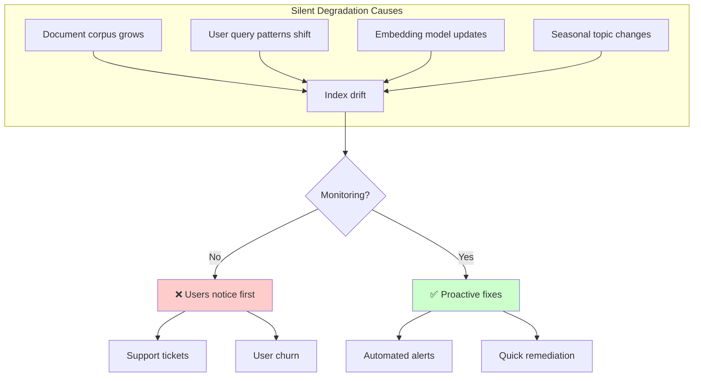
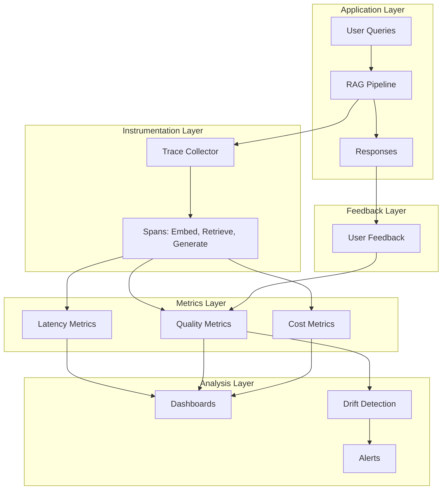

# Continuous Monitoring for Retrieval Systems

## Introduction

Building an evaluation pipeline is only the first step. In production, retrieval systems face **constant change**—user queries evolve, document collections grow, and model performance can silently degrade. Continuous monitoring catches these issues before they impact users.

This lesson covers setting up monitoring infrastructure for embedding-based retrieval, detecting quality degradation, and building feedback loops for continuous improvement.

### What We'll Cover
- Production monitoring architecture
- Query and retrieval drift detection
- Quality degradation alerts
- User feedback integration
- Building monitoring dashboards
- Observability platforms (Phoenix, Langfuse)

### Prerequisites
- Understanding of RAG evaluation metrics (Lessons 01, 06)
- Basic statistics knowledge
- Python and async programming
- Familiarity with logging/metrics systems

---

## Why Continuous Monitoring Matters

Retrieval quality can degrade silently in production:



| Scenario | Without Monitoring | With Monitoring |
|----------|-------------------|-----------------|
| New topic appears | Zero recall for weeks | Alert in hours |
| Index corruption | Silent failures | Immediate detection |
| Latency regression | User complaints | Automatic scaling |
| Embedding drift | Gradual quality drop | Trend alerts |

> **🤖 AI Context:** Unlike traditional search engines, embedding-based retrieval systems can fail in non-obvious ways—returning plausible but incorrect results that users may not immediately recognize as wrong.

---

## Monitoring Architecture

A production retrieval monitoring system has several layers:



### Key Metrics to Track

| Category | Metric | Purpose |
|----------|--------|---------|
| **Latency** | p50, p95, p99 retrieval time | Performance monitoring |
| **Quality** | Faithfulness score (sampled) | Generation quality |
| **Quality** | Context precision (sampled) | Retrieval quality |
| **Usage** | Queries per second | Capacity planning |
| **Cost** | Tokens consumed | Budget tracking |
| **Errors** | Empty results rate | Retrieval failures |
| **Feedback** | User thumbs up/down ratio | Direct quality signal |

---

## Building a Monitoring Pipeline

Let's build a comprehensive monitoring system step by step:

```python
import asyncio
import time
import json
from dataclasses import dataclass, field
from datetime import datetime, timedelta
from typing import Optional, Callable
from collections import defaultdict
import statistics

@dataclass
class RetrievalSpan:
    """A single retrieval operation span."""
    trace_id: str
    query: str
    query_embedding: list[float]
    retrieved_doc_ids: list[str]
    retrieved_scores: list[float]
    latency_ms: float
    timestamp: datetime
    
    # Optional evaluation metrics (sampled)
    faithfulness_score: Optional[float] = None
    context_precision: Optional[float] = None
    user_feedback: Optional[int] = None  # -1, 0, 1

@dataclass
class MetricWindow:
    """Aggregated metrics over a time window."""
    window_start: datetime
    window_end: datetime
    
    # Latency
    latency_p50: float = 0.0
    latency_p95: float = 0.0
    latency_p99: float = 0.0
    
    # Quality (from sampled evaluations)
    avg_faithfulness: Optional[float] = None
    avg_context_precision: Optional[float] = None
    
    # Volume
    query_count: int = 0
    empty_result_count: int = 0
    
    # User feedback
    thumbs_up_count: int = 0
    thumbs_down_count: int = 0
    
    @property
    def empty_result_rate(self) -> float:
        return self.empty_result_count / self.query_count if self.query_count else 0.0
    
    @property
    def positive_feedback_rate(self) -> float:
        total = self.thumbs_up_count + self.thumbs_down_count
        return self.thumbs_up_count / total if total else 0.0

class RetrievalMonitor:
    """
    Production monitoring for retrieval systems.
    
    Tracks latency, quality metrics, and user feedback.
    """
    
    def __init__(
        self,
        evaluation_sample_rate: float = 0.05,  # 5% of queries
        window_size_minutes: int = 15,
        alert_callbacks: list[Callable] = None
    ):
        self.sample_rate = evaluation_sample_rate
        self.window_size = timedelta(minutes=window_size_minutes)
        self.alert_callbacks = alert_callbacks or []
        
        # Storage
        self.spans: list[RetrievalSpan] = []
        self.windows: list[MetricWindow] = []
        
        # Thresholds
        self.thresholds = {
            "latency_p95_ms": 500,
            "empty_result_rate": 0.1,
            "min_faithfulness": 0.7,
            "min_context_precision": 0.6,
            "min_positive_feedback_rate": 0.7
        }
    
    async def record_span(self, span: RetrievalSpan):
        """Record a retrieval span and check for alerts."""
        self.spans.append(span)
        
        # Sample for quality evaluation
        if self._should_sample():
            await self._evaluate_span(span)
        
        # Check if we need to close a window
        await self._maybe_close_window()
    
    def _should_sample(self) -> bool:
        """Determine if this span should be sampled for evaluation."""
        import random
        return random.random() < self.sample_rate
    
    async def _evaluate_span(self, span: RetrievalSpan):
        """Run quality evaluation on sampled span."""
        # In production, this would call RAGAS/DeepEval
        # For demo, we'll use placeholder
        pass
    
    async def _maybe_close_window(self):
        """Check if current window should be closed and analyzed."""
        if not self.spans:
            return
        
        # Find spans in current window
        now = datetime.now()
        window_start = now - self.window_size
        
        window_spans = [
            s for s in self.spans 
            if s.timestamp >= window_start
        ]
        
        if len(window_spans) >= 100:  # Minimum samples
            window = self._aggregate_window(window_spans, window_start, now)
            self.windows.append(window)
            await self._check_alerts(window)
    
    def _aggregate_window(
        self,
        spans: list[RetrievalSpan],
        start: datetime,
        end: datetime
    ) -> MetricWindow:
        """Aggregate spans into a metric window."""
        
        latencies = [s.latency_ms for s in spans]
        
        # Calculate percentiles
        latencies_sorted = sorted(latencies)
        p50_idx = int(len(latencies_sorted) * 0.5)
        p95_idx = int(len(latencies_sorted) * 0.95)
        p99_idx = int(len(latencies_sorted) * 0.99)
        
        # Quality metrics (from sampled spans)
        faith_scores = [
            s.faithfulness_score for s in spans 
            if s.faithfulness_score is not None
        ]
        cp_scores = [
            s.context_precision for s in spans
            if s.context_precision is not None
        ]
        
        # Feedback counts
        feedbacks = [s.user_feedback for s in spans if s.user_feedback is not None]
        
        return MetricWindow(
            window_start=start,
            window_end=end,
            latency_p50=latencies_sorted[p50_idx] if latencies_sorted else 0,
            latency_p95=latencies_sorted[p95_idx] if latencies_sorted else 0,
            latency_p99=latencies_sorted[p99_idx] if latencies_sorted else 0,
            avg_faithfulness=statistics.mean(faith_scores) if faith_scores else None,
            avg_context_precision=statistics.mean(cp_scores) if cp_scores else None,
            query_count=len(spans),
            empty_result_count=sum(1 for s in spans if not s.retrieved_doc_ids),
            thumbs_up_count=sum(1 for f in feedbacks if f == 1),
            thumbs_down_count=sum(1 for f in feedbacks if f == -1)
        )
    
    async def _check_alerts(self, window: MetricWindow):
        """Check window metrics against thresholds and trigger alerts."""
        
        alerts = []
        
        # Latency alert
        if window.latency_p95 > self.thresholds["latency_p95_ms"]:
            alerts.append({
                "type": "latency",
                "severity": "warning",
                "message": f"P95 latency {window.latency_p95:.0f}ms exceeds "
                          f"threshold {self.thresholds['latency_p95_ms']}ms"
            })
        
        # Empty results alert
        if window.empty_result_rate > self.thresholds["empty_result_rate"]:
            alerts.append({
                "type": "retrieval_failure",
                "severity": "critical",
                "message": f"Empty result rate {window.empty_result_rate:.1%} "
                          f"exceeds threshold {self.thresholds['empty_result_rate']:.1%}"
            })
        
        # Quality alerts
        if window.avg_faithfulness and window.avg_faithfulness < self.thresholds["min_faithfulness"]:
            alerts.append({
                "type": "quality",
                "severity": "warning",
                "message": f"Faithfulness {window.avg_faithfulness:.2f} below "
                          f"threshold {self.thresholds['min_faithfulness']}"
            })
        
        # User feedback alert
        if window.positive_feedback_rate < self.thresholds["min_positive_feedback_rate"]:
            alerts.append({
                "type": "user_satisfaction",
                "severity": "warning",
                "message": f"Positive feedback rate {window.positive_feedback_rate:.1%} "
                          f"below threshold"
            })
        
        # Trigger callbacks
        for alert in alerts:
            for callback in self.alert_callbacks:
                await callback(alert)
    
    def get_dashboard_data(self) -> dict:
        """Get data for monitoring dashboard."""
        recent_windows = self.windows[-24:]  # Last 24 windows
        
        return {
            "latency_trend": [
                {"time": w.window_start.isoformat(), "p95": w.latency_p95}
                for w in recent_windows
            ],
            "quality_trend": [
                {
                    "time": w.window_start.isoformat(),
                    "faithfulness": w.avg_faithfulness,
                    "context_precision": w.avg_context_precision
                }
                for w in recent_windows
                if w.avg_faithfulness is not None
            ],
            "volume_trend": [
                {"time": w.window_start.isoformat(), "count": w.query_count}
                for w in recent_windows
            ],
            "feedback_trend": [
                {
                    "time": w.window_start.isoformat(),
                    "positive_rate": w.positive_feedback_rate
                }
                for w in recent_windows
            ]
        }

# Alert callback example
async def slack_alert(alert: dict):
    """Send alert to Slack."""
    print(f"🚨 ALERT [{alert['severity'].upper()}]: {alert['message']}")

# Usage
monitor = RetrievalMonitor(
    evaluation_sample_rate=0.05,
    alert_callbacks=[slack_alert]
)
```

---

## Query Drift Detection

Query drift occurs when user query patterns change over time. Detecting this helps you know when to retrain embeddings or update your index.

```python
import numpy as np
from collections import defaultdict
from scipy.spatial.distance import cosine
from sklearn.cluster import KMeans

class QueryDriftDetector:
    """
    Detect shifts in query distribution over time.
    
    Uses embedding clustering to identify new query patterns.
    """
    
    def __init__(
        self,
        n_clusters: int = 20,
        drift_threshold: float = 0.15,
        baseline_window_days: int = 7
    ):
        self.n_clusters = n_clusters
        self.drift_threshold = drift_threshold
        self.baseline_window_days = baseline_window_days
        
        self.baseline_centroids: np.ndarray = None
        self.baseline_distribution: np.ndarray = None
        self.current_embeddings: list[np.ndarray] = []
    
    def set_baseline(self, embeddings: list[np.ndarray]):
        """
        Set baseline query distribution from historical data.
        
        Args:
            embeddings: List of query embeddings from baseline period
        """
        embeddings_array = np.array(embeddings)
        
        # Cluster baseline queries
        kmeans = KMeans(n_clusters=self.n_clusters, random_state=42)
        labels = kmeans.fit_predict(embeddings_array)
        
        self.baseline_centroids = kmeans.cluster_centers_
        
        # Calculate baseline distribution
        unique, counts = np.unique(labels, return_counts=True)
        self.baseline_distribution = counts / len(labels)
        
        print(f"Baseline set with {len(embeddings)} queries across {self.n_clusters} clusters")
    
    def add_query(self, embedding: np.ndarray):
        """Add a new query embedding to current window."""
        self.current_embeddings.append(embedding)
    
    def calculate_drift(self) -> dict:
        """
        Calculate drift metrics between baseline and current distribution.
        
        Returns:
            Dictionary with drift metrics and alerts
        """
        if self.baseline_centroids is None:
            raise ValueError("Baseline not set. Call set_baseline() first.")
        
        if len(self.current_embeddings) < 100:
            return {"status": "insufficient_data", "count": len(self.current_embeddings)}
        
        current_array = np.array(self.current_embeddings)
        
        # Assign current queries to baseline clusters
        labels = self._assign_to_clusters(current_array, self.baseline_centroids)
        
        # Calculate current distribution
        unique, counts = np.unique(labels, return_counts=True)
        current_distribution = np.zeros(self.n_clusters)
        for u, c in zip(unique, counts):
            current_distribution[u] = c / len(labels)
        
        # Calculate distribution drift (Jensen-Shannon divergence)
        js_divergence = self._jensen_shannon_divergence(
            self.baseline_distribution,
            current_distribution
        )
        
        # Identify emerging clusters (significant increase from baseline)
        emerging_clusters = []
        declining_clusters = []
        
        for i in range(self.n_clusters):
            baseline_pct = self.baseline_distribution[i]
            current_pct = current_distribution[i]
            
            if current_pct > baseline_pct * 1.5 and current_pct > 0.05:
                emerging_clusters.append({
                    "cluster": i,
                    "baseline_pct": baseline_pct,
                    "current_pct": current_pct,
                    "change": current_pct - baseline_pct
                })
            elif current_pct < baseline_pct * 0.5 and baseline_pct > 0.05:
                declining_clusters.append({
                    "cluster": i,
                    "baseline_pct": baseline_pct,
                    "current_pct": current_pct,
                    "change": current_pct - baseline_pct
                })
        
        # Check for out-of-distribution queries
        ood_count = self._count_ood_queries(current_array)
        ood_rate = ood_count / len(current_array)
        
        # Determine if drift is significant
        is_drifted = js_divergence > self.drift_threshold or ood_rate > 0.1
        
        return {
            "status": "drifted" if is_drifted else "stable",
            "js_divergence": js_divergence,
            "threshold": self.drift_threshold,
            "emerging_clusters": emerging_clusters,
            "declining_clusters": declining_clusters,
            "ood_rate": ood_rate,
            "sample_size": len(current_array)
        }
    
    def _assign_to_clusters(
        self,
        embeddings: np.ndarray,
        centroids: np.ndarray
    ) -> np.ndarray:
        """Assign embeddings to nearest cluster centroids."""
        from scipy.spatial.distance import cdist
        distances = cdist(embeddings, centroids, metric='cosine')
        return np.argmin(distances, axis=1)
    
    def _jensen_shannon_divergence(
        self,
        p: np.ndarray,
        q: np.ndarray
    ) -> float:
        """Calculate Jensen-Shannon divergence between distributions."""
        # Add small epsilon to avoid log(0)
        eps = 1e-10
        p = p + eps
        q = q + eps
        
        # Normalize
        p = p / p.sum()
        q = q / q.sum()
        
        # Calculate JSD
        m = 0.5 * (p + q)
        jsd = 0.5 * (
            np.sum(p * np.log(p / m)) + 
            np.sum(q * np.log(q / m))
        )
        
        return float(jsd)
    
    def _count_ood_queries(
        self,
        embeddings: np.ndarray,
        distance_threshold: float = 0.5
    ) -> int:
        """Count queries that are far from all cluster centroids."""
        from scipy.spatial.distance import cdist
        distances = cdist(embeddings, self.baseline_centroids, metric='cosine')
        min_distances = np.min(distances, axis=1)
        return int(np.sum(min_distances > distance_threshold))
    
    def reset_current_window(self):
        """Reset current window for new measurement period."""
        self.current_embeddings = []

# Usage example
def demo_drift_detection():
    """Demonstrate query drift detection."""
    
    detector = QueryDriftDetector(n_clusters=10, drift_threshold=0.1)
    
    # Simulate baseline embeddings (e.g., from last week)
    np.random.seed(42)
    baseline_embeddings = [
        np.random.randn(384) for _ in range(1000)
    ]
    detector.set_baseline(baseline_embeddings)
    
    # Simulate current queries (some drift introduced)
    current_embeddings = [
        np.random.randn(384) + 0.5  # Shifted distribution
        for _ in range(200)
    ]
    
    for emb in current_embeddings:
        detector.add_query(emb)
    
    drift_report = detector.calculate_drift()
    
    print(f"\nDrift Report:")
    print(f"  Status: {drift_report['status']}")
    print(f"  JS Divergence: {drift_report['js_divergence']:.4f}")
    print(f"  OOD Rate: {drift_report['ood_rate']:.2%}")
    print(f"  Emerging Clusters: {len(drift_report['emerging_clusters'])}")
    print(f"  Declining Clusters: {len(drift_report['declining_clusters'])}")

# demo_drift_detection()
```

---

## Retrieval Quality Degradation Alerts

Set up automated alerts for quality degradation:

```python
from dataclasses import dataclass
from datetime import datetime, timedelta
from typing import Callable, Optional
from enum import Enum

class AlertSeverity(Enum):
    INFO = "info"
    WARNING = "warning"
    CRITICAL = "critical"

@dataclass
class QualityAlert:
    """A quality degradation alert."""
    severity: AlertSeverity
    metric: str
    current_value: float
    threshold: float
    baseline_value: float
    timestamp: datetime
    message: str
    
    def to_dict(self) -> dict:
        return {
            "severity": self.severity.value,
            "metric": self.metric,
            "current_value": self.current_value,
            "threshold": self.threshold,
            "baseline_value": self.baseline_value,
            "timestamp": self.timestamp.isoformat(),
            "message": self.message
        }

class QualityDegradationDetector:
    """
    Detect quality degradation using statistical process control.
    
    Uses control charts and trend analysis to detect issues.
    """
    
    def __init__(
        self,
        baseline_mean: dict[str, float],
        baseline_std: dict[str, float],
        alert_callback: Callable[[QualityAlert], None] = None
    ):
        """
        Initialize detector with baseline statistics.
        
        Args:
            baseline_mean: Mean values for each metric from baseline period
            baseline_std: Standard deviation for each metric
            alert_callback: Function to call when alert is triggered
        """
        self.baseline_mean = baseline_mean
        self.baseline_std = baseline_std
        self.alert_callback = alert_callback
        
        # Track recent values for trend detection
        self.recent_values: dict[str, list[float]] = defaultdict(list)
        self.window_size = 20  # Number of recent samples to consider
        
        # Control chart parameters
        self.warning_sigma = 2.0  # 2 sigma = warning
        self.critical_sigma = 3.0  # 3 sigma = critical
    
    def record_metric(self, metric: str, value: float) -> Optional[QualityAlert]:
        """
        Record a metric value and check for degradation.
        
        Args:
            metric: Name of the metric
            value: Current value
            
        Returns:
            QualityAlert if degradation detected, None otherwise
        """
        if metric not in self.baseline_mean:
            return None
        
        # Add to recent values
        self.recent_values[metric].append(value)
        if len(self.recent_values[metric]) > self.window_size:
            self.recent_values[metric].pop(0)
        
        # Check control limits
        alert = self._check_control_limits(metric, value)
        if alert:
            if self.alert_callback:
                self.alert_callback(alert)
            return alert
        
        # Check for trend
        alert = self._check_trend(metric)
        if alert:
            if self.alert_callback:
                self.alert_callback(alert)
            return alert
        
        return None
    
    def _check_control_limits(
        self,
        metric: str,
        value: float
    ) -> Optional[QualityAlert]:
        """Check if value exceeds control limits."""
        
        mean = self.baseline_mean[metric]
        std = self.baseline_std[metric]
        
        # Calculate z-score
        z_score = abs(value - mean) / std if std > 0 else 0
        
        # For metrics where lower is worse (like faithfulness)
        # we care about values below the mean
        is_degradation = value < mean
        
        if z_score >= self.critical_sigma and is_degradation:
            return QualityAlert(
                severity=AlertSeverity.CRITICAL,
                metric=metric,
                current_value=value,
                threshold=mean - self.critical_sigma * std,
                baseline_value=mean,
                timestamp=datetime.now(),
                message=f"CRITICAL: {metric} at {value:.3f} is {z_score:.1f}σ "
                       f"below baseline ({mean:.3f})"
            )
        elif z_score >= self.warning_sigma and is_degradation:
            return QualityAlert(
                severity=AlertSeverity.WARNING,
                metric=metric,
                current_value=value,
                threshold=mean - self.warning_sigma * std,
                baseline_value=mean,
                timestamp=datetime.now(),
                message=f"WARNING: {metric} at {value:.3f} is {z_score:.1f}σ "
                       f"below baseline ({mean:.3f})"
            )
        
        return None
    
    def _check_trend(self, metric: str) -> Optional[QualityAlert]:
        """
        Check for downward trend using run rules.
        
        Alert if 7 consecutive points are below the mean.
        """
        values = self.recent_values[metric]
        if len(values) < 7:
            return None
        
        mean = self.baseline_mean[metric]
        
        # Check if last 7 points are all below mean
        last_7 = values[-7:]
        if all(v < mean for v in last_7):
            return QualityAlert(
                severity=AlertSeverity.WARNING,
                metric=metric,
                current_value=last_7[-1],
                threshold=mean,
                baseline_value=mean,
                timestamp=datetime.now(),
                message=f"TREND: {metric} has been below baseline for 7 "
                       f"consecutive measurements (current: {last_7[-1]:.3f}, "
                       f"baseline: {mean:.3f})"
            )
        
        return None

# Example usage
def demo_degradation_detection():
    """Demonstrate quality degradation detection."""
    
    # Baseline statistics (from evaluation period)
    baseline_mean = {
        "faithfulness": 0.85,
        "context_precision": 0.78,
        "answer_relevancy": 0.82
    }
    baseline_std = {
        "faithfulness": 0.05,
        "context_precision": 0.08,
        "answer_relevancy": 0.06
    }
    
    def print_alert(alert: QualityAlert):
        print(f"🚨 {alert.message}")
    
    detector = QualityDegradationDetector(
        baseline_mean=baseline_mean,
        baseline_std=baseline_std,
        alert_callback=print_alert
    )
    
    # Simulate normal values
    print("Recording normal values...")
    for _ in range(5):
        detector.record_metric("faithfulness", 0.84)
    
    # Simulate degradation
    print("\nRecording degraded values...")
    detector.record_metric("faithfulness", 0.72)  # Below 2σ
    detector.record_metric("faithfulness", 0.68)  # Below 3σ

# demo_degradation_detection()
```

---

## User Feedback Integration

User feedback provides ground truth for retrieval quality:

```python
from dataclasses import dataclass
from datetime import datetime
from typing import Optional
import uuid

@dataclass
class UserFeedback:
    """User feedback on a retrieval result."""
    trace_id: str
    feedback_type: str  # "thumbs", "rating", "correction"
    value: int  # -1/0/1 for thumbs, 1-5 for rating
    comment: Optional[str] = None
    timestamp: datetime = field(default_factory=datetime.now)

class FeedbackCollector:
    """
    Collect and analyze user feedback for retrieval quality.
    """
    
    def __init__(self):
        self.feedback: list[UserFeedback] = []
        self.trace_to_query: dict[str, str] = {}  # Map traces to queries
    
    def record_query(self, trace_id: str, query: str):
        """Record a query for later feedback correlation."""
        self.trace_to_query[trace_id] = query
    
    def record_feedback(
        self,
        trace_id: str,
        feedback_type: str,
        value: int,
        comment: Optional[str] = None
    ):
        """Record user feedback."""
        feedback = UserFeedback(
            trace_id=trace_id,
            feedback_type=feedback_type,
            value=value,
            comment=comment
        )
        self.feedback.append(feedback)
    
    def get_feedback_stats(
        self,
        since: Optional[datetime] = None
    ) -> dict:
        """Get aggregated feedback statistics."""
        
        relevant_feedback = self.feedback
        if since:
            relevant_feedback = [
                f for f in self.feedback 
                if f.timestamp >= since
            ]
        
        thumbs_feedback = [
            f for f in relevant_feedback 
            if f.feedback_type == "thumbs"
        ]
        
        if not thumbs_feedback:
            return {"status": "no_feedback"}
        
        positive = sum(1 for f in thumbs_feedback if f.value == 1)
        negative = sum(1 for f in thumbs_feedback if f.value == -1)
        total = len(thumbs_feedback)
        
        # Extract common issues from negative feedback comments
        negative_comments = [
            f.comment for f in thumbs_feedback 
            if f.value == -1 and f.comment
        ]
        
        return {
            "total_feedback": total,
            "positive_count": positive,
            "negative_count": negative,
            "positive_rate": positive / total if total else 0,
            "negative_comments_sample": negative_comments[:10]
        }
    
    def get_worst_queries(self, n: int = 10) -> list[dict]:
        """Get queries with most negative feedback."""
        
        query_feedback: dict[str, list[int]] = defaultdict(list)
        
        for f in self.feedback:
            if f.trace_id in self.trace_to_query:
                query = self.trace_to_query[f.trace_id]
                query_feedback[query].append(f.value)
        
        # Calculate average feedback per query
        query_scores = []
        for query, values in query_feedback.items():
            if len(values) >= 3:  # Minimum feedback count
                avg_score = sum(values) / len(values)
                query_scores.append({
                    "query": query,
                    "avg_score": avg_score,
                    "feedback_count": len(values)
                })
        
        # Sort by worst score
        query_scores.sort(key=lambda x: x["avg_score"])
        
        return query_scores[:n]

# Integration with evaluation pipeline
class FeedbackDrivenEvaluation:
    """
    Use user feedback to trigger detailed evaluation.
    
    Runs full RAGAS evaluation on queries with negative feedback.
    """
    
    def __init__(
        self,
        feedback_collector: FeedbackCollector,
        negative_threshold: int = 3  # Trigger after N negative feedbacks
    ):
        self.feedback_collector = feedback_collector
        self.negative_threshold = negative_threshold
        self.evaluated_queries: set[str] = set()
    
    async def process_feedback(self, trace_id: str, value: int):
        """Process feedback and potentially trigger evaluation."""
        
        if value == -1:  # Negative feedback
            query = self.feedback_collector.trace_to_query.get(trace_id)
            
            if query and query not in self.evaluated_queries:
                # Count negative feedback for this query pattern
                negative_count = self._count_similar_negatives(query)
                
                if negative_count >= self.negative_threshold:
                    await self._trigger_evaluation(query)
                    self.evaluated_queries.add(query)
    
    def _count_similar_negatives(self, query: str) -> int:
        """Count negative feedback for similar queries."""
        count = 0
        for f in self.feedback_collector.feedback:
            if f.value == -1:
                stored_query = self.feedback_collector.trace_to_query.get(f.trace_id)
                if stored_query == query:  # Exact match (could use similarity)
                    count += 1
        return count
    
    async def _trigger_evaluation(self, query: str):
        """Run detailed evaluation on problematic query."""
        print(f"🔍 Triggering detailed evaluation for: {query[:50]}...")
        # In production: run RAGAS evaluation, log results, alert team
```

---

## Observability Platforms

### Arize Phoenix Integration

Phoenix provides tracing and evaluation for LLM applications:

```python
# pip install arize-phoenix openinference-instrumentation-openai

import phoenix as px
from openinference.instrumentation.openai import OpenAIInstrumentor
from opentelemetry import trace as trace_api
from opentelemetry.sdk.trace import TracerProvider

def setup_phoenix():
    """Initialize Phoenix for LLM tracing."""
    
    # Start Phoenix
    session = px.launch_app()
    print(f"Phoenix UI: {session.url}")
    
    # Setup tracing
    tracer_provider = TracerProvider()
    trace_api.set_tracer_provider(tracer_provider)
    
    # Instrument OpenAI
    OpenAIInstrumentor().instrument()
    
    return session

# Span annotation for retrieval
from opentelemetry import trace

def trace_retrieval(func):
    """Decorator to trace retrieval operations."""
    async def wrapper(*args, **kwargs):
        tracer = trace.get_tracer(__name__)
        
        with tracer.start_as_current_span("retrieval") as span:
            # Add retrieval attributes
            span.set_attribute("retrieval.query", kwargs.get("query", ""))
            span.set_attribute("retrieval.top_k", kwargs.get("top_k", 10))
            
            result = await func(*args, **kwargs)
            
            # Add result attributes
            span.set_attribute("retrieval.num_results", len(result))
            span.set_attribute(
                "retrieval.scores", 
                [r.get("score", 0) for r in result[:5]]
            )
            
            return result
    
    return wrapper
```

### Langfuse Integration

Langfuse provides comprehensive LLM observability:

```python
# pip install langfuse

from langfuse import Langfuse
from langfuse.decorators import observe, langfuse_context

# Initialize Langfuse
langfuse = Langfuse(
    public_key="pk-...",
    secret_key="sk-...",
    host="https://cloud.langfuse.com"
)

@observe()
def rag_pipeline(query: str) -> str:
    """RAG pipeline with Langfuse tracing."""
    
    # Trace retrieval
    with langfuse_context.span(name="retrieval") as span:
        docs = retrieve_documents(query)
        span.update(
            input={"query": query},
            output={"num_docs": len(docs)},
            metadata={"top_score": docs[0]["score"] if docs else 0}
        )
    
    # Trace generation
    with langfuse_context.span(name="generation") as span:
        response = generate_response(query, docs)
        span.update(
            input={"query": query, "context_length": sum(len(d["text"]) for d in docs)},
            output={"response": response}
        )
    
    return response

# Score traces for evaluation
def score_trace(trace_id: str, scores: dict[str, float]):
    """Add evaluation scores to a trace."""
    for name, value in scores.items():
        langfuse.score(
            trace_id=trace_id,
            name=name,
            value=value
        )

# Example: Score after async evaluation
async def evaluate_and_score(trace_id: str, query: str, response: str, contexts: list[str]):
    """Run evaluation and score the trace."""
    
    # Run RAGAS evaluation
    scores = await run_ragas_evaluation(query, response, contexts)
    
    # Score the trace
    score_trace(trace_id, {
        "faithfulness": scores["faithfulness"],
        "context_precision": scores["context_precision"],
        "answer_relevancy": scores["answer_relevancy"]
    })
```

---

## Dashboard Design

Essential dashboard components for retrieval monitoring:

```python
from dataclasses import dataclass
from datetime import datetime, timedelta
from typing import Any

@dataclass
class DashboardConfig:
    """Configuration for monitoring dashboard."""
    
    # Time ranges
    default_range_hours: int = 24
    
    # Panels
    panels: list[dict] = field(default_factory=lambda: [
        {
            "title": "Query Volume",
            "type": "timeseries",
            "metric": "query_count",
            "aggregation": "sum"
        },
        {
            "title": "Retrieval Latency",
            "type": "timeseries",
            "metric": "latency_ms",
            "aggregation": "percentile",
            "percentiles": [50, 95, 99]
        },
        {
            "title": "Quality Scores",
            "type": "timeseries",
            "metric": ["faithfulness", "context_precision", "answer_relevancy"],
            "aggregation": "mean"
        },
        {
            "title": "Empty Results Rate",
            "type": "gauge",
            "metric": "empty_result_rate",
            "thresholds": [0.05, 0.10, 0.20]
        },
        {
            "title": "User Feedback",
            "type": "pie",
            "metric": "feedback",
            "segments": ["positive", "neutral", "negative"]
        },
        {
            "title": "Query Drift Score",
            "type": "gauge",
            "metric": "js_divergence",
            "thresholds": [0.05, 0.10, 0.15]
        }
    ])

def generate_dashboard_json(config: DashboardConfig) -> dict:
    """
    Generate Grafana-style dashboard JSON.
    
    Can be used with Grafana, custom dashboards, or as API spec.
    """
    
    return {
        "title": "RAG System Monitoring",
        "refresh": "30s",
        "time": {
            "from": f"now-{config.default_range_hours}h",
            "to": "now"
        },
        "panels": [
            {
                "id": i,
                **panel,
                "gridPos": {
                    "x": (i % 3) * 8,
                    "y": (i // 3) * 6,
                    "w": 8,
                    "h": 6
                }
            }
            for i, panel in enumerate(config.panels)
        ],
        "annotations": {
            "list": [
                {
                    "name": "Deployments",
                    "datasource": "-- Grafana --",
                    "enable": True,
                    "hide": False
                },
                {
                    "name": "Alerts",
                    "datasource": "-- Grafana --",
                    "enable": True
                }
            ]
        }
    }

# Streamlit dashboard example
def create_streamlit_dashboard():
    """
    Create monitoring dashboard with Streamlit.
    
    Run with: streamlit run dashboard.py
    """
    
    streamlit_code = '''
import streamlit as st
import pandas as pd
import plotly.express as px
from datetime import datetime, timedelta

st.set_page_config(page_title="RAG Monitoring", layout="wide")

st.title("🔍 RAG System Monitoring")

# Sidebar controls
st.sidebar.header("Settings")
time_range = st.sidebar.selectbox(
    "Time Range",
    ["Last 1 hour", "Last 6 hours", "Last 24 hours", "Last 7 days"]
)

# Metrics row
col1, col2, col3, col4 = st.columns(4)

with col1:
    st.metric(
        label="Query Volume",
        value="12,543",
        delta="+8.2%"
    )

with col2:
    st.metric(
        label="P95 Latency",
        value="342ms",
        delta="-12ms"
    )

with col3:
    st.metric(
        label="Faithfulness",
        value="0.87",
        delta="+0.02"
    )

with col4:
    st.metric(
        label="User Satisfaction",
        value="92%",
        delta="+1%"
    )

# Charts
col1, col2 = st.columns(2)

with col1:
    st.subheader("Latency Over Time")
    # Placeholder for real data
    df = pd.DataFrame({
        "time": pd.date_range(end=datetime.now(), periods=24, freq="H"),
        "p50": [120 + i*2 for i in range(24)],
        "p95": [280 + i*3 for i in range(24)],
        "p99": [450 + i*5 for i in range(24)]
    })
    fig = px.line(df, x="time", y=["p50", "p95", "p99"])
    st.plotly_chart(fig, use_container_width=True)

with col2:
    st.subheader("Quality Metrics")
    df = pd.DataFrame({
        "time": pd.date_range(end=datetime.now(), periods=24, freq="H"),
        "faithfulness": [0.85 + 0.01*i for i in range(24)],
        "context_precision": [0.78 + 0.005*i for i in range(24)],
        "answer_relevancy": [0.82 + 0.008*i for i in range(24)]
    })
    fig = px.line(df, x="time", y=["faithfulness", "context_precision", "answer_relevancy"])
    st.plotly_chart(fig, use_container_width=True)

# Alerts section
st.subheader("Recent Alerts")
alerts_df = pd.DataFrame({
    "Time": ["10:30 AM", "09:15 AM", "Yesterday"],
    "Severity": ["⚠️ Warning", "🔴 Critical", "ℹ️ Info"],
    "Message": [
        "Faithfulness below threshold (0.72)",
        "Empty result rate spike (15%)",
        "Query drift detected in cluster 3"
    ]
})
st.table(alerts_df)
'''
    
    return streamlit_code
```

---

## Best Practices

### Monitoring Checklist

| Category | Item | Frequency |
|----------|------|-----------|
| **Real-time** | Query latency | Every request |
| **Real-time** | Error rates | Every request |
| **Sampled** | Quality scores | 5% of requests |
| **Periodic** | Query drift | Hourly |
| **Periodic** | Index health | Daily |
| **Event-driven** | User feedback | On submission |

### Alert Configuration

| Alert | Threshold | Severity | Response |
|-------|-----------|----------|----------|
| P95 latency > 500ms | Immediate | Warning | Scale up |
| P99 latency > 2s | Immediate | Critical | Investigate |
| Empty results > 10% | 15 min average | Critical | Check index |
| Faithfulness < 0.7 | 1 hour average | Warning | Review prompts |
| Query drift > 0.15 | Daily | Info | Plan retraining |

### Common Pitfalls

| ❌ Mistake | ✅ Solution |
|-----------|-------------|
| Alert on every metric dip | Use statistical thresholds (σ) |
| Sample too many queries | 5-10% is usually sufficient |
| Ignore user feedback | Prioritize fixing negative feedback |
| No baseline comparison | Establish baselines before alerting |
| Dashboard overload | Focus on 5-7 key metrics |

---

## Hands-on Exercise

### Your Task

Build a monitoring system that:
1. Tracks retrieval latency and quality metrics
2. Detects query drift using embedding clustering
3. Generates alerts when metrics exceed thresholds
4. Produces a daily summary report

### Requirements

1. Implement `RetrievalMonitor` with configurable thresholds
2. Add `QueryDriftDetector` with baseline comparison
3. Create alert callbacks for Slack/email (mock OK)
4. Generate markdown summary report

### Expected Result

A monitoring system that processes simulated traffic and generates alerts/reports.

<details>
<summary>💡 Hints (click to expand)</summary>

- Use `asyncio` for concurrent metric collection
- Store metrics in time windows for aggregation
- Calculate drift using Jensen-Shannon divergence
- Format reports with tables and trend indicators

</details>

<details>
<summary>✅ Solution (click to expand)</summary>

```python
import asyncio
from datetime import datetime, timedelta
from dataclasses import dataclass, field
from typing import Callable
import numpy as np
import statistics

@dataclass
class MonitoringConfig:
    latency_p95_threshold_ms: float = 500
    empty_result_threshold: float = 0.1
    faithfulness_threshold: float = 0.7
    drift_threshold: float = 0.15
    sample_rate: float = 0.05
    window_size_minutes: int = 15

class ComprehensiveMonitor:
    """Complete monitoring solution for retrieval systems."""
    
    def __init__(
        self,
        config: MonitoringConfig,
        alert_callback: Callable[[dict], None]
    ):
        self.config = config
        self.alert_callback = alert_callback
        
        # Storage
        self.latencies: list[float] = []
        self.quality_scores: list[dict] = []
        self.query_embeddings: list[np.ndarray] = []
        self.alerts_today: list[dict] = []
        
        # Baseline (would be loaded from storage)
        self.baseline_centroids = None
        self.baseline_distribution = None
    
    async def record_request(
        self,
        latency_ms: float,
        num_results: int,
        query_embedding: np.ndarray,
        quality_scores: dict = None
    ):
        """Record a single request."""
        self.latencies.append(latency_ms)
        self.query_embeddings.append(query_embedding)
        
        if quality_scores:
            self.quality_scores.append({
                **quality_scores,
                "timestamp": datetime.now()
            })
        
        # Check for immediate alerts
        if num_results == 0:
            await self._check_empty_results()
    
    async def _check_empty_results(self):
        """Check empty result rate."""
        # Calculate recent rate
        # ... implementation
        pass
    
    def calculate_drift(self) -> float:
        """Calculate query drift score."""
        if len(self.query_embeddings) < 100:
            return 0.0
        
        # Use K-means clustering comparison
        # ... implementation as shown earlier
        return 0.0
    
    def generate_daily_report(self) -> str:
        """Generate daily monitoring report."""
        
        # Calculate statistics
        if self.latencies:
            latencies_sorted = sorted(self.latencies)
            p50 = latencies_sorted[int(len(latencies_sorted) * 0.5)]
            p95 = latencies_sorted[int(len(latencies_sorted) * 0.95)]
            p99 = latencies_sorted[int(len(latencies_sorted) * 0.99)]
        else:
            p50 = p95 = p99 = 0
        
        # Quality averages
        if self.quality_scores:
            avg_faith = statistics.mean(
                s.get("faithfulness", 0) for s in self.quality_scores
            )
            avg_cp = statistics.mean(
                s.get("context_precision", 0) for s in self.quality_scores
            )
        else:
            avg_faith = avg_cp = 0
        
        drift_score = self.calculate_drift()
        
        # Generate report
        report = f"""# Daily Monitoring Report

**Date:** {datetime.now().strftime("%Y-%m-%d")}
**Generated:** {datetime.now().strftime("%H:%M:%S")}

## Summary

| Metric | Value | Status |
|--------|-------|--------|
| Total Requests | {len(self.latencies)} | — |
| P50 Latency | {p50:.0f}ms | {"✅" if p50 < 200 else "⚠️"} |
| P95 Latency | {p95:.0f}ms | {"✅" if p95 < self.config.latency_p95_threshold_ms else "❌"} |
| P99 Latency | {p99:.0f}ms | {"✅" if p99 < 1000 else "⚠️"} |
| Avg Faithfulness | {avg_faith:.3f} | {"✅" if avg_faith >= self.config.faithfulness_threshold else "❌"} |
| Avg Context Precision | {avg_cp:.3f} | {"✅" if avg_cp >= 0.7 else "⚠️"} |
| Query Drift | {drift_score:.3f} | {"✅" if drift_score < self.config.drift_threshold else "⚠️"} |

## Alerts Today

| Time | Severity | Message |
|------|----------|---------|
"""
        
        for alert in self.alerts_today[-10:]:
            report += f"| {alert['time']} | {alert['severity']} | {alert['message']} |\n"
        
        if not self.alerts_today:
            report += "| — | — | No alerts today |\n"
        
        report += """
## Recommendations

"""
        
        if p95 >= self.config.latency_p95_threshold_ms:
            report += "- ⚠️ Consider scaling retrieval infrastructure\n"
        if avg_faith < self.config.faithfulness_threshold:
            report += "- ⚠️ Review generation prompts for groundedness\n"
        if drift_score >= self.config.drift_threshold:
            report += "- ⚠️ Consider retraining embeddings on recent queries\n"
        if not any([
            p95 >= self.config.latency_p95_threshold_ms,
            avg_faith < self.config.faithfulness_threshold,
            drift_score >= self.config.drift_threshold
        ]):
            report += "- ✅ System operating within normal parameters\n"
        
        return report

# Run monitoring demo
async def run_monitoring_demo():
    def alert_handler(alert):
        print(f"🚨 ALERT: {alert}")
    
    config = MonitoringConfig()
    monitor = ComprehensiveMonitor(config, alert_handler)
    
    # Simulate traffic
    np.random.seed(42)
    for _ in range(500):
        await monitor.record_request(
            latency_ms=np.random.normal(200, 50),
            num_results=np.random.choice([0, 5, 10], p=[0.05, 0.3, 0.65]),
            query_embedding=np.random.randn(384),
            quality_scores={
                "faithfulness": np.random.normal(0.85, 0.05),
                "context_precision": np.random.normal(0.78, 0.08)
            } if np.random.random() < 0.05 else None
        )
    
    # Generate report
    report = monitor.generate_daily_report()
    print(report)
    
    # Save report
    with open("monitoring_report.md", "w") as f:
        f.write(report)

# asyncio.run(run_monitoring_demo())
```

</details>

### Bonus Challenges

- [ ] Integrate with Prometheus for metrics export
- [ ] Add anomaly detection using isolation forests
- [ ] Create PagerDuty integration for critical alerts
- [ ] Build a Streamlit real-time dashboard

---

## Summary

✅ Continuous monitoring catches silent degradation before users notice

✅ Track latency, quality metrics, and user feedback across time windows

✅ Query drift detection identifies when retraining or index updates are needed

✅ Statistical process control (control charts) provides robust alerting

✅ Observability platforms (Phoenix, Langfuse) simplify instrumentation

✅ Daily reports and dashboards give visibility into system health

**Next:** Return to [Evaluation & Benchmarking Overview](./00-evaluation-benchmarking.md)

---

## Further Reading

- [Langfuse Documentation](https://langfuse.com/docs) - Open-source LLM observability
- [Arize Phoenix](https://arize.com/docs/phoenix/) - ML observability with tracing
- [Statistical Process Control](https://en.wikipedia.org/wiki/Statistical_process_control) - Control chart theory
- [Jensen-Shannon Divergence](https://en.wikipedia.org/wiki/Jensen%E2%80%93Shannon_divergence) - Distribution comparison

---

<!-- 
Sources Consulted:
- Langfuse Documentation: https://langfuse.com/docs
- Arize Phoenix: https://arize.com/docs/phoenix/
- Statistical Process Control concepts
- Production ML monitoring best practices
-->
