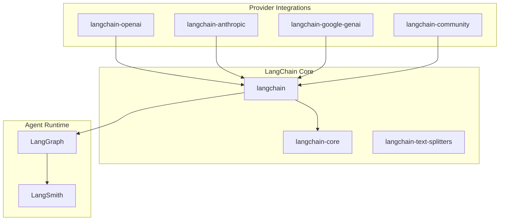
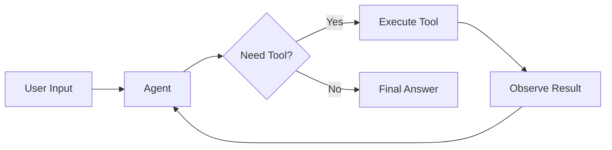

# 8.1 LangChain Fundamentals

## Overview

LangChain is the most widely adopted open-source framework for building LLM-powered applications. It provides a unified interface to interact with language models from various providers, pre-built patterns for common AI workflows, and the flexibility to customize behavior at every level.

> **🤖 AI Context:** LangChain has evolved significantly since its 2022 launch. As of 2025, agents built with LangChain are powered by **LangGraph** for durable, stateful execution. This lesson covers the foundational concepts you need before building sophisticated agent systems.

### Why LangChain Matters

| Benefit | Description |
|---------|-------------|
| **Provider Abstraction** | Single interface for OpenAI, Anthropic, Google, AWS, and 100+ model providers |
| **Production Patterns** | Built-in support for streaming, retries, fallbacks, and error handling |
| **Ecosystem Integration** | 1,000+ integrations with document loaders, vector stores, and tools |
| **Agent Foundation** | `create_agent` enables building production-ready AI agents in <10 lines |
| **Observability** | Native LangSmith integration for debugging and monitoring |

### What We'll Cover

This lesson provides a comprehensive introduction to LangChain's architecture and core concepts:

| Sub-topic | Description |
|-----------|-------------|
| [Architecture Overview](./01-architecture-overview.md) | Package structure, component design, and extensibility patterns |
| [Installation and Setup](./02-installation-and-setup.md) | Installing LangChain, provider packages, and API configuration |
| [LCEL Fundamentals](./03-lcel-fundamentals.md) | LangChain Expression Language and the Runnable protocol |
| [Core Abstractions](./04-core-abstractions.md) | RunnablePassthrough, RunnableLambda, RunnableParallel, and more |
| [Model Wrappers](./05-model-wrappers.md) | Initializing and configuring chat models from any provider |
| [Debugging and Tracing](./06-debugging-and-tracing.md) | LangSmith integration, callbacks, and execution tracing |

### Prerequisites

Before starting this lesson, you should have:

- ✅ Strong Python fundamentals (Unit 2)
- ✅ Understanding of AI/LLM concepts (Unit 3)
- ✅ Experience with API integration (Unit 4)
- ✅ Basic prompt engineering knowledge (Unit 6)
- ✅ Python 3.10+ installed on your system
- ✅ API keys from at least one model provider (OpenAI, Anthropic, etc.)

### Learning Objectives

By the end of this lesson, you will be able to:

1. **Understand LangChain's architecture** — Package structure, component relationships, and design philosophy
2. **Set up a LangChain development environment** — Install packages, configure API keys, and verify installation
3. **Use LCEL to compose workflows** — Chain components with the pipe operator and Runnable protocol
4. **Work with core abstractions** — Apply RunnablePassthrough, RunnableLambda, and RunnableParallel
5. **Initialize and configure models** — Use `init_chat_model` and provider-specific classes
6. **Debug LangChain applications** — Leverage LangSmith, callbacks, and tracing for observability

---

## Quick Start: Your First LangChain Agent

Before diving deep, let's see what you can build with LangChain in just a few lines:

```python
# Install: pip install langchain langchain-openai

import os
from langchain.agents import create_agent

# Set your API key
os.environ["OPENAI_API_KEY"] = "your-key-here"

# Define a simple tool
def get_weather(city: str) -> str:
    """Get weather for a given city."""
    return f"It's sunny in {city}!"

# Create an agent with one line
agent = create_agent(
    model="gpt-4o",
    tools=[get_weather],
    system_prompt="You are a helpful assistant."
)

# Run the agent
result = agent.invoke({
    "messages": [{"role": "user", "content": "What's the weather in San Francisco?"}]
})

print(result["messages"][-1].content)
```

**Output:**
```
The weather in San Francisco is sunny!
```

> **Note:** This simple example demonstrates the power of LangChain's abstractions. The agent automatically:
> - Interprets the user's intent
> - Decides to call the `get_weather` tool
> - Formats and returns a natural response

---

## LangChain Ecosystem at a Glance



| Package | Purpose | When to Install |
|---------|---------|-----------------|
| `langchain` | Main framework with agents, chains, and tools | Always |
| `langchain-core` | Base abstractions (Runnables, Messages) | Installed with langchain |
| `langchain-openai` | OpenAI integration | When using OpenAI models |
| `langchain-anthropic` | Anthropic integration | When using Claude models |
| `langchain-google-genai` | Google Gemini integration | When using Gemini models |
| `langchain-community` | Community integrations | When using third-party tools |
| `langgraph` | Agent orchestration runtime | For advanced agent patterns |
| `langsmith` | Observability and debugging | For production applications |

---

## Key Concepts Preview

### The Runnable Protocol

Everything in LangChain implements the **Runnable** interface, providing three key methods:

```python
# All Runnables support these methods:
runnable.invoke(input)        # Single input, single output
runnable.batch([inputs])      # Multiple inputs in parallel
runnable.stream(input)        # Stream output as generated
```

### LangChain Expression Language (LCEL)

LCEL uses the pipe operator (`|`) to chain components together:

```python
from langchain.prompts import ChatPromptTemplate
from langchain.chat_models import init_chat_model
from langchain_core.output_parsers import StrOutputParser

# Chain: prompt → model → parser
chain = (
    ChatPromptTemplate.from_template("Tell me about {topic}")
    | init_chat_model("gpt-4o")
    | StrOutputParser()
)

result = chain.invoke({"topic": "LangChain"})
```

### Agent Architecture

LangChain agents follow the **ReAct** (Reasoning + Acting) pattern:



---

## Summary

✅ LangChain is the leading framework for building LLM-powered applications  
✅ The 2025 architecture centers on `create_agent` backed by LangGraph  
✅ Modular packages allow installing only what you need  
✅ Everything implements the Runnable protocol (`invoke`, `batch`, `stream`)  
✅ LCEL enables declarative composition with the pipe operator  
✅ LangSmith provides production-grade observability  

**Next:** [Architecture Overview](./01-architecture-overview.md) — Deep dive into LangChain's component design and package structure

---

## Navigation

| Previous | Up | Next |
|----------|-----|------|
| [Unit Overview](../00-overview.md) | [Unit 8: LangChain & LlamaIndex](../00-overview.md) | [Architecture Overview](./01-architecture-overview.md) |

<!-- 
Sources Consulted:
- LangChain Overview: https://docs.langchain.com/oss/python/langchain/overview
- LangChain Quickstart: https://docs.langchain.com/oss/python/langchain/quickstart
- LangChain Install: https://docs.langchain.com/oss/python/langchain/install
- LangChain Agents: https://docs.langchain.com/oss/python/langchain/agents
-->
