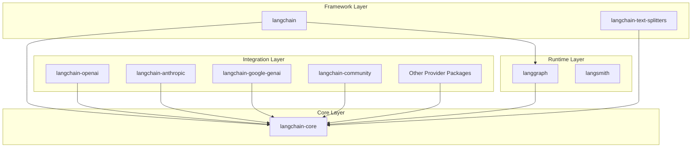
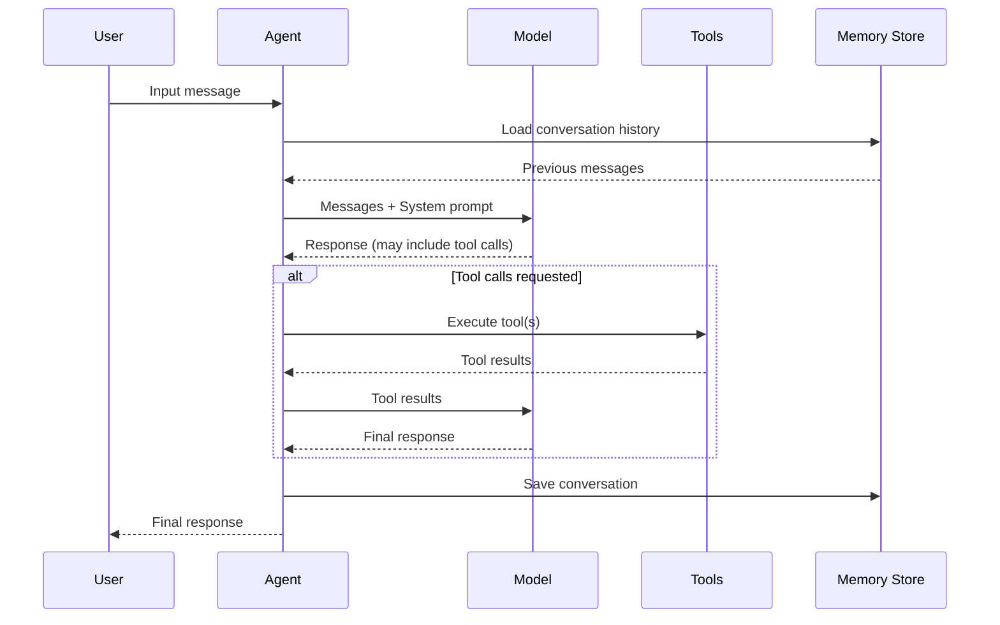

# Architecture Overview

## Introduction

Understanding LangChain's architecture is essential for building effective AI applications. The framework has evolved from a monolithic library into a modular ecosystem designed around **composability**, **provider abstraction**, and **production readiness**.

This section explains how LangChain's components fit together, why the package structure is organized the way it is, and how you can extend the framework for your specific needs.

### What We'll Cover

- LangChain's design philosophy and core principles
- Package structure and dependencies
- Component relationships and data flow
- Extensibility patterns for customization
- How agents integrate with the architecture

### Prerequisites

- Basic understanding of Python package management
- Familiarity with object-oriented programming concepts
- General knowledge of LLM capabilities

---

## Design Philosophy

LangChain is built on four core principles that guide its architecture:

### 1. Provider Abstraction

Different LLM providers (OpenAI, Anthropic, Google, AWS) have unique APIs, authentication methods, and response formats. LangChain provides a **unified interface** so you can:

- Swap providers without changing application code
- Compare models across providers easily
- Avoid vendor lock-in

```python
# Same interface, different providers
from langchain.chat_models import init_chat_model

# OpenAI
openai_model = init_chat_model("gpt-4o")

# Anthropic
claude_model = init_chat_model("claude-sonnet-4-5-20250929")

# Google
gemini_model = init_chat_model("gemini-1.5-pro")

# All support the same methods
for model in [openai_model, claude_model, gemini_model]:
    response = model.invoke("Hello!")
    print(response.content)
```

### 2. Composability

Complex AI workflows are built by **composing simple components**. Each component implements the Runnable protocol, making them chainable:

```python
# Components compose naturally with LCEL
chain = prompt | model | parser

# Each component is independently testable
prompt_output = prompt.invoke({"topic": "AI"})
model_output = model.invoke(prompt_output)
final_output = parser.invoke(model_output)
```

### 3. Separation of Concerns

LangChain separates different responsibilities into distinct packages:

| Concern | Package | Responsibility |
|---------|---------|----------------|
| Core Abstractions | `langchain-core` | Runnables, messages, base classes |
| Main Framework | `langchain` | Agents, chains, tools, prompts |
| Provider Integrations | `langchain-openai`, etc. | Model and embedding wrappers |
| Community Tools | `langchain-community` | Third-party integrations |
| Agent Runtime | `langgraph` | State machines, durability |
| Observability | `langsmith` | Tracing, debugging, evaluation |

### 4. Extensibility

Every component can be extended or replaced. The framework uses:

- **Abstract base classes** defining interfaces
- **Protocol-based typing** for flexibility
- **Middleware patterns** for behavior modification
- **Callback systems** for observability

---

## Package Structure



### langchain-core

The foundation of the entire ecosystem. Contains:

| Component | Description |
|-----------|-------------|
| **Runnables** | Base protocol for all chainable components |
| **Messages** | `HumanMessage`, `AIMessage`, `SystemMessage`, `ToolMessage` |
| **Prompts** | Base prompt templates and formatters |
| **Output Parsers** | Base classes for parsing model outputs |
| **Document** | Standard document representation |
| **Callbacks** | Event handling infrastructure |

```python
from langchain_core.messages import HumanMessage, AIMessage, SystemMessage
from langchain_core.prompts import ChatPromptTemplate
from langchain_core.output_parsers import StrOutputParser
from langchain_core.runnables import RunnableLambda, RunnablePassthrough
```

> **Note:** You typically import from `langchain_core` when working with base abstractions that don't involve specific providers.

### langchain

The main framework package. Provides:

| Component | Description |
|-----------|-------------|
| **Agents** | `create_agent` and agent utilities |
| **Tools** | `@tool` decorator and tool utilities |
| **Chains** | Pre-built chain patterns |
| **Memory** | Conversation memory systems |
| **Chat Models** | `init_chat_model` for unified model access |

```python
from langchain.agents import create_agent
from langchain.tools import tool
from langchain.chat_models import init_chat_model
```

### Provider Packages

Each provider has its own package:

| Package | Provider | Key Classes |
|---------|----------|-------------|
| `langchain-openai` | OpenAI | `ChatOpenAI`, `OpenAIEmbeddings` |
| `langchain-anthropic` | Anthropic | `ChatAnthropic`, `AnthropicLLM` |
| `langchain-google-genai` | Google Gemini | `ChatGoogleGenerativeAI` |
| `langchain-aws` | AWS Bedrock | `ChatBedrock` |
| `langchain-mistralai` | Mistral AI | `ChatMistralAI` |
| `langchain-cohere` | Cohere | `ChatCohere`, `CohereEmbeddings` |

```python
# Direct provider imports for advanced configuration
from langchain_openai import ChatOpenAI
from langchain_anthropic import ChatAnthropic
from langchain_google_genai import ChatGoogleGenerativeAI
```

### langchain-community

Houses community-contributed integrations:

- Document loaders (PDF, HTML, databases)
- Vector stores (Pinecone, Chroma, Qdrant)
- Tools (web search, calculators)
- Retrievers

```python
from langchain_community.document_loaders import PyPDFLoader
from langchain_community.vectorstores import Chroma
from langchain_community.tools import WikipediaQueryRun
```

### langgraph

The agent orchestration runtime. Provides:

- **StateGraph** for defining agent flows
- **Checkpointing** for durability
- **Human-in-the-loop** patterns
- **Persistence** across sessions

```python
from langgraph.graph import StateGraph
from langgraph.checkpoint.memory import InMemorySaver
from langgraph.prebuilt import create_react_agent
```

> **Important:** As of 2025, LangChain agents created with `create_agent` are built on LangGraph under the hood.

---

## Component Relationships

### Data Flow in a Typical Application



### Component Hierarchy

```
Agent
├── Model (ChatOpenAI, ChatAnthropic, etc.)
│   └── implements Runnable protocol
├── Tools (list of callable functions)
│   └── @tool decorated functions
├── System Prompt (str or SystemMessage)
├── Middleware (optional)
│   ├── @before_model
│   ├── @after_model
│   └── @wrap_tool_call
└── Checkpointer (for persistence)
    └── InMemorySaver, PostgresSaver, etc.
```

### The Runnable Protocol

All composable components implement this interface:

```python
from typing import Protocol, TypeVar

Input = TypeVar("Input")
Output = TypeVar("Output")

class Runnable(Protocol[Input, Output]):
    def invoke(self, input: Input) -> Output:
        """Process a single input."""
        ...
    
    def batch(self, inputs: list[Input]) -> list[Output]:
        """Process multiple inputs in parallel."""
        ...
    
    def stream(self, input: Input) -> Iterator[Output]:
        """Stream output chunks."""
        ...
    
    # Async variants
    async def ainvoke(self, input: Input) -> Output: ...
    async def abatch(self, inputs: list[Input]) -> list[Output]: ...
    async def astream(self, input: Input) -> AsyncIterator[Output]: ...
```

This unified interface enables:

- **Chaining** with the `|` operator
- **Consistent error handling** across components
- **Unified streaming** behavior
- **Parallel execution** with `batch()`

---

## Extensibility Patterns

### Custom Runnables

Create custom components by extending `Runnable`:

```python
from langchain_core.runnables import RunnableLambda

# Simple function wrapper
def clean_text(text: str) -> str:
    return text.strip().lower()

cleaner = RunnableLambda(clean_text)

# Use in a chain
chain = prompt | model | parser | cleaner
```

### Custom Tools

Define tools with the `@tool` decorator:

```python
from langchain.tools import tool

@tool
def search_database(query: str, table: str = "products") -> str:
    """Search the database for information.
    
    Args:
        query: The search query
        table: The table to search (default: products)
    
    Returns:
        Search results as a formatted string
    """
    # Implementation here
    return f"Found results for '{query}' in {table}"
```

> **Note:** The docstring becomes the tool's description, which the model uses to understand when to call it.

### Middleware

Modify agent behavior at specific execution points:

```python
from langchain.agents import create_agent
from langchain.agents.middleware import before_model, after_model

@before_model
def log_input(state, runtime):
    """Log all inputs before model invocation."""
    print(f"Input: {state['messages'][-1].content}")
    return None  # Don't modify state

@after_model
def validate_response(state, runtime):
    """Validate model responses."""
    last_message = state["messages"][-1]
    if "inappropriate" in last_message.content.lower():
        raise ValueError("Response failed content filter")
    return None

agent = create_agent(
    model="gpt-4o",
    tools=[my_tool],
    middleware=[log_input, validate_response]
)
```

### Custom Chat Models

Implement the `BaseChatModel` interface for custom providers:

```python
from langchain_core.language_models import BaseChatModel
from langchain_core.messages import BaseMessage, AIMessage

class CustomChatModel(BaseChatModel):
    """Custom chat model implementation."""
    
    model_name: str = "custom-model"
    
    def _generate(self, messages: list[BaseMessage], **kwargs) -> ChatResult:
        # Your implementation here
        response = call_custom_api(messages)
        return ChatResult(generations=[ChatGeneration(message=AIMessage(content=response))])
    
    @property
    def _llm_type(self) -> str:
        return "custom"
```

---

## Best Practices

### Package Installation

| Guideline | Recommendation |
|-----------|----------------|
| **Start minimal** | Install only `langchain` and one provider package |
| **Add as needed** | Install `langchain-community` only when using specific loaders/tools |
| **Pin versions** | Use `pip freeze` to lock versions in production |
| **Use extras** | `pip install "langchain[openai]"` installs recommended deps |

### Import Patterns

```python
# ✅ Good: Import from the right package level
from langchain.agents import create_agent
from langchain.chat_models import init_chat_model
from langchain_core.messages import HumanMessage
from langchain_openai import ChatOpenAI  # When needing advanced config

# ❌ Avoid: Deep internal imports
from langchain.agents.agent import Agent  # May change between versions
```

### Version Compatibility

```python
# Check versions programmatically
import langchain
import langchain_core
import langchain_openai

print(f"langchain: {langchain.__version__}")
print(f"langchain-core: {langchain_core.__version__}")
print(f"langchain-openai: {langchain_openai.__version__}")
```

---

## Common Pitfalls

| ❌ Mistake | ✅ Solution |
|-----------|-------------|
| Installing all packages upfront | Install incrementally as needed |
| Using deprecated `langchain.llms` | Use `langchain.chat_models` instead |
| Ignoring version mismatches | Keep all `langchain-*` packages at compatible versions |
| Direct LangGraph usage for simple cases | Start with `create_agent`, use LangGraph for advanced patterns |
| Hardcoding provider-specific code | Use `init_chat_model` for provider abstraction |

---

## Hands-on Exercise

### Your Task

Create a simple script that explores LangChain's package structure programmatically.

### Requirements

1. Print the version of all installed LangChain packages
2. List all available chat model classes from your installed provider package
3. Create a simple Runnable that transforms text and test `invoke`, `batch`, and `stream`

### Expected Result

```
LangChain Package Versions:
- langchain: 1.x.x
- langchain-core: 0.x.x
- langchain-openai: 0.x.x

Available Chat Models:
- ChatOpenAI
- AzureChatOpenAI

Custom Runnable Test:
- invoke: "HELLO WORLD"
- batch: ["HELLO", "WORLD"]
- stream: H-E-L-L-O
```

<details>
<summary>💡 Hints (click to expand)</summary>

- Use `dir()` to explore module contents
- Use `RunnableLambda` to wrap a simple function
- For streaming a string, yield one character at a time

</details>

<details>
<summary>✅ Solution (click to expand)</summary>

```python
import langchain
import langchain_core

# Try importing provider packages
try:
    import langchain_openai
    OPENAI_AVAILABLE = True
except ImportError:
    OPENAI_AVAILABLE = False

# 1. Print versions
print("LangChain Package Versions:")
print(f"- langchain: {langchain.__version__}")
print(f"- langchain-core: {langchain_core.__version__}")
if OPENAI_AVAILABLE:
    print(f"- langchain-openai: {langchain_openai.__version__}")

# 2. List chat model classes
if OPENAI_AVAILABLE:
    print("\nAvailable Chat Models in langchain-openai:")
    for name in dir(langchain_openai):
        if "Chat" in name and not name.startswith("_"):
            print(f"- {name}")

# 3. Create and test a custom Runnable
from langchain_core.runnables import RunnableLambda

def uppercase(text: str) -> str:
    return text.upper()

def stream_chars(text: str):
    for char in text:
        yield char

uppercase_runnable = RunnableLambda(uppercase)
stream_runnable = RunnableLambda(stream_chars)

print("\nCustom Runnable Test:")
print(f"- invoke: {uppercase_runnable.invoke('hello world')}")
print(f"- batch: {uppercase_runnable.batch(['hello', 'world'])}")

# For streaming, we need a generator-based runnable
print("- stream: ", end="")
for char in stream_runnable.stream("HELLO"):
    print(char, end="-")
print()
```

</details>

### Bonus Challenge

- [ ] Create a custom Runnable class (not using `RunnableLambda`) that implements `invoke`, `batch`, and `stream`
- [ ] Add type hints using `RunnableConfig` for configuration support

---

## Summary

✅ LangChain is built on **provider abstraction**, **composability**, **separation of concerns**, and **extensibility**  
✅ **langchain-core** contains base abstractions; **langchain** provides agents and chains  
✅ Provider packages (`langchain-openai`, etc.) are installed separately  
✅ All components implement the **Runnable protocol** with `invoke`, `batch`, and `stream`  
✅ **LangGraph** powers agent execution; **LangSmith** provides observability  
✅ Middleware, custom Runnables, and tool decorators enable extension  

**Next:** [Installation and Setup](./02-installation-and-setup.md) — Install LangChain, configure API keys, and verify your environment

---

## Navigation

| Previous | Up | Next |
|----------|-----|------|
| [LangChain Fundamentals](./00-langchain-fundamentals.md) | [LangChain Fundamentals](./00-langchain-fundamentals.md) | [Installation and Setup](./02-installation-and-setup.md) |

<!-- 
Sources Consulted:
- LangChain Overview: https://docs.langchain.com/oss/python/langchain/overview
- LangChain Install: https://docs.langchain.com/oss/python/langchain/install
- LangChain Agents: https://docs.langchain.com/oss/python/langchain/agents
- LangChain Models: https://docs.langchain.com/oss/python/langchain/models
-->
