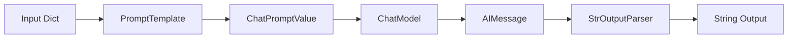

# LCEL Fundamentals

## Introduction

**LangChain Expression Language (LCEL)** is the foundation for composing LangChain components. It provides a declarative way to build chains by connecting components with the pipe operator (`|`), similar to Unix pipes or functional programming composition.

LCEL is built on the **Runnable protocol**, which ensures that every component—whether it's a prompt template, model, parser, or custom function—can be chained together seamlessly with consistent behavior for invocation, batching, and streaming.

### What We'll Cover

- The pipe operator and chain composition
- The Runnable protocol and its methods
- `invoke`, `batch`, and `stream` operations
- Async support with `ainvoke`, `abatch`, and `astream`
- Building practical chains with LCEL
- Error handling and configuration

### Prerequisites

- LangChain installed with at least one provider
- Understanding of Python functions and generators
- Basic async/await knowledge (for async sections)

---

## The Pipe Operator

LCEL uses Python's `|` (bitwise OR) operator to chain components:

```python
from langchain.prompts import ChatPromptTemplate
from langchain.chat_models import init_chat_model
from langchain_core.output_parsers import StrOutputParser

# Create a chain using the pipe operator
chain = (
    ChatPromptTemplate.from_template("Tell me a joke about {topic}")
    | init_chat_model("gpt-4o")
    | StrOutputParser()
)

# Invoke the chain
result = chain.invoke({"topic": "programming"})
print(result)
```

**Output:**
```
Why do programmers prefer dark mode? Because light attracts bugs!
```

### How It Works



Each component in the chain:
1. **Receives** the output of the previous component as input
2. **Transforms** the data according to its logic
3. **Passes** its output to the next component

| Step | Component | Input Type | Output Type |
|------|-----------|------------|-------------|
| 1 | `ChatPromptTemplate` | `dict` | `ChatPromptValue` |
| 2 | `ChatModel` | `ChatPromptValue` | `AIMessage` |
| 3 | `StrOutputParser` | `AIMessage` | `str` |

### Building Chains Incrementally

You can build chains step by step:

```python
from langchain.prompts import ChatPromptTemplate
from langchain.chat_models import init_chat_model
from langchain_core.output_parsers import StrOutputParser

# Define components separately
prompt = ChatPromptTemplate.from_template(
    "You are an expert on {subject}. Answer this question: {question}"
)
model = init_chat_model("gpt-4o")
parser = StrOutputParser()

# Combine into a chain
chain = prompt | model | parser

# Invoke
result = chain.invoke({
    "subject": "Python programming",
    "question": "What is a decorator?"
})
print(result)
```

---

## The Runnable Protocol

Every LCEL-compatible component implements the **Runnable** interface, which provides a consistent set of methods:

### Core Methods

| Method | Description | Use Case |
|--------|-------------|----------|
| `invoke(input)` | Process single input | Most common usage |
| `batch(inputs)` | Process multiple inputs in parallel | Bulk processing |
| `stream(input)` | Yield output chunks as generated | Real-time display |

### Async Methods

| Method | Description | Use Case |
|--------|-------------|----------|
| `ainvoke(input)` | Async single invocation | Web applications |
| `abatch(inputs)` | Async batch processing | Async bulk processing |
| `astream(input)` | Async streaming | Async real-time display |

### invoke()

The most common method—process a single input and return the complete output:

```python
from langchain.chat_models import init_chat_model

model = init_chat_model("gpt-4o")

# Single invocation
response = model.invoke("What is the capital of France?")
print(response.content)
```

**Output:**
```
The capital of France is Paris.
```

With a chain:

```python
from langchain.prompts import ChatPromptTemplate
from langchain.chat_models import init_chat_model
from langchain_core.output_parsers import StrOutputParser

chain = (
    ChatPromptTemplate.from_template("Translate to French: {text}")
    | init_chat_model("gpt-4o")
    | StrOutputParser()
)

result = chain.invoke({"text": "Hello, world!"})
print(result)
```

**Output:**
```
Bonjour, le monde !
```

### batch()

Process multiple inputs in parallel for improved throughput:

```python
from langchain.prompts import ChatPromptTemplate
from langchain.chat_models import init_chat_model
from langchain_core.output_parsers import StrOutputParser

chain = (
    ChatPromptTemplate.from_template("What is the capital of {country}?")
    | init_chat_model("gpt-4o")
    | StrOutputParser()
)

# Batch process multiple countries
countries = [
    {"country": "France"},
    {"country": "Japan"},
    {"country": "Brazil"},
]

results = chain.batch(countries)
for country, result in zip(countries, results):
    print(f"{country['country']}: {result}")
```

**Output:**
```
France: The capital of France is Paris.
Japan: The capital of Japan is Tokyo.
Brazil: The capital of Brazil is Brasília.
```

#### Controlling Concurrency

Limit parallel execution with `max_concurrency`:

```python
# Limit to 2 concurrent requests
results = chain.batch(
    countries,
    config={"max_concurrency": 2}
)
```

#### Returning Results as Completed

Get results as soon as each finishes (may be out of order):

```python
for result in chain.batch_as_completed(countries):
    print(f"Completed: {result}")
```

### stream()

Stream output chunks as they're generated—essential for responsive UIs:

```python
from langchain.chat_models import init_chat_model

model = init_chat_model("gpt-4o")

# Stream response tokens
for chunk in model.stream("Write a haiku about programming"):
    print(chunk.content, end="", flush=True)

print()  # Newline after streaming
```

**Output (streamed character by character):**
```
Code flows like water
Bugs lurk in the shadows deep
Debug, fix, repeat
```

With a chain:

```python
from langchain.prompts import ChatPromptTemplate
from langchain.chat_models import init_chat_model
from langchain_core.output_parsers import StrOutputParser

chain = (
    ChatPromptTemplate.from_template("Write a short story about {topic}")
    | init_chat_model("gpt-4o")
    | StrOutputParser()
)

# Stream the chain output
for chunk in chain.stream({"topic": "a robot learning to paint"}):
    print(chunk, end="", flush=True)
```

#### Aggregating Streamed Chunks

You can collect streamed chunks into a complete message:

```python
full_response = None
for chunk in model.stream("Tell me about AI"):
    if full_response is None:
        full_response = chunk
    else:
        full_response = full_response + chunk
    print(chunk.content, end="")

print(f"\n\nFull response length: {len(full_response.content)}")
```

---

## Async Operations

For web applications and concurrent processing, use async methods:

### ainvoke()

```python
import asyncio
from langchain.chat_models import init_chat_model

async def get_answer(question: str) -> str:
    model = init_chat_model("gpt-4o")
    response = await model.ainvoke(question)
    return response.content

# Run async function
result = asyncio.run(get_answer("What is 2 + 2?"))
print(result)
```

### abatch()

Process multiple inputs concurrently:

```python
import asyncio
from langchain.prompts import ChatPromptTemplate
from langchain.chat_models import init_chat_model
from langchain_core.output_parsers import StrOutputParser

async def process_batch():
    chain = (
        ChatPromptTemplate.from_template("Summarize: {text}")
        | init_chat_model("gpt-4o")
        | StrOutputParser()
    )
    
    texts = [
        {"text": "Python is a programming language..."},
        {"text": "Machine learning is a subset of AI..."},
        {"text": "Docker is a containerization platform..."},
    ]
    
    results = await chain.abatch(texts)
    return results

results = asyncio.run(process_batch())
for i, result in enumerate(results):
    print(f"Summary {i+1}: {result[:50]}...")
```

### astream()

Async streaming for web frameworks:

```python
import asyncio
from langchain.chat_models import init_chat_model

async def stream_response(prompt: str):
    model = init_chat_model("gpt-4o")
    
    async for chunk in model.astream(prompt):
        print(chunk.content, end="", flush=True)
    print()

asyncio.run(stream_response("Explain quantum computing in simple terms"))
```

### Real-World Async Example: FastAPI

```python
from fastapi import FastAPI
from fastapi.responses import StreamingResponse
from langchain.chat_models import init_chat_model
from langchain.prompts import ChatPromptTemplate
from langchain_core.output_parsers import StrOutputParser

app = FastAPI()

chain = (
    ChatPromptTemplate.from_template("Answer: {question}")
    | init_chat_model("gpt-4o")
    | StrOutputParser()
)

@app.get("/ask")
async def ask_question(question: str):
    async def generate():
        async for chunk in chain.astream({"question": question}):
            yield chunk
    
    return StreamingResponse(generate(), media_type="text/plain")
```

---

## Chain Composition Patterns

### Sequential Chains

The simplest pattern—components execute one after another:

```python
from langchain.prompts import ChatPromptTemplate
from langchain.chat_models import init_chat_model
from langchain_core.output_parsers import StrOutputParser

# Generate → Translate → Format
generate = (
    ChatPromptTemplate.from_template("Write a sentence about {topic}")
    | init_chat_model("gpt-4o")
    | StrOutputParser()
)

translate = (
    ChatPromptTemplate.from_template("Translate to Spanish: {text}")
    | init_chat_model("gpt-4o")
    | StrOutputParser()
)

# Combine sequentially using RunnableLambda for data transformation
from langchain_core.runnables import RunnableLambda

full_chain = (
    generate
    | RunnableLambda(lambda x: {"text": x})
    | translate
)

result = full_chain.invoke({"topic": "the ocean"})
print(result)
```

### Branching with RunnablePassthrough

Pass input through unchanged alongside transformations:

```python
from langchain_core.runnables import RunnablePassthrough
from langchain.prompts import ChatPromptTemplate
from langchain.chat_models import init_chat_model
from langchain_core.output_parsers import StrOutputParser

# Create a chain that keeps the original input AND adds a processed version
chain = (
    {
        "original": RunnablePassthrough(),
        "uppercase": RunnableLambda(lambda x: x.upper())
    }
    | ChatPromptTemplate.from_template(
        "Original: {original}\nUppercase: {uppercase}\nWhich looks better?"
    )
    | init_chat_model("gpt-4o")
    | StrOutputParser()
)

result = chain.invoke("hello world")
print(result)
```

### Using itemgetter for Data Extraction

```python
from operator import itemgetter
from langchain.prompts import ChatPromptTemplate
from langchain.chat_models import init_chat_model
from langchain_core.output_parsers import StrOutputParser

chain = (
    {
        "question": itemgetter("question"),
        "context": itemgetter("context"),
    }
    | ChatPromptTemplate.from_template(
        "Context: {context}\n\nQuestion: {question}\n\nAnswer:"
    )
    | init_chat_model("gpt-4o")
    | StrOutputParser()
)

result = chain.invoke({
    "question": "What is the capital?",
    "context": "France is a country in Western Europe.",
    "unused_field": "This won't be used"
})
print(result)
```

---

## Error Handling

### with_fallbacks()

Provide backup chains when the primary fails:

```python
from langchain.chat_models import init_chat_model
from langchain_core.output_parsers import StrOutputParser

# Primary model (might fail or be rate limited)
primary = init_chat_model("gpt-4o")

# Fallback model
fallback = init_chat_model("gpt-4o-mini")

# Chain with fallback
robust_model = primary.with_fallbacks([fallback])

response = robust_model.invoke("What is AI?")
print(response.content)
```

### with_retry()

Automatically retry on transient failures:

```python
from langchain.chat_models import init_chat_model

model = init_chat_model("gpt-4o")

# Retry up to 3 times with exponential backoff
robust_model = model.with_retry(
    stop_after_attempt=3,
    wait_exponential_jitter=True
)

response = robust_model.invoke("Hello!")
```

### Exception Handling in Chains

```python
from langchain_core.runnables import RunnableLambda
from langchain.chat_models import init_chat_model

def safe_process(text: str) -> str:
    try:
        # Processing that might fail
        return text.upper()
    except Exception as e:
        return f"Error: {e}"

chain = (
    RunnableLambda(safe_process)
    | init_chat_model("gpt-4o")
)
```

---

## Configuration with RunnableConfig

Pass runtime configuration to any Runnable:

```python
from langchain.chat_models import init_chat_model
from langchain.prompts import ChatPromptTemplate
from langchain_core.output_parsers import StrOutputParser

chain = (
    ChatPromptTemplate.from_template("Answer: {question}")
    | init_chat_model("gpt-4o")
    | StrOutputParser()
)

result = chain.invoke(
    {"question": "What is Python?"},
    config={
        "run_name": "qa_chain",
        "tags": ["production", "qa"],
        "metadata": {"user_id": "123"},
        "max_concurrency": 5,
        "callbacks": [],  # Custom callbacks
    }
)
```

### Common Config Options

| Option | Type | Description |
|--------|------|-------------|
| `run_name` | `str` | Name for this run (appears in LangSmith) |
| `tags` | `list[str]` | Tags for categorization |
| `metadata` | `dict` | Custom metadata |
| `max_concurrency` | `int` | Limit parallel operations in batch |
| `callbacks` | `list` | Callback handlers |

---

## Best Practices

### Do's

| Practice | Example |
|----------|---------|
| Use type-safe prompt templates | `ChatPromptTemplate.from_template(...)` |
| Stream for user-facing applications | `for chunk in chain.stream(...)` |
| Use batch for bulk processing | `chain.batch([...], max_concurrency=5)` |
| Add fallbacks for reliability | `chain.with_fallbacks([backup])` |
| Pass meaningful run names | `config={"run_name": "summarize_docs"}` |

### Don'ts

| Anti-pattern | Problem |
|--------------|---------|
| Ignoring streaming | Poor UX for long responses |
| Unlimited batch concurrency | Rate limiting, costs |
| No error handling | Application crashes |
| Hardcoded prompts | Inflexible, hard to test |

---

## Common Pitfalls

| ❌ Mistake | ✅ Solution |
|-----------|-------------|
| Chaining incompatible types | Ensure output type matches next input type |
| Forgetting `flush=True` in streaming | Use `print(chunk, end="", flush=True)` |
| Using sync in async context | Use `ainvoke()` in async functions |
| Not handling `None` outputs | Add null checks between steps |
| Over-engineering simple chains | Start simple, add complexity as needed |

---

## Hands-on Exercise

### Your Task

Build a multi-step chain that:
1. Takes a topic as input
2. Generates three facts about the topic
3. Translates the facts to a target language
4. Formats the output nicely

### Requirements

1. Use at least 3 chained components
2. Demonstrate `invoke`, `batch`, and `stream`
3. Include error handling with fallbacks
4. Add meaningful configuration (run_name, tags)

### Expected Result

```
Topic: Python
Language: Spanish

Facts in Spanish:
1. Python es un lenguaje de programación interpretado...
2. Guido van Rossum creó Python en 1991...
3. Python se usa ampliamente en ciencia de datos...
```

<details>
<summary>💡 Hints (click to expand)</summary>

- Use `RunnableLambda` to transform data between steps
- Consider using a dict to pass multiple values through the chain
- For streaming, make sure your final output parser supports it
- Add `with_fallbacks()` on the model component

</details>

<details>
<summary>✅ Solution (click to expand)</summary>

```python
from langchain.prompts import ChatPromptTemplate
from langchain.chat_models import init_chat_model
from langchain_core.output_parsers import StrOutputParser
from langchain_core.runnables import RunnableLambda, RunnablePassthrough

# Initialize model with fallback
primary_model = init_chat_model("gpt-4o")
fallback_model = init_chat_model("gpt-4o-mini")
model = primary_model.with_fallbacks([fallback_model])

# Step 1: Generate facts
generate_facts = (
    ChatPromptTemplate.from_template(
        "List exactly 3 interesting facts about {topic}. "
        "Number each fact 1, 2, 3."
    )
    | model
    | StrOutputParser()
)

# Step 2: Translate facts
translate_facts = (
    ChatPromptTemplate.from_template(
        "Translate the following to {language}:\n\n{facts}"
    )
    | model
    | StrOutputParser()
)

# Combined chain
def prepare_for_translation(result: str) -> dict:
    return {"facts": result}

chain = (
    {
        "topic": itemgetter("topic"),
        "facts": generate_facts,
        "language": itemgetter("language")
    }
    | translate_facts
)

# Demo: invoke
print("=== INVOKE ===")
result = chain.invoke(
    {"topic": "Python", "language": "Spanish"},
    config={"run_name": "facts_chain", "tags": ["demo"]}
)
print(result)

# Demo: batch
print("\n=== BATCH ===")
topics = [
    {"topic": "Mars", "language": "French"},
    {"topic": "Music", "language": "German"},
]
results = chain.batch(topics, config={"max_concurrency": 2})
for topic, result in zip(topics, results):
    print(f"\n{topic['topic']} ({topic['language']}):")
    print(result[:100] + "...")

# Demo: stream
print("\n=== STREAM ===")
print("Streaming facts about AI in Italian:")
for chunk in chain.stream({"topic": "AI", "language": "Italian"}):
    print(chunk, end="", flush=True)
print()
```

</details>

### Bonus Challenge

- [ ] Add a fourth step that summarizes the translated facts in one sentence
- [ ] Implement retry logic for rate limit handling
- [ ] Create an async version that processes multiple topics concurrently

---

## Summary

✅ LCEL uses the pipe operator (`|`) to chain components  
✅ All components implement the Runnable protocol  
✅ **invoke()** for single inputs, **batch()** for multiple, **stream()** for real-time  
✅ Async methods (`ainvoke`, `abatch`, `astream`) for concurrent applications  
✅ Use **with_fallbacks()** and **with_retry()** for reliability  
✅ Pass configuration via the `config` parameter  

**Next:** [Core Abstractions](./04-core-abstractions.md) — Deep dive into RunnablePassthrough, RunnableLambda, and RunnableParallel

---

## Navigation

| Previous | Up | Next |
|----------|-----|------|
| [Installation and Setup](./02-installation-and-setup.md) | [LangChain Fundamentals](./00-langchain-fundamentals.md) | [Core Abstractions](./04-core-abstractions.md) |

<!-- 
Sources Consulted:
- LangChain LCEL Concepts: https://python.langchain.com/docs/concepts/lcel/
- LangChain Runnables: https://python.langchain.com/docs/concepts/runnables/
- LangChain Models: https://docs.langchain.com/oss/python/langchain/models
-->
