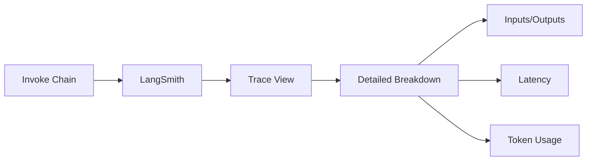

# Debugging and Tracing

## Introduction

As LangChain applications grow in complexity—with multiple chained components, tool calls, and model interactions—understanding what's happening inside becomes critical. LangChain provides powerful observability tools through **LangSmith** integration and a flexible **callback system**.

Effective debugging and tracing help you:
- Identify where errors occur in complex chains
- Understand why a model made certain decisions
- Optimize performance by finding bottlenecks
- Monitor production applications for issues
- Evaluate and improve prompt effectiveness

### What We'll Cover

- LangSmith integration for full observability
- Callback handlers for custom logging and monitoring
- Verbose mode for quick debugging
- Tracing execution paths
- Performance monitoring
- Best practices for production observability

### Prerequisites

- LangChain installed with at least one provider
- LangSmith account (free tier available)
- Understanding of LCEL and chain composition

---

## LangSmith Integration

LangSmith is LangChain's observability platform, providing visualization, debugging, evaluation, and monitoring capabilities.

### Setting Up LangSmith

1. **Create an account** at [smith.langchain.com](https://smith.langchain.com)
2. **Create an API key** in settings
3. **Configure environment variables**:

```bash
export LANGSMITH_API_KEY="lsv2_your-key-here"
export LANGSMITH_TRACING="true"
export LANGSMITH_PROJECT="my-project"  # Optional: organize traces by project
```

Or in Python:

```python
import os

os.environ["LANGSMITH_API_KEY"] = "lsv2_your-key-here"
os.environ["LANGSMITH_TRACING"] = "true"
os.environ["LANGSMITH_PROJECT"] = "my-project"
```

### Automatic Tracing

Once configured, all LangChain operations are automatically traced:

```python
from langchain.chat_models import init_chat_model
from langchain.prompts import ChatPromptTemplate
from langchain_core.output_parsers import StrOutputParser

# This chain is automatically traced
chain = (
    ChatPromptTemplate.from_template("Tell me about {topic}")
    | init_chat_model("gpt-4o")
    | StrOutputParser()
)

result = chain.invoke({"topic": "artificial intelligence"})
print(result)

# View the trace at: https://smith.langchain.com
```

### What LangSmith Captures

| Data Type | Description |
|-----------|-------------|
| **Inputs** | All inputs to each component |
| **Outputs** | All outputs from each component |
| **Latency** | Time spent in each step |
| **Token Usage** | Tokens used per model call |
| **Errors** | Full error traces and context |
| **Metadata** | Custom tags, run names, and metadata |
| **Tool Calls** | Tool invocations and results |

### Viewing Traces



### Custom Run Names and Tags

Add context to make traces easier to find:

```python
from langchain.chat_models import init_chat_model

model = init_chat_model("gpt-4o")

result = model.invoke(
    "What is Python?",
    config={
        "run_name": "python_question",
        "tags": ["production", "user-query"],
        "metadata": {
            "user_id": "user_123",
            "session_id": "abc-456"
        }
    }
)
```

In LangSmith, you can now filter traces by:
- Run name: `python_question`
- Tags: `production`, `user-query`
- Metadata fields: `user_id`, `session_id`

### Tracing Specific Code Blocks

Use the `@traceable` decorator for non-LangChain code:

```python
from langsmith import traceable
from langchain.chat_models import init_chat_model

@traceable(name="process_user_query")
def process_query(user_input: str) -> str:
    """Custom processing function that gets traced."""
    # Pre-processing
    cleaned = user_input.strip().lower()
    
    # Model call (automatically traced as child)
    model = init_chat_model("gpt-4o")
    response = model.invoke(cleaned)
    
    # Post-processing
    return response.content.upper()

result = process_query("  What is AI?  ")
```

### Context Managers for Tracing

```python
from langsmith import trace
from langchain.chat_models import init_chat_model

with trace(name="my_custom_operation", tags=["debug"]) as run:
    model = init_chat_model("gpt-4o")
    result = model.invoke("Hello")
    
    # Add custom outputs to the trace
    run.end(outputs={"final_result": result.content})
```

---

## Callback Handlers

Callbacks provide hooks into LangChain's execution lifecycle, enabling custom logging, monitoring, and behavior modification.

### Callback Events

| Event | When Triggered |
|-------|----------------|
| `on_chain_start` | Before a chain begins execution |
| `on_chain_end` | After a chain completes |
| `on_chain_error` | When a chain raises an exception |
| `on_llm_start` | Before an LLM call |
| `on_llm_end` | After an LLM call completes |
| `on_llm_new_token` | For each streamed token |
| `on_tool_start` | Before a tool execution |
| `on_tool_end` | After a tool completes |

### Built-in Callback Handlers

#### StdOutCallbackHandler

Prints execution information to stdout:

```python
from langchain.callbacks import StdOutCallbackHandler
from langchain.chat_models import init_chat_model

handler = StdOutCallbackHandler()
model = init_chat_model("gpt-4o")

result = model.invoke(
    "What is Python?",
    config={"callbacks": [handler]}
)
```

**Output:**
```
> Entering new ChatOpenAI chain...
Prompt after formatting:
What is Python?
> Finished chain.
```

#### FileCallbackHandler

Log to a file:

```python
from langchain.callbacks import FileCallbackHandler
from langchain.chat_models import init_chat_model

handler = FileCallbackHandler("langchain.log")
model = init_chat_model("gpt-4o")

result = model.invoke(
    "Explain AI",
    config={"callbacks": [handler]}
)

# Check langchain.log for the output
```

### Custom Callback Handlers

Create handlers for specific needs:

```python
from langchain.callbacks.base import BaseCallbackHandler
from langchain.chat_models import init_chat_model
from datetime import datetime

class TimingCallbackHandler(BaseCallbackHandler):
    """Track timing for each operation."""
    
    def __init__(self):
        self.start_times = {}
        self.timings = []
    
    def on_llm_start(self, serialized, prompts, **kwargs):
        run_id = kwargs.get("run_id", "unknown")
        self.start_times[run_id] = datetime.now()
        print(f"[{datetime.now().isoformat()}] LLM call started")
    
    def on_llm_end(self, response, **kwargs):
        run_id = kwargs.get("run_id", "unknown")
        if run_id in self.start_times:
            elapsed = (datetime.now() - self.start_times[run_id]).total_seconds()
            self.timings.append(elapsed)
            print(f"[{datetime.now().isoformat()}] LLM call completed in {elapsed:.2f}s")
    
    def on_llm_error(self, error, **kwargs):
        print(f"[{datetime.now().isoformat()}] LLM error: {error}")

# Use the custom handler
handler = TimingCallbackHandler()
model = init_chat_model("gpt-4o")

result = model.invoke(
    "What is machine learning?",
    config={"callbacks": [handler]}
)

print(f"Average timing: {sum(handler.timings) / len(handler.timings):.2f}s")
```

### Streaming Token Handler

Handle streamed tokens:

```python
from langchain.callbacks.base import BaseCallbackHandler
from langchain.chat_models import init_chat_model

class StreamingHandler(BaseCallbackHandler):
    """Handle streaming tokens."""
    
    def on_llm_new_token(self, token: str, **kwargs):
        print(token, end="", flush=True)

handler = StreamingHandler()
model = init_chat_model("gpt-4o")

# The handler receives each token as it's generated
result = model.invoke(
    "Write a short poem about coding",
    config={"callbacks": [handler]}
)
print()  # Newline after streaming
```

### Combining Multiple Handlers

```python
from langchain.callbacks import StdOutCallbackHandler, FileCallbackHandler
from langchain.chat_models import init_chat_model

handlers = [
    StdOutCallbackHandler(),
    FileCallbackHandler("debug.log"),
    TimingCallbackHandler()  # Custom handler from above
]

model = init_chat_model("gpt-4o")
result = model.invoke(
    "What is deep learning?",
    config={"callbacks": handlers}
)
```

### Async Callback Handlers

For async applications:

```python
from langchain.callbacks.base import AsyncCallbackHandler
from langchain.chat_models import init_chat_model
import asyncio

class AsyncLoggingHandler(AsyncCallbackHandler):
    async def on_llm_start(self, serialized, prompts, **kwargs):
        await asyncio.sleep(0)  # Yield to event loop
        print("Async: LLM started")
    
    async def on_llm_end(self, response, **kwargs):
        print("Async: LLM completed")

async def main():
    handler = AsyncLoggingHandler()
    model = init_chat_model("gpt-4o")
    
    result = await model.ainvoke(
        "Hello!",
        config={"callbacks": [handler]}
    )
    print(result.content)

asyncio.run(main())
```

---

## Verbose Mode

For quick debugging without setting up callbacks:

### Global Verbose Mode

```python
from langchain.globals import set_verbose

set_verbose(True)  # Enable verbose output globally

from langchain.chat_models import init_chat_model

model = init_chat_model("gpt-4o")
result = model.invoke("What is LangChain?")
# Verbose output automatically printed
```

### Debug Mode

For even more detailed output:

```python
from langchain.globals import set_debug

set_debug(True)  # Enable debug mode globally

from langchain.chat_models import init_chat_model

model = init_chat_model("gpt-4o")
result = model.invoke("Explain RAG")
# Very detailed debug output printed
```

> **Warning:** Debug mode produces a lot of output. Use it only during development.

---

## Tracing Execution Paths

Understanding the flow through complex chains:

### Visualizing Chain Execution

```python
from langchain.prompts import ChatPromptTemplate
from langchain.chat_models import init_chat_model
from langchain_core.output_parsers import StrOutputParser
from langchain_core.runnables import RunnableParallel, RunnableLambda

# Complex chain with parallel execution
chain = (
    RunnableParallel(
        summary=ChatPromptTemplate.from_template("Summarize: {text}") | init_chat_model("gpt-4o") | StrOutputParser(),
        keywords=ChatPromptTemplate.from_template("Extract keywords from: {text}") | init_chat_model("gpt-4o") | StrOutputParser()
    )
    | RunnableLambda(lambda x: f"Summary: {x['summary']}\n\nKeywords: {x['keywords']}")
)

result = chain.invoke(
    {"text": "LangChain is a framework for building LLM applications..."},
    config={"run_name": "document_analysis"}
)

# In LangSmith, you'll see:
# - document_analysis (root)
#   ├── RunnableParallel
#   │   ├── summary (ChatPromptTemplate → ChatOpenAI → StrOutputParser)
#   │   └── keywords (ChatPromptTemplate → ChatOpenAI → StrOutputParser)
#   └── RunnableLambda
```

### Accessing Run Information

```python
from langchain.chat_models import init_chat_model
from langchain.callbacks.manager import collect_runs

model = init_chat_model("gpt-4o")

with collect_runs() as cb:
    result = model.invoke("What is AI?")
    
    # Access run information
    for run in cb.traced_runs:
        print(f"Run ID: {run.id}")
        print(f"Run Name: {run.name}")
        print(f"Start Time: {run.start_time}")
        print(f"End Time: {run.end_time}")
```

---

## Performance Monitoring

### Tracking Latency

```python
from langchain.callbacks.base import BaseCallbackHandler
from langchain.chat_models import init_chat_model
import time

class PerformanceHandler(BaseCallbackHandler):
    def __init__(self):
        self.metrics = {
            "llm_calls": 0,
            "total_latency": 0,
            "tokens_used": 0
        }
        self._start_time = None
    
    def on_llm_start(self, *args, **kwargs):
        self._start_time = time.time()
    
    def on_llm_end(self, response, **kwargs):
        latency = time.time() - self._start_time
        self.metrics["llm_calls"] += 1
        self.metrics["total_latency"] += latency
        
        # Track tokens if available
        if hasattr(response, "llm_output") and response.llm_output:
            usage = response.llm_output.get("token_usage", {})
            self.metrics["tokens_used"] += usage.get("total_tokens", 0)
    
    def report(self):
        avg_latency = self.metrics["total_latency"] / max(1, self.metrics["llm_calls"])
        return {
            "total_calls": self.metrics["llm_calls"],
            "total_latency_seconds": self.metrics["total_latency"],
            "average_latency_seconds": avg_latency,
            "total_tokens": self.metrics["tokens_used"]
        }

# Usage
perf = PerformanceHandler()
model = init_chat_model("gpt-4o")

for i in range(3):
    model.invoke(
        f"Question {i}: What is Python?",
        config={"callbacks": [perf]}
    )

print("Performance Report:")
for key, value in perf.report().items():
    print(f"  {key}: {value}")
```

### Token Usage Aggregation

```python
from langchain_core.callbacks import UsageMetadataCallbackHandler
from langchain.chat_models import init_chat_model

callback = UsageMetadataCallbackHandler()
model = init_chat_model("gpt-4o")

# Multiple calls
model.invoke("What is AI?", config={"callbacks": [callback]})
model.invoke("What is ML?", config={"callbacks": [callback]})
model.invoke("What is DL?", config={"callbacks": [callback]})

# Aggregate usage
print("Token Usage by Model:")
for model_name, usage in callback.usage_metadata.items():
    print(f"  {model_name}:")
    print(f"    Input tokens: {usage['input_tokens']}")
    print(f"    Output tokens: {usage['output_tokens']}")
    print(f"    Total tokens: {usage['total_tokens']}")
```

---

## Production Best Practices

### Error Tracking

```python
from langchain.callbacks.base import BaseCallbackHandler
from langchain.chat_models import init_chat_model
import logging

logging.basicConfig(level=logging.INFO)
logger = logging.getLogger(__name__)

class ErrorTrackingHandler(BaseCallbackHandler):
    def on_llm_error(self, error, **kwargs):
        logger.error(f"LLM Error: {error}", exc_info=True)
        # Could also send to error tracking service (Sentry, etc.)
    
    def on_chain_error(self, error, **kwargs):
        logger.error(f"Chain Error: {error}", exc_info=True)
    
    def on_tool_error(self, error, **kwargs):
        logger.error(f"Tool Error: {error}", exc_info=True)

# Always include in production
error_handler = ErrorTrackingHandler()
```

### Structured Logging

```python
from langchain.callbacks.base import BaseCallbackHandler
import json
import logging

logger = logging.getLogger(__name__)

class StructuredLoggingHandler(BaseCallbackHandler):
    def on_llm_start(self, serialized, prompts, **kwargs):
        log_entry = {
            "event": "llm_start",
            "model": serialized.get("name", "unknown"),
            "run_id": str(kwargs.get("run_id", "")),
            "prompt_length": sum(len(p) for p in prompts)
        }
        logger.info(json.dumps(log_entry))
    
    def on_llm_end(self, response, **kwargs):
        log_entry = {
            "event": "llm_end",
            "run_id": str(kwargs.get("run_id", "")),
            "response_length": len(str(response))
        }
        logger.info(json.dumps(log_entry))
```

### Sampling for High-Volume Applications

```python
import random
from langchain.callbacks.base import BaseCallbackHandler

class SampledLoggingHandler(BaseCallbackHandler):
    def __init__(self, sample_rate: float = 0.1):
        self.sample_rate = sample_rate
    
    def on_llm_start(self, *args, **kwargs):
        if random.random() < self.sample_rate:
            print("Sampled log: LLM starting")
    
    def on_llm_end(self, *args, **kwargs):
        if random.random() < self.sample_rate:
            print("Sampled log: LLM completed")

# Log only 10% of requests
sampled_handler = SampledLoggingHandler(sample_rate=0.1)
```

---

## Common Pitfalls

| ❌ Mistake | ✅ Solution |
|-----------|-------------|
| Debug mode in production | Use only in development |
| Not setting LANGSMITH_PROJECT | Organize traces by project for easier navigation |
| Ignoring callback errors | Wrap callback code in try/except |
| Logging sensitive data | Filter PII and secrets from logs |
| No error tracking | Always include error callbacks in production |
| Forgetting to disable verbose | Control via environment variables |

---

## Hands-on Exercise

### Your Task

Build a comprehensive monitoring system for a LangChain application that:
1. Tracks all LLM calls with timing
2. Aggregates token usage
3. Logs errors with full context
4. Provides a summary report

### Requirements

1. Create a custom callback handler with multiple event handlers
2. Track at least 5 metrics (latency, tokens, error count, etc.)
3. Implement error handling that doesn't crash the main application
4. Generate a formatted report at the end

### Expected Result

```
=== Monitoring Report ===
Total LLM Calls: 5
Successful Calls: 4
Failed Calls: 1
Total Tokens Used: 523
Average Latency: 1.24s
Min Latency: 0.89s
Max Latency: 1.67s
========================
```

<details>
<summary>💡 Hints (click to expand)</summary>

- Use a dictionary to store metrics
- Wrap all callback code in try/except
- Track timestamps for latency calculation
- Use a list to store individual call metrics for min/max

</details>

<details>
<summary>✅ Solution (click to expand)</summary>

```python
from langchain.callbacks.base import BaseCallbackHandler
from langchain.chat_models import init_chat_model
import time
from dataclasses import dataclass, field
from typing import List

@dataclass
class CallMetrics:
    latency: float
    tokens: int
    success: bool
    error_message: str = ""

class MonitoringHandler(BaseCallbackHandler):
    def __init__(self):
        self.calls: List[CallMetrics] = []
        self._current_start: float = 0
        self._current_tokens: int = 0
    
    def on_llm_start(self, serialized, prompts, **kwargs):
        try:
            self._current_start = time.time()
        except Exception as e:
            print(f"Error in on_llm_start: {e}")
    
    def on_llm_end(self, response, **kwargs):
        try:
            latency = time.time() - self._current_start
            tokens = 0
            
            # Try to get token count
            if hasattr(response, "llm_output") and response.llm_output:
                usage = response.llm_output.get("token_usage", {})
                tokens = usage.get("total_tokens", 0)
            
            self.calls.append(CallMetrics(
                latency=latency,
                tokens=tokens,
                success=True
            ))
        except Exception as e:
            print(f"Error in on_llm_end: {e}")
    
    def on_llm_error(self, error, **kwargs):
        try:
            latency = time.time() - self._current_start
            self.calls.append(CallMetrics(
                latency=latency,
                tokens=0,
                success=False,
                error_message=str(error)
            ))
        except Exception as e:
            print(f"Error in on_llm_error: {e}")
    
    def report(self) -> str:
        if not self.calls:
            return "No calls recorded"
        
        total_calls = len(self.calls)
        successful = sum(1 for c in self.calls if c.success)
        failed = total_calls - successful
        total_tokens = sum(c.tokens for c in self.calls)
        latencies = [c.latency for c in self.calls]
        
        report = f"""
=== Monitoring Report ===
Total LLM Calls: {total_calls}
Successful Calls: {successful}
Failed Calls: {failed}
Total Tokens Used: {total_tokens}
Average Latency: {sum(latencies) / len(latencies):.2f}s
Min Latency: {min(latencies):.2f}s
Max Latency: {max(latencies):.2f}s
========================
"""
        
        if failed > 0:
            report += "\nErrors:\n"
            for call in self.calls:
                if not call.success:
                    report += f"  - {call.error_message}\n"
        
        return report

# Test the monitoring system
monitor = MonitoringHandler()
model = init_chat_model("gpt-4o")

# Make several calls
prompts = [
    "What is Python?",
    "Explain machine learning",
    "What is deep learning?",
    "How does NLP work?",
    "What is computer vision?"
]

for prompt in prompts:
    try:
        model.invoke(prompt, config={"callbacks": [monitor]})
    except Exception as e:
        print(f"Call failed: {e}")

# Generate report
print(monitor.report())
```

</details>

### Bonus Challenges

- [ ] Add rate limiting detection (track 429 errors)
- [ ] Implement cost estimation based on token usage
- [ ] Create a real-time dashboard using a web framework
- [ ] Add alerts when latency exceeds a threshold

---

## Summary

✅ **LangSmith** provides full observability with automatic tracing  
✅ Use **run_name**, **tags**, and **metadata** for easy trace navigation  
✅ **Callbacks** enable custom logging, monitoring, and behavior modification  
✅ **Verbose/Debug mode** for quick local debugging (not production)  
✅ Track **latency**, **tokens**, and **errors** for production monitoring  
✅ Always include **error handling** in callback implementations  

**Next:** [Prompt Templates](../02-prompt-templates.md) — Create dynamic, reusable prompts for your LangChain applications

---

## Navigation

| Previous | Up | Next |
|----------|-----|------|
| [Model Wrappers](./05-model-wrappers.md) | [LangChain Fundamentals](./00-langchain-fundamentals.md) | [Prompt Templates](../02-prompt-templates.md) |

<!-- 
Sources Consulted:
- LangSmith Documentation: https://docs.langchain.com/langsmith/home
- LangChain Quickstart - LangSmith: https://docs.langchain.com/oss/python/langchain/quickstart
- LangChain Agents: https://docs.langchain.com/oss/python/langchain/agents
-->
