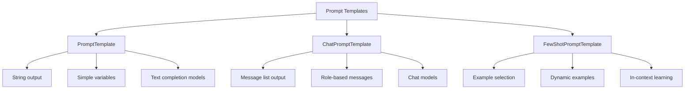

# Prompt Templates

## Introduction

Prompt templates are the foundation of LangChain applications—they transform raw user input and data into structured prompts that guide LLM behavior. Rather than hardcoding prompts as strings, templates provide **reusability**, **maintainability**, and **type safety**.

Well-designed prompt templates enable:
- Consistent formatting across your application
- Dynamic variable injection at runtime
- Multi-turn conversation management
- Few-shot learning with example selection
- Centralized prompt management and versioning

### What You'll Learn in This Lesson

| Sub-lesson | Focus |
|------------|-------|
| [PromptTemplate Basics](./01-prompttemplate-basics.md) | Creating simple templates with variables |
| [ChatPromptTemplate](./02-chatprompttemplate.md) | Message-based prompts for chat models |
| [Template Composition](./03-template-composition.md) | Combining and extending templates |
| [Few-Shot Prompting](./04-few-shot-prompting.md) | Dynamic example selection |
| [Advanced Features](./05-advanced-features.md) | Jinja2, conditionals, custom formatters |
| [Prompt Hub](./06-prompt-hub.md) | LangSmith prompt management |

### Prerequisites

- LangChain fundamentals (Lesson 8.1)
- Python f-string formatting
- Basic understanding of chat model APIs

---

## Quick Start

```python
from langchain.prompts import ChatPromptTemplate
from langchain.chat_models import init_chat_model

# Create a simple chat prompt template
template = ChatPromptTemplate.from_messages([
    ("system", "You are a helpful assistant who specializes in {topic}."),
    ("human", "{question}")
])

# Create a chain with a model
model = init_chat_model("gpt-4o")
chain = template | model

# Invoke with variables
response = chain.invoke({
    "topic": "Python programming",
    "question": "What's the difference between a list and a tuple?"
})

print(response.content)
```

**Output:**
```
Lists and tuples are both sequence types in Python, but they have key differences:

1. **Mutability**: Lists are mutable (can be changed), tuples are immutable
2. **Syntax**: Lists use [], tuples use ()
3. **Performance**: Tuples are slightly faster due to immutability
4. **Use cases**: Lists for collections that change, tuples for fixed data
...
```

---

## Template Types at a Glance



### When to Use Each Template Type

| Template Type | Best For | Output |
|---------------|----------|--------|
| `PromptTemplate` | Simple text generation, legacy models | Single string |
| `ChatPromptTemplate` | Chat models (recommended) | List of messages |
| `FewShotPromptTemplate` | Text models with examples | String with examples |
| `FewShotChatMessagePromptTemplate` | Chat models with examples | Messages with examples |

---

## Key Concepts

### Variables and Placeholders

Templates use placeholders that get filled at runtime:

```python
from langchain.prompts import PromptTemplate

# f-string style (default)
template = PromptTemplate.from_template("Hello, {name}!")

# Format the template
result = template.format(name="Alice")
print(result)  # "Hello, Alice!"
```

### Input Validation

Templates automatically validate required variables:

```python
from langchain.prompts import ChatPromptTemplate

template = ChatPromptTemplate.from_messages([
    ("system", "You are {role}"),
    ("human", "{question}")
])

print(template.input_variables)  # ['role', 'question']

# This will raise an error - missing 'question'
# template.format(role="a helpful assistant")  # KeyError!
```

### The Runnable Protocol

Templates implement the Runnable interface, making them chainable:

```python
from langchain.prompts import ChatPromptTemplate
from langchain.chat_models import init_chat_model

template = ChatPromptTemplate.from_template("Explain {concept} simply")
model = init_chat_model("gpt-4o")

# Chain with pipe operator
chain = template | model

# invoke, batch, stream all work
result = chain.invoke({"concept": "recursion"})
```

---

## Common Patterns

### System + Human Pattern

The most common pattern for chat applications:

```python
template = ChatPromptTemplate.from_messages([
    ("system", "You are a {persona}. Always respond in {language}."),
    ("human", "{user_input}")
])
```

### Conversation History Pattern

Include previous messages dynamically:

```python
from langchain.prompts import ChatPromptTemplate, MessagesPlaceholder

template = ChatPromptTemplate.from_messages([
    ("system", "You are a helpful assistant."),
    MessagesPlaceholder("history"),
    ("human", "{input}")
])
```

### Few-Shot Pattern

Include examples for in-context learning:

```python
from langchain.prompts import FewShotChatMessagePromptTemplate, ChatPromptTemplate

examples = [
    {"input": "2+2", "output": "4"},
    {"input": "3+5", "output": "8"},
]

example_prompt = ChatPromptTemplate.from_messages([
    ("human", "{input}"),
    ("ai", "{output}")
])

few_shot = FewShotChatMessagePromptTemplate(
    examples=examples,
    example_prompt=example_prompt
)
```

---

## Summary

✅ **PromptTemplate** for simple string templates  
✅ **ChatPromptTemplate** for message-based prompts (recommended)  
✅ Templates validate input variables automatically  
✅ All templates are Runnables—chainable with `|`  
✅ **MessagesPlaceholder** for dynamic message injection  
✅ **FewShotPromptTemplate** for example-based learning  

**Next:** [PromptTemplate Basics](./01-prompttemplate-basics.md) — Master the fundamentals of template creation

---

## Navigation

| Previous | Up | Next |
|----------|-----|------|
| [LangChain Fundamentals](../01-langchain-fundamentals/00-langchain-fundamentals.md) | [Unit 8 Overview](../00-overview.md) | [PromptTemplate Basics](./01-prompttemplate-basics.md) |
