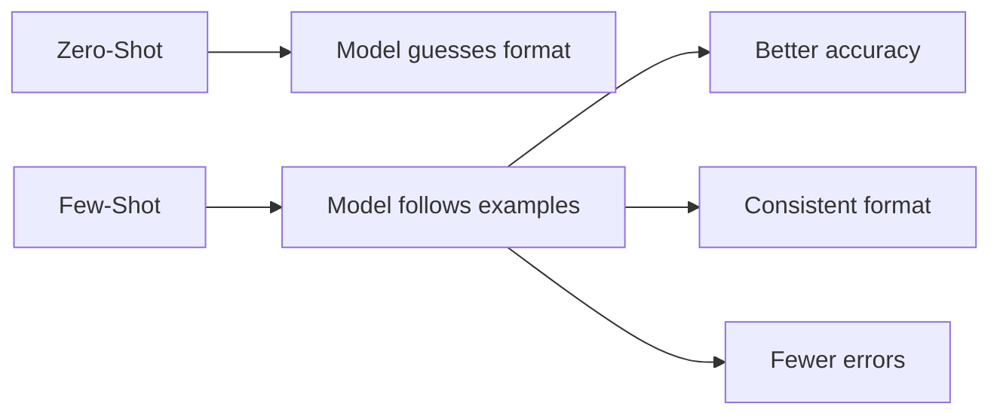
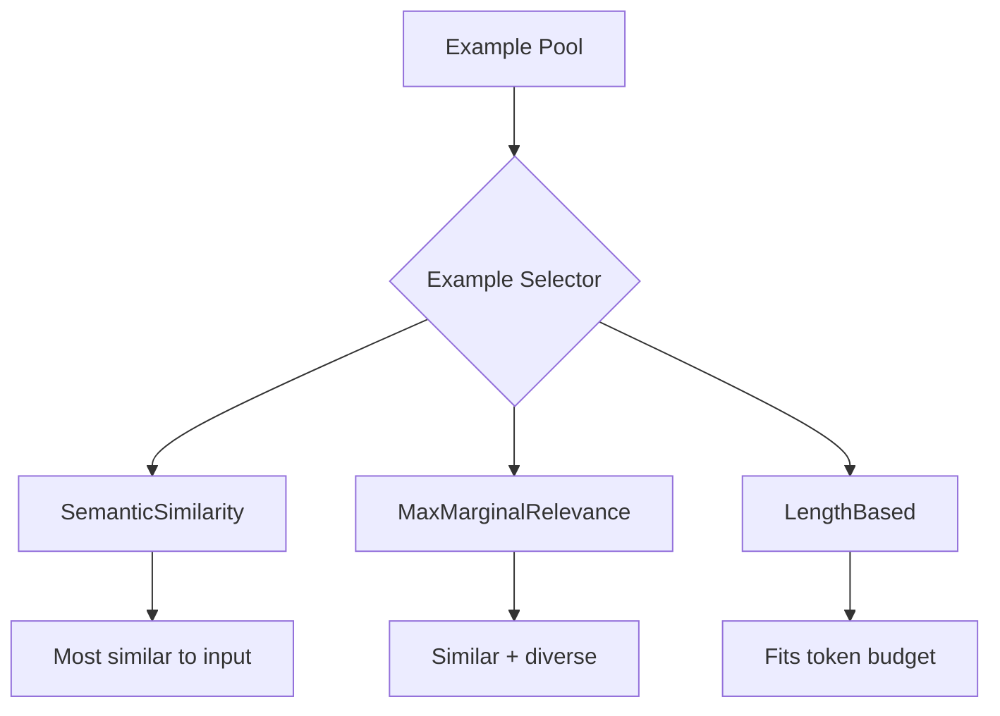

# Few-Shot Prompting

## Introduction

Few-shot prompting is one of the most powerful techniques for improving LLM performance—providing examples teaches the model the desired output format, style, and reasoning pattern. LangChain's `FewShotPromptTemplate` and `FewShotChatMessagePromptTemplate` make it easy to include examples, and **example selectors** enable dynamic example selection based on the input.

This lesson covers static examples, dynamic example selection, and the three built-in selector types: Semantic Similarity, Max Marginal Relevance, and Length-Based.

### What We'll Cover

- FewShotPromptTemplate for text models
- FewShotChatMessagePromptTemplate for chat models
- Static vs dynamic example selection
- SemanticSimilarityExampleSelector
- MaxMarginalRelevanceExampleSelector
- LengthBasedExampleSelector

### Prerequisites

- ChatPromptTemplate mastery (Lesson 8.2.2)
- Understanding of embeddings (helpful for semantic selectors)

---

## Why Few-Shot Prompting?



| Approach | Pros | Cons |
|----------|------|------|
| Zero-shot | Simple, fewer tokens | May not follow format |
| Few-shot (static) | Consistent format | Same examples always |
| Few-shot (dynamic) | Relevant examples | More complexity |

---

## FewShotPromptTemplate (Text Models)

For traditional completion models or simple text generation:

### Basic Usage

```python
from langchain.prompts import FewShotPromptTemplate, PromptTemplate

# Define examples
examples = [
    {"word": "happy", "antonym": "sad"},
    {"word": "tall", "antonym": "short"},
    {"word": "fast", "antonym": "slow"}
]

# Template for each example
example_prompt = PromptTemplate(
    input_variables=["word", "antonym"],
    template="Word: {word}\nAntonym: {antonym}"
)

# Create few-shot template
few_shot_template = FewShotPromptTemplate(
    examples=examples,
    example_prompt=example_prompt,
    prefix="Give the antonym of every word.\n",
    suffix="\nWord: {input}\nAntonym:",
    input_variables=["input"]
)

# Format the prompt
result = few_shot_template.format(input="bright")
print(result)
```

**Output:**
```
Give the antonym of every word.

Word: happy
Antonym: sad

Word: tall
Antonym: short

Word: fast
Antonym: slow

Word: bright
Antonym:
```

### Components Explained

| Component | Purpose |
|-----------|---------|
| `examples` | List of example dictionaries |
| `example_prompt` | How to format each example |
| `prefix` | Text before examples |
| `suffix` | Text after examples (includes input) |
| `example_separator` | String between examples (default: `\n\n`) |

---

## FewShotChatMessagePromptTemplate (Chat Models)

The preferred approach for modern chat models:

### Basic Usage

```python
from langchain.prompts import (
    ChatPromptTemplate,
    FewShotChatMessagePromptTemplate,
    HumanMessagePromptTemplate,
    AIMessagePromptTemplate
)

# Define examples
examples = [
    {"input": "2+2", "output": "4"},
    {"input": "3+5", "output": "8"},
    {"input": "10-4", "output": "6"}
]

# Template for each example (human + AI message pair)
example_prompt = ChatPromptTemplate.from_messages([
    ("human", "{input}"),
    ("ai", "{output}")
])

# Create few-shot template
few_shot = FewShotChatMessagePromptTemplate(
    examples=examples,
    example_prompt=example_prompt
)

# Combine with system message and user input
final_prompt = ChatPromptTemplate.from_messages([
    ("system", "You are a calculator. Compute the result."),
    few_shot,
    ("human", "{input}")
])

# Format messages
messages = final_prompt.format_messages(input="7+3")
for msg in messages:
    print(f"{msg.type}: {msg.content}")
```

**Output:**
```
system: You are a calculator. Compute the result.
human: 2+2
ai: 4
human: 3+5
ai: 8
human: 10-4
ai: 6
human: 7+3
```

### Multi-Turn Example Patterns

```python
from langchain.prompts import ChatPromptTemplate, FewShotChatMessagePromptTemplate

# Examples with multi-turn conversations
examples = [
    {
        "input": "What's the capital of France?",
        "reasoning": "France is a country in Europe. Its capital is Paris.",
        "answer": "Paris"
    },
    {
        "input": "What's the capital of Japan?",
        "reasoning": "Japan is an island nation in East Asia. Its capital is Tokyo.",
        "answer": "Tokyo"
    }
]

# Template showing reasoning
example_prompt = ChatPromptTemplate.from_messages([
    ("human", "{input}"),
    ("ai", "Let me think: {reasoning}\n\nThe answer is: {answer}")
])

few_shot = FewShotChatMessagePromptTemplate(
    examples=examples,
    example_prompt=example_prompt
)

final_prompt = ChatPromptTemplate.from_messages([
    ("system", "Answer questions by showing your reasoning first."),
    few_shot,
    ("human", "{input}")
])
```

---

## Example Selectors Overview

Instead of using all examples, selectors choose the most relevant ones:



| Selector | Strategy | Best For |
|----------|----------|----------|
| SemanticSimilarity | Find most similar examples | Domain-specific tasks |
| MaxMarginalRelevance | Balance similarity + diversity | Avoiding redundancy |
| LengthBased | Fit within token limit | Long prompts |

---

## SemanticSimilarityExampleSelector

Selects examples most semantically similar to the input:

### Setup

```python
from langchain_core.example_selectors import SemanticSimilarityExampleSelector
from langchain_openai import OpenAIEmbeddings
from langchain_chroma import Chroma

# Examples
examples = [
    {"input": "How do I reset my password?", "output": "Go to Settings > Security > Reset Password"},
    {"input": "Where can I find my order history?", "output": "Click on Orders in the top menu"},
    {"input": "How do I contact support?", "output": "Use the chat widget or email support@example.com"},
    {"input": "What's your refund policy?", "output": "Full refund within 30 days of purchase"},
    {"input": "How do I update my billing info?", "output": "Go to Settings > Billing > Update Card"}
]

# Create selector
selector = SemanticSimilarityExampleSelector.from_examples(
    examples=examples,
    embeddings=OpenAIEmbeddings(),
    vectorstore_cls=Chroma,
    k=2  # Select top 2 most similar
)
```

### Using with FewShotChatMessagePromptTemplate

```python
from langchain.prompts import ChatPromptTemplate, FewShotChatMessagePromptTemplate

example_prompt = ChatPromptTemplate.from_messages([
    ("human", "{input}"),
    ("ai", "{output}")
])

few_shot = FewShotChatMessagePromptTemplate(
    example_selector=selector,  # Use selector instead of examples
    example_prompt=example_prompt,
    input_variables=["input"]  # Variables to pass to selector
)

final_prompt = ChatPromptTemplate.from_messages([
    ("system", "You are a helpful support agent. Answer based on the examples."),
    few_shot,
    ("human", "{input}")
])

# Dynamic selection based on input
messages = final_prompt.format_messages(input="How do I change my password?")
# Selects password reset and billing examples (most relevant)
```

### Customizing Selection

```python
selector = SemanticSimilarityExampleSelector.from_examples(
    examples=examples,
    embeddings=OpenAIEmbeddings(),
    vectorstore_cls=Chroma,
    k=3,  # Number of examples
    input_keys=["input"],  # Which keys to use for similarity
    example_keys=["input", "output"]  # Which keys to include in result
)

# Add examples dynamically
selector.add_example({
    "input": "How do I cancel my subscription?",
    "output": "Go to Settings > Subscription > Cancel"
})
```

---

## MaxMarginalRelevanceExampleSelector

Balances similarity with diversity—avoids redundant examples:

```python
from langchain_core.example_selectors import MaxMarginalRelevanceExampleSelector
from langchain_openai import OpenAIEmbeddings
from langchain_chroma import Chroma

# Examples with some redundancy
examples = [
    {"input": "reset password", "output": "Settings > Security > Reset"},
    {"input": "change password", "output": "Settings > Security > Change"},  # Similar
    {"input": "forgot password", "output": "Click 'Forgot Password' on login"},  # Similar
    {"input": "order history", "output": "Go to Orders menu"},
    {"input": "track order", "output": "Orders > Track Shipment"},
    {"input": "refund policy", "output": "30-day full refund policy"}
]

# MMR selector
selector = MaxMarginalRelevanceExampleSelector.from_examples(
    examples=examples,
    embeddings=OpenAIEmbeddings(),
    vectorstore_cls=Chroma,
    k=3,  # Number to select
    fetch_k=10  # Fetch more, then filter for diversity
)

# For input "password help", MMR might select:
# 1. reset password (most similar)
# 2. order history (different topic, adds diversity)
# 3. forgot password (similar but different enough)
```

### MMR Parameters

| Parameter | Description |
|-----------|-------------|
| `k` | Number of examples to return |
| `fetch_k` | Number to fetch before MMR filtering |
| `lambda_mult` | Diversity weight (0=max diversity, 1=max similarity) |

---

## LengthBasedExampleSelector

Selects examples that fit within a token/word budget:

```python
from langchain_core.example_selectors import LengthBasedExampleSelector
from langchain.prompts import PromptTemplate

examples = [
    {"input": "happy", "output": "sad"},
    {"input": "tall", "output": "short"},
    {"input": "energetic", "output": "lethargic"},
    {"input": "beautiful", "output": "ugly"},
    {"input": "intelligent", "output": "foolish"}
]

example_prompt = PromptTemplate(
    input_variables=["input", "output"],
    template="Input: {input}\nOutput: {output}"
)

# Select examples that fit within max_length
selector = LengthBasedExampleSelector(
    examples=examples,
    example_prompt=example_prompt,
    max_length=50  # Max words in entire prompt
)

# For short inputs, more examples fit
short_selected = selector.select_examples({"input": "hi"})
print(f"Short input: {len(short_selected)} examples")

# For long inputs, fewer examples fit
long_selected = selector.select_examples({
    "input": "This is a very long input that takes up many tokens"
})
print(f"Long input: {len(long_selected)} examples")
```

### Custom Length Function

```python
from langchain_core.example_selectors import LengthBasedExampleSelector

def count_tokens(text: str) -> int:
    """Approximate token count."""
    return len(text.split()) * 1.3  # Rough approximation

selector = LengthBasedExampleSelector(
    examples=examples,
    example_prompt=example_prompt,
    max_length=100,
    get_text_length=count_tokens  # Custom function
)
```

---

## Combining Selectors with Templates

### Complete Example

```python
from langchain.prompts import ChatPromptTemplate, FewShotChatMessagePromptTemplate
from langchain_core.example_selectors import SemanticSimilarityExampleSelector
from langchain_openai import OpenAIEmbeddings
from langchain_chroma import Chroma
from langchain.chat_models import init_chat_model

# 1. Define examples
examples = [
    {
        "question": "What is Python?",
        "answer": "Python is a high-level, interpreted programming language known for its readability and versatility."
    },
    {
        "question": "What is JavaScript?",
        "answer": "JavaScript is a dynamic programming language primarily used for web development."
    },
    {
        "question": "What is machine learning?",
        "answer": "Machine learning is a subset of AI that enables systems to learn from data."
    },
    {
        "question": "What is Docker?",
        "answer": "Docker is a platform for containerizing applications for consistent deployment."
    }
]

# 2. Create selector
selector = SemanticSimilarityExampleSelector.from_examples(
    examples=examples,
    embeddings=OpenAIEmbeddings(),
    vectorstore_cls=Chroma,
    k=2
)

# 3. Create example template
example_prompt = ChatPromptTemplate.from_messages([
    ("human", "{question}"),
    ("ai", "{answer}")
])

# 4. Create few-shot template
few_shot = FewShotChatMessagePromptTemplate(
    example_selector=selector,
    example_prompt=example_prompt,
    input_variables=["question"]
)

# 5. Create final prompt
final_prompt = ChatPromptTemplate.from_messages([
    ("system", "You are a technical educator. Answer concisely like the examples."),
    few_shot,
    ("human", "{question}")
])

# 6. Create chain
model = init_chat_model("gpt-4o")
chain = final_prompt | model

# 7. Use the chain
response = chain.invoke({"question": "What is Kubernetes?"})
print(response.content)
```

---

## Async Example Selection

For high-performance applications:

```python
import asyncio
from langchain_core.example_selectors import SemanticSimilarityExampleSelector

async def select_examples_async(selector, inputs: list[dict]):
    """Select examples asynchronously for multiple inputs."""
    tasks = [selector.aselect_examples(inp) for inp in inputs]
    return await asyncio.gather(*tasks)

# Usage
inputs = [
    {"input": "password reset"},
    {"input": "order tracking"},
    {"input": "payment methods"}
]

# results = asyncio.run(select_examples_async(selector, inputs))
```

---

## Best Practices

| Practice | Why It Matters |
|----------|----------------|
| Use 3-5 examples | Enough to establish pattern, not too many tokens |
| Make examples diverse | Cover different cases in your domain |
| Match example format to desired output | Models mimic the examples exactly |
| Use semantic selector for dynamic selection | Relevant examples improve accuracy |
| Consider MMR for diverse topics | Avoid redundant examples |
| Monitor token usage | Examples add significant tokens |

---

## Common Pitfalls

| ❌ Mistake | ✅ Solution |
|-----------|-------------|
| Too many examples | Use 3-5, or use length-based selector |
| All examples too similar | Use MMR or ensure diversity |
| Examples don't match task | Curate examples carefully |
| Ignoring example order | Order can affect model behavior |
| Not updating examples | Refresh examples as domain evolves |

---

## Hands-on Exercise

### Your Task

Build a code explanation system with:
1. Examples for Python, JavaScript, and SQL
2. A semantic selector that picks relevant examples
3. A complete chain that explains code in the style of examples

### Requirements

1. Create at least 6 examples (2 per language)
2. Use SemanticSimilarityExampleSelector
3. Format examples as human/AI message pairs
4. Test with code from each language

### Expected Result

For Python input, the system selects Python examples and explains in similar style.

<details>
<summary>💡 Hints (click to expand)</summary>

- Include language name in example inputs for better matching
- Use descriptive example outputs
- Test selector alone before building full chain
- Consider using in-memory vectorstore for testing

</details>

<details>
<summary>✅ Solution (click to expand)</summary>

```python
from langchain.prompts import ChatPromptTemplate, FewShotChatMessagePromptTemplate
from langchain_core.example_selectors import SemanticSimilarityExampleSelector
from langchain_openai import OpenAIEmbeddings
from langchain_chroma import Chroma
from langchain.chat_models import init_chat_model

# Define examples for different languages
examples = [
    {
        "code": "Python: def factorial(n): return 1 if n <= 1 else n * factorial(n-1)",
        "explanation": "This Python function calculates factorial recursively. It returns 1 for base cases (n <= 1), otherwise multiplies n by factorial of n-1."
    },
    {
        "code": "Python: [x**2 for x in range(10) if x % 2 == 0]",
        "explanation": "This Python list comprehension creates a list of squares for even numbers from 0-9. It filters with 'if x % 2 == 0' and transforms with 'x**2'."
    },
    {
        "code": "JavaScript: const add = (a, b) => a + b;",
        "explanation": "This JavaScript arrow function takes two parameters and returns their sum. Arrow syntax provides concise function definition."
    },
    {
        "code": "JavaScript: array.filter(x => x > 5).map(x => x * 2)",
        "explanation": "This JavaScript chain first filters array for values > 5, then doubles each remaining value. Method chaining is common in JS."
    },
    {
        "code": "SQL: SELECT name, COUNT(*) FROM orders GROUP BY name HAVING COUNT(*) > 5",
        "explanation": "This SQL query groups orders by name, counts occurrences, and filters to show only names with more than 5 orders using HAVING."
    },
    {
        "code": "SQL: SELECT * FROM users WHERE created_at > NOW() - INTERVAL '7 days'",
        "explanation": "This SQL query retrieves users created in the last 7 days using date arithmetic with INTERVAL."
    }
]

# Create semantic selector
selector = SemanticSimilarityExampleSelector.from_examples(
    examples=examples,
    embeddings=OpenAIEmbeddings(),
    vectorstore_cls=Chroma,
    k=2  # Select 2 most relevant
)

# Create example template
example_prompt = ChatPromptTemplate.from_messages([
    ("human", "Explain this code:\n{code}"),
    ("ai", "{explanation}")
])

# Create few-shot template
few_shot = FewShotChatMessagePromptTemplate(
    example_selector=selector,
    example_prompt=example_prompt,
    input_variables=["code"]
)

# Create final prompt
final_prompt = ChatPromptTemplate.from_messages([
    ("system", """You are a code explainer. Explain code clearly and concisely, 
following the style shown in the examples. Identify the language and key concepts."""),
    few_shot,
    ("human", "Explain this code:\n{code}")
])

# Test the selector alone
print("Testing selector:")
test_inputs = [
    {"code": "Python: lambda x: x * 2"},
    {"code": "JavaScript: document.querySelector('.btn')"},
    {"code": "SQL: UPDATE users SET active = false WHERE last_login < '2024-01-01'"}
]

for test in test_inputs:
    selected = selector.select_examples(test)
    print(f"\nInput: {test['code'][:40]}...")
    print(f"Selected examples: {[ex['code'][:30] for ex in selected]}")

# Create and test chain (requires API key)
# model = init_chat_model("gpt-4o")
# chain = final_prompt | model
# 
# response = chain.invoke({"code": "Python: sorted(data, key=lambda x: x['age'])"})
# print(response.content)
```

</details>

### Bonus Challenges

- [ ] Implement caching for expensive embedding calls
- [ ] Add a custom selector that combines length and similarity
- [ ] Build a feedback loop to improve example selection
- [ ] Compare performance with and without few-shot examples

---

## Summary

✅ `FewShotPromptTemplate` for text models, `FewShotChatMessagePromptTemplate` for chat  
✅ Static examples always included; selectors choose dynamically  
✅ **SemanticSimilarity** selects most similar examples  
✅ **MaxMarginalRelevance** balances similarity + diversity  
✅ **LengthBased** ensures examples fit token budget  
✅ 3-5 diverse examples usually optimal  

**Next:** [Advanced Features](./05-advanced-features.md) — Jinja2 templates, conditionals, and custom formatters

---

## Navigation

| Previous | Up | Next |
|----------|-----|------|
| [Template Composition](./03-template-composition.md) | [Prompt Templates](./00-prompt-templates.md) | [Advanced Features](./05-advanced-features.md) |

<!-- 
Sources Consulted:
- LangChain GitHub prompts/few_shot.py: https://github.com/langchain-ai/langchain/blob/main/libs/core/langchain_core/prompts/few_shot.py
- LangChain GitHub example_selectors/: https://github.com/langchain-ai/langchain/tree/main/libs/core/langchain_core/example_selectors
- LangChain tests for example selectors: https://github.com/langchain-ai/langchain/tree/main/libs/core/tests/unit_tests/example_selectors
-->
