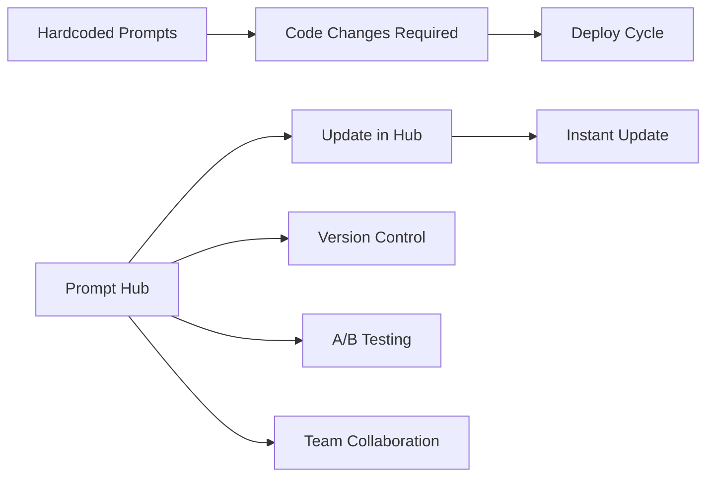

# Prompt Hub

## Introduction

LangSmith Prompt Hub is a centralized repository for managing, versioning, and sharing prompt templates. Instead of hardcoding prompts in your application, you store them in the Hub and pull the latest version at runtime—enabling A/B testing, collaborative editing, and prompt optimization without code changes.

This lesson covers connecting to Prompt Hub, pushing/pulling prompts, versioning, caching strategies, and using Hub prompts directly with LLM providers.

### What We'll Cover

- Prompt Hub overview and setup
- Pushing prompts with `push_prompt()`
- Pulling prompts with `pull_prompt()`
- Version management and tagging
- Caching for performance
- Using Hub prompts with OpenAI/Anthropic APIs

### Prerequisites

- LangSmith account (free tier available)
- LangChain prompt fundamentals (Lessons 8.2.1-4)

---

## Why Prompt Hub?



| Challenge | Without Hub | With Hub |
|-----------|-------------|----------|
| Prompt updates | Code change + deploy | Update in UI, instant |
| Version control | Git commits | Built-in versioning |
| A/B testing | Feature flags | Native support |
| Collaboration | Code reviews | Web UI editing |
| Rollbacks | Git revert | One-click restore |

---

## Setup

### Environment Configuration

```bash
# Set environment variables
export LANGCHAIN_API_KEY="your-api-key"
export LANGCHAIN_TRACING_V2="true"  # Optional: enable tracing
```

```python
import os

# Or set in Python
os.environ["LANGCHAIN_API_KEY"] = "your-api-key"
```

### Install Dependencies

```bash
pip install langsmith langchain-core
```

---

## Pushing Prompts

Save prompts to the Hub:

### Basic Push

```python
from langchain import hub
from langchain.prompts import ChatPromptTemplate

# Create a prompt template
prompt = ChatPromptTemplate.from_messages([
    ("system", "You are a helpful assistant specialized in {domain}."),
    ("human", "{question}")
])

# Push to Hub
# Format: "owner/prompt-name" or just "prompt-name" for your account
hub.push("my-username/domain-expert", prompt)
print("Prompt pushed successfully!")
```

### Push with Metadata

```python
from langchain import hub
from langchain.prompts import ChatPromptTemplate

prompt = ChatPromptTemplate.from_messages([
    ("system", """You are a code reviewer. Analyze code for:
- Bugs and errors
- Performance issues
- Security vulnerabilities
- Best practices"""),
    ("human", "Review this code:\n\n{code}")
])

# Push with description and tags
hub.push(
    "my-username/code-reviewer",
    prompt,
    new_repo_description="Reviews code for quality and security",
    new_repo_is_public=False,  # Private by default
    new_repo_tags=["code-review", "security", "quality"]
)
```

### Updating Existing Prompts

```python
from langchain import hub
from langchain.prompts import ChatPromptTemplate

# Modified prompt (v2)
prompt_v2 = ChatPromptTemplate.from_messages([
    ("system", """You are an expert code reviewer. Analyze code for:
- Bugs and logical errors
- Performance bottlenecks
- Security vulnerabilities (OWASP Top 10)
- Best practices and patterns
- Maintainability concerns"""),
    ("human", "Review this {language} code:\n\n{code}")
])

# Push creates a new version
hub.push("my-username/code-reviewer", prompt_v2)
# Now version 2 is the latest
```

---

## Pulling Prompts

Retrieve prompts from the Hub:

### Basic Pull

```python
from langchain import hub

# Pull latest version
prompt = hub.pull("my-username/code-reviewer")

# Use the prompt
formatted = prompt.format(
    language="Python",
    code="def add(a, b): return a + b"
)
print(formatted)
```

### Pull Specific Version

```python
from langchain import hub

# Pull specific version by commit hash
prompt_v1 = hub.pull("my-username/code-reviewer:abc123")

# Pull by tag
prompt_prod = hub.pull("my-username/code-reviewer:production")

# Pull latest
prompt_latest = hub.pull("my-username/code-reviewer:latest")
```

### Pull Public Prompts

```python
from langchain import hub

# Pull community prompts
# These are popular public prompts from the Hub
rag_prompt = hub.pull("langchain-ai/rag-prompt")
react_prompt = hub.pull("langchain-ai/react-agent-prompt")
```

---

## Version Management

### Listing Versions

```python
from langsmith import Client

client = Client()

# Get all versions of a prompt
versions = client.list_commits(
    prompt_identifier="my-username/code-reviewer"
)

for version in versions:
    print(f"Commit: {version.commit_hash}")
    print(f"Created: {version.created_at}")
    print(f"Message: {version.message}")
    print("---")
```

### Tagging Versions

```python
from langsmith import Client

client = Client()

# Tag a specific version
client.create_commit_tag(
    prompt_identifier="my-username/code-reviewer",
    commit_hash="abc123def456",
    tag="production"
)

# Now you can pull by tag
# hub.pull("my-username/code-reviewer:production")
```

### Comparing Versions

```python
from langchain import hub
from difflib import unified_diff

# Pull two versions
v1 = hub.pull("my-username/code-reviewer:v1")
v2 = hub.pull("my-username/code-reviewer:latest")

# Compare (simplified)
v1_str = str(v1.messages)
v2_str = str(v2.messages)

diff = unified_diff(
    v1_str.splitlines(),
    v2_str.splitlines(),
    fromfile='v1',
    tofile='v2'
)
print('\n'.join(diff))
```

---

## Caching Strategies

Optimize performance with caching:

### In-Memory Caching

```python
from langchain import hub
from functools import lru_cache

@lru_cache(maxsize=100)
def get_prompt(name: str, version: str = "latest"):
    """Cache prompts in memory."""
    identifier = f"{name}:{version}" if version != "latest" else name
    return hub.pull(identifier)

# First call fetches from Hub
prompt1 = get_prompt("my-username/code-reviewer")

# Subsequent calls use cache
prompt2 = get_prompt("my-username/code-reviewer")  # Instant
```

### Time-Based Cache

```python
from langchain import hub
from datetime import datetime, timedelta
from typing import Any

class PromptCache:
    """Cache prompts with TTL."""
    
    def __init__(self, ttl_minutes: int = 60):
        self.cache: dict[str, tuple[Any, datetime]] = {}
        self.ttl = timedelta(minutes=ttl_minutes)
    
    def get(self, name: str, version: str = "latest") -> Any:
        key = f"{name}:{version}"
        
        if key in self.cache:
            prompt, cached_at = self.cache[key]
            if datetime.now() - cached_at < self.ttl:
                return prompt
        
        # Fetch fresh
        identifier = f"{name}:{version}" if version != "latest" else name
        prompt = hub.pull(identifier)
        self.cache[key] = (prompt, datetime.now())
        return prompt

# Usage
cache = PromptCache(ttl_minutes=30)
prompt = cache.get("my-username/code-reviewer")
```

### Offline Mode

```python
from langchain import hub
import json
import os

class OfflinePromptManager:
    """Support offline prompt access."""
    
    def __init__(self, cache_dir: str = ".prompt_cache"):
        self.cache_dir = cache_dir
        os.makedirs(cache_dir, exist_ok=True)
    
    def pull_and_cache(self, name: str) -> None:
        """Pull prompt and save locally."""
        prompt = hub.pull(name)
        
        cache_path = os.path.join(
            self.cache_dir, 
            name.replace("/", "_") + ".json"
        )
        
        # Save serialized prompt
        with open(cache_path, "w") as f:
            json.dump(prompt.dict(), f)
    
    def get(self, name: str, offline: bool = False):
        """Get prompt, optionally from cache only."""
        cache_path = os.path.join(
            self.cache_dir,
            name.replace("/", "_") + ".json"
        )
        
        if offline:
            # Load from cache
            with open(cache_path) as f:
                data = json.load(f)
            from langchain.prompts import ChatPromptTemplate
            return ChatPromptTemplate.from_messages(data["messages"])
        
        try:
            prompt = hub.pull(name)
            self.pull_and_cache(name)  # Update cache
            return prompt
        except Exception:
            # Fallback to cache
            return self.get(name, offline=True)
```

---

## Using with LLM APIs Directly

Use Hub prompts without full LangChain chains:

### With OpenAI SDK

```python
from langchain import hub
from openai import OpenAI

# Pull prompt
prompt = hub.pull("my-username/code-reviewer")

# Format messages
messages = prompt.format_messages(
    language="Python",
    code="def factorial(n): return 1 if n <= 1 else n * factorial(n-1)"
)

# Convert to OpenAI format
openai_messages = [
    {"role": msg.type, "content": msg.content}
    for msg in messages
]

# Use with OpenAI SDK
client = OpenAI()
response = client.chat.completions.create(
    model="gpt-4o",
    messages=openai_messages
)

print(response.choices[0].message.content)
```

### With Anthropic SDK

```python
from langchain import hub
from anthropic import Anthropic

# Pull prompt
prompt = hub.pull("my-username/code-reviewer")

# Format messages
messages = prompt.format_messages(
    language="Python",
    code="def add(a, b): return a + b"
)

# Convert to Anthropic format
system_content = None
anthropic_messages = []

for msg in messages:
    if msg.type == "system":
        system_content = msg.content
    else:
        anthropic_messages.append({
            "role": "user" if msg.type == "human" else "assistant",
            "content": msg.content
        })

# Use with Anthropic SDK
client = Anthropic()
response = client.messages.create(
    model="claude-sonnet-4-20250514",
    max_tokens=1024,
    system=system_content,
    messages=anthropic_messages
)

print(response.content[0].text)
```

---

## Prompt Hub Patterns

### Environment-Based Selection

```python
from langchain import hub
import os

def get_prompt(name: str):
    """Get prompt based on environment."""
    env = os.getenv("ENVIRONMENT", "development")
    
    if env == "production":
        # Use tagged production version
        return hub.pull(f"{name}:production")
    elif env == "staging":
        # Use staging tag
        return hub.pull(f"{name}:staging")
    else:
        # Use latest for development
        return hub.pull(name)

# Usage
prompt = get_prompt("my-username/code-reviewer")
```

### A/B Testing

```python
from langchain import hub
import random

def get_ab_prompt(name: str, variants: list[str], weights: list[float] = None):
    """Select prompt variant for A/B testing."""
    variant = random.choices(variants, weights=weights)[0]
    prompt = hub.pull(f"{name}:{variant}")
    
    return prompt, variant

# Usage
prompt, selected_variant = get_ab_prompt(
    "my-username/code-reviewer",
    variants=["control", "variant-a", "variant-b"],
    weights=[0.5, 0.25, 0.25]
)

# Log which variant was used for analysis
print(f"Using variant: {selected_variant}")
```

### Prompt Registry

```python
from langchain import hub
from dataclasses import dataclass
from typing import Optional

@dataclass
class PromptConfig:
    name: str
    version: str = "latest"
    fallback_version: Optional[str] = None

class PromptRegistry:
    """Centralized prompt management."""
    
    def __init__(self):
        self.configs: dict[str, PromptConfig] = {}
        self.cache: dict[str, any] = {}
    
    def register(self, key: str, config: PromptConfig):
        """Register a prompt configuration."""
        self.configs[key] = config
    
    def get(self, key: str):
        """Get a prompt by registry key."""
        if key in self.cache:
            return self.cache[key]
        
        config = self.configs[key]
        
        try:
            identifier = f"{config.name}:{config.version}"
            prompt = hub.pull(identifier)
        except Exception:
            if config.fallback_version:
                identifier = f"{config.name}:{config.fallback_version}"
                prompt = hub.pull(identifier)
            else:
                raise
        
        self.cache[key] = prompt
        return prompt

# Usage
registry = PromptRegistry()

# Register prompts
registry.register("code_review", PromptConfig(
    name="my-username/code-reviewer",
    version="production",
    fallback_version="v1"
))

registry.register("summarize", PromptConfig(
    name="my-username/summarizer",
    version="latest"
))

# Get prompts by key
review_prompt = registry.get("code_review")
summary_prompt = registry.get("summarize")
```

---

## Best Practices

| Practice | Why It Matters |
|----------|----------------|
| Tag production versions | Never auto-deploy latest |
| Use meaningful commit messages | Track what changed |
| Cache aggressively | Reduce API calls |
| Have offline fallback | Handle Hub outages |
| Test before tagging production | Validate prompt quality |

---

## Common Pitfalls

| ❌ Mistake | ✅ Solution |
|-----------|-------------|
| Using `:latest` in production | Tag specific versions |
| No caching | Implement TTL cache |
| No offline fallback | Cache prompts locally |
| Sharing API keys | Use environment variables |
| Not versioning | Push after every change |

---

## Hands-on Exercise

### Your Task

Build a prompt management system that:
1. Supports multiple environments (dev/staging/prod)
2. Implements caching with TTL
3. Has offline fallback capability
4. Logs which prompt version is used

### Requirements

1. Create environment-aware prompt retrieval
2. Implement 5-minute cache TTL
3. Save prompts locally for offline use
4. Return version metadata with prompts

### Expected Result

A robust system that handles Hub outages and supports multiple environments.

<details>
<summary>💡 Hints (click to expand)</summary>

- Use dataclass for return type with prompt + metadata
- Hash prompt identifier for cache keys
- Use try/except for fallback logic
- Consider logging with structlog or standard logging

</details>

<details>
<summary>✅ Solution (click to expand)</summary>

```python
from langchain import hub
from dataclasses import dataclass, field
from datetime import datetime, timedelta
from typing import Optional, Any
import json
import os
import logging

logging.basicConfig(level=logging.INFO)
logger = logging.getLogger(__name__)

@dataclass
class PromptResult:
    """Result with prompt and metadata."""
    prompt: Any
    name: str
    version: str
    source: str  # "hub", "cache", or "offline"
    fetched_at: datetime = field(default_factory=datetime.now)

class ProductionPromptManager:
    """Production-ready prompt management."""
    
    def __init__(
        self,
        cache_dir: str = ".prompts",
        cache_ttl_minutes: int = 5,
        environment: str = None
    ):
        self.cache_dir = cache_dir
        self.cache_ttl = timedelta(minutes=cache_ttl_minutes)
        self.environment = environment or os.getenv("ENVIRONMENT", "development")
        self.memory_cache: dict[str, tuple[PromptResult, datetime]] = {}
        
        os.makedirs(cache_dir, exist_ok=True)
        logger.info(f"Prompt manager initialized: env={self.environment}")
    
    def _get_version_for_env(self, base_name: str) -> str:
        """Determine version based on environment."""
        env_tags = {
            "production": "production",
            "staging": "staging",
            "development": "latest"
        }
        return env_tags.get(self.environment, "latest")
    
    def _cache_path(self, name: str, version: str) -> str:
        """Get local cache file path."""
        safe_name = name.replace("/", "_").replace(":", "_")
        return os.path.join(self.cache_dir, f"{safe_name}_{version}.json")
    
    def _save_offline(self, name: str, version: str, prompt: Any) -> None:
        """Save prompt for offline access."""
        try:
            path = self._cache_path(name, version)
            with open(path, "w") as f:
                json.dump({
                    "messages": [
                        {"type": m.type, "content": m.content}
                        for m in prompt.messages
                    ],
                    "saved_at": datetime.now().isoformat()
                }, f)
            logger.debug(f"Saved offline: {path}")
        except Exception as e:
            logger.warning(f"Failed to save offline: {e}")
    
    def _load_offline(self, name: str, version: str) -> Optional[Any]:
        """Load prompt from offline cache."""
        try:
            path = self._cache_path(name, version)
            with open(path) as f:
                data = json.load(f)
            
            from langchain.prompts import ChatPromptTemplate
            messages = [
                (m["type"], m["content"]) for m in data["messages"]
            ]
            return ChatPromptTemplate.from_messages(messages)
        except FileNotFoundError:
            return None
        except Exception as e:
            logger.warning(f"Failed to load offline: {e}")
            return None
    
    def get(self, name: str, version: str = None) -> PromptResult:
        """Get prompt with caching and fallback."""
        # Determine version
        if version is None:
            version = self._get_version_for_env(name)
        
        cache_key = f"{name}:{version}"
        
        # Check memory cache
        if cache_key in self.memory_cache:
            result, cached_at = self.memory_cache[cache_key]
            if datetime.now() - cached_at < self.cache_ttl:
                logger.info(f"Memory cache hit: {cache_key}")
                return result
        
        # Try fetching from Hub
        try:
            identifier = f"{name}:{version}" if version != "latest" else name
            prompt = hub.pull(identifier)
            
            result = PromptResult(
                prompt=prompt,
                name=name,
                version=version,
                source="hub"
            )
            
            # Update caches
            self.memory_cache[cache_key] = (result, datetime.now())
            self._save_offline(name, version, prompt)
            
            logger.info(f"Fetched from Hub: {cache_key}")
            return result
            
        except Exception as e:
            logger.warning(f"Hub fetch failed: {e}")
            
            # Try offline fallback
            prompt = self._load_offline(name, version)
            if prompt:
                result = PromptResult(
                    prompt=prompt,
                    name=name,
                    version=version,
                    source="offline"
                )
                logger.info(f"Using offline cache: {cache_key}")
                return result
            
            # Try latest as last resort
            if version != "latest":
                logger.info(f"Trying latest version as fallback")
                return self.get(name, version="latest")
            
            raise RuntimeError(f"Could not load prompt: {name}")
    
    def warmup(self, prompts: list[str]) -> None:
        """Pre-fetch prompts to cache."""
        for name in prompts:
            try:
                self.get(name)
            except Exception as e:
                logger.error(f"Warmup failed for {name}: {e}")

# Usage
manager = ProductionPromptManager(
    cache_ttl_minutes=5,
    environment="production"
)

# Warmup common prompts
manager.warmup([
    "my-username/code-reviewer",
    "my-username/summarizer"
])

# Get prompt with full metadata
result = manager.get("my-username/code-reviewer")
print(f"Prompt: {result.name}")
print(f"Version: {result.version}")
print(f"Source: {result.source}")
print(f"Fetched: {result.fetched_at}")

# Use the prompt
messages = result.prompt.format_messages(
    language="Python",
    code="print('hello')"
)
```

</details>

### Bonus Challenges

- [ ] Add metrics tracking (cache hit rate, fetch latency)
- [ ] Implement gradual rollout for new prompt versions
- [ ] Build prompt validation before pushing
- [ ] Create a CLI tool for prompt management

---

## Summary

✅ Prompt Hub centralizes prompt management outside code  
✅ `hub.push()` saves prompts; `hub.pull()` retrieves them  
✅ Tag versions for production stability  
✅ Cache prompts to reduce latency and API calls  
✅ Implement offline fallback for reliability  
✅ Hub prompts work with any LLM SDK  

**Next:** [LlamaIndex Fundamentals](../03-llamaindex-fundamentals/00-llamaindex-fundamentals.md) — Data ingestion and indexing

---

## Navigation

| Previous | Up | Next Lesson |
|----------|-----|------|
| [Advanced Features](./05-advanced-features.md) | [Prompt Templates](./00-prompt-templates.md) | [LlamaIndex Fundamentals](../03-llamaindex-fundamentals/00-llamaindex-fundamentals.md) |

<!-- 
Sources Consulted:
- LangSmith Hub documentation: https://docs.smith.langchain.com/prompt_engineering/prompt_hub
- LangChain hub module: https://github.com/langchain-ai/langchain/blob/main/libs/langchain/langchain/hub.py
- LangSmith Python SDK: https://github.com/langchain-ai/langsmith-sdk
-->
