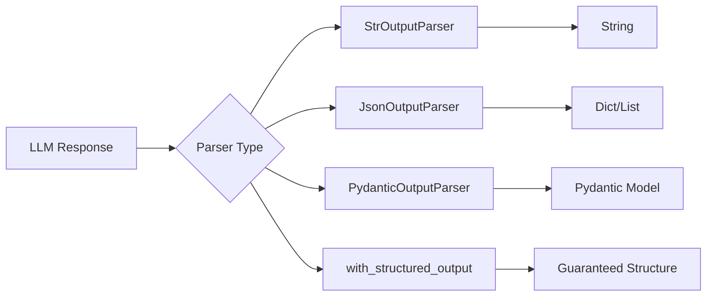

# Output Parsing

## Introduction

LLMs generate text, but applications need structured data. **Output parsers** bridge this gap by transforming raw LLM output into Python objects, dictionaries, lists, or Pydantic models. Proper output parsing is essential for building reliable AI applications that integrate with databases, APIs, and downstream systems.

This lesson covers LangChain's comprehensive output parsing system—from simple string parsers to Pydantic validation, structured output methods, and auto-correction strategies.

### Why Output Parsing Matters

| Challenge | Without Parsing | With Parsing |
|-----------|-----------------|--------------|
| Data extraction | Manual regex/string ops | Automatic structured data |
| Type safety | Runtime errors | Validated types |
| Error handling | Crashes on bad output | Graceful recovery |
| API integration | Custom conversion | Direct object usage |

---

## Output Parser Architecture



---

## Quick Start

### Basic String Parsing

```python
from langchain_core.output_parsers import StrOutputParser
from langchain.chat_models import init_chat_model

model = init_chat_model("gpt-4o")
parser = StrOutputParser()

# Chain: model output → string
chain = model | parser
result = chain.invoke("Say hello")
print(result)  # "Hello! How can I help you today?"
print(type(result))  # <class 'str'>
```

### Pydantic Model Parsing

```python
from langchain_core.output_parsers import PydanticOutputParser
from pydantic import BaseModel, Field

class Joke(BaseModel):
    setup: str = Field(description="The setup of the joke")
    punchline: str = Field(description="The punchline")

parser = PydanticOutputParser(pydantic_object=Joke)
```

### Structured Output (Recommended)

```python
from langchain.chat_models import init_chat_model
from pydantic import BaseModel

class Person(BaseModel):
    name: str
    age: int

model = init_chat_model("gpt-4o")
structured = model.with_structured_output(Person)
result = structured.invoke("Extract: John is 25 years old")
# Person(name='John', age=25)
```

---

## Parser Types Overview

| Parser | Use Case | Output Type |
|--------|----------|-------------|
| `StrOutputParser` | Raw text | `str` |
| `JsonOutputParser` | JSON data | `dict` or `list` |
| `PydanticOutputParser` | Validated objects | Pydantic model |
| `CommaSeparatedListOutputParser` | Simple lists | `list[str]` |
| `DatetimeOutputParser` | Dates/times | `datetime` |
| `EnumOutputParser` | Enum values | `Enum` |
| `XMLOutputParser` | XML data | `dict` |
| `YamlOutputParser` | YAML data | Pydantic model |

---

## Sub-Topics

| Topic | Description |
|-------|-------------|
| [Parser Basics](./01-parser-basics.md) | StrOutputParser, interface, error handling |
| [Pydantic Parser](./02-pydantic-output-parser.md) | PydanticOutputParser, validation, format instructions |
| [JSON Parser](./03-json-output-parser.md) | JsonOutputParser, streaming, partial JSON |
| [Structured Output](./04-structured-output.md) | with_structured_output, function calling, json_mode |
| [Custom Parsers](./05-custom-parsers.md) | BaseOutputParser, regex, XML, markdown |
| [Output Fixing](./06-output-fixing.md) | OutputFixingParser, retry, auto-correction |

---

## Common Pattern: Prompt | Model | Parser

```python
from langchain.prompts import ChatPromptTemplate
from langchain.chat_models import init_chat_model
from langchain_core.output_parsers import PydanticOutputParser
from pydantic import BaseModel

class Summary(BaseModel):
    title: str
    key_points: list[str]
    word_count: int

parser = PydanticOutputParser(pydantic_object=Summary)

prompt = ChatPromptTemplate.from_messages([
    ("system", "Summarize the text. {format_instructions}"),
    ("human", "{text}")
])

model = init_chat_model("gpt-4o")

# The LCEL pattern
chain = prompt | model | parser

result = chain.invoke({
    "text": "LangChain is a framework for developing applications...",
    "format_instructions": parser.get_format_instructions()
})
```

---

## When to Use Each Approach

| Scenario | Recommended Approach |
|----------|---------------------|
| Simple text responses | `StrOutputParser` |
| Need validated structure | `PydanticOutputParser` |
| Model supports structured output | `with_structured_output()` |
| Streaming JSON responses | `JsonOutputParser` |
| Legacy text parsing | Custom parser with regex |
| Unreliable model output | `OutputFixingParser` |

---

## Navigation

| Previous | Up | Next |
|----------|-----|------|
| [Prompt Templates](../02-prompt-templates/00-prompt-templates.md) | [Unit 8 Overview](../00-overview.md) | [Parser Basics](./01-parser-basics.md) |
