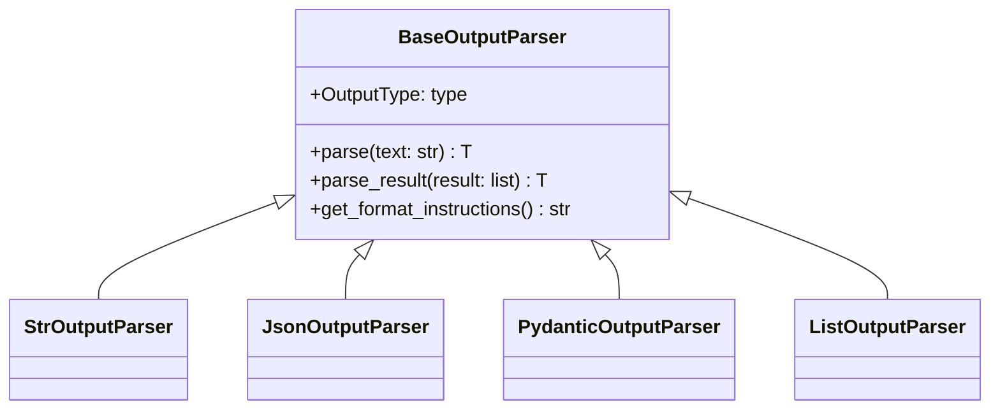

# Parser Basics

## Introduction

Output parsers transform LLM text responses into usable Python data. Understanding the parser interface and error handling patterns is essential for building robust AI applications. This lesson covers the foundational parsers and the `BaseOutputParser` interface that all parsers implement.

### What We'll Cover

- StrOutputParser for text extraction
- The BaseOutputParser interface
- Built-in simple parsers (list, datetime, enum, boolean)
- Error handling with OutputParserException
- Streaming output parsing

### Prerequisites

- LangChain fundamentals (Lesson 8.1)
- LCEL basics (chains with `|` operator)

---

## StrOutputParser

The simplest parser—extracts text content from LLM responses:

### Basic Usage

```python
from langchain_core.output_parsers import StrOutputParser
from langchain.chat_models import init_chat_model

model = init_chat_model("gpt-4o")
parser = StrOutputParser()

# Without parser: returns AIMessage object
response = model.invoke("Say hello")
print(type(response))  # <class 'langchain_core.messages.ai.AIMessage'>
print(response.content)  # "Hello! How can I help you?"

# With parser: returns string directly
chain = model | parser
result = chain.invoke("Say hello")
print(type(result))  # <class 'str'>
print(result)  # "Hello! How can I help you?"
```

### Why Use StrOutputParser?

| Without Parser | With Parser |
|----------------|-------------|
| Returns `AIMessage` object | Returns `str` directly |
| Need `.content` access | Ready to use |
| Extra object overhead | Clean data flow |
| Complex downstream handling | Simple string operations |

### Streaming with StrOutputParser

```python
from langchain_core.output_parsers import StrOutputParser
from langchain.chat_models import init_chat_model

model = init_chat_model("gpt-4o")
parser = StrOutputParser()

chain = model | parser

# Stream tokens as strings
for chunk in chain.stream("Tell me a short story"):
    print(chunk, end="", flush=True)
# Streams: "Once" "upon" "a" "time" "..."
```

---

## BaseOutputParser Interface

All output parsers implement `BaseOutputParser`:



### Key Methods

| Method | Purpose |
|--------|---------|
| `parse(text)` | Parse a string into the output type |
| `parse_result(result)` | Parse a list of Generation objects |
| `get_format_instructions()` | Get instructions to include in prompts |
| `OutputType` | Property returning the output type |

### Example: Using the Interface

```python
from langchain_core.output_parsers import PydanticOutputParser
from pydantic import BaseModel

class Movie(BaseModel):
    title: str
    year: int

parser = PydanticOutputParser(pydantic_object=Movie)

# Get format instructions for the prompt
instructions = parser.get_format_instructions()
print(instructions)
# "The output should be formatted as a JSON instance..."

# Parse raw text
result = parser.parse('{"title": "Inception", "year": 2010}')
print(result)  # Movie(title='Inception', year=2010)

# Check output type
print(parser.OutputType)  # <class '__main__.Movie'>
```

---

## List Parsers

Parse comma-separated or formatted lists:

### CommaSeparatedListOutputParser

```python
from langchain_core.output_parsers import CommaSeparatedListOutputParser

parser = CommaSeparatedListOutputParser()

# Get format instructions
print(parser.get_format_instructions())
# "Your response should be a list of comma separated values..."

# Parse comma-separated text
result = parser.parse("apple, banana, cherry")
print(result)  # ['apple', 'banana', 'cherry']
```

### NumberedListOutputParser

```python
from langchain_core.output_parsers import NumberedListOutputParser

parser = NumberedListOutputParser()

text = """1. First item
2. Second item
3. Third item"""

result = parser.parse(text)
print(result)  # ['First item', 'Second item', 'Third item']
```

### MarkdownListOutputParser

```python
from langchain_core.output_parsers import MarkdownListOutputParser

parser = MarkdownListOutputParser()

text = """- Item one
- Item two
- Item three"""

result = parser.parse(text)
print(result)  # ['Item one', 'Item two', 'Item three']
```

---

## DatetimeOutputParser

Parse date and time strings:

```python
from langchain.output_parsers import DatetimeOutputParser

parser = DatetimeOutputParser()

# Get format instructions
print(parser.get_format_instructions())
# "Write a datetime string that matches the pattern: '%Y-%m-%dT%H:%M:%S.%fZ'"

# Parse datetime string
result = parser.parse("2024-07-15T10:30:00.000000Z")
print(result)  # 2024-07-15 10:30:00+00:00
print(type(result))  # <class 'datetime.datetime'>
```

### Custom Format

```python
from langchain.output_parsers import DatetimeOutputParser

# Use a custom format
parser = DatetimeOutputParser(format="%Y-%m-%d")

result = parser.parse("2024-07-15")
print(result)  # 2024-07-15 00:00:00
```

---

## EnumOutputParser

Parse into Python Enum values:

```python
from langchain.output_parsers import EnumOutputParser
from enum import Enum

class Sentiment(Enum):
    POSITIVE = "positive"
    NEGATIVE = "negative"
    NEUTRAL = "neutral"

parser = EnumOutputParser(enum=Sentiment)

# Get format instructions
print(parser.get_format_instructions())
# "Select one of the following options: positive, negative, neutral"

# Parse enum value
result = parser.parse("positive")
print(result)  # Sentiment.POSITIVE
print(type(result))  # <class '__main__.Sentiment'>
```

---

## BooleanOutputParser

Parse yes/no responses:

```python
from langchain.output_parsers import BooleanOutputParser

parser = BooleanOutputParser()

# Parse various boolean representations
print(parser.parse("yes"))   # True
print(parser.parse("YES"))   # True
print(parser.parse("no"))    # False
print(parser.parse("NO"))    # False
```

---

## Error Handling

### OutputParserException

Parsers raise `OutputParserException` when parsing fails:

```python
from langchain_core.exceptions import OutputParserException
from langchain_core.output_parsers import PydanticOutputParser
from pydantic import BaseModel

class Person(BaseModel):
    name: str
    age: int

parser = PydanticOutputParser(pydantic_object=Person)

# Try parsing invalid JSON
try:
    result = parser.parse("This is not JSON")
except OutputParserException as e:
    print(f"Parse error: {e}")
    # Parse error: Failed to parse output...
```

### Safe Parsing Pattern

```python
from langchain_core.exceptions import OutputParserException
from langchain_core.output_parsers import PydanticOutputParser
from pydantic import BaseModel
from typing import Optional

class Person(BaseModel):
    name: str
    age: int

parser = PydanticOutputParser(pydantic_object=Person)

def safe_parse(text: str) -> Optional[Person]:
    """Parse with fallback to None."""
    try:
        return parser.parse(text)
    except OutputParserException:
        return None

# Usage
result = safe_parse("invalid json")
if result is None:
    print("Failed to parse, using default")
```

### Chaining with Error Handling

```python
from langchain_core.output_parsers import PydanticOutputParser
from langchain.chat_models import init_chat_model
from langchain.prompts import ChatPromptTemplate
from pydantic import BaseModel

class Response(BaseModel):
    answer: str
    confidence: float

parser = PydanticOutputParser(pydantic_object=Response)

prompt = ChatPromptTemplate.from_messages([
    ("system", "Answer with JSON. {format_instructions}"),
    ("human", "{question}")
])

model = init_chat_model("gpt-4o")

chain = prompt | model | parser

# Use with_fallbacks for graceful degradation
from langchain_core.runnables import RunnableLambda

def fallback_parser(input):
    return Response(answer="Error parsing response", confidence=0.0)

safe_chain = chain.with_fallbacks([RunnableLambda(fallback_parser)])
```

---

## Streaming Parsers

Some parsers support streaming output:

### Transform Parsers

Transform parsers process output incrementally:

```python
from langchain_core.output_parsers import StrOutputParser
from langchain.chat_models import init_chat_model

model = init_chat_model("gpt-4o")
parser = StrOutputParser()

chain = model | parser

# Stream with transformation
for chunk in chain.stream("Count from 1 to 10"):
    print(chunk, end="")  # Streams character by character
```

### BaseCumulativeTransformOutputParser

For parsers that need to accumulate content:

```python
from langchain_core.output_parsers import JsonOutputParser
from langchain.chat_models import init_chat_model

model = init_chat_model("gpt-4o")
parser = JsonOutputParser()

chain = model | parser

# Stream JSON - accumulates until valid
for partial in chain.stream("Return a JSON with name and age"):
    print(partial)
    # {"name": "Jo...
    # {"name": "John"...
    # {"name": "John", "age": ...
    # {"name": "John", "age": 30}
```

---

## Integration with LCEL

### In Chains

```python
from langchain_core.output_parsers import CommaSeparatedListOutputParser
from langchain.prompts import ChatPromptTemplate
from langchain.chat_models import init_chat_model

parser = CommaSeparatedListOutputParser()

prompt = ChatPromptTemplate.from_messages([
    ("system", "You are a helpful assistant. {format_instructions}"),
    ("human", "List 5 {topic}")
])

model = init_chat_model("gpt-4o")

chain = (
    prompt.partial(format_instructions=parser.get_format_instructions())
    | model
    | parser
)

result = chain.invoke({"topic": "programming languages"})
print(result)  # ['Python', 'JavaScript', 'TypeScript', 'Go', 'Rust']
```

### With RunnablePassthrough

```python
from langchain_core.output_parsers import StrOutputParser
from langchain_core.runnables import RunnablePassthrough
from langchain.chat_models import init_chat_model

model = init_chat_model("gpt-4o")
parser = StrOutputParser()

chain = (
    RunnablePassthrough()
    | (lambda x: f"Summarize: {x}")
    | model
    | parser
    | (lambda x: x.upper())  # Post-process
)

result = chain.invoke("LangChain is a framework for AI apps...")
print(result)  # "LANGCHAIN IS A FRAMEWORK..."
```

---

## Best Practices

| Practice | Why It Matters |
|----------|----------------|
| Always use StrOutputParser in chains | Consistent string output |
| Include format_instructions in prompts | Guide model output |
| Handle OutputParserException | Prevent crashes |
| Use with_fallbacks for reliability | Graceful degradation |
| Choose parser based on output type | Match data needs |

---

## Common Pitfalls

| ❌ Mistake | ✅ Solution |
|-----------|-------------|
| Not handling parse errors | Wrap in try/except |
| Forgetting format instructions | Include in prompt |
| Using wrong parser type | Match parser to expected output |
| Not streaming when possible | Use streaming parsers |
| Assuming LLM follows format | Always validate output |

---

## Hands-on Exercise

### Your Task

Build a sentiment analysis chain that:
1. Takes a text input
2. Returns an enum sentiment (POSITIVE, NEGATIVE, NEUTRAL)
3. Handles parsing errors gracefully

### Requirements

1. Create a Sentiment enum
2. Use EnumOutputParser
3. Include format instructions in the prompt
4. Add error handling with fallback

### Expected Result

```python
result = chain.invoke({"text": "I love this product!"})
# Sentiment.POSITIVE
```

<details>
<summary>💡 Hints (click to expand)</summary>

- Define enum with POSITIVE, NEGATIVE, NEUTRAL
- Use ChatPromptTemplate with system and human messages
- Add with_fallbacks for error handling
- Test with both positive and negative texts

</details>

<details>
<summary>✅ Solution (click to expand)</summary>

```python
from langchain.output_parsers import EnumOutputParser
from langchain.prompts import ChatPromptTemplate
from langchain.chat_models import init_chat_model
from langchain_core.runnables import RunnableLambda
from enum import Enum

class Sentiment(Enum):
    POSITIVE = "positive"
    NEGATIVE = "negative"
    NEUTRAL = "neutral"

# Create parser
parser = EnumOutputParser(enum=Sentiment)

# Create prompt with format instructions
prompt = ChatPromptTemplate.from_messages([
    ("system", """Analyze the sentiment of the text.
{format_instructions}
Respond with ONLY one of: positive, negative, neutral"""),
    ("human", "{text}")
])

# Initialize model
model = init_chat_model("gpt-4o")

# Create chain
chain = (
    prompt.partial(format_instructions=parser.get_format_instructions())
    | model
    | parser
)

# Add fallback for errors
def fallback_sentiment(input):
    return Sentiment.NEUTRAL

safe_chain = chain.with_fallbacks([RunnableLambda(fallback_sentiment)])

# Test
positive = safe_chain.invoke({"text": "I love this product!"})
print(f"Positive text: {positive}")  # Sentiment.POSITIVE

negative = safe_chain.invoke({"text": "This is terrible, I hate it."})
print(f"Negative text: {negative}")  # Sentiment.NEGATIVE

neutral = safe_chain.invoke({"text": "The product exists."})
print(f"Neutral text: {neutral}")  # Sentiment.NEUTRAL
```

</details>

### Bonus Challenges

- [ ] Add confidence scoring to the output
- [ ] Support batch processing of multiple texts
- [ ] Implement async parsing with `aparse`
- [ ] Create a custom parser for star ratings (1-5)

---

## Summary

✅ `StrOutputParser` extracts text from AIMessage objects  
✅ `BaseOutputParser` defines the parser interface with `parse()` and `get_format_instructions()`  
✅ Built-in parsers handle lists, dates, enums, and booleans  
✅ `OutputParserException` signals parsing failures  
✅ Use `with_fallbacks` for graceful error handling  
✅ Streaming parsers enable real-time output processing  

**Next:** [Pydantic Parser](./02-pydantic-output-parser.md) — Validated structured output with Pydantic models

---

## Navigation

| Previous | Up | Next |
|----------|-----|------|
| [Output Parsing Overview](./00-output-parsing.md) | [Output Parsing](./00-output-parsing.md) | [Pydantic Parser](./02-pydantic-output-parser.md) |

<!-- 
Sources Consulted:
- LangChain core output_parsers/__init__.py: https://github.com/langchain-ai/langchain/blob/main/libs/core/langchain_core/output_parsers/__init__.py
- LangChain core output_parsers/base.py: https://github.com/langchain-ai/langchain/blob/main/libs/core/langchain_core/output_parsers/base.py
- LangChain output parsers list.py: https://github.com/langchain-ai/langchain/blob/main/libs/core/langchain_core/output_parsers/list.py
-->
