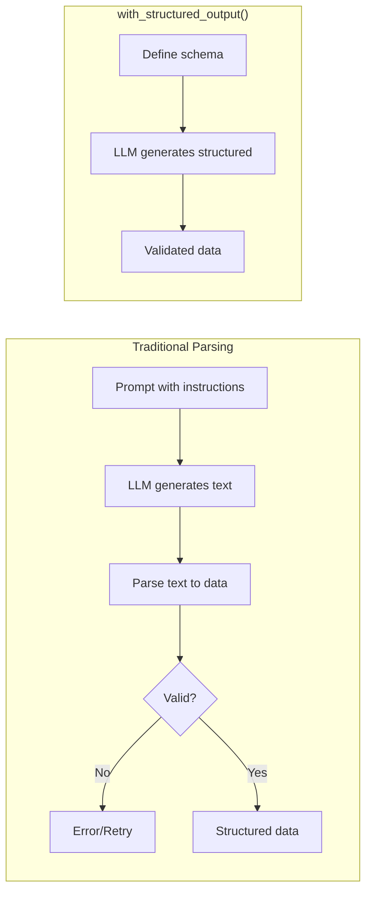

# Structured Output with `with_structured_output()`

## Introduction

`with_structured_output()` is the recommended approach for getting structured data from LLMs. It leverages native model capabilities—function calling, JSON mode, or JSON schema—to guarantee valid structured output without prompt engineering. This is more reliable than parsing text output.

### What We'll Cover

- The `with_structured_output()` method
- Three methods: function_calling, json_mode, json_schema
- Provider-specific implementations
- Strict mode for guaranteed conformance
- Comparing with traditional output parsers

### Prerequisites

- Parser Basics (Lesson 8.3.1)
- Pydantic models
- LangChain chat models

---

## Why Structured Output?



| Approach | Reliability | Complexity | Performance |
|----------|-------------|------------|-------------|
| Text + Parser | Variable | High | Slower |
| `with_structured_output()` | Very High | Low | Faster |

---

## Basic Usage

### Simple Example

```python
from langchain.chat_models import init_chat_model
from pydantic import BaseModel, Field

class Person(BaseModel):
    """Information about a person."""
    name: str = Field(description="Full name")
    age: int = Field(description="Age in years")
    occupation: str = Field(description="Current job")

# Create model with structured output
model = init_chat_model("gpt-4o")
structured_model = model.with_structured_output(Person)

# Invoke - returns Person instance directly
result = structured_model.invoke("John is a 32-year-old software engineer")

print(result)         # name='John' age=32 occupation='software engineer'
print(result.name)    # John
print(type(result))   # <class '__main__.Person'>
```

### Using TypedDict

```python
from langchain.chat_models import init_chat_model
from typing import TypedDict, Annotated

class MovieInfo(TypedDict):
    """Movie information."""
    title: Annotated[str, ..., "The movie title"]
    year: Annotated[int, ..., "Release year"]
    director: Annotated[str, ..., "Director name"]

model = init_chat_model("gpt-4o")
structured_model = model.with_structured_output(MovieInfo)

result = structured_model.invoke("Tell me about Inception")
print(result)  # {'title': 'Inception', 'year': 2010, 'director': 'Christopher Nolan'}
```

### Using JSON Schema Directly

```python
from langchain.chat_models import init_chat_model

# Define schema as dict
schema = {
    "title": "Product",
    "type": "object",
    "properties": {
        "name": {"type": "string", "description": "Product name"},
        "price": {"type": "number", "description": "Price in USD"},
        "in_stock": {"type": "boolean", "description": "Availability"}
    },
    "required": ["name", "price", "in_stock"]
}

model = init_chat_model("gpt-4o")
structured_model = model.with_structured_output(schema)

result = structured_model.invoke("The Widget costs $29.99 and is available")
print(result)  # {'name': 'Widget', 'price': 29.99, 'in_stock': True}
```

---

## Method Options

### Three Implementation Methods

The `method` parameter controls how structured output is achieved:

| Method | How It Works | Provider Support |
|--------|--------------|------------------|
| `function_calling` | Uses tool/function calling API | OpenAI, Anthropic, Google, Mistral |
| `json_mode` | Forces JSON output format | OpenAI, Anthropic, Fireworks |
| `json_schema` | Native structured output | OpenAI (gpt-4o), Anthropic (claude-3.5) |

### Specifying Method

```python
from langchain.chat_models import init_chat_model
from pydantic import BaseModel

class Response(BaseModel):
    answer: str
    confidence: float

model = init_chat_model("gpt-4o")

# Using function calling (default for most providers)
fc_model = model.with_structured_output(Response, method="function_calling")

# Using JSON mode
json_model = model.with_structured_output(Response, method="json_mode")

# Using native JSON schema (when available)
schema_model = model.with_structured_output(Response, method="json_schema")
```

### Method Comparison

```python
from langchain.chat_models import init_chat_model
from pydantic import BaseModel, Field
import time

class Analysis(BaseModel):
    summary: str = Field(description="Brief summary")
    sentiment: str = Field(description="positive, negative, or neutral")
    score: float = Field(ge=0, le=1, description="Confidence score")

model = init_chat_model("gpt-4o")
text = "This product exceeded my expectations! Highly recommend."

# Compare methods
methods = ["function_calling", "json_mode", "json_schema"]

for method in methods:
    try:
        structured = model.with_structured_output(Analysis, method=method)
        start = time.time()
        result = structured.invoke(text)
        elapsed = time.time() - start
        print(f"\n{method}:")
        print(f"  Result: {result.sentiment} ({result.score:.2f})")
        print(f"  Time: {elapsed:.2f}s")
    except Exception as e:
        print(f"\n{method}: Not supported - {e}")
```

---

## Strict Mode

### Guaranteed Schema Conformance

When `strict=True`, the output is guaranteed to match your schema exactly:

```python
from langchain.chat_models import init_chat_model
from pydantic import BaseModel, Field

class StrictData(BaseModel):
    """Data with strict schema."""
    name: str
    count: int
    tags: list[str]

model = init_chat_model("gpt-4o")

# Enable strict mode
strict_model = model.with_structured_output(
    StrictData,
    strict=True  # Guarantees schema conformance
)

result = strict_model.invoke("Three items named Widget with labels a, b, c")
print(result)  # Guaranteed to have all fields with correct types
```

### Strict Mode Requirements

> **Note:** Strict mode has schema restrictions:
> - All fields must be required (no Optional without default)
> - No `additionalProperties` allowed
> - Limited to specific types

```python
from pydantic import BaseModel, Field
from typing import Optional

# ❌ Won't work with strict=True
class InvalidForStrict(BaseModel):
    name: str
    age: Optional[int] = None  # Optional not allowed

# ✅ Works with strict=True
class ValidForStrict(BaseModel):
    name: str
    age: int  # All fields required
```

---

## Include Raw Response

### Getting Both Raw and Parsed

Use `include_raw=True` to get the original LLM response alongside parsed output:

```python
from langchain.chat_models import init_chat_model
from pydantic import BaseModel

class Summary(BaseModel):
    text: str
    word_count: int

model = init_chat_model("gpt-4o")

# Include raw response
structured_model = model.with_structured_output(
    Summary,
    include_raw=True
)

result = structured_model.invoke("Summarize: AI is transforming industries")

print(type(result))  # dict with 'raw' and 'parsed' keys
print(result["parsed"])  # Summary object
print(result["raw"])     # Original AIMessage
print(result["parsing_error"])  # None if successful
```

### Error Handling with include_raw

```python
from langchain.chat_models import init_chat_model
from pydantic import BaseModel

class Data(BaseModel):
    value: int

model = init_chat_model("gpt-4o")
structured_model = model.with_structured_output(Data, include_raw=True)

result = structured_model.invoke("Give me a number")

if result["parsing_error"]:
    print(f"Parse failed: {result['parsing_error']}")
    print(f"Raw response: {result['raw'].content}")
else:
    print(f"Parsed value: {result['parsed'].value}")
```

---

## Provider-Specific Implementations

### OpenAI

```python
from langchain_openai import ChatOpenAI
from pydantic import BaseModel

class Response(BaseModel):
    answer: str
    reasoning: str

# OpenAI supports all methods
model = ChatOpenAI(model="gpt-4o")

# Default: function_calling
fc = model.with_structured_output(Response)

# JSON mode requires prompt mentioning JSON
json_mode = model.with_structured_output(Response, method="json_mode")

# Native JSON schema (gpt-4o, gpt-4o-mini)
native = model.with_structured_output(Response, method="json_schema", strict=True)
```

### Anthropic

```python
from langchain_anthropic import ChatAnthropic
from pydantic import BaseModel

class Analysis(BaseModel):
    summary: str
    key_points: list[str]

# Anthropic Claude
model = ChatAnthropic(model="claude-sonnet-4-20250514")

# Uses tool calling by default
structured = model.with_structured_output(Analysis)

result = structured.invoke("Analyze the impact of AI on healthcare")
print(result.summary)
print(result.key_points)
```

### Google (Gemini)

```python
from langchain_google_genai import ChatGoogleGenerativeAI
from pydantic import BaseModel

class Translation(BaseModel):
    original: str
    translated: str
    language: str

model = ChatGoogleGenerativeAI(model="gemini-1.5-pro")
structured = model.with_structured_output(Translation)

result = structured.invoke("Translate 'Hello world' to French")
```

### Mistral

```python
from langchain_mistralai import ChatMistralAI
from pydantic import BaseModel

class CodeReview(BaseModel):
    issues: list[str]
    suggestions: list[str]
    score: int

model = ChatMistralAI(model="mistral-large-latest")
structured = model.with_structured_output(CodeReview)
```

---

## Integration with Chains

### In LCEL Chains

```python
from langchain.chat_models import init_chat_model
from langchain.prompts import ChatPromptTemplate
from pydantic import BaseModel, Field

class Sentiment(BaseModel):
    text: str = Field(description="The analyzed text")
    sentiment: str = Field(description="positive, negative, neutral")
    confidence: float = Field(ge=0, le=1)
    keywords: list[str] = Field(description="Key words affecting sentiment")

model = init_chat_model("gpt-4o")
structured_model = model.with_structured_output(Sentiment)

prompt = ChatPromptTemplate.from_messages([
    ("system", "Analyze sentiment of the following text thoroughly."),
    ("human", "{text}")
])

chain = prompt | structured_model

result = chain.invoke({"text": "The product is amazing but shipping was slow"})
print(f"Sentiment: {result.sentiment}")
print(f"Confidence: {result.confidence}")
print(f"Keywords: {result.keywords}")
```

### With RunnablePassthrough

```python
from langchain_core.runnables import RunnablePassthrough
from langchain.chat_models import init_chat_model
from pydantic import BaseModel

class Summary(BaseModel):
    summary: str
    topics: list[str]

model = init_chat_model("gpt-4o")
structured = model.with_structured_output(Summary)

chain = (
    RunnablePassthrough()
    | (lambda x: f"Summarize and extract topics: {x}")
    | structured
)

result = chain.invoke("Long document text here...")
```

### Parallel Structured Extraction

```python
from langchain_core.runnables import RunnableParallel
from langchain.chat_models import init_chat_model
from pydantic import BaseModel

class Entities(BaseModel):
    people: list[str]
    places: list[str]
    organizations: list[str]

class Topics(BaseModel):
    main_topic: str
    subtopics: list[str]

model = init_chat_model("gpt-4o")

# Different structured outputs
entity_model = model.with_structured_output(Entities)
topic_model = model.with_structured_output(Topics)

# Parallel extraction
chain = RunnableParallel(
    entities=entity_model,
    topics=topic_model
)

result = chain.invoke("Apple CEO Tim Cook announced new products in Cupertino...")
print(f"People: {result['entities'].people}")
print(f"Topics: {result['topics'].main_topic}")
```

---

## Comparing with Output Parsers

### When to Use Which

| Scenario | Recommended Approach |
|----------|---------------------|
| Simple structured data | `with_structured_output()` |
| Need streaming partial | `JsonOutputParser` |
| Complex validation logic | `PydanticOutputParser` |
| Text processing needed | `StrOutputParser` + post-process |
| Need format instructions in prompt | Traditional parsers |
| Maximum reliability | `with_structured_output(strict=True)` |

### Migration Example

```python
# Old way with PydanticOutputParser
from langchain_core.output_parsers import PydanticOutputParser
from langchain.prompts import ChatPromptTemplate
from pydantic import BaseModel

class OldWay(BaseModel):
    name: str
    value: int

parser = PydanticOutputParser(pydantic_object=OldWay)
prompt = ChatPromptTemplate.from_messages([
    ("system", "Respond in JSON. {format_instructions}"),
    ("human", "{input}")
]).partial(format_instructions=parser.get_format_instructions())

old_chain = prompt | model | parser

# New way with with_structured_output
class NewWay(BaseModel):
    name: str
    value: int

structured_model = model.with_structured_output(NewWay)
new_chain = structured_model  # Much simpler!

# Both produce same result type
```

---

## Error Handling

### Handling Failures

```python
from langchain.chat_models import init_chat_model
from pydantic import BaseModel, ValidationError
from langchain_core.exceptions import OutputParserException

class StrictModel(BaseModel):
    count: int
    items: list[str]

model = init_chat_model("gpt-4o")
structured = model.with_structured_output(StrictModel, include_raw=True)

def safe_extract(text: str) -> StrictModel | None:
    """Extract with error handling."""
    try:
        result = structured.invoke(text)
        
        if result.get("parsing_error"):
            print(f"Parse error: {result['parsing_error']}")
            return None
        
        return result["parsed"]
        
    except Exception as e:
        print(f"Extraction failed: {e}")
        return None

# Usage
data = safe_extract("Three items: apple, banana, cherry")
if data:
    print(f"Got {data.count} items: {data.items}")
```

### With Fallbacks

```python
from langchain.chat_models import init_chat_model
from langchain_core.runnables import RunnableLambda
from pydantic import BaseModel

class Data(BaseModel):
    value: str

model = init_chat_model("gpt-4o")
structured = model.with_structured_output(Data)

# Fallback function
def fallback(input):
    return Data(value="default")

# Chain with fallback
safe_chain = structured.with_fallbacks([RunnableLambda(fallback)])

result = safe_chain.invoke("Extract something")
print(result.value)  # Either extracted or "default"
```

---

## Best Practices

| Practice | Why It Matters |
|----------|----------------|
| Use `with_structured_output()` by default | More reliable than parsing |
| Enable strict mode for critical data | Guarantees schema match |
| Use `include_raw` for debugging | See what model actually returned |
| Choose appropriate method | Match to provider capabilities |
| Keep schemas simple | Complex schemas may fail |
| Add field descriptions | Helps model understand intent |

---

## Common Pitfalls

| ❌ Mistake | ✅ Solution |
|-----------|-------------|
| Complex nested Optional types | Simplify or avoid strict mode |
| Not handling parsing errors | Use `include_raw=True` |
| Using wrong method for provider | Check provider documentation |
| Over-complicated schemas | Break into smaller models |
| Ignoring method limitations | Test with actual provider |

---

## Hands-on Exercise

### Your Task

Build a multi-model extraction pipeline that:
1. Uses `with_structured_output()` with different schemas
2. Extracts entities and sentiment in parallel
3. Combines results into a final analysis

### Requirements

1. Create Entity and Sentiment models
2. Use RunnableParallel for extraction
3. Combine into FinalAnalysis model
4. Handle potential failures

### Expected Result

```python
result = analyze("Apple stock rose 5% after Tim Cook's announcement in NYC")

print(result)
# FinalAnalysis(
#   entities=Entities(people=['Tim Cook'], companies=['Apple'], places=['NYC']),
#   sentiment=Sentiment(label='positive', score=0.8),
#   summary="Apple stock increased following executive announcement"
# )
```

<details>
<summary>💡 Hints (click to expand)</summary>

- Define separate Pydantic models for each extraction
- Use RunnableParallel for concurrent extraction
- Combine with a final chain step
- Add error handling for each extractor

</details>

<details>
<summary>✅ Solution (click to expand)</summary>

```python
from langchain.chat_models import init_chat_model
from langchain_core.runnables import RunnableParallel, RunnableLambda
from langchain.prompts import ChatPromptTemplate
from pydantic import BaseModel, Field
from typing import Optional

# Define extraction models
class Entities(BaseModel):
    """Named entities in text."""
    people: list[str] = Field(default_factory=list)
    companies: list[str] = Field(default_factory=list)
    places: list[str] = Field(default_factory=list)

class Sentiment(BaseModel):
    """Sentiment analysis."""
    label: str = Field(description="positive, negative, or neutral")
    score: float = Field(ge=0, le=1, description="Confidence score")
    reason: str = Field(description="Why this sentiment")

class FinalAnalysis(BaseModel):
    """Combined analysis result."""
    entities: Entities
    sentiment: Sentiment
    summary: str
    original_text: str

# Initialize model
model = init_chat_model("gpt-4o")

# Create structured extractors
entity_extractor = model.with_structured_output(Entities, include_raw=True)
sentiment_extractor = model.with_structured_output(Sentiment, include_raw=True)

# Create prompts
entity_prompt = ChatPromptTemplate.from_messages([
    ("system", "Extract named entities from the text."),
    ("human", "{text}")
])

sentiment_prompt = ChatPromptTemplate.from_messages([
    ("system", "Analyze the sentiment of the text."),
    ("human", "{text}")
])

# Entity chain with error handling
def safe_entity_extract(input_dict):
    try:
        result = (entity_prompt | entity_extractor).invoke(input_dict)
        return result.get("parsed", Entities())
    except Exception:
        return Entities()

# Sentiment chain with error handling
def safe_sentiment_extract(input_dict):
    try:
        result = (sentiment_prompt | sentiment_extractor).invoke(input_dict)
        return result.get("parsed", Sentiment(label="neutral", score=0.5, reason="Unknown"))
    except Exception:
        return Sentiment(label="neutral", score=0.5, reason="Extraction failed")

# Parallel extraction
parallel_extract = RunnableParallel(
    entities=RunnableLambda(safe_entity_extract),
    sentiment=RunnableLambda(safe_sentiment_extract),
    text=lambda x: x["text"]
)

# Combine into final analysis
def create_final_analysis(data):
    """Combine parallel results."""
    summary_model = model.with_structured_output(
        type("Summary", (BaseModel,), {
            "__annotations__": {"summary": str},
            "summary": Field(description="One-sentence summary")
        })
    )
    
    # Generate summary
    summary_result = summary_model.invoke(
        f"Summarize: {data['text']}"
    )
    
    return FinalAnalysis(
        entities=data["entities"],
        sentiment=data["sentiment"],
        summary=summary_result.summary,
        original_text=data["text"]
    )

# Complete analysis chain
analyze_chain = parallel_extract | RunnableLambda(create_final_analysis)

def analyze(text: str) -> FinalAnalysis:
    """Run complete analysis on text."""
    return analyze_chain.invoke({"text": text})

# Test
test_text = "Apple stock rose 5% after Tim Cook's announcement in New York City"
result = analyze(test_text)

print("=== Analysis Result ===")
print(f"People: {result.entities.people}")
print(f"Companies: {result.entities.companies}")
print(f"Places: {result.entities.places}")
print(f"Sentiment: {result.sentiment.label} ({result.sentiment.score:.2f})")
print(f"Reason: {result.sentiment.reason}")
print(f"Summary: {result.summary}")
```

</details>

### Bonus Challenges

- [ ] Add streaming support for real-time updates
- [ ] Compare results across different providers
- [ ] Implement caching for repeated queries
- [ ] Create a confidence threshold filter

---

## Summary

✅ `with_structured_output()` is the preferred method for structured data  
✅ Three methods: function_calling, json_mode, json_schema  
✅ Strict mode guarantees exact schema conformance  
✅ `include_raw=True` helps with debugging and error handling  
✅ Works seamlessly with LCEL chains  
✅ Provider support varies—check documentation  

**Next:** [Custom Parsers](./05-custom-parsers.md) — Building your own output parsers

---

## Navigation

| Previous | Up | Next |
|----------|-----|------|
| [JSON Parser](./03-json-output-parser.md) | [Output Parsing](./00-output-parsing.md) | [Custom Parsers](./05-custom-parsers.md) |

<!-- 
Sources Consulted:
- LangChain ChatOpenAI with_structured_output: https://github.com/langchain-ai/langchain/blob/main/libs/partners/openai/langchain_openai/chat_models/base.py
- LangChain ChatAnthropic: https://github.com/langchain-ai/langchain/blob/main/libs/partners/anthropic/langchain_anthropic/chat_models.py
- LangChain structured output documentation: https://python.langchain.com/docs/concepts/structured_outputs/
-->
