# Output Fixing and Error Recovery

## Introduction

Even with well-crafted prompts, LLMs sometimes produce malformed output. LangChain provides automatic error recovery through `OutputFixingParser`, `RetryOutputParser`, and `RetryWithErrorOutputParser`. These wrappers use an LLM to correct parsing failures, dramatically improving application reliability.

### What We'll Cover

- OutputFixingParser for LLM-based correction
- RetryOutputParser for simple retries
- RetryWithErrorOutputParser for error-informed retries
- Graceful degradation strategies
- Building resilient parsing pipelines

### Prerequisites

- Parser Basics (Lesson 8.3.1)
- Pydantic Parser (Lesson 8.3.2)
- LangChain chat models

---

## The Problem: Parsing Failures

```mermaid
flowchart TD
    A[LLM Response] --> B{Parser}
    B -->|Valid| C[✅ Structured Data]
    B -->|Invalid| D[❌ OutputParserException]
    D --> E{Recovery Strategy?}
    E -->|None| F[Application Error]
    E -->|OutputFixingParser| G[LLM Fixes Output]
    E -->|RetryParser| H[Retry Generation]
    G --> C
    H --> A
```



### Common Parsing Failures

| Failure Type | Example | Cause |
|--------------|---------|-------|
| Missing fields | `{"name": "Alice"}` (no age) | Incomplete generation |
| Wrong types | `{"age": "thirty"}` | Type confusion |
| Malformed JSON | `{"name": "Alice"` | Truncated output |
| Extra text | `Here's the JSON: {...}` | Verbose response |
| Wrong format | `name: Alice, age: 30` | Format confusion |

---

## OutputFixingParser

### How It Works

OutputFixingParser wraps another parser and uses an LLM to fix malformed output:


### Basic Usage

```python
from langchain.output_parsers import OutputFixingParser
from langchain_core.output_parsers import PydanticOutputParser
from langchain.chat_models import init_chat_model
from pydantic import BaseModel, Field

class Person(BaseModel):
    name: str = Field(description="Full name")
    age: int = Field(description="Age in years")
    occupation: str = Field(description="Current job")

# Create base parser
base_parser = PydanticOutputParser(pydantic_object=Person)

# Wrap with fixing parser
model = init_chat_model("gpt-4o")
fixing_parser = OutputFixingParser.from_llm(
    parser=base_parser,
    llm=model
)

# This malformed JSON would normally fail
malformed = '{"name": "Alice", "age": "thirty", "occupation": "engineer"}'

# OutputFixingParser corrects it
result = fixing_parser.parse(malformed)
print(result)  # name='Alice' age=30 occupation='engineer'
```

### With Various Errors

```python
from langchain.output_parsers import OutputFixingParser
from langchain_core.output_parsers import PydanticOutputParser
from langchain.chat_models import init_chat_model
from pydantic import BaseModel

class Product(BaseModel):
    name: str
    price: float
    in_stock: bool

base_parser = PydanticOutputParser(pydantic_object=Product)
model = init_chat_model("gpt-4o")
fixing_parser = OutputFixingParser.from_llm(parser=base_parser, llm=model)

# Test various malformed inputs
test_cases = [
    # Missing field
    '{"name": "Widget", "price": 29.99}',
    
    # Wrong type
    '{"name": "Gadget", "price": "twenty dollars", "in_stock": "yes"}',
    
    # Extra text
    'Here is the product info: {"name": "Tool", "price": 15.00, "in_stock": true}',
    
    # Truncated JSON
    '{"name": "Device", "price": 99.99, "in_stock": tr',
    
    # Different format
    'name: Item, price: 50, in_stock: false'
]

for test in test_cases:
    try:
        result = fixing_parser.parse(test)
        print(f"✅ Fixed: {result}")
    except Exception as e:
        print(f"❌ Could not fix: {e}")
```

---

## RetryOutputParser

### Simple Retry Mechanism

RetryOutputParser re-invokes the LLM to regenerate output on failure:

```python
from langchain.output_parsers import RetryOutputParser
from langchain_core.output_parsers import PydanticOutputParser
from langchain.prompts import PromptTemplate
from langchain.chat_models import init_chat_model
from pydantic import BaseModel, Field

class Analysis(BaseModel):
    summary: str = Field(description="Brief summary")
    sentiment: str = Field(description="positive, negative, or neutral")
    score: float = Field(ge=0, le=1, description="Confidence score")

base_parser = PydanticOutputParser(pydantic_object=Analysis)

# Create prompt
prompt = PromptTemplate(
    template="""Analyze this text and respond in JSON format.
{format_instructions}

Text: {text}""",
    input_variables=["text"],
    partial_variables={"format_instructions": base_parser.get_format_instructions()}
)

model = init_chat_model("gpt-4o")

# Create retry parser
retry_parser = RetryOutputParser.from_llm(
    parser=base_parser,
    llm=model,
    max_retries=3  # Try up to 3 times
)

# If parsing fails, it retries with the original prompt
chain = prompt | model | retry_parser
```

### How Retry Works


---

## RetryWithErrorOutputParser

### Error-Informed Retries

This parser sends the error message back to the LLM, helping it understand what went wrong:

```python
from langchain.output_parsers import RetryWithErrorOutputParser
from langchain_core.output_parsers import PydanticOutputParser
from langchain.prompts import PromptTemplate
from langchain.chat_models import init_chat_model
from pydantic import BaseModel, Field

class MeetingDetails(BaseModel):
    title: str = Field(description="Meeting title")
    date: str = Field(description="Date in YYYY-MM-DD format")
    duration_minutes: int = Field(ge=0, description="Duration in minutes")
    attendees: list[str] = Field(description="List of attendee names")

base_parser = PydanticOutputParser(pydantic_object=MeetingDetails)

prompt = PromptTemplate(
    template="""Extract meeting details from this text.
{format_instructions}

Text: {text}""",
    input_variables=["text"],
    partial_variables={"format_instructions": base_parser.get_format_instructions()}
)

model = init_chat_model("gpt-4o")

# Retry with error feedback
retry_parser = RetryWithErrorOutputParser.from_llm(
    parser=base_parser,
    llm=model,
    max_retries=3
)

# The error message is included in retry prompt
text = "Team sync tomorrow at 2pm for 30 min with Alice and Bob"
```

### Error Feedback Example

When parsing fails, `RetryWithErrorOutputParser` includes the error:

```
Prompt completion failed with error:
'duration_minutes' should be an integer, got string

Please try again with valid JSON matching the schema.
```

This helps the LLM correct specific issues.

---

## Combining Strategies

### Multi-Layer Recovery

```python
from langchain.output_parsers import OutputFixingParser, RetryWithErrorOutputParser
from langchain_core.output_parsers import PydanticOutputParser
from langchain.chat_models import init_chat_model
from langchain_core.runnables import RunnableLambda
from pydantic import BaseModel, Field

class Order(BaseModel):
    product: str
    quantity: int = Field(ge=1)
    price: float = Field(gt=0)
    customer_email: str

base_parser = PydanticOutputParser(pydantic_object=Order)
model = init_chat_model("gpt-4o")

# Layer 1: Try to fix malformed output
fixing_parser = OutputFixingParser.from_llm(
    parser=base_parser,
    llm=model
)

# Layer 2: Fallback to default
def safe_parse(text: str) -> Order:
    """Parse with fallback to default order."""
    try:
        return fixing_parser.parse(text)
    except Exception:
        return Order(
            product="Unknown",
            quantity=1,
            price=0.0,
            customer_email="unknown@example.com"
        )

# Create resilient parser
resilient_parser = RunnableLambda(safe_parse)
```

### Pipeline with Fallbacks

```python
from langchain.output_parsers import OutputFixingParser
from langchain_core.output_parsers import PydanticOutputParser, StrOutputParser
from langchain.chat_models import init_chat_model
from langchain_core.runnables import RunnableLambda
from pydantic import BaseModel

class StructuredData(BaseModel):
    content: str
    category: str

base_parser = PydanticOutputParser(pydantic_object=StructuredData)
model = init_chat_model("gpt-4o")

# Create fixing parser
fixing_parser = OutputFixingParser.from_llm(parser=base_parser, llm=model)

# Fallback chain
def text_fallback(text: str) -> StructuredData:
    """Convert raw text to structured format."""
    return StructuredData(content=text.strip(), category="uncategorized")

# Main chain with fallback
main_chain = model | fixing_parser
fallback_chain = model | StrOutputParser() | RunnableLambda(text_fallback)

# Use with_fallbacks
resilient_chain = main_chain.with_fallbacks([fallback_chain])
```

---

## Graceful Degradation Patterns

### Default Values

```python
from langchain_core.output_parsers import PydanticOutputParser
from langchain_core.exceptions import OutputParserException
from pydantic import BaseModel, Field
from typing import Optional

class FlexibleData(BaseModel):
    """Data model with sensible defaults."""
    required_field: str
    optional_field: Optional[str] = None
    with_default: int = 0
    list_field: list[str] = Field(default_factory=list)

def parse_with_defaults(parser: PydanticOutputParser, text: str) -> FlexibleData:
    """Parse with fallback to defaults."""
    try:
        return parser.parse(text)
    except OutputParserException:
        # Extract what we can
        return FlexibleData(required_field=text[:100])

# Usage
parser = PydanticOutputParser(pydantic_object=FlexibleData)
result = parse_with_defaults(parser, "Just some text, not JSON")
print(result)  # required_field='Just some text, not JSON' optional_field=None ...
```

### Partial Results

```python
from langchain_core.output_parsers import JsonOutputParser
from langchain_core.exceptions import OutputParserException
from pydantic import BaseModel
from typing import Optional
import json
import re

class PartialResult(BaseModel):
    """Result that may be incomplete."""
    data: dict
    complete: bool
    missing_fields: list[str]

def parse_partial_json(text: str, required_fields: list[str]) -> PartialResult:
    """Parse JSON and report what's missing."""
    # Try to extract JSON
    json_match = re.search(r'\{[\s\S]*\}', text)
    if not json_match:
        return PartialResult(data={}, complete=False, missing_fields=required_fields)
    
    try:
        data = json.loads(json_match.group(0))
    except json.JSONDecodeError:
        return PartialResult(data={}, complete=False, missing_fields=required_fields)
    
    # Check for missing fields
    missing = [f for f in required_fields if f not in data]
    
    return PartialResult(
        data=data,
        complete=len(missing) == 0,
        missing_fields=missing
    )

# Usage
text = '{"name": "Alice", "age": 30}'
result = parse_partial_json(text, ["name", "age", "email"])
print(f"Complete: {result.complete}")  # False
print(f"Missing: {result.missing_fields}")  # ['email']
print(f"Data: {result.data}")  # {'name': 'Alice', 'age': 30}
```

### Confidence Scoring

```python
from langchain.output_parsers import OutputFixingParser
from langchain_core.output_parsers import PydanticOutputParser
from langchain.chat_models import init_chat_model
from pydantic import BaseModel, Field
from typing import Tuple

class ParseResult(BaseModel):
    name: str
    value: int

def parse_with_confidence(
    parser: OutputFixingParser,
    text: str
) -> Tuple[ParseResult, float]:
    """Parse and return confidence score."""
    
    # Try direct parsing first
    inner_parser = parser.parser
    
    try:
        result = inner_parser.parse(text)
        return result, 1.0  # High confidence - no fixing needed
    except Exception:
        pass
    
    # Try fixing
    try:
        result = parser.parse(text)
        return result, 0.7  # Medium confidence - required fixing
    except Exception:
        pass
    
    # Last resort - create default
    return ParseResult(name="unknown", value=0), 0.3

# Usage
base = PydanticOutputParser(pydantic_object=ParseResult)
model = init_chat_model("gpt-4o")
fixing = OutputFixingParser.from_llm(parser=base, llm=model)

result, confidence = parse_with_confidence(fixing, '{"name": "test", "value": "42"}')
print(f"Result: {result}, Confidence: {confidence}")
```

---

## Integration with LCEL

### In a Chain

```python
from langchain.output_parsers import OutputFixingParser
from langchain_core.output_parsers import PydanticOutputParser
from langchain.prompts import ChatPromptTemplate
from langchain.chat_models import init_chat_model
from pydantic import BaseModel, Field

class TaskExtraction(BaseModel):
    tasks: list[str] = Field(description="List of tasks")
    priority: str = Field(description="high, medium, or low")
    deadline: str = Field(description="Deadline if mentioned")

base_parser = PydanticOutputParser(pydantic_object=TaskExtraction)
model = init_chat_model("gpt-4o")

# Wrap in fixing parser
fixing_parser = OutputFixingParser.from_llm(parser=base_parser, llm=model)

prompt = ChatPromptTemplate.from_messages([
    ("system", """Extract tasks from the text.
{format_instructions}"""),
    ("human", "{text}")
]).partial(format_instructions=base_parser.get_format_instructions())

# Chain with fixing parser
chain = prompt | model | fixing_parser

result = chain.invoke({
    "text": "Need to finish the report by Friday. Also review the code. High priority!"
})
print(f"Tasks: {result.tasks}")
print(f"Priority: {result.priority}")
```

### With Streaming

```python
from langchain.output_parsers import OutputFixingParser
from langchain_core.output_parsers import JsonOutputParser
from langchain.chat_models import init_chat_model

# Note: OutputFixingParser doesn't stream - it waits for complete output
# For streaming with error handling, use JsonOutputParser with fallback

json_parser = JsonOutputParser()
model = init_chat_model("gpt-4o")

# Streaming-compatible error handling
def safe_stream(chain, input_dict):
    """Stream with error recovery."""
    accumulated = {}
    
    try:
        for chunk in chain.stream(input_dict):
            accumulated = chunk
            yield chunk
    except Exception as e:
        # Yield error indicator
        yield {"error": str(e), "partial": accumulated}

# Usage
chain = model | json_parser

for chunk in safe_stream(chain, "Generate user info"):
    if "error" in chunk:
        print(f"Error occurred: {chunk['error']}")
        print(f"Partial data: {chunk['partial']}")
    else:
        print(f"Streaming: {chunk}")
```

---

## Best Practices

| Practice | Why It Matters |
|----------|----------------|
| Layer error recovery strategies | Multiple fallbacks increase reliability |
| Use OutputFixingParser for quick fixes | Fastest recovery for simple errors |
| Add RetryWithError for complex cases | Error context helps LLM correct issues |
| Always have a final fallback | Prevent complete failures |
| Log failed parses | Debug and improve prompts |
| Set max_retries appropriately | Balance reliability and cost |

---

## Common Pitfalls

| ❌ Mistake | ✅ Solution |
|-----------|-------------|
| No fallback at all | Add with_fallbacks or try/except |
| Unlimited retries | Set max_retries (2-3 recommended) |
| Not logging errors | Log for debugging and improvement |
| Using fixing for everything | Use structured output when possible |
| Ignoring partial data | Extract what's available |
| Same LLM for fix as main | Consider smaller/faster model for fixes |

---

## Hands-on Exercise

### Your Task

Build a resilient data extraction system that:

1. Extracts product information from text
2. Uses OutputFixingParser for initial recovery
3. Falls back to partial extraction
4. Provides confidence scores

### Requirements

1. Create a Product model with name, price, category
2. Implement multi-layer error recovery
3. Return partial results when possible
4. Score extraction confidence

### Expected Result

```python
result = extract("The SuperWidget costs $49.99")
print(result)
# ExtractionResult(
#   product=Product(name="SuperWidget", price=49.99, category="unknown"),
#   confidence=0.8,
#   complete=False,
#   missing=["category"]
# )
```

<details>
<summary>💡 Hints (click to expand)</summary>

- Create wrapper that tracks recovery steps
- Use confidence based on: direct parse (1.0), fixed (0.8), partial (0.5), default (0.2)
- Separate model for fixing to reduce costs
- Check which fields were extracted vs defaulted

</details>

<details>
<summary>✅ Solution (click to expand)</summary>

```python
from langchain.output_parsers import OutputFixingParser
from langchain_core.output_parsers import PydanticOutputParser
from langchain_core.exceptions import OutputParserException
from langchain.chat_models import init_chat_model
from pydantic import BaseModel, Field
from typing import Optional
import re

class Product(BaseModel):
    name: str = Field(description="Product name")
    price: float = Field(description="Price in USD")
    category: str = Field(default="unknown", description="Product category")

class ExtractionResult(BaseModel):
    product: Product
    confidence: float
    complete: bool
    missing: list[str]
    recovery_method: str

def extract_product(text: str) -> ExtractionResult:
    """Extract product with multi-layer recovery."""
    
    base_parser = PydanticOutputParser(pydantic_object=Product)
    model = init_chat_model("gpt-4o")
    fixing_parser = OutputFixingParser.from_llm(parser=base_parser, llm=model)
    
    required_fields = {"name", "price", "category"}
    
    # Try 1: Direct extraction with prompt
    from langchain.prompts import ChatPromptTemplate
    
    prompt = ChatPromptTemplate.from_messages([
        ("system", "Extract product info as JSON. {format_instructions}"),
        ("human", "{text}")
    ]).partial(format_instructions=base_parser.get_format_instructions())
    
    chain = prompt | model
    
    try:
        llm_output = chain.invoke({"text": text}).content
        product = base_parser.parse(llm_output)
        
        # Check for default values
        missing = []
        if product.category == "unknown":
            missing.append("category")
        
        return ExtractionResult(
            product=product,
            confidence=1.0 if not missing else 0.9,
            complete=len(missing) == 0,
            missing=missing,
            recovery_method="direct"
        )
    except OutputParserException:
        pass
    
    # Try 2: OutputFixingParser
    try:
        llm_output = chain.invoke({"text": text}).content
        product = fixing_parser.parse(llm_output)
        
        missing = []
        if product.category == "unknown":
            missing.append("category")
        
        return ExtractionResult(
            product=product,
            confidence=0.8,
            complete=len(missing) == 0,
            missing=missing,
            recovery_method="fixed"
        )
    except Exception:
        pass
    
    # Try 3: Regex-based partial extraction
    name_match = re.search(r'([A-Z][a-zA-Z]+(?:\s+[A-Z][a-zA-Z]+)*)', text)
    price_match = re.search(r'\$(\d+\.?\d*)', text)
    
    extracted_name = name_match.group(1) if name_match else "Unknown Product"
    extracted_price = float(price_match.group(1)) if price_match else 0.0
    
    missing = []
    if not name_match:
        missing.append("name")
    if not price_match:
        missing.append("price")
    missing.append("category")  # Always missing in regex fallback
    
    return ExtractionResult(
        product=Product(
            name=extracted_name,
            price=extracted_price,
            category="unknown"
        ),
        confidence=0.5 if price_match else 0.3,
        complete=False,
        missing=missing,
        recovery_method="regex_partial"
    )

# Test cases
test_cases = [
    "The SuperWidget costs $49.99 and is in the Electronics category",
    "Buy a MegaGadget for only $29.99",
    "Check out our new product",
    '{"name": "ProTool", "price": 99.99, "category": "Tools"}'
]

for text in test_cases:
    print(f"\nInput: {text[:50]}...")
    result = extract_product(text)
    print(f"  Product: {result.product.name} - ${result.product.price}")
    print(f"  Category: {result.product.category}")
    print(f"  Confidence: {result.confidence}")
    print(f"  Complete: {result.complete}")
    print(f"  Missing: {result.missing}")
    print(f"  Method: {result.recovery_method}")
```

</details>

### Bonus Challenges

- [ ] Add caching for repeated extractions
- [ ] Implement async version for batch processing
- [ ] Create a metrics dashboard for recovery rates
- [ ] Use a smaller model for fixing to reduce costs

---

## Summary

✅ `OutputFixingParser` uses an LLM to correct malformed output  
✅ `RetryOutputParser` regenerates on failure  
✅ `RetryWithErrorOutputParser` includes error feedback in retries  
✅ Multi-layer recovery increases reliability  
✅ Always implement a final fallback  
✅ Track confidence scores for downstream handling  

**Next:** [LangChain Memory](../04-memory-management/00-memory-management.md) — Conversation memory and state management

---

## Navigation

| Previous | Up | Next |
|----------|-----|------|
| [Custom Parsers](./05-custom-parsers.md) | [Output Parsing](./00-output-parsing.md) | [Memory Management](../04-memory-management/00-memory-management.md) |

<!-- 
Sources Consulted:
- LangChain OutputFixingParser: https://github.com/langchain-ai/langchain/blob/main/libs/langchain/langchain/output_parsers/fix.py
- LangChain RetryOutputParser: https://github.com/langchain-ai/langchain/blob/main/libs/langchain/langchain/output_parsers/retry.py
- LangChain error handling: https://python.langchain.com/docs/concepts/runnables/
-->
