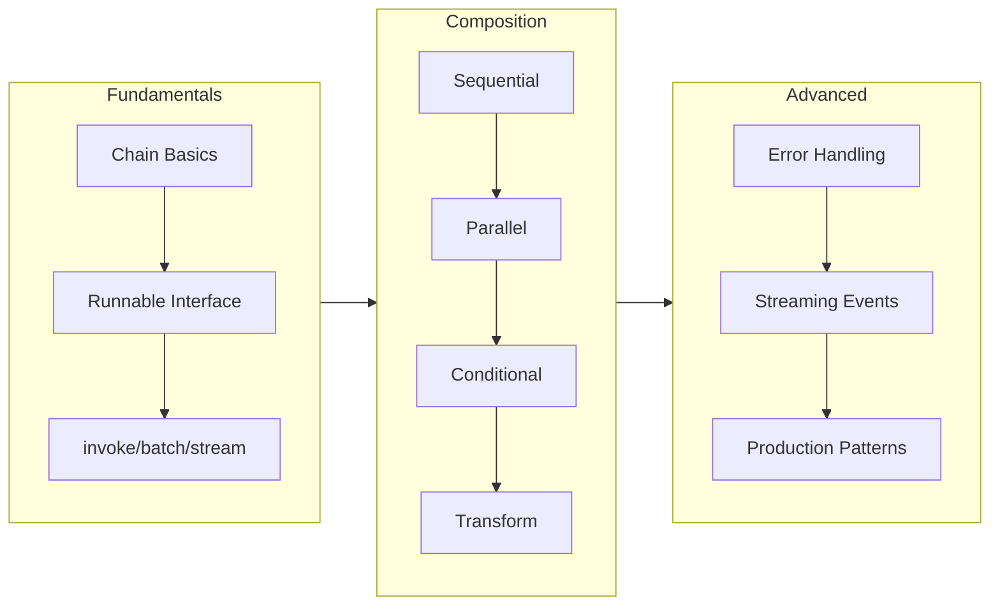
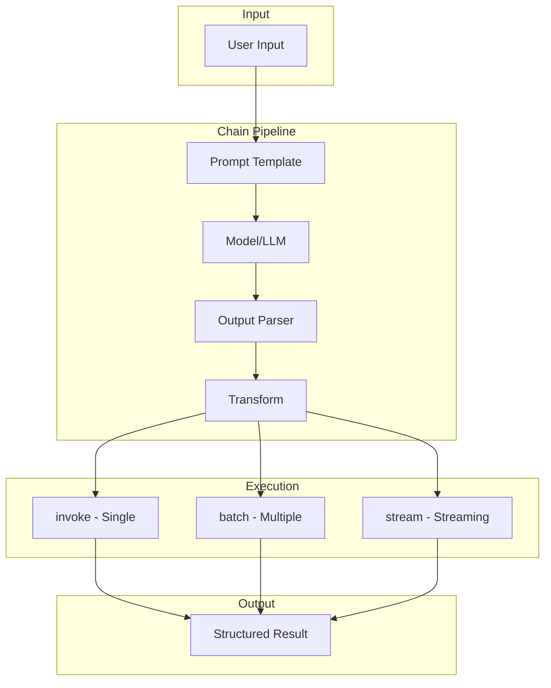

# Chains in LangChain

## Overview

Chains are the heart of LangChain — they allow you to compose multiple operations into powerful, reusable workflows. Using the **LangChain Expression Language (LCEL)**, you can build sophisticated AI applications that transform inputs through a series of steps, execute operations in parallel, route dynamically based on conditions, and handle errors gracefully.

Think of chains like a factory assembly line: raw materials (your input) flow through various workstations (components), each adding value until you have a finished product (the output). LCEL provides a declarative, elegant syntax for defining these pipelines while automatically handling streaming, batching, and async execution.

### Why Chains Matter

Chains solve several critical challenges in AI application development:

| Challenge | How Chains Help |
|-----------|-----------------|
| **Complexity Management** | Break complex operations into composable, testable units |
| **Reusability** | Create building blocks that can be combined in different ways |
| **Streaming** | Automatic streaming support from input to output |
| **Parallelization** | Execute independent operations concurrently for performance |
| **Error Handling** | Built-in retry, fallback, and error recovery patterns |
| **Observability** | Automatic tracing and debugging of each step |

### What You'll Learn

This lesson covers comprehensive chain building with LCEL:



---

## Lesson Structure

This lesson is organized into six comprehensive sub-topics:

### [01 - Chain Fundamentals](./01-chain-fundamentals.md)
Master the core concepts of LCEL chains: the `|` operator, the Runnable interface, and the three primary execution methods (`invoke`, `batch`, `stream`). Learn how chain composition works under the hood.

**Key concepts**: LCEL syntax, `RunnableSequence`, `RunnableConfig`, sync/async execution

---

### [02 - Sequential Chains](./02-sequential-chains.md)
Build step-by-step pipelines where the output of one component becomes the input of the next. Learn data passing patterns, intermediate transformations, and debugging techniques.

**Key concepts**: Data flow, intermediate steps, chain debugging, step inspection

---

### [03 - Parallel Chains](./03-parallel-chains.md)
Execute multiple operations concurrently using `RunnableParallel`. Combine results from parallel branches and optimize performance for independent operations.

**Key concepts**: `RunnableParallel`, concurrent execution, result aggregation, performance optimization

---

### [04 - Conditional Chains](./04-conditional-chains.md)
Implement dynamic routing with `RunnableBranch`, build fallback strategies with `with_fallbacks`, and add retry logic with `with_retry`. Create resilient chains that handle failures gracefully.

**Key concepts**: `RunnableBranch`, routing logic, `with_fallbacks`, `with_retry`, error handling

---

### [05 - Transform Chains](./05-transform-chains.md)
Use `RunnableLambda` for custom transformations, `RunnablePassthrough` to forward data unchanged, and `RunnableAssign` to add computed fields. Master the `itemgetter` pattern for data extraction.

**Key concepts**: `RunnableLambda`, `RunnablePassthrough`, `RunnableAssign`, `itemgetter`, data transformation

---

### [06 - Advanced Chain Patterns](./06-advanced-patterns.md)
Explore production patterns including chain-of-chains composition, recursive chains, event streaming with `astream_events`, map-reduce patterns, and human-in-the-loop concepts.

**Key concepts**: Nested chains, `astream_events`, map-reduce, production best practices

---

## Architecture Overview

The LCEL chain architecture follows a consistent pattern:



### Core Runnable Types

| Runnable Type | Purpose | Example Use Case |
|--------------|---------|------------------|
| `RunnableSequence` | Chain operations in series | Prompt → Model → Parser |
| `RunnableParallel` | Execute branches concurrently | Multiple LLM calls at once |
| `RunnableBranch` | Conditional routing | Route based on input type |
| `RunnableLambda` | Custom Python functions | Data transformation |
| `RunnablePassthrough` | Pass data unchanged | Preserve original input |
| `RunnableAssign` | Add computed fields | Enrich data with new keys |
| `RunnableWithFallbacks` | Fallback on errors | Primary → Backup model |
| `RunnableRetry` | Retry on failures | Handle transient errors |

---

## Prerequisites

Before starting this lesson, ensure you understand:

- ✅ LangChain fundamentals (Lesson 1)
- ✅ Prompt templates and formatting (Lesson 2)
- ✅ Output parsing with Pydantic (Lesson 3)
- ✅ Python async/await basics
- ✅ Basic understanding of iterators and generators

---

## Environment Setup

Ensure you have the required packages installed:

```bash
pip install langchain langchain-core langchain-openai python-dotenv
```

Set up your environment variables:

```python
import os
from dotenv import load_dotenv

load_dotenv()

# Verify API key is set
assert os.getenv("OPENAI_API_KEY"), "Set OPENAI_API_KEY in your .env file"
```

---

## Quick Start Example

Here's a taste of what you'll build in this lesson — a complete chain that demonstrates key concepts:

```python
from langchain_openai import ChatOpenAI
from langchain_core.prompts import ChatPromptTemplate
from langchain_core.output_parsers import StrOutputParser
from langchain_core.runnables import RunnableParallel, RunnablePassthrough

# Initialize model
model = ChatOpenAI(model="gpt-4o-mini", temperature=0.7)

# Create a multi-branch chain
chain = (
    RunnableParallel(
        # Pass original input through
        original=RunnablePassthrough(),
        # Generate a summary
        summary=ChatPromptTemplate.from_template(
            "Summarize in one sentence: {text}"
        ) | model | StrOutputParser(),
        # Extract key points
        key_points=ChatPromptTemplate.from_template(
            "List 3 key points from: {text}"
        ) | model | StrOutputParser(),
    )
)

# Execute the chain
result = chain.invoke({
    "text": "LangChain is a framework for developing applications powered by language models..."
})

print(result["summary"])
print(result["key_points"])
```

**Output:**
```
LangChain is a framework that enables developers to build AI-powered applications using language models.
1. LangChain simplifies LLM application development
2. It provides composable building blocks for AI workflows
3. Supports both simple chains and complex agent architectures
```

---

## Key Takeaways

After completing this lesson, you'll be able to:

✅ Build chains using LCEL's declarative `|` operator syntax

✅ Execute chains with `invoke()`, `batch()`, and `stream()` methods

✅ Create parallel workflows for concurrent processing

✅ Implement conditional routing for dynamic chain behavior

✅ Transform data with custom functions and passthrough patterns

✅ Build resilient chains with retry and fallback strategies

✅ Apply production patterns for scalable AI applications

---

## Resources & References

### Official Documentation
- [LangChain Expression Language (LCEL)](https://python.langchain.com/docs/concepts/lcel/) - Core LCEL concepts
- [Runnable Interface](https://python.langchain.com/docs/concepts/runnables/) - Complete Runnable API reference
- [How-to Guides: LCEL](https://python.langchain.com/docs/how_to/#langchain-expression-language-lcel) - Practical LCEL examples

### API References
- [RunnableSequence](https://python.langchain.com/api_reference/core/runnables/langchain_core.runnables.base.RunnableSequence.html)
- [RunnableParallel](https://python.langchain.com/api_reference/core/runnables/langchain_core.runnables.base.RunnableParallel.html)
- [RunnableBranch](https://python.langchain.com/api_reference/core/runnables/langchain_core.runnables.branch.RunnableBranch.html)
- [RunnableLambda](https://python.langchain.com/api_reference/core/runnables/langchain_core.runnables.base.RunnableLambda.html)

### Source Code
- [langchain-core/runnables](https://github.com/langchain-ai/langchain/tree/main/libs/core/langchain_core/runnables) - LCEL implementation

---

**Next:** [Chain Fundamentals](./01-chain-fundamentals.md) — Master the core concepts of LCEL chains

---

<!-- 
Sources Consulted:
- LangChain LCEL Documentation: https://python.langchain.com/docs/concepts/lcel/
- LangChain Runnables API: https://python.langchain.com/api_reference/core/runnables/
- GitHub langchain-core/runnables/base.py: RunnableSequence, RunnableParallel implementations
- GitHub langchain-core/runnables/branch.py: RunnableBranch implementation
- GitHub langchain-core/runnables/passthrough.py: RunnablePassthrough, RunnableAssign
-->
