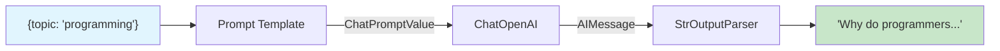
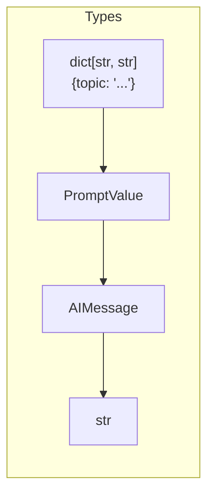

# Chain Fundamentals

## Introduction

Every LangChain application is built on chains — composable pipelines that transform inputs into outputs through a series of operations. The **LangChain Expression Language (LCEL)** provides an elegant, declarative syntax for building these chains using the pipe operator (`|`), making complex AI workflows as readable as Unix command pipelines.

At the heart of LCEL is the **Runnable** interface: a universal protocol that every LangChain component implements. This consistency means you can combine prompts, models, parsers, and custom functions seamlessly — each component speaks the same language.

### What We'll Cover

- The Runnable interface and its key methods
- LCEL's pipe operator (`|`) syntax for chain composition
- Three execution modes: `invoke`, `batch`, and `stream`
- Async variants for non-blocking execution
- Configuration with `RunnableConfig`
- Understanding chain input and output types

### Prerequisites

- LangChain installation and API key setup
- Understanding of prompt templates (Lesson 2)
- Basic Python async/await knowledge

---

## The Runnable Interface

Every component in LangChain implements the `Runnable` interface, which defines a standard contract for execution. This is what makes LCEL possible — because everything is a `Runnable`, components can be composed freely.

### Core Runnable Methods

```python
from langchain_core.runnables import Runnable
from typing import Any, Iterator, AsyncIterator

# Every Runnable implements these methods:
class Runnable:
    def invoke(self, input: Any, config: RunnableConfig = None) -> Any:
        """Transform a single input into an output."""
        ...
    
    def batch(self, inputs: list[Any], config: RunnableConfig = None) -> list[Any]:
        """Transform multiple inputs in parallel."""
        ...
    
    def stream(self, input: Any, config: RunnableConfig = None) -> Iterator[Any]:
        """Stream output chunks as they're generated."""
        ...
    
    # Async variants
    async def ainvoke(self, input: Any, config: RunnableConfig = None) -> Any:
        """Async version of invoke."""
        ...
    
    async def abatch(self, inputs: list[Any], config: RunnableConfig = None) -> list[Any]:
        """Async version of batch."""
        ...
    
    async def astream(self, input: Any, config: RunnableConfig = None) -> AsyncIterator[Any]:
        """Async streaming."""
        ...
```

### Runnable Method Summary

| Method | Input | Output | Use Case |
|--------|-------|--------|----------|
| `invoke` | Single value | Single value | One-off transformations |
| `batch` | List of values | List of values | Process multiple inputs efficiently |
| `stream` | Single value | Iterator of chunks | Real-time output display |
| `ainvoke` | Single value | Awaitable | Async single execution |
| `abatch` | List of values | Awaitable | Async batch processing |
| `astream` | Single value | AsyncIterator | Async streaming |

---

## LCEL Pipe Operator Syntax

The pipe operator (`|`) is the cornerstone of LCEL. It composes two Runnables into a `RunnableSequence`, where the output of the left operand becomes the input of the right operand.

### Basic Pipe Syntax

```python
from langchain_openai import ChatOpenAI
from langchain_core.prompts import ChatPromptTemplate
from langchain_core.output_parsers import StrOutputParser

# Create individual components
prompt = ChatPromptTemplate.from_template("Tell me a joke about {topic}")
model = ChatOpenAI(model="gpt-4o-mini")
parser = StrOutputParser()

# Compose with the pipe operator
chain = prompt | model | parser

# The chain is now a single Runnable
result = chain.invoke({"topic": "programming"})
print(result)
```

**Output:**
```
Why do programmers prefer dark mode? Because light attracts bugs!
```

### How the Pipe Operator Works

When you use `|`, LangChain creates a `RunnableSequence` behind the scenes:

```python
from langchain_core.runnables import RunnableSequence

# These are equivalent:
chain1 = prompt | model | parser

chain2 = RunnableSequence(first=prompt, middle=[model], last=parser)

# Both create the same chain structure
print(type(chain1))  # <class 'langchain_core.runnables.RunnableSequence'>
```

### Chain Flow Visualization



---

## Understanding invoke()

The `invoke()` method processes a single input through the entire chain:

```python
from langchain_openai import ChatOpenAI
from langchain_core.prompts import ChatPromptTemplate
from langchain_core.output_parsers import StrOutputParser

# Build the chain
chain = (
    ChatPromptTemplate.from_template("Translate to French: {text}")
    | ChatOpenAI(model="gpt-4o-mini", temperature=0)
    | StrOutputParser()
)

# Invoke with a single input
result = chain.invoke({"text": "Hello, how are you?"})
print(result)
```

**Output:**
```
Bonjour, comment allez-vous ?
```

### Invoke with Different Input Types

Different Runnables expect different input types:

```python
from langchain_openai import ChatOpenAI
from langchain_core.messages import HumanMessage, SystemMessage

model = ChatOpenAI(model="gpt-4o-mini")

# Models accept various input types:

# 1. String input (converted to HumanMessage)
result = model.invoke("What is 2+2?")

# 2. List of messages
result = model.invoke([
    SystemMessage(content="You are a math tutor."),
    HumanMessage(content="What is 2+2?")
])

# 3. Prompt value (from prompt template)
from langchain_core.prompts import ChatPromptTemplate
prompt = ChatPromptTemplate.from_template("Calculate: {expression}")
prompt_value = prompt.invoke({"expression": "2+2"})
result = model.invoke(prompt_value)

print(result.content)
```

**Output:**
```
2 + 2 = 4
```

---

## Understanding batch()

The `batch()` method processes multiple inputs efficiently, using parallelism under the hood:

```python
from langchain_openai import ChatOpenAI
from langchain_core.prompts import ChatPromptTemplate
from langchain_core.output_parsers import StrOutputParser

chain = (
    ChatPromptTemplate.from_template("What is the capital of {country}?")
    | ChatOpenAI(model="gpt-4o-mini", temperature=0)
    | StrOutputParser()
)

# Process multiple inputs at once
countries = [
    {"country": "France"},
    {"country": "Japan"},
    {"country": "Brazil"},
    {"country": "Egypt"}
]

results = chain.batch(countries)

for country, result in zip(countries, results):
    print(f"{country['country']}: {result}")
```

**Output:**
```
France: The capital of France is Paris.
Japan: The capital of Japan is Tokyo.
Brazil: The capital of Brazil is Brasília.
Egypt: The capital of Egypt is Cairo.
```

### Controlling Batch Concurrency

Use `max_concurrency` to limit parallel execution:

```python
from langchain_core.runnables import RunnableConfig

# Limit to 2 concurrent requests
config = RunnableConfig(max_concurrency=2)

results = chain.batch(
    countries,
    config=config
)
```

### Batch with Return Exceptions

Handle partial failures gracefully:

```python
# Some inputs might cause errors
inputs = [
    {"country": "France"},
    {"country": ""},  # Invalid input
    {"country": "Japan"}
]

# Return exceptions instead of raising
results = chain.batch(inputs, return_exceptions=True)

for i, result in enumerate(results):
    if isinstance(result, Exception):
        print(f"Input {i} failed: {result}")
    else:
        print(f"Input {i} succeeded: {result[:50]}...")
```

---

## Understanding stream()

The `stream()` method yields output chunks as they're generated, essential for responsive UIs:

```python
from langchain_openai import ChatOpenAI
from langchain_core.prompts import ChatPromptTemplate
from langchain_core.output_parsers import StrOutputParser

chain = (
    ChatPromptTemplate.from_template("Write a short poem about {topic}")
    | ChatOpenAI(model="gpt-4o-mini", temperature=0.9)
    | StrOutputParser()
)

# Stream the response
print("Streaming response: ", end="", flush=True)
for chunk in chain.stream({"topic": "coding"}):
    print(chunk, end="", flush=True)
print()  # Newline at end
```

**Output (appears token by token):**
```
Streaming response: In lines of code, we weave our dreams,
Through logic's flow and data streams...
```

### Streaming with Token Counting

```python
chunks = []
token_count = 0

for chunk in chain.stream({"topic": "artificial intelligence"}):
    chunks.append(chunk)
    # Approximate token count (rough estimate)
    token_count += len(chunk.split())

full_response = "".join(chunks)
print(f"\nTotal chunks: {len(chunks)}")
print(f"Approximate tokens: {token_count}")
```

---

## Async Execution

For non-blocking execution in async applications, use the async variants:

### Basic Async Usage

```python
import asyncio
from langchain_openai import ChatOpenAI
from langchain_core.prompts import ChatPromptTemplate
from langchain_core.output_parsers import StrOutputParser

chain = (
    ChatPromptTemplate.from_template("Explain {concept} in one sentence.")
    | ChatOpenAI(model="gpt-4o-mini")
    | StrOutputParser()
)

async def main():
    # Async invoke
    result = await chain.ainvoke({"concept": "machine learning"})
    print(result)
    
    # Async batch
    concepts = [
        {"concept": "neural networks"},
        {"concept": "deep learning"},
        {"concept": "transformers"}
    ]
    results = await chain.abatch(concepts)
    for r in results:
        print(f"- {r}")

# Run the async function
asyncio.run(main())
```

### Async Streaming

```python
async def stream_response():
    async for chunk in chain.astream({"concept": "quantum computing"}):
        print(chunk, end="", flush=True)

asyncio.run(stream_response())
```

### Concurrent Async Execution

```python
import asyncio

async def process_many():
    """Process multiple chains concurrently."""
    tasks = [
        chain.ainvoke({"concept": "blockchain"}),
        chain.ainvoke({"concept": "edge computing"}),
        chain.ainvoke({"concept": "5G networks"})
    ]
    
    # Run all concurrently
    results = await asyncio.gather(*tasks)
    
    for result in results:
        print(f"- {result}")

asyncio.run(process_many())
```

---

## RunnableConfig

`RunnableConfig` controls execution behavior across all Runnable methods:

```python
from langchain_core.runnables import RunnableConfig

config = RunnableConfig(
    # Execution control
    max_concurrency=5,        # Max parallel operations
    recursion_limit=25,       # Prevent infinite recursion
    
    # Tracing and debugging
    run_name="my_chain",      # Name for tracing
    tags=["production", "v2"], # Tags for filtering traces
    metadata={"user_id": "123", "session": "abc"},  # Custom metadata
    
    # Callbacks for observability
    callbacks=[my_callback_handler],
)

# Apply config to any execution
result = chain.invoke({"topic": "AI"}, config=config)
```

### Common Config Patterns

```python
# Pattern 1: Rate limiting
rate_limited_config = RunnableConfig(max_concurrency=2)

# Pattern 2: Debugging
debug_config = RunnableConfig(
    run_name="debug_run",
    tags=["debug"],
    metadata={"debug": True}
)

# Pattern 3: Production with tracing
prod_config = RunnableConfig(
    run_name="prod_chain",
    tags=["production"],
    metadata={
        "environment": "production",
        "version": "1.2.0"
    }
)
```

---

## Chain Input and Output Types

Understanding type flow is crucial for debugging chains:

### Inspecting Chain Types

```python
from langchain_openai import ChatOpenAI
from langchain_core.prompts import ChatPromptTemplate
from langchain_core.output_parsers import StrOutputParser

chain = (
    ChatPromptTemplate.from_template("Tell me about {topic}")
    | ChatOpenAI(model="gpt-4o-mini")
    | StrOutputParser()
)

# Inspect input/output schemas
print("Input Schema:")
print(chain.input_schema.model_json_schema())

print("\nOutput Schema:")
print(chain.output_schema.model_json_schema())
```

**Output:**
```
Input Schema:
{'title': 'PromptInput', 'type': 'object', 'properties': {'topic': {'title': 'Topic', 'type': 'string'}}, 'required': ['topic']}

Output Schema:
{'title': 'StrOutputParserOutput', 'type': 'string'}
```

### Type Flow Through Chains



| Step | Component | Input Type | Output Type |
|------|-----------|------------|-------------|
| 1 | ChatPromptTemplate | `dict[str, str]` | `PromptValue` |
| 2 | ChatOpenAI | `PromptValue` | `AIMessage` |
| 3 | StrOutputParser | `AIMessage` | `str` |

---

## Building Your First Chain

Let's build a practical chain step by step:

```python
from langchain_openai import ChatOpenAI
from langchain_core.prompts import ChatPromptTemplate
from langchain_core.output_parsers import StrOutputParser
from langchain_core.runnables import RunnableConfig

# Step 1: Define the prompt template
prompt = ChatPromptTemplate.from_messages([
    ("system", "You are a helpful assistant that provides concise answers."),
    ("human", "{question}")
])

# Step 2: Initialize the model
model = ChatOpenAI(
    model="gpt-4o-mini",
    temperature=0.7,
    max_tokens=150
)

# Step 3: Add output parsing
parser = StrOutputParser()

# Step 4: Compose the chain
qa_chain = prompt | model | parser

# Step 5: Execute with configuration
config = RunnableConfig(
    run_name="qa_chain",
    tags=["qa", "demo"]
)

# Single invocation
answer = qa_chain.invoke(
    {"question": "What is the speed of light?"},
    config=config
)
print(f"Answer: {answer}")

# Batch processing
questions = [
    {"question": "What is gravity?"},
    {"question": "What is photosynthesis?"},
    {"question": "What is DNA?"}
]

answers = qa_chain.batch(questions, config=config)
for q, a in zip(questions, answers):
    print(f"\nQ: {q['question']}")
    print(f"A: {a}")
```

---

## Common Patterns

### Pattern 1: Chain with Multiple Inputs

```python
from langchain_core.prompts import ChatPromptTemplate

# Template with multiple variables
prompt = ChatPromptTemplate.from_template(
    "Compare {item1} and {item2} in terms of {aspect}."
)

chain = prompt | ChatOpenAI(model="gpt-4o-mini") | StrOutputParser()

result = chain.invoke({
    "item1": "Python",
    "item2": "JavaScript",
    "aspect": "ease of learning"
})
print(result)
```

### Pattern 2: Chain That Returns Structured Output

```python
from langchain_core.prompts import ChatPromptTemplate
from langchain_core.output_parsers import JsonOutputParser
from pydantic import BaseModel, Field

class Sentiment(BaseModel):
    sentiment: str = Field(description="positive, negative, or neutral")
    confidence: float = Field(description="confidence score 0-1")
    explanation: str = Field(description="brief explanation")

parser = JsonOutputParser(pydantic_object=Sentiment)

prompt = ChatPromptTemplate.from_template(
    "Analyze the sentiment of this text:\n{text}\n\n{format_instructions}"
)

chain = (
    prompt.partial(format_instructions=parser.get_format_instructions())
    | ChatOpenAI(model="gpt-4o-mini", temperature=0)
    | parser
)

result = chain.invoke({"text": "I absolutely love this product!"})
print(f"Sentiment: {result['sentiment']}")
print(f"Confidence: {result['confidence']}")
```

### Pattern 3: Debug Chain Execution

```python
from langchain_core.runnables import RunnableLambda

def debug_output(x):
    """Print intermediate values for debugging."""
    print(f"DEBUG: {type(x).__name__} = {str(x)[:100]}...")
    return x

# Insert debug steps
debug_chain = (
    prompt
    | RunnableLambda(debug_output)  # See prompt output
    | model
    | RunnableLambda(debug_output)  # See model output
    | parser
)

result = debug_chain.invoke({"question": "What is AI?"})
```

---

## Best Practices

### ✅ DO

| Practice | Reason |
|----------|--------|
| Use type hints | Catch errors early, improve IDE support |
| Add meaningful run names | Easier debugging and tracing |
| Handle exceptions in batch | Prevent one failure from stopping all |
| Use streaming for long outputs | Better user experience |
| Configure max_concurrency | Respect API rate limits |

### ❌ DON'T

| Anti-pattern | Problem |
|--------------|---------|
| Ignore input/output types | Runtime type errors |
| Skip error handling | Crashes on edge cases |
| Use sync in async context | Blocks event loop |
| Forget to close async resources | Memory leaks |
| Hardcode sensitive data | Security risk |

---

## Hands-on Exercise

### Your Task

Build a "Translation Chain" that:
1. Takes text and target language as input
2. Translates the text
3. Provides a quality score (1-10) for the translation

### Requirements

1. Create a prompt template with `text` and `language` variables
2. Use structured output with Pydantic
3. Test with `invoke`, `batch`, and `stream`
4. Add proper error handling

### Expected Result

```python
result = translation_chain.invoke({
    "text": "Hello, world!",
    "language": "Spanish"
})
# Should return: {"translation": "¡Hola, mundo!", "quality_score": 9, "notes": "..."}
```

<details>
<summary>💡 Hints (click to expand)</summary>

- Define a Pydantic model for the output structure
- Use `JsonOutputParser` with your Pydantic model
- Include format instructions in the prompt
- Test with multiple languages in batch mode

</details>

<details>
<summary>✅ Solution (click to expand)</summary>

```python
from langchain_openai import ChatOpenAI
from langchain_core.prompts import ChatPromptTemplate
from langchain_core.output_parsers import JsonOutputParser
from pydantic import BaseModel, Field

# Define output structure
class TranslationResult(BaseModel):
    translation: str = Field(description="The translated text")
    quality_score: int = Field(description="Quality score from 1-10")
    notes: str = Field(description="Any notes about the translation")

# Create parser
parser = JsonOutputParser(pydantic_object=TranslationResult)

# Create prompt
prompt = ChatPromptTemplate.from_template("""
Translate the following text to {language}.
Provide a quality score (1-10) and any relevant notes.

Text: {text}

{format_instructions}
""")

# Build chain
translation_chain = (
    prompt.partial(format_instructions=parser.get_format_instructions())
    | ChatOpenAI(model="gpt-4o-mini", temperature=0)
    | parser
)

# Test with invoke
result = translation_chain.invoke({
    "text": "Hello, world!",
    "language": "Spanish"
})
print(f"Translation: {result['translation']}")
print(f"Quality: {result['quality_score']}/10")
print(f"Notes: {result['notes']}")

# Test with batch
batch_inputs = [
    {"text": "Good morning", "language": "French"},
    {"text": "Thank you", "language": "Japanese"},
    {"text": "Goodbye", "language": "German"}
]

results = translation_chain.batch(batch_inputs, return_exceptions=True)
for inp, res in zip(batch_inputs, results):
    if isinstance(res, Exception):
        print(f"Error translating to {inp['language']}: {res}")
    else:
        print(f"{inp['language']}: {res['translation']}")

# Test with stream (streams JSON chunks)
print("\nStreaming:")
for chunk in translation_chain.stream({
    "text": "Welcome to LangChain",
    "language": "Italian"
}):
    print(chunk, end="", flush=True)
```

</details>

---

## Summary

✅ **Runnable Interface** — Universal protocol for all LangChain components with `invoke`, `batch`, and `stream` methods

✅ **Pipe Operator** — The `|` operator composes Runnables into `RunnableSequence` chains

✅ **Execution Modes** — Use `invoke` for single inputs, `batch` for parallel processing, `stream` for real-time output

✅ **Async Support** — All methods have async variants (`ainvoke`, `abatch`, `astream`) for non-blocking execution

✅ **RunnableConfig** — Configure concurrency, tracing, tags, and metadata for observability

✅ **Type Safety** — Inspect input/output schemas to understand data flow through chains

**Next:** [Sequential Chains](./02-sequential-chains.md) — Master step-by-step pipelines with data passing between components

---

<!-- 
Sources Consulted:
- LangChain LCEL Documentation: https://python.langchain.com/docs/concepts/lcel/
- GitHub langchain-core/runnables/base.py: Runnable, RunnableSequence, __or__ operator
- GitHub langchain-core/runnables/config.py: RunnableConfig implementation
- LangChain How-to Guides: https://python.langchain.com/docs/how_to/
-->
