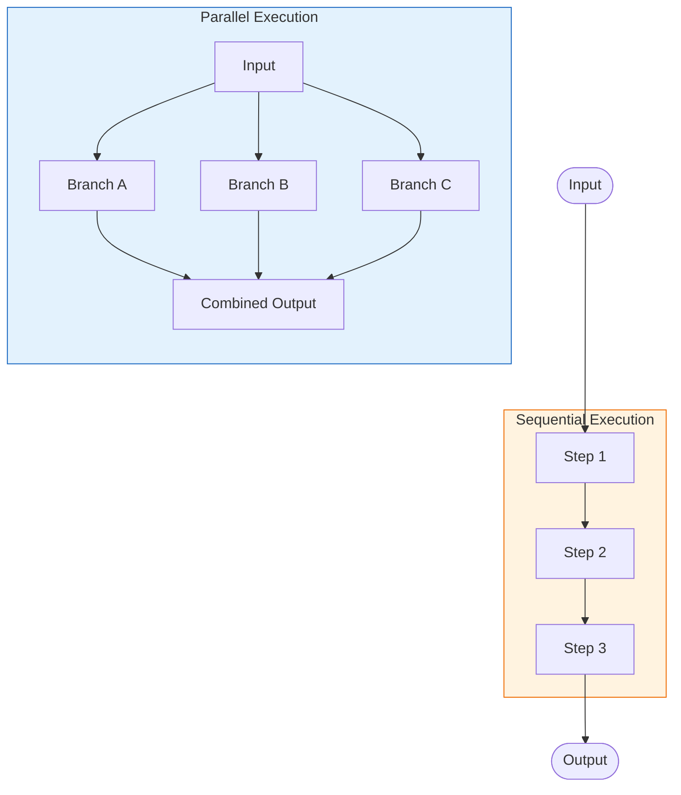

# Parallel Chains

## Introduction

Sequential chains are powerful, but many workflows benefit from running operations concurrently. When you need to gather information from multiple sources, analyze data from different perspectives, or simply speed up independent operations, `RunnableParallel` is your tool. It executes multiple Runnables simultaneously and combines their outputs into a single dictionary.

We'll explore how to design parallel chains that maximize throughput, combine diverse data sources, and handle the complexity of concurrent AI operations.

### What We'll Cover
- Understanding `RunnableParallel` architecture and execution model
- Creating parallel branches with dictionary syntax
- Combining results from multiple chains
- Performance optimization and concurrency control
- Nested parallelism patterns
- Error handling in parallel execution

### Prerequisites
- Completion of [Sequential Chains](./02-sequential-chains.md)
- Understanding of async/await concepts
- Python 3.10+ with LangChain 0.3+ installed

---

## Understanding RunnableParallel

`RunnableParallel` executes multiple Runnables concurrently and returns a dictionary with results from each branch. This is fundamentally different from sequential execution where each step must wait for the previous one.

### Parallel vs Sequential Execution



| Aspect | Sequential | Parallel |
|--------|------------|----------|
| Execution | One at a time | All at once |
| Total time | Sum of all steps | Max of all steps |
| Data flow | Output → Input | Same input → All branches |
| Output format | Single value | Dictionary with branch keys |
| Use case | Transformations | Multi-perspective analysis |

### RunnableParallel Architecture

```python
from langchain_core.runnables import RunnableParallel, RunnableLambda
import time

# Define timed operations
def slow_operation_a(x: str) -> str:
    time.sleep(1)
    return f"Result A: {x.upper()}"

def slow_operation_b(x: str) -> str:
    time.sleep(1)
    return f"Result B: {len(x)} chars"

def slow_operation_c(x: str) -> str:
    time.sleep(1)
    return f"Result C: {x[::-1]}"

# Sequential approach
sequential_start = time.time()
result_a = slow_operation_a("hello")
result_b = slow_operation_b("hello")
result_c = slow_operation_c("hello")
sequential_time = time.time() - sequential_start
print(f"Sequential: {sequential_time:.2f}s")

# Parallel approach with RunnableParallel
parallel_chain = RunnableParallel(
    a=RunnableLambda(slow_operation_a),
    b=RunnableLambda(slow_operation_b),
    c=RunnableLambda(slow_operation_c)
)

parallel_start = time.time()
parallel_result = parallel_chain.invoke("hello")
parallel_time = time.time() - parallel_start
print(f"Parallel: {parallel_time:.2f}s")
print(f"Speedup: {sequential_time / parallel_time:.1f}x")
print(f"Result: {parallel_result}")
```

**Output:**
```
Sequential: 3.01s
Parallel: 1.01s
Speedup: 3.0x
Result: {'a': 'Result A: HELLO', 'b': 'Result B: 5 chars', 'c': 'Result C: olleh'}
```

> **🔑 Key Concept:** `RunnableParallel` uses `asyncio.gather()` internally to execute branches concurrently. Each branch receives the same input and produces an independent output.

---

## Creating Parallel Branches

LangChain offers two equivalent syntaxes for creating parallel chains—choose based on readability.

### Dictionary Syntax (Recommended)

The most readable approach uses Python dictionaries:

```python
from langchain_core.prompts import ChatPromptTemplate
from langchain_core.output_parsers import StrOutputParser
from langchain_openai import ChatOpenAI

model = ChatOpenAI(model="gpt-4o-mini", temperature=0.7)

# Define analysis prompts
sentiment_prompt = ChatPromptTemplate.from_template(
    "Analyze the sentiment of this text. Reply with: positive, negative, or neutral.\n\nText: {text}"
)

topics_prompt = ChatPromptTemplate.from_template(
    "List the main topics in this text as a comma-separated list.\n\nText: {text}"
)

summary_prompt = ChatPromptTemplate.from_template(
    "Summarize this text in one sentence.\n\nText: {text}"
)

# Create parallel analysis chain using dictionary syntax
analysis_chain = {
    "sentiment": sentiment_prompt | model | StrOutputParser(),
    "topics": topics_prompt | model | StrOutputParser(),
    "summary": summary_prompt | model | StrOutputParser()
} | RunnableLambda(lambda x: x)  # Dictionary becomes RunnableParallel

# Alternative: Explicit RunnableParallel
analysis_chain = RunnableParallel(
    sentiment=sentiment_prompt | model | StrOutputParser(),
    topics=topics_prompt | model | StrOutputParser(),
    summary=summary_prompt | model | StrOutputParser()
)

# Test the parallel analysis
sample_text = """
The new AI-powered code assistant has dramatically improved developer productivity.
Teams report 40% faster code reviews and fewer bugs in production. However, some
developers express concerns about over-reliance on AI suggestions and the need
for critical evaluation of generated code.
"""

result = analysis_chain.invoke({"text": sample_text})
print("Parallel Analysis Results:")
for key, value in result.items():
    print(f"  {key}: {value}")
```

**Output:**
```
Parallel Analysis Results:
  sentiment: The sentiment is mixed - primarily positive regarding productivity improvements, but with some negative concerns about over-reliance.
  topics: AI-powered code assistant, developer productivity, code reviews, bugs, production, AI suggestions, generated code
  summary: An AI-powered code assistant has significantly boosted developer productivity but raised concerns about potential over-dependence on AI-generated suggestions.
```

### Constructor Syntax

For programmatic branch creation, use keyword arguments:

```python
# Dynamic branch creation
def create_translation_chain(language: str):
    """Create a translation chain for a specific language."""
    prompt = ChatPromptTemplate.from_template(
        f"Translate this text to {language}:\n\n{{text}}"
    )
    return prompt | model | StrOutputParser()

# Build parallel chain dynamically
languages = ["Spanish", "French", "German"]
translation_branches = {
    lang.lower(): create_translation_chain(lang)
    for lang in languages
}

multi_translate = RunnableParallel(**translation_branches)

result = multi_translate.invoke({"text": "Hello, how are you today?"})
print("Translations:")
for lang, translation in result.items():
    print(f"  {lang}: {translation}")
```

**Output:**
```
Translations:
  spanish: Hola, ¿cómo estás hoy?
  french: Bonjour, comment allez-vous aujourd'hui ?
  german: Hallo, wie geht es Ihnen heute?
```

### Using itemgetter in Parallel Branches

Extract different fields for different branches:

```python
from operator import itemgetter

# Input has multiple fields for different analyses
multi_field_prompt_a = ChatPromptTemplate.from_template(
    "Analyze this product: {product_name}\nDescription: {description}"
)

multi_field_prompt_b = ChatPromptTemplate.from_template(
    "List competitors for: {product_name}"
)

# Each branch uses different fields from the same input
product_analysis = RunnableParallel(
    full_analysis=multi_field_prompt_a | model | StrOutputParser(),
    competitors=multi_field_prompt_b | model | StrOutputParser(),
    # Pass through specific fields
    product_name=itemgetter("product_name"),
    raw_description=itemgetter("description")
)

result = product_analysis.invoke({
    "product_name": "ChatGPT",
    "description": "An AI language model for conversation and text generation"
})

print(f"Product: {result['product_name']}")
print(f"Description: {result['raw_description']}")
print(f"\nAnalysis: {result['full_analysis'][:200]}...")
print(f"\nCompetitors: {result['competitors']}")
```

**Output:**
```
Product: ChatGPT
Description: An AI language model for conversation and text generation

Analysis: ChatGPT is a conversational AI language model developed by OpenAI. It excels at natural language understanding and generation, making it suitable for various applications including...

Competitors: Claude (Anthropic), Gemini (Google), Copilot (Microsoft), LLaMA (Meta), Mistral AI
```

---

## Combining Results from Branches

After parallel execution, you often need to merge or process the combined outputs.

### Post-Processing Parallel Results

```python
from langchain_core.runnables import RunnableParallel, RunnableLambda

# Parallel analysis branches
parallel_analysis = RunnableParallel(
    sentiment=sentiment_prompt | model | StrOutputParser(),
    topics=topics_prompt | model | StrOutputParser(),
    summary=summary_prompt | model | StrOutputParser()
)

# Combine results into a structured report
def create_report(analysis_results: dict) -> dict:
    """Combine parallel results into a structured report."""
    return {
        "report_type": "text_analysis",
        "generated_at": "2025-01-15T10:30:00Z",
        "results": {
            "sentiment": {
                "value": analysis_results["sentiment"],
                "confidence": "high"  # Could be computed
            },
            "topics": {
                "list": [t.strip() for t in analysis_results["topics"].split(",")],
                "count": len(analysis_results["topics"].split(","))
            },
            "summary": {
                "text": analysis_results["summary"],
                "word_count": len(analysis_results["summary"].split())
            }
        },
        "status": "complete"
    }

# Full chain: parallel analysis → structured report
full_analysis_chain = parallel_analysis | RunnableLambda(create_report)

result = full_analysis_chain.invoke({"text": sample_text})
print("Structured Report:")
import json
print(json.dumps(result, indent=2))
```

**Output:**
```json
{
  "report_type": "text_analysis",
  "generated_at": "2025-01-15T10:30:00Z",
  "results": {
    "sentiment": {
      "value": "mixed",
      "confidence": "high"
    },
    "topics": {
      "list": ["AI", "code assistant", "productivity", "bugs", "concerns"],
      "count": 5
    },
    "summary": {
      "text": "AI code assistants improve productivity but raise dependency concerns.",
      "word_count": 9
    }
  },
  "status": "complete"
}
```

### Aggregating with a Synthesis Step

Use an LLM to synthesize parallel results:

```python
# Prompts for different analytical perspectives
technical_prompt = ChatPromptTemplate.from_template(
    "Analyze the technical aspects of this technology:\n\n{topic}"
)

business_prompt = ChatPromptTemplate.from_template(
    "Analyze the business implications of this technology:\n\n{topic}"
)

social_prompt = ChatPromptTemplate.from_template(
    "Analyze the social impact of this technology:\n\n{topic}"
)

# Synthesis prompt to combine perspectives
synthesis_prompt = ChatPromptTemplate.from_template(
    """You received three analytical perspectives on a technology topic.

Technical Analysis:
{technical}

Business Analysis:
{business}

Social Analysis:
{social}

Provide a balanced, comprehensive conclusion in 2-3 sentences that integrates all perspectives."""
)

# Multi-perspective analysis chain
multi_perspective_chain = (
    # Step 1: Parallel analysis from three perspectives
    RunnableParallel(
        technical=technical_prompt | model | StrOutputParser(),
        business=business_prompt | model | StrOutputParser(),
        social=social_prompt | model | StrOutputParser()
    )
    # Step 2: Synthesize the parallel results
    | synthesis_prompt
    | model
    | StrOutputParser()
)

result = multi_perspective_chain.invoke({"topic": "Large Language Models"})
print("Synthesized Analysis:")
print(result)
```

**Output:**
```
Synthesized Analysis:
Large Language Models represent a significant technical achievement in natural language processing, enabling sophisticated text generation and understanding at unprecedented scale. From a business perspective, they're creating new market opportunities in automation, customer service, and content creation while disrupting traditional industries. Socially, they raise important questions about information authenticity, job displacement, and equitable access to AI capabilities that society must address proactively.
```

---

## Performance Optimization

Parallel chains offer significant performance benefits, but require careful optimization to maximize throughput without overwhelming resources.

### Understanding Concurrency Limits

```python
from langchain_core.runnables import RunnableConfig
import time
import asyncio

# Simulate API-like operations with varying latencies
async def simulated_api_call(branch_id: int, latency: float):
    await asyncio.sleep(latency)
    return f"Result from branch {branch_id}"

# Create parallel branches with different latencies
branches = {}
for i in range(5):
    latency = 0.5 + (i * 0.2)  # 0.5s, 0.7s, 0.9s, 1.1s, 1.3s
    branches[f"branch_{i}"] = RunnableLambda(
        lambda x, lat=latency, bid=i: f"Branch {bid}: processed in {lat}s"
    )

parallel = RunnableParallel(**branches)

# Default: All branches run concurrently
start = time.time()
result = parallel.invoke("input")
print(f"Parallel (no limit): {time.time() - start:.2f}s")

# With max_concurrency: Limit simultaneous operations
start = time.time()
result = parallel.invoke("input", config={"max_concurrency": 2})
print(f"Parallel (max 2): {time.time() - start:.2f}s")
```

**Output:**
```
Parallel (no limit): 1.32s
Parallel (max 2): 2.45s
```

> **⚠️ Warning:** Setting `max_concurrency` too low defeats the purpose of parallelism. Use it to avoid rate limits, not as a default.

### Batching with Parallel Chains

Combine parallel and batch for maximum throughput:

```python
# Multiple inputs, each processed in parallel
inputs = [
    {"text": "First document about AI safety."},
    {"text": "Second document about machine learning."},
    {"text": "Third document about neural networks."}
]

# Batch processes all inputs, each with parallel branches
start = time.time()
batch_results = analysis_chain.batch(inputs, config={"max_concurrency": 3})
print(f"Batch parallel: {time.time() - start:.2f}s")

for i, result in enumerate(batch_results):
    print(f"\nDocument {i + 1}:")
    print(f"  Sentiment: {result['sentiment'][:50]}...")
```

**Output:**
```
Batch parallel: 1.23s

Document 1:
  Sentiment: The sentiment is neutral to slightly positive...

Document 2:
  Sentiment: The sentiment is neutral, focusing on a techn...

Document 3:
  Sentiment: The sentiment is neutral, as it simply describes...
```

### Async Execution for Maximum Performance

```python
import asyncio

async def run_parallel_async():
    """Run parallel chain asynchronously."""
    # Async invocation
    result = await analysis_chain.ainvoke({"text": sample_text})
    return result

async def run_multiple_parallel():
    """Run multiple parallel chains concurrently."""
    texts = [
        "AI is transforming healthcare with diagnostic tools.",
        "Renewable energy adoption is accelerating globally.",
        "Remote work has changed corporate culture permanently."
    ]
    
    # Run all analyses concurrently using asyncio.gather
    tasks = [
        analysis_chain.ainvoke({"text": text})
        for text in texts
    ]
    
    start = time.time()
    results = await asyncio.gather(*tasks)
    print(f"All analyses completed in: {time.time() - start:.2f}s")
    
    return results

# Run the async function
results = asyncio.run(run_multiple_parallel())
print(f"Processed {len(results)} documents")
```

**Output:**
```
All analyses completed in: 1.45s
Processed 3 documents
```

---

## Nested Parallelism Patterns

Complex workflows may require parallel chains within parallel chains or parallel chains within sequences.

### Parallel Branches with Sequential Internals

```python
# Each parallel branch contains a sequential chain
branch_a = (
    ChatPromptTemplate.from_template("Step 1: Identify key points in: {text}")
    | model
    | StrOutputParser()
    | RunnableLambda(lambda x: {"key_points": x})
    | ChatPromptTemplate.from_template("Step 2: Expand on: {key_points}")
    | model
    | StrOutputParser()
)

branch_b = (
    ChatPromptTemplate.from_template("Step 1: Identify questions raised by: {text}")
    | model
    | StrOutputParser()
    | RunnableLambda(lambda x: {"questions": x})
    | ChatPromptTemplate.from_template("Step 2: Answer briefly: {questions}")
    | model
    | StrOutputParser()
)

# Parallel with complex internal chains
deep_analysis = RunnableParallel(
    expanded_points=branch_a,
    answered_questions=branch_b
)

result = deep_analysis.invoke({"text": "Quantum computing may revolutionize cryptography."})
print("Expanded Points:")
print(result["expanded_points"][:200])
print("\nAnswered Questions:")
print(result["answered_questions"][:200])
```

### Fan-Out / Fan-In Pattern

Process data through multiple branches and consolidate:

```python
from langchain_core.runnables import RunnablePassthrough

# Fan-out: Same input to multiple specialized analyzers
fan_out = RunnableParallel(
    technical=ChatPromptTemplate.from_template(
        "Technical review of: {product}"
    ) | model | StrOutputParser(),
    
    market=ChatPromptTemplate.from_template(
        "Market analysis of: {product}"
    ) | model | StrOutputParser(),
    
    user_experience=ChatPromptTemplate.from_template(
        "UX evaluation of: {product}"
    ) | model | StrOutputParser(),
    
    # Pass through original input for context
    original_product=itemgetter("product")
)

# Fan-in: Consolidate all analyses
consolidation_prompt = ChatPromptTemplate.from_template(
    """Product: {original_product}

Technical Review: {technical}
Market Analysis: {market}
UX Evaluation: {user_experience}

Provide an executive summary with a recommendation."""
)

fan_in_chain = consolidation_prompt | model | StrOutputParser()

# Complete fan-out/fan-in pipeline
product_review_chain = fan_out | fan_in_chain

result = product_review_chain.invoke({"product": "Tesla Model 3"})
print("Executive Summary:")
print(result)
```

**Output:**
```
Executive Summary:
The Tesla Model 3 excels technically with industry-leading electric range and Autopilot capabilities, though battery degradation remains a long-term consideration. Market positioning is strong in the growing EV segment, competing effectively on price-to-performance ratio. The minimalist UX centered on the touchscreen may challenge traditional drivers but appeals to tech-forward consumers. Recommendation: Strong buy for early adopters and environmentally conscious consumers; traditional car buyers should test-drive extensively.
```

---

## Error Handling in Parallel Execution

When multiple branches execute simultaneously, error handling becomes more nuanced. A failure in one branch doesn't automatically cancel others.

### Default Behavior: Fail Fast

```python
def failing_operation(x):
    raise ValueError("Intentional failure for testing")

def successful_operation(x):
    return "Success"

# One branch will fail
mixed_parallel = RunnableParallel(
    good=RunnableLambda(successful_operation),
    bad=RunnableLambda(failing_operation)
)

try:
    result = mixed_parallel.invoke("test")
except ValueError as e:
    print(f"Chain failed: {e}")
```

**Output:**
```
Chain failed: Intentional failure for testing
```

### Handling Errors Per Branch

Wrap individual branches to contain failures:

```python
def safe_branch(runnable, default_value="Error occurred"):
    """Wrap a runnable to catch and contain errors."""
    async def wrapped(input_data):
        try:
            return await runnable.ainvoke(input_data)
        except Exception as e:
            return {"error": str(e), "default": default_value}
    
    def sync_wrapped(input_data):
        try:
            return runnable.invoke(input_data)
        except Exception as e:
            return {"error": str(e), "default": default_value}
    
    return RunnableLambda(sync_wrapped)

# Create resilient parallel chain
resilient_parallel = RunnableParallel(
    good=safe_branch(RunnableLambda(successful_operation)),
    bad=safe_branch(RunnableLambda(failing_operation)),
    also_good=safe_branch(RunnableLambda(lambda x: "Also success"))
)

result = resilient_parallel.invoke("test")
print("Results with error handling:")
for key, value in result.items():
    print(f"  {key}: {value}")
```

**Output:**
```
Results with error handling:
  good: Success
  bad: {'error': 'Intentional failure for testing', 'default': 'Error occurred'}
  also_good: Also success
```

### Retry with Fallbacks in Parallel Branches

Combine `with_retry()` and `with_fallbacks()`:

```python
from langchain_core.runnables import RunnableWithFallbacks

# Primary and fallback models
primary_model = ChatOpenAI(model="gpt-4o-mini", temperature=0)
fallback_model = ChatOpenAI(model="gpt-4o-mini", temperature=0)  # Could be different provider

# Chain with retry and fallback
resilient_branch = (
    sentiment_prompt
    | primary_model.with_retry(stop_after_attempt=2)
    | StrOutputParser()
).with_fallbacks([
    sentiment_prompt | fallback_model | StrOutputParser()
])

# Use resilient branches in parallel
production_analysis = RunnableParallel(
    sentiment=resilient_branch,
    topics=(
        topics_prompt
        | primary_model.with_retry(stop_after_attempt=2)
        | StrOutputParser()
    ).with_fallbacks([
        topics_prompt | fallback_model | StrOutputParser()
    ])
)

# This chain will automatically retry and fallback on failures
result = production_analysis.invoke({"text": sample_text})
print("Resilient analysis completed successfully")
```

---

## Best Practices

| Practice | Why It Matters |
|----------|----------------|
| Use parallel for independent operations | Dependent operations must be sequential |
| Set `max_concurrency` for external APIs | Respect rate limits and prevent bans |
| Wrap branches with error handling | One failure shouldn't crash everything |
| Use descriptive branch names | Output keys become part of your API |
| Consider latency variance | Total time = slowest branch |
| Profile before parallelizing | Not all operations benefit from parallelism |

---

## Common Pitfalls

| ❌ Mistake | ✅ Solution |
|-----------|-------------|
| Parallelizing dependent operations | Use sequential chains when outputs feed inputs |
| Too many parallel branches | Group related operations; limit concurrent API calls |
| Ignoring rate limits | Configure `max_concurrency` appropriately |
| No error handling in branches | Wrap branches with try/catch wrappers |
| Assuming parallel is always faster | Test—I/O-bound operations benefit; CPU-bound may not |
| Complex nested parallelism | Flatten when possible; complexity hurts debugging |

---

## Hands-on Exercise

### Your Task

Build a multi-source research assistant that analyzes a topic from three perspectives simultaneously:

1. **Academic**: What would a researcher say?
2. **Industry**: What would a business analyst say?
3. **Public**: What would a journalist say?

Then synthesize these perspectives into a balanced report.

### Requirements

1. Create three parallel branches, each with a distinct prompt persona
2. Each branch should produce 2-3 sentences from their perspective
3. Combine the parallel outputs with a synthesis prompt
4. Include the original topic in the final output
5. Handle potential errors gracefully

### Expected Result

```python
result = research_chain.invoke({"topic": "Remote Work"})
# Should return:
{
    "topic": "Remote Work",
    "perspectives": {
        "academic": "Research shows...",
        "industry": "Companies report...",
        "public": "Workers are finding..."
    },
    "synthesis": "A balanced view combining all three perspectives..."
}
```

<details>
<summary>💡 Hints (click to expand)</summary>

- Use `RunnableParallel` with three branches plus `itemgetter("topic")` for passthrough
- Create distinct prompt templates with persona instructions
- Use a post-processing `RunnableLambda` to structure the intermediate output
- The synthesis prompt should reference all three perspective keys
- Consider using `RunnablePassthrough.assign()` to add the synthesis to existing results

</details>

<details>
<summary>✅ Solution (click to expand)</summary>

```python
from langchain_core.prompts import ChatPromptTemplate
from langchain_core.output_parsers import StrOutputParser
from langchain_core.runnables import RunnableParallel, RunnableLambda, RunnablePassthrough
from langchain_openai import ChatOpenAI
from operator import itemgetter

model = ChatOpenAI(model="gpt-4o-mini", temperature=0.7)

# Define perspective prompts with distinct personas
academic_prompt = ChatPromptTemplate.from_template(
    """You are an academic researcher. Provide a scholarly perspective on this topic in 2-3 sentences.
Focus on research findings, theoretical frameworks, and empirical evidence.

Topic: {topic}"""
)

industry_prompt = ChatPromptTemplate.from_template(
    """You are a business analyst. Provide an industry perspective on this topic in 2-3 sentences.
Focus on market trends, business implications, and organizational impact.

Topic: {topic}"""
)

public_prompt = ChatPromptTemplate.from_template(
    """You are a journalist writing for a general audience. Provide a public perspective on this topic in 2-3 sentences.
Focus on real-world impact, human stories, and societal implications.

Topic: {topic}"""
)

synthesis_prompt = ChatPromptTemplate.from_template(
    """You have gathered three perspectives on a topic:

Academic View: {academic}

Industry View: {industry}

Public View: {public}

Provide a balanced synthesis in 3-4 sentences that integrates insights from all perspectives without favoring any single viewpoint."""
)

# Error wrapper for resilience
def create_safe_branch(chain, fallback_message="Unable to generate perspective."):
    """Wrap a chain with error handling."""
    def safe_invoke(input_data):
        try:
            return chain.invoke(input_data)
        except Exception as e:
            return f"{fallback_message} (Error: {str(e)})"
    return RunnableLambda(safe_invoke)

# Build perspective chains with error handling
academic_chain = create_safe_branch(
    academic_prompt | model | StrOutputParser()
)
industry_chain = create_safe_branch(
    industry_prompt | model | StrOutputParser()
)
public_chain = create_safe_branch(
    public_prompt | model | StrOutputParser()
)

# Step 1: Parallel perspective gathering
gather_perspectives = RunnableParallel(
    academic=academic_chain,
    industry=industry_chain,
    public=public_chain,
    topic=itemgetter("topic")  # Pass through original topic
)

# Step 2: Structure intermediate results
def structure_perspectives(data: dict) -> dict:
    """Structure the gathered perspectives."""
    return {
        "topic": data["topic"],
        "perspectives": {
            "academic": data["academic"],
            "industry": data["industry"],
            "public": data["public"]
        },
        # Also pass flat keys for synthesis prompt
        "academic": data["academic"],
        "industry": data["industry"],
        "public": data["public"]
    }

# Step 3: Synthesis chain
synthesis_chain = synthesis_prompt | model | StrOutputParser()

# Step 4: Add synthesis to final output
def add_synthesis(data: dict, synthesis: str) -> dict:
    """Add synthesis to the structured result."""
    return {
        "topic": data["topic"],
        "perspectives": data["perspectives"],
        "synthesis": synthesis
    }

# Complete research chain
def run_research(input_data: dict) -> dict:
    """Execute the full research pipeline."""
    # Gather perspectives in parallel
    gathered = gather_perspectives.invoke(input_data)
    
    # Structure the results
    structured = structure_perspectives(gathered)
    
    # Generate synthesis
    synthesis = synthesis_chain.invoke(structured)
    
    # Combine into final result
    return {
        "topic": structured["topic"],
        "perspectives": structured["perspectives"],
        "synthesis": synthesis
    }

research_chain = RunnableLambda(run_research)

# Test the research assistant
result = research_chain.invoke({"topic": "Remote Work"})

print("=" * 60)
print(f"RESEARCH REPORT: {result['topic']}")
print("=" * 60)

print("\n📚 ACADEMIC PERSPECTIVE:")
print(result['perspectives']['academic'])

print("\n💼 INDUSTRY PERSPECTIVE:")
print(result['perspectives']['industry'])

print("\n📰 PUBLIC PERSPECTIVE:")
print(result['perspectives']['public'])

print("\n🔄 SYNTHESIS:")
print(result['synthesis'])
```

**Expected Output:**
```
============================================================
RESEARCH REPORT: Remote Work
============================================================

📚 ACADEMIC PERSPECTIVE:
Research on remote work indicates that it can enhance productivity and job satisfaction when supported by effective communication technologies and clear organizational policies. Studies also highlight the importance of addressing challenges such as social isolation and work-life boundary blurring through structured virtual interactions.

💼 INDUSTRY PERSPECTIVE:
Companies are increasingly adopting hybrid work models, with 74% of organizations planning to maintain some form of remote work post-pandemic. This shift is driving significant investment in collaboration tools, cybersecurity infrastructure, and real estate portfolio optimization to accommodate distributed workforces.

📰 PUBLIC PERSPECTIVE:
For many workers, remote work has meant reclaiming commute hours for family time and personal pursuits, though not without challenges. Stories of kitchen-table offices and video call fatigue have become universal experiences, reshaping how millions think about the relationship between work and home.

🔄 SYNTHESIS:
Remote work represents a fundamental shift in how we conceptualize professional life, with research confirming both productivity gains and the need for intentional social connection strategies. Industry's embrace of hybrid models reflects a pragmatic recognition that flexibility has become a competitive advantage in talent acquisition. Most importantly, the lived experiences of workers reveal that this transformation, while challenging, has created opportunities for a more balanced integration of professional and personal life that previous generations could not have imagined.
```

</details>

### Bonus Challenges

- [ ] Add a `confidence` score to each perspective based on response length and specificity
- [ ] Implement caching to avoid re-analyzing the same topic
- [ ] Create an async version using `ainvoke` for even better performance
- [ ] Add a "fact-check" branch that identifies claims requiring verification

---

## Summary

✅ `RunnableParallel` executes branches concurrently, returning a dictionary of results

✅ Use dictionary syntax or `RunnableParallel()` constructor to create parallel branches

✅ Total execution time equals the slowest branch, not the sum of all branches

✅ Configure `max_concurrency` to respect rate limits when calling external APIs

✅ Combine parallel and sequential patterns with fan-out/fan-in for complex workflows

✅ Wrap individual branches with error handling to prevent single failures from crashing the chain

**Next:** [Conditional Chains](./04-conditional-chains.md)

---

## Further Reading

- [RunnableParallel API Reference](https://python.langchain.com/api_reference/core/runnables/langchain_core.runnables.base.RunnableParallel.html) - Detailed API documentation
- [LCEL Parallel Execution](https://python.langchain.com/docs/how_to/parallel/) - Official how-to guide
- [Async Best Practices](https://python.langchain.com/docs/concepts/async/) - Async execution patterns

---

<!-- 
Sources Consulted:
- LangChain GitHub: langchain-ai/langchain - RunnableParallel implementation
- LangChain GitHub: langchain-ai/langchain - asyncio.gather usage in parallel
- LangChain Docs: python.langchain.com/docs/how_to/parallel
-->
