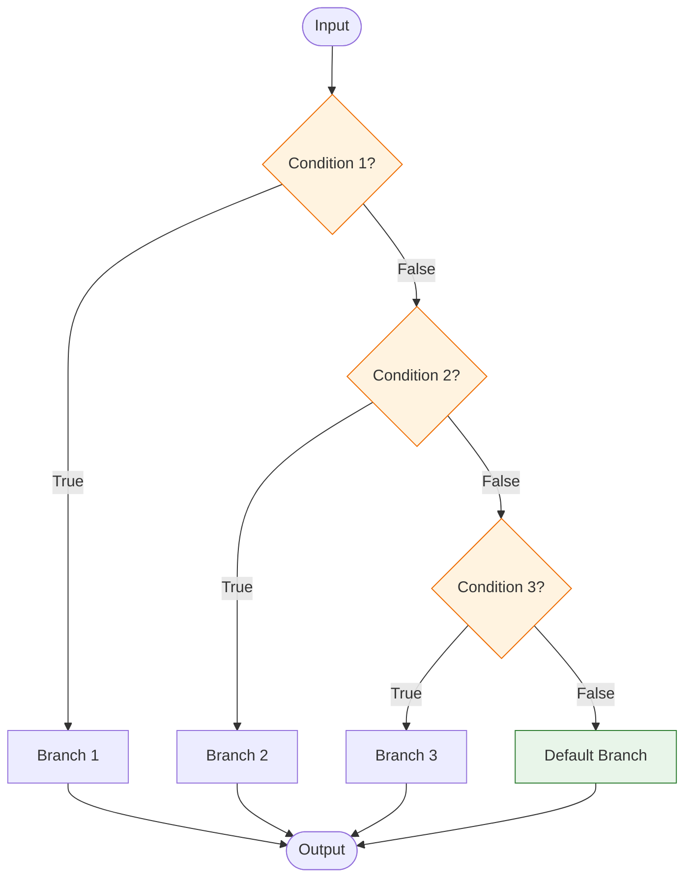

# Conditional Chains

## Introduction

Real-world AI applications rarely follow a single path. User intent varies, input quality differs, and different scenarios demand different processing. `RunnableBranch` enables dynamic routing—choosing which chain to execute based on runtime conditions. Combined with `with_fallbacks()` for resilience and `with_retry()` for transient failures, you can build robust chains that adapt to any situation.

We'll master conditional execution patterns that make your chains intelligent, resilient, and production-ready.

### What We'll Cover
- Understanding `RunnableBranch` for conditional routing
- Building multi-path decision trees
- Implementing fallback chains for resilience
- Adding retry logic for transient failures
- Dynamic chain selection patterns
- Combining conditional strategies for production systems

### Prerequisites
- Completion of [Parallel Chains](./03-parallel-chains.md)
- Understanding of exception handling in Python
- Python 3.10+ with LangChain 0.3+ installed

---

## Understanding RunnableBranch

`RunnableBranch` routes input to different Runnables based on conditions you define. It evaluates conditions in order and executes the first matching branch—similar to an if/elif/else chain.

### RunnableBranch Architecture



| Component | Description |
|-----------|-------------|
| Condition | Callable that takes input and returns `bool` |
| Branch | Runnable to execute if condition is `True` |
| Default | Runnable to execute if no conditions match |

### Basic RunnableBranch Usage

```python
from langchain_core.runnables import RunnableBranch, RunnableLambda
from langchain_core.prompts import ChatPromptTemplate
from langchain_core.output_parsers import StrOutputParser
from langchain_openai import ChatOpenAI

model = ChatOpenAI(model="gpt-4o-mini", temperature=0)

# Define specialized chains for different intents
greeting_chain = (
    ChatPromptTemplate.from_template(
        "Respond to this greeting warmly and briefly: {input}"
    )
    | model
    | StrOutputParser()
)

question_chain = (
    ChatPromptTemplate.from_template(
        "Answer this question helpfully: {input}"
    )
    | model
    | StrOutputParser()
)

complaint_chain = (
    ChatPromptTemplate.from_template(
        "Respond to this complaint with empathy and offer help: {input}"
    )
    | model
    | StrOutputParser()
)

default_chain = (
    ChatPromptTemplate.from_template(
        "Respond appropriately to: {input}"
    )
    | model
    | StrOutputParser()
)

# Create routing conditions
def is_greeting(input_dict: dict) -> bool:
    """Check if input is a greeting."""
    text = input_dict.get("input", "").lower()
    greetings = ["hello", "hi", "hey", "good morning", "good afternoon"]
    return any(g in text for g in greetings)

def is_question(input_dict: dict) -> bool:
    """Check if input is a question."""
    text = input_dict.get("input", "")
    return "?" in text or text.lower().startswith(("what", "how", "why", "when", "where", "who"))

def is_complaint(input_dict: dict) -> bool:
    """Check if input is a complaint."""
    text = input_dict.get("input", "").lower()
    complaint_words = ["problem", "issue", "broken", "doesn't work", "frustrated", "angry"]
    return any(w in text for w in complaint_words)

# Build the routing branch
intent_router = RunnableBranch(
    (is_greeting, greeting_chain),
    (is_question, question_chain),
    (is_complaint, complaint_chain),
    default_chain  # No condition = default
)

# Test the router
test_inputs = [
    {"input": "Hello there!"},
    {"input": "What is machine learning?"},
    {"input": "I have a problem with my order"},
    {"input": "Please summarize this document"}
]

for test in test_inputs:
    result = intent_router.invoke(test)
    print(f"Input: {test['input'][:40]}...")
    print(f"Response: {result[:80]}...\n")
```

**Output:**
```
Input: Hello there!...
Response: Hello! It's great to hear from you! How can I help you today?...

Input: What is machine learning?...
Response: Machine learning is a branch of artificial intelligence that enables computers to learn...

Input: I have a problem with my order...
Response: I'm truly sorry to hear you're experiencing an issue with your order. I understand how...

Input: Please summarize this document...
Response: I'd be happy to help summarize a document for you. Please share the content you'd like...
```

---

## Building Multi-Path Decision Trees

Complex applications require sophisticated routing with multiple decision levels. You can nest `RunnableBranch` instances or use classification chains.

### Nested Routing

```python
# First level: Language detection
english_branch = RunnableBranch(
    (is_greeting, greeting_chain),
    (is_question, question_chain),
    default_chain
)

spanish_chain = (
    ChatPromptTemplate.from_template(
        "Responde en español a: {input}"
    )
    | model
    | StrOutputParser()
)

french_chain = (
    ChatPromptTemplate.from_template(
        "Répondez en français à: {input}"
    )
    | model
    | StrOutputParser()
)

def detect_language(input_dict: dict) -> str:
    """Simple language detection based on keywords."""
    text = input_dict.get("input", "").lower()
    
    spanish_indicators = ["hola", "gracias", "buenos", "cómo", "qué"]
    french_indicators = ["bonjour", "merci", "comment", "pourquoi", "s'il vous plaît"]
    
    if any(w in text for w in spanish_indicators):
        return "spanish"
    elif any(w in text for w in french_indicators):
        return "french"
    return "english"

def is_spanish(input_dict: dict) -> bool:
    return detect_language(input_dict) == "spanish"

def is_french(input_dict: dict) -> bool:
    return detect_language(input_dict) == "french"

# Multi-level routing
multilingual_router = RunnableBranch(
    (is_spanish, spanish_chain),
    (is_french, french_chain),
    english_branch  # Default to English branch (which has its own routing)
)

# Test multilingual routing
multilingual_tests = [
    {"input": "Hola, ¿cómo estás?"},
    {"input": "Bonjour, comment allez-vous?"},
    {"input": "Hello, how are you?"},
    {"input": "What time is it?"}
]

for test in multilingual_tests:
    result = multilingual_router.invoke(test)
    print(f"Input: {test['input']}")
    print(f"Response: {result[:60]}...\n")
```

**Output:**
```
Input: Hola, ¿cómo estás?
Response: ¡Hola! Estoy muy bien, gracias por preguntar. ¿Y tú cómo est...

Input: Bonjour, comment allez-vous?
Response: Bonjour ! Je vais très bien, merci de demander. Comment puis...

Input: Hello, how are you?
Response: Hello! I'm doing great, thank you for asking! How can I assi...

Input: What time is it?
Response: I don't have access to real-time information, but you can ch...
```

### LLM-Based Classification for Routing

For complex intent detection, use an LLM classifier:

```python
from langchain_core.pydantic_v1 import BaseModel, Field
from langchain_core.output_parsers import PydanticOutputParser
from typing import Literal

class IntentClassification(BaseModel):
    """Classification of user intent."""
    intent: Literal["greeting", "question", "complaint", "request", "feedback"] = Field(
        description="The primary intent of the user's message"
    )
    confidence: float = Field(
        description="Confidence score from 0.0 to 1.0",
        ge=0.0,
        le=1.0
    )
    reasoning: str = Field(
        description="Brief explanation of the classification"
    )

parser = PydanticOutputParser(pydantic_object=IntentClassification)

classification_prompt = ChatPromptTemplate.from_template(
    """Classify the intent of this user message.

Message: {input}

{format_instructions}"""
)

classifier_chain = (
    classification_prompt.partial(format_instructions=parser.get_format_instructions())
    | model
    | parser
)

# Route based on classified intent
def route_by_classification(input_dict: dict) -> str:
    """Classify input and route to appropriate chain."""
    classification = classifier_chain.invoke(input_dict)
    
    routes = {
        "greeting": greeting_chain,
        "question": question_chain,
        "complaint": complaint_chain,
        "request": default_chain,
        "feedback": default_chain
    }
    
    chain = routes.get(classification.intent, default_chain)
    
    # Add classification metadata to context
    enriched_input = {
        **input_dict,
        "_classification": classification.dict()
    }
    
    return chain.invoke(input_dict)

smart_router = RunnableLambda(route_by_classification)

# Test with ambiguous inputs
ambiguous_tests = [
    {"input": "Hey, I'm wondering if you could help me with something?"},
    {"input": "Your service has been really great lately, just wanted to say thanks!"},
    {"input": "This keeps breaking every time I try to use it..."}
]

for test in ambiguous_tests:
    result = smart_router.invoke(test)
    print(f"Input: {test['input'][:50]}...")
    print(f"Response: {result[:80]}...\n")
```

---

## Implementing Fallback Chains

When a primary chain fails, fallback chains provide backup options. Use `with_fallbacks()` to create resilient chains that gracefully degrade.

### Basic Fallback Pattern

```python
from langchain_openai import ChatOpenAI

# Primary: Advanced model
primary_model = ChatOpenAI(model="gpt-4o", temperature=0)

# Fallback: Faster, cheaper model
fallback_model = ChatOpenAI(model="gpt-4o-mini", temperature=0)

# Create chain with fallback
prompt = ChatPromptTemplate.from_template("Explain {topic} in detail.")

primary_chain = prompt | primary_model | StrOutputParser()
fallback_chain = prompt | fallback_model | StrOutputParser()

# Chain with automatic fallback on failure
resilient_chain = primary_chain.with_fallbacks([fallback_chain])

# This works even if primary fails
result = resilient_chain.invoke({"topic": "quantum entanglement"})
print(result[:200])
```

### Multiple Fallback Levels

```python
# Create a chain of fallbacks for maximum resilience
from langchain_anthropic import ChatAnthropic

# Different providers as fallbacks
openai_primary = ChatOpenAI(model="gpt-4o", temperature=0)
openai_fallback = ChatOpenAI(model="gpt-4o-mini", temperature=0)
anthropic_fallback = ChatAnthropic(model="claude-3-haiku-20240307", temperature=0)

# Multi-provider resilient chain
ultra_resilient_chain = (
    prompt | openai_primary | StrOutputParser()
).with_fallbacks([
    prompt | openai_fallback | StrOutputParser(),
    prompt | anthropic_fallback | StrOutputParser(),
])

# Will try each in order until one succeeds
result = ultra_resilient_chain.invoke({"topic": "neural networks"})
```

### Fallback with Exception Filtering

Only fallback on specific exception types:

```python
import openai
from langchain_core.runnables import RunnableWithFallbacks

# Only fallback on rate limit errors, not on all errors
rate_limit_resilient = primary_chain.with_fallbacks(
    [fallback_chain],
    exceptions_to_handle=(
        openai.RateLimitError,
        openai.APITimeoutError,
    )
)

# Value errors and other exceptions will still propagate
# Only rate limits trigger the fallback
```

### Capturing Fallback Information

Track which chain succeeded for observability:

```python
class FallbackTracker:
    """Track which chain in a fallback sequence succeeded."""
    
    def __init__(self):
        self.attempts = []
        self.successful_chain = None
    
    def wrap_chain(self, chain, name: str):
        """Wrap a chain to track attempts."""
        def tracked_invoke(input_data):
            try:
                self.attempts.append({"chain": name, "status": "attempting"})
                result = chain.invoke(input_data)
                self.attempts[-1]["status"] = "success"
                self.successful_chain = name
                return result
            except Exception as e:
                self.attempts[-1]["status"] = "failed"
                self.attempts[-1]["error"] = str(e)
                raise
        
        return RunnableLambda(tracked_invoke)

# Create tracked fallback chain
tracker = FallbackTracker()

tracked_primary = tracker.wrap_chain(primary_chain, "primary-gpt4")
tracked_fallback = tracker.wrap_chain(fallback_chain, "fallback-gpt4mini")

tracked_resilient = tracked_primary.with_fallbacks([tracked_fallback])

# After invocation, check tracker
result = tracked_resilient.invoke({"topic": "machine learning"})
print(f"Successful chain: {tracker.successful_chain}")
print(f"Attempts: {tracker.attempts}")
```

---

## Adding Retry Logic

Transient failures (network issues, rate limits, temporary outages) often resolve on retry. Use `with_retry()` to add automatic retry behavior.

### Basic Retry Configuration

```python
# Add retry to a chain
retrying_chain = (
    prompt
    | model.with_retry(
        stop_after_attempt=3,  # Try up to 3 times
        wait_exponential_jitter=True  # Add random jitter to avoid thundering herd
    )
    | StrOutputParser()
)

# The chain will automatically retry on transient failures
result = retrying_chain.invoke({"topic": "distributed systems"})
```

### Advanced Retry Configuration

```python
from langchain_core.runnables.config import RunnableConfig

# Fine-grained retry control
advanced_retry_chain = model.with_retry(
    # Retry configuration
    stop_after_attempt=5,  # Maximum attempts
    wait_exponential_jitter=True,  # Exponential backoff with jitter
    retry_if_exception_type=(
        openai.RateLimitError,
        openai.APITimeoutError,
        openai.APIConnectionError,
    ),  # Only retry these exceptions
)

# Combine with config for additional control
config = RunnableConfig(
    max_concurrency=5,  # Limit parallel operations
    metadata={"retry_context": "production"}
)

chain = prompt | advanced_retry_chain | StrOutputParser()
result = chain.invoke({"topic": "APIs"}, config=config)
```

### Retry with Fallback Combined

The most resilient pattern: retry first, then fallback:

```python
# First: Try primary with retries
# Then: Fall back to secondary with retries
production_chain = (
    prompt
    | primary_model.with_retry(stop_after_attempt=3)
    | StrOutputParser()
).with_fallbacks([
    prompt
    | fallback_model.with_retry(stop_after_attempt=2)
    | StrOutputParser()
])

# This chain will:
# 1. Try primary up to 3 times
# 2. If all 3 fail, try fallback up to 2 times
# 3. Only raise exception if all 5 attempts fail
```

### Custom Retry Conditions

```python
from tenacity import retry_if_exception_type, stop_after_attempt, wait_exponential

def should_retry(exception: Exception) -> bool:
    """Custom retry condition based on exception details."""
    # Retry on rate limits
    if isinstance(exception, openai.RateLimitError):
        return True
    
    # Retry on specific error codes
    if hasattr(exception, 'status_code'):
        if exception.status_code in [429, 502, 503, 504]:
            return True
    
    # Don't retry on client errors (400, 401, etc.)
    return False

# Apply custom retry logic
custom_retry_chain = model.with_retry(
    stop_after_attempt=3,
    retry_if_exception_type=(Exception,),  # Catch all, filter in should_retry
    # Note: Custom predicates require using tenacity directly
)
```

---

## Dynamic Chain Selection

Sometimes you need to select chains based on computed values, not just boolean conditions. Here are patterns for dynamic selection.

### Router Based on Input Analysis

```python
from langchain_core.runnables import RunnableLambda

# Define chains for different complexities
simple_chain = (
    ChatPromptTemplate.from_template("Give a brief answer: {question}")
    | ChatOpenAI(model="gpt-4o-mini", temperature=0)
    | StrOutputParser()
)

detailed_chain = (
    ChatPromptTemplate.from_template(
        "Provide a comprehensive answer with examples: {question}"
    )
    | ChatOpenAI(model="gpt-4o", temperature=0)
    | StrOutputParser()
)

expert_chain = (
    ChatPromptTemplate.from_template(
        """You are a domain expert. Provide an in-depth technical analysis 
with references and nuanced considerations: {question}"""
    )
    | ChatOpenAI(model="gpt-4o", temperature=0)
    | StrOutputParser()
)

def analyze_complexity(input_dict: dict) -> str:
    """Analyze question complexity to determine routing."""
    question = input_dict.get("question", "")
    
    # Simple heuristics (could use LLM for better classification)
    word_count = len(question.split())
    has_technical_terms = any(
        term in question.lower()
        for term in ["algorithm", "architecture", "implementation", "optimize", "theory"]
    )
    is_comparative = any(
        word in question.lower()
        for word in ["compare", "difference", "versus", "vs", "better"]
    )
    
    if word_count > 50 or (has_technical_terms and is_comparative):
        return "expert"
    elif has_technical_terms or word_count > 20:
        return "detailed"
    return "simple"

def dynamic_route(input_dict: dict):
    """Route to appropriate chain based on complexity analysis."""
    complexity = analyze_complexity(input_dict)
    
    chains = {
        "simple": simple_chain,
        "detailed": detailed_chain,
        "expert": expert_chain
    }
    
    selected_chain = chains[complexity]
    print(f"Selected complexity: {complexity}")
    
    return selected_chain.invoke(input_dict)

adaptive_qa = RunnableLambda(dynamic_route)

# Test with different complexity levels
questions = [
    {"question": "What is Python?"},
    {"question": "How do you implement a binary search algorithm efficiently?"},
    {"question": "Compare and contrast microservices architecture versus monolithic architecture in terms of scalability, maintainability, and implementation complexity for large enterprise applications"}
]

for q in questions:
    result = adaptive_qa.invoke(q)
    print(f"Q: {q['question'][:50]}...")
    print(f"A: {result[:100]}...\n")
```

### Chain Registry Pattern

```python
from typing import Callable, Dict

class ChainRegistry:
    """Registry for dynamic chain selection."""
    
    def __init__(self):
        self.chains: Dict[str, any] = {}
        self.selectors: list[tuple[Callable, str]] = []
        self.default_chain_name: str = None
    
    def register(self, name: str, chain, is_default: bool = False):
        """Register a chain with a name."""
        self.chains[name] = chain
        if is_default:
            self.default_chain_name = name
        return self
    
    def add_selector(self, condition: Callable[[dict], bool], chain_name: str):
        """Add a selection condition for a chain."""
        self.selectors.append((condition, chain_name))
        return self
    
    def select(self, input_dict: dict) -> str:
        """Select the appropriate chain name based on input."""
        for condition, name in self.selectors:
            if condition(input_dict):
                return name
        return self.default_chain_name
    
    def invoke(self, input_dict: dict):
        """Select and invoke the appropriate chain."""
        chain_name = self.select(input_dict)
        chain = self.chains.get(chain_name)
        
        if chain is None:
            raise ValueError(f"No chain registered for: {chain_name}")
        
        return {
            "result": chain.invoke(input_dict),
            "chain_used": chain_name
        }
    
    def as_runnable(self):
        """Convert to a Runnable for use in LCEL."""
        return RunnableLambda(self.invoke)

# Usage
registry = ChainRegistry()

# Register chains
registry.register("greeting", greeting_chain)
registry.register("question", question_chain)
registry.register("complaint", complaint_chain)
registry.register("default", default_chain, is_default=True)

# Add selection rules
registry.add_selector(is_greeting, "greeting")
registry.add_selector(is_question, "question")
registry.add_selector(is_complaint, "complaint")

# Use as a Runnable
smart_router = registry.as_runnable()
result = smart_router.invoke({"input": "Hello there!"})
print(f"Used chain: {result['chain_used']}")
print(f"Response: {result['result']}")
```

---

## Production Patterns

Combining conditional strategies creates robust production systems.

### Complete Production Router

```python
from langchain_core.runnables import RunnableBranch, RunnableLambda
from langchain_core.callbacks import BaseCallbackHandler
from datetime import datetime
import logging

logging.basicConfig(level=logging.INFO)
logger = logging.getLogger(__name__)

class ProductionRouter:
    """Production-ready routing with logging, fallbacks, and retries."""
    
    def __init__(self, primary_model, fallback_model):
        self.primary_model = primary_model
        self.fallback_model = fallback_model
        self.request_count = 0
        self.fallback_count = 0
        self.setup_chains()
    
    def setup_chains(self):
        """Initialize all chains with resilience patterns."""
        # Greeting chain with retry
        greeting_prompt = ChatPromptTemplate.from_template(
            "Respond warmly to this greeting: {input}"
        )
        self.greeting_chain = (
            greeting_prompt
            | self.primary_model.with_retry(stop_after_attempt=2)
            | StrOutputParser()
        ).with_fallbacks([
            greeting_prompt | self.fallback_model | StrOutputParser()
        ])
        
        # Question chain with retry
        question_prompt = ChatPromptTemplate.from_template(
            "Answer this question helpfully: {input}"
        )
        self.question_chain = (
            question_prompt
            | self.primary_model.with_retry(stop_after_attempt=2)
            | StrOutputParser()
        ).with_fallbacks([
            question_prompt | self.fallback_model | StrOutputParser()
        ])
        
        # Default chain
        default_prompt = ChatPromptTemplate.from_template(
            "Respond appropriately: {input}"
        )
        self.default_chain = (
            default_prompt
            | self.fallback_model  # Use fallback by default for unknown intents
            | StrOutputParser()
        )
        
        # Build the main router
        self.router = RunnableBranch(
            (self._is_greeting, self.greeting_chain),
            (self._is_question, self.question_chain),
            self.default_chain
        )
    
    def _is_greeting(self, input_dict: dict) -> bool:
        text = input_dict.get("input", "").lower()
        return any(g in text for g in ["hello", "hi", "hey", "good morning"])
    
    def _is_question(self, input_dict: dict) -> bool:
        text = input_dict.get("input", "")
        return "?" in text
    
    def invoke(self, input_dict: dict) -> dict:
        """Invoke with logging and metrics."""
        self.request_count += 1
        start_time = datetime.now()
        
        try:
            result = self.router.invoke(input_dict)
            
            elapsed = (datetime.now() - start_time).total_seconds()
            logger.info(f"Request {self.request_count} completed in {elapsed:.2f}s")
            
            return {
                "response": result,
                "request_id": self.request_count,
                "latency_seconds": elapsed,
                "status": "success"
            }
        
        except Exception as e:
            logger.error(f"Request {self.request_count} failed: {e}")
            return {
                "response": "I apologize, but I'm unable to process your request at the moment.",
                "request_id": self.request_count,
                "status": "error",
                "error": str(e)
            }
    
    def get_metrics(self) -> dict:
        """Return router metrics."""
        return {
            "total_requests": self.request_count,
            "fallback_requests": self.fallback_count
        }

# Initialize production router
router = ProductionRouter(
    primary_model=ChatOpenAI(model="gpt-4o", temperature=0),
    fallback_model=ChatOpenAI(model="gpt-4o-mini", temperature=0)
)

# Use in production
for user_input in ["Hello!", "What is AI?", "Process this data"]:
    result = router.invoke({"input": user_input})
    print(f"Status: {result['status']}, Latency: {result.get('latency_seconds', 'N/A'):.2f}s")
    print(f"Response: {result['response'][:60]}...\n")
```

---

## Best Practices

| Practice | Why It Matters |
|----------|----------------|
| Order conditions by specificity | Most specific conditions first, default last |
| Use fallbacks for all production chains | Prevent single points of failure |
| Combine retry with fallback | Handle transient errors before failing over |
| Log routing decisions | Debug and optimize routing logic |
| Keep conditions simple | Complex conditions are hard to test |
| Test each branch independently | Ensure all paths work before combining |

---

## Common Pitfalls

| ❌ Mistake | ✅ Solution |
|-----------|-------------|
| Overlapping conditions | Ensure conditions are mutually exclusive or ordered correctly |
| No default branch | Always provide a default for unexpected inputs |
| Retrying non-transient errors | Only retry errors that might succeed on retry |
| Too many retry attempts | 2-3 attempts is usually sufficient; more adds latency |
| Silent fallback failures | Log when fallbacks are used for monitoring |
| Complex condition functions | Extract to testable functions; avoid inline lambdas |

---

## Hands-on Exercise

### Your Task

Build a customer support router that:
1. Classifies incoming messages by urgency and topic
2. Routes urgent messages to a priority chain with GPT-4
3. Routes billing questions to a specialized billing chain
4. Routes technical issues to a technical support chain
5. Has fallback chains for resilience
6. Tracks which route was used

### Requirements

1. Create an urgency classifier (urgent if: "urgent", "emergency", "asap", "critical")
2. Create topic classifiers for billing and technical issues
3. Priority chain should acknowledge urgency and promise quick response
4. All chains should have retry (2 attempts) and fallback
5. Return structured output with route used and response

### Expected Result

```python
result = support_router.invoke({
    "message": "URGENT: My payment was charged twice!"
})
# Should return:
{
    "route": "urgent_billing",
    "response": "I understand this is urgent. I'm immediately escalating...",
    "urgency": "high"
}
```

<details>
<summary>💡 Hints (click to expand)</summary>

- Check urgency FIRST, then topic within urgency level
- Use nested `RunnableBranch` for the routing hierarchy
- Create separate condition functions for each classification
- The urgent branch can itself be a RunnableBranch that routes by topic
- Use a wrapper function to add metadata to the response
- Consider using `with_retry()` on the model, not the whole chain

</details>

<details>
<summary>✅ Solution (click to expand)</summary>

```python
from langchain_core.prompts import ChatPromptTemplate
from langchain_core.output_parsers import StrOutputParser
from langchain_core.runnables import RunnableBranch, RunnableLambda
from langchain_openai import ChatOpenAI

# Models
priority_model = ChatOpenAI(model="gpt-4o", temperature=0)
standard_model = ChatOpenAI(model="gpt-4o-mini", temperature=0)

# Classifiers
def is_urgent(input_dict: dict) -> bool:
    """Check if message is urgent."""
    text = input_dict.get("message", "").lower()
    urgent_words = ["urgent", "emergency", "asap", "critical", "immediately"]
    return any(word in text for word in urgent_words)

def is_billing(input_dict: dict) -> bool:
    """Check if message is about billing."""
    text = input_dict.get("message", "").lower()
    billing_words = ["payment", "charge", "invoice", "bill", "refund", "subscription"]
    return any(word in text for word in billing_words)

def is_technical(input_dict: dict) -> bool:
    """Check if message is a technical issue."""
    text = input_dict.get("message", "").lower()
    tech_words = ["error", "bug", "crash", "not working", "broken", "issue", "problem"]
    return any(word in text for word in tech_words)

# Prompts
urgent_billing_prompt = ChatPromptTemplate.from_template(
    """You are a priority support agent handling an URGENT billing issue.
Acknowledge the urgency, apologize for the inconvenience, and assure immediate escalation.

Customer message: {message}

Respond professionally and empathetically."""
)

urgent_technical_prompt = ChatPromptTemplate.from_template(
    """You are a priority support agent handling an URGENT technical issue.
Acknowledge the urgency and provide immediate troubleshooting steps if possible.

Customer message: {message}

Respond professionally and offer quick solutions."""
)

urgent_general_prompt = ChatPromptTemplate.from_template(
    """You are a priority support agent handling an URGENT request.
Acknowledge the urgency and assure the customer of immediate attention.

Customer message: {message}

Respond professionally and empathetically."""
)

billing_prompt = ChatPromptTemplate.from_template(
    """You are a billing support specialist. Help with this billing inquiry.

Customer message: {message}

Provide helpful information about billing, payments, or refunds."""
)

technical_prompt = ChatPromptTemplate.from_template(
    """You are a technical support specialist. Help resolve this technical issue.

Customer message: {message}

Provide clear troubleshooting steps and solutions."""
)

general_prompt = ChatPromptTemplate.from_template(
    """You are a customer support agent. Help with this inquiry.

Customer message: {message}

Respond helpfully and direct to appropriate resources if needed."""
)

# Build chains with retry and fallback
def create_resilient_chain(prompt, primary_model, fallback_model):
    """Create a chain with retry and fallback."""
    primary_chain = (
        prompt
        | primary_model.with_retry(stop_after_attempt=2)
        | StrOutputParser()
    )
    fallback_chain = prompt | fallback_model | StrOutputParser()
    return primary_chain.with_fallbacks([fallback_chain])

# Urgent sub-router (uses priority model)
urgent_billing_chain = create_resilient_chain(urgent_billing_prompt, priority_model, standard_model)
urgent_technical_chain = create_resilient_chain(urgent_technical_prompt, priority_model, standard_model)
urgent_general_chain = create_resilient_chain(urgent_general_prompt, priority_model, standard_model)

urgent_router = RunnableBranch(
    (is_billing, urgent_billing_chain),
    (is_technical, urgent_technical_chain),
    urgent_general_chain
)

# Standard sub-router (uses standard model)
billing_chain = create_resilient_chain(billing_prompt, standard_model, standard_model)
technical_chain = create_resilient_chain(technical_prompt, standard_model, standard_model)
general_chain = create_resilient_chain(general_prompt, standard_model, standard_model)

standard_router = RunnableBranch(
    (is_billing, billing_chain),
    (is_technical, technical_chain),
    general_chain
)

# Main router
main_router = RunnableBranch(
    (is_urgent, urgent_router),
    standard_router
)

# Wrapper to add metadata
def route_with_metadata(input_dict: dict) -> dict:
    """Route message and add metadata to response."""
    message = input_dict.get("message", "")
    
    # Determine route taken
    urgency = "high" if is_urgent(input_dict) else "normal"
    
    if is_billing(input_dict):
        topic = "billing"
    elif is_technical(input_dict):
        topic = "technical"
    else:
        topic = "general"
    
    route = f"{'urgent_' if urgency == 'high' else ''}{topic}"
    
    # Get response
    response = main_router.invoke(input_dict)
    
    return {
        "route": route,
        "response": response,
        "urgency": urgency,
        "topic": topic
    }

support_router = RunnableLambda(route_with_metadata)

# Test the router
test_cases = [
    {"message": "URGENT: My payment was charged twice!"},
    {"message": "Critical issue - the app keeps crashing on startup"},
    {"message": "How do I update my subscription plan?"},
    {"message": "The export feature isn't working correctly"},
    {"message": "What are your business hours?"}
]

print("Customer Support Router Results")
print("=" * 60)

for test in test_cases:
    result = support_router.invoke(test)
    print(f"\n📩 Message: {test['message'][:50]}...")
    print(f"🎯 Route: {result['route']}")
    print(f"⚡ Urgency: {result['urgency']}")
    print(f"📁 Topic: {result['topic']}")
    print(f"💬 Response: {result['response'][:100]}...")
```

**Expected Output:**
```
Customer Support Router Results
============================================================

📩 Message: URGENT: My payment was charged twice!...
🎯 Route: urgent_billing
⚡ Urgency: high
📁 Topic: billing
💬 Response: I sincerely apologize for this billing error. I understand how frustrating and concerning a double...

📩 Message: Critical issue - the app keeps crashing on startup...
🎯 Route: urgent_technical
⚡ Urgency: high
📁 Topic: technical
💬 Response: I understand this is a critical issue affecting your work. Let me help you resolve this immediately...

📩 Message: How do I update my subscription plan?...
🎯 Route: billing
⚡ Urgency: normal
📁 Topic: billing
💬 Response: I'd be happy to help you update your subscription plan! Here's how you can do it...

📩 Message: The export feature isn't working correctly...
🎯 Route: technical
⚡ Urgency: normal
📁 Topic: technical
💬 Response: I'm sorry to hear you're experiencing issues with the export feature. Let's troubleshoot this together...

📩 Message: What are your business hours?...
🎯 Route: general
⚡ Urgency: normal
📁 Topic: general
💬 Response: Thank you for reaching out! Our customer support team is available Monday through Friday...
```

</details>

### Bonus Challenges

- [ ] Add sentiment analysis to escalate negative sentiment to priority queue
- [ ] Implement a "human handoff" condition for complex issues
- [ ] Add rate limiting per customer to prevent abuse
- [ ] Create an async version for higher throughput

---

## Summary

✅ `RunnableBranch` routes input to different chains based on conditions evaluated in order

✅ Nest branches for multi-level decision trees (language → intent → action)

✅ Use `with_fallbacks()` to gracefully degrade when primary chains fail

✅ Use `with_retry()` to handle transient errors before falling back

✅ Combine retry and fallback for maximum resilience in production

✅ Track routing decisions and metrics for debugging and optimization

**Next:** [Transform Chains](./05-transform-chains.md)

---

## Further Reading

- [RunnableBranch API Reference](https://python.langchain.com/api_reference/core/runnables/langchain_core.runnables.branch.RunnableBranch.html) - Detailed API documentation
- [Fallback Documentation](https://python.langchain.com/docs/how_to/fallbacks/) - Official fallback patterns
- [Tenacity Library](https://tenacity.readthedocs.io/) - Underlying retry library

---

<!-- 
Sources Consulted:
- LangChain GitHub: langchain-ai/langchain - RunnableBranch implementation
- LangChain GitHub: langchain-ai/langchain - RunnableWithFallbacks, RunnableRetry
- LangChain Docs: python.langchain.com/docs/how_to/fallbacks
- Tenacity Docs: tenacity.readthedocs.io
-->
