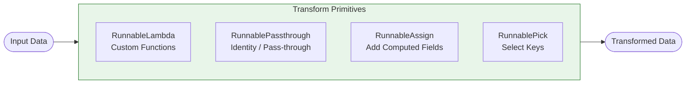

# Transform Chains

## Introduction

While prompts and models handle the AI work, real chains need custom logic—parsing, reshaping, enriching, filtering. Transform primitives let you inject Python functions anywhere in your LCEL pipelines. `RunnableLambda` wraps any callable, `RunnablePassthrough` preserves data while adding fields, and `RunnableAssign` enriches dictionaries with computed values.

We'll master these essential building blocks for creating flexible, powerful chains.

### What We'll Cover
- Using `RunnableLambda` to wrap custom functions
- Data preservation with `RunnablePassthrough`
- Field enrichment with `RunnablePassthrough.assign()`
- Using `itemgetter` for clean data extraction
- `RunnablePick` for dictionary filtering
- Streaming-compatible transforms

### Prerequisites
- Completion of [Conditional Chains](./04-conditional-chains.md)
- Understanding of Python functions and closures
- Python 3.10+ with LangChain 0.3+ installed

---

## Understanding Transform Primitives

Transform primitives bridge the gap between LCEL's declarative pipeline syntax and imperative Python code. They're the glue that makes complex workflows possible.

### Transform Primitive Overview



| Primitive | Purpose | Common Use |
|-----------|---------|------------|
| `RunnableLambda` | Wrap any Python callable | Custom transformations, API calls, business logic |
| `RunnablePassthrough` | Pass input unchanged | Preserve data through parallel branches |
| `RunnablePassthrough.assign()` | Add fields to dict | Enrich data with computed values |
| `RunnablePick` | Select specific keys | Filter dictionary to required fields |
| `itemgetter` | Extract values | Clean key access in parallel branches |

---

## RunnableLambda: Custom Functions

`RunnableLambda` is the most versatile transform—it wraps any Python callable and makes it a first-class LCEL citizen with `invoke`, `batch`, `stream`, and async support.

### Basic Function Wrapping

```python
from langchain_core.runnables import RunnableLambda

# Simple transformation function
def to_uppercase(text: str) -> str:
    """Convert text to uppercase."""
    return text.upper()

# Wrap as a Runnable
uppercase_runnable = RunnableLambda(to_uppercase)

# Now it has all Runnable methods
result = uppercase_runnable.invoke("hello world")
print(f"Single: {result}")

batch_results = uppercase_runnable.batch(["hello", "world", "python"])
print(f"Batch: {batch_results}")
```

**Output:**
```
Single: HELLO WORLD
Batch: ['HELLO', 'WORLD', 'PYTHON']
```

### Lambda Functions in Chains

Use inline lambdas for simple transformations:

```python
from langchain_core.prompts import ChatPromptTemplate
from langchain_core.output_parsers import StrOutputParser
from langchain_openai import ChatOpenAI

model = ChatOpenAI(model="gpt-4o-mini", temperature=0)

# Chain with lambda transforms
chain = (
    # Preprocess: Extract just the question
    RunnableLambda(lambda x: {"question": x["input"].strip().lower()})
    # Format prompt
    | ChatPromptTemplate.from_template("Answer briefly: {question}")
    # Get response
    | model
    | StrOutputParser()
    # Postprocess: Clean output
    | RunnableLambda(lambda x: x.strip())
    # Add metadata
    | RunnableLambda(lambda x: {"answer": x, "word_count": len(x.split())})
)

result = chain.invoke({"input": "  What is Machine Learning?  "})
print(result)
```

**Output:**
```
{'answer': 'Machine learning is a subset of artificial intelligence that enables systems to learn and improve from experience without being explicitly programmed.', 'word_count': 23}
```

### Functions with Multiple Arguments

Use closures or functools.partial for parameterized transforms:

```python
from functools import partial

def format_response(response: str, style: str = "default") -> str:
    """Format response according to style."""
    styles = {
        "default": response,
        "formal": f"Dear User,\n\n{response}\n\nBest regards",
        "casual": f"Hey! {response} 😊",
        "technical": f"```\n{response}\n```"
    }
    return styles.get(style, response)

# Using closure
def create_formatter(style: str):
    """Create a formatter with fixed style."""
    def formatter(response: str) -> str:
        return format_response(response, style)
    return RunnableLambda(formatter)

# Using partial
formal_formatter = RunnableLambda(partial(format_response, style="formal"))
casual_formatter = RunnableLambda(partial(format_response, style="casual"))

# Test different formatters
test_response = "Your request has been processed successfully."
print("Formal:", formal_formatter.invoke(test_response))
print("\nCasual:", casual_formatter.invoke(test_response))
```

**Output:**
```
Formal: Dear User,

Your request has been processed successfully.

Best regards

Casual: Hey! Your request has been processed successfully. 😊
```

### Async Functions with RunnableLambda

`RunnableLambda` automatically handles async functions:

```python
import asyncio

async def async_api_call(data: dict) -> dict:
    """Simulate an async API call."""
    await asyncio.sleep(0.1)  # Simulate network latency
    return {
        **data,
        "enriched": True,
        "api_version": "2.0"
    }

# RunnableLambda works with async
async_runnable = RunnableLambda(async_api_call)

# Async invocation
async def main():
    result = await async_runnable.ainvoke({"user_id": 123})
    print(result)

asyncio.run(main())
```

**Output:**
```
{'user_id': 123, 'enriched': True, 'api_version': '2.0'}
```

### Generator Functions for Streaming

`RunnableLambda` supports generators for streaming output:

```python
def streaming_transform(text: str):
    """Transform that yields chunks."""
    words = text.split()
    for i, word in enumerate(words):
        yield f"[{i}] {word.upper()} "

# Wrap generator as streamable Runnable
streaming_runnable = RunnableLambda(streaming_transform)

# Stream the output
print("Streaming output:")
for chunk in streaming_runnable.stream("hello world this is streaming"):
    print(chunk, end="", flush=True)
print()
```

**Output:**
```
Streaming output:
[0] HELLO [1] WORLD [2] THIS [3] IS [4] STREAMING 
```

---

## RunnablePassthrough: Data Preservation

`RunnablePassthrough` is the identity function for LCEL—it passes input through unchanged. This is essential for preserving data in parallel branches.

### Basic Passthrough

```python
from langchain_core.runnables import RunnablePassthrough, RunnableParallel

passthrough = RunnablePassthrough()

# Input passes through unchanged
result = passthrough.invoke({"key": "value", "number": 42})
print(result)
```

**Output:**
```
{'key': 'value', 'number': 42}
```

### Preserving Input Alongside Transformations

The main use case is keeping original data while adding processed values:

```python
# Process text but keep original
analysis_prompt = ChatPromptTemplate.from_template(
    "Analyze the sentiment of: {text}"
)

# Without passthrough - lose original text
bad_chain = analysis_prompt | model | StrOutputParser()

# With passthrough - keep original text
good_chain = RunnableParallel(
    original_text=RunnablePassthrough(),  # Keep input
    sentiment=analysis_prompt | model | StrOutputParser()  # Add analysis
)

result = good_chain.invoke({"text": "I love this product! It's amazing!"})
print(f"Original: {result['original_text']}")
print(f"Sentiment: {result['sentiment']}")
```

**Output:**
```
Original: {'text': "I love this product! It's amazing!"}
Sentiment: The sentiment of this text is very positive. The use of "love" and "amazing" expresses strong enthusiasm and satisfaction.
```

### Passthrough in Complex Pipelines

```python
from operator import itemgetter

# Multi-stage pipeline preserving context
question_prompt = ChatPromptTemplate.from_template(
    "Given this context:\n{context}\n\nAnswer: {question}"
)

# Build chain that preserves all inputs
qa_chain = (
    RunnableParallel(
        # Preserve inputs
        context=itemgetter("context"),
        question=itemgetter("question"),
        # Generate answer
        answer=question_prompt | model | StrOutputParser()
    )
    # Add post-processing
    | RunnableLambda(lambda x: {
        **x,
        "answer_length": len(x["answer"].split()),
        "has_answer": bool(x["answer"].strip())
    })
)

result = qa_chain.invoke({
    "context": "Python is a high-level programming language created by Guido van Rossum.",
    "question": "Who created Python?"
})

print(f"Question: {result['question']}")
print(f"Context: {result['context'][:50]}...")
print(f"Answer: {result['answer']}")
print(f"Answer length: {result['answer_length']} words")
```

**Output:**
```
Question: Who created Python?
Context: Python is a high-level programming language created...
Answer: Python was created by Guido van Rossum.
Answer length: 7 words
```

---

## RunnablePassthrough.assign(): Field Enrichment

`RunnablePassthrough.assign()` is syntactic sugar for adding computed fields to dictionaries while preserving existing fields.

### Basic assign() Usage

```python
from langchain_core.runnables import RunnablePassthrough

# Add computed fields to input dict
enricher = RunnablePassthrough.assign(
    # Add word count
    word_count=lambda x: len(x["text"].split()),
    # Add character count
    char_count=lambda x: len(x["text"]),
    # Add first word
    first_word=lambda x: x["text"].split()[0] if x["text"] else ""
)

result = enricher.invoke({"text": "Hello world of LangChain", "source": "user"})
print(result)
```

**Output:**
```
{'text': 'Hello world of LangChain', 'source': 'user', 'word_count': 4, 'char_count': 24, 'first_word': 'Hello'}
```

### Chaining Multiple assign() Calls

```python
# Sequential enrichment
pipeline = (
    # First enrichment: basic stats
    RunnablePassthrough.assign(
        word_count=lambda x: len(x["text"].split()),
        is_question=lambda x: "?" in x["text"]
    )
    # Second enrichment: derived values
    | RunnablePassthrough.assign(
        text_type=lambda x: "question" if x["is_question"] else "statement",
        complexity=lambda x: "complex" if x["word_count"] > 20 else "simple"
    )
    # Third enrichment: formatting
    | RunnablePassthrough.assign(
        summary=lambda x: f"{x['text_type'].title()} ({x['complexity']}, {x['word_count']} words)"
    )
)

result = pipeline.invoke({"text": "What is the meaning of life?"})
print(result)
```

**Output:**
```
{'text': 'What is the meaning of life?', 'word_count': 6, 'is_question': True, 'text_type': 'question', 'complexity': 'simple', 'summary': 'Question (simple, 6 words)'}
```

### assign() with Runnable Chains

The values in `assign()` can be full Runnable chains, not just lambdas:

```python
# Assign LLM-generated content
enriched_chain = RunnablePassthrough.assign(
    # Add summary using LLM
    summary=(
        ChatPromptTemplate.from_template("Summarize in 10 words: {text}")
        | model
        | StrOutputParser()
    ),
    # Add keywords using LLM
    keywords=(
        ChatPromptTemplate.from_template("List 3 keywords from: {text}")
        | model
        | StrOutputParser()
    )
)

result = enriched_chain.invoke({
    "text": "Machine learning is transforming industries by enabling computers to learn from data without explicit programming."
})

print(f"Original: {result['text'][:60]}...")
print(f"Summary: {result['summary']}")
print(f"Keywords: {result['keywords']}")
```

**Output:**
```
Original: Machine learning is transforming industries by enabling comp...
Summary: Machine learning enables computers to learn from data automatically.
Keywords: Machine learning, data, industries
```

---

## itemgetter for Clean Data Extraction

Python's `operator.itemgetter` provides clean, readable key extraction—especially useful in parallel branches.

### Basic itemgetter Usage

```python
from operator import itemgetter

# Extract single key
get_name = itemgetter("name")
print(get_name({"name": "Alice", "age": 30}))  # Output: Alice

# Extract multiple keys (returns tuple)
get_name_age = itemgetter("name", "age")
print(get_name_age({"name": "Bob", "age": 25}))  # Output: ('Bob', 25)
```

### itemgetter in LCEL Chains

```python
from operator import itemgetter
from langchain_core.runnables import RunnableParallel

# Complex input structure
input_data = {
    "user": {"name": "Alice", "role": "admin"},
    "query": "What are the permissions?",
    "context": "Admin users have full access."
}

# Build chain using itemgetter for clean extraction
admin_prompt = ChatPromptTemplate.from_template(
    """User: {user_name} (Role: {role})
Query: {query}
Context: {context}

Respond appropriately."""
)

# Extract and reshape for prompt
chain = (
    {
        "user_name": lambda x: x["user"]["name"],
        "role": lambda x: x["user"]["role"],
        "query": itemgetter("query"),
        "context": itemgetter("context")
    }
    | admin_prompt
    | model
    | StrOutputParser()
)

result = chain.invoke(input_data)
print(result[:150])
```

### Nested itemgetter Alternative

For deeply nested data, combine with lambda:

```python
# Helper for nested access
def nested_getter(*keys):
    """Create a getter for nested dictionary access."""
    def getter(data):
        result = data
        for key in keys:
            result = result[key]
        return result
    return RunnableLambda(getter)

# Usage
user_name_getter = nested_getter("user", "name")
result = user_name_getter.invoke(input_data)
print(f"User name: {result}")
```

**Output:**
```
User name: Alice
```

---

## RunnablePick: Dictionary Filtering

`RunnablePick` selects specific keys from a dictionary, discarding others. Useful for cleaning up data before passing to downstream components.

### Basic RunnablePick Usage

```python
from langchain_core.runnables import RunnablePick

# Pick specific keys
picker = RunnablePick(["name", "email"])

data = {
    "name": "Alice",
    "email": "alice@example.com",
    "phone": "555-1234",
    "address": "123 Main St",
    "internal_id": "ABC123"
}

result = picker.invoke(data)
print(result)
```

**Output:**
```
{'name': 'Alice', 'email': 'alice@example.com'}
```

### Filtering Before External Calls

Remove sensitive data before sending to APIs:

```python
# Chain that filters sensitive data before LLM call
safe_prompt = ChatPromptTemplate.from_template(
    "Help user {name} with: {question}"
)

# Remove internal/sensitive fields before processing
safe_chain = (
    RunnablePick(["name", "question"])  # Only keep safe fields
    | safe_prompt
    | model
    | StrOutputParser()
)

result = safe_chain.invoke({
    "name": "Alice",
    "question": "How do I reset my password?",
    "ssn": "123-45-6789",  # Filtered out
    "credit_card": "4111-xxxx-xxxx-1111",  # Filtered out
    "internal_user_id": "secret_123"  # Filtered out
})

print(result[:100])
```

### Combining Pick and Assign

```python
# Pick essential fields, then enrich
clean_and_enrich = (
    # First: filter to essential fields
    RunnablePick(["user_id", "message", "timestamp"])
    # Then: add computed fields
    | RunnablePassthrough.assign(
        processed_at=lambda x: "2025-01-15T10:30:00Z",
        message_length=lambda x: len(x["message"])
    )
)

result = clean_and_enrich.invoke({
    "user_id": "U123",
    "message": "Hello, I need help!",
    "timestamp": "2025-01-15T10:00:00Z",
    "internal_tracking": "dont_send_this",
    "session_data": {"sensitive": "data"}
})

print(result)
```

**Output:**
```
{'user_id': 'U123', 'message': 'Hello, I need help!', 'timestamp': '2025-01-15T10:00:00Z', 'processed_at': '2025-01-15T10:30:00Z', 'message_length': 19}
```

---

## Streaming-Compatible Transforms

When building streaming chains, transforms must handle chunks correctly. Some transforms stream naturally, others need special handling.

### Streaming-Compatible Patterns

```python
# This streams correctly - simple pass-through modifications
def stream_compatible_transform(chunk: str) -> str:
    """Transform that works with streaming."""
    return chunk.upper()

streaming_chain = (
    ChatPromptTemplate.from_template("Tell me about {topic}")
    | model
    | StrOutputParser()
    | RunnableLambda(stream_compatible_transform)  # Works chunk by chunk
)

print("Streaming output:")
for chunk in streaming_chain.stream({"topic": "the moon"}):
    print(chunk, end="", flush=True)
print()
```

### Transforms That Break Streaming

Some operations require the full output—they buffer all chunks:

```python
# This breaks streaming - needs full content
def needs_full_content(text: str) -> dict:
    """Transform that needs complete text."""
    return {
        "text": text,
        "word_count": len(text.split()),  # Can't count until complete
        "reversed": text[::-1]  # Can't reverse until complete
    }

# Chain will buffer all content before this transform
buffered_chain = (
    ChatPromptTemplate.from_template("Tell me about {topic}")
    | model
    | StrOutputParser()
    | RunnableLambda(needs_full_content)  # Buffers all chunks
)

# No streaming benefit - all output at once
result = buffered_chain.invoke({"topic": "the sun"})
print(f"Word count: {result['word_count']}")
```

### Generator-Based Streaming Transforms

For true streaming with transforms:

```python
def streaming_word_counter(text_iterator):
    """Generator that processes stream while counting."""
    word_count = 0
    buffer = ""
    
    for chunk in text_iterator:
        buffer += chunk
        # Yield chunk as-is for display
        yield chunk
        # Count complete words
        words = buffer.split()
        if len(words) > 1:
            word_count += len(words) - 1
            buffer = words[-1]
    
    # Final count
    if buffer.strip():
        word_count += 1
    
    # Yield metadata at end
    yield f"\n[Total words: {word_count}]"

# Note: This requires special handling in the chain
# Standard RunnableLambda doesn't do iterator-to-iterator transforms
```

### Using with_alisteners for Stream Processing

```python
from langchain_core.tracers import BaseTracer

class StreamingMetricsCollector:
    """Collect metrics while streaming."""
    
    def __init__(self):
        self.chunk_count = 0
        self.total_chars = 0
    
    def on_chunk(self, chunk: str):
        self.chunk_count += 1
        self.total_chars += len(chunk)
    
    def get_metrics(self) -> dict:
        return {
            "chunks": self.chunk_count,
            "total_chars": self.total_chars,
            "avg_chunk_size": self.total_chars / max(1, self.chunk_count)
        }

# Usage pattern
collector = StreamingMetricsCollector()

chain = ChatPromptTemplate.from_template("Explain {topic}") | model

for chunk in chain.stream({"topic": "streaming in LangChain"}):
    content = chunk.content if hasattr(chunk, 'content') else str(chunk)
    collector.on_chunk(content)
    print(content, end="", flush=True)

print(f"\n\nMetrics: {collector.get_metrics()}")
```

---

## Advanced Transform Patterns

### Transform Factory Pattern

Create reusable transform generators:

```python
class TransformFactory:
    """Factory for creating common transforms."""
    
    @staticmethod
    def string_cleaner(
        strip: bool = True,
        lowercase: bool = False,
        remove_punctuation: bool = False
    ):
        """Create a string cleaning transform."""
        import string
        
        def cleaner(text: str) -> str:
            if strip:
                text = text.strip()
            if lowercase:
                text = text.lower()
            if remove_punctuation:
                text = text.translate(str.maketrans("", "", string.punctuation))
            return text
        
        return RunnableLambda(cleaner)
    
    @staticmethod
    def dict_transformer(
        rename_keys: dict = None,
        add_defaults: dict = None,
        remove_keys: list = None
    ):
        """Create a dictionary transformation."""
        def transformer(data: dict) -> dict:
            result = dict(data)
            
            # Remove keys
            if remove_keys:
                for key in remove_keys:
                    result.pop(key, None)
            
            # Rename keys
            if rename_keys:
                for old_key, new_key in rename_keys.items():
                    if old_key in result:
                        result[new_key] = result.pop(old_key)
            
            # Add defaults
            if add_defaults:
                for key, value in add_defaults.items():
                    if key not in result:
                        result[key] = value
            
            return result
        
        return RunnableLambda(transformer)
    
    @staticmethod
    def validator(required_keys: list, schema: dict = None):
        """Create a validation transform."""
        def validate(data: dict) -> dict:
            # Check required keys
            missing = [k for k in required_keys if k not in data]
            if missing:
                raise ValueError(f"Missing required keys: {missing}")
            
            # Type validation if schema provided
            if schema:
                for key, expected_type in schema.items():
                    if key in data and not isinstance(data[key], expected_type):
                        raise TypeError(
                            f"Key '{key}' expected {expected_type.__name__}, "
                            f"got {type(data[key]).__name__}"
                        )
            
            return data
        
        return RunnableLambda(validate)

# Usage
factory = TransformFactory()

pipeline = (
    factory.validator(required_keys=["text", "user_id"])
    | factory.dict_transformer(
        rename_keys={"text": "content"},
        add_defaults={"priority": "normal"}
    )
    | RunnablePassthrough.assign(
        content_clean=lambda x: x["content"].strip().lower()
    )
)

result = pipeline.invoke({"text": "  HELLO WORLD  ", "user_id": "U123"})
print(result)
```

**Output:**
```
{'content': '  HELLO WORLD  ', 'user_id': 'U123', 'priority': 'normal', 'content_clean': 'hello world'}
```

### Error-Safe Transforms

```python
def safe_transform(func, default=None, log_errors=True):
    """Wrap a function with error handling."""
    import logging
    logger = logging.getLogger(__name__)
    
    def wrapper(data):
        try:
            return func(data)
        except Exception as e:
            if log_errors:
                logger.error(f"Transform error: {e}")
            if default is not None:
                return default
            raise
    
    return RunnableLambda(wrapper)

# Usage
risky_transform = lambda x: x["missing_key"]["nested"]  # Will fail

safe_version = safe_transform(
    risky_transform,
    default={"error": "Transform failed", "original": None}
)

result = safe_version.invoke({"other_key": "value"})
print(result)
```

**Output:**
```
{'error': 'Transform failed', 'original': None}
```

---

## Best Practices

| Practice | Why It Matters |
|----------|----------------|
| Use descriptive function names | Improves trace readability |
| Prefer `assign()` over manual dict spread | Cleaner, less error-prone |
| Use `RunnablePick` before external calls | Prevent data leaks |
| Test transforms in isolation | Easier to debug |
| Document transform input/output types | Helps chain composition |
| Use factories for common patterns | Promotes reuse |

---

## Common Pitfalls

| ❌ Mistake | ✅ Solution |
|-----------|-------------|
| Mutating input dicts in transforms | Always create new dicts: `{**data, "key": value}` |
| Complex lambdas inline | Extract to named functions for readability |
| Forgetting async for I/O operations | Use async functions with `RunnableLambda` |
| Breaking streaming with full-content transforms | Place buffering transforms at chain end |
| Not handling missing keys | Use `.get()` or validation transforms |
| Nested itemgetter expectations | itemgetter doesn't do nested access—use lambda |

---

## Hands-on Exercise

### Your Task

Build a data processing pipeline that transforms user input through multiple stages:

1. **Validation**: Ensure required fields exist
2. **Normalization**: Clean and standardize text fields
3. **Enrichment**: Add computed metadata
4. **Filtering**: Remove internal fields before output
5. **Formatting**: Structure for API response

### Requirements

1. Accept input: `{"name": str, "email": str, "message": str, "internal_id": str}`
2. Validate: name and message are required
3. Normalize: strip whitespace, lowercase email
4. Enrich: add `word_count`, `processed_at`, `message_hash`
5. Filter: remove `internal_id` from output
6. Format: wrap in API response structure with `status` and `data`

### Expected Result

```python
result = pipeline.invoke({
    "name": "  Alice  ",
    "email": "ALICE@EXAMPLE.COM",
    "message": "Hello, I have a question!",
    "internal_id": "SECRET_123"
})

# Should return:
{
    "status": "success",
    "data": {
        "name": "Alice",
        "email": "alice@example.com",
        "message": "Hello, I have a question!",
        "word_count": 5,
        "processed_at": "2025-01-15T10:30:00Z",
        "message_hash": "abc123..."
    }
}
```

<details>
<summary>💡 Hints (click to expand)</summary>

- Chain multiple `RunnablePassthrough.assign()` calls for step-by-step enrichment
- Use `RunnablePick` to filter out `internal_id`
- Use `hashlib.md5()` for a simple message hash
- Wrap final result in the response structure with a `RunnableLambda`
- Handle validation errors by returning error response structure

</details>

<details>
<summary>✅ Solution (click to expand)</summary>

```python
from langchain_core.runnables import RunnableLambda, RunnablePassthrough, RunnablePick
from datetime import datetime
import hashlib

# Step 1: Validation transform
def validate_input(data: dict) -> dict:
    """Validate required fields exist."""
    required = ["name", "message"]
    missing = [k for k in required if not data.get(k)]
    
    if missing:
        raise ValueError(f"Missing required fields: {missing}")
    
    return data

# Step 2: Normalization
normalize_step = RunnablePassthrough.assign(
    name=lambda x: x["name"].strip(),
    email=lambda x: x.get("email", "").strip().lower(),
    message=lambda x: x["message"].strip()
)

# Step 3: Enrichment
def compute_hash(message: str) -> str:
    """Compute MD5 hash of message."""
    return hashlib.md5(message.encode()).hexdigest()[:12]

enrich_step = RunnablePassthrough.assign(
    word_count=lambda x: len(x["message"].split()),
    processed_at=lambda x: datetime.now().isoformat(),
    message_hash=lambda x: compute_hash(x["message"])
)

# Step 4: Filtering (remove internal_id)
filter_step = RunnablePick(["name", "email", "message", "word_count", "processed_at", "message_hash"])

# Step 5: Format as API response
def format_response(data: dict) -> dict:
    """Wrap in API response structure."""
    return {
        "status": "success",
        "data": data
    }

def handle_error(func):
    """Error handling wrapper."""
    def wrapper(data):
        try:
            return func(data)
        except ValueError as e:
            return {
                "status": "error",
                "error": str(e),
                "data": None
            }
    return wrapper

# Build complete pipeline
processing_chain = (
    RunnableLambda(validate_input)
    | normalize_step
    | enrich_step
    | filter_step
    | RunnableLambda(format_response)
)

# Wrap with error handling
pipeline = RunnableLambda(handle_error(processing_chain.invoke))

# Test with valid input
valid_result = pipeline.invoke({
    "name": "  Alice  ",
    "email": "ALICE@EXAMPLE.COM",
    "message": "Hello, I have a question!",
    "internal_id": "SECRET_123"
})

print("Valid Input Result:")
import json
print(json.dumps(valid_result, indent=2))

# Test with invalid input (missing message)
invalid_result = pipeline.invoke({
    "name": "Bob",
    "email": "bob@example.com",
    "internal_id": "SECRET_456"
})

print("\nInvalid Input Result:")
print(json.dumps(invalid_result, indent=2))

# Test batch processing
batch_inputs = [
    {"name": "User 1", "message": "First message", "internal_id": "ID1"},
    {"name": "User 2", "message": "Second message here", "email": "user2@test.com", "internal_id": "ID2"},
]

batch_results = [pipeline.invoke(inp) for inp in batch_inputs]
print("\nBatch Processing:")
for i, result in enumerate(batch_results):
    print(f"  Input {i+1}: status={result['status']}, words={result.get('data', {}).get('word_count', 'N/A')}")
```

**Expected Output:**
```json
Valid Input Result:
{
  "status": "success",
  "data": {
    "name": "Alice",
    "email": "alice@example.com",
    "message": "Hello, I have a question!",
    "word_count": 5,
    "processed_at": "2025-01-15T10:30:00.123456",
    "message_hash": "a1b2c3d4e5f6"
  }
}

Invalid Input Result:
{
  "status": "error",
  "error": "Missing required fields: ['message']",
  "data": null
}

Batch Processing:
  Input 1: status=success, words=2
  Input 2: status=success, words=3
```

</details>

### Bonus Challenges

- [ ] Add schema validation using Pydantic models
- [ ] Implement a streaming-compatible version of the pipeline
- [ ] Add transform caching for expensive operations
- [ ] Create a TransformBuilder class with fluent API

---

## Summary

✅ `RunnableLambda` wraps any Python callable with full LCEL compatibility (invoke, batch, stream, async)

✅ `RunnablePassthrough` preserves input data—essential for parallel branches that need original context

✅ `RunnablePassthrough.assign()` adds computed fields while preserving existing ones

✅ `itemgetter` provides clean, readable key extraction for parallel branch inputs

✅ `RunnablePick` filters dictionaries to specific keys—crucial for security and data minimization

✅ Generator functions enable streaming-compatible transforms

**Next:** [Advanced Patterns](./06-advanced-patterns.md)

---

## Further Reading

- [RunnableLambda API Reference](https://python.langchain.com/api_reference/core/runnables/langchain_core.runnables.base.RunnableLambda.html) - Detailed API documentation
- [RunnablePassthrough Documentation](https://python.langchain.com/docs/how_to/passthrough/) - Official how-to guide
- [Python operator.itemgetter](https://docs.python.org/3/library/operator.html#operator.itemgetter) - Standard library reference

---

<!-- 
Sources Consulted:
- LangChain GitHub: langchain-ai/langchain - RunnableLambda, RunnablePassthrough implementation
- LangChain GitHub: langchain-ai/langchain - RunnableAssign, RunnablePick
- LangChain Docs: python.langchain.com/docs/how_to/passthrough
- Python Docs: docs.python.org/3/library/operator.html
-->
