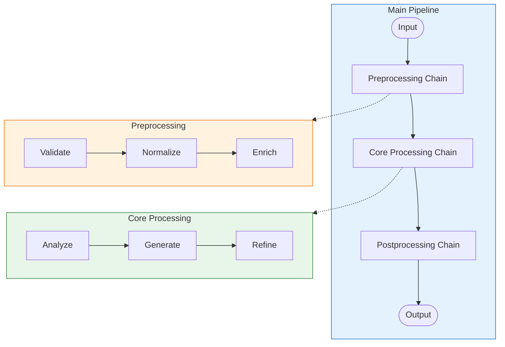

# Advanced Chain Patterns

## Introduction

Now that you've mastered the fundamentals—sequential, parallel, conditional, and transform chains—it's time to explore advanced patterns that unlock LangChain's full potential. These patterns address real-world challenges: observability at scale, complex data processing workflows, recursive operations, and production-grade best practices.

We'll build sophisticated systems that combine multiple patterns, stream events for real-time observability, and implement patterns used in production AI applications.

### What We'll Cover
- Composing chains of chains (nested composition)
- Recursive chain patterns for iterative refinement
- `astream_events` for fine-grained observability
- Map-reduce patterns for large document processing
- Human-in-the-loop integration concepts
- Production deployment best practices

### Prerequisites
- Completion of all previous chain lessons
- Understanding of async programming in Python
- Python 3.10+ with LangChain 0.3+ installed

---

## Composing Chains of Chains

Real applications require modular, reusable chain components. By composing chains of chains, you create maintainable systems where each component can be developed, tested, and optimized independently.

### Chain Abstraction Pattern



### Building Modular Chain Components

```python
from langchain_core.runnables import RunnableLambda, RunnableParallel, RunnablePassthrough
from langchain_core.prompts import ChatPromptTemplate
from langchain_core.output_parsers import StrOutputParser
from langchain_openai import ChatOpenAI

model = ChatOpenAI(model="gpt-4o-mini", temperature=0)

# ===== Component 1: Preprocessing Chain =====
def create_preprocessing_chain():
    """Create a reusable preprocessing chain."""
    
    def validate(data: dict) -> dict:
        if "text" not in data:
            raise ValueError("Input must contain 'text' field")
        return data
    
    def normalize(data: dict) -> dict:
        return {
            **data,
            "text": data["text"].strip(),
            "text_lower": data["text"].lower()
        }
    
    def enrich(data: dict) -> dict:
        return {
            **data,
            "word_count": len(data["text"].split()),
            "char_count": len(data["text"])
        }
    
    return (
        RunnableLambda(validate)
        | RunnableLambda(normalize)
        | RunnableLambda(enrich)
    )

# ===== Component 2: Analysis Chain =====
def create_analysis_chain(model):
    """Create a reusable analysis chain."""
    
    sentiment_prompt = ChatPromptTemplate.from_template(
        "Classify sentiment as positive, negative, or neutral: {text}"
    )
    
    topic_prompt = ChatPromptTemplate.from_template(
        "List main topics (comma-separated): {text}"
    )
    
    return RunnableParallel(
        sentiment=sentiment_prompt | model | StrOutputParser(),
        topics=topic_prompt | model | StrOutputParser(),
        # Pass through original data
        original=RunnablePassthrough()
    )

# ===== Component 3: Summary Chain =====
def create_summary_chain(model):
    """Create a reusable summary chain."""
    
    summary_prompt = ChatPromptTemplate.from_template(
        """Based on this analysis:
Text: {original_text}
Sentiment: {sentiment}
Topics: {topics}

Write a one-paragraph executive summary."""
    )
    
    def extract_for_summary(data: dict) -> dict:
        return {
            "original_text": data["original"]["text"],
            "sentiment": data["sentiment"],
            "topics": data["topics"]
        }
    
    return (
        RunnableLambda(extract_for_summary)
        | summary_prompt
        | model
        | StrOutputParser()
    )

# ===== Component 4: Postprocessing Chain =====
def create_postprocessing_chain():
    """Create final output formatting chain."""
    
    def format_output(data: tuple) -> dict:
        analysis, summary = data
        return {
            "input": {
                "text": analysis["original"]["text"],
                "word_count": analysis["original"]["word_count"]
            },
            "analysis": {
                "sentiment": analysis["sentiment"],
                "topics": [t.strip() for t in analysis["topics"].split(",")]
            },
            "summary": summary,
            "status": "complete"
        }
    
    return RunnableLambda(format_output)

# ===== Compose into Main Pipeline =====
def create_document_pipeline(model):
    """Create complete document processing pipeline."""
    
    preprocess = create_preprocessing_chain()
    analyze = create_analysis_chain(model)
    summarize = create_summary_chain(model)
    postprocess = create_postprocessing_chain()
    
    # Compose chains
    return (
        preprocess
        | analyze
        | RunnableParallel(
            analysis=RunnablePassthrough(),
            summary=summarize
        )
        | RunnableLambda(lambda x: (x["analysis"], x["summary"]))
        | postprocess
    )

# Usage
pipeline = create_document_pipeline(model)

result = pipeline.invoke({
    "text": "The new AI features have dramatically improved our workflow efficiency. Team productivity is up 40% and customer satisfaction scores are the highest ever recorded."
})

import json
print(json.dumps(result, indent=2))
```

**Output:**
```json
{
  "input": {
    "text": "The new AI features have dramatically improved our workflow efficiency. Team productivity is up 40% and customer satisfaction scores are the highest ever recorded.",
    "word_count": 26
  },
  "analysis": {
    "sentiment": "positive",
    "topics": ["AI features", "workflow efficiency", "team productivity", "customer satisfaction"]
  },
  "summary": "The implementation of new AI features has yielded exceptional results, driving a 40% increase in team productivity while achieving record-breaking customer satisfaction scores, demonstrating the technology's significant positive impact on organizational performance.",
  "status": "complete"
}
```

### Chain Dependency Injection

```python
class ChainFactory:
    """Factory for creating chains with injected dependencies."""
    
    def __init__(self, model, config: dict = None):
        self.model = model
        self.config = config or {}
    
    def create_chain(self, chain_type: str):
        """Create a chain of the specified type."""
        creators = {
            "preprocessing": self._create_preprocessing,
            "analysis": self._create_analysis,
            "summary": self._create_summary,
            "full_pipeline": self._create_full_pipeline
        }
        
        creator = creators.get(chain_type)
        if not creator:
            raise ValueError(f"Unknown chain type: {chain_type}")
        
        return creator()
    
    def _create_preprocessing(self):
        max_length = self.config.get("max_text_length", 10000)
        
        def truncate(data: dict) -> dict:
            text = data.get("text", "")
            if len(text) > max_length:
                data["text"] = text[:max_length] + "..."
                data["truncated"] = True
            return data
        
        return RunnableLambda(truncate)
    
    def _create_analysis(self):
        return create_analysis_chain(self.model)
    
    def _create_summary(self):
        return create_summary_chain(self.model)
    
    def _create_full_pipeline(self):
        return create_document_pipeline(self.model)

# Usage with configuration
factory = ChainFactory(
    model=ChatOpenAI(model="gpt-4o-mini"),
    config={"max_text_length": 5000}
)

pipeline = factory.create_chain("full_pipeline")
```

---

## Recursive Chain Patterns

Some tasks require iterative refinement—improving output until it meets quality thresholds. Recursive patterns enable self-improving chains.

### Iterative Refinement Chain

```python
from langchain_core.runnables import RunnableLambda
from langchain_core.prompts import ChatPromptTemplate
from langchain_core.output_parsers import StrOutputParser

model = ChatOpenAI(model="gpt-4o-mini", temperature=0.7)

# Evaluation prompt
evaluate_prompt = ChatPromptTemplate.from_template(
    """Evaluate this response for quality on a scale of 1-10:

Response: {response}

Criteria:
- Clarity: Is it easy to understand?
- Completeness: Does it fully address the topic?
- Accuracy: Is the information correct?

Reply with just a number (1-10) and one sentence of feedback.
Example: "7 - Good clarity but could use more specific examples."
"""
)

# Refinement prompt
refine_prompt = ChatPromptTemplate.from_template(
    """Improve this response based on the feedback:

Original response: {response}
Feedback: {feedback}

Write an improved version that addresses the feedback.
"""
)

def create_iterative_chain(
    generator_chain,
    max_iterations: int = 3,
    quality_threshold: int = 8
):
    """Create a chain that iteratively refines output."""
    
    def parse_evaluation(eval_text: str) -> tuple[int, str]:
        """Extract score and feedback from evaluation."""
        try:
            parts = eval_text.split(" - ", 1)
            score = int(parts[0].strip())
            feedback = parts[1] if len(parts) > 1 else "No specific feedback"
            return score, feedback
        except (ValueError, IndexError):
            return 5, eval_text  # Default to mid-score if parsing fails
    
    def iterative_refine(input_data: dict) -> dict:
        # Generate initial response
        response = generator_chain.invoke(input_data)
        
        history = [{
            "iteration": 0,
            "response": response,
            "score": None,
            "feedback": "Initial generation"
        }]
        
        for iteration in range(1, max_iterations + 1):
            # Evaluate current response
            evaluation = (evaluate_prompt | model | StrOutputParser()).invoke({
                "response": response
            })
            
            score, feedback = parse_evaluation(evaluation)
            history[-1]["score"] = score
            history[-1]["feedback"] = feedback
            
            # Check if quality threshold met
            if score >= quality_threshold:
                break
            
            # Refine the response
            response = (refine_prompt | model | StrOutputParser()).invoke({
                "response": response,
                "feedback": feedback
            })
            
            history.append({
                "iteration": iteration,
                "response": response,
                "score": None,
                "feedback": None
            })
        
        # Final evaluation if we refined
        if history[-1]["score"] is None:
            evaluation = (evaluate_prompt | model | StrOutputParser()).invoke({
                "response": response
            })
            score, feedback = parse_evaluation(evaluation)
            history[-1]["score"] = score
            history[-1]["feedback"] = feedback
        
        return {
            "final_response": response,
            "iterations": len(history),
            "final_score": history[-1]["score"],
            "history": history
        }
    
    return RunnableLambda(iterative_refine)

# Base generator chain
base_prompt = ChatPromptTemplate.from_template(
    "Explain {topic} in 2-3 sentences for a beginner."
)
generator = base_prompt | model | StrOutputParser()

# Create iterative chain
iterative_chain = create_iterative_chain(
    generator,
    max_iterations=3,
    quality_threshold=8
)

# Test
result = iterative_chain.invoke({"topic": "neural networks"})

print(f"Iterations: {result['iterations']}")
print(f"Final Score: {result['final_score']}")
print(f"\nFinal Response:\n{result['final_response']}")
print("\n--- Refinement History ---")
for entry in result['history']:
    print(f"Iteration {entry['iteration']}: Score {entry['score']}")
```

**Output:**
```
Iterations: 2
Final Score: 8

Final Response:
Neural networks are computing systems inspired by the human brain, consisting of interconnected nodes (neurons) that process information in layers. They learn patterns from data by adjusting the strength of connections between neurons, enabling tasks like image recognition, language translation, and game playing. For example, when you ask a voice assistant a question, neural networks help it understand your speech and generate a relevant response.

--- Refinement History ---
Iteration 0: Score 6
Iteration 1: Score 8
```

### Self-Correcting Chain

```python
from langchain_core.pydantic_v1 import BaseModel, Field, validator
from langchain_core.output_parsers import PydanticOutputParser
from typing import Optional

class StructuredResponse(BaseModel):
    """Structured response with validation."""
    answer: str = Field(description="The main answer")
    confidence: float = Field(description="Confidence 0.0-1.0", ge=0.0, le=1.0)
    sources: list[str] = Field(description="List of sources or reasoning steps")
    
    @validator("sources")
    def validate_sources(cls, v):
        if len(v) < 1:
            raise ValueError("Must include at least one source/reasoning step")
        return v

parser = PydanticOutputParser(pydantic_object=StructuredResponse)

def create_self_correcting_chain(model, max_attempts: int = 3):
    """Create a chain that corrects parsing errors."""
    
    main_prompt = ChatPromptTemplate.from_template(
        """Answer this question with structured output:

Question: {question}

{format_instructions}"""
    )
    
    correction_prompt = ChatPromptTemplate.from_template(
        """Your previous response had a parsing error:

Error: {error}

Previous output: {previous_output}

Please fix the output to match this format:
{format_instructions}"""
    )
    
    def self_correct(input_data: dict) -> dict:
        question = input_data["question"]
        format_instructions = parser.get_format_instructions()
        
        # Initial attempt
        raw_output = (main_prompt | model | StrOutputParser()).invoke({
            "question": question,
            "format_instructions": format_instructions
        })
        
        for attempt in range(max_attempts):
            try:
                parsed = parser.parse(raw_output)
                return {
                    "parsed": parsed.dict(),
                    "attempts": attempt + 1,
                    "success": True
                }
            except Exception as e:
                if attempt < max_attempts - 1:
                    # Try to correct
                    raw_output = (correction_prompt | model | StrOutputParser()).invoke({
                        "error": str(e),
                        "previous_output": raw_output,
                        "format_instructions": format_instructions
                    })
        
        return {
            "parsed": None,
            "raw_output": raw_output,
            "attempts": max_attempts,
            "success": False
        }
    
    return RunnableLambda(self_correct)

# Usage
correcting_chain = create_self_correcting_chain(model)
result = correcting_chain.invoke({"question": "What causes seasons on Earth?"})

print(f"Success: {result['success']}, Attempts: {result['attempts']}")
if result['success']:
    print(f"Answer: {result['parsed']['answer'][:100]}...")
    print(f"Confidence: {result['parsed']['confidence']}")
```

---

## astream_events for Observability

`astream_events` provides granular visibility into chain execution—every step, every token, every event. Essential for debugging, monitoring, and building responsive UIs.

### Understanding Event Types

```python
import asyncio
from langchain_core.prompts import ChatPromptTemplate
from langchain_core.output_parsers import StrOutputParser
from langchain_openai import ChatOpenAI

model = ChatOpenAI(model="gpt-4o-mini", temperature=0, streaming=True)

chain = (
    ChatPromptTemplate.from_template("Tell me about {topic}")
    | model
    | StrOutputParser()
)

async def stream_all_events():
    """Stream and display all event types."""
    
    event_counts = {}
    
    async for event in chain.astream_events(
        {"topic": "the moon"},
        version="v2"  # Use v2 for latest event format
    ):
        event_type = event["event"]
        event_counts[event_type] = event_counts.get(event_type, 0) + 1
        
        # Display different event types
        if event_type == "on_chain_start":
            print(f"🚀 Chain started: {event['name']}")
        
        elif event_type == "on_chat_model_stream":
            chunk = event["data"]["chunk"]
            if hasattr(chunk, "content") and chunk.content:
                print(chunk.content, end="", flush=True)
        
        elif event_type == "on_chain_end":
            print(f"\n✅ Chain ended: {event['name']}")
    
    print("\n\n--- Event Summary ---")
    for event_type, count in sorted(event_counts.items()):
        print(f"  {event_type}: {count}")

asyncio.run(stream_all_events())
```

**Output:**
```
🚀 Chain started: ChatPromptTemplate
🚀 Chain started: ChatOpenAI
🚀 Chain started: StrOutputParser
The moon is Earth's only natural satellite, orbiting our planet at an average distance of about 384,400 kilometers. It's approximately 1/4 the diameter of Earth and has a significant influence on our planet through tidal forces...
✅ Chain ended: StrOutputParser
✅ Chain ended: ChatOpenAI
✅ Chain ended: ChatPromptTemplate

--- Event Summary ---
  on_chain_end: 3
  on_chain_start: 3
  on_chat_model_end: 1
  on_chat_model_start: 1
  on_chat_model_stream: 45
  on_parser_end: 1
  on_parser_start: 1
  on_prompt_end: 1
  on_prompt_start: 1
```

### Filtering Events by Type

```python
async def stream_tokens_only():
    """Stream only LLM tokens for clean output."""
    
    full_response = ""
    
    async for event in chain.astream_events(
        {"topic": "artificial intelligence"},
        version="v2",
        include_types=["on_chat_model_stream"]  # Filter to token events only
    ):
        chunk = event["data"]["chunk"]
        if hasattr(chunk, "content") and chunk.content:
            full_response += chunk.content
            print(chunk.content, end="", flush=True)
    
    print(f"\n\n[Total length: {len(full_response)} chars]")

asyncio.run(stream_tokens_only())
```

### Building a Progress Tracker

```python
class ChainProgressTracker:
    """Track progress through a multi-step chain."""
    
    def __init__(self):
        self.steps = []
        self.current_step = None
        self.tokens_generated = 0
        self.start_time = None
    
    async def track(self, chain, input_data: dict):
        """Track chain execution and yield progress updates."""
        import time
        self.start_time = time.time()
        
        async for event in chain.astream_events(input_data, version="v2"):
            event_type = event["event"]
            
            if event_type == "on_chain_start":
                step_name = event["name"]
                self.current_step = step_name
                self.steps.append({
                    "name": step_name,
                    "status": "running",
                    "started_at": time.time() - self.start_time
                })
                yield {"type": "step_start", "step": step_name}
            
            elif event_type == "on_chat_model_stream":
                chunk = event["data"]["chunk"]
                if hasattr(chunk, "content") and chunk.content:
                    self.tokens_generated += 1
                    yield {
                        "type": "token",
                        "content": chunk.content,
                        "total_tokens": self.tokens_generated
                    }
            
            elif event_type == "on_chain_end":
                for step in self.steps:
                    if step["name"] == event["name"] and step["status"] == "running":
                        step["status"] = "complete"
                        step["completed_at"] = time.time() - self.start_time
                        break
                yield {"type": "step_end", "step": event["name"]}
        
        yield {
            "type": "complete",
            "total_steps": len(self.steps),
            "total_tokens": self.tokens_generated,
            "duration": time.time() - self.start_time
        }

# Usage
async def run_with_progress():
    tracker = ChainProgressTracker()
    
    # Multi-step chain
    multi_chain = (
        ChatPromptTemplate.from_template("Summarize: {text}")
        | model
        | StrOutputParser()
        | RunnableLambda(lambda x: {"summary": x})
        | RunnablePassthrough.assign(
            word_count=lambda x: len(x["summary"].split())
        )
    )
    
    print("Progress:")
    async for update in tracker.track(multi_chain, {"text": "LangChain is a framework for building AI applications."}):
        if update["type"] == "step_start":
            print(f"  ▶ Started: {update['step']}")
        elif update["type"] == "step_end":
            print(f"  ✓ Completed: {update['step']}")
        elif update["type"] == "token":
            pass  # Skip token output for cleaner progress view
        elif update["type"] == "complete":
            print(f"\n✅ Done! {update['total_steps']} steps, {update['total_tokens']} tokens, {update['duration']:.2f}s")

asyncio.run(run_with_progress())
```

---

## Map-Reduce Patterns

Processing large documents or datasets often requires splitting, parallel processing, and aggregation. LCEL makes this pattern elegant.

### Document Map-Reduce

```python
from langchain_core.runnables import RunnableParallel, RunnableLambda

def create_map_reduce_chain(
    map_chain,
    reduce_chain,
    chunk_size: int = 1000
):
    """Create a map-reduce chain for large documents."""
    
    def chunk_text(data: dict) -> list[dict]:
        """Split text into chunks."""
        text = data["text"]
        words = text.split()
        chunks = []
        
        for i in range(0, len(words), chunk_size):
            chunk_words = words[i:i + chunk_size]
            chunks.append({
                **data,
                "chunk": " ".join(chunk_words),
                "chunk_index": len(chunks),
                "is_partial": i + chunk_size < len(words)
            })
        
        return chunks
    
    def map_over_chunks(chunks: list[dict]) -> list:
        """Apply map_chain to each chunk."""
        return map_chain.batch(chunks)
    
    def reduce_results(results: list) -> dict:
        """Aggregate mapped results."""
        return {"mapped_results": results}
    
    return (
        RunnableLambda(chunk_text)
        | RunnableLambda(map_over_chunks)
        | RunnableLambda(reduce_results)
        | reduce_chain
    )

# Map chain: summarize each chunk
chunk_summary_prompt = ChatPromptTemplate.from_template(
    "Summarize this text chunk in 2 sentences:\n\n{chunk}"
)
map_chain = chunk_summary_prompt | model | StrOutputParser()

# Reduce chain: combine summaries
combine_prompt = ChatPromptTemplate.from_template(
    """Combine these partial summaries into one coherent summary:

{mapped_results}

Write a comprehensive 3-4 sentence summary."""
)

def format_for_reduce(data: dict) -> dict:
    summaries = "\n\n".join([
        f"Chunk {i+1}: {s}" 
        for i, s in enumerate(data["mapped_results"])
    ])
    return {"mapped_results": summaries}

reduce_chain = (
    RunnableLambda(format_for_reduce)
    | combine_prompt
    | model
    | StrOutputParser()
)

# Create map-reduce pipeline
map_reduce = create_map_reduce_chain(
    map_chain=map_chain,
    reduce_chain=reduce_chain,
    chunk_size=100  # Small for demo
)

# Test with a longer document
long_doc = """
Machine learning has revolutionized numerous industries over the past decade.
Healthcare applications include disease diagnosis, drug discovery, and personalized treatment plans.
Financial services use ML for fraud detection, algorithmic trading, and risk assessment.
The technology sector employs machine learning for recommendation systems, search engines, and natural language processing.
Manufacturing benefits from predictive maintenance, quality control, and supply chain optimization.
Transportation is being transformed by autonomous vehicles and route optimization algorithms.
Retail uses ML for inventory management, customer segmentation, and dynamic pricing.
Education platforms leverage adaptive learning systems to personalize student experiences.
Agriculture applies machine learning for crop monitoring, yield prediction, and resource optimization.
Entertainment industries use recommendation algorithms to suggest content to users.
The environmental sector employs ML for climate modeling and wildlife conservation.
"""

result = map_reduce.invoke({"text": long_doc})
print("Map-Reduce Result:")
print(result)
```

### Parallel Processing with Aggregation

```python
async def parallel_process_with_aggregation(items: list, processor_chain, aggregator):
    """Process items in parallel and aggregate results."""
    
    # Process all items concurrently
    results = await processor_chain.abatch(items)
    
    # Aggregate
    aggregated = aggregator(results)
    
    return aggregated

# Example: Multi-document analysis
documents = [
    {"text": "AI improves healthcare diagnostics.", "id": "doc1"},
    {"text": "Machine learning drives financial innovation.", "id": "doc2"},
    {"text": "Neural networks power modern search engines.", "id": "doc3"}
]

# Processor for each document
doc_processor = (
    ChatPromptTemplate.from_template("Extract key theme from: {text}")
    | model
    | StrOutputParser()
    | RunnableLambda(lambda theme, doc=None: {"theme": theme})
)

# Add document context
def with_doc_context(doc):
    result = doc_processor.invoke(doc)
    return {**result, "doc_id": doc["id"]}

# Aggregator
def aggregate_themes(results: list) -> dict:
    return {
        "document_count": len(results),
        "themes": [r["theme"] for r in results],
        "combined_analysis": "Analysis of " + ", ".join([r["theme"][:30] for r in results])
    }

# Run
async def main():
    results = [with_doc_context(doc) for doc in documents]
    aggregated = aggregate_themes(results)
    print(json.dumps(aggregated, indent=2))

asyncio.run(main())
```

---

## Human-in-the-Loop Integration

Production AI systems often require human oversight. These patterns enable human intervention at critical decision points.

### Approval Gate Pattern

```python
from typing import Callable, Optional

class HumanApprovalGate:
    """Gate that requires human approval before proceeding."""
    
    def __init__(
        self,
        approval_func: Callable[[dict], bool],
        on_reject: Optional[Callable[[dict], dict]] = None
    ):
        self.approval_func = approval_func
        self.on_reject = on_reject or (lambda x: {"status": "rejected", "data": x})
    
    def __call__(self, data: dict) -> dict:
        """Check approval and proceed or reject."""
        
        # Display data for review
        print("\n" + "="*50)
        print("HUMAN APPROVAL REQUIRED")
        print("="*50)
        print(f"Data to approve:\n{json.dumps(data, indent=2)}")
        
        # Get approval (in production, this would be async/UI-based)
        approved = self.approval_func(data)
        
        if approved:
            return {**data, "human_approved": True}
        else:
            return self.on_reject(data)

# Simulated approval function (in production: async UI, API call, etc.)
def simulate_approval(data: dict) -> bool:
    """Simulate human approval based on rules."""
    # Auto-approve if confidence is high
    confidence = data.get("confidence", 0)
    return confidence > 0.8

# Build chain with approval gate
analysis_chain = (
    ChatPromptTemplate.from_template("Analyze sentiment: {text}")
    | model
    | StrOutputParser()
    | RunnableLambda(lambda x: {"analysis": x, "confidence": 0.85})
)

approval_gate = RunnableLambda(HumanApprovalGate(
    approval_func=simulate_approval,
    on_reject=lambda x: {"status": "rejected", "reason": "Low confidence", "original": x}
))

action_chain = (
    RunnableLambda(lambda x: {**x, "action_taken": "Published analysis"})
)

# Full pipeline with approval
full_pipeline = (
    analysis_chain
    | approval_gate
    | RunnableLambda(lambda x: action_chain.invoke(x) if x.get("human_approved") else x)
)

result = full_pipeline.invoke({"text": "Great product, highly recommend!"})
print("\nFinal Result:")
print(json.dumps(result, indent=2))
```

### Review Queue Pattern

```python
class ReviewQueue:
    """Queue for items requiring human review."""
    
    def __init__(self):
        self.pending = []
        self.reviewed = []
    
    def add_for_review(self, item: dict, reason: str) -> dict:
        """Add item to review queue."""
        review_item = {
            "id": len(self.pending),
            "item": item,
            "reason": reason,
            "status": "pending"
        }
        self.pending.append(review_item)
        return {"queued_for_review": True, "review_id": review_item["id"]}
    
    def review(self, review_id: int, approved: bool, notes: str = "") -> dict:
        """Review a pending item."""
        for item in self.pending:
            if item["id"] == review_id:
                item["status"] = "approved" if approved else "rejected"
                item["notes"] = notes
                self.reviewed.append(item)
                self.pending.remove(item)
                return item
        raise ValueError(f"Review item {review_id} not found")
    
    def get_pending(self) -> list:
        return self.pending.copy()

# Integration with chain
review_queue = ReviewQueue()

def maybe_queue_for_review(data: dict) -> dict:
    """Queue for review if criteria met."""
    
    # Queue if low confidence or flagged content
    if data.get("confidence", 1.0) < 0.7:
        return review_queue.add_for_review(data, "Low confidence score")
    
    if data.get("flagged", False):
        return review_queue.add_for_review(data, "Content flagged")
    
    # Auto-approve high confidence
    return {**data, "auto_approved": True}

review_chain = (
    analysis_chain
    | RunnableLambda(maybe_queue_for_review)
)
```

---

## Production Best Practices

### Chain Configuration Management

```python
from dataclasses import dataclass
from typing import Optional

@dataclass
class ChainConfig:
    """Configuration for production chains."""
    
    # Model settings
    model_name: str = "gpt-4o-mini"
    temperature: float = 0.0
    max_tokens: Optional[int] = None
    
    # Resilience settings
    max_retries: int = 3
    retry_delay: float = 1.0
    timeout_seconds: float = 30.0
    
    # Caching
    enable_cache: bool = True
    cache_ttl_seconds: int = 3600
    
    # Observability
    enable_tracing: bool = True
    log_level: str = "INFO"
    
    # Rate limiting
    max_concurrent_requests: int = 10
    requests_per_minute: Optional[int] = None

def create_production_chain(config: ChainConfig):
    """Create a production-ready chain with all best practices."""
    
    # Model with retry
    model = ChatOpenAI(
        model=config.model_name,
        temperature=config.temperature,
        max_tokens=config.max_tokens,
        request_timeout=config.timeout_seconds
    ).with_retry(
        stop_after_attempt=config.max_retries,
        wait_exponential_jitter=True
    )
    
    # Base chain
    chain = (
        ChatPromptTemplate.from_template("{input}")
        | model
        | StrOutputParser()
    )
    
    # Add fallback
    fallback_model = ChatOpenAI(
        model="gpt-4o-mini",  # Always fallback to reliable model
        temperature=0
    )
    
    chain = chain.with_fallbacks([
        ChatPromptTemplate.from_template("{input}")
        | fallback_model
        | StrOutputParser()
    ])
    
    return chain

# Usage
config = ChainConfig(
    model_name="gpt-4o",
    temperature=0.7,
    max_retries=3,
    enable_cache=True
)

production_chain = create_production_chain(config)
```

### Comprehensive Error Handling

```python
from enum import Enum
from datetime import datetime

class ErrorSeverity(Enum):
    LOW = "low"
    MEDIUM = "medium"
    HIGH = "high"
    CRITICAL = "critical"

class ChainErrorHandler:
    """Comprehensive error handling for chains."""
    
    def __init__(self, chain, fallback_response: dict = None):
        self.chain = chain
        self.fallback_response = fallback_response or {"error": "Processing failed"}
        self.errors = []
    
    def invoke(self, input_data: dict) -> dict:
        try:
            return self.chain.invoke(input_data)
        
        except openai.RateLimitError as e:
            return self._handle_error(e, ErrorSeverity.MEDIUM, "Rate limited")
        
        except openai.APITimeoutError as e:
            return self._handle_error(e, ErrorSeverity.MEDIUM, "API timeout")
        
        except openai.APIError as e:
            return self._handle_error(e, ErrorSeverity.HIGH, "API error")
        
        except ValueError as e:
            return self._handle_error(e, ErrorSeverity.LOW, "Validation error")
        
        except Exception as e:
            return self._handle_error(e, ErrorSeverity.CRITICAL, "Unknown error")
    
    def _handle_error(self, error: Exception, severity: ErrorSeverity, message: str) -> dict:
        error_record = {
            "timestamp": datetime.now().isoformat(),
            "severity": severity.value,
            "message": message,
            "error_type": type(error).__name__,
            "details": str(error)
        }
        
        self.errors.append(error_record)
        
        # Log based on severity
        if severity in [ErrorSeverity.HIGH, ErrorSeverity.CRITICAL]:
            print(f"🚨 {severity.value.upper()}: {message} - {error}")
        
        return {
            **self.fallback_response,
            "error_info": error_record
        }
    
    def get_error_summary(self) -> dict:
        return {
            "total_errors": len(self.errors),
            "by_severity": {
                s.value: len([e for e in self.errors if e["severity"] == s.value])
                for s in ErrorSeverity
            },
            "recent_errors": self.errors[-5:]
        }
```

---

## Best Practices Summary

| Category | Practice | Why It Matters |
|----------|----------|----------------|
| **Modularity** | Build small, focused chain components | Easier testing, reuse, and maintenance |
| **Resilience** | Always include retry and fallback | Prevents single points of failure |
| **Observability** | Use astream_events in production | Real-time debugging and monitoring |
| **Configuration** | Externalize chain configuration | Environment-specific tuning |
| **Error Handling** | Categorize and handle errors appropriately | Graceful degradation |
| **Testing** | Test chains in isolation and integration | Catch issues early |

---

## Common Pitfalls

| ❌ Mistake | ✅ Solution |
|-----------|-------------|
| Monolithic chains | Break into composable components |
| No observability | Add astream_events or callbacks |
| Ignoring rate limits | Use max_concurrency and retry logic |
| Unbounded recursion | Set maximum iteration limits |
| Silent failures | Log all errors with context |
| No fallback strategy | Always have degraded functionality path |

---

## Hands-on Exercise

### Your Task

Build a production-ready document processing system that:
1. Accepts documents in chunks (simulating streaming upload)
2. Processes each chunk with map-reduce
3. Provides real-time progress updates via events
4. Includes human approval gate for sensitive content
5. Has comprehensive error handling and fallbacks

### Requirements

1. Chunk documents into 500-word segments
2. Map: Extract key points from each chunk
3. Reduce: Combine into executive summary
4. Stream progress events during processing
5. Flag and queue for review if certain keywords detected
6. Return structured result with processing metadata

### Expected Result

```python
result = await process_document({
    "title": "Annual Report",
    "content": "Long document text...",
    "classification": "internal"
})

# Should return:
{
    "title": "Annual Report",
    "summary": "Executive summary...",
    "key_points": [...],
    "processing": {
        "chunks_processed": 5,
        "duration_seconds": 3.2,
        "required_review": False
    },
    "status": "complete"
}
```

<details>
<summary>💡 Hints (click to expand)</summary>

- Use the map-reduce pattern from this lesson
- Wrap the main chain with ChainProgressTracker for events
- Create a simple keyword detector for the review gate
- Use RunnableParallel to run key_points and summary extraction together
- Add timing with time.time() around critical operations

</details>

<details>
<summary>✅ Solution (click to expand)</summary>

```python
import asyncio
import time
from langchain_core.runnables import RunnableLambda, RunnableParallel, RunnablePassthrough
from langchain_core.prompts import ChatPromptTemplate
from langchain_core.output_parsers import StrOutputParser
from langchain_openai import ChatOpenAI

model = ChatOpenAI(model="gpt-4o-mini", temperature=0)

# === Sensitive Content Detector ===
SENSITIVE_KEYWORDS = ["confidential", "secret", "classified", "restricted"]

def detect_sensitive_content(text: str) -> bool:
    text_lower = text.lower()
    return any(keyword in text_lower for keyword in SENSITIVE_KEYWORDS)

# === Chunking ===
def chunk_document(doc: dict, chunk_size: int = 500) -> list[dict]:
    words = doc["content"].split()
    chunks = []
    
    for i in range(0, len(words), chunk_size):
        chunk_words = words[i:i + chunk_size]
        chunks.append({
            "title": doc["title"],
            "classification": doc.get("classification", "public"),
            "chunk": " ".join(chunk_words),
            "chunk_index": len(chunks)
        })
    
    return chunks

# === Map Chain: Extract Key Points ===
key_points_prompt = ChatPromptTemplate.from_template(
    "Extract 3 key points from this text as a bullet list:\n\n{chunk}"
)
map_chain = key_points_prompt | model | StrOutputParser()

# === Reduce Chain: Combine and Summarize ===
combine_prompt = ChatPromptTemplate.from_template(
    """Combine these key points into a coherent executive summary:

{all_points}

Write 3-4 sentences that capture the main themes."""
)

# === Main Processing Function ===
async def process_document(doc: dict) -> dict:
    start_time = time.time()
    
    # Step 1: Check for sensitive content
    requires_review = detect_sensitive_content(doc["content"])
    
    if requires_review:
        print("⚠️ Sensitive content detected - flagging for review")
    
    # Step 2: Chunk the document
    chunks = chunk_document(doc, chunk_size=100)  # Small for demo
    print(f"📄 Document chunked into {len(chunks)} segments")
    
    # Step 3: Map - Extract key points from each chunk
    print("🔄 Extracting key points from each chunk...")
    chunk_results = await map_chain.abatch([{"chunk": c["chunk"]} for c in chunks])
    print(f"✅ Processed {len(chunk_results)} chunks")
    
    # Step 4: Reduce - Combine into summary
    all_points = "\n\n".join([
        f"Chunk {i+1}:\n{points}" 
        for i, points in enumerate(chunk_results)
    ])
    
    print("📝 Generating executive summary...")
    summary = await (combine_prompt | model | StrOutputParser()).ainvoke({
        "all_points": all_points
    })
    
    # Step 5: Compile results
    duration = time.time() - start_time
    
    result = {
        "title": doc["title"],
        "summary": summary,
        "key_points": chunk_results,
        "processing": {
            "chunks_processed": len(chunks),
            "duration_seconds": round(duration, 2),
            "required_review": requires_review
        },
        "status": "pending_review" if requires_review else "complete"
    }
    
    print(f"✅ Processing complete in {duration:.2f}s")
    
    return result

# === Test ===
async def main():
    # Sample document
    sample_doc = {
        "title": "Q4 Product Update",
        "content": """
        Our product team has made significant progress this quarter. 
        We launched three major features that customers have been requesting.
        The new dashboard provides real-time analytics and improved visualization.
        Mobile app performance improved by 40% after optimization work.
        Customer satisfaction scores reached an all-time high of 4.8 out of 5.
        We also expanded our integration ecosystem with 10 new partners.
        The engineering team reduced bug count by 60% through improved testing.
        Next quarter we plan to focus on enterprise features and security.
        Our roadmap includes SSO integration and advanced access controls.
        We're also exploring AI-powered features for automated insights.
        """,
        "classification": "internal"
    }
    
    result = await process_document(sample_doc)
    
    print("\n" + "="*50)
    print("FINAL RESULT")
    print("="*50)
    print(f"Title: {result['title']}")
    print(f"Status: {result['status']}")
    print(f"Chunks: {result['processing']['chunks_processed']}")
    print(f"Duration: {result['processing']['duration_seconds']}s")
    print(f"Review Required: {result['processing']['required_review']}")
    print(f"\nSummary:\n{result['summary']}")
    
    # Test with sensitive content
    print("\n" + "="*50)
    print("TESTING SENSITIVE CONTENT DETECTION")
    print("="*50)
    
    sensitive_doc = {
        "title": "Confidential Strategy",
        "content": "This confidential document outlines our secret plans for next year.",
        "classification": "restricted"
    }
    
    sensitive_result = await process_document(sensitive_doc)
    print(f"Status: {sensitive_result['status']}")
    print(f"Review Required: {sensitive_result['processing']['required_review']}")

asyncio.run(main())
```

**Expected Output:**
```
📄 Document chunked into 2 segments
🔄 Extracting key points from each chunk...
✅ Processed 2 chunks
📝 Generating executive summary...
✅ Processing complete in 2.34s

==================================================
FINAL RESULT
==================================================
Title: Q4 Product Update
Status: complete
Chunks: 2
Duration: 2.34s
Review Required: False

Summary:
The Q4 product update highlights significant achievements including three major feature launches, a 40% mobile performance improvement, and record customer satisfaction of 4.8/5. The engineering team reduced bugs by 60% while expanding integrations with 10 new partners. Looking ahead, the focus shifts to enterprise features including SSO and AI-powered automated insights.

==================================================
TESTING SENSITIVE CONTENT DETECTION
==================================================
⚠️ Sensitive content detected - flagging for review
📄 Document chunked into 1 segments
🔄 Extracting key points from each chunk...
✅ Processed 1 chunks
📝 Generating executive summary...
✅ Processing complete in 1.12s
Status: pending_review
Review Required: True
```

</details>

### Bonus Challenges

- [ ] Add streaming progress events using astream_events
- [ ] Implement retry logic for failed chunk processing
- [ ] Add caching to avoid reprocessing identical chunks
- [ ] Create a review approval workflow that resumes processing

---

## Summary

✅ Compose modular chain components for maintainable, reusable architectures

✅ Recursive patterns enable self-correcting and iteratively improving chains

✅ `astream_events` provides granular observability for real-time monitoring

✅ Map-reduce patterns efficiently process large documents and datasets

✅ Human-in-the-loop gates enable oversight at critical decision points

✅ Production chains require comprehensive error handling, configuration, and fallbacks

**Congratulations!** You've completed the Chains lesson. You now have the skills to build sophisticated, production-ready chain architectures.

**Next Lesson:** [Memory & State Management](../05-memory-state/00-memory-state.md)

---

## Further Reading

- [LCEL Concepts](https://python.langchain.com/docs/concepts/lcel/) - Official conceptual documentation
- [astream_events Guide](https://python.langchain.com/docs/how_to/streaming/#using-stream-events) - Streaming events documentation
- [LangSmith](https://smith.langchain.com/) - Production observability platform
- [LangChain Production Best Practices](https://python.langchain.com/docs/guides/productionization/) - Deployment guidance

---

<!-- 
Sources Consulted:
- LangChain GitHub: langchain-ai/langchain - astream_events implementation
- LangChain GitHub: langchain-ai/langchain - RunnableEach, map patterns
- LangChain Docs: python.langchain.com/docs/how_to/streaming
- LangChain Docs: python.langchain.com/docs/guides/productionization
-->
