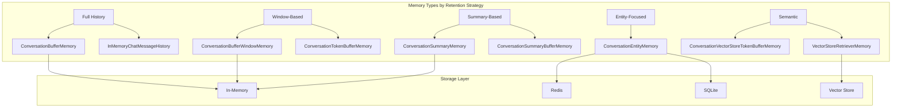

# Memory Systems in LangChain

## Overview

Memory systems are essential components that enable AI applications to maintain context across multiple interactions. Without memory, each conversation turn would start fresh—the model would have no recollection of previous messages, user preferences, or established context. This lesson explores LangChain's comprehensive memory architecture, from simple buffer-based approaches to sophisticated semantic retrieval systems.

We'll examine both the **legacy memory classes** (being deprecated in LangChain v1.0) and the **modern `RunnableWithMessageHistory` approach** that integrates seamlessly with LCEL (LangChain Expression Language). Understanding both paradigms is crucial: you'll encounter legacy code in existing projects while building new applications with the recommended patterns.

---

## What You'll Learn

This lesson covers the complete spectrum of memory management in LangChain:

| Topic | Description |
|-------|-------------|
| [Memory Concepts](./01-memory-concepts.md) | Why memory matters, types of memory, trade-offs, and architectural decisions |
| [Buffer Memory](./02-buffer-memory.md) | ConversationBufferMemory, BufferWindowMemory, and token-based limits |
| [Summary Memory](./03-summary-memory.md) | Automatic summarization, progressive compression, and hybrid approaches |
| [Entity Memory](./04-entity-memory.md) | Named entity extraction, relationship tracking, and persistent entity stores |
| [Vector Memory](./05-vector-memory.md) | Semantic search over conversation history, long-term memory retrieval |
| [Memory Integration](./06-memory-integration.md) | RunnableWithMessageHistory, LCEL patterns, multi-session management |

---

## Why Memory Matters

Consider these common scenarios where memory is essential:

```
User: "My name is Alex and I'm building a Python web app"
AI: "Hi Alex! I'd be happy to help with your Python web app..."

[Later in conversation]
User: "What framework should I use?"
AI: "For your Python web app, Alex, I'd recommend..."  ← Remembers context!
```

Without memory, the AI would respond:
```
AI: "Could you clarify what you're building?"  ← Lost all context
```

### 🔑 Key Memory Capabilities

| Capability | Business Impact |
|------------|-----------------|
| **Conversation Continuity** | Users don't repeat themselves; natural dialogue flow |
| **Personalization** | Track preferences, names, project details across sessions |
| **Context Preservation** | Complex multi-step tasks maintain coherence |
| **Knowledge Accumulation** | Build understanding over time, not just turns |
| **State Management** | Track workflow progress, pending actions, decisions made |

---

## Memory Architecture Overview

LangChain provides multiple memory implementations, each optimized for different use cases:



### Memory Selection Guide

| Conversation Length | Token Budget | Best Memory Type |
|--------------------|--------------|------------------|
| Short (< 10 turns) | Unlimited | ConversationBufferMemory |
| Medium (10-50 turns) | Limited | ConversationBufferWindowMemory |
| Long (50+ turns) | Limited | ConversationSummaryBufferMemory |
| Very Long + Recall | Limited | VectorStoreRetrieverMemory |
| Entity-Heavy | Any | ConversationEntityMemory |

---

## Legacy vs Modern Approach

> **Important:** LangChain is transitioning memory management. The legacy `BaseMemory` classes are deprecated as of v0.3.1 and will be removed in v1.0. New projects should use `RunnableWithMessageHistory`.

### Legacy Approach (Deprecated)

```python
# ⚠️ Legacy - works but being phased out
from langchain.memory import ConversationBufferMemory
from langchain.chains import ConversationChain

memory = ConversationBufferMemory()
chain = ConversationChain(llm=llm, memory=memory)
chain.invoke({"input": "Hello!"})
```

### Modern Approach (Recommended)

```python
# ✅ Modern - use for new projects
from langchain_core.chat_history import InMemoryChatMessageHistory
from langchain_core.runnables.history import RunnableWithMessageHistory

store = {}

def get_session_history(session_id: str):
    if session_id not in store:
        store[session_id] = InMemoryChatMessageHistory()
    return store[session_id]

chain_with_history = RunnableWithMessageHistory(
    runnable=llm,
    get_session_history=get_session_history,
)

# Session-based invocation
chain_with_history.invoke(
    "Hello!",
    config={"configurable": {"session_id": "user-123"}}
)
```

---

## Core Concepts Preview

### Memory Variables

Memory systems expose data through **memory variables**—named slots that inject context into prompts:

```python
memory.load_memory_variables({})
# Returns: {"history": "Human: Hi\nAI: Hello!"}

# Or with return_messages=True:
# Returns: {"history": [HumanMessage(...), AIMessage(...)]}
```

### Save Context Pattern

All memory types follow the save/load pattern:

```python
# Save after each interaction
memory.save_context(
    inputs={"input": "What's my name?"},
    outputs={"output": "Your name is Alex."}
)

# Load for next interaction
context = memory.load_memory_variables({})
```

### Message History Interface

The modern approach uses `BaseChatMessageHistory`:

```python
from langchain_core.chat_history import BaseChatMessageHistory

class BaseChatMessageHistory(ABC):
    messages: list[BaseMessage]  # Read messages
    
    def add_message(self, message: BaseMessage) -> None: ...
    def add_messages(self, messages: list[BaseMessage]) -> None: ...
    def clear(self) -> None: ...
```

---

## Prerequisites

Before diving into memory systems, ensure you understand:

- **LangChain Fundamentals** — Chains, prompts, and LLM integration
- **LCEL Basics** — Runnable interface and composition patterns  
- **Message Types** — HumanMessage, AIMessage, SystemMessage structure
- **Python Async** — Many memory operations have async variants

### Required Packages

```bash
pip install langchain langchain-core langchain-openai
pip install redis            # For Redis-backed persistence
pip install chromadb         # For vector memory
```

---

## Lesson Structure

Each sub-lesson follows a consistent pattern:

1. **Concept Introduction** — Why this memory type exists
2. **Implementation Details** — Code walkthrough with production patterns
3. **Configuration Options** — Key parameters and their effects
4. **Best Practices** — When to use, pitfalls to avoid
5. **Hands-on Exercise** — Build something practical

---

## Quick Start Example

Here's a complete example combining several concepts:

```python
"""Complete memory system example with session management."""
from langchain_openai import ChatOpenAI
from langchain_core.prompts import ChatPromptTemplate, MessagesPlaceholder
from langchain_core.chat_history import InMemoryChatMessageHistory
from langchain_core.runnables.history import RunnableWithMessageHistory

# Initialize LLM
llm = ChatOpenAI(model="gpt-4o-mini", temperature=0.7)

# Create prompt with history placeholder
prompt = ChatPromptTemplate.from_messages([
    ("system", "You are a helpful assistant. Use the conversation history to provide contextual responses."),
    MessagesPlaceholder(variable_name="history"),
    ("human", "{input}")
])

# Build the chain
chain = prompt | llm

# Session storage
session_store: dict[str, InMemoryChatMessageHistory] = {}

def get_session_history(session_id: str) -> InMemoryChatMessageHistory:
    """Retrieve or create session history."""
    if session_id not in session_store:
        session_store[session_id] = InMemoryChatMessageHistory()
    return session_store[session_id]

# Wrap with message history
chain_with_memory = RunnableWithMessageHistory(
    chain,
    get_session_history,
    input_messages_key="input",
    history_messages_key="history",
)

# Usage with different sessions
config_user_1 = {"configurable": {"session_id": "user-001"}}
config_user_2 = {"configurable": {"session_id": "user-002"}}

# User 1's conversation
response1 = chain_with_memory.invoke(
    {"input": "My name is Alice and I'm learning Python"},
    config=config_user_1
)
print(f"To Alice: {response1.content}")

# User 2's separate conversation
response2 = chain_with_memory.invoke(
    {"input": "I'm Bob, working on a JavaScript project"},
    config=config_user_2
)
print(f"To Bob: {response2.content}")

# User 1 continues (memory preserved)
response3 = chain_with_memory.invoke(
    {"input": "What language am I learning?"},
    config=config_user_1
)
print(f"Alice followup: {response3.content}")
# Output: "You mentioned you're learning Python!"
```

**Output:**
```
To Alice: Hi Alice! Welcome to Python learning...
To Bob: Hi Bob! JavaScript is a great choice...
Alice followup: You mentioned you're learning Python!
```

---

## Summary

Memory systems transform LLMs from stateless text generators into contextually-aware assistants. Key takeaways:

✅ **Memory enables continuity** — Conversations flow naturally across turns  
✅ **Multiple strategies exist** — Buffer, window, summary, entity, and vector-based  
✅ **Trade-offs matter** — Token usage vs context retention vs latency  
✅ **Modern approach preferred** — Use `RunnableWithMessageHistory` for new projects  
✅ **Persistence is configurable** — In-memory, Redis, SQLite, or custom backends

**Next:** [Memory Concepts](./01-memory-concepts.md) — Deep dive into why memory matters and how to choose the right approach.

---

## Further Reading

- [LangChain Memory Migration Guide](https://python.langchain.com/docs/versions/migrating_memory/)
- [RunnableWithMessageHistory Documentation](https://python.langchain.com/docs/how_to/message_history/)
- [Chat History Concepts](https://python.langchain.com/docs/concepts/#chat-history)
- [LangGraph Memory Patterns](https://langchain-ai.github.io/langgraph/how-tos/memory/)

---

<!-- 
Sources Consulted:
- LangChain GitHub: langchain_classic/memory/__init__.py
- LangChain GitHub: langchain_core/runnables/history.py
- LangChain GitHub: langchain_core/chat_history.py
- LangChain Memory Migration: https://python.langchain.com/docs/versions/migrating_memory/
-->
