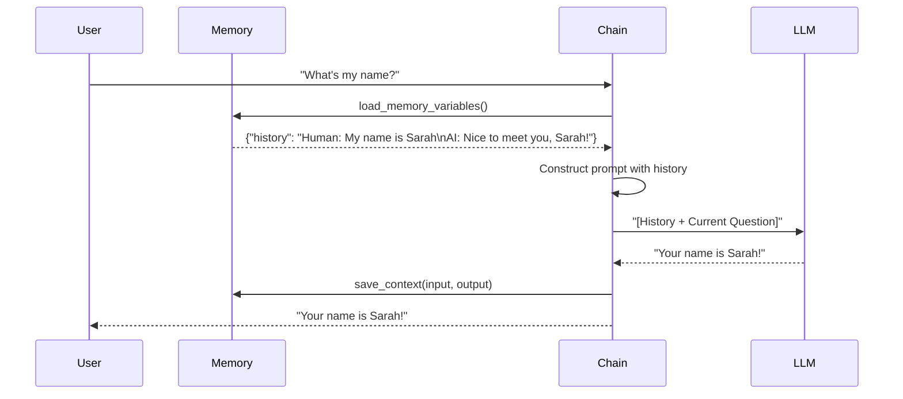
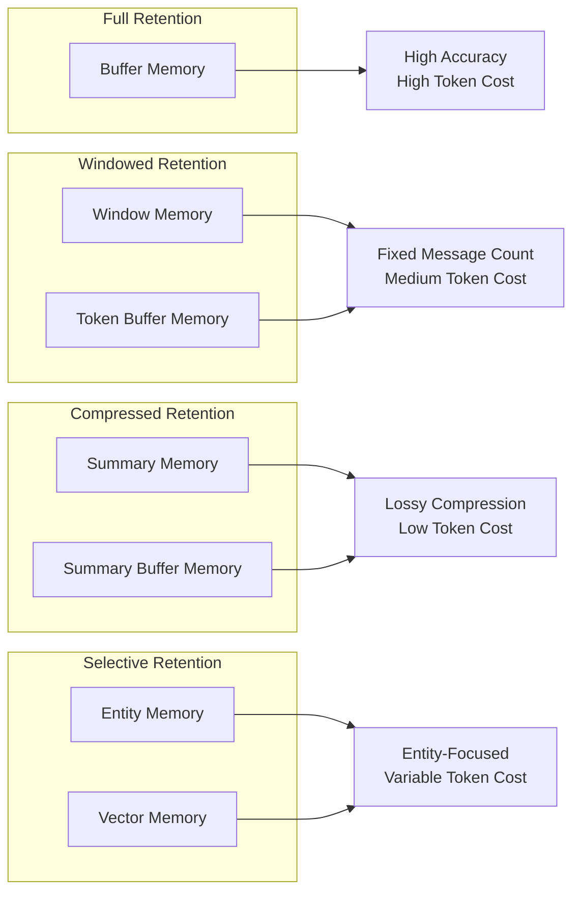
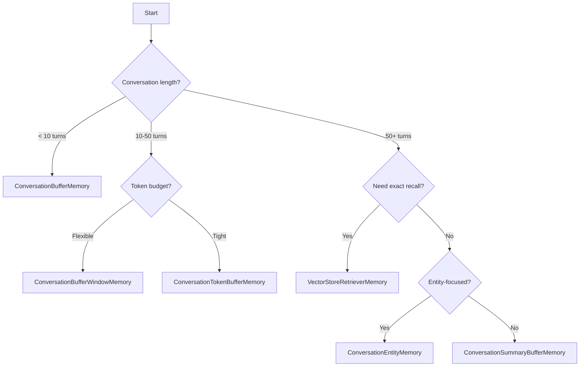

# Memory Concepts: Foundations of Conversational Context

## Introduction

Large Language Models are fundamentally **stateless**—each API call is an isolated event with no inherent connection to previous interactions. The model doesn't "remember" your last conversation; it simply processes whatever text you send in the current request. This design is intentional: it makes LLMs scalable, predictable, and privacy-conscious. But it creates a significant challenge for building conversational applications.

Memory systems bridge this gap by explicitly managing conversation history and injecting relevant context into each new request. Understanding *why* memory works the way it does—and the trade-offs involved—is essential before implementing any specific memory type.

### What We'll Cover

- Why LLMs are stateless and what that means
- How memory systems actually work under the hood
- Types of memory and when to use each
- Token economics and context window management
- Architectural patterns for production memory systems
- Common pitfalls and how to avoid them

### Prerequisites

- Understanding of LangChain chains and prompts
- Familiarity with LLM API concepts (tokens, context windows)
- Basic Python async patterns

---

## Why LLMs Are Stateless

Every time you call an LLM API, you're making a **fresh request**. The model has no database tracking your previous conversations, no session cookies, no user profiles. It receives text, generates text, and forgets everything immediately.

```python
from langchain_openai import ChatOpenAI

llm = ChatOpenAI(model="gpt-4o-mini")

# First call
response1 = llm.invoke("My name is Sarah")
print(response1.content)
# "Hello Sarah! Nice to meet you!"

# Second call - completely independent
response2 = llm.invoke("What's my name?")
print(response2.content)
# "I don't have access to personal information about you..."
```

**Output:**
```
Hello Sarah! Nice to meet you!
I don't have access to personal information about you...
```

The model genuinely doesn't know Sarah's name in the second call—it never received that information. This is the fundamental problem memory solves.

### Why Statelessness Is Actually Good

| Benefit | Explanation |
|---------|-------------|
| **Scalability** | Any server can handle any request; no session affinity required |
| **Privacy** | Nothing persists unless you explicitly save it |
| **Predictability** | Same input always produces deterministic-ish output |
| **Simplicity** | No complex state synchronization across infrastructure |
| **Cost Control** | You pay for exactly what you send, nothing hidden |

Understanding these benefits helps you appreciate that memory is a **trade-off**, not a free upgrade. Every memory strategy involves costs in tokens, latency, complexity, or storage.

---

## How Memory Actually Works

Memory in LangChain doesn't use any special LLM features—it's purely **prompt engineering**. The memory system constructs a prompt that includes previous conversation history, making it *appear* that the model remembers.



### The Prompt Under the Hood

When you use memory, your prompt actually looks like this:

```text
System: You are a helpful assistant.

Previous conversation:
Human: My name is Sarah
AI: Nice to meet you, Sarah!

Current question:
Human: What's my name?
```

The model sees the full history and can reference it. This is the entire mechanism—there's no magic, just strategic prompt construction.

### The Save/Load Pattern

All memory implementations follow a consistent interface:

```python
from langchain.memory import ConversationBufferMemory

memory = ConversationBufferMemory()

# After each interaction, SAVE the context
memory.save_context(
    inputs={"input": "My name is Sarah"},
    outputs={"output": "Nice to meet you, Sarah!"}
)

# Before the next interaction, LOAD the variables
context = memory.load_memory_variables({})
print(context)
```

**Output:**
```python
{'history': 'Human: My name is Sarah\nAI: Nice to meet you, Sarah!'}
```

This `history` string gets injected into the prompt template via the `memory_key` parameter.

---

## Types of Memory

LangChain provides several memory types, each with distinct trade-offs:

### Classification by Retention Strategy



### Memory Type Comparison

| Memory Type | Retention | Token Usage | Latency | Use Case |
|-------------|-----------|-------------|---------|----------|
| **ConversationBufferMemory** | Everything | High (grows unbounded) | Low | Short conversations, debugging |
| **ConversationBufferWindowMemory** | Last k messages | Medium (fixed) | Low | Medium conversations |
| **ConversationTokenBufferMemory** | Messages within token limit | Medium (capped) | Low | Token-budget conscious |
| **ConversationSummaryMemory** | Summarized history | Low (compressed) | High (LLM call) | Long conversations |
| **ConversationSummaryBufferMemory** | Recent + summarized older | Medium | Medium | Best of both worlds |
| **ConversationEntityMemory** | Extracted entities | Variable | High | Entity-heavy dialogues |
| **VectorStoreRetrieverMemory** | Semantically relevant | Variable | High | Very long histories |

### Choosing the Right Memory Type

Use this decision tree:



---

## Token Economics

Context windows have limits. Every model has a maximum number of tokens it can process in a single request. Memory directly competes with your prompt, system instructions, and desired output length.

### Token Budget Allocation

```text
┌─────────────────────────────────────────────┐
│              Context Window                  │
│              (e.g., 128k tokens)             │
├──────────────┬──────────────┬───────────────┤
│   System     │   Memory     │    Output     │
│  Prompt      │   History    │    Space      │
│  (~500)      │  (variable)  │   (~4000)     │
├──────────────┴──────────────┴───────────────┤
│              User Input                      │
│             (variable)                       │
└─────────────────────────────────────────────┘
```

### Real-World Token Calculations

```python
import tiktoken

def count_tokens(text: str, model: str = "gpt-4o") -> int:
    """Count tokens for a given text."""
    encoding = tiktoken.encoding_for_model(model)
    return len(encoding.encode(text))

# Example conversation
conversation = """
Human: My name is Sarah and I'm building a Python web application for my startup.
AI: Hello Sarah! That sounds exciting. What kind of web application are you building?
Human: It's an e-commerce platform with AI-powered product recommendations.
AI: Great choice! E-commerce with AI recommendations is a powerful combination. Are you using any specific framework?
Human: I'm using FastAPI for the backend and React for the frontend.
AI: Excellent stack! FastAPI is great for AI integration due to its async capabilities and easy API documentation.
"""

tokens = count_tokens(conversation)
print(f"Conversation tokens: {tokens}")
print(f"Percentage of 128k context: {tokens / 128000 * 100:.2f}%")
```

**Output:**
```
Conversation tokens: 127
Percentage of 128k context: 0.10%
```

This seems small, but conversations grow quickly. After 100 exchanges, you might use 10,000+ tokens just for history.

### Token Growth Patterns

| Memory Type | Growth Pattern | After 100 Turns |
|-------------|----------------|-----------------|
| Buffer | Linear (unbounded) | ~10,000 tokens |
| Window (k=10) | Constant (capped) | ~2,000 tokens |
| Token Buffer (2000) | Constant (capped) | 2,000 tokens |
| Summary | Logarithmic | ~500 tokens |
| Summary Buffer | Sub-linear | ~1,500 tokens |

---

## Memory Architecture Patterns

### Pattern 1: Simple In-Memory (Development)

```python
"""In-memory pattern - data lost on restart."""
from langchain.memory import ConversationBufferMemory
from langchain.chains import ConversationChain
from langchain_openai import ChatOpenAI

# Simple setup - no persistence
memory = ConversationBufferMemory()
chain = ConversationChain(
    llm=ChatOpenAI(model="gpt-4o-mini"),
    memory=memory,
    verbose=True
)

response = chain.invoke({"input": "Hello, I'm Alex"})
```

**Use for:** Prototyping, testing, single-session applications

### Pattern 2: Session-Based with Factory (Production)

```python
"""Session-based pattern with factory function."""
from langchain_core.chat_history import InMemoryChatMessageHistory
from langchain_core.runnables.history import RunnableWithMessageHistory
from langchain_openai import ChatOpenAI

# Session store (would be Redis/database in production)
session_store: dict[str, InMemoryChatMessageHistory] = {}

def get_session_history(session_id: str) -> InMemoryChatMessageHistory:
    """Factory function for session histories."""
    if session_id not in session_store:
        session_store[session_id] = InMemoryChatMessageHistory()
    return session_store[session_id]

llm = ChatOpenAI(model="gpt-4o-mini")

chain_with_memory = RunnableWithMessageHistory(
    llm,
    get_session_history,
)

# User 1's session
config_1 = {"configurable": {"session_id": "user-001"}}
response = chain_with_memory.invoke("I'm working on NLP", config=config_1)

# User 2's separate session
config_2 = {"configurable": {"session_id": "user-002"}}
response = chain_with_memory.invoke("I'm doing computer vision", config=config_2)
```

**Use for:** Multi-user applications, web servers, APIs

### Pattern 3: Persistent Storage (Production)

```python
"""Persistent pattern with Redis backend."""
from langchain_community.chat_message_histories import RedisChatMessageHistory
from langchain_core.runnables.history import RunnableWithMessageHistory
from langchain_openai import ChatOpenAI

def get_redis_history(session_id: str) -> RedisChatMessageHistory:
    """Factory function for Redis-backed histories."""
    return RedisChatMessageHistory(
        session_id=session_id,
        url="redis://localhost:6379",
        ttl=3600  # 1 hour expiration
    )

llm = ChatOpenAI(model="gpt-4o-mini")

chain_with_memory = RunnableWithMessageHistory(
    llm,
    get_redis_history,
)

# History persists across application restarts
config = {"configurable": {"session_id": "persistent-user-001"}}
response = chain_with_memory.invoke("Remember this conversation!", config=config)
```

**Use for:** Production systems requiring durability and horizontal scaling

### Pattern 4: Multi-Key Sessions (Advanced)

```python
"""Multi-key session pattern for complex session identifiers."""
from langchain_core.chat_history import InMemoryChatMessageHistory
from langchain_core.runnables.history import RunnableWithMessageHistory
from langchain_core.runnables import ConfigurableFieldSpec
from langchain_openai import ChatOpenAI

# Store keyed by user_id + conversation_id
store: dict[tuple[str, str], InMemoryChatMessageHistory] = {}

def get_history(user_id: str, conversation_id: str) -> InMemoryChatMessageHistory:
    """Get history for specific user and conversation."""
    key = (user_id, conversation_id)
    if key not in store:
        store[key] = InMemoryChatMessageHistory()
    return store[key]

llm = ChatOpenAI(model="gpt-4o-mini")

chain_with_memory = RunnableWithMessageHistory(
    llm,
    get_history,
    history_factory_config=[
        ConfigurableFieldSpec(
            id="user_id",
            annotation=str,
            name="User ID",
            description="Unique user identifier",
        ),
        ConfigurableFieldSpec(
            id="conversation_id",
            annotation=str,
            name="Conversation ID",
            description="Unique conversation identifier",
        ),
    ],
)

# Same user, different conversations
config = {"configurable": {"user_id": "alice", "conversation_id": "project-1"}}
response = chain_with_memory.invoke("Working on project 1", config=config)

config = {"configurable": {"user_id": "alice", "conversation_id": "project-2"}}
response = chain_with_memory.invoke("Working on project 2", config=config)
```

**Use for:** Applications where users have multiple concurrent conversations

---

## Memory Interface Deep Dive

### The BaseMemory Interface

All legacy memory classes inherit from `BaseMemory`:

```python
from abc import ABC, abstractmethod
from typing import Any

class BaseMemory(ABC):
    """Abstract base class for memory."""
    
    @property
    @abstractmethod
    def memory_variables(self) -> list[str]:
        """Return the keys this memory will inject into prompts."""
        pass
    
    @abstractmethod
    def load_memory_variables(self, inputs: dict[str, Any]) -> dict[str, Any]:
        """Load memory variables for prompt injection."""
        pass
    
    @abstractmethod
    def save_context(self, inputs: dict[str, Any], outputs: dict[str, str]) -> None:
        """Save context after an interaction."""
        pass
    
    def clear(self) -> None:
        """Clear memory contents."""
        pass
```

### The BaseChatMessageHistory Interface

The modern approach uses message histories:

```python
from abc import ABC, abstractmethod
from langchain_core.messages import BaseMessage

class BaseChatMessageHistory(ABC):
    """Abstract base class for chat message history."""
    
    @property
    @abstractmethod
    def messages(self) -> list[BaseMessage]:
        """Retrieve all messages."""
        pass
    
    def add_message(self, message: BaseMessage) -> None:
        """Add a single message."""
        self.add_messages([message])
    
    @abstractmethod
    def add_messages(self, messages: list[BaseMessage]) -> None:
        """Add multiple messages."""
        pass
    
    @abstractmethod
    def clear(self) -> None:
        """Clear all messages."""
        pass
```

### Implementation Example

```python
from langchain_core.chat_history import InMemoryChatMessageHistory
from langchain_core.messages import HumanMessage, AIMessage

# Create history
history = InMemoryChatMessageHistory()

# Add messages
history.add_message(HumanMessage(content="Hello!"))
history.add_message(AIMessage(content="Hi there!"))

# Retrieve all messages
for msg in history.messages:
    print(f"{msg.type}: {msg.content}")

# Clear history
history.clear()
print(f"Messages after clear: {len(history.messages)}")
```

**Output:**
```
human: Hello!
ai: Hi there!
Messages after clear: 0
```

---

## Common Pitfalls

### ❌ Pitfall 1: Unbounded Memory Growth

```python
# BAD: Memory grows forever, eventually exceeding context limit
memory = ConversationBufferMemory()

for i in range(1000):
    memory.save_context(
        {"input": f"Message {i}" * 100},  # Long messages
        {"output": f"Response {i}" * 100}
    )
# Eventually: Context length exceeded!
```

**✅ Solution:** Use windowed or summary memory for long conversations.

### ❌ Pitfall 2: Memory Key Mismatch

```python
# BAD: Memory key doesn't match prompt variable
memory = ConversationBufferMemory(memory_key="chat_history")

prompt = PromptTemplate.from_template("""
Previous: {history}  # Wrong key!
Human: {input}
""")
# Result: history variable is empty
```

**✅ Solution:** Ensure `memory_key` matches the prompt variable name.

### ❌ Pitfall 3: Forgetting to Save Context

```python
# BAD: Manual chain without auto-save
memory = ConversationBufferMemory()
context = memory.load_memory_variables({})

response = llm.invoke(f"{context}\nHuman: Hello")
# Forgot to save! Next turn loses this exchange.
```

**✅ Solution:** Use `RunnableWithMessageHistory` which auto-saves, or explicitly call `save_context()`.

### ❌ Pitfall 4: Session ID Collisions

```python
# BAD: Using predictable session IDs
def get_history(session_id: str):
    return histories.get(session_id)

# If someone guesses session_id="user-1", they see that user's history!
```

**✅ Solution:** Use cryptographically random session IDs (UUIDs).

```python
import uuid

session_id = str(uuid.uuid4())  # e.g., "550e8400-e29b-41d4-a716-446655440000"
```

---

## Best Practices

| Practice | Why It Matters |
|----------|----------------|
| **Use `RunnableWithMessageHistory`** | Modern approach, auto-saves, LCEL compatible |
| **Set reasonable limits** | Prevent context overflow and cost explosion |
| **Use async when possible** | Memory operations can be I/O bound |
| **Implement TTL for sessions** | Don't store history forever |
| **Monitor token usage** | Track memory contribution to total tokens |
| **Test edge cases** | Empty history, very long messages, special characters |

---

## Hands-on Exercise

### Your Task

Build a memory system that:
1. Tracks conversation history per user
2. Limits history to the last 5 exchanges
3. Logs the token count of history before each LLM call
4. Gracefully handles new users (empty history)

### Requirements

1. Use `RunnableWithMessageHistory` pattern
2. Implement a custom history class that limits messages
3. Add token counting before each call
4. Test with at least 2 different "users"

### Expected Behavior

```python
# User 1's first message
chain.invoke("I'm Alex", config={"configurable": {"session_id": "user-1"}})
# History tokens: 0

# User 1's sixth message (should only have last 5)
chain.invoke("Sixth message", config={"configurable": {"session_id": "user-1"}})
# History tokens: ~500 (only 5 exchanges, not 6)
```

<details>
<summary>💡 Hints (click to expand)</summary>

- Subclass `InMemoryChatMessageHistory` to add message limiting
- Use `tiktoken` for token counting
- Override `add_messages` to enforce the limit
- Create a wrapper runnable for logging

</details>

<details>
<summary>✅ Solution (click to expand)</summary>

```python
"""Memory system with limits and monitoring."""
import tiktoken
from langchain_core.chat_history import InMemoryChatMessageHistory
from langchain_core.messages import BaseMessage
from langchain_core.runnables.history import RunnableWithMessageHistory
from langchain_core.runnables import RunnableLambda
from langchain_openai import ChatOpenAI


class LimitedChatHistory(InMemoryChatMessageHistory):
    """Chat history that limits stored messages."""
    
    def __init__(self, max_messages: int = 10):
        super().__init__()
        self.max_messages = max_messages
    
    def add_messages(self, messages: list[BaseMessage]) -> None:
        """Add messages, keeping only the most recent."""
        super().add_messages(messages)
        # Trim to limit (keep most recent)
        if len(self.messages) > self.max_messages:
            # Keep system messages + most recent
            self.messages = self.messages[-self.max_messages:]


def count_message_tokens(messages: list[BaseMessage], model: str = "gpt-4o") -> int:
    """Count tokens in a list of messages."""
    encoding = tiktoken.encoding_for_model(model)
    total = 0
    for msg in messages:
        total += len(encoding.encode(msg.content))
        total += 4  # Overhead for message structure
    return total


# Session store with limited histories
store: dict[str, LimitedChatHistory] = {}


def get_limited_history(session_id: str) -> LimitedChatHistory:
    """Get or create limited history for session."""
    if session_id not in store:
        store[session_id] = LimitedChatHistory(max_messages=10)  # 5 exchanges = 10 messages
    return store[session_id]


def log_and_invoke(inputs: dict) -> dict:
    """Log token count before passing through."""
    session_id = inputs.get("session_id", "unknown")
    if session_id in store:
        tokens = count_message_tokens(store[session_id].messages)
        print(f"[Session {session_id}] History tokens: {tokens}")
    else:
        print(f"[Session {session_id}] History tokens: 0 (new session)")
    return inputs


# Build the chain
llm = ChatOpenAI(model="gpt-4o-mini")

chain_with_memory = RunnableWithMessageHistory(
    llm,
    get_limited_history,
)


# Test function
def chat(message: str, session_id: str) -> str:
    """Send a message and get response."""
    # Log tokens before call
    if session_id in store:
        tokens = count_message_tokens(store[session_id].messages)
        print(f"[Session {session_id}] History tokens: {tokens}")
    else:
        print(f"[Session {session_id}] History tokens: 0 (new session)")
    
    config = {"configurable": {"session_id": session_id}}
    response = chain_with_memory.invoke(message, config=config)
    return response.content


# Test with multiple users
print("=== User 1 ===")
for i in range(7):
    response = chat(f"Message {i} from Alex", "user-1")
    print(f"Response: {response[:50]}...")

print("\n=== User 2 ===")
response = chat("I'm Bob, completely different user", "user-2")
print(f"Response: {response[:50]}...")

print("\n=== User 1 again ===")
response = chat("What number message was my first?", "user-1")
print(f"Response: {response[:50]}...")
# Note: First messages may be forgotten due to limit!
```

</details>

### Bonus Challenges

- [ ] Add automatic summarization when history exceeds limit
- [ ] Implement Redis-backed history for persistence
- [ ] Create a dashboard showing all active sessions and their token usage

---

## Summary

Memory systems transform stateless LLM calls into contextual conversations by explicitly managing and injecting history. Key takeaways:

✅ **LLMs are inherently stateless** — Memory is prompt engineering, not magic  
✅ **Multiple strategies exist** — Each optimized for different conversation patterns  
✅ **Token economics matter** — History competes with prompts and outputs for context  
✅ **Production requires persistence** — In-memory is fine for development only  
✅ **Use modern patterns** — `RunnableWithMessageHistory` is the recommended approach  
✅ **Monitor and limit** — Unbounded memory causes failures and cost overruns

**Next:** [Buffer Memory](./02-buffer-memory.md) — Deep dive into ConversationBufferMemory, BufferWindowMemory, and TokenBufferMemory implementations.

---

## Further Reading

- [LangChain Memory Concepts](https://python.langchain.com/docs/concepts/#memory)
- [RunnableWithMessageHistory](https://python.langchain.com/docs/how_to/message_history/)
- [Context Window Limits by Model](https://platform.openai.com/docs/models)
- [tiktoken: Token Counting Library](https://github.com/openai/tiktoken)

---

<!-- 
Sources Consulted:
- LangChain GitHub: langchain_classic/base_memory.py
- LangChain GitHub: langchain_core/chat_history.py
- LangChain GitHub: langchain_core/runnables/history.py
- OpenAI tiktoken documentation
-->