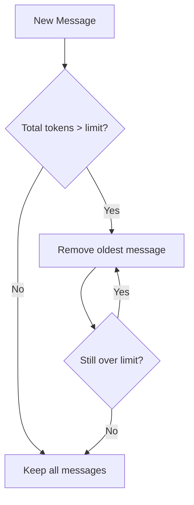
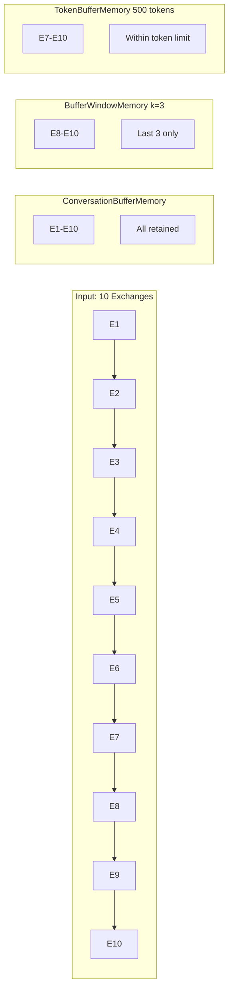

# Buffer Memory: Complete Conversation Storage

## Introduction

Buffer memory represents the simplest and most intuitive approach to conversation memory—store everything. Every message exchanged between the user and AI is preserved in sequential order, providing complete context for each new interaction. While straightforward, this approach has significant implications for token usage and context window management.

This lesson covers three buffer-based memory types:

| Memory Type | Strategy | Key Parameter |
|-------------|----------|---------------|
| **ConversationBufferMemory** | Store all messages | None (unbounded) |
| **ConversationBufferWindowMemory** | Store last k exchanges | `k` (message pairs) |
| **ConversationTokenBufferMemory** | Store within token limit | `max_token_limit` |

### What We'll Cover

- Full buffer memory implementation and configuration
- Sliding window memory for fixed-size history
- Token-based memory management
- Format options: string vs message objects
- Migration to modern `RunnableWithMessageHistory` patterns
- Production considerations and best practices

### Prerequisites

- Understanding of [Memory Concepts](./01-memory-concepts.md)
- LangChain chain basics
- Familiarity with token counting

---

## ConversationBufferMemory

`ConversationBufferMemory` stores the complete conversation history. Every exchange is preserved and injected into subsequent prompts.

### Basic Usage

```python
from langchain.memory import ConversationBufferMemory
from langchain.chains import ConversationChain
from langchain_openai import ChatOpenAI

# Create memory instance
memory = ConversationBufferMemory()

# Create chain with memory
llm = ChatOpenAI(model="gpt-4o-mini", temperature=0.7)
chain = ConversationChain(llm=llm, memory=memory, verbose=True)

# Have a conversation
response1 = chain.invoke({"input": "Hi, I'm Alex and I'm learning Python"})
print(response1["response"])

response2 = chain.invoke({"input": "What programming language am I learning?"})
print(response2["response"])
```

**Output:**
```
Hello Alex! It's great to meet you. Python is an excellent choice...
You're learning Python! It's a versatile language perfect for beginners...
```

### Configuration Options

| Parameter | Type | Default | Description |
|-----------|------|---------|-------------|
| `memory_key` | str | `"history"` | Variable name for prompt injection |
| `input_key` | str | `None` | Key for user input (auto-detected if one input) |
| `output_key` | str | `None` | Key for AI output (auto-detected if one output) |
| `human_prefix` | str | `"Human"` | Prefix for user messages in string format |
| `ai_prefix` | str | `"AI"` | Prefix for AI messages in string format |
| `return_messages` | bool | `False` | Return Message objects instead of string |

### String Format vs Message Format

By default, buffer memory returns history as a formatted string:

```python
# Default: String format
memory = ConversationBufferMemory()
memory.save_context(
    {"input": "Hello!"},
    {"output": "Hi there! How can I help?"}
)

context = memory.load_memory_variables({})
print(context)
```

**Output (String Format):**
```python
{'history': 'Human: Hello!\nAI: Hi there! How can I help?'}
```

For chat models, you typically want message objects:

```python
# Message format for chat models
memory = ConversationBufferMemory(return_messages=True)
memory.save_context(
    {"input": "Hello!"},
    {"output": "Hi there! How can I help?"}
)

context = memory.load_memory_variables({})
print(context)
```

**Output (Message Format):**
```python
{'history': [HumanMessage(content='Hello!'), AIMessage(content='Hi there! How can I help?')]}
```

> **Tip:** Use `return_messages=True` with chat models (ChatOpenAI, ChatAnthropic) for proper message structure.

### Custom Prefixes

```python
# Customize the conversation format
memory = ConversationBufferMemory(
    human_prefix="User",
    ai_prefix="Assistant",
    memory_key="chat_history"  # Custom variable name
)

memory.save_context(
    {"input": "What's 2+2?"},
    {"output": "2+2 equals 4."}
)

print(memory.load_memory_variables({}))
```

**Output:**
```python
{'chat_history': 'User: What\'s 2+2?\nAssistant: 2+2 equals 4.'}
```

### Accessing the Buffer Directly

```python
memory = ConversationBufferMemory(return_messages=True)
memory.save_context({"input": "Hello"}, {"output": "Hi!"})
memory.save_context({"input": "How are you?"}, {"output": "I'm doing well!"})

# Access underlying chat memory
print(f"Total messages: {len(memory.chat_memory.messages)}")

# Iterate through messages
for msg in memory.chat_memory.messages:
    print(f"{msg.type}: {msg.content}")

# Clear all history
memory.clear()
print(f"After clear: {len(memory.chat_memory.messages)}")
```

**Output:**
```
Total messages: 4
human: Hello
ai: Hi!
human: How are you?
ai: I'm doing well!
After clear: 0
```

---

## ConversationBufferWindowMemory

This memory type maintains a **sliding window** of the most recent exchanges. Older messages are automatically discarded, keeping context size predictable.

### Basic Usage

```python
from langchain.memory import ConversationBufferWindowMemory

# Keep only last 3 exchanges (6 messages: 3 human + 3 AI)
memory = ConversationBufferWindowMemory(k=3, return_messages=True)

# Add 5 exchanges
for i in range(5):
    memory.save_context(
        {"input": f"Message {i+1}"},
        {"output": f"Response {i+1}"}
    )

# Check what's retained
context = memory.load_memory_variables({})
for msg in context["history"]:
    print(f"{msg.type}: {msg.content}")
```

**Output:**
```
human: Message 3
ai: Response 3
human: Message 4
ai: Response 4
human: Message 5
ai: Response 5
```

Messages 1-2 were automatically discarded to maintain the window of 3 exchanges.

### The `k` Parameter

The `k` parameter specifies **exchange pairs**, not individual messages:

| k value | Human Messages | AI Messages | Total Messages |
|---------|----------------|-------------|----------------|
| 1 | 1 | 1 | 2 |
| 3 | 3 | 3 | 6 |
| 5 | 5 | 5 | 10 |
| 10 | 10 | 10 | 20 |

### Configuration

```python
memory = ConversationBufferWindowMemory(
    k=5,                          # Last 5 exchanges
    memory_key="recent_history",  # Custom key
    return_messages=True,         # Message objects
    human_prefix="Customer",      # Custom prefix
    ai_prefix="Agent"             # Custom prefix
)
```

### When to Use Window Memory

| Scenario | Recommendation |
|----------|----------------|
| Support chat with 10-20 turn conversations | k=5 to k=10 |
| Quick Q&A sessions | k=2 to k=3 |
| Tutorial/walkthrough assistance | k=10+ |
| Simple command interface | k=1 |

---

## ConversationTokenBufferMemory

Token buffer memory provides more precise control by limiting history based on **token count** rather than message count. This is essential when you need predictable context window usage.

### Basic Usage

```python
from langchain.memory import ConversationTokenBufferMemory
from langchain_openai import ChatOpenAI

llm = ChatOpenAI(model="gpt-4o-mini")

# Limit to 200 tokens of history
memory = ConversationTokenBufferMemory(
    llm=llm,  # Required for token counting
    max_token_limit=200,
    return_messages=True
)

# Add messages
memory.save_context(
    {"input": "Tell me a long story about a dragon."},
    {"output": "Once upon a time, in a mystical land far beyond the mountains, there lived a magnificent dragon named Ember. Ember had scales that shimmered like rubies in the sunlight and wings that could span an entire valley. The dragon was known throughout the kingdom for its wisdom and gentle nature, despite its fearsome appearance."}
)

memory.save_context(
    {"input": "What was the dragon's name?"},
    {"output": "The dragon's name was Ember."}
)

# Check token usage
context = memory.load_memory_variables({})
print(f"Messages retained: {len(context['history'])}")
```

**Output:**
```
Messages retained: 2
```

The long story may be pruned to fit within the 200 token limit.

### How Token Pruning Works



Messages are removed from the **beginning** of the conversation until the total fits within `max_token_limit`.

### Configuration

```python
memory = ConversationTokenBufferMemory(
    llm=llm,                    # Required - used for tokenization
    max_token_limit=2000,       # Token budget for history
    memory_key="history",       # Prompt variable name
    return_messages=True,       # Message objects vs string
    human_prefix="Human",       # String format prefix
    ai_prefix="AI"              # String format prefix
)
```

> **Important:** The `llm` parameter is **required** because token counting is model-specific. Different models use different tokenizers.

### Token Budgeting Strategy

```python
"""Strategic token budget allocation."""
from langchain.memory import ConversationTokenBufferMemory
from langchain_openai import ChatOpenAI
import tiktoken

# Context window analysis
MODEL = "gpt-4o-mini"
CONTEXT_WINDOW = 128_000  # 128k for gpt-4o-mini

# Budget allocation
SYSTEM_PROMPT_TOKENS = 500
MAX_OUTPUT_TOKENS = 4_000
SAFETY_MARGIN = 1_000
CURRENT_INPUT_ESTIMATE = 500

# Calculate history budget
history_budget = (
    CONTEXT_WINDOW 
    - SYSTEM_PROMPT_TOKENS 
    - MAX_OUTPUT_TOKENS 
    - SAFETY_MARGIN 
    - CURRENT_INPUT_ESTIMATE
)

print(f"History token budget: {history_budget:,}")

# Create memory with calculated budget
llm = ChatOpenAI(model=MODEL)
memory = ConversationTokenBufferMemory(
    llm=llm,
    max_token_limit=history_budget,
    return_messages=True
)
```

**Output:**
```
History token budget: 122,000
```

---

## Modern Approach: RunnableWithMessageHistory

The legacy memory classes are being deprecated. Here's how to achieve equivalent functionality with the modern pattern:

### Buffer Memory Equivalent

```python
"""Modern equivalent of ConversationBufferMemory."""
from langchain_core.chat_history import InMemoryChatMessageHistory
from langchain_core.runnables.history import RunnableWithMessageHistory
from langchain_core.prompts import ChatPromptTemplate, MessagesPlaceholder
from langchain_openai import ChatOpenAI

# Session store
store: dict[str, InMemoryChatMessageHistory] = {}

def get_session_history(session_id: str) -> InMemoryChatMessageHistory:
    if session_id not in store:
        store[session_id] = InMemoryChatMessageHistory()
    return store[session_id]

# Build chain
llm = ChatOpenAI(model="gpt-4o-mini")
prompt = ChatPromptTemplate.from_messages([
    ("system", "You are a helpful assistant."),
    MessagesPlaceholder(variable_name="history"),
    ("human", "{input}")
])

chain = prompt | llm

# Wrap with history
chain_with_memory = RunnableWithMessageHistory(
    chain,
    get_session_history,
    input_messages_key="input",
    history_messages_key="history"
)

# Use it
config = {"configurable": {"session_id": "user-123"}}

response = chain_with_memory.invoke(
    {"input": "I'm Alex, learning Python"},
    config=config
)
print(response.content)

response = chain_with_memory.invoke(
    {"input": "What's my name?"},
    config=config
)
print(response.content)
```

### Window Memory Equivalent

```python
"""Modern equivalent of ConversationBufferWindowMemory."""
from langchain_core.chat_history import InMemoryChatMessageHistory
from langchain_core.messages import BaseMessage

class WindowedChatHistory(InMemoryChatMessageHistory):
    """Chat history with sliding window."""
    
    def __init__(self, k: int = 5):
        super().__init__()
        self.k = k  # Number of exchange pairs to keep
    
    def add_messages(self, messages: list[BaseMessage]) -> None:
        super().add_messages(messages)
        # Keep only last k*2 messages (k exchanges)
        max_messages = self.k * 2
        if len(self.messages) > max_messages:
            self.messages = self.messages[-max_messages:]


# Session store with windowed histories
store: dict[str, WindowedChatHistory] = {}

def get_windowed_history(session_id: str) -> WindowedChatHistory:
    if session_id not in store:
        store[session_id] = WindowedChatHistory(k=5)
    return store[session_id]

# Use with RunnableWithMessageHistory as before
chain_with_memory = RunnableWithMessageHistory(
    chain,
    get_windowed_history,
    input_messages_key="input",
    history_messages_key="history"
)
```

### Token Buffer Memory Equivalent

```python
"""Modern equivalent of ConversationTokenBufferMemory."""
import tiktoken
from langchain_core.chat_history import InMemoryChatMessageHistory
from langchain_core.messages import BaseMessage

class TokenLimitedChatHistory(InMemoryChatMessageHistory):
    """Chat history with token limit."""
    
    def __init__(self, max_tokens: int = 2000, model: str = "gpt-4o"):
        super().__init__()
        self.max_tokens = max_tokens
        self.encoding = tiktoken.encoding_for_model(model)
    
    def _count_tokens(self, messages: list[BaseMessage]) -> int:
        """Count tokens in messages."""
        total = 0
        for msg in messages:
            total += len(self.encoding.encode(msg.content))
            total += 4  # Message overhead
        return total
    
    def add_messages(self, messages: list[BaseMessage]) -> None:
        super().add_messages(messages)
        
        # Prune from beginning until under limit
        while (
            len(self.messages) > 0 
            and self._count_tokens(self.messages) > self.max_tokens
        ):
            self.messages.pop(0)


# Session store
store: dict[str, TokenLimitedChatHistory] = {}

def get_token_limited_history(session_id: str) -> TokenLimitedChatHistory:
    if session_id not in store:
        store[session_id] = TokenLimitedChatHistory(max_tokens=2000)
    return store[session_id]
```

---

## Comparing Buffer Memory Types

### Visual Comparison



### Decision Matrix

| Factor | Buffer | Window | Token Buffer |
|--------|--------|--------|--------------|
| **Predictable size** | ❌ | ✅ | ✅ |
| **Exact context** | ✅ | ✅ | ✅ |
| **Token control** | ❌ | ❌ | ✅ |
| **Simple setup** | ✅ | ✅ | ⚠️ (needs LLM) |
| **Best for** | Short chats | Medium chats | Token budgets |

---

## Best Practices

| Practice | Why It Matters |
|----------|----------------|
| **Start with window memory** | Safest default; prevents unbounded growth |
| **Use `return_messages=True`** | Required for chat models |
| **Match `memory_key` to prompt** | Prevents silent failures |
| **Consider token limits early** | Easier than retrofitting |
| **Use modern patterns** | Legacy classes being removed |

### Common Configurations

```python
# Development: Full buffer for debugging
dev_memory = ConversationBufferMemory(return_messages=True)

# Production chat: Token-limited
prod_memory = ConversationTokenBufferMemory(
    llm=llm,
    max_token_limit=4000,
    return_messages=True
)

# Quick interactions: Small window
quick_memory = ConversationBufferWindowMemory(
    k=3,
    return_messages=True
)
```

---

## Common Pitfalls

| ❌ Mistake | ✅ Solution |
|-----------|-------------|
| Using buffer memory for long chats | Switch to window or token buffer |
| Forgetting `return_messages=True` | Always use for chat models |
| `memory_key` mismatch with prompt | Verify variable names match |
| Not providing LLM to TokenBufferMemory | Required parameter—will error |
| Assuming k=5 means 5 messages | k=5 means 5 exchanges (10 messages) |

---

## Hands-on Exercise

### Your Task

Build a customer support chatbot with the following memory requirements:

1. Keep the last 10 exchanges for context
2. Track total messages seen (even pruned ones)
3. Provide a method to get conversation summary statistics
4. Use the modern `RunnableWithMessageHistory` pattern

### Requirements

```python
# Expected interface
chat = SupportChat(window_size=10)

# Conversation
chat.send("I need help with my order", session_id="ticket-123")
chat.send("Order number is 45678", session_id="ticket-123")

# Get stats
stats = chat.get_session_stats("ticket-123")
print(stats)
# {'total_messages_seen': 4, 'current_history_size': 4, 'window_size': 10}
```

### Expected Behavior

- Messages beyond window size are pruned but counted
- Each session maintains independent history
- Stats accurately reflect pruned vs retained

<details>
<summary>💡 Hints (click to expand)</summary>

- Store `total_seen` counter in the history class
- Override `add_messages` to increment counter
- Create a wrapper class for the full chat interface
- Use `get_session_history` factory with state tracking

</details>

<details>
<summary>✅ Solution (click to expand)</summary>

```python
"""Customer support chat with memory statistics."""
from dataclasses import dataclass
from langchain_core.chat_history import InMemoryChatMessageHistory
from langchain_core.messages import BaseMessage, HumanMessage, AIMessage
from langchain_core.runnables.history import RunnableWithMessageHistory
from langchain_core.prompts import ChatPromptTemplate, MessagesPlaceholder
from langchain_openai import ChatOpenAI


class TrackedWindowHistory(InMemoryChatMessageHistory):
    """Chat history with window limit and message tracking."""
    
    def __init__(self, window_size: int = 10):
        super().__init__()
        self.window_size = window_size
        self.total_messages_seen = 0
    
    def add_messages(self, messages: list[BaseMessage]) -> None:
        # Track all messages
        self.total_messages_seen += len(messages)
        
        # Add to history
        super().add_messages(messages)
        
        # Apply window limit
        max_messages = self.window_size * 2  # exchanges
        if len(self.messages) > max_messages:
            self.messages = self.messages[-max_messages:]
    
    def get_stats(self) -> dict:
        return {
            "total_messages_seen": self.total_messages_seen,
            "current_history_size": len(self.messages),
            "window_size": self.window_size
        }


@dataclass
class SupportChat:
    """Customer support chatbot with windowed memory."""
    window_size: int = 10
    
    def __post_init__(self):
        self.store: dict[str, TrackedWindowHistory] = {}
        
        # Build the chain
        llm = ChatOpenAI(model="gpt-4o-mini", temperature=0.7)
        
        prompt = ChatPromptTemplate.from_messages([
            ("system", "You are a helpful customer support agent. Be friendly and efficient."),
            MessagesPlaceholder(variable_name="history"),
            ("human", "{input}")
        ])
        
        chain = prompt | llm
        
        self.chain_with_memory = RunnableWithMessageHistory(
            chain,
            self._get_session_history,
            input_messages_key="input",
            history_messages_key="history"
        )
    
    def _get_session_history(self, session_id: str) -> TrackedWindowHistory:
        """Get or create tracked history for session."""
        if session_id not in self.store:
            self.store[session_id] = TrackedWindowHistory(self.window_size)
        return self.store[session_id]
    
    def send(self, message: str, session_id: str) -> str:
        """Send a message and get response."""
        config = {"configurable": {"session_id": session_id}}
        response = self.chain_with_memory.invoke(
            {"input": message},
            config=config
        )
        return response.content
    
    def get_session_stats(self, session_id: str) -> dict:
        """Get statistics for a session."""
        if session_id not in self.store:
            return {
                "total_messages_seen": 0,
                "current_history_size": 0,
                "window_size": self.window_size
            }
        return self.store[session_id].get_stats()
    
    def list_sessions(self) -> list[str]:
        """List all active sessions."""
        return list(self.store.keys())


# Test the implementation
if __name__ == "__main__":
    chat = SupportChat(window_size=5)
    
    # Ticket 123
    print("=== Ticket 123 ===")
    for i in range(12):
        response = chat.send(f"Message {i+1} about my issue", "ticket-123")
        print(f"Turn {i+1}: {response[:50]}...")
    
    stats = chat.get_session_stats("ticket-123")
    print(f"\nStats: {stats}")
    # total_messages_seen: 24 (12 human + 12 AI)
    # current_history_size: 10 (last 5 exchanges)
    
    # Separate ticket
    print("\n=== Ticket 456 ===")
    chat.send("Different customer here", "ticket-456")
    print(f"Ticket 456 stats: {chat.get_session_stats('ticket-456')}")
    
    print(f"\nActive sessions: {chat.list_sessions()}")
```

</details>

### Bonus Challenges

- [ ] Add automatic escalation when `total_messages_seen` exceeds threshold
- [ ] Implement conversation export before pruning
- [ ] Add token counting alongside message counting

---

## Summary

Buffer memory types provide straightforward conversation storage with different trade-offs:

✅ **ConversationBufferMemory** — Complete history, unbounded growth  
✅ **ConversationBufferWindowMemory** — Fixed message count, predictable size  
✅ **ConversationTokenBufferMemory** — Token-based limits, precise control  
✅ **Modern pattern preferred** — Use `RunnableWithMessageHistory` with custom history classes  
✅ **Always use `return_messages=True`** — Required for chat models

**Next:** [Summary Memory](./03-summary-memory.md) — Learn how to compress conversation history using LLM-powered summarization.

---

## Further Reading

- [LangChain Memory Classes](https://python.langchain.com/docs/modules/memory/)
- [RunnableWithMessageHistory](https://python.langchain.com/docs/how_to/message_history/)
- [tiktoken Library](https://github.com/openai/tiktoken)
- [Context Window Management](https://platform.openai.com/docs/guides/text-generation)

---

<!-- 
Sources Consulted:
- LangChain GitHub: langchain_classic/memory/buffer.py
- LangChain GitHub: langchain_classic/memory/buffer_window.py
- LangChain GitHub: langchain_classic/memory/token_buffer.py
- LangChain GitHub: langchain_core/chat_history.py
-->
